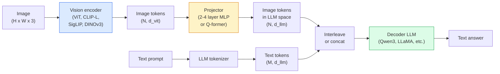

# 视觉语言模型——ViT-MLP-LLM 模式

> 视觉编码器把图像转换成 Token，MLP 投影器把这些 Token 映射到 LLM 的嵌入空间，再由语言模型完成其余工作。ViT-MLP-LLM 这一模式，就是 2026 年每个生产级 VLM 的基础。

**Type:** 学习 + 使用
**Languages:** Python
**Prerequisites:** 第 4 阶段第 14 课（ViT）、第 4 阶段第 18 课（CLIP）、第 7 阶段第 02 课（自注意力）
**Time:** 约 75 分钟

## 学习目标

- 说出 ViT-MLP-LLM 架构，并解释三个组件各自的作用
- 从参数量、上下文长度和基准表现方面比较 Qwen3-VL、InternVL3.5、LLaVA-Next 和 GLM-4.6V
- 解释 DeepStack：为何使用多个 ViT 层级的特征，比只使用最后一层特征能实现更紧密的视觉—语言对齐
- 在生产环境中使用跨模态错误率（CMER）衡量 VLM 幻觉，并根据这一信号采取行动

## 问题所在

CLIP（第 4 阶段第 18 课）为图像和文本提供共享嵌入空间，这足以完成零样本分类与检索，却无法回答“这张图中有多少辆红色汽车？”，因为 CLIP 不会生成文本，只会为相似度打分。

视觉语言模型（VLM）——Qwen3-VL、InternVL3.5、LLaVA-Next、GLM-4.6V——把 CLIP 家族图像编码器连接到完整语言模型。模型接收一张图像和一个问题，再生成答案。到 2026 年，开源 VLM 在多模态基准（MMMU、MMBench、DocVQA、ChartQA、MathVista、OSWorld）上已经追平或超过 GPT-5 与 Gemini-2.5-Pro。

三个组件（ViT、投影器、LLM）构成了标准模式。不同模型之间的区别在于选择哪种 ViT、投影器和 LLM，以及训练数据与对齐方案。理解这一模式后，替换任意组件都只是机械操作。

## 核心概念

### ViT-MLP-LLM 架构



1. **视觉编码器**——预训练 ViT，例如 CLIP-L/14、SigLIP、DINOv3 或经过微调的变体，负责生成 Patch Token。
2. **投影器**——一个小型模块，通常是 2–4 层 MLP 或 Q-former，把视觉 Token 映射到 LLM 的嵌入维度。大多数微调都发生在这里。
3. **LLM**——仅解码器语言模型，例如 Qwen3、Llama、Mistral、GLM 或 InternLM。它按顺序读取视觉与文本 Token，再生成文本。

原则上，三个组件都可以训练；实践中，视觉编码器和 LLM 通常基本冻结，只训练投影器——用很低成本承接数十亿参数模型中的信息。

### DeepStack

普通投影只使用 ViT 最后一层。DeepStack（Qwen3-VL）会从多个 ViT 深度抽取特征并堆叠。深层特征携带高层语义，浅层特征保留细粒度空间和纹理信息。把两者同时送入 LLM，可以缩小“图像中包含什么”（语义）与“它具体在哪里”（空间定位）之间的差距。

### 三个训练阶段

现代 VLM 分阶段训练：

1. **对齐**——冻结 ViT 和 LLM，只在图像—说明文字对上训练投影器，教它把视觉空间映射到语言空间。
2. **预训练**——解冻全部组件，在大规模交错图文数据（5 亿对以上）上训练，建立模型的视觉知识。
3. **指令微调**——在精心筛选的（图像，问题，答案）三元组上微调，教会模型对话行为和任务格式。这一步把“具备视觉感知能力的语言模型”变成真正可用的助手。

大多数 LoRA 微调会使用一份小型带标签数据集，针对第 3 阶段进行。

### 模型家族比较（2026 年初）

| 模型 | 参数量 | 视觉编码器 | LLM | 上下文 | 优势 |
|-------|--------|----------------|-----|---------|-----------|
| Qwen3-VL-235B-A22B (MoE) | 235B（22B 激活） | 自定义 ViT + DeepStack | Qwen3 | 256K | 综合性能领先、GUI Agent |
| Qwen3-VL-30B-A3B (MoE) | 30B（3B 激活） | 自定义 ViT + DeepStack | Qwen3 | 256K | 更小的 MoE 替代方案 |
| Qwen3-VL-8B (dense) | 8B | 自定义 ViT | Qwen3 | 128K | 生产级稠密模型默认选择 |
| InternVL3.5-38B | 38B | InternViT-6B | Qwen3 + GPT-OSS | 128K | MMBench / MMVet 表现强劲 |
| InternVL3.5-241B-A28B | 241B（28B 激活） | InternViT-6B | Qwen3 | 128K | 可与 GPT-4o 竞争 |
| LLaVA-Next 72B | 72B | SigLIP | Llama-3 | 32K | 开放、易于微调 |
| GLM-4.6V | 约 70B | 自定义 | GLM | 64K | 开源、OCR 能力强 |
| MiniCPM-V-2.6 | 8B | SigLIP | MiniCPM | 32K | 适合边缘设备 |

### 视觉 Agent

Qwen3-VL-235B 在 OSWorld 上达到全球领先水平。OSWorld 是评估操作 GUI（桌面、移动端、Web）的**视觉 Agent** 基准。模型查看屏幕截图、理解 UI，再输出点击、输入、滚动等操作。与工具组合后，它就能闭环完成常见桌面任务。2026 年大多数“AI PC”演示，底层运行的正是这类系统。

### Agent 能力与 RoPE 变体

VLM 需要知道视频中的某一帧发生在**何时**。Qwen3-VL 从 T-RoPE（时间旋转位置嵌入）演进到**基于文本的时间对齐**：在视频帧之间插入显式时间戳文本 Token。模型会看到“`<timestamp 00:32>` 帧，提示词”，并能够推理时间关系。

### 对齐问题

网络抓取数据集中，有 12% 的图文对所含描述并未完全以图像内容为依据。使用这类数据训练 VLM，会让模型悄悄学会幻觉：凭空捏造物体、错误读取数字、虚构关系。在生产环境中，这是最主要的失败模式。

Skywork.ai 提出了**跨模态错误率（CMER）**来追踪它：

```
CMER = fraction of outputs where the text confidence is high but the image-text similarity (via a CLIP-family checker) is low
```

CMER 较高，表示模型正在以很高置信度描述图像中没有依据的内容。他们在部署中持续监控 CMER，并把它作为生产 KPI，使幻觉率降低约 35%。诀窍并不是“修复模型”，而是“把高 CMER 输出转交人工审核”。

### 使用 LoRA / QLoRA 微调

大多数团队都无法完整微调 70B VLM。只在注意力层 + 投影器上使用秩为 16–64 的 LoRA，或者使用四位基础权重的 QLoRA，就能在单张 A100 / H100 上完成。成本通常是 5,000–50,000 个示例、100–5,000 美元计算费用，以及 2–10 小时训练。

### 空间推理仍然薄弱

当前 VLM 在空间推理基准上的得分只有 50%–60%，包括上下、左右、计数和距离任务，虽然高于随机水平，但仍低于人类。如果应用依赖“哪个物体位于哪个物体上方”，必须进行大量验证。纯空间任务更适合采用专业关键点/姿态估计器、深度模型，或者检测模型加上边界框几何后处理。

```figure
v4-vlm-projector
```

## 动手构建

### 第 1 步：投影器

这是你最常训练的部分，由 2–4 层带 GELU 的 MLP 组成。

```python
import torch
import torch.nn as nn


class Projector(nn.Module):
    def __init__(self, vit_dim=768, llm_dim=4096, hidden=4096):
        super().__init__()
        self.net = nn.Sequential(
            nn.Linear(vit_dim, hidden),
            nn.GELU(),
            nn.Linear(hidden, llm_dim),
        )

    def forward(self, x):
        return self.net(x)
```

输入是形状为 `(N_patches, d_vit)` 的 Token 张量，输出形状为 `(N_patches, d_llm)`。LLM 会把每一行输出都当作一个普通 Token。

### 第 2 步：端到端组装 ViT-MLP-LLM

下面是最小 VLM 的前向传播骨架。真实代码会使用 `transformers`；这里展示概念布局。

```python
class MinimalVLM(nn.Module):
    def __init__(self, vit, projector, llm, image_token_id):
        super().__init__()
        self.vit = vit
        self.projector = projector
        self.llm = llm
        self.image_token_id = image_token_id  # placeholder token in text prompt

    def forward(self, image, input_ids, attention_mask):
        # 1. vision features
        vision_tokens = self.vit(image)                     # (B, N_patches, d_vit)
        vision_embeds = self.projector(vision_tokens)       # (B, N_patches, d_llm)

        # 2. text embeddings
        text_embeds = self.llm.get_input_embeddings()(input_ids)  # (B, M, d_llm)

        # 3. replace image placeholder tokens with vision embeds
        merged = self._merge(text_embeds, vision_embeds, input_ids)

        # 4. run LLM
        return self.llm(inputs_embeds=merged, attention_mask=attention_mask)

    def _merge(self, text_embeds, vision_embeds, input_ids):
        out = text_embeds.clone()
        expected = vision_embeds.size(1)
        for b in range(input_ids.size(0)):
            positions = (input_ids[b] == self.image_token_id).nonzero(as_tuple=True)[0]
            if len(positions) != expected:
                raise ValueError(
                    f"batch item {b} has {len(positions)} image tokens but vision_embeds has {expected} patches."
                    " Every sample in the batch must be pre-padded to the same number of image placeholder tokens.")
            out[b, positions] = vision_embeds[b]
        return out
```

文本中的 `<image>` 占位 Token 会被真实图像嵌入替换——LLaVA、Qwen-VL 和 InternVL 使用的都是同一种模式。

### 第 3 步：计算 CMER

下面实现一项轻量运行时检查。

```python
import torch.nn.functional as F


def cross_modal_error_rate(image_emb, text_emb, text_confidence, sim_threshold=0.25, conf_threshold=0.8):
    """
    image_emb, text_emb: embeddings of image and generated text (normalised internally)
    text_confidence:     mean per-token probability in [0, 1]
    Returns:             fraction of high-confidence outputs with low image-text alignment
    """
    image_emb = F.normalize(image_emb, dim=-1)
    text_emb = F.normalize(text_emb, dim=-1)
    sim = (image_emb * text_emb).sum(dim=-1)        # cosine similarity
    high_conf_low_sim = (text_confidence > conf_threshold) & (sim < sim_threshold)
    return high_conf_low_sim.float().mean().item()
```

应把 CMER 当作生产 KPI，按端点、提示类型和客户分别监控。CMER 持续上升，表明模型开始在某种输入分布上产生幻觉。

### 第 4 步：玩具 VLM 分类器（可运行）

演示投影器确实能够训练。输入伪造的“ViT 特征”，再由一个类似 LLM 的小型 Token 预测类别。

```python
class ToyVLM(nn.Module):
    def __init__(self, vit_dim=32, llm_dim=64, num_classes=5):
        super().__init__()
        self.projector = Projector(vit_dim, llm_dim, hidden=64)
        self.head = nn.Linear(llm_dim, num_classes)

    def forward(self, vision_tokens):
        projected = self.projector(vision_tokens)
        pooled = projected.mean(dim=1)
        return self.head(pooled)
```

它可以在 200 步以内拟合合成（特征，类别）数据，足以证明投影器模式有效。

## 实际应用

2026 年，生产团队主要通过三种方式使用 VLM：

- **托管 API**——OpenAI Vision、Anthropic Claude Vision、Google Gemini Vision。无需基础设施，但存在供应商风险。
- **自托管开源模型**——通过 `transformers` 与 `vllm` 运行 Qwen3-VL 或 InternVL3.5。控制力完整，但前期投入更高。
- **在领域数据上微调**——加载 Qwen2.5-VL-7B 或 LLaVA-1.6-7B，使用 5k–50k 个自定义示例进行 LoRA 微调，再通过 `vllm` 或 `TGI` 提供服务。

```python
from transformers import AutoProcessor, AutoModelForVision2Seq
import torch
from PIL import Image

model_id = "Qwen/Qwen3-VL-8B-Instruct"
processor = AutoProcessor.from_pretrained(model_id)
model = AutoModelForVision2Seq.from_pretrained(model_id, torch_dtype=torch.bfloat16, device_map="auto")

messages = [{
    "role": "user",
    "content": [
        {"type": "image", "image": Image.open("plot.png")},
        {"type": "text", "text": "What does this chart show?"},
    ],
}]
inputs = processor.apply_chat_template(messages, add_generation_prompt=True, tokenize=True, return_dict=True, return_tensors="pt").to("cuda")
generated = model.generate(**inputs, max_new_tokens=256)
answer = processor.decode(generated[0][inputs["input_ids"].shape[1]:], skip_special_tokens=True)
```

`apply_chat_template` 会隐藏 `<image>` 占位符的 Token 化细节，模型在内部完成嵌入合并。

## 交付成果

本课会产出：

- `outputs/prompt-vlm-selector.md`——根据准确率、延迟、上下文长度和预算，在 Qwen3-VL / InternVL3.5 / LLaVA-Next / API 中作出选择。
- `outputs/skill-cmer-monitor.md`——生成生产 VLM 端点的跨模态错误率埋点、逐端点仪表盘和告警阈值代码。

## 练习

1. **（简单）** 在五张图像上，让任意开放 VLM 分别回答三个提示词：“这是什么？”“数一数物体”“描述场景”。手工把每个答案标记为正确/部分正确/幻觉，并计算一个初步的类 CMER 比例。
2. **（中等）** 使用秩 16 的 LoRA，在目标领域 500 张带说明文字的图像上微调 Qwen2.5-VL-3B 或 LLaVA-1.6-7B，比较零样本与微调后的 MMBench 风格准确率。
3. **（困难）** 用 DINOv3 替换 VLM 默认的 SigLIP/CLIP 图像编码器，只重新训练投影器，保持 LLM 与 DINOv3 冻结。测量计数、空间推理等稠密预测任务是否改善。

## 关键术语

| 术语 | 人们常说 | 实际含义 |
|------|----------------|----------------------|
| ViT-MLP-LLM | “VLM 模式” | 视觉编码器 + 投影器 + 语言模型，是每个 2026 年 VLM 的基本结构 |
| 投影器 | “桥梁” | 把视觉 Token 映射到 LLM 嵌入空间的 2–4 层 MLP 或 Q-former |
| DeepStack | “Qwen3-VL 特征技巧” | 堆叠多个 ViT 层级的特征，而不是只使用最后一层 |
| 图像 Token | “<image> 占位符” | 文本流中的特殊 Token，会被投影后的视觉嵌入替换 |
| CMER | “幻觉 KPI” | 跨模态错误率；文本置信度高、图文相似度却低时计为错误 |
| 视觉 Agent | “会点击的 VLM” | 通过工具调用操作桌面、移动端或 Web GUI（例如 OSWorld）的 VLM |
| Q-former | “固定数量 Token 的桥梁” | BLIP-2 风格的投影器，生成固定数量的视觉查询 Token |
| 对齐/预训练/指令微调 | “三个阶段” | VLM 的标准训练流水线 |

## 延伸阅读

- [Qwen3-VL 技术报告（arXiv 2511.21631）](https://arxiv.org/abs/2511.21631)
- [《InternVL3.5 Advancing Open-Source Multimodal Models》（arXiv 2508.18265）](https://arxiv.org/html/2508.18265v1)
- [LLaVA-Next 系列](https://llava-vl.github.io/blog/2024-05-10-llava-next-stronger-llms/)
- [BentoML：2026 年最佳开源 VLM](https://www.bentoml.com/blog/multimodal-ai-a-guide-to-open-source-vision-language-models)
- [MMMU：多学科多模态理解基准](https://mmmu-benchmark.github.io/)
- [制造业中的 VLM（Robotics Tomorrow，2026 年 3 月）](https://www.roboticstomorrow.com/story/2026/03/when-machines-learn-to-see-like-experts-the-rise-of-vision-language-models-in-manufacturing/26335/)
