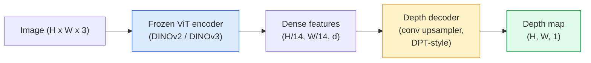

# 单目深度与几何估计

> 深度图是一张单通道图像，其中每个像素都表示到相机的距离。过去，如果没有双目相机或 LiDAR，就无法从单张 RGB 图像预测深度。到 2026 年，冻结的 ViT 编码器加一个轻量 Head，已经能把误差缩小到距真值仅几个百分点。

**Type:** 构建 + 使用
**Languages:** Python
**Prerequisites:** 第 4 阶段第 14 课（ViT）、第 4 阶段第 17 课（自监督视觉）、第 4 阶段第 07 课（U-Net）
**Time:** 约 60 分钟

## 学习目标

- 区分相对深度与度量深度，并说明各生产模型（MiDaS、Marigold、Depth Anything V3、ZoeDepth）解决的是哪一种问题
- 使用 Depth Anything V3（DINOv2 骨干网络）为任意单张图像预测深度，无需校准
- 解释为何只凭单张图像也能估计深度（透视线索、纹理梯度、学习到的先验），以及无法恢复哪些信息（绝对尺度、被遮挡几何）
- 使用深度图与针孔相机内参，把二维检测结果提升为三维点

## 问题所在

深度是二维计算机视觉中缺失的那条轴。给定 RGB，你知道物体出现在图像平面中的什么位置，却不知道它有多远。双目相机、LiDAR、飞行时间相机等深度传感器能直接解决这个问题，但它们价格高、较脆弱，而且测量范围有限。

单目深度估计，也就是从单张 RGB 图像预测深度，过去只能产生模糊、不可靠的结果。到 2026 年，大型预训练编码器改变了局面：Depth Anything V3 使用冻结的 DINOv2 骨干网络，生成的深度图可以泛化到室内、室外、医学和卫星等领域。Marigold 把深度重新表述为条件扩散问题，ZoeDepth 则回归真实度量距离。

深度也是二维检测与三维理解之间的桥梁：把检测框中的像素结合深度，就能把二维物体提升为三维点云。这是每个 AR 遮挡系统、避障流水线和执行“拿起杯子”任务的机器人的核心。

## 核心概念

### 相对深度与度量深度

- **相对深度**——没有真实世界单位的有序 `z` 值。“像素 A 比像素 B 更近，但两者距离之比没有锚定到米。”
- **度量深度**——从相机出发、以米计量的绝对距离。模型必须学会图像线索与真实距离之间的统计关系。

MiDaS 与 Depth Anything V3 生成相对深度，Marigold 也生成相对深度；ZoeDepth、UniDepth 和 Metric3D 则生成度量深度。度量模型对相机内参敏感，相对模型则不敏感。

### 编码器—解码器模式



Depth Anything V3 会冻结编码器，只训练 DPT 风格解码器。编码器提供丰富特征，解码器把特征插值回图像分辨率，并回归深度。

### 为什么单张图像也能产生深度

一张二维图像中包含许多与深度相关的单目线索：

- **透视：** 三维空间中的平行线会在二维图像中汇聚。
- **纹理梯度：** 距离较远的表面纹理更小、更密集。
- **遮挡顺序：** 较近物体会遮挡较远物体。
- **大小恒常性：** 汽车、人物等已知物体可以提供近似尺度。
- **空气透视：** 室外场景中，远处物体看起来更模糊、更偏蓝。

在数十亿张图像上训练的 ViT 会内化这些线索。有足够数据和强大骨干网络时，即使没有显式三维监督，单目深度也能达到合理准确率。

### 单目深度无法做到什么

- **没有相机内参或场景中已知物体时，无法恢复绝对度量尺度。** 网络可以预测“杯子的距离是勺子的两倍”，却无法知道杯子究竟在 1 米还是 10 米之外。
- **被遮挡的几何结构。** 椅子背面不可见，无法可靠推断。
- **真正缺乏纹理或具有反射的表面。** 例如镜子、玻璃和纯色墙面；网络会输出看似合理、实际错误的深度。

### 2026 年的 Depth Anything V3

- 使用普通 DINOv2 ViT-L/14 作为冻结编码器。
- 使用 DPT 解码器。
- 使用来自多种来源、带相机位姿的图像对训练；除了光度一致性，不需要显式深度监督。
- 能够从**任意数量的视觉输入中预测空间一致的几何结构，无论是否提供已知相机位姿**。
- 在单目深度、任意视角几何、视觉渲染和相机位姿估计上达到当前最佳水平。

2026 年需要深度时，可以直接调用这个模型。

### Marigold——用扩散估计深度

Marigold（Ke 等，CVPR 2024）把深度估计重新表述为条件图像到图像扩散。条件是 RGB，目标是深度图，骨干网络使用预训练 Stable Diffusion 2 U-Net。它生成的深度图在物体边界处格外清晰，代价是推理比前馈模型慢，需要 10–50 个去噪步骤。

### 相机内参与针孔相机

要把像素 `(u, v)` 结合深度 `d`，提升成相机坐标系中的三维点 `(X, Y, Z)`：

```
fx, fy, cx, cy = camera intrinsics
X = (u - cx) * d / fx
Y = (v - cy) * d / fy
Z = d
```

相机内参可以来自 EXIF 元数据、标定图案或单目内参估计器（Perspective Fields、UniDepth）。没有内参时，仍可以假设 60–70° 视场角和中等分辨率主点来渲染点云；这足以可视化，却不能用于测量。

### 评估

有两个标准指标：

- **AbsRel**（绝对相对误差）：`mean(|d_pred - d_gt| / d_gt)`，越低越好。生产模型通常达到 0.05–0.1。
- **delta < 1.25**（阈值准确率）：满足 `max(d_pred/d_gt, d_gt/d_pred) < 1.25` 的像素比例，越高越好。当前最佳模型可达到 0.9 以上。

评估相对深度模型（Depth Anything V3、MiDaS）时，应使用两种指标对尺度与平移保持不变的版本。

```figure
depth-sweep
```

## 动手构建

### 第 1 步：深度指标

```python
import torch

def abs_rel_error(pred, target, mask=None):
    if mask is not None:
        pred = pred[mask]
        target = target[mask]
    return (torch.abs(pred - target) / target.clamp(min=1e-6)).mean().item()


def delta_accuracy(pred, target, threshold=1.25, mask=None):
    if mask is not None:
        pred = pred[mask]
        target = target[mask]
    ratio = torch.maximum(pred / target.clamp(min=1e-6), target / pred.clamp(min=1e-6))
    return (ratio < threshold).float().mean().item()
```

评估前必须屏蔽无效深度像素，包括零、NaN 和饱和值。

### 第 2 步：尺度与平移对齐

评估相对深度模型时，先把预测与真值对齐。对 `a * pred + b = target` 进行最小二乘拟合：

```python
def align_scale_shift(pred, target, mask=None):
    if mask is not None:
        p = pred[mask]
        t = target[mask]
    else:
        p = pred.flatten()
        t = target.flatten()
    A = torch.stack([p, torch.ones_like(p)], dim=1)
    coeffs, *_ = torch.linalg.lstsq(A, t.unsqueeze(-1))
    a, b = coeffs[:2, 0]
    return a * pred + b
```

评估 MiDaS / Depth Anything 时，应先运行 `align_scale_shift`，再调用 `abs_rel_error`。

### 第 3 步：把深度提升为点云

```python
import numpy as np

def depth_to_point_cloud(depth, intrinsics):
    H, W = depth.shape
    fx, fy, cx, cy = intrinsics
    v, u = np.meshgrid(np.arange(H), np.arange(W), indexing="ij")
    z = depth
    x = (u - cx) * z / fx
    y = (v - cy) * z / fy
    return np.stack([x, y, z], axis=-1)


depth = np.random.uniform(0.5, 4.0, (240, 320))
intr = (320.0, 320.0, 160.0, 120.0)
pc = depth_to_point_cloud(depth, intr)
print(f"point cloud shape: {pc.shape}  (H, W, 3)")
```

一个函数即可支撑所有二维到三维提升应用。把点云导出为 `.ply`，就能在 MeshLab 或 CloudCompare 中打开。

### 第 4 步：使用合成深度场景进行冒烟测试

```python
def synthetic_depth(size=96):
    yy, xx = np.meshgrid(np.arange(size), np.arange(size), indexing="ij")
    # Floor: linear gradient from near (top) to far (bottom)
    depth = 1.0 + (yy / size) * 4.0
    # Box in the middle: closer
    mask = (np.abs(xx - size / 2) < size / 6) & (np.abs(yy - size * 0.6) < size / 6)
    depth[mask] = 2.0
    return depth.astype(np.float32)


gt = torch.from_numpy(synthetic_depth(96))
pred = gt + 0.3 * torch.randn_like(gt)  # simulated prediction
aligned = align_scale_shift(pred, gt)
print(f"before align  absRel = {abs_rel_error(pred, gt):.3f}")
print(f"after align   absRel = {abs_rel_error(aligned, gt):.3f}")
```

### 第 5 步：使用 Depth Anything V3（参考）

```python
import torch
from transformers import pipeline
from PIL import Image

pipe = pipeline(task="depth-estimation", model="LiheYoung/depth-anything-v2-large")

image = Image.open("street.jpg").convert("RGB")
out = pipe(image)
depth_np = np.array(out["depth"])
```

只需三行。`out["depth"]` 是 PIL 灰度图，应转换为 NumPy 后再进行数学运算。Depth Anything V3 正式发布后，只需替换模型 ID，API 保持不变。

## 实际应用

- **Depth Anything V3**（Meta AI / ByteDance，2024–2026）——相对深度的默认选择，是生产环境中速度最快的 ViT-Large 骨干模型。
- **Marigold**（ETH，2024）——视觉质量最高，但推理速度较慢。
- **UniDepth**（ETH，2024）——度量深度，并能估计相机内参。
- **ZoeDepth**（Intel，2023）——度量深度；虽然较旧，但依然可靠。
- **MiDaS v3.1**——旧方案但稳定，适合作为比较基线。

典型集成模式如下：

1. RGB 帧到达。
2. 深度模型生成深度图。
3. 检测器生成边界框。
4. 结合深度把边界框中心提升到三维；如果有点云，再进行融合。
5. 下游任务：AR 遮挡、路径规划、物体尺寸估计、替代双目视觉。

实时场景中，经过 INT8 量化的 Depth Anything V2 Small，可以在消费级 GPU 上以约 30 fps 处理 518x518 输入。

## 交付成果

本课会产出：

- `outputs/prompt-depth-model-picker.md`——根据延迟、度量/相对深度需求和场景类型，在 Depth Anything V3、Marigold、UniDepth 与 MiDaS 中作出选择。
- `outputs/skill-depth-to-pointcloud.md`——使用正确相机内参从深度图构建点云，并导出到 `.ply` 的技能。

## 练习

1. **（简单）** 在桌面的任意 10 张图像上运行 Depth Anything V2，把深度保存为灰度 PNG 并检查。找出一个预测深度错误的物体，并解释单目线索为何失效。
2. **（中等）** 使用 Depth Anything V2 得到的 RGB + 深度生成点云，并通过 `open3d` 渲染。比较一个室内场景和一个室外场景，记录哪一个看起来更可信。
3. **（困难）** 选择五对图像，每对都只改变一个已知物体的位置，例如把瓶子向相机移动 30 cm。使用 UniDepth 分别预测度量深度，并比较预测距离变化与真实 30 cm。

## 关键术语

| 术语 | 人们常说 | 实际含义 |
|------|----------------|----------------------|
| 单目深度 | “单张图像深度” | 只从一个 RGB 帧估计深度，不使用双目相机或 LiDAR |
| 相对深度 | “有序深度” | 没有真实世界单位的有序 z 值 |
| 度量深度 | “绝对距离” | 以米表示的深度，需要校准或使用度量监督训练的模型 |
| AbsRel | “绝对相对误差” | |d_pred - d_gt| / d_gt 的均值，是标准深度指标 |
| Delta 准确率 | “delta < 1.25” | 预测与真值之比位于 25% 范围内的像素比例 |
| 针孔相机 | “fx、fy、cx、cy” | 用于把 (u, v, d) 提升为 (X, Y, Z) 的相机模型 |
| DPT | “稠密预测 Transformer” | 位于冻结 ViT 编码器之上、用于深度估计的卷积解码器 |
| DINOv2 骨干网络 | “它有效的原因” | 无需深度标签即可跨领域泛化的自监督特征 |

## 延伸阅读

- [Depth Anything V3 论文页面](https://depth-anything.github.io/)——使用 DINOv2 编码器的顶尖单目深度模型
- [《Marigold》（Ke 等，CVPR 2024）](https://marigoldmonodepth.github.io/)——基于扩散的深度估计
- [《UniDepth》（Piccinelli 等，2024）](https://arxiv.org/abs/2403.18913)——结合相机内参的度量深度
- [MiDaS v3.1（Intel ISL）](https://github.com/isl-org/MiDaS)——经典相对深度基线
- [DINOv3 博文（Meta）](https://ai.meta.com/blog/dinov3-self-supervised-vision-model/)——提升深度估计准确率的编码器家族
