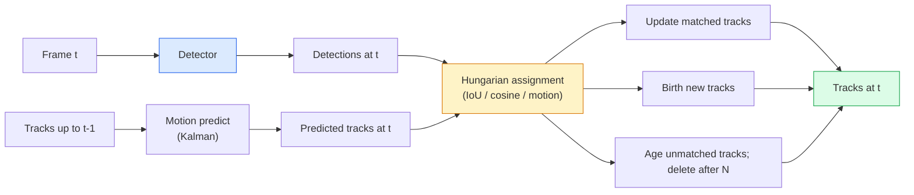

# 多目标跟踪与视频记忆

> 跟踪就是检测加关联。逐帧检测，再按 ID 将当前帧的检测结果与上一帧的轨迹匹配起来。

**Type:** 构建
**Languages:** Python
**Prerequisites:** 阶段 4 第 06 课（YOLO 检测）、阶段 4 第 08 课（Mask R-CNN）、阶段 4 第 24 课（SAM 3）
**Time:** 约 60 分钟

## 学习目标

- 区分基于检测的跟踪与基于查询的跟踪，并说出各算法家族（SORT、DeepSORT、ByteTrack、BoT-SORT、SAM 2 记忆跟踪器、SAM 3.1 Object Multiplex）
- 从零实现用于经典基于检测跟踪的 IoU 与匈牙利匹配
- 解释 SAM 2 的记忆库，以及它为何比基于 IoU 的关联更善于处理遮挡
- 读懂三种跟踪指标（MOTA、IDF1、HOTA），并针对具体用例选择最重要的指标

## 问题

检测器会告诉你单帧图像中的物体位于何处。跟踪器则会告诉你，第 `t` 帧中的哪个检测结果与第 `t-1` 帧中的某个检测结果属于同一物体。没有这层信息，你就无法统计穿过某条线的物体、跟随一颗被短暂遮挡的球，也无法知道“4 号车已经在这条车道里停留了 8 秒”。

跟踪是所有面向视频的产品都不可或缺的能力，包括体育分析、安防监控、自动驾驶、医学视频分析、野生动物监测和字标计数。它们共享一组核心构件：逐帧检测器、运动模型（卡尔曼滤波器或更丰富的模型）、关联步骤（在 IoU、余弦相似度或学习特征上运行匈牙利算法），以及轨迹的生命周期（创建、更新、终止）。

2026 年出现了两种新模式：**基于 SAM 2 记忆的跟踪**（以特征记忆取代运动模型关联）和 **SAM 3.1 Object Multiplex**（让同一概念的多个实例共享记忆）。本课会先讲解经典技术栈，再介绍基于记忆的方法。

## 概念

### 基于检测的跟踪



你在 2026 年会遇到的每一种跟踪器，都是这个循环的某种变体。区别如下：

- **SORT**（2016）：卡尔曼滤波器 + 基于 IoU 的匈牙利匹配。简单、快速，不使用外观模型。
- **DeepSORT**（2017）：在 SORT 上为每条轨迹增加一个基于 CNN 的外观特征（ReID 嵌入）。更善于处理物体交叉。
- **ByteTrack**（2021）：在第二阶段关联低置信度检测结果；不需要外观特征，却在 MOT17 上达到了顶尖表现。
- **BoT-SORT**（2022）：Byte + 相机运动补偿 + ReID。
- **StrongSORT / OC-SORT**——ByteTrack 的后继算法，采用了更好的运动与外观建模。

### 一段话讲清卡尔曼滤波器

卡尔曼滤波器为每条轨迹维护带协方差的状态 `(x, y, w, h, dx, dy, dw, dh)`。在每一帧中，先用恒定速度模型**预测**状态，再用匹配到的检测结果**更新**状态。预测的不确定性越高，更新过程就越信任检测结果。这样既能得到平滑的运动轨迹，也能让轨迹在短暂遮挡（1～5 帧）期间继续存在。

所有经典跟踪器都会在运动预测步骤中使用卡尔曼滤波器。

### 匈牙利算法

给定一个 `M x N` 的代价矩阵（轨迹 × 检测结果），找出使总代价最小的一对一分配。代价通常为 `1 - IoU(track_bbox, detection_bbox)`，或外观特征余弦相似度的负值。运行时间为 O((M+N)^3)；当 M、N 最大约为 1000 时，通过 `scipy.optimize.linear_sum_assignment` 在 Python 中运行已经足够快。

### ByteTrack 的关键思想

标准跟踪器会丢弃低置信度检测结果（< 0.5）。ByteTrack 则将它们保留为**第二阶段候选项**：轨迹与高置信度检测结果匹配后，尚未匹配的轨迹会尝试用略宽松的 IoU 阈值匹配低置信度检测结果。这可以找回短暂遮挡期间的目标，减少拥挤场景附近的 ID 切换。

### 基于 SAM 2 记忆的跟踪

SAM 2 通过保存每个实例的时空特征**记忆库**来处理视频。你在某一帧上提供提示（点击、框或文本）后，它会把该实例编码进记忆。在后续帧中，系统让记忆与新一帧的特征进行交叉注意力计算，解码器随后为新一帧中的同一实例生成掩码。

不需要卡尔曼滤波器，也不需要匈牙利匹配。关联关系隐含在记忆注意力运算中。

优点：
- 能抵抗长时间、大范围遮挡（记忆可跨越许多帧保留实例身份）。
- 与 SAM 3 的文本提示结合后支持开放词汇。
- 无须单独的运动模型即可工作。

缺点：
- 跟踪大量物体时比 ByteTrack 慢。
- 记忆库会不断增长，因此上下文窗口受到限制。

### SAM 3.1 对象多路复用（Object Multiplex）

先前的 SAM 2 / SAM 3 跟踪会为每个实例维护独立的记忆库。50 个物体就需要 50 个记忆库。Object Multiplex（2026 年 3 月）将它们合并为一份共享记忆，并配备**逐实例查询词元**。其成本随实例数量呈次线性增长。

Multiplex 是 2026 年拥挤场景跟踪的新默认方案，例如演唱会人群、仓库工人和交通路口。

### 必须了解的三项指标

- **MOTA（多目标跟踪准确率）**——1 - (FN + FP + ID 切换次数) / GT。按错误类型加权；它用一个指标混合衡量检测失败和关联失败。
- **IDF1（身份 F1）**——身份精确率与召回率的调和平均值。它专门关注每条真实轨迹在整个过程中保持自身 ID 的效果。对于对 ID 切换敏感的任务，它比 MOTA 更合适。
- **HOTA（高阶跟踪准确率）**——分解为检测准确率（DetA）与关联准确率（AssA）。它自 2020 年起成为社区标准，也是最全面的指标。

安防监控（谁是谁）应报告 IDF1；体育分析（统计传球）应选择 HOTA；一般学术比较也应使用 HOTA。

```figure
cv3-track-assoc
```

## 动手构建

### 第 1 步：基于 IoU 的代价矩阵

```python
import numpy as np


def bbox_iou(a, b):
    """
    a, b: (N, 4) arrays of [x1, y1, x2, y2].
    Returns (N_a, N_b) IoU matrix.
    """
    ax1, ay1, ax2, ay2 = a[:, 0], a[:, 1], a[:, 2], a[:, 3]
    bx1, by1, bx2, by2 = b[:, 0], b[:, 1], b[:, 2], b[:, 3]
    inter_x1 = np.maximum(ax1[:, None], bx1[None, :])
    inter_y1 = np.maximum(ay1[:, None], by1[None, :])
    inter_x2 = np.minimum(ax2[:, None], bx2[None, :])
    inter_y2 = np.minimum(ay2[:, None], by2[None, :])
    inter = np.clip(inter_x2 - inter_x1, 0, None) * np.clip(inter_y2 - inter_y1, 0, None)
    area_a = (ax2 - ax1) * (ay2 - ay1)
    area_b = (bx2 - bx1) * (by2 - by1)
    union = area_a[:, None] + area_b[None, :] - inter
    return inter / np.clip(union, 1e-8, None)
```

### 第 2 步：最小化的 SORT 风格跟踪器

为简洁起见，这里省略了固定恒定速度的卡尔曼滤波器，只使用简单的 IoU 关联；在生产环境中，卡尔曼预测必不可少。`sort` Python 包提供了完整版本。

```python
from scipy.optimize import linear_sum_assignment


class Track:
    def __init__(self, tid, bbox, frame):
        self.id = tid
        self.bbox = bbox
        self.last_frame = frame
        self.hits = 1

    def update(self, bbox, frame):
        self.bbox = bbox
        self.last_frame = frame
        self.hits += 1


class SimpleTracker:
    def __init__(self, iou_threshold=0.3, max_age=5):
        self.tracks = []
        self.next_id = 1
        self.iou_threshold = iou_threshold
        self.max_age = max_age

    def step(self, detections, frame):
        if not self.tracks:
            for d in detections:
                self.tracks.append(Track(self.next_id, d, frame))
                self.next_id += 1
            return [(t.id, t.bbox) for t in self.tracks]

        track_boxes = np.array([t.bbox for t in self.tracks])
        det_boxes = np.array(detections) if len(detections) else np.empty((0, 4))

        iou = bbox_iou(track_boxes, det_boxes) if len(det_boxes) else np.zeros((len(track_boxes), 0))
        cost = 1 - iou
        cost[iou < self.iou_threshold] = 1e6

        matched_track = set()
        matched_det = set()
        if cost.size > 0:
            row, col = linear_sum_assignment(cost)
            for r, c in zip(row, col):
                if cost[r, c] < 1.0:
                    self.tracks[r].update(det_boxes[c], frame)
                    matched_track.add(r); matched_det.add(c)

        for i, d in enumerate(det_boxes):
            if i not in matched_det:
                self.tracks.append(Track(self.next_id, d, frame))
                self.next_id += 1

        self.tracks = [t for t in self.tracks if frame - t.last_frame <= self.max_age]
        return [(t.id, t.bbox) for t in self.tracks]
```

60 行代码。输入逐帧检测结果，输出逐帧轨迹 ID。真实系统还会加入卡尔曼预测、ByteTrack 的第二阶段重新匹配以及外观特征。

### 第 3 步：合成轨迹测试

```python
def synthetic_frames(num_frames=20, num_objects=3, H=240, W=320, seed=0):
    rng = np.random.default_rng(seed)
    starts = rng.uniform(20, 200, size=(num_objects, 2))
    velocities = rng.uniform(-5, 5, size=(num_objects, 2))
    frames = []
    for f in range(num_frames):
        dets = []
        for i in range(num_objects):
            cx, cy = starts[i] + f * velocities[i]
            dets.append([cx - 10, cy - 10, cx + 10, cy + 10])
        frames.append(dets)
    return frames


tracker = SimpleTracker()
for f, dets in enumerate(synthetic_frames()):
    tracks = tracker.step(dets, f)
```

三个沿直线运动的物体应当在全部 20 帧中保持各自的 ID。

### 第 4 步：ID 切换指标

```python
def count_id_switches(tracks_per_frame, gt_per_frame):
    """
    tracks_per_frame:  list of list of (track_id, bbox)
    gt_per_frame:      list of list of (gt_id, bbox)
    Returns number of ID switches.
    """
    prev_assignment = {}
    switches = 0
    for tracks, gts in zip(tracks_per_frame, gt_per_frame):
        if not tracks or not gts:
            continue
        t_boxes = np.array([b for _, b in tracks])
        g_boxes = np.array([b for _, b in gts])
        iou = bbox_iou(g_boxes, t_boxes)
        for g_idx, (gt_id, _) in enumerate(gts):
            j = iou[g_idx].argmax()
            if iou[g_idx, j] > 0.5:
                t_id = tracks[j][0]
                if gt_id in prev_assignment and prev_assignment[gt_id] != t_id:
                    switches += 1
                prev_assignment[gt_id] = t_id
    return switches
```

这是一个与 IDF1 相近但经过简化的指标：统计真实物体被分配的预测轨迹 ID 发生了多少次变化。真正的 MOTA / IDF1 / HOTA 工具位于 `py-motmetrics` 和 `TrackEval` 中。

## 学以致用

2026 年的生产级跟踪器：

- `ultralytics`——内置 YOLOv8 + ByteTrack / BoT-SORT。`results = model.track(source, tracker="bytetrack.yaml")`。默认选择。
- `supervision`（Roboflow）——ByteTrack 封装及标注工具。
- SAM 2 / SAM 3.1——通过 `processor.track()` 进行基于记忆的跟踪。
- 自定义技术栈：检测器（YOLOv8 / RT-DETR）+ `sort-tracker` / `OC-SORT` / `StrongSORT`。

选择建议：

- 以 30+ fps 跟踪行人、车辆或检测框：**配合 ultralytics 使用 ByteTrack**。
- 跟踪拥挤场景中同一类别的大量实例：**SAM 3.1 Object Multiplex**。
- 遮挡严重且可通过外观辨认：**DeepSORT / StrongSORT**（ReID 特征）。
- 体育或复杂交互：**BoT-SORT** 或学习式跟踪器（MOTRv3）。

## 交付成果

本课将产出：

- `outputs/prompt-tracker-picker.md`——根据场景类型、遮挡模式和延迟预算，在 SORT / ByteTrack / BoT-SORT / SAM 2 / SAM 3.1 中选择跟踪器。
- `outputs/skill-mot-evaluator.md`——编写完整的评估工具，对照真实轨迹计算 MOTA / IDF1 / HOTA。

## 练习

1. **（简单）** 分别用 3、10 和 30 个物体运行上面的合成跟踪器。报告每种情况下的 ID 切换次数，并判断仅使用 IoU 的简单关联从哪里开始失效。
2. **（中等）** 在关联前增加恒定速度的卡尔曼预测步骤。证明短暂遮挡（2～3 帧）不再导致 ID 切换。
3. **（困难）** 集成 SAM 2 基于记忆的跟踪器（通过 `transformers`），作为另一个跟踪器后端。让 SimpleTracker 和 SAM 2 在一段 30 秒的拥挤人群视频上运行，手动标注 5 个显眼人物的真实 ID，然后比较 ID 切换次数。

## 关键术语

| 术语 | 人们通常怎么说 | 实际含义 |
|------|----------------|----------|
| 基于检测的跟踪 | “先检测，再关联” | 逐帧检测器 + 在 IoU / 外观特征上进行匈牙利匹配 |
| 卡尔曼滤波器 | “运动预测” | 线性动力学 + 协方差，用于生成平滑的轨迹预测并处理遮挡 |
| 匈牙利算法 | “最优分配” | 求解最小代价二分图匹配问题；`scipy.optimize.linear_sum_assignment` |
| ByteTrack | “低置信度第二轮” | 将未匹配轨迹与低置信度检测结果重新匹配，以找回短暂遮挡的目标 |
| DeepSORT | “SORT + 外观” | 增加 ReID 特征用于跨帧匹配；更善于保持 ID |
| 记忆库 | “SAM 2 的窍门” | 跨帧存储每个实例的时空特征；用交叉注意力取代显式关联 |
| Object Multiplex | “SAM 3.1 共享记忆” | 一份共享记忆配合逐实例查询，实现快速多目标跟踪 |
| HOTA | “现代跟踪指标” | 分解为检测准确率和关联准确率；社区标准 |

## 延伸阅读

- [SORT（Bewley 等，2016）](https://arxiv.org/abs/1602.00763)——最简洁的基于检测跟踪论文
- [DeepSORT（Wojke 等，2017）](https://arxiv.org/abs/1703.07402)——增加外观特征
- [ByteTrack（Zhang 等，2022）](https://arxiv.org/abs/2110.06864)——低置信度第二轮匹配
- [BoT-SORT（Aharon 等，2022）](https://arxiv.org/abs/2206.14651)——相机运动补偿
- [HOTA（Luiten 等，2020）](https://arxiv.org/abs/2009.07736)——分解式跟踪指标
- [SAM 2 视频分割（Meta，2024）](https://ai.meta.com/sam2/)——基于记忆的跟踪器
- [SAM 3.1 Object Multiplex（Meta，2026 年 3 月）](https://ai.meta.com/blog/segment-anything-model-3/)
