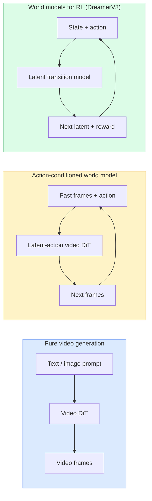

# 世界模型与视频扩散

> 能预测一个场景未来数秒变化的视频模型，就是世界模拟器。再让这种预测以动作作为条件，你便拥有了一个学习式游戏引擎。

**Type:** 学习 + 构建
**Languages:** Python
**Prerequisites:** 阶段 4 第 10 课（扩散）、阶段 4 第 12 课（视频理解）、阶段 4 第 23 课（DiT + 整流流）
**Time:** 约 75 分钟

## 学习目标

- 解释纯视频生成模型（Sora 2）与动作条件世界模型（Genie 3、DreamerV3）之间的区别
- 描述视频 DiT：时空图块、三维位置编码，以及跨 (T, H, W) 词元的联合注意力
- 追踪世界模型如何接入机器人系统：VLM 制订计划 → 视频模型进行模拟 → 逆动力学输出动作
- 针对特定用例（创意视频、交互式模拟、自动驾驶合成），在 Sora 2、Genie 3、Runway GWM-1 Worlds、Wan-Video 与 HunyuanVideo 之间作出选择

## 问题

到 2026 年，视频生成与世界建模已经汇流。从某种意义上说，能够生成一分钟连贯视频的模型已经学会了世界如何运动：物体恒存、重力、因果关系和风格。如果再让这种预测以动作（向左走、打开门）作为条件，视频模型就会变成一个可学习的模拟器，可以取代游戏引擎、驾驶模拟器或机器人环境。

这种变化的实际意义十分明确。Genie 3 能从单张图像生成可游玩的环境；Runway GWM-1 Worlds 能合成可无限探索的场景；Sora 2 能生成带同步音频和物理建模的分钟级视频；NVIDIA Cosmos-Drive、Wayve Gaia-2 和 Tesla DrivingWorld 则为自动驾驶训练数据生成逼真的驾驶视频。世界模型范式正在悄然接管机器人领域从模拟到现实的迁移过程。

本课是阶段 4 的“全局视角”课程。它将图像生成、视频理解与智能体推理连接成主流研究正在趋向的架构模式。

## 概念

### 世界建模的三个家族



- **Sora 2** 是以提示为条件的纯视频生成模型。它没有动作接口，生成过程中无法由你“操控”。
- **Genie 3**、**GWM-1 Worlds**、**Mirage / Magica** 是动作条件世界模型。它们先从观察到的视频中推断潜在动作，再让未来帧预测以这些动作为条件。它们具有交互性——你按下按键或移动相机，场景就会作出响应。
- **DreamerV3** 和经典的强化学习世界模型家族在潜在空间中进行预测，使用显式动作条件，并以奖励信号训练。视觉效果较弱，但更适合样本高效的强化学习。

### 视频 DiT 架构

```
Video latent:          (C, T, H, W)
Patchify (spatial):    grid of P_h x P_w patches per frame
Patchify (temporal):   group P_t frames into a temporal patch
Resulting tokens:      (T / P_t) * (H / P_h) * (W / P_w) tokens
```

位置编码是三维的：每个 (t, h, w) 坐标都有一个旋转嵌入或学习式嵌入。注意力可以采用以下形式：

- **完全联合注意力**——所有词元都关注其他所有词元。N 个词元的复杂度为 O(N^2)，对于长视频来说代价高得难以承受。
- **分解注意力**——交替执行时间注意力（同一空间位置，跨越时间：`(H*W) * T^2`）与空间注意力（同一时间步，跨越空间：`T * (H*W)^2`）。TimeSformer 和大多数视频 DiT 都采用这种方法。
- **窗口注意力**——在 (t, h, w) 中划分局部窗口。Video Swin 使用这种方法。

2026 年的每一种视频扩散模型，都会采用以上三种模式之一，并结合 AdaLN 条件机制（第 23 课）和整流流。

### 以动作作为条件：潜在动作模型

Genie 通过判别式地预测一对连续帧之间的动作，为每一帧学习一个**潜在动作**。随后，模型的解码器以推断出的潜在动作为条件，而不是以明确的键盘按键为条件。在推理时，用户可以指定一个潜在动作（或从新的先验分布中采样一个），模型便会生成与该动作一致的下一帧。

Sora 完全省略了动作接口。它的解码器根据过去的时空词元预测后续时空词元。提示只决定开端，生成过程中没有任何机制可以操控它。

### 物理合理性

Sora 2 在 2026 年发布时明确宣传了**物理合理性**：重量、平衡、物体恒存和因果关系。团队通过人工评定的合理性分数来衡量这些能力；与 Sora 1 相比，该模型在物体掉落、角色碰撞和故意失败（例如一次没跳成功）等场景中都有肉眼可见的进步。

合理性仍是最主要的失败模式。2024～2025 年间，人们吃意大利面或用玻璃杯喝水的视频暴露了模型缺乏持久物体表示的问题。2026 年的模型（Sora 2、Runway Gen-5、HunyuanVideo）减少了这类问题，但尚未将其消除。

### 自动驾驶世界模型

驾驶世界模型会生成以轨迹、边界框或导航地图为条件的逼真道路场景。用途包括：

- **Cosmos-Drive-Dreams**（NVIDIA）——生成数分钟驾驶视频，用于强化学习训练。
- **Gaia-2**（Wayve）——为策略评估合成以轨迹为条件的场景。
- **DrivingWorld**（Tesla）——模拟各种天气、时段和交通状况。
- **Vista**（字节跳动）——响应式驾驶场景合成。

它们可以替代昂贵的真实世界数据采集，用于覆盖原本需要行驶数百万英里才能遇到的边缘情况，例如行人在夜间横穿马路、结冰的十字路口以及少见的车辆类型。

### 机器人技术栈：VLM + 视频模型 + 逆动力学

正在兴起的三组件机器人循环如下：

1. **VLM** 解析目标（“拿起红色杯子”），并规划高层动作序列。
2. **视频生成模型**模拟执行每个动作时会出现的情景——提前预测 N 帧后的观察结果。
3. **逆动力学模型**提取能够产生这些观察结果的具体电机指令。

这套方案取代了奖励塑形和需要大量样本的强化学习。世界模型负责想象，逆动力学则在执行环节闭合循环。Genie Envisioner 是一种具体实现，许多研究团队都在向这一结构汇聚。

### 评估

- **视觉质量**——FVD（Fréchet Video Distance）、用户研究。
- **提示对齐**——逐帧 CLIPScore、VQA 风格评估。
- **物理合理性**——在基准套件上由人工评分（Sora 2 的内部基准、VBench）。
- **可控性**（用于交互式世界模型）——动作 → 观察的一致性；能否返回到先前状态？

### 2026 年的模型版图

| 模型 | 用途 | 参数量 | 输出 | 许可证 |
|-------|-----|------------|--------|---------|
| Sora 2 | 文本生成视频、音频 | — | 1 分钟 1080p + 音频 | 仅 API |
| Runway Gen-5 | 文本/图像生成视频 | — | 10 秒片段 | API |
| Runway GWM-1 Worlds | 交互式世界 | — | 无限三维演进 | API |
| Genie 3 | 从图像生成交互式世界 | 11B+ | 可游玩的画面 | 研究预览 |
| Wan-Video 2.1 | 开放式文本生成视频 | 14B | 高质量片段 | 非商业用途 |
| HunyuanVideo | 开放式文本生成视频 | 13B | 10 秒片段 | 宽松许可 |
| Cosmos / Cosmos-Drive | 自动驾驶模拟 | 7-14B | 驾驶场景 | NVIDIA 开放许可 |
| Magica / Mirage 2 | AI 原生游戏引擎 | — | 可修改的世界 | 产品 |

```figure
v4-world-rollout
```

## 动手构建

### 第 1 步：对视频进行三维图块化

```python
import torch
import torch.nn as nn


class VideoPatch3D(nn.Module):
    def __init__(self, in_channels=4, dim=64, patch_t=2, patch_h=2, patch_w=2):
        super().__init__()
        self.proj = nn.Conv3d(
            in_channels, dim,
            kernel_size=(patch_t, patch_h, patch_w),
            stride=(patch_t, patch_h, patch_w),
        )
        self.patch_t = patch_t
        self.patch_h = patch_h
        self.patch_w = patch_w

    def forward(self, x):
        # x: (N, C, T, H, W)
        x = self.proj(x)
        n, c, t, h, w = x.shape
        tokens = x.reshape(n, c, t * h * w).transpose(1, 2)
        return tokens, (t, h, w)
```

步幅与卷积核大小相同的三维卷积可以充当时空图块划分器。它把 `(T, H, W) -> (T/2, H/2, W/2)` 转换成词元网格。

### 第 2 步：三维旋转位置编码

分别沿 `t`、`h`、`w` 轴应用旋转位置嵌入（RoPE）：

```python
def rope_3d(tokens, t_dim, h_dim, w_dim, grid):
    """
    tokens: (N, T*H*W, D)
    grid: (T, H, W) sizes
    t_dim + h_dim + w_dim == D
    """
    T, H, W = grid
    n, seq, d = tokens.shape
    if t_dim + h_dim + w_dim != d:
        raise ValueError(f"t_dim+h_dim+w_dim ({t_dim}+{h_dim}+{w_dim}) must equal D={d}")
    assert seq == T * H * W
    t_idx = torch.arange(T, device=tokens.device).repeat_interleave(H * W)
    h_idx = torch.arange(H, device=tokens.device).repeat_interleave(W).repeat(T)
    w_idx = torch.arange(W, device=tokens.device).repeat(T * H)
    # Simplified: just scale channels by frequencies. Real RoPE rotates pairs.
    freqs_t = torch.exp(-torch.log(torch.tensor(10000.0)) * torch.arange(t_dim // 2, device=tokens.device) / (t_dim // 2))
    freqs_h = torch.exp(-torch.log(torch.tensor(10000.0)) * torch.arange(h_dim // 2, device=tokens.device) / (h_dim // 2))
    freqs_w = torch.exp(-torch.log(torch.tensor(10000.0)) * torch.arange(w_dim // 2, device=tokens.device) / (w_dim // 2))
    emb_t = torch.cat([torch.sin(t_idx[:, None] * freqs_t), torch.cos(t_idx[:, None] * freqs_t)], dim=-1)
    emb_h = torch.cat([torch.sin(h_idx[:, None] * freqs_h), torch.cos(h_idx[:, None] * freqs_h)], dim=-1)
    emb_w = torch.cat([torch.sin(w_idx[:, None] * freqs_w), torch.cos(w_idx[:, None] * freqs_w)], dim=-1)
    return tokens + torch.cat([emb_t, emb_h, emb_w], dim=-1)
```

这里使用了简化的加法形式。真正的 RoPE 会按不同频率旋转成对通道；所携带的位置信息相同。

### 第 3 步：分解注意力块

```python
class DividedAttentionBlock(nn.Module):
    def __init__(self, dim=64, heads=2):
        super().__init__()
        self.time_attn = nn.MultiheadAttention(dim, heads, batch_first=True)
        self.space_attn = nn.MultiheadAttention(dim, heads, batch_first=True)
        self.ln1 = nn.LayerNorm(dim)
        self.ln2 = nn.LayerNorm(dim)
        self.ln3 = nn.LayerNorm(dim)
        self.mlp = nn.Sequential(nn.Linear(dim, 4 * dim), nn.GELU(), nn.Linear(4 * dim, dim))

    def forward(self, x, grid):
        T, H, W = grid
        n, seq, d = x.shape
        # time attention: same (h, w), across t
        xt = x.view(n, T, H * W, d).permute(0, 2, 1, 3).reshape(n * H * W, T, d)
        a, _ = self.time_attn(self.ln1(xt), self.ln1(xt), self.ln1(xt), need_weights=False)
        xt = (xt + a).reshape(n, H * W, T, d).permute(0, 2, 1, 3).reshape(n, seq, d)
        # space attention: same t, across (h, w)
        xs = xt.view(n, T, H * W, d).reshape(n * T, H * W, d)
        a, _ = self.space_attn(self.ln2(xs), self.ln2(xs), self.ln2(xs), need_weights=False)
        xs = (xs + a).reshape(n, T, H * W, d).reshape(n, seq, d)
        xs = xs + self.mlp(self.ln3(xs))
        return xs
```

时间注意力在同一空间位置内跨时间计算注意力；空间注意力则在同一帧内跨位置计算注意力。它使用两次 O(T^2 + (HW)^2) 运算，取代一次 O((THW)^2) 运算。这是 TimeSformer 和所有现代视频 DiT 的核心。

### 第 4 步：组合一个微型视频 DiT

```python
class TinyVideoDiT(nn.Module):
    def __init__(self, in_channels=4, dim=64, depth=2, heads=2):
        super().__init__()
        self.patch = VideoPatch3D(in_channels=in_channels, dim=dim, patch_t=2, patch_h=2, patch_w=2)
        self.blocks = nn.ModuleList([DividedAttentionBlock(dim, heads) for _ in range(depth)])
        self.out = nn.Linear(dim, in_channels * 2 * 2 * 2)

    def forward(self, x):
        tokens, grid = self.patch(x)
        for blk in self.blocks:
            tokens = blk(tokens, grid)
        return self.out(tokens), grid
```

它不是一个真正可用的视频生成器，而是一个用于验证每个部分形状是否正确的结构演示。

### 第 5 步：检查形状

```python
vid = torch.randn(1, 4, 8, 16, 16)  # (N, C, T, H, W)
model = TinyVideoDiT()
out, grid = model(vid)
print(f"input  {tuple(vid.shape)}")
print(f"tokens grid {grid}")
print(f"output {tuple(out.shape)}")
```

图块化之后，预期得到 `grid = (4, 8, 8)` 和 `out = (1, 256, 32)`；随后，输出头会投影成逐词元的时空图块，准备通过反图块化还原成视频。

## 学以致用

2026 年的生产访问方式：

- **Sora 2 API**（OpenAI）——文本生成视频、同步音频，定价较高。
- **Runway Gen-5 / GWM-1**（Runway）——图像生成视频、交互式世界。
- **Wan-Video 2.1 / HunyuanVideo**——开源、自托管。
- **Cosmos / Cosmos-Drive**（NVIDIA）——开放权重的驾驶模拟。
- **Genie 3**——研究预览版，需要申请访问权限。

要构建交互式世界模型演示，可以先用 Wan-Video 获得生成质量，再叠加潜在动作适配器来实现交互。要进行自动驾驶模拟，Cosmos-Drive 是 2026 年的开放参考方案。

实际使用的机器人技术栈如下：

1. 语言目标 -> VLM（Qwen3-VL）-> 高层计划。
2. 计划 -> 潜在动作视频模型 -> 想象出的演进过程。
3. 演进过程 -> 逆动力学模型 -> 低层动作。
4. 执行动作 -> 将观察结果反馈至第 1 步。

## 交付成果

本课将产出：

- `outputs/prompt-video-model-picker.md`——根据任务、许可证和延迟要求，在 Sora 2 / Runway / Wan / HunyuanVideo / Cosmos 之间作出选择。
- `outputs/skill-physical-plausibility-checks.md`——定义一组自动检查（物体恒存、重力、连续性），在任何生成视频交付前运行。

## 练习

1. **（简单）** 计算一段 5 秒 360p 视频在 patch-t=2、patch-h=8、patch-w=8 时的词元数量，并分析这种规模下注意力所需的内存。
2. **（中等）** 将上面的分解注意力块替换为完全联合注意力块，测量形状与参数量，并解释真实视频模型为何必须使用分解注意力。
3. **（困难）** 构建一个最小化的潜在动作视频模型：获取由 (frame_t, action_t, frame_{t+1}) 三元组组成的数据集（任意简单二维游戏均可），训练一个以动作嵌入为条件的微型视频 DiT，并展示不同动作会生成不同的下一帧。

## 关键术语

| 术语 | 人们通常怎么说 | 实际含义 |
|------|----------------|----------|
| 世界模型 | “学习式模拟器” | 根据状态和动作预测未来观察结果的模型 |
| 视频 DiT | “时空 Transformer” | 使用三维图块化和分解注意力的扩散 Transformer |
| 潜在动作 | “推断出的控制” | 从帧对中推断出的离散或连续潜在动作；用于限定下一帧生成 |
| 分解注意力 | “先时间，后空间” | 每个块执行两次注意力运算——先跨时间，再跨空间——使 O(N^2) 保持在可控范围内 |
| 物体恒存 | “东西始终真实存在” | 视频模型必须学会的一种场景属性；在食物和玻璃器皿上经常失效 |
| FVD | “Fréchet 视频距离” | FID 的视频对应指标；主要的视觉质量指标 |
| 逆动力学模型 | “从观察到动作” | 给定（状态、下一状态），输出连接二者的动作；闭合机器人循环 |
| Cosmos-Drive | “NVIDIA 驾驶模拟器” | 用于强化学习和评估的开放权重自动驾驶世界模型 |

## 延伸阅读

- [Sora 技术报告（OpenAI）](https://openai.com/index/video-generation-models-as-world-simulators/)
- [Genie：生成式交互环境（Bruce 等，2024）](https://arxiv.org/abs/2402.15391)——潜在动作世界模型
- [TimeSformer（Bertasius 等，2021）](https://arxiv.org/abs/2102.05095)——用于视频 Transformer 的分解注意力
- [DreamerV3（Hafner 等，2023）](https://arxiv.org/abs/2301.04104)——用于强化学习的世界模型
- [Cosmos-Drive-Dreams（NVIDIA，2025）](https://research.nvidia.com/labs/toronto-ai/cosmos-drive-dreams/)——驾驶世界模型
- [2026 年十大视频生成模型（DataCamp）](https://www.datacamp.com/blog/top-video-generation-models)
- [从视频生成到世界模型——调研资源库](https://github.com/ziqihuangg/Awesome-From-Video-Generation-to-World-Model/)
