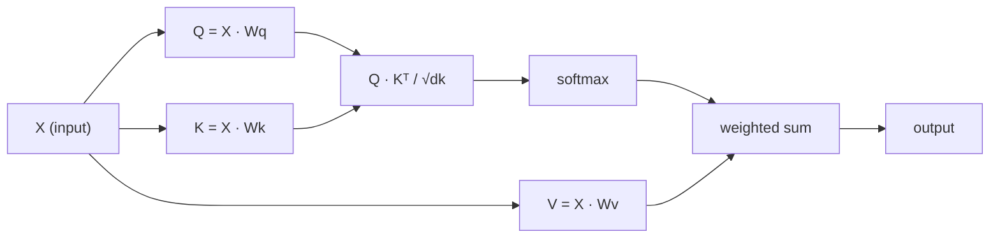

# 从零实现自注意力

> 注意力就像一张查找表，每个词都在问“谁对我重要？”——并通过学习得到答案。

**Type:** 构建
**Languages:** Python
**Prerequisites:** 阶段 3（深度学习核心）、阶段 5 第 10 课（序列到序列）
**Time:** 约 90 分钟

## 学习目标

- 仅使用 NumPy 从零实现缩放点积自注意力，包括查询/键/值投影与 softmax 加权求和
- 构建一个多头注意力层：拆分各个头、并行计算注意力，再拼接结果
- 追踪注意力矩阵如何捕捉词元关系，并解释除以 sqrt(d_k) 为何能防止 softmax 饱和
- 应用因果掩码，把双向注意力转换为自回归（解码器式）注意力

## 问题

RNN 每次处理一个词元。当处理到第 50 个词元时，来自第 1 个词元的信息已经经过 50 次压缩。长距离依赖会被挤进定长隐藏状态——无论增加多少 LSTM 门控，都无法彻底解决这个瓶颈。

Bahdanau 在 2014 年发表的注意力论文给出了解法：让解码器回头查看编码器的每个位置，并判断哪些位置对当前步骤重要。但那时，注意力仍然只是附加在 RNN 上的组件。2017 年的论文《Attention Is All You Need》提出了一个更尖锐的问题：如果注意力是*唯一*机制呢？没有循环，没有卷积，只有注意力。

自注意力让序列中的每个位置在一个并行步骤中关注其他所有位置。正因如此，Transformer 才会快速、易于扩展并占据主导地位。

## 概念

### 数据库查询类比

可以把注意力理解为一次软数据库查询：

```
Traditional database:
  Query: "capital of France"  -->  exact match  -->  "Paris"

Attention:
  Query: "capital of France"  -->  similarity to ALL keys  -->  weighted blend of ALL values
```

每个词元都会生成三个向量：
- **查询（Q）**：“我在寻找什么？”
- **键（K）**：“我包含什么？”
- **值（V）**：“如果选中我，我能提供什么信息？”

一个查询与所有键之间的点积会生成注意力分数。分数越高，表示“这个键越匹配我的查询”。这些分数用于对值加权，最终输出是值的加权和。

### Q、K、V 计算

每个词元嵌入都会通过三个学习得到的权重矩阵进行投影：

```
Input embeddings (sequence of n tokens, each d-dimensional):

  X = [x1, x2, x3, ..., xn]       shape: (n, d)

Three weight matrices:

  Wq  shape: (d, dk)
  Wk  shape: (d, dk)
  Wv  shape: (d, dv)

Projections:

  Q = X @ Wq    shape: (n, dk)      each token's query
  K = X @ Wk    shape: (n, dk)      each token's key
  V = X @ Wv    shape: (n, dv)      each token's value
```

对于单个词元，可以这样直观表示：

```
             Wq
  x_i ------[*]------> q_i    "What am I looking for?"
       |
       |     Wk
       +----[*]------> k_i    "What do I contain?"
       |
       |     Wv
       +----[*]------> v_i    "What do I offer?"
```

### 注意力矩阵

得到所有词元的 Q、K、V 后，注意力分数会形成一个矩阵：

```
Scores = Q @ K^T    shape: (n, n)

              k1    k2    k3    k4    k5
        +-----+-----+-----+-----+-----+
   q1   | 2.1 | 0.3 | 0.1 | 0.8 | 0.2 |   <- how much q1 attends to each key
        +-----+-----+-----+-----+-----+
   q2   | 0.4 | 1.9 | 0.7 | 0.1 | 0.3 |
        +-----+-----+-----+-----+-----+
   q3   | 0.2 | 0.6 | 2.3 | 0.5 | 0.1 |
        +-----+-----+-----+-----+-----+
   q4   | 0.9 | 0.1 | 0.4 | 1.7 | 0.6 |
        +-----+-----+-----+-----+-----+
   q5   | 0.1 | 0.3 | 0.2 | 0.5 | 2.0 |
        +-----+-----+-----+-----+-----+

Each row: one token's attention over the entire sequence
```

逐个观察查询如何扫过所有键：每一行都会为所有词元评分，softmax 把分数转换成权重，上下文向量则是所有值的加权组合。

```figure
attention-matrix
```

### 为什么要缩放？

点积会随维度 dk 增大。如果 dk = 64，点积可能达到几十，使 softmax 进入梯度消失的区域。解决办法是除以 sqrt(dk)。

```
Scaled scores = (Q @ K^T) / sqrt(dk)
```

这样可以让数值保持在 softmax 能产生有效梯度的范围内。

### Softmax 把分数转换为权重

Softmax 把原始分数转换为每一行上的概率分布：

```
Raw scores for q1:   [2.1, 0.3, 0.1, 0.8, 0.2]
                            |
                         softmax
                            |
Attention weights:   [0.52, 0.09, 0.07, 0.14, 0.08]   (sums to ~1.0)
```

现在，每个词元都有一组权重，表示它应该对其他每个词元投入多少注意力。

### 值的加权和

每个词元的最终输出，是所有值向量的加权和：

```
output_i = sum( attention_weight[i][j] * v_j  for all j )

For token 1:
  output_1 = 0.52 * v1 + 0.09 * v2 + 0.07 * v3 + 0.14 * v4 + 0.08 * v5
```

### 完整流水线



用一行公式表示：

```
Attention(Q, K, V) = softmax( Q @ K^T / sqrt(dk) ) @ V
```

```figure
softmax-attention-scaling
```

## 动手构建

### 第 1 步：从零实现 Softmax

Softmax 把原始 logits 转换为概率。先减去最大值，以保证数值稳定。

```python
import numpy as np

def softmax(x):
    shifted = x - np.max(x, axis=-1, keepdims=True)
    exp_x = np.exp(shifted)
    return exp_x / np.sum(exp_x, axis=-1, keepdims=True)

logits = np.array([2.0, 1.0, 0.1])
print(f"logits:  {logits}")
print(f"softmax: {softmax(logits)}")
print(f"sum:     {softmax(logits).sum():.4f}")
```

### 第 2 步：缩放点积注意力

这是核心函数。它接收 Q、K、V 矩阵，返回注意力输出与权重矩阵。

```python
def scaled_dot_product_attention(Q, K, V):
    dk = Q.shape[-1]
    scores = Q @ K.T / np.sqrt(dk)
    weights = softmax(scores)
    output = weights @ V
    return output, weights
```

### 第 3 步：带学习式投影的自注意力类

下面是完整的自注意力模块，Wq、Wk、Wv 权重矩阵采用类似 Xavier 的缩放方式初始化。

```python
class SelfAttention:
    def __init__(self, d_model, dk, dv, seed=42):
        rng = np.random.default_rng(seed)
        scale = np.sqrt(2.0 / (d_model + dk))
        self.Wq = rng.normal(0, scale, (d_model, dk))
        self.Wk = rng.normal(0, scale, (d_model, dk))
        scale_v = np.sqrt(2.0 / (d_model + dv))
        self.Wv = rng.normal(0, scale_v, (d_model, dv))
        self.dk = dk

    def forward(self, X):
        Q = X @ self.Wq
        K = X @ self.Wk
        V = X @ self.Wv
        output, weights = scaled_dot_product_attention(Q, K, V)
        return output, weights
```

### 第 4 步：在句子上运行

为一个句子创建模拟嵌入，并观察注意力权重。

```python
sentence = ["The", "cat", "sat", "on", "the", "mat"]
n_tokens = len(sentence)
d_model = 8
dk = 4
dv = 4

rng = np.random.default_rng(42)
X = rng.normal(0, 1, (n_tokens, d_model))

attn = SelfAttention(d_model, dk, dv, seed=42)
output, weights = attn.forward(X)

print("Attention weights (each row: where that token looks):\n")
print(f"{'':>6}", end="")
for token in sentence:
    print(f"{token:>6}", end="")
print()

for i, token in enumerate(sentence):
    print(f"{token:>6}", end="")
    for j in range(n_tokens):
        w = weights[i][j]
        print(f"{w:6.3f}", end="")
    print()
```

### 第 5 步：使用 ASCII 热力图可视化注意力

把注意力权重映射为字符，快速得到可视化结果。

```python
def ascii_heatmap(weights, tokens, chars=" ░▒▓█"):
    n = len(tokens)
    print(f"\n{'':>6}", end="")
    for t in tokens:
        print(f"{t:>6}", end="")
    print()

    for i in range(n):
        print(f"{tokens[i]:>6}", end="")
        for j in range(n):
            level = int(weights[i][j] * (len(chars) - 1) / weights.max())
            level = min(level, len(chars) - 1)
            print(f"{'  ' + chars[level] + '   '}", end="")
        print()

ascii_heatmap(weights, sentence)
```

## 学以致用

PyTorch 的 `nn.MultiheadAttention` 完成的正是我们刚刚构建的操作，并额外加入多头拆分和输出投影：

```python
import torch
import torch.nn as nn

d_model = 8
n_heads = 2
seq_len = 6

mha = nn.MultiheadAttention(embed_dim=d_model, num_heads=n_heads, batch_first=True)

X_torch = torch.randn(1, seq_len, d_model)

output, attn_weights = mha(X_torch, X_torch, X_torch)

print(f"Input shape:            {X_torch.shape}")
print(f"Output shape:           {output.shape}")
print(f"Attention weight shape: {attn_weights.shape}")
print(f"\nAttn weights (averaged over heads):")
print(attn_weights[0].detach().numpy().round(3))
```

关键区别是：多头注意力并行运行多个注意力函数，每个函数都有自己的 Q、K、V 投影，大小为 dk = d_model / n_heads；最后再拼接结果。这样模型就能同时关注不同类型的关系。

## 交付成果

本课将产出：
- `outputs/prompt-attention-explainer.md`——通过数据库查找类比解释注意力的提示词

## 练习

1. 修改 `scaled_dot_product_attention`，让它接收可选掩码矩阵，在 softmax 前把特定位置设为负无穷（因果/解码器掩码正是这样实现的）
2. 从零实现多头注意力：把 Q、K、V 拆成 `n_heads` 份，在每个头上运行注意力，拼接结果，再通过最终权重矩阵 Wo 投影
3. 取两个长度相同、内容不同的句子，送入同一个 SelfAttention 实例，并比较其注意力模式。哪些发生变化？哪些保持不变？

## 关键术语

| 术语 | 人们通常怎么说 | 实际含义 |
|------|-----------------|-----------------------|
| 查询（Q） | “问题向量” | 输入经过学习式投影后的表示，表达该词元正在寻找什么信息。 |
| 键（K） | “标签向量” | 表达该词元包含什么信息的学习式投影，用于与查询匹配。 |
| 值（V） | “内容向量” | 携带实际信息的学习式投影，会依据注意力分数被聚合。 |
| 缩放点积注意力 | “注意力公式” | softmax(QK^T / sqrt(dk)) @ V——缩放可防止高维下 softmax 饱和。 |
| 自注意力 | “词元查看自身与其他词元” | Q、K、V 都来自同一序列的注意力，使每个位置都能关注其他所有位置。 |
| 注意力权重 | “投入多少关注” | 对缩放点积执行 softmax 后得到的、覆盖各位置的概率分布。 |
| 多头注意力 | “并行注意力” | 使用不同投影运行多个注意力函数，再拼接结果以获得更丰富的表示。 |

## 延伸阅读

- [Attention Is All You Need（Vaswani 等，2017）](https://arxiv.org/abs/1706.03762)——原始 Transformer 论文
- [The Illustrated Transformer（Jay Alammar）](https://jalammar.github.io/illustrated-transformer/)——完整架构最佳图解
- [The Annotated Transformer（Harvard NLP）](https://nlp.seas.harvard.edu/annotated-transformer/)——带逐行说明的 PyTorch 实现
