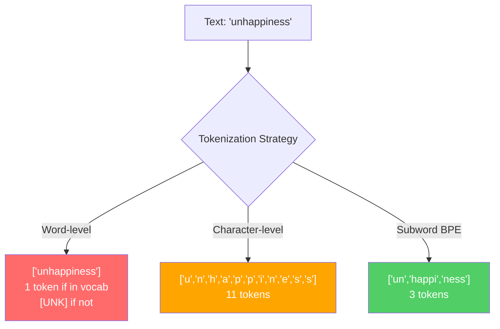
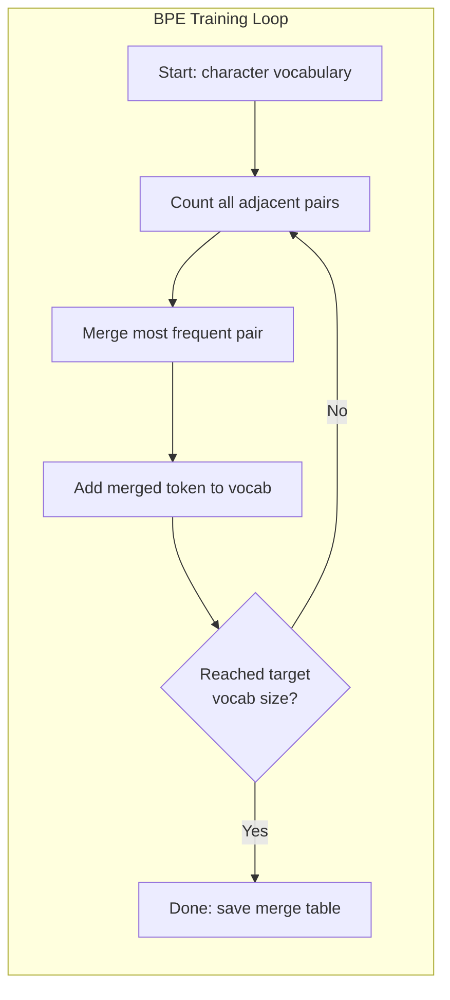
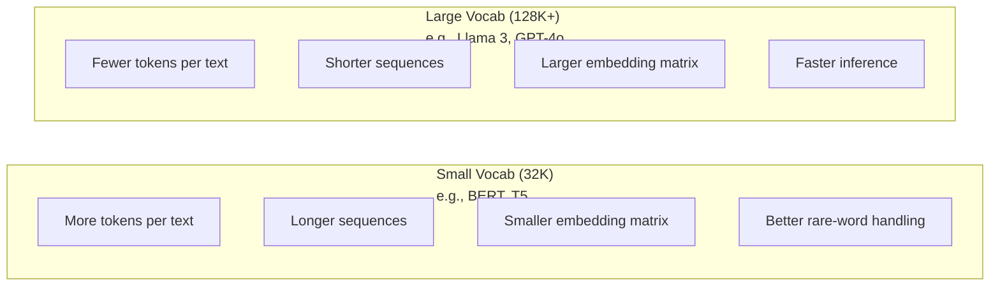

# 词元化器：BPE、WordPiece 与 SentencePiece

> 大语言模型读不懂英语，它读取的是整数。词元化器决定这些整数承载的是有效信息，还是无谓浪费。

**Type:** 构建
**Languages:** Python
**Prerequisites:** 阶段 05（自然语言处理基础）
**Time:** 约 90 分钟

## 学习目标

- 从零实现 BPE、WordPiece 与 Unigram 词元化算法，并比较它们的合并策略
- 解释词表大小如何影响模型效率：太小会产生长序列，太大则会浪费嵌入参数
- 分析不同语言和代码中的词元化瑕疵，找出具体词元化器容易失效的场景
- 使用 tiktoken 与 sentencepiece 库对文本进行词元化，并检查得到的词元 ID

## 问题

大语言模型读不懂英语，也读不懂任何语言。它读取的是数字。

“Hello, world!”与 [15496, 11, 995, 0] 之间的桥梁就是词元化器。每个单词、空格和标点符号都必须先转换为整数，模型才能处理。这种转换并非中立，它会把某些假设固化进模型，而且之后无法撤销。

这一步做错了，模型就会浪费容量，用多个词元编码常见单词。“unfortunately”原本可以是一个词元，却被拆成四个。对于充斥多音节单词的文本，128K 上下文窗口实际上缩小了 75%。如果做对了，同一个上下文窗口就能容纳两倍的语义信息。“这个模型很擅长处理代码”与“这个模型一遇到 Python 就卡住”的差别，往往取决于词元化器如何训练。

你对 GPT-4 或 Claude 发起的每次 API 调用都按词元计费，模型生成的每个词元都消耗计算资源。表示输出所需的词元越少，端到端推理就越快。词元化不是预处理，而是架构的一部分。

## 概念

### 三种失败的方案（以及一种胜出的方案）

把文本转换为数字有三种显而易见的方法，其中两种无法规模化。

**词级词元化**按空格和标点切分。“The cat sat”会变成 [“The”, “cat”, “sat”]。这很简单，但“tokenization”怎么办？“GPT-4o”怎么办？像德语复合词“Geschwindigkeitsbegrenzung”又怎么办？词级方法需要庞大的词表，才能覆盖每种语言中的每个单词。只要漏掉一个词，就会得到可怕的 `[UNK]` 词元——模型借此表示“我完全不知道这是什么”。仅英语就有一百多万种词形；再加入代码、URL、科学计数法和另外 100 种语言，词表将趋于无限。

**字符级词元化**走向另一个极端。“hello”会变成 [“h”, “e”, “l”, “l”, “o”]。词表很小，只有几百个字符，也永远不会产生未知词元。但序列会变得极长：词级方法只需 10 个词元的句子，字符级方法可能需要 50 个。模型还必须学习“t”“h”“e”连在一起表示“the”——把注意力容量浪费在人类三岁就能掌握的事情上。

**子词词元化**找到了平衡点。常见单词保持完整：“the”是一个词元；罕见单词则拆成有意义的部分：“unhappiness”变为 [“un”, “happi”, “ness”]。词表规模保持可控（3 万到 12.8 万个词元），序列不会太长，而且任何单词都能由子词片段组成，因此未知词元几乎消失。

所有现代大语言模型都使用子词词元化，包括 GPT-2、GPT-4、BERT、Llama 3 和 Claude。真正的问题是选择哪一种算法。



### BPE：字节对编码

BPE 原本是一种贪心压缩算法，后来被重新用于词元化。它的思想简单到一张索引卡就能写下。

从单个字符开始，统计训练语料中每一对相邻字符，将出现最频繁的一对合并成新词元。重复这个过程，直到达到目标词表大小。

```figure
tokenizer-bpe
```

下面展示 BPE 如何处理一个只包含“lower”“lowest”和“newest”的微型语料库：

```
Corpus (with word frequencies):
  "lower"  x5
  "lowest" x2
  "newest" x6

Step 0 -- Start with characters:
  l o w e r       (x5)
  l o w e s t     (x2)
  n e w e s t     (x6)

Step 1 -- Count adjacent pairs:
  (e,s): 8    (s,t): 8    (l,o): 7    (o,w): 7
  (w,e): 13   (e,r): 5    (n,e): 6    ...

Step 2 -- Merge most frequent pair (w,e) -> "we":
  l o we r        (x5)
  l o we s t      (x2)
  n e we s t      (x6)

Step 3 -- Recount and merge (e,s) -> "es":
  l o we r        (x5)
  l o we s t      (x2)    <- 'es' only forms from 'e'+'s', not 'we'+'s'
  n e we s t      (x6)    <- wait, the 'e' before 'we' and 's' after 'we'

Actually tracking this precisely:
  After "we" merge, remaining pairs:
  (l,o): 7   (o,we): 7   (we,r): 5   (we,s): 8
  (s,t): 8   (n,e): 6    (e,we): 6

Step 3 -- Merge (we,s) -> "wes" or (s,t) -> "st" (tied at 8, pick first):
  Merge (we,s) -> "wes":
  l o we r        (x5)
  l o wes t       (x2)
  n e wes t       (x6)

Step 4 -- Merge (wes,t) -> "west":
  l o we r        (x5)
  l o west        (x2)
  n e west        (x6)

...continue until target vocab size reached.
```

这张合并表就是词元化器。编码新文本时，要按学习到的顺序应用合并操作。训练语料决定了哪些合并会存在，这项选择将永久塑造模型看到的内容。



### 字节级 BPE（GPT-2、GPT-3、GPT-4）

标准 BPE 操作 Unicode 字符，字节级 BPE 则操作原始字节（0～255）。因此它的基础词表恰好包含 256 项，可以处理任何语言或编码，而且永远不会产生未知词元。

GPT-2 首先引入了这种方法。基础词表覆盖所有可能的字节，BPE 合并则建立在其上。OpenAI 的 tiktoken 库实现了字节级 BPE，对应词表大小如下：

- GPT-2：50,257 个词元
- GPT-3.5/GPT-4：约 100,256 个词元（cl100k_base 编码）
- GPT-4o：200,019 个词元（o200k_base 编码）

### WordPiece（BERT）

WordPiece 看起来与 BPE 相似，但选择合并项的方式不同。它不看原始频次，而是最大化训练数据的似然：

```
BPE merge criterion:      count(A, B)
WordPiece merge criterion: count(AB) / (count(A) * count(B))
```

BPE 问的是：“哪一对出现得最频繁？”WordPiece 问的是：“哪一对共同出现的频率高于随机情况下的预期？”这一细微差异会产生不同的词表。WordPiece 偏爱共现关系出人意料的组合，而不只是频繁组合。

WordPiece 还使用“##”前缀标记续接子词：

```
"unhappiness" -> ["un", "##happi", "##ness"]
"embedding"   -> ["em", "##bed", "##ding"]
```

“##”前缀表示这个片段延续前一个词元。BERT 使用包含 30,522 个词元的 WordPiece。每个 BERT 变体都与此有关——DistilBERT 也是如此；RoBERTa 的词元化器实际上采用 BPE，但 BERT 本身使用 WordPiece。

### SentencePiece（Llama、T5）

SentencePiece 把输入视为包含空白字符的原始 Unicode 字符流。它没有预词元化步骤，也没有针对词边界的语言特定规则。因此它真正与语言无关——即使面对中文、日文、泰文等不使用空格分隔单词的语言，也能正常工作。

SentencePiece 支持两种算法：
- **BPE 模式**：与标准 BPE 使用相同的合并逻辑，但直接应用于原始字符序列
- **Unigram 模式**：从大型词表开始，迭代删除对总体似然影响最小的词元。它与 BPE 方向相反——不是合并，而是剪枝。

Llama 2 使用词表大小为 32,000 的 SentencePiece BPE，T5 使用词表大小为 32,000 的 SentencePiece Unigram。注意：Llama 3 已切换为基于 tiktoken、词表大小为 128,256 的字节级 BPE 词元化器。

### 词表大小的权衡

这是一项会带来可测量后果的真实工程决策。



看一组具体数字。对于词表大小为 128K、嵌入维度为 4,096 的模型，仅嵌入矩阵就有 128,000 × 4,096 = 5.24 亿个参数。词表为 32K 时，则有 1.31 亿个参数。仅仅因为词元化器的选择，参数量就相差 4 亿。

但更大的词表能更积极地压缩文本。同一段英语，用 32K 词表需要 100 个词元，用 128K 词表可能只需 70 个。这意味着生成时少做 30% 的前向传播。对于每天服务数百万请求的模型，这会直接降低计算成本。

趋势很明确：词表正在变大。GPT-2 使用 50,257 个词元，GPT-4 约为 100K，Llama 3 为 128K，GPT-4o 则为 200K。

| 模型 | 词表大小 | 词元化器类型 | 每个英文单词的平均词元数 |
|-------|-----------|----------------|---------------------------|
| BERT | 30,522 | WordPiece | 约 1.4 |
| GPT-2 | 50,257 | 字节级 BPE | 约 1.3 |
| Llama 2 | 32,000 | SentencePiece BPE | 约 1.4 |
| GPT-4 | 约 100,256 | 字节级 BPE | 约 1.2 |
| Llama 3 | 128,256 | 字节级 BPE（tiktoken） | 约 1.1 |
| GPT-4o | 200,019 | 字节级 BPE | 约 1.0 |

### 多语言税

主要使用英语训练的词元化器，对其他语言非常不友好。韩语文本在 GPT-2 词元化器中平均每个词需要 2～3 个词元，中文可能更糟。这意味着，韩语用户实际获得的上下文窗口只有英语用户的一半——支付相同费用，能够承载的信息密度却更低。

这正是 Llama 3 把词表从 32K 扩大四倍至 128K 的原因。为非英语文字系统分配更多词元，可以让不同语言之间的压缩率更加公平。

```figure
tokenizer-tradeoff
```

## 动手构建

### 第 1 步：字符级词元化器

从基础开始。字符级词元化器把每个字符映射为其 Unicode 码位。不需要训练，也不会产生未知词元，只做直接映射。

```python
class CharTokenizer:
    def encode(self, text):
        return [ord(c) for c in text]

    def decode(self, tokens):
        return "".join(chr(t) for t in tokens)
```

“hello”会变成 [104, 101, 108, 108, 111]。每个字符都是一个词元。这就是我们要改进的基线。

### 第 2 步：从零实现 BPE 词元化器

下面是真正的实现。我们像 GPT-2 一样在原始字节上训练，统计相邻对，合并最常见的一对，并按顺序记录每次合并。合并表就是词元化器。

```python
from collections import Counter

class BPETokenizer:
    def __init__(self):
        self.merges = {}
        self.vocab = {}

    def _get_pairs(self, tokens):
        pairs = Counter()
        for i in range(len(tokens) - 1):
            pairs[(tokens[i], tokens[i + 1])] += 1
        return pairs

    def _merge_pair(self, tokens, pair, new_token):
        merged = []
        i = 0
        while i < len(tokens):
            if i < len(tokens) - 1 and tokens[i] == pair[0] and tokens[i + 1] == pair[1]:
                merged.append(new_token)
                i += 2
            else:
                merged.append(tokens[i])
                i += 1
        return merged

    def train(self, text, num_merges):
        tokens = list(text.encode("utf-8"))
        self.vocab = {i: bytes([i]) for i in range(256)}

        for i in range(num_merges):
            pairs = self._get_pairs(tokens)
            if not pairs:
                break
            best_pair = max(pairs, key=pairs.get)
            new_token = 256 + i
            tokens = self._merge_pair(tokens, best_pair, new_token)
            self.merges[best_pair] = new_token
            self.vocab[new_token] = self.vocab[best_pair[0]] + self.vocab[best_pair[1]]

        return self

    def encode(self, text):
        tokens = list(text.encode("utf-8"))
        for pair, new_token in self.merges.items():
            tokens = self._merge_pair(tokens, pair, new_token)
        return tokens

    def decode(self, tokens):
        byte_sequence = b"".join(self.vocab[t] for t in tokens)
        return byte_sequence.decode("utf-8", errors="replace")
```

训练循环就是 BPE 的核心：统计相邻对，合并胜出者，不断重复。每次合并都会减少词元总数。经过 `num_merges` 轮后，词表会从 256 项（基础字节）增长到 256 + num_merges。

编码时，要严格按照合并操作的学习顺序应用它们，这一点非常重要。假设第 1 次合并产生了“th”，第 5 次产生了“the”，编码时必须先执行第 1 次合并，第 5 次才能用“th”+“e”组成“the”。

解码则是逆过程：在词表中查找每个词元 ID，拼接字节，再解码为 UTF-8。

### 第 3 步：编码与解码往返

```python
corpus = (
    "The cat sat on the mat. The cat ate the rat. "
    "The dog sat on the log. The dog ate the frog. "
    "Natural language processing is the study of how computers "
    "understand and generate human language. "
    "Tokenization is the first step in any NLP pipeline."
)

tokenizer = BPETokenizer()
tokenizer.train(corpus, num_merges=40)

test_sentences = [
    "The cat sat on the mat.",
    "Natural language processing",
    "tokenization pipeline",
    "unhappiness",
]

for sentence in test_sentences:
    encoded = tokenizer.encode(sentence)
    decoded = tokenizer.decode(encoded)
    raw_bytes = len(sentence.encode("utf-8"))
    ratio = len(encoded) / raw_bytes
    print(f"'{sentence}'")
    print(f"  Tokens: {len(encoded)} (from {raw_bytes} bytes) -- ratio: {ratio:.2f}")
    print(f"  Roundtrip: {'PASS' if decoded == sentence else 'FAIL'}")
```

压缩率反映词元化器的效率。0.50 表示词元化器把文本压缩到原始字节数的一半；越低越好。在训练语料上，压缩率会很好。对于语料中没有出现的“unhappiness”等分布外文本，压缩率会变差——面对没见过的模式，词元化器会回退到字符级编码。

### 第 4 步：与 tiktoken 比较

```python
import tiktoken

enc = tiktoken.get_encoding("cl100k_base")

texts = [
    "The cat sat on the mat.",
    "unhappiness",
    "Hello, world!",
    "def fibonacci(n): return n if n < 2 else fibonacci(n-1) + fibonacci(n-2)",
    "Geschwindigkeitsbegrenzung",
]

for text in texts:
    our_tokens = tokenizer.encode(text)
    tiktoken_tokens = enc.encode(text)
    tiktoken_pieces = [enc.decode([t]) for t in tiktoken_tokens]
    print(f"'{text}'")
    print(f"  Our BPE:   {len(our_tokens)} tokens")
    print(f"  tiktoken:  {len(tiktoken_tokens)} tokens -> {tiktoken_pieces}")
```

tiktoken 使用完全相同的算法，但它在数百 GB 文本上进行了 10 万次合并训练。算法完全相同，差别只在训练数据和合并次数。你的词元化器只在一个段落上进行了 40 次合并，当然无法与海量语料上经过 10 万次合并的 tiktoken 竞争，但二者机制一致。

### 第 5 步：词表分析

```python
def analyze_vocabulary(tokenizer, test_texts):
    total_tokens = 0
    total_chars = 0
    token_usage = Counter()

    for text in test_texts:
        encoded = tokenizer.encode(text)
        total_tokens += len(encoded)
        total_chars += len(text)
        for t in encoded:
            token_usage[t] += 1

    print(f"Vocabulary size: {len(tokenizer.vocab)}")
    print(f"Total tokens across all texts: {total_tokens}")
    print(f"Total characters: {total_chars}")
    print(f"Avg tokens per character: {total_tokens / total_chars:.2f}")

    print(f"\nMost used tokens:")
    for token_id, count in token_usage.most_common(10):
        token_bytes = tokenizer.vocab[token_id]
        display = token_bytes.decode("utf-8", errors="replace")
        print(f"  Token {token_id:4d}: '{display}' (used {count} times)")

    unused = [t for t in tokenizer.vocab if t not in token_usage]
    print(f"\nUnused tokens: {len(unused)} out of {len(tokenizer.vocab)}")
```

这段分析会揭示词表中的齐普夫分布：少数词元占据绝大多数用量（空格、“the”、“e”），大多数词元都很少使用。生产级词元化器会针对这种分布优化——常见模式获得较短的词元 ID，罕见模式则采用较长表示。

## 学以致用

你从零实现的 BPE 已经可以工作。现在来看看生产工具是什么样子。

### tiktoken（OpenAI）

```python
import tiktoken

enc = tiktoken.get_encoding("cl100k_base")

text = "Tokenizers convert text to integers"
tokens = enc.encode(text)
print(f"Tokens: {tokens}")
print(f"Pieces: {[enc.decode([t]) for t in tokens]}")
print(f"Roundtrip: {enc.decode(tokens)}")
```

tiktoken 使用 Rust 编写，并提供 Python 绑定。它每秒可以编码数百万个词元。算法仍是同一个 BPE，只是实现达到了工业级强度。

### Hugging Face tokenizers

```python
from tokenizers import Tokenizer
from tokenizers.models import BPE
from tokenizers.trainers import BpeTrainer
from tokenizers.pre_tokenizers import ByteLevel

tokenizer = Tokenizer(BPE())
tokenizer.pre_tokenizer = ByteLevel()

trainer = BpeTrainer(vocab_size=1000, special_tokens=["<pad>", "<eos>", "<unk>"])
tokenizer.train(["corpus.txt"], trainer)

output = tokenizer.encode("The cat sat on the mat.")
print(f"Tokens: {output.tokens}")
print(f"IDs: {output.ids}")
```

Hugging Face tokenizers 底层同样使用 Rust。它能在数秒内用 GB 级语料训练 BPE。训练自己的模型时，就应使用这个工具。

### 加载 Llama 的词元化器

```python
from transformers import AutoTokenizer

tokenizer = AutoTokenizer.from_pretrained("meta-llama/Llama-3.1-8B")

text = "Tokenizers are the unsung heroes of LLMs"
tokens = tokenizer.encode(text)
print(f"Token IDs: {tokens}")
print(f"Tokens: {tokenizer.convert_ids_to_tokens(tokens)}")
print(f"Vocab size: {tokenizer.vocab_size}")

multilingual = ["Hello world", "Hola mundo", "Bonjour le monde"]
for text in multilingual:
    ids = tokenizer.encode(text)
    print(f"'{text}' -> {len(ids)} tokens")
```

Llama 3 的 128K 词表压缩非英语文本的效果明显优于 GPT-2 的 50K 词表。你可以亲自验证——用多个语言编码同一句话，再比较词元数量。

## 交付成果

本课会生成 `outputs/prompt-tokenizer-analyzer.md`——一个可复用提示词，用于分析任意文本与模型组合的词元化效率。向它提供文本样本，它会告诉你哪个模型的词元化器处理得最好。

## 练习

1. 修改 BPE 词元化器，让它在每个合并步骤打印词表。观察“t”+“h”如何变成“th”，再观察“th”+“e”如何变成“the”。跟踪常见英语单词怎样逐片组装起来。

2. 为 BPE 词元化器添加特殊词元（`<pad>`、`<eos>`、`<unk>`）。依次分配 ID 0、1、2，并相应平移其他所有词元的 ID。实现预词元化步骤，在运行 BPE 前先按空白字符切分。

3. 实现 WordPiece 合并准则（似然比，而非频次）。使用相同语料和相同合并次数训练 BPE 与 WordPiece。比较得到的词表——哪一种会生成更多符合语言学意义的子词？

4. 构建多语言词元化效率基准。分别选取英语、西班牙语、中文、韩语和阿拉伯语的 10 个句子，使用 tiktoken（cl100k_base）进行词元化，并测量平均每字符词元数。量化每种语言的“多语言税”。

5. 在更大的语料库上训练 BPE 词元化器（下载一篇维基百科文章）。调整合并次数，使它在同一文本上的压缩率达到与 tiktoken 相差 10% 以内。这个练习会迫使你理解语料规模、合并次数和压缩质量之间的关系。

## 关键术语

| 术语 | 人们通常怎么说 | 实际含义 |
|------|----------------|----------------------|
| 词元 | “一个单词” | 模型词表中的一个单位——可以是字符、子词、单词或多词片段 |
| BPE | “某种压缩技术” | 字节对编码——不断合并出现最频繁的相邻词元对，直到达到目标词表大小 |
| WordPiece | “BERT 的词元化器” | 与 BPE 类似，但合并时最大化似然比 count(AB)/(count(A)*count(B))，而非原始频次 |
| SentencePiece | “一个词元化器库” | 与语言无关的词元化器，直接处理未经预词元化的原始 Unicode，并支持 BPE 与 Unigram 算法 |
| 词表大小 | “它认识多少单词” | 唯一词元总数：GPT-2 有 50,257 个，BERT 有 30,522 个，Llama 3 有 128,256 个 |
| 切分率 | “不像词元化术语” | 每个单词的平均词元数——衡量不同语言的词元化效率（1.0 表示完美，3.0 表示模型要多做三倍工作） |
| 字节级 BPE | “GPT 的词元化器” | 操作原始字节（0～255）而非 Unicode 字符的 BPE，保证任何输入都不会产生未知词元 |
| 合并表 | “词元化器文件” | 训练期间学习到的有序词元对合并列表——它就是词元化器，而且顺序至关重要 |
| 预词元化 | “按空格切分” | 在子词词元化前应用的规则：空白切分、数字分隔、标点处理 |
| 压缩率 | “词元化器的效率” | 生成的词元数除以输入字节数——越低，压缩越好，推理越快 |

## 延伸阅读

- [Sennrich 等，2016——“使用子词单元处理神经机器翻译中的罕见词”](https://arxiv.org/abs/1508.07909)——把 1994 年的压缩算法变成现代词元化基础的 BPE 论文
- [Kudo 与 Richardson，2018——“SentencePiece：一种简单且与语言无关的子词词元化器”](https://arxiv.org/abs/1808.06226)——让多语言模型成为现实的语言无关词元化方法
- [OpenAI tiktoken 仓库](https://github.com/openai/tiktoken)——使用 Rust 编写并提供 Python 绑定的生产级 BPE 实现，供 GPT-3.5/4/4o 使用
- [Hugging Face Tokenizers 文档](https://huggingface.co/docs/tokenizers)——具有 Rust 性能的生产级词元化器训练工具
