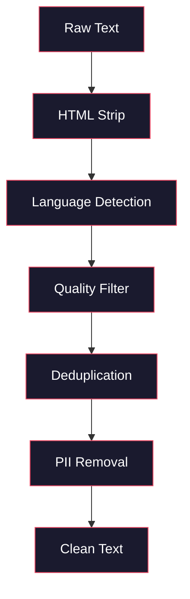
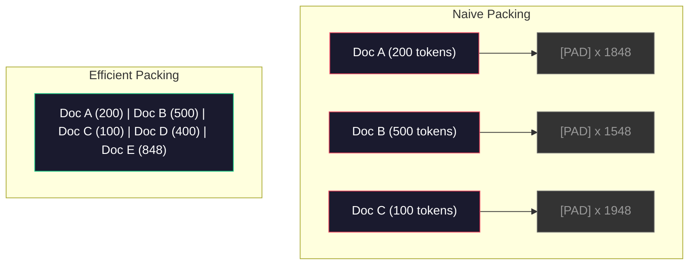

# 预训练数据流水线

> 模型是一面镜子。你喂给它什么数据，它就会映照出什么。喂给它垃圾，它也会以无比流畅的方式复述垃圾。

**Type:** 构建
**Languages:** Python
**Prerequisites:** 阶段 10 第 01～02 课（词元化器、构建词元化器）
**Time:** 约 90 分钟

## 学习目标

- 构建流式数据流水线，无须把数 TB 文本全部载入内存，即可完成词元化、分块、打乱和批处理
- 实现真实预训练流水线使用的数据质量过滤器（去重、语言检测、内容过滤）
- 生成定长训练序列，正确处理注意力掩码与文档边界
- 分析流水线吞吐量，确保数据加载器能跟上 GPU 训练速度

## 问题

你已经有了词元化器。现在需要数据。

不是一个普通数据集，也不是一份 CSV 文件，而是数 TB 文本——经过清洗、去重和质量过滤，被词元化为定长序列，并以随机批次高速供给，确保你的 8-GPU 集群永远不用等待下一批数据。

大多数人认为训练大语言模型的关键在于模型架构，其实并非如此。Llama 3 使用了 15.6 万亿个词元，GPT-3 使用了 3000 亿个，DeepSeek-V2 使用了 8.1 万亿个。这三者的架构大致相同：堆叠带注意力与前馈层的 Transformer 块。输出质量的差异绝大部分来自数据。

DeepMind 的 Chinchilla 论文把这一点精确量化。对于给定的计算预算，模型参数量与训练词元数存在最佳比例。Chinchilla 证明，2022 年的大多数模型都严重欠训练——相对于所见数据量，参数太多。一个在 1.4 万亿词元上训练的 70B 参数模型（符合 Chinchilla 最优配置），胜过了在 3000 亿词元上训练的 280B 模型（Gopher）。

你的数据流水线决定了模型学到的是语言还是噪声。

## 概念

### 数据从哪里来

每个大语言模型都使用多种来源混合训练。多数实验室严密保守具体配比，但我们掌握的信息已经足以理解各类来源。

| 来源 | 规模 | 质量 | 使用者 |
|--------|------|---------|---------|
| Common Crawl | 原始数据约 250 TB | 低（需要大量过滤） | GPT-3、Llama、大多数开放模型 |
| Wikipedia | 约 20 GB | 高 | 所有主流大语言模型 |
| GitHub 代码 | 约 1 TB 以上 | 中（大量重复与废弃代码） | StarCoder、CodeLlama、DeepSeek-Coder |
| 图书（BookCorpus、Pile） | 约 100 GB | 高 | GPT-2、GPT-3、早期模型 |
| 学术论文（arXiv、S2ORC） | 约 100 GB | STEM 领域较高 | Llama、Galactica |
| StackOverflow、Reddit | 约 100 GB | 中 | Llama、Falcon |
| 精选网页（C4、RefinedWeb） | 约 5 TB | 中高（已预过滤） | T5、Falcon |

Llama 3 公布了数据配比：约 50% 为网页数据、25% 为代码、13% 为图书与学术论文、8% 为数学数据、4% 为多语言网页数据。总量为 15.6 万亿个词元，来自超过 5 TB 的原始文本。

配比与总量同样重要。网页数据太多，模型会变成复读 Reddit 的鹦鹉；代码太少，它就不会编程；数学数据太少，它就无法推理。调好这套配比是训练大语言模型最难的部分之一，而且没有现成公式——只能通过实验与评估寻找答案。

### 数据清洗

原始网页数据非常肮脏。典型的 Common Crawl 数据转储包含：

- HTML 标签与 JavaScript
- 模板化页眉、页脚和导航菜单
- 重复网页（完全重复和近似重复）
- 机器生成的垃圾内容
- 个人身份信息（PII）
- 低质量文本（关键词列表、SEO 垃圾内容）
- 以文本形式编码的非文本内容

清洗并非可选项。它决定了模型会生成连贯段落，还是会输出夹杂商品列表的 HTML 标签。



每一步都会去除一类噪声：

**移除 HTML：** 删除所有标记，只保留可见文本内容。`trafilatura` 或 `readability` 等库可以提取正文，同时丢弃导航、广告和模板化内容。

**语言检测：** 使用 fastText 的语言识别模型（lid.176.bin）为每篇文档分类，只保留目标语言。被判定为英语但置信度低于 0.8 的文档，很可能并不是干净的英语文本。

**质量过滤：** 这里才真正有意思。RefinedWeb（Falcon 背后的数据集）使用基于困惑度的过滤器：先在 Wikipedia 上训练一个小型语言模型，再为每篇文档打分。困惑度高，说明文档不像 Wikipedia——很可能是垃圾内容、关键词列表或机器生成文本。超过困惑度阈值的文档会被移除。

**去重：** 这是影响最大的单项清洗步骤。Common Crawl 包含海量重复页面——法律免责声明、Cookie 通知、服务条款。在重复内容上训练既浪费计算资源，也可能导致模型记忆并逐字复述特定段落。

**移除 PII：** 姓名、电子邮件地址、电话号码、社会保障号码。结构化 PII 可用正则表达式检测，上下文中的姓名则使用命名实体识别模型。

### 使用 MinHash 去重

精确去重很简单：为每篇文档计算哈希并移除重复项。但真正的问题是近似重复。两份新闻文章可能正文有 95% 完全相同，只是周围广告略有差异，因此逐字节比较仍会判定它们不同。

MinHash + 局部敏感哈希（LSH）可以高效解决这个问题。


具体思路如下：

1. **切分 Shingle：** 把每篇文档转换为 n-gram 集合，例如词或字符的 5-gram。“the quick brown fox”使用三词 Shingle 时，会变成 {“the quick brown”, “quick brown fox”}。

2. **MinHash：** 对每篇文档的 Shingle 集合计算 k 个哈希值。每个值都是在一种不同哈希函数下，所有 Shingle 哈希的最小值。由此产生固定大小的“签名”，近似任意两篇文档之间的 Jaccard 相似度。

3. **LSH：** 根据 MinHash 签名的各个分带，把文档分到不同桶中。同一桶内的文档就是潜在近似重复项。这样无须比较每一对文档，只需比较候选项。

4. **验证：** 对每对候选文档计算精确 Jaccard 相似度。如果超过阈值（通常为 0.8），就移除其中一份。

Llama 团队报告称，去重移除了约 38% 的网页数据。这绝不是小数目；Common Crawl 有超过三分之一的内容属于重复或近似重复。

### 序列打包

模型需要定长输入序列，而文档长度各不相同。有的只有 50 个词元，有的则有 50,000 个。

朴素方法是把每篇文档填充到最大序列长度。这会把大量算力浪费在对学习毫无贡献的填充词元上。

更好的办法是把多篇文档打包进同一个序列，并在它们之间插入序列结束词元。一个长度为 2048 的序列，可以包含三篇由 [EOS] 分隔的短文档。



注意力掩码必须正确设置。同一个打包序列中，文档 A 的词元不应关注文档 B 的词元，因此需要使用块对角注意力掩码。

长文档会在序列边界处截断或拆块。拆分位置很重要：从句子中间切开，会迫使模型看到不完整的想法。因此，有些流水线会尽量在段落或句子边界处分割。

### Chinchilla 缩放定律

对于给定的计算预算 C（以 FLOP 计），最优模型大小 N 与数据集大小 D 满足：

```
N_opt ~ C^0.5
D_opt ~ C^0.5
```

实践含义是，模型大小与数据集大小应大致同步扩展。参数量增大 10 倍的模型，需要大约 10 倍的训练词元才能达到相同损失。

| 模型 | 参数量 | 训练词元数 | 符合 Chinchilla 最优配置？ |
|-------|-----------|----------------|-------------------|
| GPT-3 | 175B | 300B | 否（欠训练 3～4 倍） |
| Chinchilla | 70B | 1.4T | 是（刻意如此设计） |
| Llama 2 | 70B | 2T | 过度训练（有意为之） |
| Llama 3 | 70B | 15T | 大幅过度训练 |

Llama 3 有意违背 Chinchilla 定律。Meta 发现，使用远超计算最优比例的数据进行过度训练，可以得到更适合推理部署的模型。额外训练成本只需支付一次，更小模型带来的服务成本优势却可以长期享受。这有时称为“推理最优”缩放方法，并从 2024 年起成为行业标准。

```figure
l5-data-pipeline
```

## 动手构建

### 第 1 步：文本清洗

移除 HTML、规范化空白、删除非文本内容。我们使用一份公版文本（Project Gutenberg）作为小型语料库。

```python
import re

def clean_text(text):
    text = re.sub(r"<[^>]+>", "", text)
    text = re.sub(r"http\S+", "", text)
    text = re.sub(r"[^\x20-\x7E\n]", "", text)
    text = re.sub(r"\n{3,}", "\n\n", text)
    text = re.sub(r" {2,}", " ", text)
    return text.strip()

def quality_filter(text, min_words=50, max_ratio_caps=0.3, max_ratio_special=0.1):
    words = text.split()
    if len(words) < min_words:
        return False
    caps_ratio = sum(1 for w in words if w.isupper()) / len(words)
    if caps_ratio > max_ratio_caps:
        return False
    special_chars = sum(1 for c in text if not c.isalnum() and not c.isspace())
    if special_chars / max(len(text), 1) > max_ratio_special:
        return False
    return True
```

质量过滤器可以发现 SEO 垃圾内容（全大写）、机器生成噪声（特殊字符比例过高）和残缺页面（太短）。仅这三项检查，就能从网页抓取数据中移除数量惊人的垃圾。

### 第 2 步：MinHash 去重

从零实现 MinHash。不需要外部库，只用 `hashlib`。

```python
import hashlib
from collections import defaultdict

def get_shingles(text, k=5):
    words = text.lower().split()
    if len(words) < k:
        return set()
    return {" ".join(words[i:i+k]) for i in range(len(words) - k + 1)}

def minhash_signature(shingles, num_hashes=128):
    signature = []
    for i in range(num_hashes):
        min_hash = float("inf")
        for shingle in shingles:
            h = int(hashlib.sha256(f"{i}:{shingle}".encode()).hexdigest(), 16)
            min_hash = min(min_hash, h)
        signature.append(min_hash)
    return signature

def lsh_buckets(signature, bands=16):
    rows_per_band = len(signature) // bands
    buckets = []
    for b in range(bands):
        start = b * rows_per_band
        band_data = tuple(signature[start:start + rows_per_band])
        bucket_hash = hashlib.md5(str(band_data).encode()).hexdigest()
        buckets.append((b, bucket_hash))
    return buckets

def deduplicate(documents, threshold=0.8, num_hashes=128, bands=16):
    signatures = []
    shingle_sets = []
    for doc in documents:
        shingles = get_shingles(doc)
        shingle_sets.append(shingles)
        signatures.append(minhash_signature(shingles, num_hashes))

    bucket_map = defaultdict(list)
    for doc_idx, sig in enumerate(signatures):
        for band_id, bucket_hash in lsh_buckets(sig, bands):
            bucket_map[(band_id, bucket_hash)].append(doc_idx)

    duplicate_pairs = set()
    for bucket_docs in bucket_map.values():
        if len(bucket_docs) < 2:
            continue
        for i in range(len(bucket_docs)):
            for j in range(i + 1, len(bucket_docs)):
                duplicate_pairs.add((bucket_docs[i], bucket_docs[j]))

    removed = set()
    for i, j in duplicate_pairs:
        if i in removed or j in removed:
            continue
        s1, s2 = shingle_sets[i], shingle_sets[j]
        if not s1 or not s2:
            continue
        jaccard = len(s1 & s2) / len(s1 | s2)
        if jaccard >= threshold:
            removed.add(j)

    return [doc for idx, doc in enumerate(documents) if idx not in removed], len(removed)
```

参数 `num_hashes=128` 与 `bands=16` 控制精确率和召回率之间的权衡。哈希越多，相似度估计越准确；分带越多，召回率越高（能发现更多重复项），但误报也越多。这些取值很适合典型网页文本。

### 第 3 步：词元化并打包序列

对清洗、去重后的文本进行词元化，再打包成用于训练的定长序列。

```python
def tokenize_corpus(documents, tokenizer):
    all_tokens = []
    for doc in documents:
        tokens = tokenizer.encode(doc)
        all_tokens.extend(tokens)
        all_tokens.append(tokenizer.eos_id)
    return all_tokens

def pack_sequences(token_ids, seq_length, pad_id=0):
    sequences = []
    attention_masks = []
    for i in range(0, len(token_ids), seq_length):
        seq = token_ids[i:i + seq_length]
        mask = [1] * len(seq)
        if len(seq) < seq_length:
            pad_count = seq_length - len(seq)
            seq = seq + [pad_id] * pad_count
            mask = mask + [0] * pad_count
        sequences.append(seq)
        attention_masks.append(mask)
    return sequences, attention_masks
```

### 第 4 步：训练数据加载器

产出随机化的打包序列批次，供训练循环使用。

```python
import random

class PreTrainingDataLoader:
    def __init__(self, sequences, attention_masks, batch_size, shuffle=True):
        self.sequences = sequences
        self.attention_masks = attention_masks
        self.batch_size = batch_size
        self.shuffle = shuffle

    def __len__(self):
        return (len(self.sequences) + self.batch_size - 1) // self.batch_size

    def __iter__(self):
        indices = list(range(len(self.sequences)))
        if self.shuffle:
            random.shuffle(indices)
        for start in range(0, len(indices), self.batch_size):
            batch_idx = indices[start:start + self.batch_size]
            batch_seqs = [self.sequences[i] for i in batch_idx]
            batch_masks = [self.attention_masks[i] for i in batch_idx]
            yield batch_seqs, batch_masks
```

### 第 5 步：数据集统计信息

计算真正重要的数字：词元总数、唯一词元数、压缩率、文档长度分布。

```python
from collections import Counter

def compute_statistics(documents, token_ids, sequences, tokenizer_vocab_size):
    total_chars = sum(len(d) for d in documents)
    total_tokens = len(token_ids)
    unique_tokens = len(set(token_ids))
    compression_ratio = total_chars / total_tokens

    doc_lengths = [len(d.split()) for d in documents]
    avg_doc_length = sum(doc_lengths) / max(len(doc_lengths), 1)
    max_doc_length = max(doc_lengths) if doc_lengths else 0
    min_doc_length = min(doc_lengths) if doc_lengths else 0

    token_counts = Counter(token_ids)
    top_tokens = token_counts.most_common(10)

    non_pad_tokens = sum(sum(1 for t in seq if t != 0) for seq in sequences)
    total_positions = sum(len(seq) for seq in sequences)
    utilization = non_pad_tokens / max(total_positions, 1)

    stats = {
        "total_documents": len(documents),
        "total_characters": total_chars,
        "total_tokens": total_tokens,
        "unique_tokens": unique_tokens,
        "vocab_utilization": unique_tokens / tokenizer_vocab_size,
        "compression_ratio": compression_ratio,
        "avg_doc_length_words": avg_doc_length,
        "max_doc_length_words": max_doc_length,
        "min_doc_length_words": min_doc_length,
        "num_sequences": len(sequences),
        "sequence_utilization": utilization,
        "top_10_tokens": top_tokens,
    }
    return stats
```

压缩率反映词元化器在这份语料上的效率。英语文本通常每个词元可压缩 3～4 个字符。如果只有每词元 1.5 个字符，说明词元化器切分得过细；如果达到 8 以上，则说明它学到了高度特定于领域的合并。

序列利用率表示打包序列中真实数据相对于填充的占比。低于 90% 说明打包效率不足——计算资源正浪费在填充词元上。

## 学以致用

### 与 HuggingFace Datasets 比较

通过 HuggingFace datasets 库加载相同语料，并比较流水线速度。

```python
from datasets import load_dataset
from transformers import AutoTokenizer

ds = load_dataset("wikitext", "wikitext-2-raw-v1", split="train")
tokenizer = AutoTokenizer.from_pretrained("meta-llama/Meta-Llama-3-8B")

import time

start = time.time()
tokenized = ds.map(
    lambda x: tokenizer(x["text"], truncation=True, max_length=2048),
    batched=True,
    num_proc=4,
)
hf_time = time.time() - start
total_tokens = sum(len(t) for t in tokenized["input_ids"])
print(f"HuggingFace: {total_tokens:,} tokens in {hf_time:.2f}s ({total_tokens/hf_time:,.0f} tokens/sec)")
```

HuggingFace 流水线底层使用 Rust 词元化器，并在 4 个 CPU 核心上并行处理。你的纯 Python 流水线会慢 10～50 倍，这正是生产团队使用编译式词元化器的原因。算法相同，差别在实现语言。

## 交付成果

本课会生成一个用于验证和调试大语言模型训练数据质量的提示词。参见 `outputs/prompt-data-quality-checker.md`。

## 练习

1. **简单：** 使用简单启发式方法（字符集分析）为清洗流水线添加语言检测。只保留英语文档，并测量移除了多少篇。
2. **中等：** 在 MinHash 近似去重之外，再使用 SHA-256 哈希实现精确去重。在抓取的网页语料上，比较两种方法各自发现的重复项数量。
3. **困难：** 构建基于困惑度的质量过滤器。在 Wikipedia 文本上训练一个小型二元语法语言模型，按困惑度为每篇文档打分，并移除最差的 20%。比较使用过滤前后数据训练的模型输出质量。

## 关键术语

| 术语 | 人们通常怎么说 | 实际含义 |
|------|----------------|----------------------|
| Common Crawl | “互联网” | 每月抓取网页的非营利组织——约 250TB 原始数据，是大多数大语言模型训练数据的起点 |
| MinHash | “某种哈希技巧” | 使用定长签名估计集合间 Jaccard 相似度的方法——支持大规模近似重复检测 |
| LSH | “局部敏感哈希” | 把相似项目分入同一桶的方法——把成对比较从 O(n^2) 降至接近线性 |
| 序列打包 | “拼接文档” | 使用正确的注意力掩码，把多篇文档装入定长序列——消除填充浪费 |
| Chinchilla 缩放 | “使用更多数据训练” | 在固定计算预算下，最优性能要求模型大小与训练词元数大致同步扩展 |
| 切分率 | “每个单词的词元数” | 每个单词的平均词元数——GPT-4 的英语约为 1.3，非拉丁文字更高 |
| 数据混合 | “选择训练数据” | 代码、文本、数学与多语言数据之间的比例——没有公式，只能通过实验决定 |
| 困惑度过滤器 | “质量评分” | 使用小型语言模型为文档打分——高困惑度表示文本不像干净参考数据 |
| 去重 | “删除副本” | 移除完全重复与近似重复文档——通常会删除 30%～40% 的原始网页数据 |
| 注意力掩码 | “哪些词元可以被关注” | 防止同一个打包序列中的注意力跨越文档边界的二进制掩码 |

## 延伸阅读

- [Hoffmann 等，2022——训练计算最优的大语言模型（Chinchilla）](https://arxiv.org/abs/2203.15556)——改变我们理解数据规模方式的论文
- [Penedo 等，2023——用于 Falcon 大语言模型的 RefinedWeb 数据集](https://arxiv.org/abs/2306.01116)——如何把 Common Crawl 过滤成高质量数据
- [Touvron 等，2023——Llama 2：开放基础与微调聊天模型](https://arxiv.org/abs/2307.09288)——Llama 2 的数据流水线细节
- [Lee 等，2022——训练数据去重能改善语言模型](https://arxiv.org/abs/2107.06499)——为什么去重比想象中更重要
- [Broder，1997——文档的相似度与包含关系](https://ieeexplore.ieee.org/document/666900)——MinHash 原始论文
- [Meta，2024——Llama 3 技术报告](https://arxiv.org/abs/2407.21783)——15.6T 词元、数据混合比例与过滤流水线
