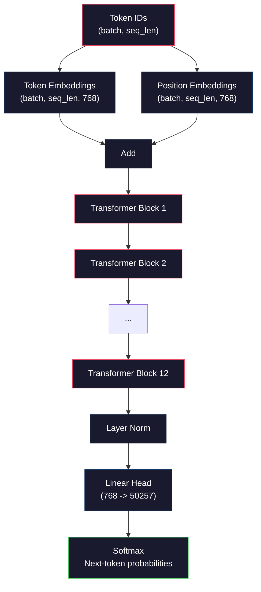
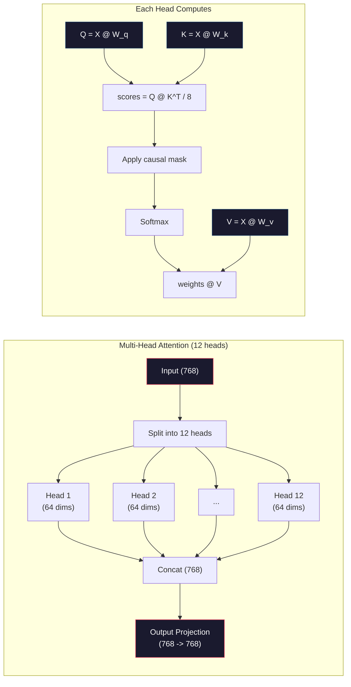
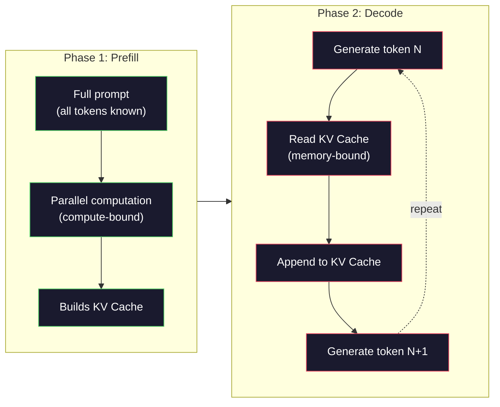

# 预训练一个 Mini GPT（1.24 亿参数）

> GPT-2 Small 拥有 1.24 亿个参数，包括 12 层 Transformer、12 个注意力头和 768 维嵌入。用一张 GPU，只需几小时就能从零训练它。大多数人从未这样做过，只会使用预训练检查点。但如果没有亲手训练过一个模型，你就不可能真正理解自己赖以构建产品的模型内部究竟发生了什么。

**Type:** 构建
**Languages:** Python（使用 numpy）
**Prerequisites:** 阶段 10 第 01～03 课（词元化器、构建词元化器、数据流水线）
**Time:** 约 120 分钟

## 学习目标

- 从零实现完整的 GPT-2 架构（1.24 亿参数）：词元嵌入、位置嵌入、Transformer 块和语言模型头
- 使用下一词元预测与交叉熵损失，在文本语料库上训练 GPT 模型
- 实现带温度采样和 top-k/top-p 过滤的自回归文本生成
- 监控训练损失曲线，并验证模型学会了连贯的语言模式

## 问题

你知道 Transformer 是什么，读过相关图示，也能背出“Attention Is All You Need”，还能在白板上画出标有“多头注意力”的方框。

这些都不代表你理解模型生成文本时发生了什么。

GPT-2 Small（使用权重绑定）共有 124,438,272 个参数。每个参数都由同一个训练循环设定：前向传播、计算损失、反向传播、更新权重。十二个 Transformer 块，每块十二个注意力头，768 维嵌入空间，50,257 个词元的词表。模型每生成一个词元，全部 1.24 亿个参数都会参与同一条矩阵乘法链：它接收词元 ID 序列，输出下一个词元的概率分布。

如果从未亲手构建过它，你面对的就是一个黑盒。你可以调用 API，也可以做微调；但当模型出错——出现幻觉、不断重复、拒绝遵循指令——你就没有解释*原因*的心智模型。

本课将从零构建 GPT-2 Small，不使用 PyTorch，而使用 numpy。每次矩阵乘法都清晰可见，每个梯度都由你的代码计算。你会亲眼看到 1.24 亿个数字如何共同预测下一个单词。

## 概念

### GPT 架构

GPT 是自回归语言模型。“自回归”意味着它一次生成一个词元，每个词元都以前面的所有词元为条件。其架构由一叠 Transformer 解码器块组成。

从词元 ID 到下一词元概率的完整计算图如下：

1. 输入词元 ID，形状为 (batch_size, seq_len)。
2. 查找词元嵌入。每个 ID 映射为一个 768 维向量，形状为 (batch_size, seq_len, 768)。
3. 查找位置嵌入。每个位置（0、1、2……）映射为一个 768 维向量，形状相同。
4. 将词元嵌入与位置嵌入相加。
5. 依次通过 12 个 Transformer 块。
6. 执行最终层归一化。
7. 线性投影到词表大小，形状为 (batch_size, seq_len, vocab_size)。
8. 通过 Softmax 得到概率。

这就是整个模型。没有卷积，没有循环，只有嵌入、注意力、前馈网络和层归一化，并重复堆叠 12 次。



### Transformer 块

12 个块都遵循相同模式。它采用预归一化架构（GPT-2 使用预归一化，而非原始 Transformer 的后归一化）：

1. 层归一化
2. 多头自注意力
3. 残差连接（把输入加回来）
4. 层归一化
5. 前馈网络（MLP）
6. 残差连接（把输入加回来）

残差连接至关重要。没有它们，反向传播抵达第 1 个块时，梯度早已消失。有了残差连接，梯度可以沿“跳跃”路径从损失直接流向任意层。因此，你可以堆叠 12、32，甚至 96 个块（据传 GPT-4 使用 120 个）。

### 注意力：核心机制

自注意力让每个词元查看之前的所有词元，并决定应当分别投入多少注意力。其数学过程如下。

对每个词元位置，从输入计算三个向量：
- **查询（Q）**：“我在寻找什么？”
- **键（K）**：“我包含什么？”
- **值（V）**：“我携带什么信息？”

```
Q = input @ W_q    (768 -> 768)
K = input @ W_k    (768 -> 768)
V = input @ W_v    (768 -> 768)

attention_scores = Q @ K^T / sqrt(d_k)
attention_scores = mask(attention_scores)   # causal mask: -inf for future positions
attention_weights = softmax(attention_scores)
output = attention_weights @ V
```

因果掩码让 GPT 具备自回归性质。位置 5 可以关注位置 0～5，却不能关注位置 6、7、8 等。这可以防止模型在训练时偷看未来词元。

**多头注意力**把 768 维空间拆成 12 个头，每个头 64 维。不同的头会学习不同注意力模式。一个头可能跟踪句法关系（主谓一致），另一个可能跟踪语义相似性（同义词），还有一个可能关注位置接近程度（附近单词）。12 个头的输出会拼接起来，再投影回 768 维。



除以 sqrt(d_k)——也就是 sqrt(64) = 8——是在进行缩放。如果没有这一步，高维向量的点积会变得很大，把 Softmax 推入梯度几乎为零的区域。这是最初《Attention Is All You Need》论文的关键洞见之一。

### KV 缓存：推理为何如此快速

训练时会一次处理完整序列，推理时则一次生成一个词元。若不优化，生成第 N 个词元时，需要为之前 N-1 个词元重新计算注意力。每个生成词元的成本为 O(N^2)，生成长度为 N 的整个序列则为 O(N^3)。

KV 缓存解决了这个问题。计算每个词元的 K 与 V 后，将它们保存下来。生成第 N+1 个词元时，只需为新词元计算 Q，再读取之前所有词元缓存的 K 与 V。这样，K 和 V 的逐词元计算成本从 O(N) 降至 O(1)。注意力分数计算仍为 O(N)，因为仍需关注之前的所有位置，但避免了对输入进行重复矩阵乘法。

对于拥有 12 层、12 个头的 GPT-2，KV 缓存为每个词元存储 2（K + V）× 12 层 × 12 个头 × 64 维 = 18,432 个数值。长度为 1024 个词元的序列，在 FP32 下约占 75MB。对于拥有 128 层的 Llama 3 405B，单条序列的 KV 缓存可能超过 10GB。这就是长上下文推理受内存限制的原因。

### 预填充与解码：推理的两个阶段

向大语言模型发送提示词时，推理分为两个截然不同的阶段。

**预填充**并行处理完整提示词。由于所有词元均已知，模型可以同时计算所有位置的注意力。这个阶段受计算能力限制——GPU 会满负荷执行矩阵乘法。在 A100 上处理 1000 个词元的提示词，预填充大约需要 20～50ms。

**解码**一次生成一个词元。每个新词元依赖之前所有词元。这个阶段受内存限制——瓶颈是从 GPU 内存读取模型权重和 KV 缓存，而不是矩阵运算本身。GPU 的计算核心大多在等待内存读取。对于 GPT-2，每个解码步骤所需时间与矩阵乘法的 FLOP 数量几乎无关，因为内存带宽才是限制因素。

这一区别对生产系统很重要。预填充吞吐量随 GPU 算力提高（FLOPS 越多，预填充越快）；解码吞吐量则随内存带宽提高（内存越快，解码越快）。因此 NVIDIA 的 H100 相比 A100 着重改善内存带宽——它能直接加速词元生成。



### 训练循环

训练大语言模型就是下一词元预测。给定词元 [0, 1, 2, ..., N-1]，预测词元 [1, 2, 3, ..., N]。损失函数是模型预测概率分布与实际下一词元之间的交叉熵。

一个训练步骤包括：

1. **前向传播：** 让批次通过全部 12 个块，得到每个位置的 Logit（Softmax 之前的分数）。
2. **计算损失：** 计算 Logit 与目标词元（输入向后移动一个位置）之间的交叉熵。
3. **反向传播：** 使用反向传播为全部 1.24 亿个参数计算梯度。
4. **优化器步骤：** 更新权重。GPT-2 使用 Adam，并配合学习率预热和余弦衰减。

学习率调度比你想象中更重要。GPT-2 在前 2,000 个步骤中把学习率从 0 预热到峰值，然后按余弦曲线衰减。直接使用高学习率会让模型发散，在训练后期一直保持较高的固定学习率则会导致振荡。所有主流大语言模型都采用先预热、后衰减的模式。

### GPT-2 Small：具体数字

| 组件 | 形状 | 参数量 |
|-----------|-------|------------|
| 词元嵌入 | (50257, 768) | 38,597,376 |
| 位置嵌入 | (1024, 768) | 786,432 |
| 每块注意力（W_q、W_k、W_v、W_out） | 4 × (768, 768) | 2,359,296 |
| 每块前馈网络（上投影 + 下投影） | (768, 3072) + (3072, 768) | 4,718,592 |
| 每块层归一化（2 个） | 2 × 768 × 2 | 3,072 |
| 最终层归一化 | 768 × 2 | 1,536 |
| **每个块合计** | | **7,080,960** |
| **总计（12 个块）** | | **85,054,464 + 39,383,808 = 124,438,272** |

输出投影（Logit 头）与词元嵌入矩阵共享权重。这称为权重绑定——既能减少 3800 万个参数，又能改善性能，因为它迫使模型使用同一个表示空间来理解词元（嵌入）和预测词元（输出）。

## 动手构建

### 第 1 步：嵌入层

词元嵌入把 50,257 个可能词元分别映射为 768 维向量。位置嵌入则添加每个词元在序列中所处位置的信息，二者相加。

```python
import numpy as np

class Embedding:
    def __init__(self, vocab_size, embed_dim, max_seq_len):
        self.token_embed = np.random.randn(vocab_size, embed_dim) * 0.02
        self.pos_embed = np.random.randn(max_seq_len, embed_dim) * 0.02

    def forward(self, token_ids):
        seq_len = token_ids.shape[-1]
        tok_emb = self.token_embed[token_ids]
        pos_emb = self.pos_embed[:seq_len]
        return tok_emb + pos_emb
```

初始化标准差 0.02 来自 GPT-2 论文。过大时，最初几次前向传播会产生极端值，使训练不稳定；过小时，所有输入的初始输出几乎相同，导致早期梯度信号毫无用处。

### 第 2 步：带因果掩码的自注意力

先实现单头注意力。因果掩码会在 Softmax 前把未来位置设为负无穷，确保每个位置只能关注自身和更早的位置。

```python
def attention(Q, K, V, mask=None):
    d_k = Q.shape[-1]
    scores = Q @ K.transpose(0, -1, -2 if Q.ndim == 4 else 1) / np.sqrt(d_k)
    if mask is not None:
        scores = scores + mask
    weights = np.exp(scores - scores.max(axis=-1, keepdims=True))
    weights = weights / weights.sum(axis=-1, keepdims=True)
    return weights @ V
```

Softmax 的实现会在取指数前减去最大值。若不这样做，exp(大数) 会溢出为无穷。这个数值稳定技巧不会改变输出，因为对任意常数 c，都有 softmax(x - c) = softmax(x)。

### 第 3 步：多头注意力

把 768 维输入拆成 12 个头，每个头 64 维。每个头独立计算注意力，再拼接结果并投影回 768 维。

```python
class MultiHeadAttention:
    def __init__(self, embed_dim, num_heads):
        self.num_heads = num_heads
        self.head_dim = embed_dim // num_heads
        self.W_q = np.random.randn(embed_dim, embed_dim) * 0.02
        self.W_k = np.random.randn(embed_dim, embed_dim) * 0.02
        self.W_v = np.random.randn(embed_dim, embed_dim) * 0.02
        self.W_out = np.random.randn(embed_dim, embed_dim) * 0.02

    def forward(self, x, mask=None):
        batch, seq_len, d = x.shape
        Q = (x @ self.W_q).reshape(batch, seq_len, self.num_heads, self.head_dim).transpose(0, 2, 1, 3)
        K = (x @ self.W_k).reshape(batch, seq_len, self.num_heads, self.head_dim).transpose(0, 2, 1, 3)
        V = (x @ self.W_v).reshape(batch, seq_len, self.num_heads, self.head_dim).transpose(0, 2, 1, 3)

        scores = Q @ K.transpose(0, 1, 3, 2) / np.sqrt(self.head_dim)
        if mask is not None:
            scores = scores + mask
        weights = np.exp(scores - scores.max(axis=-1, keepdims=True))
        weights = weights / weights.sum(axis=-1, keepdims=True)
        attn_out = weights @ V

        attn_out = attn_out.transpose(0, 2, 1, 3).reshape(batch, seq_len, d)
        return attn_out @ self.W_out
```

多头注意力中最令人困惑的部分，就是变形-转置-变形这一串操作。过程如下：(batch, seq_len, 768) 张量先变成 (batch, seq_len, 12, 64)，再变成 (batch, 12, seq_len, 64)。现在 12 个头各自拥有一个 (seq_len, 64) 矩阵，可以独立执行注意力。注意力结束后，再逆转这一过程：(batch, 12, seq_len, 64) 变为 (batch, seq_len, 12, 64)，最后变回 (batch, seq_len, 768)。

### 第 4 步：Transformer 块

一个完整 Transformer 块包括：层归一化、带残差的多头注意力、层归一化、带残差的前馈网络。

```python
class LayerNorm:
    def __init__(self, dim, eps=1e-5):
        self.gamma = np.ones(dim)
        self.beta = np.zeros(dim)
        self.eps = eps

    def forward(self, x):
        mean = x.mean(axis=-1, keepdims=True)
        var = x.var(axis=-1, keepdims=True)
        return self.gamma * (x - mean) / np.sqrt(var + self.eps) + self.beta


class FeedForward:
    def __init__(self, embed_dim, ff_dim):
        self.W1 = np.random.randn(embed_dim, ff_dim) * 0.02
        self.b1 = np.zeros(ff_dim)
        self.W2 = np.random.randn(ff_dim, embed_dim) * 0.02
        self.b2 = np.zeros(embed_dim)

    def forward(self, x):
        h = x @ self.W1 + self.b1
        h = np.maximum(0, h)  # GELU approximation: ReLU for simplicity
        return h @ self.W2 + self.b2


class TransformerBlock:
    def __init__(self, embed_dim, num_heads, ff_dim):
        self.ln1 = LayerNorm(embed_dim)
        self.attn = MultiHeadAttention(embed_dim, num_heads)
        self.ln2 = LayerNorm(embed_dim)
        self.ffn = FeedForward(embed_dim, ff_dim)

    def forward(self, x, mask=None):
        x = x + self.attn.forward(self.ln1.forward(x), mask)
        x = x + self.ffn.forward(self.ln2.forward(x))
        return x
```

前馈网络先把 768 维输入扩展到 3,072 维（4 倍），应用非线性函数，再投影回 768 维。这种先扩展后收缩的模式，让模型在每个位置都能使用更“宽”的内部表示。GPT-2 使用 GELU 激活函数；为简化实现，这里使用 ReLU——就理解架构而言，二者差异不大。

### 第 5 步：完整 GPT 模型

堆叠 12 个 Transformer 块，在前端加入嵌入层，在末端加入输出投影。

```python
class MiniGPT:
    def __init__(self, vocab_size=50257, embed_dim=768, num_heads=12,
                 num_layers=12, max_seq_len=1024, ff_dim=3072):
        self.embedding = Embedding(vocab_size, embed_dim, max_seq_len)
        self.blocks = [
            TransformerBlock(embed_dim, num_heads, ff_dim)
            for _ in range(num_layers)
        ]
        self.ln_f = LayerNorm(embed_dim)
        self.vocab_size = vocab_size
        self.embed_dim = embed_dim

    def forward(self, token_ids):
        seq_len = token_ids.shape[-1]
        mask = np.triu(np.full((seq_len, seq_len), -1e9), k=1)

        x = self.embedding.forward(token_ids)
        for block in self.blocks:
            x = block.forward(x, mask)
        x = self.ln_f.forward(x)

        logits = x @ self.embedding.token_embed.T
        return logits

    def count_parameters(self):
        total = 0
        total += self.embedding.token_embed.size
        total += self.embedding.pos_embed.size
        for block in self.blocks:
            total += block.attn.W_q.size + block.attn.W_k.size
            total += block.attn.W_v.size + block.attn.W_out.size
            total += block.ffn.W1.size + block.ffn.b1.size
            total += block.ffn.W2.size + block.ffn.b2.size
            total += block.ln1.gamma.size + block.ln1.beta.size
            total += block.ln2.gamma.size + block.ln2.beta.size
        total += self.ln_f.gamma.size + self.ln_f.beta.size
        return total
```

注意这里的权重绑定：`logits = x @ self.embedding.token_embed.T`。输出投影复用了词元嵌入矩阵的转置。这不只是节省参数的技巧，还意味着模型在理解词元（嵌入）与预测词元（输出）时使用相同的向量空间。

### 第 6 步：训练循环

若要真正训练 1.24 亿参数的模型，需要 GPU 与 PyTorch。下面的训练循环在可由纯 numpy 运行的小模型上演示其机制。为保证可行，我们使用一个微型模型（4 层、4 个头、128 维）。

```python
def cross_entropy_loss(logits, targets):
    batch, seq_len, vocab_size = logits.shape
    logits_flat = logits.reshape(-1, vocab_size)
    targets_flat = targets.reshape(-1)

    max_logits = logits_flat.max(axis=-1, keepdims=True)
    log_softmax = logits_flat - max_logits - np.log(
        np.exp(logits_flat - max_logits).sum(axis=-1, keepdims=True)
    )

    loss = -log_softmax[np.arange(len(targets_flat)), targets_flat].mean()
    return loss


def train_mini_gpt(text, vocab_size=256, embed_dim=128, num_heads=4,
                   num_layers=4, seq_len=64, num_steps=200, lr=3e-4):
    tokens = np.array(list(text.encode("utf-8")[:2048]))
    model = MiniGPT(
        vocab_size=vocab_size, embed_dim=embed_dim, num_heads=num_heads,
        num_layers=num_layers, max_seq_len=seq_len, ff_dim=embed_dim * 4
    )

    print(f"Model parameters: {model.count_parameters():,}")
    print(f"Training tokens: {len(tokens):,}")
    print(f"Config: {num_layers} layers, {num_heads} heads, {embed_dim} dims")
    print()

    for step in range(num_steps):
        start_idx = np.random.randint(0, max(1, len(tokens) - seq_len - 1))
        batch_tokens = tokens[start_idx:start_idx + seq_len + 1]

        input_ids = batch_tokens[:-1].reshape(1, -1)
        target_ids = batch_tokens[1:].reshape(1, -1)

        logits = model.forward(input_ids)
        loss = cross_entropy_loss(logits, target_ids)

        if step % 20 == 0:
            print(f"Step {step:4d} | Loss: {loss:.4f}")

    return model
```

损失从接近 ln(vocab_size) 开始——对于包含 256 个词元的字节级词表，即 ln(256) = 5.55。随机模型为每个词元分配相同概率。随着训练推进，损失会下降，因为模型开始学习常见模式，例如“t”后面出现“h”、句号后面出现空格等。

生产环境会使用 Adam 优化器、梯度累积、学习率预热与梯度裁剪。前向传播-损失-反向传播-更新循环完全相同，只是优化器更加复杂。

### 第 7 步：文本生成

生成时，训练好的模型一次预测一个词元。每次预测都从输出分布中采样，或者以 argmax 贪心选取。

```python
def generate(model, prompt_tokens, max_new_tokens=100, temperature=0.8):
    tokens = list(prompt_tokens)
    seq_len = model.embedding.pos_embed.shape[0]

    for _ in range(max_new_tokens):
        context = np.array(tokens[-seq_len:]).reshape(1, -1)
        logits = model.forward(context)
        next_logits = logits[0, -1, :]

        next_logits = next_logits / temperature
        probs = np.exp(next_logits - next_logits.max())
        probs = probs / probs.sum()

        next_token = np.random.choice(len(probs), p=probs)
        tokens.append(next_token)

    return tokens
```

温度控制随机性。温度 1.0 使用原始分布；温度 0.5 会让分布更尖锐（更确定——模型更常选择概率最高的选项）；温度 1.5 会让分布更平坦（更随机——低概率词元获得更大机会）；温度 0.0 则是贪心解码（始终选择概率最高的词元）。

`tokens[-seq_len:]` 窗口必不可少，因为模型具有最大上下文长度（GPT-2 为 1024）。超过这个长度后，就必须丢弃最早的词元。这正是人们所说的“上下文窗口”。

```figure
sampling-decoder
```

## 学以致用

### 完整训练与生成演示

```python
corpus = """The transformer architecture has revolutionized natural language processing.
Attention mechanisms allow the model to focus on relevant parts of the input.
Self-attention computes relationships between all pairs of positions in a sequence.
Multi-head attention splits the representation into multiple subspaces.
Each attention head can learn different types of relationships.
The feedforward network provides nonlinear transformations at each position.
Residual connections enable gradient flow through deep networks.
Layer normalization stabilizes training by normalizing activations.
Position embeddings give the model information about token ordering.
The causal mask ensures autoregressive generation during training.
Pre-training on large text corpora teaches the model general language understanding.
Fine-tuning adapts the pre-trained model to specific downstream tasks."""

model = train_mini_gpt(corpus, num_steps=200)

prompt = list("The transformer".encode("utf-8"))
output_tokens = generate(model, prompt, max_new_tokens=100, temperature=0.8)
generated_text = bytes(output_tokens).decode("utf-8", errors="replace")
print(f"\nGenerated: {generated_text}")
```

使用小模型在小型语料上训练，生成的文本充其量只是勉强连贯。它会从训练文本中学到一些字节级模式，却无法像使用 40GB 训练数据和完整 1.24 亿参数架构的 GPT-2 那样泛化。重点不在输出质量，而在于你能追踪每一步：查找嵌入、计算注意力、执行前馈变换、投影 Logit、Softmax，以及采样。每项操作都清晰可见。

## 交付成果

本课会生成 `outputs/prompt-gpt-architecture-analyzer.md`——一个用于分析任意 GPT 风格模型架构选择的提示词。向它提供模型卡或技术报告，它会拆解参数分配、注意力设计与缩放决策。

## 练习

1. 将模型从 12 层/12 个头改为 24 层/16 个头，并统计参数量。深度翻倍与宽度（嵌入维度）翻倍相比，会产生怎样的差异？

2. 实现 GELU 激活函数（GELU(x) = x * 0.5 * (1 + erf(x / sqrt(2))))，替换前馈网络中的 ReLU。分别使用两种激活函数训练 500 步，并比较最终损失。

3. 为生成函数添加 KV 缓存。首次前向传播后保存每一层的 K 与 V 张量，并在后续词元中复用。测量加速效果：分别使用和不使用缓存生成 200 个词元，并比较实际运行时间。

4. 实现 top-k 采样（只考虑概率最高的 k 个词元）和 top-p 采样（核采样：只考虑累积概率超过 p 的最小词元集合）。在温度为 0.8 时，比较 top-k=50 与 top-p=0.95 的输出质量。

5. 构建训练损失曲线绘制器。训练模型 1000 步，并绘制损失随步骤变化的曲线。识别三个阶段：快速初始下降（学习常见字节）、较慢的中间阶段（学习字节模式），以及平台期（在小语料上过拟合）。无论训练 128 维模型还是 GPT-4，这条曲线的形状都相同。

## 关键术语

| 术语 | 人们通常怎么说 | 实际含义 |
|------|----------------|----------------------|
| 自回归 | “一次生成一个单词” | 每个输出词元都以前面的所有词元为条件——模型预测 P(token_n \| token_0, ..., token_{n-1}) |
| 因果掩码 | “看不到未来” | 由负无穷值组成的上三角矩阵，防止训练时关注未来位置 |
| 多头注意力 | “多种注意力模式” | 把 Q、K、V 拆分到并行注意力头中（例如 GPT-2 的 12 个 64 维头），让每个头学习不同类型的关系 |
| KV 缓存 | “用于加速的缓存” | 存储此前词元已计算的键和值张量，避免自回归生成中的重复计算 |
| 预填充 | “处理提示词” | 第一个推理阶段，并行处理提示词的全部词元——受 GPU FLOPS 限制 |
| 解码 | “生成词元” | 第二个推理阶段，逐个生成词元——受 GPU 内存带宽限制 |
| 权重绑定 | “共享嵌入” | 输入词元嵌入与输出投影头使用同一个矩阵——在 GPT-2 中节省 3800 万参数 |
| 残差连接 | “跳跃连接” | 把输入直接加到子层输出上（x + sublayer(x)）——让梯度能够流经深层网络 |
| 层归一化 | “归一化激活值” | 沿特征维度归一化到均值 0、方差 1，并带有可学习的缩放与偏置参数 |
| 交叉熵损失 | “预测错了多少” | 对正确下一词元所分配概率的负对数，再对所有位置取平均——标准大语言模型训练目标 |

## 延伸阅读

- [Radford 等，2019——“语言模型是无监督多任务学习器”（GPT-2）](https://cdn.openai.com/better-language-models/language_models_are_unsupervised_multitask_learners.pdf)——提出 1.24 亿至 15 亿参数 GPT-2 系列的论文
- [Vaswani 等，2017——“Attention Is All You Need”](https://arxiv.org/abs/1706.03762)——提出缩放点积注意力与多头注意力的原始 Transformer 论文
- [Llama 3 技术报告](https://arxiv.org/abs/2407.21783)——Meta 如何用 1.6 万张 GPU 把 GPT 架构扩展到 4050 亿参数
- [Pope 等，2022——“高效扩展 Transformer 推理”](https://arxiv.org/abs/2211.05102)——正式阐述预填充与解码以及 KV 缓存分析的论文
