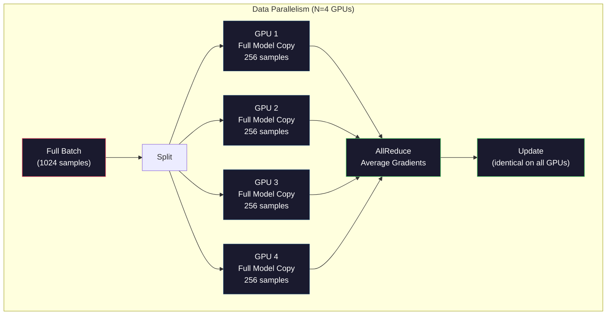
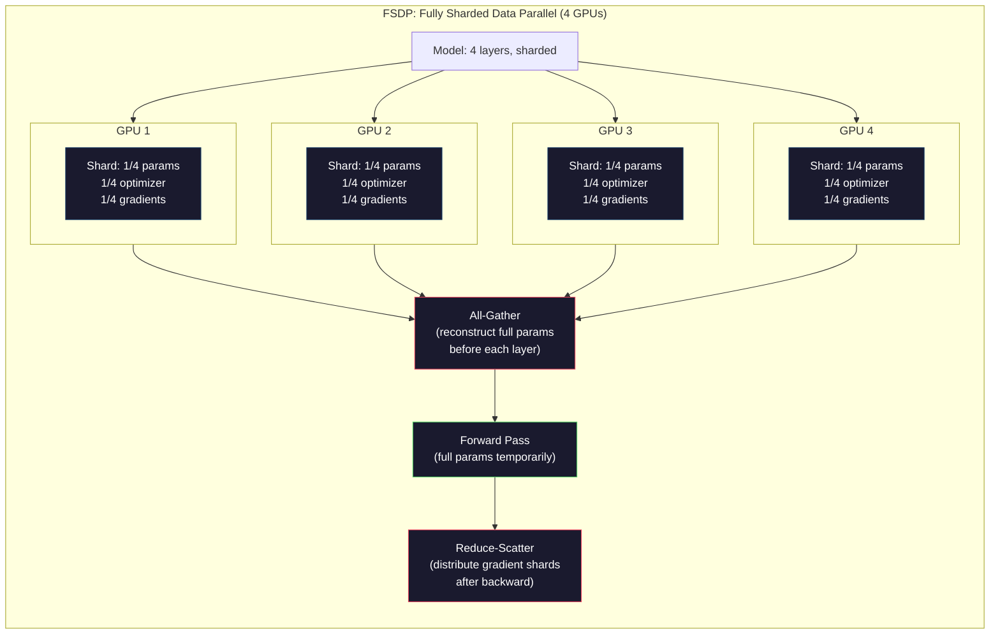
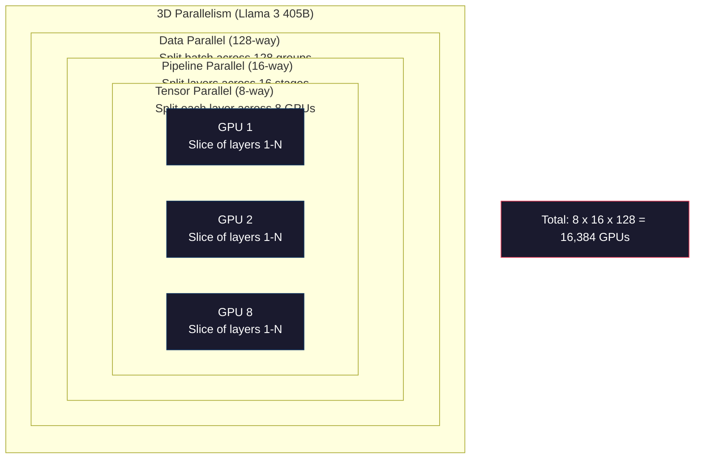

# 规模化：分布式训练、FSDP 与 DeepSpeed

> 你的 1.24 亿参数模型已经在一张 GPU 上完成训练。现在试试 70 亿参数：模型装不进显存，单机处理数据需要数周。达到这种规模后，分布式训练不再是可选项，而是唯一出路。

**Type:** 构建
**Languages:** Python
**Prerequisites:** 阶段 10 第 04 课（预训练一个 Mini GPT）
**Time:** 约 120 分钟

## 学习目标

- 解释三种并行方式（数据并行、张量并行、流水线并行），并根据模型与集群规模判断何时需要哪一种
- 使用 PyTorch DDP 实现数据并行训练，在多张 GPU 之间同步梯度
- 计算给定模型规模所需的内存预算（权重 + 优化器状态 + 梯度 + 激活值），从而确定最低硬件配置
- 配置 FSDP 或 DeepSpeed ZeRO 的不同阶段，将模型状态分片到多张 GPU，使超过单卡显存的模型也能装入

## 问题

一个 70 亿参数模型，仅 FP16 权重就需要 14GB。Adam 优化器还会为每个参数保存两个额外副本（一阶矩估计和二阶矩估计），又需要 28GB。反向传播中的梯度还要增加 14GB。在存储任何激活值之前，就已经用掉 56GB。

一张 NVIDIA A100 有 80GB 显存。

80GB 中已有 56GB 被占用，只剩 24GB 存储激活值——这些是前向传播中计算、并且必须保留到反向传播的中间结果。对于序列长度为 2048、模型维度为 4096 的模型，单层激活值每个样本约占 64MB。32 层就需要每个样本 2GB；批大小为 8 时需要 16GB。你只有 24GB，批大小达到 12 就会爆显存。

再试试 700 亿参数。仅 FP16 权重就有 140GB，单张 GPU 无法容纳。至少需要 2 张 A100（2 × 80GB = 160GB）才能仅仅装下权重。加入优化器状态和梯度后，需要的数量会多得多：最低 3 张以上，实际通常取决于分片策略，需要 8～16 张。

Llama 3 405B 使用 16,384 张 NVIDIA H100 训练，估算计算成本为 1 亿美元。DeepSeek V3 则通过巧妙的架构（混合专家让每个词元只激活一小部分参数）和训练效率，以约 560 万美元训练出了规模相当的模型。

本课介绍让大规模训练成为可能的四种策略：数据并行、张量并行、流水线并行与完全分片数据并行。在接触任何分布式训练框架之前，你会先用纯 Python 模拟每一种机制。

## 概念

### 为什么必须分布式训练

下面是真实模型的内存计算。每个数字都经过计算，并非估算。

| 模型 | 参数量 | 权重（FP16） | Adam 状态 | 梯度（FP16） | 总计（不含激活值） |
|-------|--------|----------------|-------------|------------------|----------------------|
| GPT-2 Small | 124M | 248 MB | 992 MB | 248 MB | 1.5 GB |
| Llama 3 8B | 8B | 16 GB | 64 GB | 16 GB | 96 GB |
| Llama 3 70B | 70B | 140 GB | 560 GB | 140 GB | 840 GB |
| Llama 3 405B | 405B | 810 GB | 3,240 GB | 810 GB | 4,860 GB |

“Adam 状态”这一列才是内存杀手。Adam 会为每个参数保存运行均值（m）和运行方差（v），二者都采用 FP32。对于 70B 模型，所需空间为 70B × 4 字节 × 2 = 560GB。仅优化器就要占满 7 张 A100。

单张 H100 有 80GB 显存。Llama 3 405B 至少需要 61 张 H100，才能容纳权重、优化器状态和梯度；加入激活值后，数量还会继续增加。Meta 使用 16,384 张 GPU，不是因为他们乐意如此，而是因为不得不这样做。

### 数据并行

这是最简单的分布式策略。把完整模型复制到 N 张 GPU，把每个训练批次均分成 N 份。每张 GPU 在自己的数据分片上执行前向与反向传播。反向传播结束后，在所有 GPU 之间平均梯度。每张 GPU 使用相同的平均梯度更新自己的权重副本，因而所有副本始终同步。

**优点：** 吞吐量线性扩展。N 张 GPU 每步可以处理 N 倍数据。通信仅限于梯度平均，而且可以与计算重叠。

**缺点：** 每张 GPU 都要保存模型、优化器状态和梯度的完整副本。对于 70B 模型，每张 GPU 都需要 840GB。数据并行不会降低单卡内存，只会缩短训练时间。

**计算方式：** 有效批大小 = 单卡批大小 × N。例如 N=64 张 GPU、单卡批大小为 16，有效批大小就是 1,024。Llama 3 每一步的有效批大小达到 1600 万个词元。



### 张量并行

把单层拆分到多张 GPU 上。一次矩阵乘法由多张 GPU 分担，每张只计算结果的一部分。

以某个前馈层中形状为 (8192, 8192) 的权重矩阵为例。采用四路张量并行时，每张 GPU 保存一个 (8192, 2048) 分片。每张 GPU 用输入乘以自己的分片，得到部分结果；再通过全归约或全收集组合这些结果，得到完整输出。

**优点：** 降低模型权重在每张 GPU 上的内存占用。把 70B 模型拆分到 8 张 GPU 后，每张 GPU 只需保存约 8.75B 参数对应的权重。

**缺点：** 每一层之后都需要高速 GPU 间通信。每次矩阵乘法后的全归约会增加延迟。NVLink（同一节点内 GPU 之间为 900 GB/s）很适合这种方式；跨节点的 InfiniBand（400 Gb/s，约 50 GB/s）则表现不佳。因此张量并行几乎总是限制在单个节点内（8 张 GPU）。

**实际应用：** Megatron-LM 开创了张量并行。Llama 3 405B 在每个节点内采用八路张量并行。

### 流水线并行

按层拆分模型。GPU 1 运行第 1～8 层，GPU 2 运行第 9～16 层，GPU 3 运行第 17～24 层，GPU 4 运行第 25～32 层。数据沿流水线前进：GPU 1 计算自己的层并把激活值发送给 GPU 2，后者计算自己的层再发送给 GPU 3，以此类推。

**优点：** GPU 间通信量很小——只需传递层边界处的激活值，相比梯度或权重要小得多。由于带宽要求低，它可以跨节点工作。

**缺点：** 存在流水线气泡。当 GPU 4 正在对微批次 1 执行前向传播时，GPU 1、2、3 都处于空闲状态，因为它们已经完成各自部分的前向传播。反向传播时，模式反转。采用朴素流水线时，N 个流水线阶段的 GPU 利用率只有 1/N。

**GPipe 与 PipeDream** 通过把批次拆成微批次来解决气泡问题。GPU 1 完成微批次 1 的前向传播后，立即开始处理微批次 2，从而让不同流水线阶段的计算重叠。对于 M 个微批次和 N 个阶段，气泡比例降至 (N-1)/M。若使用 M=16 个微批次和 N=4 个阶段，气泡为 3/16，即 18.75% 的空闲时间。

### FSDP：完全分片数据并行

FSDP 兼具数据并行的可扩展性与分片的内存效率。每张 GPU 不再保存完整模型，而只保存参数、梯度和优化器状态的 1/N。

在某一层执行前向传播前，FSDP 运行一次**全收集**，从所有 GPU 收集完整参数到每张 GPU 的内存中。前向传播结束后，每张 GPU 丢弃非本地参数。反向传播时，再次运行全收集以重建梯度计算所需的参数。反向传播结束后，通过**归约散布**分发梯度分片，使每张 GPU 只保存梯度的 1/N。

**70B 模型在 8 张 GPU 上的计算：**

| 组件 | 不使用 FSDP | 使用 FSDP |
|-----------|-------------|-----------|
| 权重（FP16） | 每张 GPU 140 GB | 每张 GPU 17.5 GB |
| Adam 状态（FP32） | 每张 GPU 560 GB | 每张 GPU 70 GB |
| 梯度（FP16） | 每张 GPU 140 GB | 每张 GPU 17.5 GB |
| **总计** | **每张 GPU 840 GB** | **每张 GPU 105 GB** |

不使用 FSDP 时，一张 80GB GPU 无法容纳 70B 模型。使用 8 张 GPU 的 FSDP 后，每张仍需 105GB——等等，还是装不下。至少需要 16 张 GPU 才能降至每卡 80GB 以下，或者把 FSDP 与激活检查点结合起来（反向传播期间重新计算激活值，而不是存储它们）。

相比普通数据并行，FSDP 的通信成本更高，因为每层之前都要进行全收集。但它节省的内存，让原本不可能的训练任务成为可能。



### DeepSpeed ZeRO

DeepSpeed 的 ZeRO（零冗余优化器）在概念上与 FSDP 相同，但由 Microsoft 独立开发。它定义了三个阶段，分片程度逐步提高：

| 阶段 | 分片内容 | 内存节省 | 通信量 |
|-------|--------|---------------|---------------|
| ZeRO-1 | 仅优化器状态 | 约减少 4 倍 | 与数据并行相同 |
| ZeRO-2 | + 梯度 | 约减少 8 倍 | 略多 |
| ZeRO-3 | + 参数 | 约减少 N 倍（N 张 GPU） | 每层全收集 |

ZeRO-3 等价于 FSDP。名称不同，机制相同。DeepSpeed 证明这一概念后，PyTorch 增加了原生 FSDP 实现。

DeepSpeed 还引入了 ZeRO-Offload（把优化器状态卸载到更便宜、更大的 CPU 内存）和 ZeRO-Infinity（卸载到 NVMe SSD）。这些方案以计算速度换取内存容量——卸载后的操作较慢，却能释放 GPU 显存。

### 混合精度训练

现代训练会同时使用多种浮点格式：

- **前向传播：** FP16 或 BF16（16 位），内存占用是 FP32 的一半；在 Tensor Core 上，矩阵乘法速度快 2 倍。
- **主权重：** FP32（32 位），由优化器维护，确保权重更新时的数值精度。
- **损失缩放：** 反向传播前把损失乘以一个较大常数，防止 FP16 梯度下溢为零；执行优化器步骤前再除以同一常数。

BF16（Brain Float 16）拥有与 FP32 相同的指数范围（8 个指数位），但精度更低（7 个尾数位，而 FP32 有 23 个）。它通常不需要损失缩放，因为能够表示相同的数值范围。FP16 有 5 个指数位和 10 个尾数位——可以表示更精细的数值，却会在极端幅度下上溢或下溢。

Google TPU 原生使用 BF16，NVIDIA A100 与 H100 同时支持 FP16 和 BF16。行业已基本转向 BF16，因为它省去了损失缩放的麻烦。

**7B 模型的内存对比：**

| 精度 | 权重 | 优化器 | 梯度 | 总计 |
|-----------|---------|-----------|-----------|-------|
| 全部 FP32 | 28 GB | 56 GB | 28 GB | 112 GB |
| 混合（BF16 + FP32 主权重） | 14 GB | 56 GB | 14 GB | 84 GB |

对于这个模型，混合精度可以节省 28GB。无论精度如何，优化器状态都保留为 FP32——绝大部分内存正耗在这里。

### Megatron-LM 与三维并行

真正的大规模训练会组合三种并行方式：

- **数据并行**跨节点组运行（扩大批大小）
- **张量并行**在节点内运行（把每层拆到 8 张 GPU）
- **流水线并行**跨节点运行（把若干层组成的分组拆到不同机器）

Llama 3 405B 在 16,384 张 H100 上的配置为：
- 每个节点内采用八路张量并行（每节点 8 张 GPU）
- 跨节点采用十六路流水线并行（16 个流水线阶段）
- 剩余维度采用 128 路数据并行（16,384 / 8 / 16 = 128）

这种三维分解（8 × 16 × 128 = 16,384）正是扩展到数千张 GPU 的方式。每张 GPU 看到不同的数据分片（数据并行），保存每一层的一个切片（张量并行），并计算不同的一组层（流水线并行）。

DeepSeek V3 采取了不同方法。它的混合专家架构在每个词元上只激活 671B 参数中的 37B。这意味着每张 GPU 只需计算活跃参数，并为其存储激活值。它使用 2,048 张 H800 GPU 完成训练——不到 Meta GPU 数量的八分之一——成本为 560 万美元，而 Meta 估算为 1 亿美元。



```figure
paged-kv-cache
```

## 动手构建

### 第 1 步：模拟数据并行

把一个批次拆到模拟 GPU 上。每张 GPU 对自己的分片执行前向传播，再对“梯度”求平均（这里用损失值模拟梯度）。

```python
import numpy as np

def simulate_data_parallelism(data, num_gpus, model_fn):
    batch_size = len(data)
    shard_size = batch_size // num_gpus
    remainder = batch_size % num_gpus

    gpu_losses = []
    gpu_gradients = []

    offset = 0
    for gpu_id in range(num_gpus):
        extra = 1 if gpu_id < remainder else 0
        shard = data[offset:offset + shard_size + extra]
        offset += shard_size + extra

        loss, grad = model_fn(shard)
        gpu_losses.append(loss)
        gpu_gradients.append(grad)

    avg_loss = np.mean(gpu_losses)
    avg_gradient = np.mean(gpu_gradients, axis=0)

    return avg_loss, avg_gradient
```

全归约操作（平均梯度）是数据并行中唯一的通信。实践中，NVIDIA GPU 使用 NCCL 库实现环形全归约：每张 GPU 向相邻设备发送自身梯度的 1/N，并从另一侧相邻设备接收 1/N；经过 N-1 步后，每张 GPU 都拥有完整平均值。通信总量为 2 × gradient_size × (N-1)/N；当 N 很大时，它趋近梯度大小的 2 倍。

### 第 2 步：模拟张量并行

把一个权重矩阵拆到多张 GPU 上。每张 GPU 计算部分矩阵乘法，再组合结果。

```python
def simulate_tensor_parallelism(input_data, weight_matrix, num_gpus):
    d_in, d_out = weight_matrix.shape
    assert d_out % num_gpus == 0, f"d_out {d_out} not divisible by num_gpus {num_gpus}"
    shard_size = d_out // num_gpus

    partial_results = []
    for gpu_id in range(num_gpus):
        start = gpu_id * shard_size
        end = start + shard_size
        weight_shard = weight_matrix[:, start:end]

        partial = input_data @ weight_shard
        partial_results.append(partial)

    full_output = np.concatenate(partial_results, axis=-1)

    direct_output = input_data @ weight_matrix
    error = np.abs(full_output - direct_output).max()

    return full_output, error
```

误差应恰好为零（或机器精度量级）。张量并行在数学上是精确的——它得到的结果与在单张 GPU 上执行完整矩阵乘法相同。这里沿输出维度拆分，因此每张 GPU 生成不同的一组列，再通过拼接重建完整结果。

对于列并行线性层（拆分输出维度），需要拼接结果；对于行并行线性层（拆分输入维度），则需要求和。在 Transformer 前馈网络中，第一个线性层（扩展）使用列并行，第二个线性层（收缩）使用行并行，从而避免在两层之间执行全归约。

### 第 3 步：模拟流水线并行

把模型的层拆到虚拟 GPU 上，展示早期阶段在后续阶段计算时处于空闲状态的气泡问题。

```python
def simulate_pipeline_parallelism(num_layers, num_stages, num_microbatches):
    layers_per_stage = num_layers // num_stages

    timeline = {}
    clock = 0

    for mb in range(num_microbatches):
        for stage in range(num_stages):
            start_time = max(
                timeline.get((stage, mb - 1, "fwd"), (0, 0))[1] if mb > 0 else 0,
                timeline.get((stage - 1, mb, "fwd"), (0, 0))[1] if stage > 0 else 0,
            )
            end_time = start_time + layers_per_stage
            timeline[(stage, mb, "fwd")] = (start_time, end_time)

    last_fwd_end = max(v[1] for v in timeline.values())

    for mb in range(num_microbatches - 1, -1, -1):
        for stage in range(num_stages - 1, -1, -1):
            deps = [last_fwd_end]
            if mb < num_microbatches - 1 and (stage, mb + 1, "bwd") in timeline:
                deps.append(timeline[(stage, mb + 1, "bwd")][1])
            if stage < num_stages - 1 and (stage + 1, mb, "bwd") in timeline:
                deps.append(timeline[(stage + 1, mb, "bwd")][1])
            start_time = max(deps)
            end_time = start_time + layers_per_stage
            timeline[(stage, mb, "bwd")] = (start_time, end_time)

    total_time = max(v[1] for v in timeline.values())
    compute_time = num_microbatches * num_stages * layers_per_stage * 2
    bubble_fraction = 1.0 - compute_time / (total_time * num_stages)

    return timeline, total_time, bubble_fraction
```

使用 4 个阶段和 1 个微批次时，气泡比例为 75%——任何时刻都有四张 GPU 中的三张闲置。使用 16 个微批次后，气泡会降至约 19%。消除气泡的代价是内存：必须同时保存所有在途微批次的激活值。

### 第 4 步：内存计算器

精确计算任意规模模型的训练内存需求。

```python
def memory_calculator(
    params_billions,
    precision_bytes=2,
    optimizer="adam",
    num_gpus=1,
    sharding="none",
    sequence_length=2048,
    batch_size_per_gpu=1,
    hidden_dim=None,
    num_layers=None,
):
    params = params_billions * 1e9

    weight_memory = params * precision_bytes

    if optimizer == "adam":
        optimizer_memory = params * 4 * 2
    elif optimizer == "sgd":
        optimizer_memory = params * 4
    else:
        optimizer_memory = 0

    gradient_memory = params * precision_bytes

    total_no_activation = weight_memory + optimizer_memory + gradient_memory

    if hidden_dim and num_layers:
        activation_per_layer = (
            sequence_length * batch_size_per_gpu * hidden_dim * precision_bytes * 4
        )
        activation_memory = activation_per_layer * num_layers
    else:
        activation_memory = params * precision_bytes * 0.5

    if sharding == "fsdp" or sharding == "zero3":
        weight_memory /= num_gpus
        optimizer_memory /= num_gpus
        gradient_memory /= num_gpus
    elif sharding == "zero2":
        optimizer_memory /= num_gpus
        gradient_memory /= num_gpus
    elif sharding == "zero1":
        optimizer_memory /= num_gpus

    per_gpu_total = weight_memory + optimizer_memory + gradient_memory + activation_memory

    return {
        "params_billions": params_billions,
        "weights_gb": weight_memory / 1e9,
        "optimizer_gb": optimizer_memory / 1e9,
        "gradients_gb": gradient_memory / 1e9,
        "activations_gb": activation_memory / 1e9,
        "per_gpu_total_gb": per_gpu_total / 1e9,
        "total_across_gpus_gb": per_gpu_total * num_gpus / 1e9,
        "fits_on_80gb": per_gpu_total / 1e9 <= 80,
        "num_gpus": num_gpus,
        "sharding": sharding,
    }
```

这个计算器回答了每位机器学习工程师都会问的问题：“我需要多少张 GPU？”输入模型大小，查看它能否装入。不断调整分片策略，直到每张 GPU 的总占用低于 80GB。

### 第 5 步：模拟混合精度

比较 FP32、FP16 与混合精度训练的内存占用。

```python
def mixed_precision_comparison(params_billions):
    params = params_billions * 1e9

    fp32_weights = params * 4
    fp32_optimizer = params * 4 * 2
    fp32_gradients = params * 4
    fp32_total = fp32_weights + fp32_optimizer + fp32_gradients

    fp16_weights = params * 2
    fp16_master = params * 4
    fp16_optimizer = params * 4 * 2
    fp16_gradients = params * 2
    fp16_total = fp16_weights + fp16_master + fp16_optimizer + fp16_gradients

    mixed_weights = params * 2
    mixed_optimizer = params * 4 * 2
    mixed_gradients = params * 2
    mixed_total = mixed_weights + mixed_optimizer + mixed_gradients

    return {
        "fp32_total_gb": fp32_total / 1e9,
        "fp16_with_master_gb": fp16_total / 1e9,
        "mixed_bf16_gb": mixed_total / 1e9,
        "savings_vs_fp32": 1 - mixed_total / fp32_total,
    }
```

最令多数人意外的是：混合精度并不会让内存减半。无论使用哪种精度，优化器状态（Adam 的 m 和 v）仍保留为 FP32。7B 模型使用全 FP32 训练需要 112GB，混合精度则需要 84GB，只减少 25%，而非 50%。优化器才是占用大头。

## 学以致用

### 运行全部模拟

```python
def run_all_demos():
    print("=" * 70)
    print("DATA PARALLELISM SIMULATION")
    print("=" * 70)

    np.random.seed(42)
    data = np.random.randn(64, 32)
    weight = np.random.randn(32, 16)

    def model_fn(batch):
        output = batch @ weight
        loss = np.mean(output ** 2)
        grad = 2 * batch.T @ (batch @ weight) / len(batch)
        return loss, grad

    for n_gpus in [1, 2, 4, 8]:
        loss, grad = simulate_data_parallelism(data, n_gpus, model_fn)
        print(f"  {n_gpus} GPUs: loss={loss:.4f}, grad_norm={np.linalg.norm(grad):.4f}")

    print()
    print("=" * 70)
    print("TENSOR PARALLELISM SIMULATION")
    print("=" * 70)

    x = np.random.randn(4, 8192)
    W = np.random.randn(8192, 8192)

    for n_gpus in [1, 2, 4, 8]:
        output, error = simulate_tensor_parallelism(x, W, n_gpus)
        print(f"  {n_gpus} GPUs: output_shape={output.shape}, max_error={error:.2e}")

    print()
    print("=" * 70)
    print("PIPELINE PARALLELISM SIMULATION")
    print("=" * 70)

    for n_mb in [1, 4, 8, 16, 32]:
        _, total_t, bubble = simulate_pipeline_parallelism(32, 4, n_mb)
        print(f"  {n_mb:2d} micro-batches: total_time={total_t:4d}, bubble={bubble:.1%}")

    print()
    print("=" * 70)
    print("MEMORY CALCULATOR")
    print("=" * 70)

    configs = [
        (7, "none", 1),
        (7, "fsdp", 8),
        (70, "none", 1),
        (70, "fsdp", 8),
        (70, "fsdp", 16),
        (405, "fsdp", 64),
        (405, "fsdp", 128),
    ]

    print(f"  {'Model':>8} {'Sharding':>8} {'GPUs':>5} {'Per-GPU':>10} {'Fits 80GB':>10}")
    print("  " + "-" * 50)
    for params, shard, gpus in configs:
        result = memory_calculator(params, num_gpus=gpus, sharding=shard)
        fits = "Yes" if result["fits_on_80gb"] else "No"
        print(f"  {params:>6}B {shard:>8} {gpus:>5} {result['per_gpu_total_gb']:>8.1f}GB {fits:>10}")

    print()
    print("=" * 70)
    print("MIXED PRECISION COMPARISON")
    print("=" * 70)

    for params_b in [7, 13, 70, 405]:
        result = mixed_precision_comparison(params_b)
        print(f"  {params_b}B: FP32={result['fp32_total_gb']:.0f}GB, "
              f"Mixed BF16={result['mixed_bf16_gb']:.0f}GB, "
              f"Savings={result['savings_vs_fp32']:.0%}")
```

## 交付成果

本课会生成 `outputs/prompt-distributed-training-planner.md`——一个接收模型大小和可用硬件，再生成完整分布式训练方案的提示词，包括并行策略、内存预算、通信开销与预期吞吐量。

## 练习

1. 修改内存计算器，使其包含激活检查点。采用检查点时，只保存每隔 K 层的激活值（典型 K=1，表示全部重新计算）。展示内存与计算之间的权衡：检查点能节省多少内存，又会让训练慢多少（完全检查点大约多 33% 的计算量）？

2. 扩展流水线并行模拟，实现 PipeDream 使用的 1F1B（一次前向、一次反向）调度。对 4 个阶段、8 个微批次，将气泡比例与朴素调度比较。1F1B 更早开始反向传播，因此峰值内存应更低。

3. 实现梯度累积模拟器。不要在每个微批次后执行全归约，而是在本地累积 K 步梯度后再全归约。证明这能把通信量降低 K 倍，同时得到完全相同的最终梯度（因此训练也相同）。

4. 构建成本估算器。给定模型大小、目标词元数、GPU 类型（A100 每小时 2 美元，H100 每小时 3.50 美元）与并行策略，估算总训练成本。用已知成本验证：据报道，Llama 3 405B 约花费 1 亿美元，DeepSeek V3 约花费 560 万美元。

5. 为内存计算器加入 ZeRO-Offload。假设每个节点有 512GB CPU 内存和 2TB NVMe。展示如何把优化器状态卸载到 CPU，使 70B 模型可以在 4 张 GPU 而不是 16 张上训练，代价是优化器步骤慢 30%～50%。

## 关键术语

| 术语 | 人们通常怎么说 | 实际含义 |
|------|----------------|----------------------|
| 数据并行 | “把模型复制到每张 GPU” | 每张 GPU 处理不同的数据分片；每步之后通过全归约平均梯度 |
| 张量并行 | “把一层拆到多张 GPU” | 切分权重矩阵，使每张 GPU 计算部分矩阵乘法；需要高速 NVLink 互连 |
| 流水线并行 | “把各层拆到多张 GPU” | 每张 GPU 运行不同的一组层；数据以微批次流过流水线，从而减少气泡 |
| FSDP | “把一切都分片” | 完全分片数据并行——每张 GPU 保存 1/N 的权重、梯度与优化器状态；计算前执行全收集 |
| ZeRO | “DeepSpeed 版 FSDP” | 零冗余优化器分三个阶段：分片优化器（阶段 1）、再加梯度（阶段 2）、再加参数（阶段 3） |
| 全归约 | “跨 GPU 求平均” | 一种集合通信操作，结束后每张 GPU 都得到所有 GPU 输入之和（或平均值）——通常以环形全归约实现 |
| 全收集 | “从所有 GPU 收集” | 一种集合通信操作，结束后每张 GPU 都得到所有 GPU 数据的拼接结果——FSDP 用它重建完整参数 |
| 归约散布 | “求和并分发” | 一种先归约（求和）数据、再把不同分块散布到不同 GPU 的集合通信操作——FSDP 用它分片梯度 |
| 混合精度 | “以半精度训练” | 前向/反向传播使用 FP16/BF16，优化器状态使用 FP32——因为优化器占大头，只节省约 25% 而非 50% 内存 |
| 流水线气泡 | “流水线空闲时间” | GPU 等待上一阶段数据而空闲的时间比例——增加微批次数可以降低它 |

## 延伸阅读

- [Rajbhandari 等，2020——“ZeRO：面向万亿参数模型训练的内存优化”](https://arxiv.org/abs/1910.02054)——定义三个分片阶段的 DeepSpeed ZeRO 论文
- [Shoeybi 等，2020——“Megatron-LM：使用模型并行训练数十亿参数语言模型”](https://arxiv.org/abs/1909.08053)——NVIDIA 面向 Transformer 的张量并行
- [Narayanan 等，2021——“使用 Megatron-LM 在 GPU 集群上高效训练大规模语言模型”](https://arxiv.org/abs/2104.04473)——组合数据、张量与流水线的三维并行
- [Zhao 等，2023——“PyTorch FSDP：扩展完全分片数据并行的实践经验”](https://arxiv.org/abs/2304.11277)——PyTorch 原生 FSDP 实现
- [Llama 3 技术报告](https://arxiv.org/abs/2407.21783)——使用三维并行在 16,384 张 GPU 上训练的细节
- [DeepSeek-V3 技术报告](https://arxiv.org/abs/2412.19437)——MoE 架构如何把训练成本降低一个数量级
