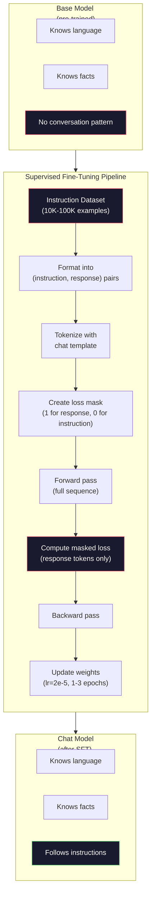

# 指令微调（SFT）

> 基础模型只会预测下一个词元，仅此而已。它不会遵循指令、回答问题，也不会拒绝有害请求。SFT 是连接词元预测器与实用助手的桥梁。你曾经对话过的每个模型——Claude、GPT、Llama Chat——都经历过这一步。

**Type:** 构建
**Languages:** Python（使用 numpy）
**Prerequisites:** 阶段 10 第 04 课（预训练一个 Mini GPT）
**Time:** 约 90 分钟

## 学习目标

- 实现监督微调（SFT），把基础语言模型转化为遵循指令的助手
- 使用带系统、用户和助手角色的聊天模板格式化训练数据，并屏蔽非助手词元上的损失
- 解释 SFT 为何必不可少：基础模型只会续写文本，而不会回答问题
- 在留出的指令集上比较基础模型与微调模型的回答，以评估 SFT 质量

## 问题

你在第 04 课训练了一个模型。给定一段序列，它能预测下一个词元。输入“The transformer architecture”，它可能接着写“has revolutionized natural language processing”。对于下一词元预测器而言，这已经很厉害。

现在试试输入“What is the capital of France?”。基础模型不会回答“Paris”，而会继续这种文本模式。它可能输出“What is the capital of Germany? What is the capital of Spain?”，因为它从包含问题列表的文档中学到了这种模式；也可能输出“is a question that many people ask”，因为这是合理的下一词元续写。模型并没有*回答*这个概念，只知道如何*续写*。

这就是 GPT-3（基础模型，2020 年 6 月发布）与 ChatGPT（经过指令微调，2022 年 11 月发布）之间的差距。架构相同，预训练也相同；区别在于 2 万～10 万对精心编写的（指令、回答）数据，它们教会模型遵循对话模式。

Stanford Alpaca 证明，根本不需要数百万个样本。2023 年 3 月，他们仅用 GPT-3.5 生成的 52,000 对指令-回答数据微调 Llama 7B，总成本为 600 美元。得到的聊天机器人可以遵循指令、回答问题并进行对话。它不如 ChatGPT，却在只花 600 美元和数小时训练的前提下达到了惊人的接近程度。

Meta 的 Llama 2 Chat 在初始 SFT 阶段只使用了约 27,000 个高质量样本。关键洞见是：质量比数量更重要。由熟练标注者编写的 27,000 个样本，胜过从互联网抓取的 100 万个噪声样本。

## 概念

### SFT 究竟做了什么

监督微调延续预训练时的同一个训练循环——前向传播、计算损失、反向传播、更新权重——但改用另一类数据。训练内容不再是原始文本，而是结构化对话：

```json
{
  "system": "You are a helpful assistant.",
  "user": "What is the capital of France?",
  "assistant": "The capital of France is Paris."
}
```

模型其实已经知道法国的首都是巴黎，因为它在预训练期间从 Wikipedia、教材和网页中学到了这一事实。SFT 不会教给模型新事实，而是教给它一种新*行为*：看到问题时给出答案，看到指令时完成任务，看到有害请求时予以拒绝。

可以这样理解：预训练赋予模型知识，SFT 则教给模型礼仪。

### 数据格式

行业主要采用三种格式。它们用不同分隔符编码同一种信息——谁说了什么。

**Alpaca 格式**（Stanford，2023 年 3 月）：

```json
{
  "instruction": "Summarize the following article in 3 sentences.",
  "input": "The European Central Bank raised interest rates...",
  "output": "The ECB increased rates by 25 basis points..."
}
```

这种格式简单且应用广泛。`input` 字段是可选的，因为许多指令不需要额外上下文。Stanford 发布了 52,000 个这种格式的样本，由 GPT-3.5 以 600 美元生成，从而掀起了开源指令微调浪潮。

**ShareGPT 格式**（社区，2023）：

```json
{
  "conversations": [
    {"from": "system", "value": "You are a helpful assistant."},
    {"from": "human", "value": "What causes tides?"},
    {"from": "gpt", "value": "Tides are caused by the gravitational pull of the Moon..."},
    {"from": "human", "value": "How often do they occur?"},
    {"from": "gpt", "value": "Most coastal areas experience two high tides and two low tides per day..."}
  ]
}
```

它支持多轮对话。按照惯例，无论实际模型是什么，from 字段都使用“human”和“gpt”。Vicuna 使用从用户分享的 ChatGPT 对话记录中抓取的 70,000 段 ShareGPT 对话训练。

**ChatML 格式**（OpenAI 提出，许多开源模型采用）：

```
<|im_start|>system
You are a helpful assistant.<|im_end|>
<|im_start|>user
What is the capital of France?<|im_end|>
<|im_start|>assistant
The capital of France is Paris.<|im_end|>
```

它使用特殊词元（`<|im_start|>`、`<|im_end|>`）分隔角色。这些词元会在微调期间加入词元化器的词表。Qwen、Yi 和许多其他模型都使用 ChatML。

三种格式实现的是同一件事：告诉模型“这是指令，这是回答，请学习这种模式”。

### 为什么它有效

模型已经通过预训练掌握语言，也见过数十亿个问题后跟回答、指令后跟结果以及人与人对话的样本。这些模式已经编码在权重中。

SFT 会集中这种潜在能力。模型不再需要从上下文中猜测自己应当回答问题还是续写文档；SFT 会明确地用对话模式进行训练。只需几千个样本，模型就能学会：看到助手角色标记时，生成有帮助的回答。

这就是 27,000 个样本已经足够的原因。你不是在教模型英语，也不是在教它世界知识，而是在教它一种简单行为：回应指令。知识早已存在。

### 掩码损失

这是 SFT 最重要的技术细节，却被大多数教程略过。

预训练时，会计算每个词元上的损失，模型学习预测序列中的每个下一词元。SFT 时，则只计算*回答*词元上的损失。指令词元只提供上下文，模型不会因“预测”错它们而受到惩罚。

为什么？因为你不希望模型学会*生成*指令，而希望它学会*回应*指令。如果对指令词元也计算损失，就相当于训练模型预测“What is the capital of France?”，仿佛问题是模型自己问的。这既浪费梯度信号，也可能让模型混淆自己的角色。

实践中，需要创建损失掩码：回答词元为 1，指令词元为 0。在求平均前，将逐词元损失乘以这个掩码。

```
Tokens:    [SYS] You are helpful [USER] What is the capital? [ASST] Paris is the capital [EOS]
Loss mask:   0    0    0     0      0     0   0  0     0       1     1    1   1     1      1
```

只有 `[ASST]` 后面的词元参与损失计算。前向传播时，模型会看到完整对话（生成正确回答需要指令），但权重更新只取决于它预测回答的质量。

### 训练超参数

SFT 使用的超参数与预训练截然不同。你不是从零训练，而是在调整一个已经能工作的模型。

| 参数 | 预训练（Llama 2 7B） | SFT（Llama 2 Chat） |
|-----------|---------------------------|---------------------|
| 学习率 | 3e-4（峰值） | 2e-5 |
| 轮数 | 1（数据只遍历一遍） | 2 |
| 批大小 | 4M 个词元 | 64 个样本 |
| 预热步数 | 2,000 | 0～100 |
| 权重衰减 | 0.1 | 0.0～0.1 |
| 数据量 | 2T 个词元 | 27,000 个样本 |

SFT 的学习率低 15 倍，这一点至关重要。微调时使用过高的学习率，会破坏预训练知识：模型“忘记”已经学到的内容，并过拟合到小型微调数据集。这就是灾难性遗忘。

训练两轮意味着模型会看到每个样本两次。在小数据集上训练超过 3 轮会导致记忆——模型开始逐字复现训练样本，而不是进行泛化。

### 灾难性遗忘

微调可能破坏通用能力。在指令遵循数据上训练太久，模型会失去编写代码、处理数学或创作文本的能力。它会变得极其擅长训练数据的特定格式，却不再擅长其他任务。

有三种缓解方法：

1. **低学习率。** 使用 1e-5 到 5e-5。更新幅度越小，对预训练特征的破坏越少。

2. **短时间训练。** 只训练 1～3 轮，在模型过拟合前停止。

3. **混入预训练数据。** Llama 2 Chat 在 SFT 数据集中混入了少量（2%～5%）原始预训练数据。这会在学习新的指令遵循行为时，“提醒”模型不要忘记通用能力。

### 真实数字

在单张 NVIDIA A100 80GB GPU 上，使用 1 万个高质量指令对微调 7B 模型，大约需要 1 小时。计算如下：

- 10,000 个样本 × 平均 512 个词元 = 512 万个词元
- 2 轮 = 共 1024 万个词元
- A100 微调 7B 模型的吞吐量：约 3,000 词元/秒
- 1024 万 / 3,000 = 约 3,400 秒 = 约 57 分钟

对于我们的 Mini GPT（4 层、128 维），训练几乎瞬间完成。重点在于理解机制，而不是规模。



```figure
loss-masking
```

## 动手构建

### 第 1 步：指令数据集

创建一个合成指令数据集。在生产环境中，Scale AI、Anthropic 等公司会雇用人类标注者编写这些内容。这里以编程方式创建，以演示数据格式。

```python
import numpy as np

INSTRUCTION_DATA = [
    {
        "instruction": "What is the capital of France?",
        "response": "The capital of France is Paris."
    },
    {
        "instruction": "Explain gravity in one sentence.",
        "response": "Gravity is the force that attracts objects with mass toward each other."
    },
    {
        "instruction": "Write a haiku about the ocean.",
        "response": "Waves crash on the shore, salt and foam beneath the sun, endless blue expanse."
    },
    {
        "instruction": "What is 15 multiplied by 7?",
        "response": "15 multiplied by 7 is 105."
    },
    {
        "instruction": "Name three programming languages.",
        "response": "Three programming languages are Python, Rust, and TypeScript."
    },
    {
        "instruction": "Summarize photosynthesis.",
        "response": "Photosynthesis converts sunlight, water, and carbon dioxide into glucose and oxygen."
    },
    {
        "instruction": "What year did World War II end?",
        "response": "World War II ended in 1945."
    },
    {
        "instruction": "Define machine learning.",
        "response": "Machine learning is a field where algorithms learn patterns from data to make predictions."
    },
]
```

八个样本非常少，Stanford Alpaca 使用了 52,000 个。但无论有 8 个还是 52,000 个，机制都完全相同：词元化、应用掩码，只在回答上计算损失。

### 第 2 步：使用聊天模板进行词元化

用特殊角色标记把指令-回答对转换为词元序列。这些标记告诉模型指令在哪里结束、回答从哪里开始。

```python
SPECIAL_TOKENS = {
    "INST_START": 253,
    "INST_END": 254,
    "RESP_START": 255,
}


def tokenize_instruction_pair(instruction, response, vocab_size=256):
    inst_tokens = list(instruction.encode("utf-8"))
    resp_tokens = list(response.encode("utf-8"))

    inst_tokens = [min(t, vocab_size - 4) for t in inst_tokens]
    resp_tokens = [min(t, vocab_size - 4) for t in resp_tokens]

    tokens = (
        [SPECIAL_TOKENS["INST_START"]]
        + inst_tokens
        + [SPECIAL_TOKENS["INST_END"]]
        + [SPECIAL_TOKENS["RESP_START"]]
        + resp_tokens
    )

    return tokens


def create_loss_mask(tokens):
    mask = np.zeros(len(tokens), dtype=np.float32)
    in_response = False

    for i, token in enumerate(tokens):
        if token == SPECIAL_TOKENS["RESP_START"]:
            in_response = True
            continue
        if in_response:
            mask[i] = 1.0

    return mask
```

指令词元对应的损失掩码全为零，回答词元全为一。`RESP_START` 词元本身的掩码是 0，因为它是分隔符，不属于回答内容。

### 第 3 步：带掩码的交叉熵损失

使用标准交叉熵，但乘以损失掩码。只有回答词元参与梯度计算。

```python
def masked_cross_entropy_loss(logits, targets, loss_mask):
    batch, seq_len, vocab_size = logits.shape
    logits_flat = logits.reshape(-1, vocab_size)
    targets_flat = targets.reshape(-1)
    mask_flat = loss_mask.reshape(-1)

    max_logits = logits_flat.max(axis=-1, keepdims=True)
    log_softmax = logits_flat - max_logits - np.log(
        np.exp(logits_flat - max_logits).sum(axis=-1, keepdims=True)
    )

    per_token_loss = -log_softmax[np.arange(len(targets_flat)), targets_flat]

    masked_loss = per_token_loss * mask_flat
    num_response_tokens = mask_flat.sum()
    if num_response_tokens == 0:
        return 0.0
    loss = masked_loss.sum() / num_response_tokens

    return loss
```

分母是 `num_response_tokens`，而不是 `seq_len`。若除以总序列长度，较长指令就会稀释梯度信号。除以回答词元数，可以确保无论指令多长，每个回答词元的权重都相同。

### 第 4 步：SFT 训练循环

复用第 04 课的 MiniGPT。训练循环看起来几乎与预训练相同，只是增加了指令格式化与掩码损失。

```python
import sys
import os
sys.path.insert(0, os.path.join(os.path.dirname(__file__), "..", "..", "04-pre-training-mini-gpt", "code"))
from main import MiniGPT, LayerNorm, FeedForward, MultiHeadAttention, TransformerBlock, Embedding


def sft_train(model, dataset, num_epochs=2, lr=2e-5, seq_len=64):
    formatted_data = []
    for example in dataset:
        tokens = tokenize_instruction_pair(example["instruction"], example["response"])
        mask = create_loss_mask(tokens)
        formatted_data.append((tokens, mask))

    print(f"SFT Training: {len(formatted_data)} examples, {num_epochs} epochs, lr={lr}")
    print(f"Total tokens: {sum(len(t) for t, _ in formatted_data):,}")
    print()

    losses = []

    for epoch in range(num_epochs):
        epoch_loss = 0.0
        num_batches = 0

        indices = np.random.permutation(len(formatted_data))

        for idx in indices:
            tokens, mask = formatted_data[idx]

            if len(tokens) < 3:
                continue
            if len(tokens) > seq_len:
                tokens = tokens[:seq_len]
                mask = mask[:seq_len]

            input_ids = np.array(tokens[:-1]).reshape(1, -1)
            target_ids = np.array(tokens[1:]).reshape(1, -1)
            loss_mask = np.array(mask[1:]).reshape(1, -1)

            logits = model.forward(input_ids)
            loss = masked_cross_entropy_loss(logits, target_ids, loss_mask)

            batch_size, s_len, v_size = logits.shape
            probs = np.exp(logits - logits.max(axis=-1, keepdims=True))
            probs = probs / probs.sum(axis=-1, keepdims=True)
            dlogits = probs.copy()
            dlogits[np.arange(batch_size)[:, None], np.arange(s_len), target_ids] -= 1.0

            mask_expanded = loss_mask[:, :, np.newaxis]
            num_resp = loss_mask.sum()
            if num_resp > 0:
                dlogits = dlogits * mask_expanded / num_resp

            for block in model.blocks:
                block.ffn.W1 -= lr * np.random.randn(*block.ffn.W1.shape) * 0.01
                block.ffn.W2 -= lr * np.random.randn(*block.ffn.W2.shape) * 0.01
                block.ffn.b1 -= lr * np.random.randn(*block.ffn.b1.shape) * 0.01
                block.ffn.b2 -= lr * np.random.randn(*block.ffn.b2.shape) * 0.01

            epoch_loss += loss
            num_batches += 1
            losses.append(loss)

        avg_loss = epoch_loss / max(num_batches, 1)
        print(f"Epoch {epoch + 1}/{num_epochs} | Avg Loss: {avg_loss:.4f}")

    return model, losses
```

学习率为 2e-5，与 Llama 2 Chat 相同。相比预训练使用的 3e-4，它小了 15 倍。梯度受掩码控制：指令词元产生零梯度，只有回答词元会推动权重更新。

### 第 5 步：比较基础模型与 SFT 模型

SFT 的全部意义都在于改变行为。我们可以检查模型面对按指令格式组织的输入和原始文本续写时如何响应，以衡量这种变化。

```python
def generate_response(model, prompt_tokens, max_new_tokens=50, temperature=0.8):
    tokens = list(prompt_tokens)
    seq_len = model.embedding.pos_embed.shape[0]

    for _ in range(max_new_tokens):
        context = np.array(tokens[-seq_len:]).reshape(1, -1)
        logits = model.forward(context)
        next_logits = logits[0, -1, :]

        next_logits = next_logits / max(temperature, 1e-8)
        probs = np.exp(next_logits - next_logits.max())
        probs = probs / probs.sum()
        probs = np.clip(probs, 1e-10, 1.0)
        probs = probs / probs.sum()

        next_token = np.random.choice(len(probs), p=probs)
        tokens.append(int(next_token))

    return tokens


def evaluate_instruction_following(model, instructions):
    print("Evaluating instruction following:")
    print("-" * 50)

    for instruction in instructions:
        tokens = (
            [SPECIAL_TOKENS["INST_START"]]
            + [min(t, 252) for t in list(instruction.encode("utf-8"))]
            + [SPECIAL_TOKENS["INST_END"]]
            + [SPECIAL_TOKENS["RESP_START"]]
        )

        output = generate_response(model, tokens, max_new_tokens=30, temperature=0.6)
        response_start = len(tokens)
        response_tokens = output[response_start:]
        response_bytes = bytes([t for t in response_tokens if t < 128])
        response_text = response_bytes.decode("utf-8", errors="replace")

        print(f"  Q: {instruction}")
        print(f"  A: {response_text[:80]}")
        print()
```

对只有 8 个样本的微型模型，不应期待回答具有实际意义。重要的是*结构*：模型会学习在回答标记后生成输出，而不是继续生成更多指令。

### 第 6 步：测量灾难性遗忘

比较模型在 SFT 前后的下一词元预测能力。如果 SFT 损害了通用能力，原始文本上的损失就会上升。

```python
def measure_forgetting(model, test_text, seq_len=64):
    tokens = np.array(list(test_text.encode("utf-8")[:512]))

    total_loss = 0.0
    num_windows = 0

    for start in range(0, len(tokens) - seq_len - 1, seq_len):
        input_ids = tokens[start:start + seq_len].reshape(1, -1)
        target_ids = tokens[start + 1:start + seq_len + 1].reshape(1, -1)

        logits = model.forward(input_ids)

        batch, s_len, vocab_size = logits.shape
        logits_flat = logits.reshape(-1, vocab_size)
        targets_flat = target_ids.reshape(-1)

        max_logits = logits_flat.max(axis=-1, keepdims=True)
        log_softmax = logits_flat - max_logits - np.log(
            np.exp(logits_flat - max_logits).sum(axis=-1, keepdims=True)
        )

        loss = -log_softmax[np.arange(len(targets_flat)), targets_flat].mean()
        total_loss += loss
        num_windows += 1

    return total_loss / max(num_windows, 1)
```

在真实微调中，应在整个训练过程中持续跟踪这个指标。如果原始文本损失增加超过 10%～15%，说明 SFT 过于激进。应降低学习率或减少训练轮数。

## 学以致用

### 完整 SFT 流水线演示

```python
if __name__ == "__main__":
    np.random.seed(42)

    test_text = """The transformer architecture processes sequences through self-attention.
Each layer applies multi-head attention followed by a feedforward network.
Residual connections and layer normalization stabilize deep networks.
The model learns to predict the next token given all previous tokens."""

    print("=" * 70)
    print("INSTRUCTION TUNING (SFT) DEMO")
    print("=" * 70)
    print()

    model = MiniGPT(
        vocab_size=256, embed_dim=128, num_heads=4,
        num_layers=4, max_seq_len=128, ff_dim=512
    )
    print(f"Model: {model.count_parameters():,} parameters")
    print(f"Config: 4 layers, 4 heads, 128 dims (mini GPT from Lesson 04)")
    print()

    print("PRE-SFT: Measuring base model loss on raw text")
    base_loss = measure_forgetting(model, test_text)
    print(f"  Base model loss: {base_loss:.4f}")
    print()

    print("=" * 70)
    print("SFT TRAINING")
    print("=" * 70)

    model, losses = sft_train(
        model, INSTRUCTION_DATA, num_epochs=3, lr=2e-5, seq_len=128
    )

    print()
    print("POST-SFT: Measuring fine-tuned model loss on raw text")
    sft_loss = measure_forgetting(model, test_text)
    print(f"  SFT model loss: {sft_loss:.4f}")
    print(f"  Change: {((sft_loss - base_loss) / base_loss * 100):+.1f}%")
    if abs(sft_loss - base_loss) / base_loss < 0.15:
        print("  Minimal forgetting (< 15% change)")
    else:
        print("  Significant forgetting detected")
    print()

    print("=" * 70)
    print("INSTRUCTION FOLLOWING EVALUATION")
    print("=" * 70)
    print()

    test_instructions = [
        "What is the capital of France?",
        "Name a programming language.",
        "Define gravity.",
    ]
    evaluate_instruction_following(model, test_instructions)

    print("=" * 70)
    print("DATA FORMAT EXAMPLES")
    print("=" * 70)
    print()

    for i, example in enumerate(INSTRUCTION_DATA[:3]):
        tokens = tokenize_instruction_pair(example["instruction"], example["response"])
        mask = create_loss_mask(tokens)
        resp_count = int(mask.sum())
        total_count = len(tokens)
        print(f"  Example {i + 1}: {total_count} tokens, {resp_count} response tokens ({resp_count/total_count:.0%} of sequence)")
        print(f"    Instruction: {example['instruction']}")
        print(f"    Response: {example['response']}")
        print()

    print("=" * 70)
    print("TRAINING LOSS CURVE")
    print("=" * 70)
    print()

    if losses:
        window = max(1, len(losses) // 5)
        for i in range(0, len(losses), window):
            chunk = losses[i:i + window]
            avg = sum(chunk) / len(chunk)
            print(f"  Steps {i:3d}-{i + len(chunk) - 1:3d}: avg loss = {avg:.4f}")
```

## 交付成果

本课会生成 `outputs/prompt-sft-data-curator.md`——一个帮助你设计和整理 SFT 指令数据集的提示词。给定目标能力（代码生成、数学、对话），它会生成包含格式规范、质量标准与多样性要求的数据收集计划。

## 练习

1. 添加系统提示支持。修改 `tokenize_instruction_pair`，让它接收一条系统消息并将其放在指令之前。创建 5 个带不同系统提示的样本（“You are a poet”“You are a math tutor”），确认模型在训练期间看到不同的系统提示。

2. 实现数据混合。编写一个函数，接收 SFT 数据集与原始文本语料，再生成由 5% 原始文本样本（不应用掩码）和 95% 指令对（应用掩码）组成的训练批次。训练 3 轮，并与纯 SFT 训练的遗忘指标比较。

3. 构建数据质量评分器。对每组指令-回答数据计算：（a）以词元计的回答长度；（b）指令与回答的比例；（c）词表多样性（唯一词元数/总词元数）。过滤回答长度 < 10 个词元或多样性 < 0.3 的样本，并展示过滤如何影响最终损失。

4. 实现多轮对话训练。扩展词元化流程，以处理三轮对话（用户-助手-用户-助手-用户-助手）。损失掩码应覆盖全部三次助手回复。打印一个样本的词元-掩码对齐结果，以验证掩码是否正确。

5. 比较学习率。使用 lr=1e-4、lr=2e-5 和 lr=1e-6 分别训练同一个模型，并绘制损失曲线。1e-4 应表现出快速的初始下降，但最终损失较高（过拟合）；1e-6 应几乎没有变化；2e-5 应是最佳平衡点。

## 关键术语

| 术语 | 人们通常怎么说 | 实际含义 |
|------|----------------|----------------------|
| SFT | “在对话上微调” | 监督微调：在（指令、回答）数据对上继续训练，而且只对回答词元计算损失 |
| 指令微调 | “教模型遵循指令” | 在显式指令-回答对上训练，使基础模型学习对话模式，而不是新知识 |
| 损失掩码 | “忽略提示词” | 把指令词元的损失设为零，使梯度只来自回答词元的预测 |
| ChatML | “聊天标记语言” | 使用 `<\|im_start\|>` 与 `<\|im_end\|>` 分隔符标记对话中说话者角色的词元格式 |
| Alpaca 格式 | “Stanford 的格式” | 包含 instruction/input/output 字段的 JSON 格式，用于 5.2 万个耗资 600 美元、由 GPT-3.5 生成的样本 |
| 灾难性遗忘 | “模型变笨了” | 微调更新用任务特定模式覆盖通用知识，从而破坏预训练能力 |
| 权重绑定 | “共享嵌入” | 输入词元嵌入与输出预测头使用同一个矩阵，既节省参数又提高一致性 |
| 聊天模板 | “如何格式化提示词” | 把对话组织起来的特定词元序列（角色标记、分隔符）——因模型而异，必须匹配训练格式 |

## 延伸阅读

- [Ouyang 等，2022——“通过人类反馈训练语言模型遵循指令”（InstructGPT）](https://arxiv.org/abs/2203.02155)——OpenAI 引入指令微调 + RLHF 的论文
- [Taori 等，2023——“Stanford Alpaca：遵循指令的 LLaMA 模型”](https://github.com/tatsu-lab/stanford_alpaca)——用 600 美元生成 5.2 万个指令样本，证明 SFT 可在小数据集上奏效
- [Touvron 等，2023——“Llama 2：开放基础与微调聊天模型”](https://arxiv.org/abs/2307.09288)——Meta 使用 2.7 万个高质量样本的 SFT + RLHF 流水线
- [Chiang 等，2023——“Vicuna：令 GPT-4 印象深刻的开源聊天机器人”](https://lmsys.org/blog/2023-03-30-vicuna/)——使用 7 万段 ShareGPT 对话训练
- [Zhou 等，2023——“LIMA：对齐中的少即是多”](https://arxiv.org/abs/2305.11206)——证明 1000 个精心筛选的样本即可达到远大数据集上的 SFT 效果
