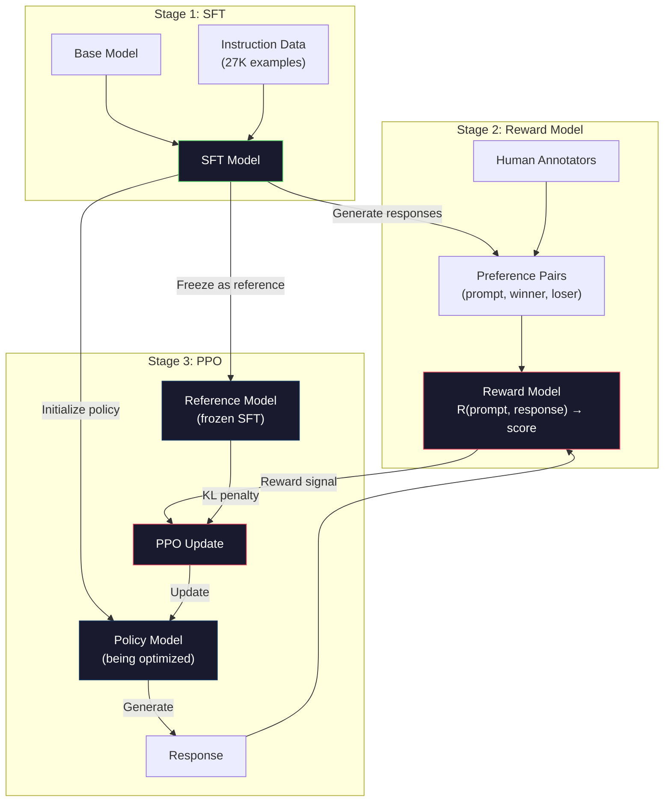
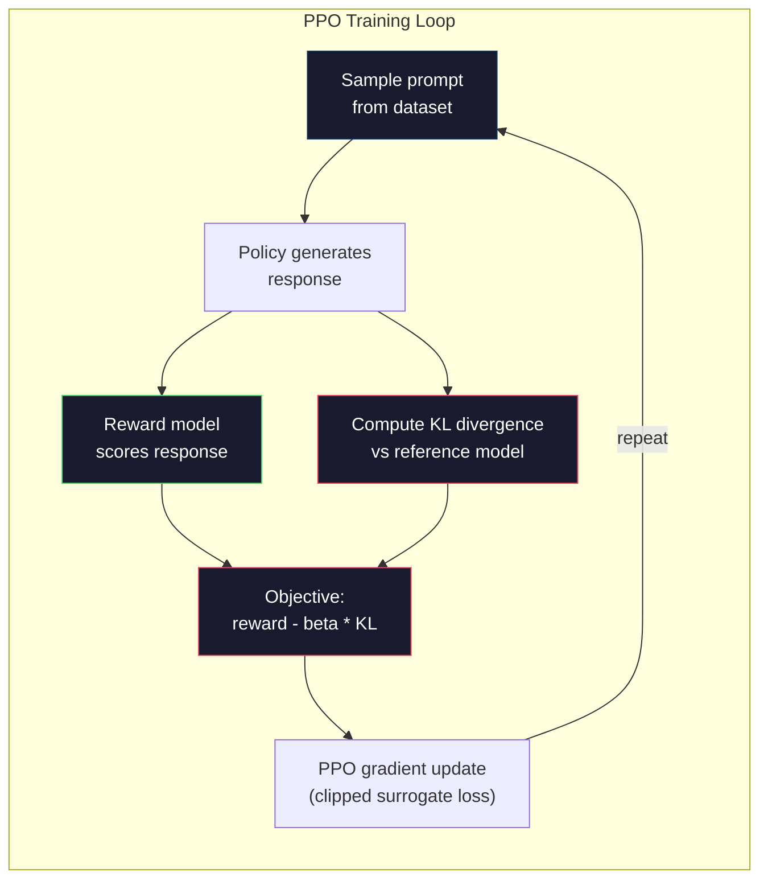

# RLHF：奖励模型 + PPO

> SFT 教会模型遵循指令，却不会教它判断哪个回答*更好*。两个语法正确、事实准确的回答，在帮助程度上仍可能天差地别。RLHF 把人类判断编码进模型行为。Claude 之所以乐于助人、GPT 之所以礼貌，背后都有它的作用。

**Type:** 构建
**Languages:** Python（使用 numpy）
**Prerequisites:** 阶段 10 第 06 课（指令微调 / SFT）
**Time:** 约 90 分钟

## 学习目标

- 根据人类偏好对（被选回答与被拒回答）构建评价回答质量的奖励模型
- 实现 PPO 训练循环，在 KL 惩罚约束下针对奖励模型优化语言模型策略
- 解释 RLHF 为什么需要三个模型（SFT、奖励模型、策略模型），以及 KL 约束如何防止奖励黑客
- 比较偏好优化前后的回答质量，评估 RLHF 的效果

## 问题

向模型提问“解释量子计算”，它可能生成：

**回答 A：**“量子计算使用可以处于叠加态的量子比特，也就是说，它们可以同时为 0、1，或二者兼有。这使量子计算机能够以比经典计算机快指数级的速度处理某些计算。关键算法包括用于分解大数的 Shor 算法，以及用于搜索无序数据库的 Grover 算法。”

**回答 B：**“量子计算是一种利用量子力学现象的计算方式。它最早于 20 世纪 80 年代提出。Richard Feynman 曾建议用量子计算机模拟量子系统。此后，该领域取得了长足发展。许多公司如今都在研发量子计算机。IBM、Google 等公司已经取得进展。Google 于 2019 年宣称实现了量子霸权。”

两个回答在事实上都正确，语法也没有问题，并且都遵循了指令。但回答 A 明显更好：它更简洁、信息量更大、结构也更清楚。人类每次都会选择 A。

SFT 无法表达这种区别。它在“正确”回答上训练模型，却没有机制说明“这个回答比另一个更好”。每个训练样本都被视为同样优秀。如果 A 和 B 都出现在 SFT 数据集中，模型会同等程度地从两者学习。

RLHF 解决了这一问题。它训练奖励模型来预测人类更喜欢哪个回答，再用该奖励信号推动语言模型生成质量更高的输出。InstructGPT（ChatGPT 的前身）通过 RLHF 显著提高了 GPT-3 的帮助性、真实性与无害性。尽管 InstructGPT 的参数量小了 135 倍（1.3B 对 175B），OpenAI 内部评估者仍有 85% 的时间更喜欢它的输出。

## 概念

### 三个阶段

RLHF 不是单次训练，而是由三个依次衔接的阶段组成的流水线，每个阶段都建立在前一个阶段之上。

**阶段 1：SFT。** 在指令-回答对上训练基础模型（第 06 课）。由此得到能够遵循指令、却还不知道回答之间孰优孰劣的模型。

**阶段 2：奖励模型。** 收集人类偏好数据：向标注者展示针对同一提示词的两个回答，并询问“哪个更好？”训练一个模型来预测这些偏好。奖励模型以（提示词、回答）为输入，输出一个标量分数。

**阶段 3：PPO。** 用奖励模型为语言模型生成训练信号。语言模型生成回答，奖励模型为其评分，PPO 再更新语言模型，使其生成得分更高的回答。KL 散度惩罚会防止语言模型偏离 SFT 检查点过远。



### 奖励模型

奖励模型是改造成评分器的语言模型。从 SFT 模型出发，把语言建模头（输出词表上的概率分布）替换为标量头（输出一个数字）。除最后一层外，架构完全相同。

输入是一段提示词与回答的拼接，输出是单个标量奖励分数。

训练数据由人类偏好对组成。对每条提示词，标注者查看两个回答并选择更好的一个，由此形成训练三元组：（提示词、偏好回答、拒绝回答）。

损失函数采用 Bradley-Terry 成对偏好模型：

```
loss = -log(sigmoid(reward(preferred) - reward(rejected)))
```

这就是关键公式。`sigmoid(reward(A) - reward(B))` 表示回答 A 优于回答 B 的概率。损失会推动奖励模型为偏好回答分配更高分数。

为什么使用成对比较，而不是绝对评分？因为人类很不擅长给质量打绝对分数（“这个回答是 10 分制的 7.3 还是 7.5？”），却很擅长做相对比较（“A 比 B 好吗？”）。Bradley-Terry 模型把相对比较转化为一致的绝对评分体系。

**InstructGPT 数据：** OpenAI 从 40 名承包商处收集了 33,000 对比较数据，每次比较约需 5 分钟，相当于为奖励模型训练数据投入 2,750 小时人工劳动。

### PPO：近端策略优化

PPO 是一种强化学习算法。在 RLHF 中，“环境”是奖励模型，“智能体”是语言模型，“动作”则是生成一个词元。

目标函数为：

```
maximize: E[R(prompt, response)] - beta * KL(policy || reference)
```

第一项推动模型生成高奖励回答，第二项（KL 散度惩罚）防止模型偏离 SFT 检查点过远。

为什么需要 KL 惩罚？没有它，模型会找到退化解。奖励模型只在有限的人类偏好数据集上训练，因此必然存在盲点。语言模型会利用这些盲点——找到在奖励模型上得分很高、实际上却毫无意义的输出。经典例子包括：

- 反复输出“我非常有帮助且无害！”，从帮助性/无害性奖励模型获得高分
- 生成冗长、语气正式却内容空洞的回答，以匹配“高质量”模式
- 利用训练数据中偶然与高奖励相关的特定措辞

KL 惩罚表达的是：你可以改进，但不能变成完全不同的模型。应当靠近本来就相当合理的 SFT 版本；一旦偏离太远，KL 成本就会压过奖励。

**InstructGPT 数据：** PPO 训练使用 lr=1.5e-5、KL 系数 beta=0.02、256K 个回合（提示词-回答对），每批数据训练 4 个 PPO 轮次。整套 RLHF 流水线在 GPU 集群上运行了数天。



### 详解 PPO 目标

PPO 使用“裁剪代理目标”防止更新幅度过大。新旧策略概率之比被裁剪到 [1 - epsilon, 1 + epsilon] 区间，epsilon 通常取 0.2。

```
ratio = pi_new(action | state) / pi_old(action | state)
clipped_ratio = clip(ratio, 1 - epsilon, 1 + epsilon)
loss = -min(ratio * advantage, clipped_ratio * advantage)
```

优势函数用于估计当前回答相对于预期质量好多少。在 RLHF 中：

```
advantage = reward(prompt, response) - baseline
```

基线通常是近期回答的平均奖励。正优势表示回答高于平均水平，负优势则表示低于平均水平。PPO 会提高高于平均水平回答的概率，降低低于平均水平回答的概率。

裁剪可以防止灾难性更新。如果某个回答获得异常高的奖励，未裁剪的比率可能非常大，导致模型剧烈偏向该回答。裁剪会限制更新幅度，从而保持训练稳定。

### 奖励黑客

这是 RLHF 的阴暗面。语言模型针对奖励模型优化，而奖励模型只是人类偏好的不完美代理。随着语言模型越来越擅长最大化奖励，它会开始利用奖励模型的弱点。

常见失效模式：

| 失效模式 | 现象 | 原因 |
|---------|-------------|-----|
| 冗长 | 模型生成越来越长的回答 | 人类标注者往往更喜欢更长、更详细的回答，因此奖励模型会给篇幅更高的分数 |
| 谄媚 | 模型赞同用户所说的一切 | 标注者更偏好认同问题前提的回答 |
| 含糊其辞 | 模型拒绝给出明确答案 | 模棱两可的回答（“这是一个包含许多观点的复杂话题……”）很少被标记为错误 |
| 格式刷分 | 模型过度使用项目符号与标题 | 格式丰富的回答在标注者眼中显得更“精致” |

缓解策略包括：加强 KL 惩罚（防止模型偏离到足以利用弱点的程度）、使用对抗样本训练奖励模型（修补已知失效模式），以及使用架构不同的多个奖励模型（同时欺骗所有模型更难）。

### 真实 RLHF 流水线

| 模型 | 比较对数量 | 标注者 | RM 大小 | PPO 步数 | KL 系数 |
|-------|-----------------|------------|---------|-----------|----------|
| InstructGPT | 33K | 40 | 6B | 256K | 0.02 |
| Llama 2 Chat | 约 1M | 未公开 | 70B | 未公开 | 0.01 |
| Claude | 未公开 | 未公开 | 未公开 | 未公开 | 未公开 |
| Anthropic RLHF 论文 | 22K | 20 | 52B | 50K | 0.001 |

Anthropic 2022 年的论文使用 22,000 次比较训练了一个 52B 奖励模型。奖励模型越大，信号越可靠，PPO 训练也越稳定。用小型奖励模型训练大型语言模型风险很高——奖励模型没有足够容量捕获好回答与坏回答之间的细微差别。

```figure
rlhf-pipeline
```

## 动手构建

### 第 1 步：合成偏好数据

生产环境由人类标注者创建偏好数据。这里构造合成数据对，其中“偏好”回答在客观上更好——更简洁、更准确，也更有帮助。

```python
import numpy as np

PREFERENCE_DATA = [
    {
        "prompt": "What is the capital of France?",
        "preferred": "The capital of France is Paris.",
        "rejected": "France is a country in Europe. It has many cities. The capital is Paris. Paris is known for the Eiffel Tower.",
    },
    {
        "prompt": "Explain gravity in one sentence.",
        "preferred": "Gravity is the force that attracts objects with mass toward each other.",
        "rejected": "Gravity is something that makes things fall down when you drop them.",
    },
    {
        "prompt": "What is 15 times 7?",
        "preferred": "15 times 7 is 105.",
        "rejected": "Let me think about this. 15 times 7. Well, 10 times 7 is 70, and 5 times 7 is 35, so the answer might be around 105.",
    },
    {
        "prompt": "Name three programming languages.",
        "preferred": "Python, Rust, and TypeScript.",
        "rejected": "There are many programming languages. Some popular ones include various languages like Python and others.",
    },
    {
        "prompt": "What year did World War II end?",
        "preferred": "World War II ended in 1945.",
        "rejected": "World War II was a major global conflict. It involved many countries. The war ended in the mid-1940s, specifically in 1945.",
    },
    {
        "prompt": "Define machine learning.",
        "preferred": "Machine learning is a field where algorithms learn patterns from data to make predictions without being explicitly programmed.",
        "rejected": "Machine learning is a type of AI. AI stands for artificial intelligence. Machine learning uses data to learn.",
    },
]
```

偏好回答简洁直接，拒绝回答则表现出常见缺陷：无谓填充、含糊措辞、重复解释与表述不精确。这正是 SFT 无法表达、而 RLHF 可以学习的区别。

### 第 2 步：奖励模型架构

奖励模型复用 Mini GPT 的 Transformer 架构，但把词表大小的输出头替换为单个标量投影。

```python
import sys
import os
sys.path.insert(0, os.path.join(os.path.dirname(__file__), "..", "..", "04-pre-training-mini-gpt", "code"))
from main import MiniGPT, LayerNorm, Embedding, TransformerBlock


class RewardModel:
    def __init__(self, vocab_size=256, embed_dim=128, num_heads=4,
                 num_layers=4, max_seq_len=128, ff_dim=512):
        self.embedding = Embedding(vocab_size, embed_dim, max_seq_len)
        self.blocks = [
            TransformerBlock(embed_dim, num_heads, ff_dim)
            for _ in range(num_layers)
        ]
        self.ln_f = LayerNorm(embed_dim)
        self.reward_head = np.random.randn(embed_dim) * 0.02

    def forward(self, token_ids):
        seq_len = token_ids.shape[-1]
        mask = np.triu(np.full((seq_len, seq_len), -1e9), k=1)

        x = self.embedding.forward(token_ids)
        for block in self.blocks:
            x = block.forward(x, mask)
        x = self.ln_f.forward(x)

        last_hidden = x[:, -1, :]
        reward = last_hidden @ self.reward_head

        return reward
```

奖励模型取*最后一个*词元位置的隐藏状态，并将其投影为标量。为什么选择最后一个词元？因为因果注意力掩码意味着最后位置已经关注此前所有词元，因此它拥有对整个（提示词、回答）序列最完整的表示。

### 第 3 步：Bradley-Terry 损失

使用 Bradley-Terry 成对损失，在偏好对上训练奖励模型。

```python
def tokenize_for_reward(prompt, response, vocab_size=256):
    prompt_tokens = [min(t, vocab_size - 1) for t in list(prompt.encode("utf-8"))]
    response_tokens = [min(t, vocab_size - 1) for t in list(response.encode("utf-8"))]
    return prompt_tokens + [0] + response_tokens


def sigmoid(x):
    return np.where(
        x >= 0,
        1.0 / (1.0 + np.exp(-x)),
        np.exp(x) / (1.0 + np.exp(x))
    )


def bradley_terry_loss(reward_preferred, reward_rejected):
    diff = reward_preferred - reward_rejected
    loss = -np.log(sigmoid(diff) + 1e-8)
    return loss


def train_reward_model(rm, preference_data, num_epochs=10, lr=1e-4, max_seq_len=128):
    print(f"Training Reward Model: {len(preference_data)} preference pairs, {num_epochs} epochs")
    print()

    losses = []
    accuracies = []

    for epoch in range(num_epochs):
        epoch_loss = 0.0
        epoch_correct = 0
        num_pairs = 0

        indices = np.random.permutation(len(preference_data))

        for idx in indices:
            pair = preference_data[idx]

            preferred_tokens = tokenize_for_reward(pair["prompt"], pair["preferred"])
            rejected_tokens = tokenize_for_reward(pair["prompt"], pair["rejected"])

            preferred_tokens = preferred_tokens[:max_seq_len]
            rejected_tokens = rejected_tokens[:max_seq_len]

            preferred_ids = np.array(preferred_tokens).reshape(1, -1)
            rejected_ids = np.array(rejected_tokens).reshape(1, -1)

            r_preferred = rm.forward(preferred_ids)[0]
            r_rejected = rm.forward(rejected_ids)[0]

            loss = bradley_terry_loss(r_preferred, r_rejected)

            if r_preferred > r_rejected:
                epoch_correct += 1

            diff = r_preferred - r_rejected
            grad = sigmoid(diff) - 1.0

            rm.reward_head -= lr * grad * rm.ln_f.forward(
                rm.embedding.forward(preferred_ids)
            )[:, -1, :].flatten()

            epoch_loss += loss
            num_pairs += 1

        avg_loss = epoch_loss / max(num_pairs, 1)
        accuracy = epoch_correct / max(num_pairs, 1)
        losses.append(avg_loss)
        accuracies.append(accuracy)

        if epoch % 2 == 0:
            print(f"  Epoch {epoch + 1:3d} | Loss: {avg_loss:.4f} | Accuracy: {accuracy:.1%}")

    return rm, losses, accuracies
```

准确率指标很直观：奖励模型正确排序了多大比例的偏好对？随机模型得分为 50%；在干净数据上训练良好的奖励模型应超过 70%。InstructGPT 的奖励模型在留出比较集上达到约 72% 的准确率。这个数字听起来不高，实际却很不错——许多偏好对即使对人类也存在歧义，标注者之间的一致率约为 73%。

### 第 4 步：简化的 PPO 循环

完整 PPO 很复杂。下面的实现捕获其核心机制：生成回答、为其评分、计算优势，再加入 KL 惩罚更新策略。

```python
def compute_kl_divergence(policy_logits, reference_logits):
    policy_probs = np.exp(policy_logits - policy_logits.max(axis=-1, keepdims=True))
    policy_probs = policy_probs / policy_probs.sum(axis=-1, keepdims=True)
    policy_probs = np.clip(policy_probs, 1e-10, 1.0)

    ref_probs = np.exp(reference_logits - reference_logits.max(axis=-1, keepdims=True))
    ref_probs = ref_probs / ref_probs.sum(axis=-1, keepdims=True)
    ref_probs = np.clip(ref_probs, 1e-10, 1.0)

    kl = np.sum(policy_probs * np.log(policy_probs / ref_probs), axis=-1)
    return kl.mean()


def generate_response(model, prompt_tokens, max_new_tokens=30, temperature=0.8, max_seq_len=128):
    tokens = list(prompt_tokens)

    for _ in range(max_new_tokens):
        context = np.array(tokens[-max_seq_len:]).reshape(1, -1)
        logits = model.forward(context)
        next_logits = logits[0, -1, :]

        next_logits = next_logits / max(temperature, 1e-8)
        probs = np.exp(next_logits - next_logits.max())
        probs = probs / probs.sum()
        probs = np.clip(probs, 1e-10, 1.0)
        probs = probs / probs.sum()

        next_token = np.random.choice(len(probs), p=probs)
        tokens.append(int(next_token))

    return tokens


def copy_model_weights(source, target):
    target.embedding.token_embed = source.embedding.token_embed.copy()
    target.embedding.pos_embed = source.embedding.pos_embed.copy()
    target.ln_f.gamma = source.ln_f.gamma.copy()
    target.ln_f.beta = source.ln_f.beta.copy()
    for s_block, t_block in zip(source.blocks, target.blocks):
        t_block.attn.W_q = s_block.attn.W_q.copy()
        t_block.attn.W_k = s_block.attn.W_k.copy()
        t_block.attn.W_v = s_block.attn.W_v.copy()
        t_block.attn.W_out = s_block.attn.W_out.copy()
        t_block.ffn.W1 = s_block.ffn.W1.copy()
        t_block.ffn.W2 = s_block.ffn.W2.copy()
        t_block.ffn.b1 = s_block.ffn.b1.copy()
        t_block.ffn.b2 = s_block.ffn.b2.copy()
        t_block.ln1.gamma = s_block.ln1.gamma.copy()
        t_block.ln1.beta = s_block.ln1.beta.copy()
        t_block.ln2.gamma = s_block.ln2.gamma.copy()
        t_block.ln2.beta = s_block.ln2.beta.copy()


def ppo_training(policy_model, reference_model, reward_model, prompts,
                 num_episodes=20, lr=1.5e-5, kl_coeff=0.02, max_seq_len=128):
    print(f"PPO Training: {num_episodes} episodes, lr={lr}, KL coeff={kl_coeff}")
    print()

    rewards_history = []
    kl_history = []

    for episode in range(num_episodes):
        prompt_text = prompts[episode % len(prompts)]
        prompt_tokens = [min(t, 252) for t in list(prompt_text.encode("utf-8"))]

        response_tokens = generate_response(
            policy_model, prompt_tokens,
            max_new_tokens=20, temperature=0.8, max_seq_len=max_seq_len
        )

        response_ids = np.array(response_tokens[:max_seq_len]).reshape(1, -1)
        reward = reward_model.forward(response_ids)[0]

        policy_logits = policy_model.forward(response_ids)
        ref_logits = reference_model.forward(response_ids)
        kl = compute_kl_divergence(policy_logits, ref_logits)

        total_reward = reward - kl_coeff * kl

        rewards_history.append(float(reward))
        kl_history.append(float(kl))

        for block in policy_model.blocks:
            update_scale = lr * total_reward
            block.ffn.W1 += update_scale * np.random.randn(*block.ffn.W1.shape) * 0.01
            block.ffn.W2 += update_scale * np.random.randn(*block.ffn.W2.shape) * 0.01

        if episode % 5 == 0:
            avg_reward = np.mean(rewards_history[-5:]) if rewards_history else 0
            avg_kl = np.mean(kl_history[-5:]) if kl_history else 0
            print(f"  Episode {episode:3d} | Reward: {reward:.4f} | KL: {kl:.4f} | "
                  f"Avg Reward: {avg_reward:.4f}")

    return policy_model, rewards_history, kl_history
```

核心循环如下：（1）采样提示词；（2）生成回答；（3）由奖励模型评分；（4）计算相对于冻结参考模型的 KL 散度；（5）计算调整后的奖励，即奖励减去 KL 惩罚；（6）更新策略。随着策略偏离参考模型，KL 惩罚会增大，从而自动阻止奖励黑客。

### 第 5 步：比较奖励分数

经过 RLHF 后，策略模型生成的回答在奖励模型上的得分应高于原始 SFT 模型的回答。

```python
def compare_models(sft_model, rlhf_model, reward_model, prompts, max_seq_len=128):
    print("Model Comparison (reward scores)")
    print("-" * 60)
    print(f"  {'Prompt':<35} {'SFT':>10} {'RLHF':>10}")
    print("  " + "-" * 55)

    sft_total = 0.0
    rlhf_total = 0.0

    for prompt in prompts:
        prompt_tokens = [min(t, 252) for t in list(prompt.encode("utf-8"))]

        sft_response = generate_response(
            sft_model, prompt_tokens,
            max_new_tokens=20, temperature=0.6, max_seq_len=max_seq_len
        )
        rlhf_response = generate_response(
            rlhf_model, prompt_tokens,
            max_new_tokens=20, temperature=0.6, max_seq_len=max_seq_len
        )

        sft_ids = np.array(sft_response[:max_seq_len]).reshape(1, -1)
        rlhf_ids = np.array(rlhf_response[:max_seq_len]).reshape(1, -1)

        sft_reward = reward_model.forward(sft_ids)[0]
        rlhf_reward = reward_model.forward(rlhf_ids)[0]

        sft_total += sft_reward
        rlhf_total += rlhf_reward

        truncated_prompt = prompt[:33] + ".." if len(prompt) > 35 else prompt
        print(f"  {truncated_prompt:<35} {sft_reward:>10.4f} {rlhf_reward:>10.4f}")

    n = len(prompts)
    print("  " + "-" * 55)
    print(f"  {'Average':<35} {sft_total/n:>10.4f} {rlhf_total/n:>10.4f}")

    return sft_total / n, rlhf_total / n
```

## 学以致用

### 完整 RLHF 流水线演示

```python
if __name__ == "__main__":
    np.random.seed(42)

    print("=" * 70)
    print("RLHF PIPELINE: REWARD MODEL + PPO")
    print("=" * 70)
    print()

    print("STAGE 1: SFT Model (from Lesson 06)")
    print("-" * 40)
    sft_model = MiniGPT(
        vocab_size=256, embed_dim=128, num_heads=4,
        num_layers=4, max_seq_len=128, ff_dim=512
    )
    print(f"  Parameters: {sft_model.count_parameters():,}")
    print()

    print("STAGE 2: Train Reward Model")
    print("-" * 40)
    rm = RewardModel(
        vocab_size=256, embed_dim=128, num_heads=4,
        num_layers=4, max_seq_len=128, ff_dim=512
    )

    rm, rm_losses, rm_accuracies = train_reward_model(rm, PREFERENCE_DATA, num_epochs=10, lr=1e-4)
    print()

    print("Reward Model Evaluation:")
    print("-" * 40)
    correct = 0
    for pair in PREFERENCE_DATA:
        pref_tokens = tokenize_for_reward(pair["prompt"], pair["preferred"])[:128]
        rej_tokens = tokenize_for_reward(pair["prompt"], pair["rejected"])[:128]

        r_pref = rm.forward(np.array(pref_tokens).reshape(1, -1))[0]
        r_rej = rm.forward(np.array(rej_tokens).reshape(1, -1))[0]

        if r_pref > r_rej:
            correct += 1
        print(f"  Preferred: {r_pref:+.4f} | Rejected: {r_rej:+.4f} | {'Correct' if r_pref > r_rej else 'Wrong'}")

    print(f"\n  Accuracy: {correct}/{len(PREFERENCE_DATA)} = {correct/len(PREFERENCE_DATA):.1%}")
    print()

    print("STAGE 3: PPO Training")
    print("-" * 40)

    policy_model = MiniGPT(
        vocab_size=256, embed_dim=128, num_heads=4,
        num_layers=4, max_seq_len=128, ff_dim=512
    )
    reference_model = MiniGPT(
        vocab_size=256, embed_dim=128, num_heads=4,
        num_layers=4, max_seq_len=128, ff_dim=512
    )

    copy_model_weights(sft_model, policy_model)
    copy_model_weights(sft_model, reference_model)

    train_prompts = [pair["prompt"] for pair in PREFERENCE_DATA]

    policy_model, rewards, kls = ppo_training(
        policy_model, reference_model, rm,
        train_prompts, num_episodes=20, lr=1.5e-5, kl_coeff=0.02
    )
    print()

    print("=" * 70)
    print("COMPARISON: SFT vs RLHF")
    print("=" * 70)
    print()

    eval_prompts = [
        "What is the capital of France?",
        "Explain gravity.",
        "Name three programming languages.",
    ]

    sft_avg, rlhf_avg = compare_models(sft_model, policy_model, rm, eval_prompts)
    print()

    print("=" * 70)
    print("KL DIVERGENCE ANALYSIS")
    print("=" * 70)
    print()

    if kls:
        print(f"  Initial KL: {kls[0]:.4f}")
        print(f"  Final KL:   {kls[-1]:.4f}")
        print(f"  Max KL:     {max(kls):.4f}")
        kl_threshold = 0.1
        print(f"  KL > {kl_threshold}: {'Yes (model drifted significantly)' if max(kls) > kl_threshold else 'No (model stayed close to reference)'}")
```

## 交付成果

本课会生成 `outputs/prompt-reward-model-designer.md`——一个用于设计奖励模型训练流水线的提示词。给定目标行为（帮助性、编码能力、安全性），它会生成数据收集协议、标注者指南和奖励模型评估标准。

## 练习

1. 修改奖励模型，使用所有隐藏状态的均值，而不是只使用最后一个位置。比较准确率。均值池化让每个词元权重相同；末位置方法则依赖因果注意力来聚合信息。在 6 对偏好数据上测试，并报告哪一种方法准确率更高。

2. 实现奖励模型校准。训练后，让所有偏好对通过奖励模型，并计算：（a）偏好回答的平均奖励；（b）拒绝回答的平均奖励；（c）差值（偏好减拒绝）。校准良好的模型应有清晰间隔。再添加 4 对新偏好数据，检查该间隔能否在未见数据上保持。

3. 模拟奖励黑客。创建一个偏爱长回答的奖励模型（reward = len(response) / 100）。使用这个有缺陷的奖励模型运行 PPO，观察策略模型生成越来越长、越来越重复的输出。然后加入 0.1 的 KL 惩罚，证明它可以阻止这种退化行为。

4. 实现多目标奖励。训练两个奖励模型——一个评估帮助性，另一个评估简洁性。按 R = 0.7 * R_helpful + 0.3 * R_concise 组合它们。证明联合目标能够生成既有帮助又简洁的回答，避免单一帮助性奖励造成的冗长陷阱。

5. 比较不同 KL 系数。分别用 beta=0.001（过低，会出现奖励黑客）、beta=0.02（标准）和 beta=0.5（过高，无法学习）运行 PPO。绘制各自的奖励曲线与 KL 曲线。beta=0.02 应表现为奖励稳定提升且 KL 有界。

## 关键术语

| 术语 | 人们通常怎么说 | 实际含义 |
|------|----------------|----------------------|
| RLHF | “使用人类反馈训练” | 基于人类反馈的强化学习：由 SFT、奖励模型、PPO 三阶段组成，以人类偏好信号优化语言模型输出 |
| 奖励模型 | “为回答打分的模型” | 具有标量输出头的 Transformer，使用 Bradley-Terry 损失在人类成对偏好上训练 |
| Bradley-Terry | “比较模型” | 概率模型 P(A > B) = sigmoid(score(A) - score(B))，把成对偏好转化为一致评分函数 |
| PPO | “强化学习算法” | 近端策略优化：更新策略以最大化奖励，同时裁剪更新幅度以避免不稳定 |
| KL 散度 | “两个分布有多不同” | 策略模型与参考模型词元分布之间的差异度量——用作防止奖励黑客的惩罚 |
| KL 惩罚 | “拴住模型的绳索” | 从奖励信号中减去 Beta * KL(policy \|\| reference)——防止策略偏离 SFT 检查点过远 |
| 奖励黑客 | “钻奖励的空子” | 策略利用奖励模型的弱点产生退化的高奖励输出，而不是真正改进 |
| 偏好对 | “A 和 B 哪个更好？” | 由（提示词、偏好回答、拒绝回答）组成的训练样本——RLHF 训练数据的基本单位 |
| 参考模型 | “冻结的 SFT 检查点” | 权重永不变化的 SFT 模型副本——用作计算 KL 散度的锚点 |

## 延伸阅读

- [Ouyang 等，2022——“通过人类反馈训练语言模型遵循指令”（InstructGPT）](https://arxiv.org/abs/2203.02155)——让 RLHF 在大型语言模型上变得实用的论文
- [Schulman 等，2017——“近端策略优化算法”](https://arxiv.org/abs/1707.06347)——OpenAI 的 PPO 原始论文
- [Bai 等，2022——“通过人类反馈强化学习训练有帮助且无害的助手”](https://arxiv.org/abs/2204.05862)——Anthropic 的 RLHF 论文，详细分析奖励黑客与 KL 惩罚
- [Stiennon 等，2020——“通过人类反馈学习摘要”](https://arxiv.org/abs/2009.01325)——把 RLHF 应用于摘要，证明奖励模型可以捕获细致的质量判断
- [Christiano 等，2017——“从人类偏好中进行深度强化学习”](https://arxiv.org/abs/1706.03741)——从人类比较中学习奖励函数的奠基工作
