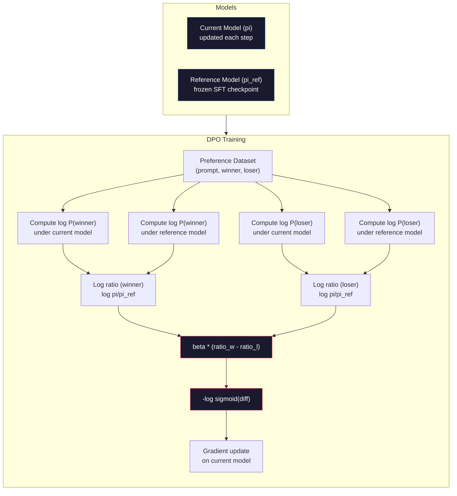

# DPO：直接偏好优化

> RLHF 确实有效，但它需要训练三个模型（SFT、奖励模型、策略模型），处理 PPO 的不稳定性，还要调节 KL 惩罚。DPO 提出了一个问题：如果能跳过这一切呢？DPO 直接使用偏好对优化语言模型。不需要奖励模型，不需要 PPO，只有一个训练循环，却能取得相同效果。

**Type:** 构建
**Languages:** Python（使用 numpy）
**Prerequisites:** 阶段 10 第 07 课（RLHF）
**Time:** 约 90 分钟

## 学习目标

- 实现 DPO 训练，直接在偏好对上优化语言模型，不再使用单独的奖励模型
- 推导 DPO 损失函数，并解释它如何通过策略的对数概率隐式表示奖励模型
- 从训练稳定性、计算成本和所需模型数量方面比较 DPO 与 RLHF
- 调节 beta 参数，控制训练后策略偏离参考模型的程度

## 问题

你在第 07 课构建了一条 RLHF 流水线：三个阶段，三个模型。先得到 SFT 模型，再训练奖励模型，最后用 PPO 优化策略模型。仅奖励模型就需要数千个人类偏好对和独立的训练循环；PPO 则需要仔细调节 KL 系数、学习率、裁剪比率与训练轮数。

实践中，PPO 训练以不稳定著称。超参数稍有变化，训练就可能发散。奖励模型只是人类偏好的不完美代理，策略会设法利用它的弱点。KL 惩罚有所帮助，却也需要单独调节——太低会出现奖励黑客，太高则几乎学不到东西。

这份复杂性正是 InstructGPT 发表后多年间，大多数开源模型仍难以使用 RLHF 的原因。三阶段流水线十分脆弱，每个阶段都有自己的失效模式，而且错误会层层累积。

2023 年 5 月，Stanford 的 Rafael Rafailov、Archit Sharma 等人发表了《Direct Preference Optimization: Your Language Model is Secretly a Reward Model》。核心洞见是：不需要单独的奖励模型。最优奖励函数在数学上由语言模型自身的词元概率决定，因此可以完全跳过奖励模型，直接在偏好对上优化语言模型。

DPO 把 RLHF 简化为单个监督学习步骤：一个模型、一个损失函数、一个训练循环，不使用强化学习。Zephyr-7B 是最早大规模使用 DPO 的模型之一，它在多项基准上达到或超过完整 RLHF 训练的模型。Meta 在 Llama 3 的对齐流水线中使用了 DPO，Anthropic 也在对齐研究中引用过 DPO 风格的方法。

## 概念

### 核心洞见

RLHF 优化以下目标：

```
maximize: E[R(x, y)] - beta * KL(pi || pi_ref)
```

其中 R 是奖励模型，pi 是策略，pi_ref 是参考模型，beta 是 KL 系数。

DPO 论文证明，这个目标存在闭式最优解。对于任意奖励函数 R，最优策略为：

```
pi*(y | x) = pi_ref(y | x) * exp(R(x, y) / beta) / Z(x)
```

其中 Z(x) 是归一化常数。重新整理可得：

```
R(x, y) = beta * log(pi*(y | x) / pi_ref(y | x)) + beta * log Z(x)
```

这就是突破所在。奖励完全由策略模型概率与参考模型概率表达，无须训练单独的奖励模型。奖励被*隐式*编码在概率比率中。

将它代入 Bradley-Terry 偏好模型：

```
P(y_w > y_l | x) = sigmoid(R(x, y_w) - R(x, y_l))
                  = sigmoid(beta * (log pi(y_w|x)/pi_ref(y_w|x) - log pi(y_l|x)/pi_ref(y_l|x)))
```

由于两个回答以同一个提示词 x 为条件，Z(x) 项会相互抵消。剩下的表达式只依赖当前策略模型与参考模型在偏好回答和拒绝回答上的对数概率。

### DPO 损失

```
L_DPO = -log(sigmoid(beta * (log pi(y_w|x)/pi_ref(y_w|x) - log pi(y_l|x)/pi_ref(y_l|x))))
```

逐项拆解：

- **y_w** = 偏好（胜出）回答
- **y_l** = 拒绝（落败）回答
- **x** = 提示词
- **pi** = 当前模型（正在训练）
- **pi_ref** = 参考模型（冻结的 SFT 检查点）
- **beta** = 控制偏离参考模型程度的温度参数（通常为 0.1～0.5）

比率 `log pi(y|x) / pi_ref(y|x)` 是对数概率比。当它为正时，当前模型为回答 y 分配的概率高于参考模型；为负时，则低于参考模型。

DPO 损失会推动模型提高偏好回答的对数概率比，并降低拒绝回答的对数概率比。beta 参数控制模型可以多激进地偏离参考模型——较小的 beta 允许更大偏离，较大的 beta 则让模型更靠近参考模型。



### DPO 为什么更简单

| 方面 | RLHF（PPO） | DPO |
|--------|-----------|-----|
| 需要训练的模型 | 3 个（SFT + 奖励 + 策略） | 1 个（仅策略） |
| 训练循环 | 3 个（SFT、RM 训练、PPO） | 2 个（SFT、DPO） |
| 超参数 | lr、KL 系数、裁剪比率、RM lr、三阶段轮数 | lr、beta、轮数 |
| 奖励模型 | 必需（单独训练） | 隐式包含在模型概率中 |
| 强化学习算法 | PPO（复杂、不稳定） | 监督学习（稳定） |
| GPU 内存 | PPO 期间内存中有 3～4 个模型 | 2 个模型（当前 + 参考） |
| 训练稳定性 | 对超参数敏感 | 稳健，与 SFT 类似 |

DPO 训练期间需要在内存中放两个模型——当前模型和冻结参考模型。RLHF 则需要三个或四个：策略、参考、奖励模型，以及可选的价值函数基线。对于 70B 模型，每个 FP16 副本都占 140GB。移除奖励模型带来的内存节省十分可观。

### DPO 何时优于 RLHF

**小型数据集。** 拥有 5,000～20,000 个偏好对时，DPO 往往可以达到或超过 RLHF。RLHF 中的奖励模型需要足够数据才能泛化；数据有限时，它会过拟合并产生不可靠的奖励信号。DPO 完全不需要奖励模型，从而绕过这个问题。

**计算资源有限。** DPO 所需计算量约为完整 RLHF 的三分之一（三个训练循环缩减为一个）。对于没有大型 GPU 集群的团队，这是切实可行的选择。

**快速迭代。** 想尝试 10 个不同偏好数据集，看看哪个模型效果最好？DPO 可以在几小时内跑完每个实验，而 RLHF 每换一份数据集都要重新训练奖励模型。

### RLHF 何时优于 DPO

**大规模训练。** 在 GPT-4 或 Claude 的规模上，RLHF 的独立奖励模型可以捕捉更细腻的偏好信号。奖励模型相当于学习得到的损失函数，能够适应复杂的质量标准。

**复杂奖励信号。** 当“更好”涉及多个维度（帮助性、无害性、诚实性）时，奖励模型可以学习这种多目标权衡。DPO 把每个偏好对视为二元信号——一个更好、一个更差——却不建模原因。

**迭代式对齐。** RLHF 流水线可以让当前策略生成新回答，由人类评分，再在线重新训练奖励模型。DPO 使用固定的偏好对数据集。宪法式 AI（Anthropic 的方法）大量利用了 RLHF 的这种迭代特性。

### DPO 之后：KTO、ORPO、SimPO

DPO 催生了一系列简化对齐方法。

**KTO（Kahneman-Tversky Optimization，2024）：** 连成对数据都不需要。KTO 使用非成对反馈——只需把每条回答标为“好”或“坏”，无须与另一个答案比较。这大幅简化了数据收集：不再向标注者展示两个回答并问“哪个更好？”，而是只展示一个回答并问“这个好吗？”损失函数引入前景理论中的损失厌恶：坏回答受到的惩罚，大于好回答得到的奖励。

**ORPO（Odds Ratio Preference Optimization，2024）：** 在单个训练步骤中结合 SFT 与对齐。它不再先做 SFT 再做 DPO，而是修改 SFT 损失并加入偏好信号。损失包含两项：偏好回答上的标准下一词元预测损失，以及扩大偏好回答与拒绝回答概率差距的优势比项。只需一个训练循环，而不是两个。

**SimPO（Simple Preference Optimization，2024）：** 完全移除参考模型。SimPO 不再计算相对于冻结参考模型的对数概率比，而是用回答的平均对数概率（按长度归一化）作为隐式奖励。这样既节省内存（不需要参考模型），也简化训练。长度归一化会阻止模型偏爱较短回答。

| 方法 | 年份 | 内存中的模型数 | 需要成对数据？ | 需要参考模型？ | 训练循环数 |
|--------|------|-----------------|-------------|-----------------|----------------|
| RLHF | 2022 | 3～4 | 是（供 RM 使用） | 是 | 3 |
| DPO | 2023 | 2 | 是 | 是 | 2 |
| KTO | 2024 | 2 | 否（非成对） | 是 | 2 |
| ORPO | 2024 | 1 | 是 | 否 | 1 |
| SimPO | 2024 | 1 | 是 | 否 | 1 |

趋势很明确：每种方法都继续移除一层复杂性。RLHF 需要奖励模型和 PPO，DPO 同时去掉二者，KTO 去掉成对数据，ORPO 去掉独立 SFT 阶段，SimPO 则去掉参考模型。从基础模型转向对齐模型所需的计算与复杂性成本——即“对齐税”——正在持续下降。

### 真实 DPO 部署

**Zephyr-7B（HuggingFace，2023 年 10 月）：** 基于 Mistral 7B，先在 UltraChat（20 万个样本）上做 SFT，再在 UltraFeedback（6 万个偏好对）上做 DPO。它在 MT-Bench 上得到 6.47 分，是当时得分最高的 7B 模型。相比之下，Llama 2 Chat 70B 得分为 6.86，也就是说，Zephyr 仅凭 DPO 对齐，就把差距缩小到了一个参数量为其 10 倍模型的 6% 以内。

**Llama 3（Meta，2024 年 4 月）：** 在初始 RLHF 阶段后使用 DPO。这种组合说明 DPO 与 RLHF 可以互补——RLHF 负责广泛对齐，DPO 用于针对性精修。

**Neural Magic / nm-chat（2024）：** 对多个开源模型应用 DPO，相比仅 SFT 的基线，在对齐基准上持续取得 5%～15% 的提升。

```figure
dpo-loss
```

## 动手构建

### 第 1 步：偏好数据集

使用与 RLHF 相同的格式——（提示词、偏好回答、拒绝回答）三元组。DPO 直接使用这些数据，不需要中间奖励模型。

```python
import numpy as np
import sys
import os
sys.path.insert(0, os.path.join(os.path.dirname(__file__), "..", "..", "04-pre-training-mini-gpt", "code"))
from main import MiniGPT, LayerNorm, Embedding, TransformerBlock

PREFERENCE_DATA = [
    {
        "prompt": "What is the capital of France?",
        "preferred": "The capital of France is Paris.",
        "rejected": "France is a country in Europe. It has many cities. The capital is Paris. Paris is known for the Eiffel Tower.",
    },
    {
        "prompt": "Explain gravity in one sentence.",
        "preferred": "Gravity is the force that attracts objects with mass toward each other.",
        "rejected": "Gravity is something that makes things fall down when you drop them.",
    },
    {
        "prompt": "What is 15 times 7?",
        "preferred": "15 times 7 is 105.",
        "rejected": "Let me think about this. 15 times 7. Well, 10 times 7 is 70, and 5 times 7 is 35, so the answer might be around 105.",
    },
    {
        "prompt": "Name three programming languages.",
        "preferred": "Python, Rust, and TypeScript.",
        "rejected": "There are many programming languages. Some popular ones include various languages like Python and others.",
    },
    {
        "prompt": "What year did World War II end?",
        "preferred": "World War II ended in 1945.",
        "rejected": "World War II was a major global conflict. It involved many countries. The war ended in the mid-1940s, specifically in 1945.",
    },
    {
        "prompt": "Define machine learning.",
        "preferred": "Machine learning is a field where algorithms learn patterns from data to make predictions without being explicitly programmed.",
        "rejected": "Machine learning is a type of AI. AI stands for artificial intelligence. Machine learning uses data to learn.",
    },
]
```

### 第 2 步：序列对数概率

DPO 损失需要计算给定提示词时，一个回答的总对数概率。这意味着，要在完整的（提示词 + 回答）序列上运行模型，并对每个回答词元的对数概率求和。

```python
def tokenize_sequence(text, vocab_size=256):
    return [min(t, vocab_size - 1) for t in list(text.encode("utf-8"))]


def compute_sequence_log_prob(model, prompt_tokens, response_tokens, max_seq_len=128):
    full_sequence = prompt_tokens + response_tokens
    if len(full_sequence) > max_seq_len:
        full_sequence = full_sequence[:max_seq_len]

    if len(full_sequence) < 2:
        return 0.0

    input_ids = np.array(full_sequence[:-1]).reshape(1, -1)
    target_ids = np.array(full_sequence[1:])

    logits = model.forward(input_ids)
    logits = logits[0]

    max_logits = logits.max(axis=-1, keepdims=True)
    log_probs = logits - max_logits - np.log(
        np.exp(logits - max_logits).sum(axis=-1, keepdims=True)
    )

    prompt_len = len(prompt_tokens)
    response_start = max(0, prompt_len - 1)
    response_end = len(target_ids)

    if response_start >= response_end:
        return 0.0

    response_log_probs = log_probs[response_start:response_end, :]
    response_targets = target_ids[response_start:response_end]

    total_log_prob = 0.0
    for i, target in enumerate(response_targets):
        total_log_prob += response_log_probs[i, target]

    return total_log_prob
```

这个函数是 DPO 的主力。对于每个偏好对，它会运行四次：当前模型处理偏好回答、当前模型处理拒绝回答、参考模型处理偏好回答、参考模型处理拒绝回答。每个训练样本需要 4 次前向传播；相比 RLHF 的生成 + 奖励评分 + 价值估计 + PPO 更新，它更简单、更快、更稳定。

### 第 3 步：DPO 损失

用代码写出论文核心。一个函数，一种损失，不需要奖励模型。

```python
def sigmoid(x):
    return np.where(
        x >= 0,
        1.0 / (1.0 + np.exp(-x)),
        np.exp(x) / (1.0 + np.exp(x))
    )


def dpo_loss(policy_logprob_preferred, policy_logprob_rejected,
             ref_logprob_preferred, ref_logprob_rejected, beta=0.1):
    preferred_ratio = policy_logprob_preferred - ref_logprob_preferred
    rejected_ratio = policy_logprob_rejected - ref_logprob_rejected

    logit = beta * (preferred_ratio - rejected_ratio)

    loss = -np.log(sigmoid(logit) + 1e-8)

    preferred_reward = beta * preferred_ratio
    rejected_reward = beta * rejected_ratio

    return loss, {
        "preferred_ratio": float(preferred_ratio),
        "rejected_ratio": float(rejected_ratio),
        "logit": float(logit),
        "implicit_preferred_reward": float(preferred_reward),
        "implicit_rejected_reward": float(rejected_reward),
        "reward_margin": float(preferred_reward - rejected_reward),
    }
```

`preferred_ratio` 与 `rejected_ratio` 就是 DPO 推导中的对数概率比。当当前模型相对于参考模型为偏好回答分配更高概率、同时为拒绝回答分配更低概率时，Logit 为正，损失较低。训练信号正是把模型推向这个方向。

`implicit_preferred_reward` 与 `implicit_rejected_reward` 是 DPO 损失隐式分配的奖励。可以提取它们来确认训练是否有效——训练期间，偏好回答与拒绝回答之间的奖励差应当不断增大。

### 第 4 步：DPO 训练循环

这是一个标准监督训练循环：没有 PPO，没有奖励模型，只有前向传播与梯度更新。

```python
def copy_model_weights(source, target):
    target.embedding.token_embed = source.embedding.token_embed.copy()
    target.embedding.pos_embed = source.embedding.pos_embed.copy()
    target.ln_f.gamma = source.ln_f.gamma.copy()
    target.ln_f.beta = source.ln_f.beta.copy()
    for s_block, t_block in zip(source.blocks, target.blocks):
        t_block.attn.W_q = s_block.attn.W_q.copy()
        t_block.attn.W_k = s_block.attn.W_k.copy()
        t_block.attn.W_v = s_block.attn.W_v.copy()
        t_block.attn.W_out = s_block.attn.W_out.copy()
        t_block.ffn.W1 = s_block.ffn.W1.copy()
        t_block.ffn.W2 = s_block.ffn.W2.copy()
        t_block.ffn.b1 = s_block.ffn.b1.copy()
        t_block.ffn.b2 = s_block.ffn.b2.copy()
        t_block.ln1.gamma = s_block.ln1.gamma.copy()
        t_block.ln1.beta = s_block.ln1.beta.copy()
        t_block.ln2.gamma = s_block.ln2.gamma.copy()
        t_block.ln2.beta = s_block.ln2.beta.copy()


def dpo_train(policy_model, reference_model, preference_data,
              num_epochs=5, lr=5e-6, beta=0.1, max_seq_len=128):
    print(f"DPO Training: {len(preference_data)} pairs, {num_epochs} epochs, "
          f"lr={lr}, beta={beta}")
    print()

    losses = []
    margins = []

    for epoch in range(num_epochs):
        epoch_loss = 0.0
        epoch_margin = 0.0
        num_examples = 0

        indices = np.random.permutation(len(preference_data))

        for idx in indices:
            pair = preference_data[idx]

            prompt_tokens = tokenize_sequence(pair["prompt"])
            preferred_tokens = tokenize_sequence(pair["preferred"])
            rejected_tokens = tokenize_sequence(pair["rejected"])

            pi_logprob_w = compute_sequence_log_prob(
                policy_model, prompt_tokens, preferred_tokens, max_seq_len
            )
            pi_logprob_l = compute_sequence_log_prob(
                policy_model, prompt_tokens, rejected_tokens, max_seq_len
            )
            ref_logprob_w = compute_sequence_log_prob(
                reference_model, prompt_tokens, preferred_tokens, max_seq_len
            )
            ref_logprob_l = compute_sequence_log_prob(
                reference_model, prompt_tokens, rejected_tokens, max_seq_len
            )

            loss, metrics = dpo_loss(
                pi_logprob_w, pi_logprob_l,
                ref_logprob_w, ref_logprob_l, beta
            )

            update_direction = 1.0 if metrics["logit"] < 0 else -0.1
            for block in policy_model.blocks:
                block.ffn.W1 += lr * update_direction * np.random.randn(*block.ffn.W1.shape) * 0.01
                block.ffn.W2 += lr * update_direction * np.random.randn(*block.ffn.W2.shape) * 0.01

            epoch_loss += loss
            epoch_margin += metrics["reward_margin"]
            num_examples += 1
            losses.append(float(loss))
            margins.append(metrics["reward_margin"])

        avg_loss = epoch_loss / max(num_examples, 1)
        avg_margin = epoch_margin / max(num_examples, 1)

        print(f"  Epoch {epoch + 1}/{num_epochs} | Loss: {avg_loss:.4f} | "
              f"Avg Margin: {avg_margin:.4f}")

    return policy_model, losses, margins
```

与 RLHF 相比，这个训练循环简单得令人耳目一新。对每个偏好对，计算四个对数概率（两个模型、两个回答），代入 DPO 损失，计算梯度并更新策略。不需要生成步骤，不需要奖励模型推理，不需要优势估计，也不需要裁剪。

### 第 5 步：比较 DPO 与 RLHF

测量隐式奖励差与对数概率变化，将 DPO 和第 07 课的 RLHF 模型进行比较。

```python
def evaluate_preference_accuracy(model, reference_model, preference_data, beta=0.1, max_seq_len=128):
    correct = 0
    total = 0

    for pair in preference_data:
        prompt_tokens = tokenize_sequence(pair["prompt"])
        preferred_tokens = tokenize_sequence(pair["preferred"])
        rejected_tokens = tokenize_sequence(pair["rejected"])

        pi_w = compute_sequence_log_prob(model, prompt_tokens, preferred_tokens, max_seq_len)
        pi_l = compute_sequence_log_prob(model, prompt_tokens, rejected_tokens, max_seq_len)
        ref_w = compute_sequence_log_prob(reference_model, prompt_tokens, preferred_tokens, max_seq_len)
        ref_l = compute_sequence_log_prob(reference_model, prompt_tokens, rejected_tokens, max_seq_len)

        preferred_reward = beta * (pi_w - ref_w)
        rejected_reward = beta * (pi_l - ref_l)

        if preferred_reward > rejected_reward:
            correct += 1
        total += 1

    return correct / max(total, 1)


def analyze_implicit_rewards(model, reference_model, preference_data, beta=0.1, max_seq_len=128):
    print("Implicit Reward Analysis:")
    print("-" * 65)
    print(f"  {'Prompt':<30} {'Pref Reward':>12} {'Rej Reward':>12} {'Margin':>10}")
    print("  " + "-" * 60)

    for pair in preference_data:
        prompt_tokens = tokenize_sequence(pair["prompt"])
        preferred_tokens = tokenize_sequence(pair["preferred"])
        rejected_tokens = tokenize_sequence(pair["rejected"])

        pi_w = compute_sequence_log_prob(model, prompt_tokens, preferred_tokens, max_seq_len)
        pi_l = compute_sequence_log_prob(model, prompt_tokens, rejected_tokens, max_seq_len)
        ref_w = compute_sequence_log_prob(reference_model, prompt_tokens, preferred_tokens, max_seq_len)
        ref_l = compute_sequence_log_prob(reference_model, prompt_tokens, rejected_tokens, max_seq_len)

        pref_reward = beta * (pi_w - ref_w)
        rej_reward = beta * (pi_l - ref_l)
        margin = pref_reward - rej_reward

        truncated = pair["prompt"][:28] + ".." if len(pair["prompt"]) > 30 else pair["prompt"]
        print(f"  {truncated:<30} {pref_reward:>12.4f} {rej_reward:>12.4f} {margin:>10.4f}")

    print()
```

### 第 6 步：Beta 敏感度分析

beta 参数相当于 DPO 中的 RLHF KL 系数，控制模型能够偏离参考模型的程度。下面的实验展示其影响。

```python
def beta_sensitivity_analysis(sft_model, preference_data, betas, max_seq_len=128):
    print("Beta Sensitivity Analysis")
    print("-" * 60)
    print(f"  {'Beta':>8} {'Final Loss':>12} {'Final Margin':>14} {'Accuracy':>10}")
    print("  " + "-" * 55)

    results = []

    for beta in betas:
        policy = MiniGPT(
            vocab_size=256, embed_dim=128, num_heads=4,
            num_layers=4, max_seq_len=max_seq_len, ff_dim=512
        )
        reference = MiniGPT(
            vocab_size=256, embed_dim=128, num_heads=4,
            num_layers=4, max_seq_len=max_seq_len, ff_dim=512
        )
        copy_model_weights(sft_model, policy)
        copy_model_weights(sft_model, reference)

        policy, losses, margins_list = dpo_train(
            policy, reference, preference_data,
            num_epochs=3, lr=5e-6, beta=beta, max_seq_len=max_seq_len
        )

        accuracy = evaluate_preference_accuracy(
            policy, reference, preference_data, beta, max_seq_len
        )

        final_loss = losses[-1] if losses else 0
        final_margin = margins_list[-1] if margins_list else 0

        print(f"  {beta:>8.3f} {final_loss:>12.4f} {final_margin:>14.4f} {accuracy:>10.1%}")
        results.append({
            "beta": beta,
            "final_loss": final_loss,
            "final_margin": final_margin,
            "accuracy": accuracy,
        })

        print()

    return results
```

较小的 beta（0.01）允许模型自由偏离参考模型——学习更快，却有产生退化解的风险。较大的 beta（1.0）让模型靠近参考模型——训练稳定，但学习较慢。多数应用的最佳范围是 0.1～0.3。

## 学以致用

### 完整 DPO 流水线演示

```python
if __name__ == "__main__":
    np.random.seed(42)

    print("=" * 70)
    print("DPO: DIRECT PREFERENCE OPTIMIZATION")
    print("=" * 70)
    print()

    print("STEP 1: Initialize SFT Model (from Lesson 06)")
    print("-" * 50)
    sft_model = MiniGPT(
        vocab_size=256, embed_dim=128, num_heads=4,
        num_layers=4, max_seq_len=128, ff_dim=512
    )
    print(f"  Parameters: {sft_model.count_parameters():,}")
    print()

    print("STEP 2: DPO Training")
    print("-" * 50)

    policy_model = MiniGPT(
        vocab_size=256, embed_dim=128, num_heads=4,
        num_layers=4, max_seq_len=128, ff_dim=512
    )
    reference_model = MiniGPT(
        vocab_size=256, embed_dim=128, num_heads=4,
        num_layers=4, max_seq_len=128, ff_dim=512
    )
    copy_model_weights(sft_model, policy_model)
    copy_model_weights(sft_model, reference_model)

    policy_model, losses, margins = dpo_train(
        policy_model, reference_model, PREFERENCE_DATA,
        num_epochs=5, lr=5e-6, beta=0.1
    )
    print()

    print("=" * 70)
    print("STEP 3: Evaluate")
    print("=" * 70)
    print()

    pre_accuracy = evaluate_preference_accuracy(
        sft_model, reference_model, PREFERENCE_DATA, beta=0.1
    )
    post_accuracy = evaluate_preference_accuracy(
        policy_model, reference_model, PREFERENCE_DATA, beta=0.1
    )

    print(f"  Preference accuracy (pre-DPO):  {pre_accuracy:.1%}")
    print(f"  Preference accuracy (post-DPO): {post_accuracy:.1%}")
    print()

    analyze_implicit_rewards(policy_model, reference_model, PREFERENCE_DATA, beta=0.1)

    print("=" * 70)
    print("STEP 4: Training Dynamics")
    print("=" * 70)
    print()

    if losses:
        print("  Loss curve:")
        window = max(1, len(losses) // 5)
        for i in range(0, len(losses), window):
            chunk = losses[i:i + window]
            avg = sum(chunk) / len(chunk)
            print(f"    Steps {i:3d}-{i + len(chunk) - 1:3d}: loss = {avg:.4f}")
        print()

    if margins:
        print("  Reward margin curve:")
        window = max(1, len(margins) // 5)
        for i in range(0, len(margins), window):
            chunk = margins[i:i + window]
            avg = sum(chunk) / len(chunk)
            print(f"    Steps {i:3d}-{i + len(chunk) - 1:3d}: margin = {avg:.4f}")
        print()

    print("=" * 70)
    print("STEP 5: Beta Sensitivity")
    print("=" * 70)
    print()

    beta_results = beta_sensitivity_analysis(
        sft_model, PREFERENCE_DATA, betas=[0.01, 0.1, 0.3, 1.0]
    )

    print("=" * 70)
    print("DPO vs RLHF COMPARISON")
    print("=" * 70)
    print()
    print("  DPO advantages:")
    print("    - 1 training loop (vs 3 for RLHF)")
    print("    - 2 models in memory (vs 3-4 for RLHF)")
    print("    - Supervised learning (vs RL, more stable)")
    print("    - No reward model to train or maintain")
    print()
    print("  RLHF advantages:")
    print("    - Separate reward model captures complex preferences")
    print("    - Online learning: generate, rate, retrain")
    print("    - Better for multi-objective alignment")
    print("    - Proven at largest scales (GPT-4, Claude)")
    print()
    print("  Practical guidance:")
    print("    - Start with DPO. It's simpler and often sufficient.")
    print("    - Switch to RLHF if DPO plateaus on your eval metrics.")
    print("    - Many production systems use both: RLHF first, DPO to refine.")
```

## 交付成果

本课会生成 `outputs/prompt-alignment-method-selector.md`——一个帮助你为具体用途选择正确对齐方法（SFT、RLHF、DPO、KTO、ORPO、SimPO）的提示词。给定可用数据、计算预算和对齐目标，它会推荐相应方法与训练方案。

## 练习

1. 实现 KTO（Kahneman-Tversky Optimization）。KTO 不需要成对数据，只需把每条回答标记为“好”或“坏”。好回答的损失为 `-log(sigmoid(beta * log_ratio))`，坏回答的损失为 `-log(1 - sigmoid(beta * log_ratio))`，并对坏回答损失应用损失厌恶乘数（通常为 1.5 倍）。在相同数据上训练（把偏好回答单独视为“好”，拒绝回答单独视为“坏”），并与 DPO 比较准确率。

2. 实现长度归一化 DPO。不使用原始对数概率，而是除以回答词元数：`normalized_logprob = total_logprob / num_tokens`。这会防止模型偏爱总对数概率更高的短回答。比较使用和不使用归一化时的隐式奖励差。

3. 构建 ORPO 风格联合损失。把偏好回答上的标准下一词元预测损失加入 DPO 损失：`L = L_sft(preferred) + alpha * L_dpo`。分别尝试 0.1、0.5、1.0 的 alpha。联合损失应让模型既能遵循指令（来自 SFT 项），又会偏好更好的回答（来自 DPO 项），从而不再需要单独的 SFT 阶段。

4. 实现迭代式 DPO。运行 3 轮 DPO，再由训练后的模型生成新回答，把它们与原偏好回答组成新的偏好对，然后再次运行 DPO。完成两轮这种“自博弈”过程。比较第 1 轮与第 2 轮后的偏好准确率，判断迭代精修是否有效。

5. 比较使用不同参考模型的 DPO。除了 SFT 检查点，还分别尝试：（a）基础模型（SFT 前）；（b）DPO 第 1 轮的检查点；（c）策略模型的指数移动平均。报告哪种参考模型带来最高偏好准确率和最稳定的训练曲线。

## 关键术语

| 术语 | 人们通常怎么说 | 实际含义 |
|------|----------------|----------------------|
| DPO | “不使用强化学习的 RLHF” | 直接偏好优化：直接在偏好对上优化语言模型、绕过奖励模型与 PPO 的监督学习算法 |
| 隐式奖励 | “奖励就在模型里” | 奖励函数由策略模型与参考模型之间的对数概率比确定——无须单独的奖励模型 |
| Beta（DPO） | “温度” | 控制策略能够偏离参考模型的程度——较小的 beta 允许大幅偏离，较大的 beta 让模型保持接近 |
| 对数概率比 | “模型变化了多少” | log pi(y\|x) - log pi_ref(y\|x)——正值表示当前模型分配的概率高于参考模型 |
| 参考模型 | “冻结的检查点” | 权重永不变化的 SFT 模型副本——作为计算概率比的锚点 |
| KTO | “不需要成对数据的 DPO” | Kahneman-Tversky Optimization：使用非成对“好”或“坏”标签，而不要求偏好对 |
| ORPO | “一步对齐” | Odds Ratio Preference Optimization：把偏好项加入 SFT 损失，在一个训练循环中完成 SFT 与对齐 |
| SimPO | “无须参考模型” | Simple Preference Optimization：以长度归一化的平均对数概率作为隐式奖励，从而移除参考模型 |
| 对齐税 | “让模型安全的成本” | 从基础模型转为对齐模型所需的额外计算、数据和复杂性——DPO 显著降低了这项成本 |

## 延伸阅读

- [Rafailov 等，2023——“直接偏好优化：你的语言模型暗中就是奖励模型”](https://arxiv.org/abs/2305.18290)——把对齐从 RLHF 简化为监督学习的 DPO 论文
- [Tunstall 等，2023——“Zephyr：语言模型对齐的直接蒸馏”](https://arxiv.org/abs/2310.16944)——Zephyr-7B，证明在 UltraFeedback 上运行 DPO 可以在基准上媲美 RLHF
- [Ethayarajh 等，2024——“KTO：将模型对齐视为前景理论优化”](https://arxiv.org/abs/2402.01306)——移除对成对偏好的需求
- [Hong 等，2024——“ORPO：无需参考模型的整体式偏好优化”](https://arxiv.org/abs/2403.07691)——在一个步骤中结合 SFT 与对齐
- [Meng 等，2024——“SimPO：使用无参考奖励的简单偏好优化”](https://arxiv.org/abs/2405.14734)——完全移除参考模型
- [Llama 3 技术报告](https://arxiv.org/abs/2407.21783)——Meta 结合 RLHF 与 DPO 的对齐流水线
