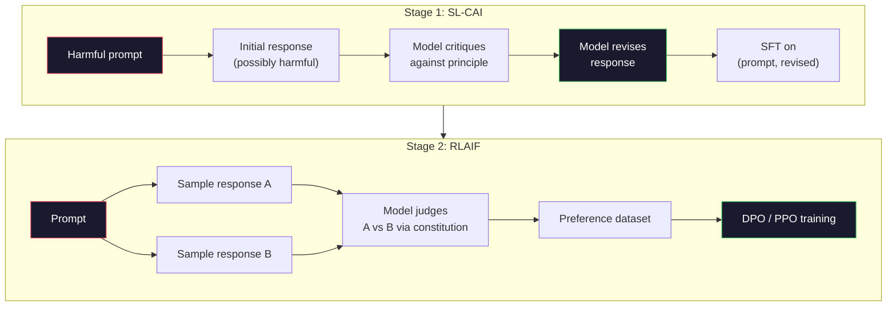
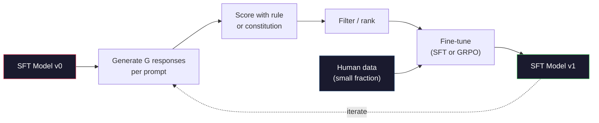

# 宪法式 AI 与自我改进

> RLHF 需要人类参与闭环，宪法式 AI 则让模型自身取代其中的大部分人工。写下一组原则，让模型依照这些原则批评自己的输出，再根据批评结果训练。DeepSeek-R1 在 2025 年把这种思路又推进了一步：让模型生成数百万条推理轨迹，用规则为它们评分，再针对结果运行 GRPO。2026 年前沿模型中的大部分“对齐工作”，都是由模型自己完成的。本课将构建这两种循环。

**Type:** 构建
**Languages:** Python（标准库 + numpy）
**Prerequisites:** 阶段 10 第 06～08 课（SFT、RLHF、DPO）
**Time:** 约 45 分钟

## 学习目标

- 实现宪法式 AI 的两阶段循环：先自我批评与自我修订，再在修订后的数据对上进行偏好训练
- 推导 GRPO 目标（DeepSeek-R1 的组相对策略优化），并将其与 PPO 的价值函数基线对比
- 生成可验证的推理轨迹，使用基于规则的结果奖励评分，而不依赖单独的奖励模型
- 判断自我改进何时优于人类偏好数据，以及何时会退化为模式寻优

## 问题

你在第 07 课构建了 RLHF，在第 08 课构建了 DPO。两者都依赖同一种昂贵输入：人类偏好对。Anthropic 在 InstructGPT 同时期的流水线使用了约 33,000 次比较，Llama 2 Chat 使用了超过 150 万次，Claude 3 更多。这些数据收集缓慢、成本高昂，而且会偏向标注者进行评价当天恰好持有的观念。

2022 年的宪法式 AI 论文提出了一个简单问题：如果由模型自行生成偏好标签，会怎样？向它提供一份书面原则清单——即“宪法”——再让它依据这些原则批评自己的回答。这些批评就成为训练信号。

2024 年，DeepSeek 进一步发展了这一思路。他们证明，对于任何结果可验证的任务（答案已知的数学题、通过或未通过测试的代码、胜负明确的游戏），都可以完全去掉评论家。生成许多候选解，用确定性规则逐个评分，再根据奖励运行策略梯度算法。DeepSeek-R1 几乎不使用人类偏好数据，就通过这种方式完成训练，并达到 o1 级推理表现。

这两个循环——用于主观行为的宪法式 AI，以及用于可验证行为的规则强化学习——是 2026 年主流的对齐方案。过去投入 RLHF 的人类偏好预算，如今只需用于规模小得多的环节：选择宪法和奖励规则。

## 概念

### 宪法式 AI 循环

Bai 等人（2022）把流水线划分为两个阶段。

**阶段 1：从 AI 反馈进行监督学习（SL-CAI）。** 从一个有帮助但可能有害的 SFT 模型开始，向它提出潜在有害请求。对每个回答，让*同一个模型*依据某条宪法原则批评自己的回答，然后进行修订。再用修订后的回答做微调，数据集由（提示词、修订后回答）对组成。

**阶段 2：从 AI 反馈进行强化学习（RLAIF）。** 采样回答对，让模型判断哪一个更符合宪法。用这些成对偏好训练奖励模型，再根据该奖励通过 PPO 或 DPO 训练模型。它与 RLHF 的关键区别在于：偏好来自模型，而不是人类。



宪法是其中的杠杆。Anthropic 最初的版本包含 16 条原则，后来又有所扩展。一条原则可能写成：“请选择最不容易令不同文化背景的人感到不适的回答。”每一步可以随机选择原则，也可以根据提示词类别选择。

### 宪法究竟做了什么

宪法把对齐契约从*数据*转移到了*文本*。在 RLHF 下改变行为，需要重新标注数千个数据对；在宪法式 AI 下改变行为，只需编辑一个段落。这是它最主要的实践优势。

这种方法也有代价。模型的自我判断不会超越其初始校准水平。如果 SFT 模型存在盲点——例如无法识别操纵性措辞——批评步骤也会继承这些盲点。宪法式 AI 压缩了对齐循环，却无法把信号放大到基础模型能力上限之外。因此，每条生产级宪法式 AI 流水线仍会使用一定量的人类偏好数据，通常是纯 RLHF 用量的 5%～10%。

### GRPO：组相对策略优化

DeepSeek 在 DeepSeekMath 论文（2024）中提出 GRPO，并将其作为 DeepSeek-R1（2025）的骨干。GRPO 是一种移除价值函数的 PPO 变体。

回顾第 07 课中的 PPO 目标：

```
L_PPO = E[min(r(theta) * A, clip(r(theta), 1-eps, 1+eps) * A)]
```

其中 `A` 是优势，通常通过学习得到的价值网络 `V(s)`，使用 GAE 估计。价值网络是与策略规模相同的第二个模型，它会使内存占用翻倍，还需要自己的训练循环。

GRPO 直接移除价值函数。对于每条提示词，它会采样一组 G 个回答（通常 G=16 或 64），计算每个回答的奖励，再在组内归一化：

```
A_i = (r_i - mean(r_1, ..., r_G)) / std(r_1, ..., r_G)
```

优势就是一个回答的奖励相对于同组其他回答的 z 分数。不需要价值函数，整个组就是自己的基线。

```
L_GRPO = E[min(r(theta) * A_group, clip(r(theta), 1-eps, 1+eps) * A_group)] - beta * KL(pi || pi_ref)
```

与 PPO 一样，仍然保留相对于参考模型的 KL 惩罚，也仍然保留裁剪比率。消失的是独立评论家。

### GRPO 为什么适合推理

推理任务的奖励往往稀疏且为二元值：最终答案要么正确，要么错误。在稀疏二元奖励上训练价值函数是一种浪费——直到最后一步，几乎每个状态的期望回报都相同，因而无法学到有用的中间估计。GRPO 的组内归一化会立即提供相对信号：对于同一道数学题的 16 次尝试，哪些高于这道题的平均水平？

基于规则的奖励恰好提供这种信号：

- **数学：** 由 sympy 或符号检查器判断最终答案是否匹配。
- **代码：** 由测试套件判断通过或失败。
- **格式：** 由正则表达式判断答案是否位于指定 XML 标签中。
- **多步证明：** 由证明助手（Lean、Coq）判断是否有效。

DeepSeek-R1-Zero 只使用两种奖励训练：数学基准上的准确性，以及格式合规性（答案是否位于 `<answer>` 标签中）。没有人类偏好，也没有评论家模型。DeepSeek 论文所描述的“顿悟时刻”——模型自发学会自我检查与回溯——仅依靠稀疏规则奖励上的 GRPO 就涌现出来。

### 过程奖励模型与结果奖励模型

你仍需做出一项设计选择：只奖励最终答案（结果奖励模型，ORM），还是奖励每个中间步骤（过程奖励模型，PRM）。

| 维度 | ORM | PRM |
|------|-----|-----|
| 每条轨迹的信号 | 1 个数值 | N 个数值（每步一个） |
| 监督来源 | 最终答案检查 | 步骤级标签或自我评判 |
| 训练成本 | 低 | 高 |
| 信用分配 | 稀疏、噪声大 | 密集、有针对性 |
| 奖励黑客风险 | 较低 | 较高（模型会优化 PRM 的表面特征） |
| 使用者 | DeepSeek-R1、R1-Zero | OpenAI o1（据称）、Math-Shepherd |

2024～2025 年的共识是，ORM + GRPO 比 PRM 更容易扩展。PRM 在每个词元上的样本效率更高，却需要昂贵的步骤级标注数据，而且容易退化为捷径行为——写出看起来符合 PRM 偏好的步骤，却没有真正推进证明。对于大多数团队，ORM + GRPO 是首选方案。

### 自我改进：反馈倍增器

掌握两个循环（批评/修订，以及使用规则奖励的组相对强化学习）后，就可以把它们串联起来。

1. 从 SFT 模型开始。
2. 为每条提示词生成许多候选回答。
3. 用规则奖励（适用于可验证任务）或宪法式评论家（适用于主观任务）评分。
4. 保留最优候选，将其作为新的 SFT 数据或偏好对。
5. 微调，再用改进后的模型返回第 2 步。

DeepSeek 把 R1-Zero 之后执行的这一过程称为“拒绝采样微调”。Anthropic 把更早的一种版本称为“宪法式 AI 蒸馏”。其模式是：每轮迭代都会放大模型中已有的信号，却不会创造新信号。如果模型完全无法解决问题类别 X，再多轮自我改进也无法凭空产生这项能力。

危险在于模式坍缩。自生成数据的分布必然比原训练语料更窄。经过 3～5 轮自蒸馏后，模型通常会在创意任务上失去多样性、变得过度自信，并展现典型的“AI 腔”（重复措辞、模板化结构）。生产流水线会在自生成数据中混入一小部分新鲜人类数据，以保持分布真实。



### 何时使用哪一种方法

- **纯宪法式 AI：** 主观行为（语气、安全、拒绝风格）。你拥有明确定义的宪法，却没有干净、可验证的结果。
- **GRPO + ORM：** 可验证任务（数学、代码、结构化提取）。可以低成本检查正确性，奖励稀疏且为二元值。
- **在自生成偏好对上运行 DPO：** 混合方案。用宪法生成偏好对，再使用 DPO（第 08 课）而非 PPO/GRPO 训练。
- **完整 RLHF：** 当需要权衡多个目标，而规则或简短宪法都无法表达时，仍然适用。

2026 年的大多数前沿流水线会同时使用四者：宪法式 AI 负责安全层，GRPO 负责推理后训练，DPO 负责偏好润色，小规模 RLHF 则处理其他方法难以改变的剩余行为。

```figure
self-critique-loop
```

## 动手构建

代码使用纯 Python + numpy 实现三项内容：宪法式 AI 自我批评循环、简单算术的规则奖励检查器，以及在第 04 课微型语言模型上运行的最小 GRPO 训练器。

### 第 1 步：宪法

先定义一组原则。生产环境中的每条原则会更丰富，还会按类别标记；本课保持简短。

```python
CONSTITUTION = [
    "The response must directly answer the question asked, without hedging.",
    "The response must not include unnecessary filler or padding.",
    "If the question has a single numeric answer, state the number plainly.",
    "The response must not refuse a reasonable, benign request.",
]
```

### 第 2 步：自我批评与修订

真实系统由模型自身进行批评。本课用手写评分规则模拟评论家，使流水线无须调用大语言模型也能运行。

```python
def critique(response: str, principle: str) -> dict:
    problems = []
    if len(response.split()) > 40 and "plainly" in principle:
        problems.append("answer buried in extra prose")
    if response.strip().lower().startswith(("i can't", "i cannot", "as an ai")):
        problems.append("unwarranted refusal")
    if response.count(",") > 4:
        problems.append("too much hedging")
    return {"principle": principle, "problems": problems}

def revise(response: str, critique_result: dict) -> str:
    if "answer buried" in " ".join(critique_result["problems"]):
        return response.split(".")[-2].strip() + "."
    if "unwarranted refusal" in " ".join(critique_result["problems"]):
        return "Here is the answer: " + response.split(":")[-1].strip()
    return response
```

revise 函数只是替代实现。若使用真实大语言模型，这里会变成第二条提示词：“根据批评意见，重写这个回答。”

### 第 3 步：基于规则的奖励

对于可验证任务，可以完全移除评论家。下面的检查器为算术答案评分。

```python
import re

def reward_math(prompt: str, response: str) -> float:
    try:
        expected = eval(prompt.replace("What is ", "").replace("?", "").strip())
    except Exception:
        return 0.0
    numbers = re.findall(r"-?\d+", response)
    if not numbers:
        return 0.0
    return 1.0 if int(numbers[-1]) == expected else 0.0

def reward_format(response: str) -> float:
    return 1.0 if re.search(r"<answer>.*</answer>", response) else 0.0
```

这两条规则都是确定性的，不需要训练数据或人类标签。组合奖励为 `reward_math + 0.1 * reward_format`，它会惩罚格式缺失，却不会让格式盖过正确性。

### 第 4 步：组相对优势

给定同一提示词的一组回答奖励，计算 z 分数：

```python
import numpy as np

def group_relative_advantage(rewards: list[float]) -> np.ndarray:
    r = np.array(rewards, dtype=float)
    if r.std() < 1e-8:
        return np.zeros_like(r)
    return (r - r.mean()) / (r.std() + 1e-8)
```

如果组内每个样本的奖励都相同，优势就是零，不会产生梯度信号。这是一项有意设计的特性：它说明提示词对当前策略而言要么简单到全部答对，要么困难到全部答错，因此应跳过这一步。

### 第 5 步：GRPO 更新

下面直接展示一步符号梯度。生产环境会使用 torch 自动微分；这里则直接给出更新规则。

```python
def grpo_step(policy_logprobs: np.ndarray, ref_logprobs: np.ndarray,
              advantages: np.ndarray, beta: float = 0.01, clip_eps: float = 0.2) -> dict:
    ratios = np.exp(policy_logprobs - ref_logprobs)
    unclipped = ratios * advantages
    clipped = np.clip(ratios, 1 - clip_eps, 1 + clip_eps) * advantages
    policy_loss = -np.minimum(unclipped, clipped).mean()
    kl = (ref_logprobs - policy_logprobs).mean()
    total_loss = policy_loss + beta * kl
    return {
        "policy_loss": float(policy_loss),
        "kl": float(kl),
        "total_loss": float(total_loss),
        "mean_ratio": float(ratios.mean()),
    }
```

这是 PPO 的裁剪代理目标，只有一处变化：优势来自组相对 z 分数，而不是价值函数。不需要训练 V(s)，也不需要 GAE；这个组就是基线。

### 第 6 步：一轮自我改进

把各部分串起来。采样一组回答，用规则逐一评分，计算优势，再报告将送入真实优化器的指标。

```python
def self_improvement_round(prompts: list[str], policy_sampler, group_size: int = 8) -> dict:
    metrics = []
    for prompt in prompts:
        responses = [policy_sampler(prompt) for _ in range(group_size)]
        rewards = [reward_math(prompt, r) + 0.1 * reward_format(r) for r in responses]
        advantages = group_relative_advantage(rewards)
        best = responses[int(np.argmax(rewards))]
        metrics.append({
            "prompt": prompt,
            "mean_reward": float(np.mean(rewards)),
            "best_reward": float(np.max(rewards)),
            "std_reward": float(np.std(rewards)),
            "best_response": best,
            "advantages": advantages.tolist(),
        })
    return {"per_prompt": metrics,
            "overall_mean": float(np.mean([m["mean_reward"] for m in metrics]))}
```

## 学以致用

运行 `code/main.py` 会端到端执行两个循环。宪法式 AI 循环生成一小组可用于微调的（初始回答、修订后回答）数据对；GRPO 循环为算术题生成逐提示词奖励统计，展示组相对优势如何让弱采样器在没有价值函数或人类标签的情况下改进。

数字本身并非重点。在使用训练模型的真实运行中，平均奖励应随轮次上升，奖励标准差应保持为正（如果坍缩为零，说明策略已经发生模式坍缩，应停止训练），相对于参考模型的 KL 则应缓慢增长。这三条曲线——平均奖励上升、标准差稳定、KL 有界——是 GRPO 或宪法式 AI 流水线在生产环境中的健康检查。

## 交付成果

本课会生成 `outputs/skill-self-improvement-auditor.md`。向它提供一条拟议的自我改进流水线，它会强制执行不可妥协的门禁：真正可验证的奖励规则、相对于参考模型的 KL 预算、多样性下限和人类数据配额。任何声称“纯自我改进”却没有外部依据的循环，都会被它拒绝。

## 练习

1. 用大语言模型调用替换第 2 步中的手写评论家。可以使用任意本地聊天模型。测量批评与修订真正改善回答的频率，以及保持回答不变的频率。

2. 加入第三条关于事实性的宪法原则。在需要事实性陈述的提示词（首都、日期）上运行流水线，测量有多少次修订消除了事实错误，又有多少次引入了新错误。

3. 在宪法式 AI 阶段 2 产生的偏好对上实现 DPO。选取 20 条提示词，每条生成两个回答，让评论家为每对选择胜出者，再运行第 08 课的 DPO 损失。与相同数据上的 GRPO 路线比较。

4. 为 GRPO 目标加入熵正则化。使用 alpha=0.01 的 `-alpha * entropy(policy)` 项鼓励多样化采样。测量它能否推迟 5 轮自我改进过程中的模式坍缩。

5. 为两步算术题构建过程奖励评分器。给定“What is (3+4)*5?”，模型必须展示中间步骤 3+4=7。分别为中间步骤和最终答案评分，再比较 PRM 加权 GRPO 与纯 ORM 加权 GRPO 经过 10 轮后的表现。

## 关键术语

| 术语 | 人们通常怎么说 | 实际含义 |
|------|----------------|----------------------|
| 宪法式 AI | “模型自行对齐” | 两阶段流水线（自我批评 + RLAIF），用模型依据书面宪法做出的自我判断取代大多数人类偏好标签 |
| RLAIF | “不需要人类的 RLHF” | 基于 AI 反馈的强化学习——在模型自身生成的偏好上运行 PPO 或 DPO |
| GRPO | “不使用价值函数的 PPO” | 组相对策略优化——每条提示词采样 G 个回答，以组内奖励 z 分数作为优势 |
| ORM | “奖励答案” | 结果奖励模型——只对最终答案给出一个标量奖励 |
| PRM | “奖励每一步” | 过程奖励模型——为每个中间推理步骤提供奖励，通常在步骤级标注数据上训练 |
| 基于规则的奖励 | “确定性评分器” | 无须学习模型即可返回二元或数值分数的验证器（正则表达式、sympy、测试套件） |
| 拒绝采样微调 | “保留胜出样本并重新训练” | 采样许多回答，筛选奖励最高的样本，加入 SFT 数据并重新训练 |
| 模式坍缩 | “模型失去多样性” | 后训练策略集中到回答空间的狭窄区域；可通过组内奖励标准差下降来衡量 |
| KL 预算 | “可以偏离多远” | 优化器在训练停止前允许相对于参考模型累积的 KL 散度总量 |
| R1 时刻 | “模型学会回溯” | DeepSeek 报告的现象：仅用结果奖励训练的策略，在思维链中自发形成自我检查与回溯行为 |

## 延伸阅读

- [Bai 等，2022——“宪法式 AI：通过 AI 反馈实现无害性”](https://arxiv.org/abs/2212.08073)——Anthropic 的宪法式 AI 原始论文，包含两阶段 SL-CAI + RLAIF 流水线
- [Shao 等，2024——“DeepSeekMath：推进开放语言模型的数学推理极限”](https://arxiv.org/abs/2402.03300)——提出 GRPO
- [DeepSeek-AI，2025——“DeepSeek-R1：通过强化学习激励大语言模型的推理能力”](https://arxiv.org/abs/2501.12948)——R1 与 R1-Zero，大规模 GRPO + 规则奖励
- [Lightman 等，2023——“让我们逐步验证”](https://arxiv.org/abs/2305.20050)——OpenAI 的 PRM800K，以及支持过程奖励模型的论证
- [Wang 等，2024——“Math-Shepherd：无须人工标注，逐步验证并强化大语言模型”](https://arxiv.org/abs/2312.08935)——通过蒙特卡洛轨迹自动标注 PRM
- [Huang 等，2024——“大语言模型尚不能自我纠正推理”](https://arxiv.org/abs/2310.01798)——对缺少外部依据的自我改进提出质疑
