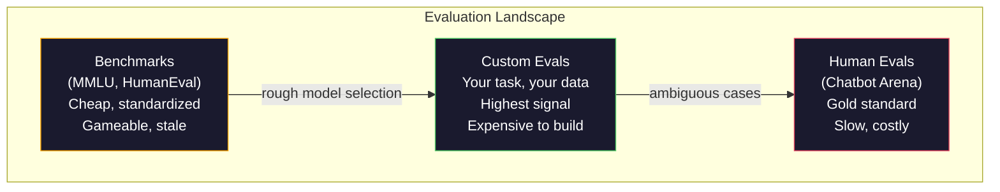
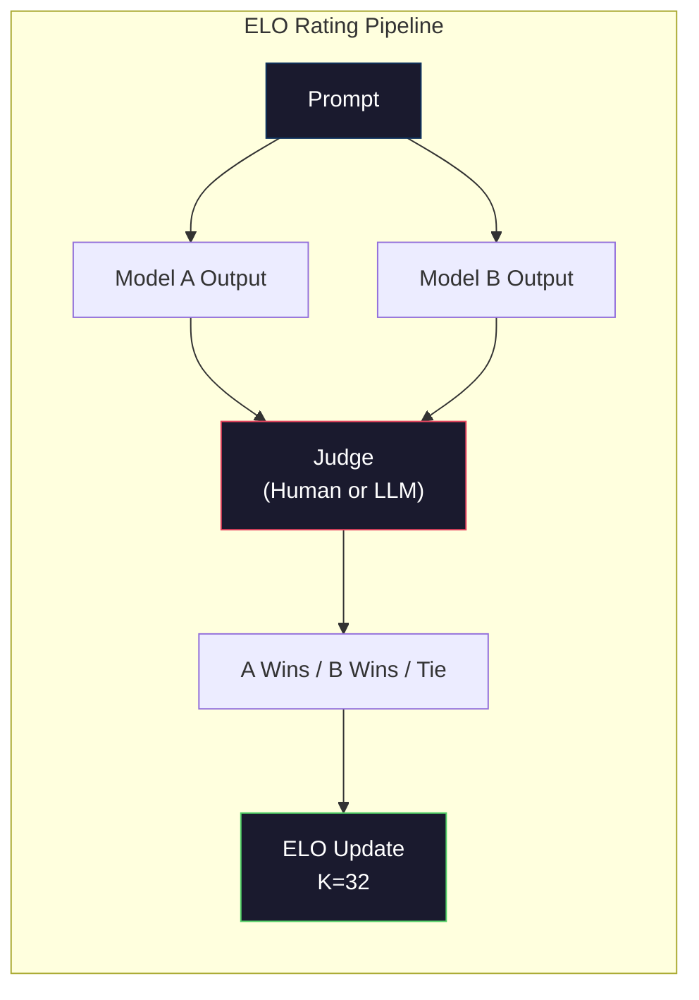

# 评估：基准、评测与 LM Harness

> 古德哈特定律：当一项指标成为目标时，它就不再是好指标。每家前沿实验室都会针对基准优化。MMLU 分数不断提高，模型却仍然无法可靠数出“strawberry”中有几个字母 R。真正重要的评测只有你的评测——针对你的任务，使用你的数据。

**Type:** 构建
**Languages:** Python
**Prerequisites:** 阶段 10 第 01～05 课（从零构建大语言模型）
**Time:** 约 90 分钟

## 学习目标

- 构建自定义评测框架，对语言模型运行多项选择与开放式基准
- 解释标准基准（MMLU、HumanEval）为何会饱和，并失去区分前沿模型的能力
- 使用恰当指标实现任务专用评测：精确匹配、F1、BLEU 与大语言模型裁判评分
- 针对自己的具体使用场景设计评测套件，而不是只依赖公开排行榜

## 问题

MMLU 于 2020 年发布，包含 57 个学科的 15,908 道题。三年内，前沿模型就让它趋于饱和。GPT-4 得分 86.4%，Claude 3 Opus 得分 86.8%，Llama 3 405B 得分 88.6%。排行榜被压缩到 3 分区间，差异只是统计噪声，而非真实能力差距。

与此同时，这些模型仍会在十岁孩子不假思索就能完成的任务上失败。MMLU 得分 88.7% 的 Claude 3.5 Sonnet，最初无法数出“strawberry”中的字母数量——这项任务不需要世界知识，也不需要推理，只需逐字符遍历。HumanEval 使用 164 道题测试代码生成。模型得分超过 90%，却仍会生成连初级开发者都能发现边界情况崩溃的代码。

基准表现与现实可靠性之间的鸿沟，是大语言模型评估的核心问题。基准告诉你的，只是模型在该基准上的表现；它几乎无法说明模型面对你的特定任务、特定数据和特定失效模式时会怎样。如果你在构建客服机器人，MMLU 就无关紧要；如果你在构建代码助手，HumanEval 只覆盖函数级生成，完全没有衡量跨文件调试、重构或代码讲解。

你需要自定义评测。不是因为基准毫无用处——它们适合粗略筛选模型——而是因为最终评估必须与部署条件精确一致。

## 概念

### 评测版图

评估分为三类，每一类的成本和信号质量都不同。

**基准**是标准化测试套件，例如 MMLU、HumanEval、SWE-bench、MATH、ARC、HellaSwag。让模型运行基准，就能得到一个分数。优点是人人使用同一项测试，因此模型之间可以比较；缺点是这些基准正日益受到模型与训练数据污染。实验室训练所用的数据包含基准题目，于是分数上升，能力却未必提高。

**自定义评测**是针对具体使用场景自行构建的测试套件。你定义输入、预期输出与评分函数。法律文档摘要器应在法律文档上评估，SQL 生成器应在你的数据库 Schema 上评估。构建成本虽高，却只有这类评测能够预测生产表现。

**人类评测**由付费标注者根据帮助性、正确性、流畅性和安全性等标准评价模型输出。对于自动评分无法胜任的开放式任务，它是金标准。Chatbot Arena 已经收集 100 多个模型之间超过 200 万次人类偏好投票。缺点是成本高（每次判断 0.10～2.00 美元），速度慢（数小时到数天）。



### 基准为什么失效

三种机制会让基准分数不再反映真实能力。

**数据污染。** 训练语料从互联网抓取，而基准题目也存在于互联网中。模型在训练期间见过答案。这不是传统意义上的作弊——实验室并非故意纳入基准数据——但在网络规模抓取中，几乎不可能将其完全排除。

**应试训练。** 实验室会优化训练数据配比，以改善基准表现。如果训练数据中有 5% 是 MMLU 风格的多项选择题，模型就会学会题型与答案分布。MMLU 是四选一，模型会学到 A/B/C/D 的答案分布大致均匀，即使不知道答案，这一点也能带来帮助。

**饱和。** 当前沿模型在某项基准上都达到 85%～90%，该基准就失去了区分能力。剩余 10%～15% 的题目可能含糊、标错，或要求冷僻的领域知识。MMLU 从 87% 提高到 89%，可能只说明模型多记住了两道冷门题，而不是变得更聪明。

### 困惑度：快速健康检查

困惑度衡量模型面对一串词元时有多“意外”。形式化定义是平均负对数似然的指数：

```
PPL = exp(-1/N * sum(log P(token_i | context)))
```

困惑度为 10，表示模型在每个词元位置上的平均不确定性，相当于从 10 个选项中均匀选择。数值越低越好。GPT-2 在 WikiText-103 上的困惑度约为 30，GPT-3 约为 20，Llama 3 8B 约为 7。

困惑度适合在同一个测试集上比较模型，但也存在盲点。模型可以凭借擅长预测常见模式获得较低困惑度，同时在罕见但重要的模式上表现糟糕。它也完全不能说明指令遵循、推理或事实准确性。应把它用作健全性检查，而非最终裁决。

### 大语言模型裁判

使用强模型评估较弱模型的输出。做法很简单：要求 GPT-4o 或 Claude Sonnet 按 1～5 分评价回答的正确性、帮助性与安全性。使用 GPT-4o-mini 时，每次判断约花费 0.01 美元，而且与人类判断的相关性出人意料地高——在多数任务上约有 80% 的一致率。

评分提示词比模型本身更重要。模糊提示词（“评价这个回答”）会产生噪声分数；带有评分标准的结构化提示词（“事实正确且引用来源得 5 分；正确但无来源得 4 分；部分正确得 3 分……”）则能产生一致、可复现的分数。

失效模式包括：裁判模型有位置偏差（成对比较时偏爱第一个回答）、冗长偏差（偏爱较长回答）和自我偏好（GPT-4 会给 GPT-4 输出比同等质量 Claude 输出更高的分数）。缓解方法包括随机排列顺序、按长度归一化，以及使用不同于被评模型的裁判。

### 根据成对比较计算 ELO 等级分

这是 Chatbot Arena 采用的方法。针对同一提示词，展示来自不同模型的两个回答，由人类（或大语言模型裁判）选出更好的一个。根据数千次此类比较，为每个模型计算 ELO 等级分——与国际象棋使用的系统相同。

ELO 的优点是：相对排名比绝对评分更可靠，可以妥善处理平局，而且比逐个输出独立评分需要更少比较就能收敛。截至 2026 年初，Chatbot Arena 排名显示 GPT-4o、Claude 3.5 Sonnet 与 Gemini 1.5 Pro 位于榜首，彼此相差不到 20 个 ELO 分。



### 评测框架

**lm-evaluation-harness**（EleutherAI）：标准的开源评测框架，支持 200 多项基准。只需一条命令，即可让任意 Hugging Face 模型运行 MMLU、HellaSwag、ARC 等基准。Open LLM Leaderboard 也使用它。

**RAGAS**：专门面向 RAG 流水线的评估框架。它衡量忠实性（回答是否符合检索到的上下文？）、相关性（检索上下文是否与问题有关？）和回答正确性。

**promptfoo**：配置驱动的提示工程评测工具。在 YAML 中定义测试用例，针对多个模型运行，再获得通过/失败报告。它适合做提示词回归测试——确保一次提示词改动没有破坏现有用例。

### 构建自定义评测

这是生产环境中唯一真正重要的评测。流程如下：

1. **定义任务。** 模型究竟应该做什么？必须准确。“回答问题”过于模糊；“给定一封客户投诉邮件，提取产品名、问题类别和情感”才是可以评估的任务。

2. **创建测试用例。** 原型评测至少 50 个，生产评测至少 200 个。每个测试用例都是一个（输入、预期输出）对。必须包含边界情况：空输入、对抗输入、含糊输入和其他语言的输入。

3. **定义评分。** 结构化输出使用精确匹配；文本相似度使用 BLEU/ROUGE；开放式质量使用大语言模型裁判；提取任务使用 F1。可以用权重组合多项指标。

4. **自动化。** 每项评测都应通过一条命令运行，不得依赖手工步骤。用便于跨时间比较的格式保存结果。

5. **跟踪变化。** 孤立的评测分数毫无意义，你需要趋势线。上次提示词修改后分数提高了吗？切换模型后是否发生回归？评测应与提示词一起进行版本管理。

| 评测类型 | 每次判断成本 | 与人类的一致率 | 最适用场景 |
|-----------|------------------|----------------------|----------|
| 精确匹配 | 约 0 美元 | 100%（适用时） | 结构化输出、分类 |
| BLEU/ROUGE | 约 0 美元 | 约 60% | 翻译、摘要 |
| 大语言模型裁判 | 约 0.01 美元 | 约 80% | 开放式生成 |
| 人类评测 | 0.10～2.00 美元 | 不适用（它就是真值） | 含糊、高风险任务 |

```figure
perplexity-loss
```

## 动手构建

### 第 1 步：最小评测框架

先定义核心抽象。一个评测用例包含输入、预期输出和可选的元数据字典。评分器接收预测与参考答案，返回 0 到 1 之间的分数。

```python
import json
from collections import Counter

class EvalCase:
    def __init__(self, input_text, expected, metadata=None):
        self.input_text = input_text
        self.expected = expected
        self.metadata = metadata or {}

class EvalSuite:
    def __init__(self, name, cases, scorers):
        self.name = name
        self.cases = cases
        self.scorers = scorers

    def run(self, model_fn):
        results = []
        for case in self.cases:
            prediction = model_fn(case.input_text)
            scores = {}
            for scorer_name, scorer_fn in self.scorers.items():
                scores[scorer_name] = scorer_fn(prediction, case.expected)
            results.append({
                "input": case.input_text,
                "expected": case.expected,
                "prediction": prediction,
                "scores": scores,
            })
        return results
```

### 第 2 步：评分函数

构建精确匹配、词元 F1，以及模拟的大语言模型裁判评分器。

```python
def exact_match(prediction, expected):
    return 1.0 if prediction.strip().lower() == expected.strip().lower() else 0.0

def token_f1(prediction, expected):
    pred_tokens = set(prediction.lower().split())
    exp_tokens = set(expected.lower().split())
    if not pred_tokens or not exp_tokens:
        return 0.0
    common = pred_tokens & exp_tokens
    precision = len(common) / len(pred_tokens)
    recall = len(common) / len(exp_tokens)
    if precision + recall == 0:
        return 0.0
    return 2 * (precision * recall) / (precision + recall)

def llm_judge_simulated(prediction, expected):
    pred_words = set(prediction.lower().split())
    exp_words = set(expected.lower().split())
    if not exp_words:
        return 0.0
    overlap = len(pred_words & exp_words) / len(exp_words)
    length_penalty = min(1.0, len(prediction) / max(len(expected), 1))
    return round(overlap * 0.7 + length_penalty * 0.3, 3)
```

### 第 3 步：ELO 等级分系统

实现带 ELO 更新的成对比较。这正是 Chatbot Arena 用来为模型排名的系统。

```python
class ELOTracker:
    def __init__(self, k=32, initial_rating=1500):
        self.ratings = {}
        self.k = k
        self.initial_rating = initial_rating
        self.history = []

    def _ensure_player(self, name):
        if name not in self.ratings:
            self.ratings[name] = self.initial_rating

    def expected_score(self, rating_a, rating_b):
        return 1 / (1 + 10 ** ((rating_b - rating_a) / 400))

    def record_match(self, player_a, player_b, outcome):
        self._ensure_player(player_a)
        self._ensure_player(player_b)

        ea = self.expected_score(self.ratings[player_a], self.ratings[player_b])
        eb = 1 - ea

        if outcome == "a":
            sa, sb = 1.0, 0.0
        elif outcome == "b":
            sa, sb = 0.0, 1.0
        else:
            sa, sb = 0.5, 0.5

        self.ratings[player_a] += self.k * (sa - ea)
        self.ratings[player_b] += self.k * (sb - eb)

        self.history.append({
            "a": player_a, "b": player_b,
            "outcome": outcome,
            "rating_a": round(self.ratings[player_a], 1),
            "rating_b": round(self.ratings[player_b], 1),
        })

    def leaderboard(self):
        return sorted(self.ratings.items(), key=lambda x: -x[1])
```

### 第 4 步：计算困惑度

使用词元概率计算困惑度。实践中，这些概率来自模型 Logit；这里用概率分布进行模拟。

```python
import numpy as np

def perplexity(log_probs):
    if not log_probs:
        return float("inf")
    avg_neg_log_prob = -np.mean(log_probs)
    return float(np.exp(avg_neg_log_prob))

def token_log_probs_simulated(text, model_quality=0.8):
    np.random.seed(hash(text) % 2**31)
    tokens = text.split()
    log_probs = []
    for i, token in enumerate(tokens):
        base_prob = model_quality
        if len(token) > 8:
            base_prob *= 0.6
        if i == 0:
            base_prob *= 0.7
        prob = np.clip(base_prob + np.random.normal(0, 0.1), 0.01, 0.99)
        log_probs.append(float(np.log(prob)))
    return log_probs
```

### 第 5 步：汇总结果

计算一次评测运行的汇总统计量：均值、中位数、指定阈值下的通过率，以及逐指标明细。

```python
def summarize_results(results, threshold=0.8):
    all_scores = {}
    for r in results:
        for metric, score in r["scores"].items():
            all_scores.setdefault(metric, []).append(score)

    summary = {}
    for metric, scores in all_scores.items():
        arr = np.array(scores)
        summary[metric] = {
            "mean": round(float(np.mean(arr)), 3),
            "median": round(float(np.median(arr)), 3),
            "std": round(float(np.std(arr)), 3),
            "min": round(float(np.min(arr)), 3),
            "max": round(float(np.max(arr)), 3),
            "pass_rate": round(float(np.mean(arr >= threshold)), 3),
            "n": len(scores),
        }
    return summary

def print_summary(summary, suite_name="Eval"):
    print(f"\n{'=' * 60}")
    print(f"  {suite_name} Summary")
    print(f"{'=' * 60}")
    for metric, stats in summary.items():
        print(f"\n  {metric}:")
        print(f"    Mean:      {stats['mean']:.3f}")
        print(f"    Median:    {stats['median']:.3f}")
        print(f"    Std:       {stats['std']:.3f}")
        print(f"    Range:     [{stats['min']:.3f}, {stats['max']:.3f}]")
        print(f"    Pass rate: {stats['pass_rate']:.1%} (threshold >= 0.8)")
        print(f"    N:         {stats['n']}")
```

### 第 6 步：运行完整流水线

把所有部分连接起来。定义任务、创建测试用例、模拟两个模型、运行评测、根据成对比较计算 ELO，再打印排行榜。

```python
def demo_model_good(prompt):
    responses = {
        "What is the capital of France?": "Paris",
        "What is 2 + 2?": "4",
        "Who wrote Hamlet?": "William Shakespeare",
        "What language is PyTorch written in?": "Python and C++",
        "What is the boiling point of water?": "100 degrees Celsius",
    }
    return responses.get(prompt, "I don't know")

def demo_model_bad(prompt):
    responses = {
        "What is the capital of France?": "Paris is the capital city of France",
        "What is 2 + 2?": "The answer is four",
        "Who wrote Hamlet?": "Shakespeare",
        "What language is PyTorch written in?": "Python",
        "What is the boiling point of water?": "212 Fahrenheit",
    }
    return responses.get(prompt, "Unknown")

cases = [
    EvalCase("What is the capital of France?", "Paris"),
    EvalCase("What is 2 + 2?", "4"),
    EvalCase("Who wrote Hamlet?", "William Shakespeare"),
    EvalCase("What language is PyTorch written in?", "Python and C++"),
    EvalCase("What is the boiling point of water?", "100 degrees Celsius"),
]

suite = EvalSuite(
    name="General Knowledge",
    cases=cases,
    scorers={
        "exact_match": exact_match,
        "token_f1": token_f1,
        "llm_judge": llm_judge_simulated,
    },
)

results_good = suite.run(demo_model_good)
results_bad = suite.run(demo_model_bad)

print_summary(summarize_results(results_good), "Model A (concise)")
print_summary(summarize_results(results_bad), "Model B (verbose)")
```

“好”模型给出精确答案，“坏”模型给出冗长改写。精确匹配会严厉惩罚冗长模型，词元 F1 与大语言模型裁判则更加宽容。这说明评分指标的选择非常重要：同一个模型会因评分方式不同而显得极好或极差。

### 第 7 步：ELO 锦标赛

让多个模型进行多轮成对比较。

```python
elo = ELOTracker(k=32)

for case in cases:
    pred_a = demo_model_good(case.input_text)
    pred_b = demo_model_bad(case.input_text)

    score_a = token_f1(pred_a, case.expected)
    score_b = token_f1(pred_b, case.expected)

    if score_a > score_b:
        outcome = "a"
    elif score_b > score_a:
        outcome = "b"
    else:
        outcome = "tie"

    elo.record_match("model_a_concise", "model_b_verbose", outcome)

print("\nELO Leaderboard:")
for name, rating in elo.leaderboard():
    print(f"  {name}: {rating:.0f}")
```

### 第 8 步：比较困惑度

比较不同质量水平“模型”的困惑度。

```python
test_text = "The quick brown fox jumps over the lazy dog in the garden"

for quality, label in [(0.9, "Strong model"), (0.7, "Medium model"), (0.4, "Weak model")]:
    log_probs = token_log_probs_simulated(test_text, model_quality=quality)
    ppl = perplexity(log_probs)
    print(f"  {label} (quality={quality}): perplexity = {ppl:.2f}")
```

## 学以致用

### lm-evaluation-harness（EleutherAI）

这是在任意模型上运行基准的标准工具。

```python
# pip install lm-eval
# Command line:
# lm_eval --model hf --model_args pretrained=meta-llama/Llama-3.1-8B --tasks mmlu --batch_size 8

# Python API:
# import lm_eval
# results = lm_eval.simple_evaluate(
#     model="hf",
#     model_args="pretrained=meta-llama/Llama-3.1-8B",
#     tasks=["mmlu", "hellaswag", "arc_easy"],
#     batch_size=8,
# )
# print(results["results"])
```

### promptfoo

这是配置驱动的提示工程评测工具。在 YAML 中定义测试，再针对多个提供商运行。

```yaml
# promptfoo.yaml
providers:
  - openai:gpt-4o-mini
  - anthropic:claude-3-haiku

prompts:
  - "Answer in one word: {{question}}"

tests:
  - vars:
      question: "What is the capital of France?"
    assert:
      - type: contains
        value: "Paris"
  - vars:
      question: "What is 2 + 2?"
    assert:
      - type: equals
        value: "4"
```

### 用 RAGAS 评估 RAG

```python
# pip install ragas
# from ragas import evaluate
# from ragas.metrics import faithfulness, answer_relevancy, context_precision
#
# result = evaluate(
#     dataset,
#     metrics=[faithfulness, answer_relevancy, context_precision],
# )
# print(result)
```

RAGAS 衡量通用评测遗漏的内容：模型回答是否以检索上下文为依据，而不只是抽象意义上是否“正确”。

## 交付成果

本课会生成 `outputs/prompt-eval-designer.md`——一个为任意任务设计自定义评测套件的可复用提示词。给出任务说明后，它会生成测试用例、评分函数与通过/失败阈值建议。

它还会生成 `outputs/skill-llm-evaluation.md`——一个根据任务类型、预算和延迟要求选择正确评估策略的决策框架。

## 练习

1. 添加“一致性”评分器：让模型对同一个输入运行 5 次，测量输出相同的比例。在确定性输入上出现不一致回答，说明提示词脆弱或温度设置过高。

2. 扩展 ELO 跟踪器，使其支持多个裁判函数（精确匹配、F1、大语言模型裁判）并为其分配权重。比较提高精确匹配权重与提高 F1 权重时，排行榜会怎样变化。

3. 为一项具体任务构建评测套件：把电子邮件分为 5 类。创建 100 个多样化测试用例，包括边界情况（可能同时属于多个类别的邮件、空邮件、其他语言的邮件）。测量不同“模型”（基于规则、关键词匹配、模拟大语言模型）的表现。

4. 实现污染检测：给定一组评测问题与训练语料，检查评测问题（或近似改写）有多大比例出现在训练数据中。这就是研究人员审计基准有效性的方法。

5. 构建“模型差异”工具。给定两个模型版本的评测结果，突出显示哪些具体用例有所改善、哪些发生回归、哪些保持不变。这相当于评测领域的代码差异——要理解一次改动究竟带来帮助还是伤害，它必不可少。

## 关键术语

| 术语 | 人们通常怎么说 | 实际含义 |
|------|----------------|----------------------|
| MMLU | “那个基准” | 大规模多任务语言理解——横跨 57 个学科的 15,908 道多项选择题，到 2025 年已在 88% 以上趋于饱和 |
| HumanEval | “代码评测” | OpenAI 的 164 道 Python 函数补全题，只测试独立函数生成 |
| SWE-bench | “真实编码评测” | 来自 12 个 Python 仓库的 2,294 个 GitHub Issue，衡量包括测试生成在内的端到端缺陷修复 |
| 困惑度 | “模型有多困惑” | exp(-avg(log P(token_i given context)))——越低表示模型为实际词元分配的概率越高 |
| ELO 等级分 | “模型的国际象棋排名” | 根据成对胜负记录计算的相对能力评分；Chatbot Arena 用它为 100 多个模型排名 |
| 大语言模型裁判 | “用 AI 评价 AI” | 强模型依据评分标准评价较弱模型的输出；每次判断约 0.01 美元，与人类裁判的一致率约为 80% |
| 数据污染 | “模型见过考题” | 训练数据包含基准问题，导致分数虚高，却不代表实际能力改善 |
| 评测套件 | “一堆测试” | 由（输入、预期输出、评分器）三元组组成并进行版本管理的集合，用于衡量特定能力 |
| 通过率 | “答对了多少百分比” | 评测用例中得分高于阈值的比例——它衡量可靠性，比平均分更可执行 |
| Chatbot Arena | “模型排名网站” | 拥有超过 200 万次人类偏好投票的 LMSYS 平台，通过 ELO 等级分生成最受信任的大语言模型排行榜 |

## 延伸阅读

- [Hendrycks 等，2021——“衡量大规模多任务语言理解”](https://arxiv.org/abs/2009.03300)——MMLU 论文；尽管已趋于饱和，它仍是引用最多的大语言模型基准
- [Chen 等，2021——“评估在代码上训练的大型语言模型”](https://arxiv.org/abs/2107.03374)——OpenAI 的 HumanEval 论文，奠定代码生成评估方法
- [Zheng 等，2023——“评判 LLM-as-a-Judge”](https://arxiv.org/abs/2306.05685)——系统分析使用大语言模型评估大语言模型，包括位置偏差与冗长偏差
- [LMSYS Chatbot Arena](https://chat.lmsys.org/)——由众包模型比较驱动的平台，拥有超过 200 万次投票，是最受信任的真实世界大语言模型排名
