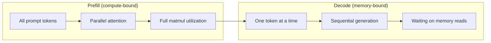
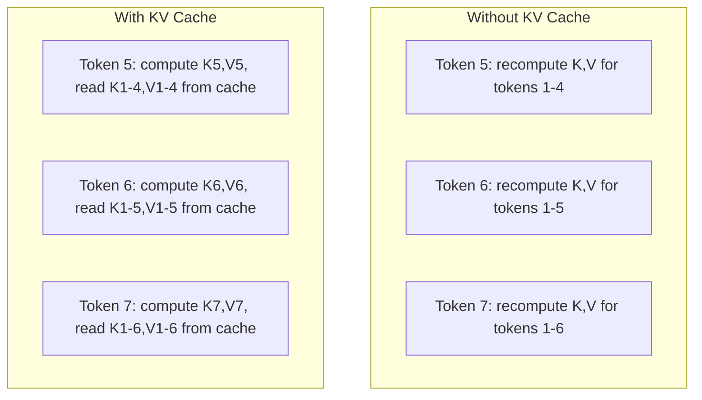
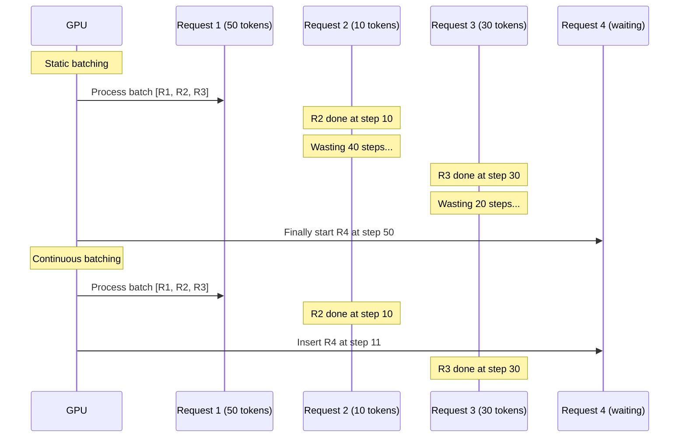
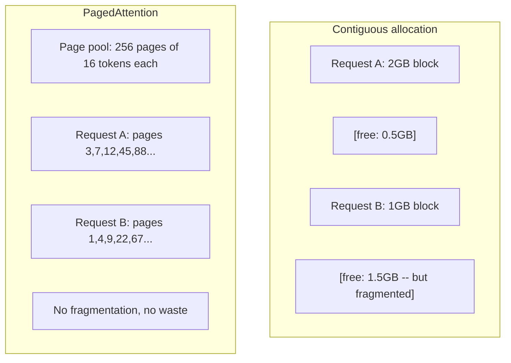
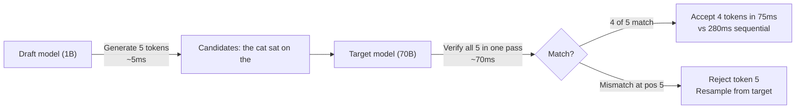

# 推理优化

> 大语言模型推理由两个阶段构成。预填充会并行处理提示词，受计算能力限制；解码会逐个生成词元，受内存带宽限制。每项优化都针对其中一个或两个阶段。

**Type:** 构建
**Languages:** Python
**Prerequisites:** 阶段 10 第 01～08 课（Transformer 架构、注意力）
**Time:** 约 120 分钟

## 学习目标

- 实现 KV 缓存，消除自回归词元生成过程中的重复计算
- 解释大语言模型推理的预填充与解码阶段，以及二者为何具有不同瓶颈（计算受限与内存受限）
- 实现连续批处理与 PagedAttention 概念，在并发请求下最大化 GPU 利用率
- 比较 KV 缓存、推测解码、Flash Attention 等推理优化技术及其吞吐量/延迟权衡

## 问题

你在 4 张 A100 GPU 上部署 Llama 3 70B。单个用户能获得约每秒 50 个词元，感觉很快。随后，100 个用户同时访问端点，每位用户的吞吐量跌至每秒 3 个词元。每月 25,000 美元的 GPU 账单，换来的回答速度还不如人类打字。

从 1 个用户增加到 100 个用户，模型本身没有变化：权重相同、架构相同、数学运算也相同。变化的是工作调度方式。朴素推理会浪费 90% 以上的可用 GPU 算力。某位用户等待第 47 个词元时占据整个批次槽位，GPU 内存总线又在矩阵乘法之间空转。与此同时，新用户的 2,000 词元提示词本可利用这段空闲时间完成有效计算。

这不是规模问题，而是调度问题。本课介绍的技术——KV 缓存、连续批处理、PagedAttention、推测解码、前缀缓存——决定了同样流量的推理账单是每月 25,000 美元还是 5,000 美元。

在 4 张 A100-80GB 上使用 vLLM 服务 Llama 3 70B，低并发时每位用户约为 50 词元/秒；借助连续批处理和 PagedAttention，在 100 个并发请求下仍可维持每位用户 15～25 TPS。没有这些优化，同样硬件在该并发量下只能提供每位用户 5 TPS。同样的 GPU、同样的模型，吞吐量却相差 4 倍。

## 概念

### 预填充与解码

每次大语言模型推理请求都包含两个截然不同的阶段。

**预填充**处理完整输入提示词。所有词元均已知，因此可以在整个序列上并行计算注意力。这是一次大型矩阵乘法——GPU 核心保持繁忙。瓶颈在计算能力，也就是硬件每秒可以执行多少 FLOP。A100 的 BF16 算力为 312 TFLOPS。单张 A100 为 70B 模型处理 4,096 词元提示词，预填充约需 400ms。

**解码**一次生成一个输出词元。每个新词元都会关注此前所有词元，但每次前向传播只产出一个词元。权重矩阵与预填充时大小相同，但现在矩阵乘的是单个向量，而不是矩阵。GPU 核心几微秒就完成计算，随后等待下一批权重从内存送达。瓶颈是内存带宽，也就是模型权重从 HBM 流向计算单元的速度。A100 带宽为 2 TB/s，一个 FP16 的 70B 模型占 140 GB。完整读取模型一次至少需要 70ms——这就是单步解码的延迟下限。



**运算:字节比**（也称算术强度）刻画了这项权衡。它衡量每从内存加载一个字节，会执行多少次运算。

```
ops:byte ratio = FLOPs per token / bytes read from memory
```

预填充一个包含 4,096 个词元的批次时，每加载一个权重，会执行约 4,096 次乘加运算。比率很高，因此受计算能力限制。批大小为 1 的解码则每加载一个权重只执行约 1 次运算。比率很低，因此受内存带宽限制。

根本洞见是：*解码之所以受内存限制，是因为生成一个词元就要读取整个模型*。下面的每项优化，都会减少读取量、增加每次读取所处理的词元批量，或完全避免读取。

### KV 缓存

在注意力计算中，每个词元的查询都会关注此前所有词元的键和值向量。如果不缓存，生成第 N 个词元时就要为之前 N-1 个词元重新计算键和值投影。生成词元 2 时会投影词元 1，生成词元 3 时又投影一次，生成词元 4 时再投影一次。到生成第 1,000 个词元时，词元 1 已经被投影了 999 次。

KV 缓存会保存此前所有词元的键和值投影。生成第 N 个词元时，只需计算词元 N 的键和值，再与词元 1 至 N-1 的缓存 K/V 拼接。



**KV 缓存的内存公式：**

```
KV cache size = 2 * num_layers * num_kv_heads * head_dim * seq_len * bytes_per_param
```

对于 Llama 3 70B（80 层、采用 GQA 的 8 个 KV 头、head_dim=128、BF16）：

```
per token: 2 * 80 * 8 * 128 * 2 bytes = 327,680 bytes = 320 KB
at 4,096 tokens: 320 KB * 4,096 = 1.28 GB
at 128K tokens: 320 KB * 131,072 = 40 GB
```

Llama 3 70B 的单条 128K 上下文对话就会消耗 40 GB KV 缓存——相当于 A100 一半的显存。若有 100 位并发用户，每位使用 4K 词元，仅 KV 缓存就需要 128 GB。因此，KV 缓存管理是推理优化的核心挑战。

### 连续批处理

静态批处理会等待 N 个请求到齐，将它们一起处理，并等到*全部*完成后才接收新请求。如果一个请求需要 500 个词元，另一个只需 10 个，那么短请求完成后还会空占 490 个解码步骤。

连续批处理（也称迭代级批处理）会在任意请求完成后立即向批次插入新请求。每个解码步骤都会重新评估批次。一个请求生成 10 个词元后完成，等待中的请求会立刻替代它。



吞吐量提升取决于输出长度的差异程度。长度一致时，连续批处理与静态批处理相当；长度不一时（更常见），连续批处理可以带来 2～5 倍吞吐量，因为 GPU 槽位始终不会闲置。

### PagedAttention

每个请求的 KV 缓存通常是一块连续内存。随着请求进入和离开，内存会产生碎片——与操作系统中的内存碎片完全相同。一个 4K 词元请求需要 1.28 GB 连续空间。即使总共有 2 GB 空闲，也可能找不到 1.28 GB 的*连续*区域，只能浪费内存或拒绝请求。

PagedAttention（来自 vLLM）把操作系统式虚拟内存应用到 KV 缓存。不再为每个请求分配一块连续内存，而是分配固定大小的“页”（通常每页 16 个词元）。这些页可以位于 GPU 物理内存中的任何位置；页表会把每个请求的逻辑序列位置映射到物理页位置。



PagedAttention 还能对共享前缀使用**写时复制**。如果 50 个请求共享同一系统提示词，它们只需保存一份该系统提示词对应的 KV 缓存页，并共同引用。只有请求开始分叉（用户消息不同）时，才分配各自的页。对于共享系统提示词的应用，这可以显著降低内存占用。

vLLM 报告称，PagedAttention 能把内存浪费降至接近零（约 4%，而朴素分配为 60%～80%）。

### 推测解码

解码很慢，是因为它必须串行执行——生成一个词元，把它反馈给模型，再生成下一个。但如果能廉价地猜测后续 5 个词元，再一次性验证它们呢？

推测解码使用小而快的**草稿模型**生成 K 个候选词元，再由大型**目标模型**在一次前向传播中处理全部 K 个候选（这与预填充类似——并行、计算受限而且高效）。如果目标模型同意草稿模型的预测，就能用一次目标模型前向传播的时间接受全部 K 个词元。如果它在位置 j 处不同意，就接受第 1 至 j-1 个词元，并丢弃其余词元。



加速效果取决于**接受率**——草稿模型的预测与目标模型匹配的频率。使用 Llama 3 8B 为 Llama 3 70B 起草时，自然语言上的典型接受率为 70%～85%，对应 2～3 倍解码加速。

推测解码有三种方法：

| 方法 | 草稿来源 | 接受率 | 开销 |
|--------|-------------|-----------------|----------|
| 草稿-目标（Leviathan 等） | 单独的小模型 | 70%～85% | 草稿模型内存 |
| EAGLE（Li 等） | 目标模型上的轻量头 | 75%～90% | 约 1% 额外参数 |
| N-gram 查找 | 词元 n-gram 表 | 40%～60% | 可忽略 |

**EAGLE** 会在目标模型隐藏状态上训练一个小型自回归头。它使用目标模型倒数第二层的特征来预测下一词元的嵌入。由于它直接处理目标模型自身的表示，而不是使用另一个模型，因此只需很少额外内存就能获得更高接受率。EAGLE-2 还加入动态草稿树，根据上下文调整候选数量。

**N-gram 推测解码**会维护一个来自当前上下文或预构建语料库的 n-gram 续写表。当草稿与同一对话中此前出现过的内容匹配时（重复模式、代码、结构化输出），无须任何神经网络开销即可生效。平均接受率较低，但每次推测的成本几乎为零。

推测解码在*数学上是精确的*——其输出分布与目标模型的分布完全相同，并不是近似。验证步骤确保每个被接受词元都严格符合目标模型本应分配的概率。

### 前缀缓存

许多请求共享相同前缀，例如聊天机器人的系统提示词、RAG 上下文块或少样本示例集。若没有前缀缓存，每个请求都要从头重新计算这些共享词元的 KV 缓存。

前缀缓存会保存常用前缀的 KV 缓存，并在请求间复用。新请求命中已知前缀时，系统复制（或引用）缓存的 KV 条目，只计算独有后缀的 KV。

如果所有请求都共享一个 2,000 词元的系统提示词，前缀缓存可为每次请求省去约 400ms 的预填充。每秒 100 个请求时，相当于每秒节省 40 秒 GPU 计算——超过一张 GPU 的全部工作量。

SGLang 的 RadixAttention 使用基数树（Trie）按词元内容索引前缀缓存。任何与已存前缀匹配的请求都能免费获得对应 KV 缓存。树结构还支持部分前缀命中——如果请求与缓存项共享 2,000 个前缀词元中的 1,500 个，就复用这 1,500 个，只重新计算 500 个。

### 推理引擎

三种引擎主导生产级大语言模型服务：

| 引擎 | 核心创新 | 最适用场景 |
|--------|---------------|----------|
| vLLM | PagedAttention、连续批处理 | 通用服务、兼容性最高 |
| SGLang | RadixAttention（前缀缓存）、结构化生成 | 多轮聊天机器人、受约束解码 |
| TensorRT-LLM | NVIDIA 内核融合、FP8 量化 | NVIDIA 硬件上的最高单卡吞吐量 |

**vLLM** 是默认起点。它支持最广泛的模型范围，可运行于各家 GPU（NVIDIA、AMD、Intel），并通过 PagedAttention + 连续批处理取得强劲吞吐量。OpenAI 兼容 API 让它可以直接替换任意 OpenAI API 调用。

**SGLang** 建立在与 vLLM 相同的基础之上，又加入了用于前缀缓存的 RadixAttention，以及面向结构化大语言模型程序的领域特定语言。如果工作负载涉及多轮对话、工具使用或受约束解码（JSON 输出、正则引导生成），SGLang 通常可以通过前缀复用取得比 vLLM 高 2～5 倍的性能。

**TensorRT-LLM** 把模型编译成优化后的 NVIDIA GPU 内核。它会融合操作（在一个内核中执行注意力 + 线性层 + 激活函数），在 H100 GPU 上使用 FP8，并与 NVIDIA Triton Inference Server 集成以供生产部署。它在 NVIDIA 硬件上提供最高单卡吞吐量，但配置工作更多，而且只支持 NVIDIA GPU。

Llama 3 70B 的真实数据（4 张 A100-80GB、BF16）：

| 指标 | vLLM | SGLang | TensorRT-LLM |
|--------|------|--------|---------------|
| 吞吐量（1 位用户） | 约 50 TPS | 约 55 TPS | 约 65 TPS |
| 吞吐量（100 位用户） | 总计约 2,500 TPS | 总计约 3,200 TPS | 总计约 3,000 TPS |
| 首词元时间 | 约 400ms | 约 300ms（前缀命中） | 约 350ms |
| 最大上下文 | 128K | 128K | 128K |

### 运算:字节框架

无法测量，就无法优化。运算:字节比会告诉你工作负载受计算还是内存限制，由此决定哪些优化有效。

```
Compute roof: peak FLOPS of the GPU
Memory roof:  peak bandwidth * ops:byte ratio
```

运算:字节比较低时（解码、小批次），会触及内存带宽上限。增加计算能力（更高时钟频率、更多核心）没有帮助；需要减少内存读取（量化、KV 缓存压缩），或增大批次，把读取成本摊到更多有效工作上。

运算:字节比较高时（预填充、大批次），会触及计算上限。优化内存带宽没有帮助；需要更快的 GPU、内核融合或降低精度，以挤出更多 FLOP。

| 场景 | 运算:字节比 | 受限因素 | 优化方式 |
|----------|----------|-------|---------------|
| 预填充，batch=1 | 约 4,096 | 计算 | 内核融合、FP8 |
| 解码，batch=1 | 约 1 | 内存 | 量化、KV 压缩 |
| 解码，batch=32 | 约 32 | 内存 | 更大批次、连续批处理 |
| 解码，batch=256 | 约 256 | 正在过渡 | 两方面都重要 |
| 解码，batch=1024 | 约 1,024 | 计算 | 内核融合、张量并行 |

A100 上的交叉点约为运算:字节比 156（312 TFLOPS / 2 TB/s）。低于 156 时受内存限制，高于 156 时受计算限制。连续批处理通过在每轮迭代中打包更多词元，推动解码向这一交叉点靠近。

```figure
context-window-slide
```

## 动手构建

### 第 1 步：从零实现 KV 缓存

构建多头 KV 缓存，按层、按头存储键和值投影，并展示内存增长模式。

```python
import numpy as np

class KVCache:
    def __init__(self, num_layers, num_heads, head_dim, max_seq_len, dtype=np.float16):
        self.num_layers = num_layers
        self.num_heads = num_heads
        self.head_dim = head_dim
        self.max_seq_len = max_seq_len
        self.dtype = dtype

        self.k_cache = np.zeros(
            (num_layers, num_heads, max_seq_len, head_dim), dtype=dtype
        )
        self.v_cache = np.zeros(
            (num_layers, num_heads, max_seq_len, head_dim), dtype=dtype
        )
        self.seq_len = 0

    def update(self, layer_idx, new_keys, new_values):
        num_new = new_keys.shape[1]
        end = self.seq_len + num_new
        self.k_cache[layer_idx, :, self.seq_len:end, :] = new_keys
        self.v_cache[layer_idx, :, self.seq_len:end, :] = new_values
        return (
            self.k_cache[layer_idx, :, :end, :],
            self.v_cache[layer_idx, :, :end, :]
        )

    def advance(self, num_tokens):
        self.seq_len += num_tokens

    def memory_bytes(self):
        return self.k_cache.nbytes + self.v_cache.nbytes

    def used_bytes(self):
        per_token = 2 * self.num_layers * self.num_heads * self.head_dim * np.dtype(self.dtype).itemsize
        return per_token * self.seq_len
```

### 第 2 步：带 KV 缓存的注意力

实现一个简化的多头注意力，在解码步骤中使用 KV 缓存。

```python
def scaled_dot_product_attention(query, keys, values):
    head_dim = query.shape[-1]
    scores = np.matmul(query, keys.transpose(0, 1, 3, 2)) / np.sqrt(head_dim)
    seq_len_q = scores.shape[-2]
    seq_len_k = scores.shape[-1]
    if seq_len_q > 1:
        mask = np.triu(np.ones((seq_len_q, seq_len_k), dtype=np.float32), k=seq_len_k - seq_len_q + 1)
        scores = scores + mask * (-1e9)
    max_scores = np.max(scores, axis=-1, keepdims=True)
    exp_scores = np.exp(scores - max_scores)
    attn_weights = exp_scores / np.sum(exp_scores, axis=-1, keepdims=True)
    return np.matmul(attn_weights, values)


class MultiHeadAttention:
    def __init__(self, d_model, num_heads):
        self.num_heads = num_heads
        self.head_dim = d_model // num_heads
        scale = np.sqrt(2.0 / d_model)
        self.W_q = np.random.randn(d_model, d_model).astype(np.float32) * scale
        self.W_k = np.random.randn(d_model, d_model).astype(np.float32) * scale
        self.W_v = np.random.randn(d_model, d_model).astype(np.float32) * scale
        self.W_o = np.random.randn(d_model, d_model).astype(np.float32) * scale

    def forward(self, x, kv_cache=None, layer_idx=0):
        batch, seq_len, d_model = x.shape
        Q = np.matmul(x, self.W_q).reshape(batch, seq_len, self.num_heads, self.head_dim).transpose(0, 2, 1, 3)
        K = np.matmul(x, self.W_k).reshape(batch, seq_len, self.num_heads, self.head_dim).transpose(0, 2, 1, 3)
        V = np.matmul(x, self.W_v).reshape(batch, seq_len, self.num_heads, self.head_dim).transpose(0, 2, 1, 3)

        if kv_cache is not None:
            K_full, V_full = kv_cache.update(layer_idx, K[0], V[0])
            K = K_full[np.newaxis, :, :, :]
            V = V_full[np.newaxis, :, :, :]
            if seq_len == 1:
                kv_cache.advance(1)

        attn_out = scaled_dot_product_attention(Q, K, V)
        attn_out = attn_out.transpose(0, 2, 1, 3).reshape(batch, -1, d_model)
        return np.matmul(attn_out, self.W_o)
```

### 第 3 步：连续批处理模拟器

下面模拟静态批处理与连续批处理在调度上的区别。

```python
import heapq

class Request:
    def __init__(self, request_id, prompt_tokens, output_tokens, arrival_step):
        self.request_id = request_id
        self.prompt_tokens = prompt_tokens
        self.output_tokens = output_tokens
        self.arrival_step = arrival_step
        self.tokens_generated = 0
        self.start_step = None
        self.end_step = None

    def is_done(self):
        return self.tokens_generated >= self.output_tokens


def simulate_static_batching(requests, batch_size):
    step = 0
    completed = []
    queue = list(requests)
    queue.sort(key=lambda r: r.arrival_step)

    while queue:
        batch = []
        while queue and len(batch) < batch_size:
            r = queue.pop(0)
            r.start_step = max(step, r.arrival_step)
            batch.append(r)

        if batch:
            step = max(step, max(r.start_step for r in batch))
            max_output = max(r.output_tokens for r in batch)
            for r in batch:
                r.tokens_generated = r.output_tokens
                r.end_step = step + max_output
            step += max_output
            completed.extend(batch)

    return completed


def simulate_continuous_batching(requests, batch_size):
    step = 0
    completed = []
    queue = sorted(requests, key=lambda r: r.arrival_step)
    queue_idx = 0
    active = []
    waiting = []

    while queue_idx < len(queue) or active or waiting:
        while queue_idx < len(queue) and queue[queue_idx].arrival_step <= step:
            waiting.append(queue[queue_idx])
            queue_idx += 1

        while waiting and len(active) < batch_size:
            r = waiting.pop(0)
            r.start_step = step
            active.append(r)

        if not active:
            if waiting:
                step += 1
                continue
            elif queue_idx < len(queue):
                step = queue[queue_idx].arrival_step
                continue
            else:
                break

        for r in active:
            r.tokens_generated += 1

        done = [r for r in active if r.is_done()]
        for r in done:
            r.end_step = step + 1
            completed.append(r)
        active = [r for r in active if not r.is_done()]

        step += 1

    return completed


def batching_stats(completed):
    latencies = [r.end_step - r.arrival_step for r in completed]
    total_time = max(r.end_step for r in completed) - min(r.arrival_step for r in completed)
    total_tokens = sum(r.output_tokens for r in completed)
    return {
        "avg_latency": np.mean(latencies),
        "p50_latency": np.median(latencies),
        "p99_latency": np.percentile(latencies, 99),
        "total_time": total_time,
        "throughput": total_tokens / total_time if total_time > 0 else 0,
    }
```

### 第 4 步：前缀缓存

构建一个基于 Trie 的前缀缓存，为共享前缀保存 KV 条目。

```python
class TrieNode:
    def __init__(self):
        self.children = {}
        self.kv_data = None
        self.hit_count = 0


class PrefixCache:
    def __init__(self, max_entries=1000):
        self.root = TrieNode()
        self.max_entries = max_entries
        self.total_entries = 0
        self.hits = 0
        self.misses = 0

    def _walk(self, token_ids):
        node = self.root
        depth = 0
        for tid in token_ids:
            if tid not in node.children:
                break
            node = node.children[tid]
            depth += 1
        return node, depth

    def lookup(self, token_ids):
        node, depth = self._walk(token_ids)
        if depth > 0:
            self.hits += 1
            current = self.root
            for tid in token_ids[:depth]:
                current = current.children[tid]
                current.hit_count += 1
            kv_entries = []
            current = self.root
            for tid in token_ids[:depth]:
                current = current.children[tid]
                if current.kv_data is not None:
                    kv_entries.append(current.kv_data)
            return depth, kv_entries
        self.misses += 1
        return 0, []

    def insert(self, token_ids, kv_per_token):
        node = self.root
        for i, tid in enumerate(token_ids):
            if tid not in node.children:
                if self.total_entries >= self.max_entries:
                    return i
                node.children[tid] = TrieNode()
                self.total_entries += 1
            node = node.children[tid]
            if i < len(kv_per_token):
                node.kv_data = kv_per_token[i]
        return len(token_ids)

    def hit_rate(self):
        total = self.hits + self.misses
        return self.hits / total if total > 0 else 0.0
```

### 第 5 步：推测解码模拟器

以可配置的接受率模拟草稿-目标推测解码。

```python
class DraftModel:
    def __init__(self, vocab_size, acceptance_rate=0.8):
        self.vocab_size = vocab_size
        self.acceptance_rate = acceptance_rate

    def generate(self, context, num_tokens):
        tokens = np.random.randint(0, self.vocab_size, size=num_tokens)
        return tokens

    def get_probs(self, context, token):
        probs = np.random.dirichlet(np.ones(self.vocab_size))
        return probs


class TargetModel:
    def __init__(self, vocab_size):
        self.vocab_size = vocab_size

    def get_probs(self, context, tokens=None):
        if tokens is not None:
            return [np.random.dirichlet(np.ones(self.vocab_size)) for _ in tokens]
        return np.random.dirichlet(np.ones(self.vocab_size))


def speculative_decode(draft_model, target_model, context, num_speculative=5,
                       draft_cost=1.0, target_cost=10.0, verify_cost=12.0):
    total_tokens = 0
    total_cost = 0.0
    accepted_counts = []
    context = list(context)

    max_tokens = 100

    while total_tokens < max_tokens:
        draft_tokens = draft_model.generate(context, num_speculative)
        total_cost += draft_cost * num_speculative

        target_probs = target_model.get_probs(context, draft_tokens)
        total_cost += verify_cost

        accepted = 0
        for i, token in enumerate(draft_tokens):
            draft_p = draft_model.get_probs(context + list(draft_tokens[:i]), token)
            target_p = target_probs[i]

            r = np.random.random()
            acceptance_prob = min(1.0, target_p[token] / (draft_p[token] + 1e-10))

            if r < draft_model.acceptance_rate:
                accepted += 1
                context.append(token)
                total_tokens += 1
            else:
                new_token = np.random.choice(draft_model.vocab_size, p=target_p)
                context.append(new_token)
                total_tokens += 1
                break

        accepted_counts.append(accepted)

        if accepted == num_speculative:
            bonus_probs = target_model.get_probs(context)
            bonus_token = np.random.choice(draft_model.vocab_size, p=bonus_probs)
            context.append(bonus_token)
            total_tokens += 1

    sequential_cost = total_tokens * target_cost
    return {
        "total_tokens": total_tokens,
        "speculative_cost": total_cost,
        "sequential_cost": sequential_cost,
        "speedup": sequential_cost / total_cost if total_cost > 0 else 1.0,
        "avg_accepted": np.mean(accepted_counts),
        "acceptance_rate": np.mean(accepted_counts) / num_speculative,
    }


def compare_speculation_strategies(vocab_size=1000, num_trials=20):
    results = {}

    for name, acceptance_rate, spec_tokens in [
        ("Draft-target (8B->70B)", 0.78, 5),
        ("EAGLE", 0.85, 6),
        ("N-gram", 0.50, 4),
        ("No speculation", 0.0, 0),
    ]:
        if spec_tokens == 0:
            results[name] = {
                "speedup": 1.0,
                "acceptance_rate": 0.0,
                "avg_accepted": 0.0,
            }
            continue

        trial_results = []
        for _ in range(num_trials):
            draft = DraftModel(vocab_size, acceptance_rate=acceptance_rate)
            target = TargetModel(vocab_size)
            context = list(np.random.randint(0, vocab_size, size=10))
            result = speculative_decode(draft, target, context, num_speculative=spec_tokens)
            trial_results.append(result)

        results[name] = {
            "speedup": np.mean([r["speedup"] for r in trial_results]),
            "acceptance_rate": np.mean([r["acceptance_rate"] for r in trial_results]),
            "avg_accepted": np.mean([r["avg_accepted"] for r in trial_results]),
        }

    return results
```

### 第 6 步：KV 缓存内存分析器

计算真实模型配置的 KV 缓存内存需求。

```python
MODEL_CONFIGS = {
    "Llama-3-8B": {
        "num_layers": 32, "num_kv_heads": 8, "head_dim": 128,
        "model_params_b": 8, "gqa": True,
    },
    "Llama-3-70B": {
        "num_layers": 80, "num_kv_heads": 8, "head_dim": 128,
        "model_params_b": 70, "gqa": True,
    },
    "Llama-3-405B": {
        "num_layers": 126, "num_kv_heads": 8, "head_dim": 128,
        "model_params_b": 405, "gqa": True,
    },
    "Mistral-7B": {
        "num_layers": 32, "num_kv_heads": 8, "head_dim": 128,
        "model_params_b": 7, "gqa": True,
    },
    "GPT-4-est": {
        "num_layers": 120, "num_kv_heads": 96, "head_dim": 128,
        "model_params_b": 1800, "gqa": False,
    },
}


def kv_cache_memory(config, seq_len, dtype_bytes=2):
    per_token = 2 * config["num_layers"] * config["num_kv_heads"] * config["head_dim"] * dtype_bytes
    total = per_token * seq_len
    return {
        "per_token_bytes": per_token,
        "per_token_kb": per_token / 1024,
        "total_bytes": total,
        "total_mb": total / (1024 ** 2),
        "total_gb": total / (1024 ** 3),
    }


def memory_budget(config, gpu_memory_gb, model_dtype_bytes=2, kv_dtype_bytes=2):
    model_memory_gb = config["model_params_b"] * 1e9 * model_dtype_bytes / (1024 ** 3)
    overhead_gb = gpu_memory_gb * 0.1
    available_for_kv = gpu_memory_gb - model_memory_gb - overhead_gb

    if available_for_kv <= 0:
        return {"error": "Model does not fit in GPU memory", "model_memory_gb": model_memory_gb}

    per_token = 2 * config["num_layers"] * config["num_kv_heads"] * config["head_dim"] * kv_dtype_bytes
    max_tokens = int(available_for_kv * (1024 ** 3) / per_token)

    return {
        "gpu_memory_gb": gpu_memory_gb,
        "model_memory_gb": round(model_memory_gb, 1),
        "overhead_gb": round(overhead_gb, 1),
        "available_for_kv_gb": round(available_for_kv, 1),
        "max_total_tokens": max_tokens,
        "max_users_at_2k": max_tokens // 2048,
        "max_users_at_4k": max_tokens // 4096,
        "max_users_at_32k": max_tokens // 32768,
    }
```

## 学以致用

使用 vLLM：

```python
from vllm import LLM, SamplingParams

llm = LLM(
    model="meta-llama/Llama-3-70B-Instruct",
    tensor_parallel_size=4,
    enable_prefix_caching=True,
    max_model_len=8192,
    gpu_memory_utilization=0.9,
)

params = SamplingParams(temperature=0.7, max_tokens=256)
outputs = llm.generate(["Explain inference optimization in one paragraph."], params)
```

使用 SGLang 实现前缀缓存 + 结构化输出：

```python
import sglang as sgl

@sgl.function
def classify(s, text):
    s += sgl.system("You are a classifier. Output JSON only.")
    s += sgl.user(f"Classify this text: {text}")
    s += sgl.assistant(sgl.gen("result", regex=r'\{"label": "(positive|negative|neutral)"\}'))

runtime = sgl.Runtime(model_path="meta-llama/Llama-3-70B-Instruct", tp_size=4)
sgl.set_default_backend(runtime)

results = classify.run_batch([
    {"text": "This product is amazing!"},
    {"text": "Terrible experience."},
    {"text": "It was okay I guess."},
])
```

使用 TensorRT-LLM：

```python
import tensorrt_llm
from tensorrt_llm.runtime import ModelRunner

runner = ModelRunner.from_dir("./llama-70b-trt-engine/", rank=0)

outputs = runner.generate(
    batch_input_ids=[tokenizer.encode("Explain KV caching.")],
    max_new_tokens=256,
    temperature=0.7,
)
```

## 交付成果

本课会生成：
- `outputs/skill-inference-optimization.md`——用于诊断和优化大语言模型推理服务的技能

## 练习

1. 修改 KV 缓存分析器，比较 FP16、FP8 与 INT4 KV 缓存量化。针对运行在 4 张 A100-80GB 上、上下文长度为 4K 的 Llama 3 70B，计算每种精度下的最大并发用户数。INT4 KV 量化应当把用户容量提高约 4 倍。

2. 扩展连续批处理模拟器，跟踪 GPU 利用率（每步已占用批次槽位的比例）。生成 50 个输出长度服从 Pareto 分布（shape=1.5、scale=20）的请求，绘制静态与连续批处理的利用率变化。连续批处理应维持 80% 以上利用率。

3. 实现分组查询注意力（GQA）版本的 KV 缓存，其中 `num_kv_heads < num_query_heads`。Llama 3 70B 使用 64 个查询头，却只有 8 个 KV 头。计算相对于完整多头注意力的内存节省（KV 缓存缩小 8 倍）。

4. 构建采用 LRU 淘汰的前缀缓存。把 max_entries 设为 500，再生成 1,000 个请求，其中 60% 共享 5 个常用前缀之一。测量命中率并与无限缓存比较。采用良好淘汰策略时，命中率应保持在 55% 以上。

5. 扩展推测解码模拟器，实现基于树的推测（EAGLE-2 风格）。不再生成一条包含 K 个草稿词元的链，而是生成候选树（例如 3 层、每层 2 个分支，共 8 个叶节点候选）。比较每轮验证接受的词元总数与线性推测的差异。

## 关键术语

| 术语 | 人们通常怎么说 | 实际含义 |
|------|----------------|----------------------|
| 预填充 | “处理提示词” | 并行计算全部输入词元的注意力——完整矩阵乘法让 GPU 核心保持繁忙，因此受计算能力限制 |
| 解码 | “生成词元” | 每次前向传播生成一个词元，并在每一步读取完整模型权重——计算先于权重到达完成，因此受 GPU 内存带宽限制 |
| KV 缓存 | “缓存注意力状态” | 保存此前所有词元的键和值投影，避免每次解码都重新计算——以内存换计算 |
| 连续批处理 | “动态批处理” | 任一请求完成后立即向运行中的批次插入新请求；每轮解码都重新评估，而不是等待整个批次结束 |
| PagedAttention | “KV 缓存的虚拟内存” | 使用定长页而非连续内存块分配 KV 缓存，消除内存碎片，并支持共享前缀的写时复制 |
| 推测解码 | “起草并验证” | 使用快速草稿模型提出多个词元，再由目标模型一次前向传播全部验证——数学上精确，可加速 2～3 倍 |
| EAGLE | “自推测解码” | 在目标模型自身隐藏状态上训练轻量头的推测解码变体；接受率高于使用独立草稿模型 |
| 前缀缓存 | “复用系统提示词 KV” | 保存常用前缀（系统提示词、少样本示例）的 KV 缓存条目，并跨请求复用，以跳过重复预填充 |
| 运算:字节比 | “算术强度” | 计算操作数与内存读取字节数之比——决定工作负载是计算受限（高比率）还是内存受限（低比率） |
| 首词元时间 | “TTFT” | 从收到请求到生成第一个输出词元的延迟——长提示词下主要由预填充时间决定 |

## 延伸阅读

- Kwon 等，“使用 PagedAttention 高效管理大型语言模型服务内存”（2023）——提出分页 KV 缓存管理的 vLLM 论文，如今已成为推理服务的行业标准
- Leviathan 等，“通过推测解码实现 Transformer 快速推理”（2023）——证明草稿-验证推测可以保持目标模型精确分布，同时获得 2～3 倍加速的奠基论文
- Li 等，“EAGLE：推测采样需要重新思考特征不确定性”（2024）——在目标模型自身特征上训练头，相比独立草稿模型取得更高接受率
- Zheng 等，“SGLang：高效执行结构化语言模型程序”（2024）——提出用于前缀缓存的 RadixAttention，以及多调用大语言模型程序的编程模型
- Williams 等，“Roofline：面向多核架构的直观性能模型”（2009）——正式提出运算:字节框架、用于分析计算与内存瓶颈的原始论文
