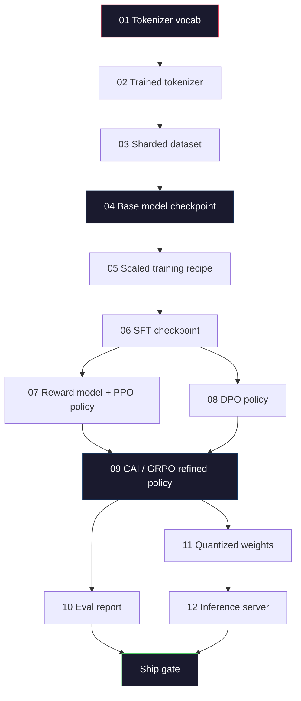
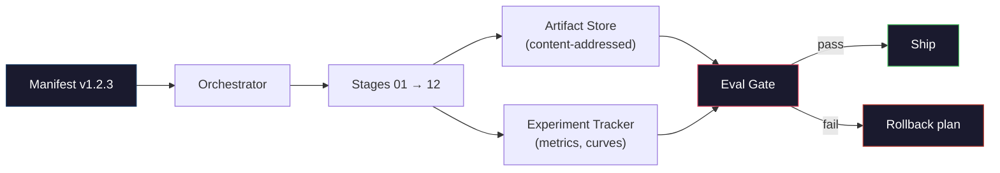

# 构建完整的大语言模型流水线

> 第 01～12 课讲解的每项内容，都只是同一条流水线中的一个阶段。本课提供脚手架，把这些阶段串成一次端到端运行：词元化、预训练、扩展、SFT、对齐、评估、量化、服务。你不会在笔记本电脑上训练 70B 模型，而会构建 2026 年前沿团队用来决定交付内容的编排层、清单、评测门禁与回滚方案。这是本阶段的收官项目。

**Type:** 构建
**Languages:** Python（标准库）
**Prerequisites:** 阶段 10 第 01～12 课全部内容
**Time:** 约 120 分钟

## 学习目标

- 把此前十一课（词元化器、数据、预训练、规模化、SFT、RLHF、DPO、CAI、评估、量化、推理）组合成一份可复现的流水线规范
- 定义阶段之间的制品契约：每个阶段消费什么、产出什么，以及下一阶段如何验证输入
- 构建编排器，用于跟踪实验、计算制品哈希，并依据评测阈值决定是否允许发布
- 设计回滚方案：区分哪些制品重跑成本低、哪些成本高，以及损坏的检查点会造成多大损失

## 问题

前面的课程各自都能工作：词元化器训练完成，微型 GPT 完成预训练，SFT 数据集已组装，奖励模型已训练，DPO 已运行，评测已完成，量化权重已导出，推理服务器也已启动。但每一项都是独立笔记本，各有自己的约定、输出路径和随机种子。

前沿训练任务不是笔记本。Llama 3 405B 在约 54 天内消耗了 3000 万 H100 GPU 小时；DeepSeek-V3 使用约 280 万 H800 GPU 小时。在此期间，一个损坏的检查点、一次数据污染或一项评测回归，都可能让团队损失一周实际时间和一个月 GPU 预算。团队靠流水线纪律规避这些风险：每个阶段都有确定的输入、确定的输出、清单、哈希和门禁。

这是收官项目。你不会在笔记本电脑上端到端运行这条流水线，而会编写协调各阶段的编排器、描述运行的清单、控制发布决策的验证器，以及让第三方通过单个文件重跑工作的复现方案。代码不多，纪律要求却很高。

从 100M 到 1T 参数，这套模式都保持不变。相同的四个组件——清单、编排器、评测门禁、制品存储——既用于 Llama 3，也用于你的业余 GPT。差别只是各阶段配置中的数字大小，而非流水线形状。

## 概念

### 十二个阶段

阶段 10 的每一课都是一个流水线阶段。完整依赖图如下。



阶段 07 与 08 可以并行运行，其他关系都是硬依赖。阶段 02（词元化器）发生变化，会让下游每项制品全部失效；阶段 10（评估）发生变化，则只会使发布决策失效。

### 清单

清单是一个文件，它对一次运行的描述足够完整，使该运行可以复现。流水线产出的任何内容，都不应依赖清单以外的状态。字段很普通，却缺一不可。

```
pipeline_version: 1.2.3
seed: 42
git_commit: a1b2c3d4
stages:
  01_tokenizer:
    recipe: bpe_32k
    input_hash: sha256:...
    output_hash: sha256:...
    wall_clock_sec: 3600
    cost_usd: 12
```

阶段 N 的输出哈希就是阶段 N+1 的输入哈希。任何偏差都会使流水线停止。这既能尽早发现数据损坏，也能让身处另一个大洲的同事确认，他们复现得到的制品与你的完全相同。

实践中，团队使用一份小型 YAML Schema，再用清单检查器与上次成功运行比较。除预期字段（成本、实际运行时间）之外的任何差异，都是危险信号。

### 制品类型

每个阶段都输出带类型的制品。它不是随意堆放的目录，也不是 Pickle，而是具有已知 Schema 的命名类型。

| 阶段 | 制品类型 | 关键字段 |
|-------|--------------|-----------|
| 01～02 | 词元化器 | vocab.json、merges.txt、config.json、哈希 |
| 03 | 数据集 | shards[]、行数、词元数、去重统计 |
| 04～05 | 检查点 | weights.safetensors、config.json、优化器状态、步数 |
| 06 | SFT 模型 | 检查点 + SFT 方案 + 数据配比 |
| 07 | 奖励模型 | RM 检查点 + 偏好数据哈希 |
| 08～09 | 策略 | 检查点 + 参考模型哈希 + beta + 已消耗 KL 预算 |
| 10 | 评测报告 | 基准分数 + 回归差异 + 评测数据哈希 |
| 11 | 量化模型 | 量化权重 + 校准数据 + 相对于 FP16 的准确率差值 |
| 12 | 服务规范 | 端点 + 模型哈希 + 配置 + 可观测性钩子 |

类型可以防止最常见的失效模式：把阶段 08 的输出当作阶段 06 的输入，把经过 DPO 训练的模型送入 SFT 路径。带类型的制品和阶段签名，会让此类错误在编译时失败，而不是到第五天才失败。

### 评测门禁

“训练完成”不等于“可以发布”。只有训练完成并通过评测门禁，才可以发布。门禁必须在运行开始前定义。

```
gates:
  mmlu:      >= baseline + 0.5   # no regression
  humaneval: >= baseline + 1.0
  truthfulqa: >= baseline         # no drop
  safety_refusal_rate: <= 0.05
  kl_from_reference: <= 25.0
  cost_total_usd: <= 50000
```

每项门禁都必须是数值阈值，不允许“看起来不错”式门禁，也不允许主观签署。全部门禁通过，制品才被标记为可发布。只要有一项失败，运行就会暂停，直到指定评审者明确批准覆盖，而且覆盖操作本身也会记录在清单中。

两项门禁可以捕获大多数灾难。*回归*门禁要求新模型在核心基准上至少不差于上一版，用于发现训练错误；*KL 预算*门禁要求对齐后的策略偏离参考模型不得超过 X，用于发现对齐过度。每条生产流水线都应同时具备两者。

### 编排器

编排器是一小段代码，负责读取清单、调度阶段、跟踪制品，并在任一契约违例时停止。它不是 Airflow，也不是 Kubeflow。流水线纪律需要的是你自己编写、朴素可靠的工具。

编排器的职责非常有限：

1. 根据清单解析 DAG。
2. 对每个阶段检查预期输出是否已经存在，并且哈希正确（若是则跳过）。
3. 运行阶段、捕获标准输出与标准错误，并测量实际耗时和成本。
4. 对照下游阶段的预期输入哈希，验证输出哈希。
5. 失败时写入部分清单，记录准确的失败阶段，并以非零状态退出。

这只需约 200 行 Python，看起来会像本课的 `code/main.py`。底层真实流水线使用 `torchrun` 或 `ray` 在集群上执行各阶段，但编排器本身运行在单台机器上。

### 实验跟踪与制品存储

两个外部系统负责锚定流水线。

**实验跟踪器（wandb、neptune、mlflow）。** 记录每个阶段的损失曲线、评测指标与系统遥测数据。三周后需要比较运行 A 和运行 B 时，应到跟踪器中查看。团队几乎总会使用托管式跟踪器——自行开发只会浪费本应投入训练的时间。

**制品存储（S3、R2、GCS）。** 用于保存检查点、数据集、词元化器和评测报告的不可变对象存储。制品按哈希而非文件名寻址。`latest.pt` 这样的文件名是陷阱；`ckpt-7b-step-20000-sha256:abc123.safetensors` 才是契约。

编排器会同时写入两者。跟踪器供人类查看图表，制品存储则供下一个阶段查找输入。

### 成本核算

前沿训练任务都有明确的美元数字。预算纪律体现在两个位置。

**运行前估算。** 根据清单计算预期 FLOP（预训练为 6 × 参数量 × 词元数）、预期 GPU 小时（FLOP / 峰值吞吐量 / 利用率），再按当前租用价格计算美元成本。如果估算超过预算门禁，流水线拒绝启动。

**运行中跟踪。** 把每个阶段的实际耗时与成本写入清单。每个阶段结束后，都要根据新的剩余预算进行检查。如果某个阶段超支，下一阶段会使用更新后的剩余预算评估门禁。不能等投资人打来电话时，才发现钱已经花光。

Llama 3 报告的成本为 6100 万美元，DeepSeek-V3 报告的主预训练成本为 560 万美元。差距主要来自硬件效率与混合专家架构——而我们之所以能看到这些具体数字，是因为两个团队都按阶段而非按整次运行跟踪成本。

### 可复现与确定性

两者不是一回事。*可复现*意味着同一份清单、同一份代码和同一套基础设施可以得到下游指标等价的检查点；*确定性*则意味着输出在位级完全相同。

现代大语言模型训练可以复现，但并不确定。分布式训练中的归约顺序、GPU 内核的不确定性（cuBLAS、flash-attn）与混合精度舍入共同作用，使不同运行中的浮点数在 1e-5 量级出现差异。只要最终指标不变，这没有问题；但如果试图用位级差异调试，它会带来灾难。解决办法是记录每个阶段的输入哈希、输出哈希与核心指标——即使权重并非逐位相同，只要这些指标吻合，也可以认为运行已经“复现”。



### 回滚方案

在运行开始前，就要写明每个阶段失败时如何处理。分为三类：

- **重跑成本低**（数小时）：词元化器、评估、量化、推理服务器。直接重跑。
- **中等**（数天）：SFT、DPO、CAI。保留基础模型，只重跑对齐阶段。
- **成本高昂**（数周、数百万美元）：预训练。此处的回滚方案不是“重跑”，而是“使用上一个良好检查点，再以修订后的数据重新运行成本较低的下游阶段”。

因为阶段依赖具有类型和哈希，编排器可以自动计算回滚集合：让失败阶段及其所有后代失效。阶段 06（SFT）失败会使 06、07、08、09、10、11、12 全部失效；阶段 11（量化）失败则只会使 11 与 12 失效。提前写清这一点，可以避免团队在凌晨 4 点精疲力竭时临场发挥。

### 2026 年观察到的生产方案

大多数前沿团队最终都采用了相同骨架。

- 词元化器：带字节回退的 128k BPE，在规模较小且均衡的多语言数据切片上训练。
- 预训练：10～20T 词元，以网页、代码和合成数据为主。采用 Muon 或 AdamW 优化器、FSDP2 或 DeepSpeed ZeRO-3、梯度检查点、BF16 权重和 FP32 主权重。
- SFT：50 万～200 万对指令数据，混合人类与合成样本，并与评测集严格去重。
- 对齐：DPO，或 CAI + GRPO。只有当偏好信号维度过多、DPO 无法表达时才使用 RLHF。
- 评估：MMLU-Pro、MATH、HumanEval+、GPQA、SWE-Bench Verified、LiveBench，再加一组从不公开的私有留出集。
- 量化：服务使用 4 位 GPTQ 或 AWQ；准确率差异至关重要的安全评估使用 8 位。
- 服务：vLLM、TensorRT-LLM 或自研方案。连续批处理、推测解码、KV 缓存淘汰。

具体数字每六个月都会变化，骨架不会。

```figure
beam-search
```

## 动手构建

本课代码是编排器与清单检查器，而不是十二个训练脚本。每个阶段都用占位实现模拟，生成具有正确形状与哈希的输出制品。在真正花费 GPU 预算运行各阶段之前，先端到端运行编排器，以证明流水线管道正确。

完整实现见 `code/main.py`。关键组成部分包括：

- `Manifest` 数据类：流水线版本、随机种子、Git 提交、阶段和门禁。
- `Stage` 数据类：名称、类型、输入（哈希）、输出（哈希）、实际耗时、成本。
- `Orchestrator.run()`：解析 DAG、调度阶段、验证哈希、更新清单。
- `EvalGate.check()`：读取阈值，与最新评测报告比较，返回通过/失败。
- `ArtifactStore`（内存存根）：按哈希存取，模拟 S3。
- `CostTracker`：跟踪逐阶段与累计成本，超过上限时停止。

`main.py` 中的流水线会运行十二个占位阶段，生成一份清单，并刻意触发一次失败的评测门禁，展示一次被暂停的运行。将每个占位实现替换为相应课程中的真实训练脚本，就得到了真实前沿流水线所用的骨架。

## 学以致用

规范工作流只有三条命令。

```
python code/main.py plan    # validate manifest, compute cost estimate, print DAG
python code/main.py run     # execute stages, writing to manifest.out.yaml
python code/main.py gate    # read manifest.out.yaml, apply eval gates, ship-or-hold
```

每次都应先运行 `plan`。多数流水线问题会在规划阶段暴露——门禁阈值缺失、哈希陈旧、预算超支。运行 `plan` 不花钱，运行 `run` 却很昂贵；应在低成本一侧发现错误。

`gate` 的输出只能是 `SHIP` 或 `HOLD: <reason>`。暂停的运行不是失败，而是一个决策点。指定评审者要么覆盖门禁（并把覆盖记录到清单），要么批准回滚。

## 交付成果

本课会生成 `outputs/skill-llm-pipeline-reviewer.md`。向它提供一份拟议的流水线清单，它会检查全部契约：阶段类型、哈希链、门禁、回滚方案与成本估算。缺少评测门禁、KL 预算无上限，或混用评测与训练数据的清单，都不会获得批准。

## 练习

1. 扩展编排器，使阶段 07 与 08 可以并行执行。使用标准库 `concurrent.futures` 模块。确认最终清单记录了两个阶段的输出，而且阶段 09 的输入哈希是二者的确定性组合。

2. 添加“污染检查”门禁。给定评测数据集哈希和训练数据分片，计算重叠程度（精确字符串匹配或 13-gram 匹配）。如果重叠超过 0.1%，门禁就失败。向它输入一份受污染的训练集，确认门禁会暂停运行。

3. 从第一性原理实现成本估算器。对阶段 04（预训练），以 6 × 参数量 × 词元数估算 FLOP，假定 H100 的 BF16 算力为 989 TFLOPS、MFU（模型 FLOP 利用率）为 40%、每 GPU 小时 2.50 美元。报告 7B 模型在 2T 词元上训练的估算值，并与公开的 Llama 2 数据比较。

4. 构建局部回滚。模拟阶段 09（CAI）失败，然后只重跑阶段 09～12，保留缓存中的阶段 01～08。编排器应根据哈希发现缓存制品并跳过它们。测量相对于完整重跑节省的实际时间。

5. 添加可观测性。为每个阶段发出 OpenTelemetry Span，并附加参数量、已处理词元数、损失和成本属性。把 Span 发送到本地收集器。重点不在仪表盘，而在于每个阶段的健康状态都可通过同一个 Trace ID 追踪。

## 关键术语

| 术语 | 人们通常怎么说 | 实际含义 |
|------|----------------|----------------------|
| 清单 | “配方文件” | 描述流水线版本、随机种子、逐阶段配置与门禁阈值的 YAML 或 JSON，信息足以复现一次运行 |
| 内容寻址 | “按哈希而非名称” | 以内容的 SHA-256 存储制品，因此永远不会混淆版本 A 与版本 B |
| 评测门禁 | “发布标准” | 制品标记为可发布前必须通过的基准指标与安全分数数值阈值 |
| KL 预算 | “对齐偏离了多远” | 对齐阶段相对于参考模型的累计 KL(policy \\|\\| reference) 上限，作为门禁强制执行 |
| MFU | “GPU 用了多少” | 模型 FLOP 利用率——实际 FLOP 除以理论峰值；70B 规模通常为 40%，7B 为 55% |
| 回滚方案 | “出错时怎么办” | 针对各阶段预先写好的失败处理操作：重跑、回退、使用修订输入重新训练 |
| 编排器 | “指挥者” | 读取清单、调度阶段、验证哈希，并在任意契约违例时停止的进程 |
| 制品存储 | “权重的版本化 S3” | 不可变、按内容寻址的对象存储——检查点、数据集与评测报告的唯一事实来源 |
| 可复现 | “重跑时指标相同” | 权重在位级可能不同，但下游指标等价——分布式大语言模型训练的现实目标 |
| 成本门禁 | “不得超过 X” | 运行前成本估算 + 运行中跟踪器——估算超出预算时，流水线拒绝启动 |

## 延伸阅读

- [Dubey 等，2024——“Llama 3 模型群”](https://arxiv.org/abs/2407.21783)——最详细的公开前沿流水线说明之一，涵盖数据、训练、对齐与评估
- [DeepSeek-AI，2024——“DeepSeek-V3 技术报告”](https://arxiv.org/abs/2412.19437)——效率优先的流水线，成本约为 Llama 3 同级训练的十分之一
- [Kaplan 等，2020——“神经语言模型的缩放定律”](https://arxiv.org/abs/2001.08361)——最初的计算-数据-参数缩放关系
- [Hoffmann 等，2022——“训练计算最优的大语言模型（Chinchilla）”](https://arxiv.org/abs/2203.15556)——重新校准现代数据预算的 Kaplan 修正
- [PyTorch FSDP2 文档](https://pytorch.org/docs/stable/fsdp.html)——PyTorch 2.4+ 中取代 FSDP1 的分布式训练原语
- [Weights & Biases 大语言模型报告](https://wandb.ai/site/llms)——开放大语言模型运行的真实清单与实验跟踪器输出，可作为实用模板参考
