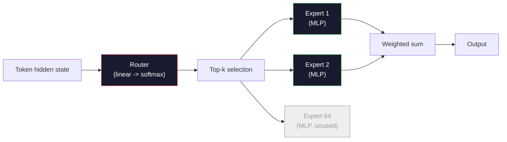

# 开放模型：架构剖析

> 你在第 04 课从零构建了 GPT-2 Small。2026 年的前沿开放模型仍属于同一家族，只做了五六项具体改动：用 RMSNorm 取代 LayerNorm，用 SwiGLU 取代 GELU，用 RoPE 取代学习式位置编码，用 GQA 或 MLA 取代完整 MHA，并在大规模模型中采用混合专家。你已经掌握的数学足以解释其中 95% 的内容。本课会并列剖析 Llama 3、DeepSeek-V3、Mixtral、Qwen 与 Gemma，并明确指出每种架构究竟从哪一行开始分叉。

**Type:** 学习
**Languages:** Python（标准库）
**Prerequisites:** 阶段 10 第 04、05、12 课（预训练、规模化、推理）
**Time:** 约 45 分钟

## 学习目标

- 阅读 Llama 3、Mistral、Mixtral、Gemma 2、Qwen 2.5 与 DeepSeek-V3 的 config.json，并解释其中每个字段
- 明确指出每个模型相对于 GPT-2 Small 所做的架构改动，并从第一性原理说明原因
- 仅根据配置计算任意开放模型的参数量、KV 缓存大小与激活内存
- 根据延迟、内存与能力约束，为部署目标选择合适的开放模型

## 问题

第 04 课中，你用 350 行 numpy 写出了一个 GPT-2 形态的模型。Llama 3 405B 则有一份 200 页的技术报告。你的直觉可能认为二者是截然不同的庞然大物，其实并非如此。这 200 页描述的仍是同一个对象，只进行了五六项动机明确的修改，再加上约一千项与规模化有关的实现细节。它的骨架——嵌入、Transformer 块、注意力、MLP、归一化与输出头——没有改变。

本课就是一份差异对比。对于每个主流开放模型家族，我们都会准确列出它相对于 GPT-2 改了什么、为什么改，以及付出了什么代价。完成后，你将能够阅读一个新模型卡，并在脑中把它还原到 GPT-2 基线。

实际收益在于，当 Meta 发布 Llama 5 或 DeepSeek 发布 V4 时，你无须重新建立一套心智模型。只需查看配置，识别哪些熟悉的旋钮发生了变化，就能理解下游影响。2026 年的架构来自一套有限工具箱，每个新模型只是选择了不同子集。

## 概念

### 不变的核心

所有自回归开放模型都包含：

- 词元嵌入矩阵（vocab_size × hidden_dim）。
- N 个解码器块组成的堆栈：归一化、自注意力、残差、归一化、MLP、残差。
- 最终归一化，以及投影到 vocab_size 的线性头（通常与嵌入绑定权重）。
- 因果掩码与下一词元交叉熵损失。

这就是固定结构，其余都只是旋钮。

### 真正发生变化的六个旋钮

纵观 2024～2026 年的所有前沿开放模型，反复调整的始终是以下六项设计选择：

1. **归一化。** LayerNorm → RMSNorm。
2. **位置编码。** 学习式绝对位置 → RoPE（及其 YaRN、NTK 等变体）。
3. **激活函数。** GELU → SwiGLU（或 GeGLU）。
4. **注意力头共享。** MHA → GQA → MQA → MLA。
5. **稠密与稀疏 MLP。** 稠密 → 混合专家。
6. **预归一化位置。** 继续使用预归一化，后归一化已经退出舞台。

其余内容（学习率调度、数据配比、批大小、上下文长度）属于训练配置，而不是架构。真正的旋钮只有六个。

### 旋钮 1：RMSNorm

LayerNorm 会减去均值、除以标准差，再执行缩放和平移。RMSNorm 只保留缩放：

```
RMSNorm(x) = x / sqrt(mean(x^2) + eps) * gamma
```

不减均值，也没有偏置，每个词元少做一次矩阵运算。Zhang 与 Sennrich（2019）证明，它在机器翻译上可达到与 LayerNorm 相当的效果，同时快 10%。所有现代开放模型都采用它。

代价：无。收益：吞吐量小幅提高，代码更简单。

### 旋钮 2：RoPE

GPT-2 的学习式位置嵌入是一张包含 1024 个槽位的查找表。位置 1025 已经超出表尾，模型无法外推到训练长度以外。

旋转位置嵌入（RoPE，Su 等，2021）在执行注意力点积之前，将每个 Q 与 K 向量按二维分组旋转，从而注入位置信息。旋转角度是位置的确定性函数，因此没有需要学习的参数，也不会耗尽位置。借助缩放技巧（NTK 感知插值、YaRN），在 8k 上下文训练的模型可以在推理时扩展至 128k，而准确率只会轻微下降。

```
q_rotated = rotate(q, angle(pos))
k_rotated = rotate(k, angle(pos))
score = q_rotated . k_rotated
```

Llama、Mistral、Qwen、DeepSeek 与 Gemma 全都使用 RoPE。Gemma 2 采用混合方案：多数层使用 RoPE，其他层使用局部滑动窗口注意力。

### 旋钮 3：SwiGLU

GPT-2 的 MLP 为 `x -> gelu(xW1 + b1) -> (...)W2 + b2`。SwiGLU（Shazeer，2020）把激活函数替换为门控乘积：

```
SwiGLU(x) = (xW1) * sigmoid(xW1) * xV
```

它并行执行两个投影，再由 Swish 激活进行门控。实证表明，在参数量相同时，它能得到更好的困惑度。Llama 2 采用后，其他模型纷纷跟进。MLP 隐藏层大小通常设为让总参数量与原稠密 MLP 相同：若 GPT-2 使用 `ff_dim = 4 * hidden`，SwiGLU 就使用 `ff_dim = (2/3) * 4 * hidden = 8/3 * hidden`。

### 旋钮 4：注意力头共享

GPT-2 使用**多头注意力（MHA）**：每个头都有自己的 Q、K、V 投影。

**多查询注意力（MQA，Shazeer，2019）**让所有头共享一组 K 和 V。KV 缓存会缩小 num_heads 倍，对典型模型而言就是缩小 12～32 倍，代价是困难基准上的准确率略有下降。

**分组查询注意力（GQA，Ainslie 等，2023）**取中间路线：G 组 Q 头各共享一组 K 与 V。Llama 3 8B 使用 32 个 Q 头、8 个 KV 头（G=8）的 GQA，因此 KV 缓存相对于完整 MHA 缩小 4 倍。

**多头潜在注意力（MLA，DeepSeek，2024）**把 K 与 V 压缩到共享的低秩潜变量中，再为每个头向上投影。它在保留逐头表达能力的同时，进一步缩小 KV 缓存。DeepSeek-V2 与 V3 的长上下文性能依赖这一机制。

| 方案 | KV 头 | KV 缓存 | 准确率 |
|--------|----------|----------|----------|
| MHA | num_heads | 完整 | 最佳 |
| GQA | num_groups（G < num_heads） | 缩小 num_heads / G 倍 | 接近 MHA |
| MQA | 1 | 缩小 num_heads 倍 | 略有损失 |
| MLA | 潜变量、逐头解压缩 | 小于 MQA | 接近 MHA |

对于约 13B 参数以上的任何模型，GQA 或 MLA 实际上都是必需的。在这种规模上使用完整 MHA，会造成 KV 缓存灾难。

### 旋钮 5：混合专家

稠密 MLP 会为每个词元激活全部参数。MoE MLP 在每个块中拥有 K 个专家，并由路由器为每个词元选择 top-k 个专家（通常为 top-2）。只有被选专家的权重会为该词元执行前向传播。

```
router_logits = xW_r
indices, weights = top_k(router_logits, k=2)
output = sum_i weights[i] * expert[indices[i]](x)
```

吸引力在于：你可以拥有 64 个各为 7B 大小的专家（因此总参数量极大），每个词元却只运行其中 2 个（因此逐词元计算量与稠密 7B 模型相当）。Mixtral 8x7B 总参数量为 47B，每个词元只激活 13B；DeepSeek-V3 总参数量为 671B，每个词元只激活 37B。



优点是计算量相同、参数更多、容量更强。缺点是专家权重仍必须存放在某处（所以服务所需显存高于计算量相当的稠密模型），路由器负载均衡很困难，而且在对齐期间微调路由器本身就是一个研究课题。

### 旋钮 6：预归一化继续保留

原始 Transformer 在每个子层之后应用层归一化。GPT-2 以来的每个开放模型都把它放在每个子层*之前*。预归一化在深层模型中严格来说更容易训练，无须争论。

### 逐模型差异

下面这张表把所有差异具体列出。

| 模型 | 年份 | 总参数量 | 活跃参数量 | 归一化 | 激活函数 | 位置编码 | 注意力 | MoE | 上下文 |
|-------|------|-------------|---------------|------|-----------|----------|-----------|-----|---------|
| GPT-2 Small | 2019 | 124M | 124M | LayerNorm | GELU | 学习式 | MHA（12 个头） | 否 | 1k |
| Llama 3 8B | 2024 | 8B | 8B | RMSNorm | SwiGLU | RoPE | GQA（32/8） | 否 | 128k |
| Llama 3 70B | 2024 | 70B | 70B | RMSNorm | SwiGLU | RoPE | GQA（64/8） | 否 | 128k |
| Llama 3 405B | 2024 | 405B | 405B | RMSNorm | SwiGLU | RoPE | GQA（128/16） | 否 | 128k |
| Mistral 7B | 2023 | 7.2B | 7.2B | RMSNorm | SwiGLU | RoPE | GQA | 否 | 32k |
| Mixtral 8x7B | 2023 | 47B | 13B | RMSNorm | SwiGLU | RoPE | GQA | 是（8 个专家，top-2） | 32k |
| Gemma 2 9B | 2024 | 9B | 9B | RMSNorm（前置+后置） | GeGLU | RoPE + 滑动窗口 | GQA | 否 | 8k |
| Qwen 2.5 72B | 2024 | 72B | 72B | RMSNorm | SwiGLU | RoPE（YaRN） | GQA（64/8） | 否 | 128k |
| DeepSeek V2 236B | 2024 | 236B | 21B | RMSNorm | SwiGLU | RoPE | MLA | 是（160 个专家，top-6） | 128k |
| DeepSeek V3 | 2024 | 671B | 37B | RMSNorm | SwiGLU | RoPE | MLA | 是（256 个专家，top-8） | 128k |

逐列查看即可发现：RMSNorm 无处不在；SwiGLU 或近亲 GeGLU 无处不在；RoPE 无处不在；7B 以上模型普遍采用 GQA，除非用 MLA 取代它；在顶级规模上，MoE 才是主要差异。

### 阅读 config.json

Llama 3 8B 的配置如下：

```
{
  "hidden_size": 4096,
  "intermediate_size": 14336,
  "num_hidden_layers": 32,
  "num_attention_heads": 32,
  "num_key_value_heads": 8,
  "max_position_embeddings": 131072,
  "rope_theta": 500000.0,
  "rms_norm_eps": 1e-5,
  "vocab_size": 128256
}
```

每个字段都对应你已经实现过的概念。

- `hidden_size`：嵌入维度。
- `intermediate_size`：MLP 隐藏层大小（是 hidden 的 3.5 倍——由 SwiGLU 数学决定）。
- `num_hidden_layers`：堆栈深度。
- `num_attention_heads`：Q 头数量。
- `num_key_value_heads`：KV 头数量（GQA）。
- `max_position_embeddings`：训练上下文长度。
- `rope_theta`：RoPE 基频。Meta 为实现长上下文外推，将其从默认的 10k 提高到 500k。
- `rms_norm_eps`：数值稳定项。
- `vocab_size`：词元数量。

只根据这些字段，就能计算总参数量、KV 缓存和峰值激活内存。确切公式见 `code/main.py`。

### 激活内存预算

模型超过数十亿参数后，激活值会主导训练内存。预训练（使用梯度检查点）的大致计算规则为：

```
activation_mem ~ batch_size * seq_len * hidden_size * num_layers * bytes_per_element
```

对于批大小为 1、序列长度为 8192、隐藏维度为 4096、共 32 层且使用 BF16 的 Llama 3 8B：即使启用检查点，仅激活值也约占 8 GB；不启用时则为 40 GB。这正是 Flash Attention 与环形注意力很重要的原因——它们会重写注意力计算，使激活值能够装入内存。

### KV 缓存预算

最大上下文推理时：

```
kv_cache = 2 * num_layers * num_kv_heads * head_dim * max_seq_len * bytes_per_element
```

Llama 3 8B 在 128k 上下文、BF16、head_dim = hidden / num_heads = 128 时：
`2 * 32 * 8 * 128 * 131072 * 2 = 17.2 GB`，这是每条序列的占用。

8B 权重在 BF16 下占 16 GB。单条 128k 序列的 KV 缓存比权重还大。这种内存压力推动了 GQA、MLA 与 KV 缓存量化研究。

### 每种模型适合什么场景

- **单张 80GB GPU，不使用 MoE：** Llama 3 8B、Mistral 7B、Gemma 2 9B。易于服务，工具生态广泛。
- **单节点（8×80GB），需要大容量：** Llama 3 70B、Qwen 2.5 72B。能力最强的开放稠密模型。
- **追求最强开放能力，接受 MoE 复杂性：** DeepSeek V3、Mixtral 8x22B。每活跃 FLOP 对应的能力最佳。
- **需要长上下文：** Llama 3（通过 RoPE 缩放达到 128k）、DeepSeek（MLA 优势）。
- **低延迟服务：** Gemma 2 9B（滑动窗口降低长上下文计算量）。

```figure
rmsnorm-vs-layernorm
```

## 动手构建

本课代码是一个计算器。给定任意 config.json，它会打印各组件参数量、最大上下文下的 KV 缓存、SwiGLU MLP 比率，以及对架构的简短判断（稠密/GQA/MLA/MoE）。

```python
config = {
    "hidden_size": 4096, "intermediate_size": 14336,
    "num_hidden_layers": 32, "num_attention_heads": 32,
    "num_key_value_heads": 8, "vocab_size": 128256,
    "max_position_embeddings": 131072,
}
```

脚本逐字段遍历架构，计算嵌入、注意力（包含 GQA 缩减）、MLP（包含 SwiGLU 扩展）、层归一化与输出头的参数量。随后，它按配置中的上下文长度计算 KV 缓存并打印摘要。

实现见 `code/main.py`。

## 学以致用

用脚本计算其中内置的 Llama 3 8B、Mistral 7B、Mixtral 8x7B 与 DeepSeek V3 配置，并比较参数构成。注意：MoE 模型的总参数量远大于稠密模型，活跃参数量却往往更少。还应观察到，DeepSeek V3 的总参数量虽高于 Llama 3 405B，KV 缓存却更小——这就是 MLA 的作用。

然后填入你本地任意模型的配置，阅读摘要，并判断它能否装入 GPU。

## 交付成果

本课会生成 `outputs/skill-open-model-picker.md`。给定部署目标（GPU 类型、显存、上下文长度、延迟预算）与任务特征（聊天、代码、推理、长上下文），它会推荐开放模型、第 11 课的量化方案和第 12 课的推理技术栈，并明确说明六个架构旋钮上的取舍。

## 练习

1. 从 HuggingFace 读取 Qwen 2.5 72B 的配置，从零计算总参数量。与 Hugging Face 报告的数值比较，并找出差异来源（头维度取整、KV 共享因子等）。

2. DeepSeek V3 使用 256 个专家，每个词元路由到 top-8。计算活跃专家数与专家总数的比例，再与 Mixtral 8x7B 的 8 选 2 比较。从稀疏度为 25% 变为稀疏度为 3%，对每 FLOP 容量意味着什么？

3. 计算 Llama 3 405B 在 128k 上下文下分别使用 FP8 与 BF16 时的 KV 缓存大小。FP8 是 BF16 的一半。单个 8×H100 节点（每张 80GB，共 640GB）扣除权重内存后，可以并行服务多少条序列？

4. Gemma 2 交替使用完整注意力层与滑动窗口注意力层。写出一半层使用 4096 词元滑动窗口、而非完整上下文时的 KV 缓存计算公式。在总上下文为 8k 时能节省多少内存？

5. 找一个在本课写成后发布的新前沿开放模型。识别它选择了六个旋钮中的哪些，以及是否引入了第七个旋钮。新架构一发布，课程就会显得过时——目标是更新你的表格，而不是重建整套心智模型。

## 关键术语

| 术语 | 人们通常怎么说 | 实际含义 |
|------|----------------|----------------------|
| RMSNorm | “不减均值的 LayerNorm” | 只按均方根归一化，并使用可学习缩放——成本更低，效果与 LayerNorm 相当 |
| RoPE | “旋转位置” | 根据位置决定的角度，将每个 Q、K 向量按二维分组旋转——通过缩放技巧可以外推到训练长度之外 |
| SwiGLU | “新的 MLP 激活函数” | 使用 Swish 的门控线性单元：`(xW1) * sigmoid(xW1) * xV`——所有 2024 年之后开放模型的标准配置 |
| GQA | “折中的注意力” | 分组查询注意力：G 组 Q 头共享一个 K 头与一个 V 头——缩小 KV 缓存，却不承受 MQA 的准确率损失 |
| MLA | “DeepSeek 的注意力” | 多头潜在注意力：把 K/V 压缩为共享低秩潜变量，再为每个头解压缩——大型模型中最小的 KV 缓存 |
| MoE | “稀疏专家” | 混合专家：每个块有 N 个 MLP，路由器为每个词元选择 top-k——总参数量巨大，活跃参数量较小 |
| Top-k 路由 | “每个词元选择 k 个专家” | 路由器为每个专家计算分数，并激活得分最高的 k 个——典型 k 从 2（Mixtral）到 8（DeepSeek） |
| YaRN | “拉伸 RoPE” | Yet another RoPE extension——插值旋转角度，在推理时把上下文从 8k 扩展至 128k 以上 |
| 滑动窗口注意力 | “不要关注所有内容” | 每个词元只关注最近 W 个词元——将逐词元注意力成本限制为 O(W)，Gemma 2 与早期 Mistral 均采用 |
| 活跃参数 | “每个词元实际运行的参数” | 对 MoE 模型而言，每个词元执行前向传播所涉及的参数量（远小于总参数量）——决定逐词元 FLOP |

## 延伸阅读

- [Dubey 等，2024——“Llama 3 模型群”](https://arxiv.org/abs/2407.21783)——稠密 Llama 3 家族的架构与训练参考
- [DeepSeek-AI，2024——“DeepSeek-V3 技术报告”](https://arxiv.org/abs/2412.19437)——MLA、无辅助损失负载均衡与 671B MoE
- [Jiang 等，2024——“Mixtral of Experts”](https://arxiv.org/abs/2401.04088)——典型开放 MoE 模型论文
- [Su 等，2021——“RoFormer：使用旋转位置嵌入增强 Transformer”](https://arxiv.org/abs/2104.09864)——RoPE 论文
- [Shazeer，2020——“GLU 变体改进 Transformer”](https://arxiv.org/abs/2002.05202)——SwiGLU、GeGLU 及相关变体
- [Ainslie 等，2023——“GQA：训练广义多查询 Transformer 模型”](https://arxiv.org/abs/2305.13245)——GQA 论文
- [Gemma 2 团队，2024——“Gemma 2：改进实用规模的开放语言模型”](https://arxiv.org/abs/2408.00118)——混合完整/滑动注意力、前置/后置归一化
- [Qwen 团队，2024——“Qwen 2.5 技术报告”](https://arxiv.org/abs/2412.15115)——YaRN 上下文扩展与长上下文训练方案
