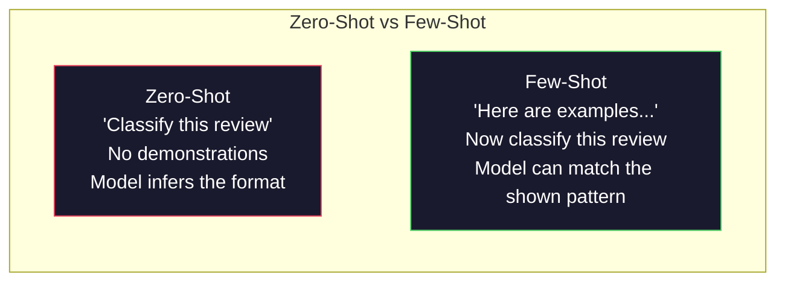
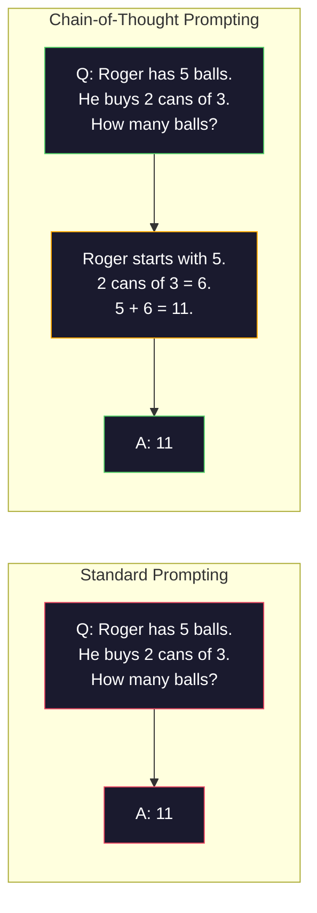
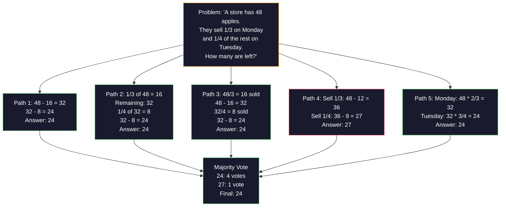
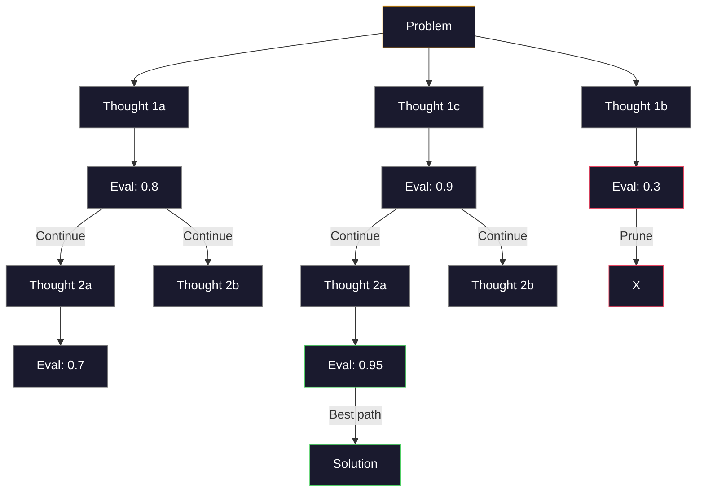
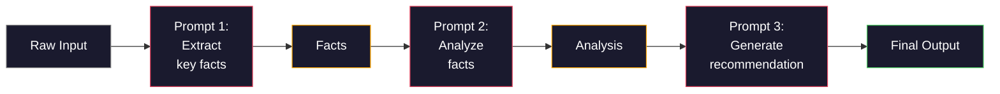

# 少样本、思维链与思维树

> 告诉模型做什么，只是提示；向它展示如何推理，才是工程。应在自己的工作负载上衡量每种提示策略，而不是依赖未经验证的醒目准确率数字。

**Type:** 构建
**Languages:** Python
**Prerequisites:** 阶段 11 第 01 课（提示工程）
**Time:** 约 45 分钟

## 学习目标

- 选择并格式化能够最大化任务准确率的示例，实施少样本提示
- 使用思维链（CoT）推理，提高数学应用题等多步问题的准确率
- 构建思维树提示，探索多条推理路径并选出最佳路径
- 在标准基准上测量零样本、少样本与 CoT 的准确率提升

## 问题

假设你要构建一个数学辅导应用，提示词写的是：“解答这道应用题。”直接回答在多步问题上的表现并不稳定，因此你需要在留出集上，将这一基线与显式推理指令以及少量带完整解法的示例进行比较。这些变体使用相同的模型权重，却可能产生显著不同的行为。

只需加上五个单词——“Let's think step by step”——模型就会把中间过程外化出来；再加入几个带完整解法的示例，它还可以看到你所期望的推理和答案格式。准确率变化的大小乃至方向都取决于模型、提示词、解码设置和任务，因此应当实际测量，而不是照搬一个醒目的基准数字。

这不是技巧，而是推理本来的工作方式。人类不会只靠一次思维跳跃解决多步问题，Transformer 也不会。当你要求模型生成中间词元时，这些词元会成为下一个词元的上下文。每个推理步骤都为下一步提供输入，模型确实是在一步步计算出答案。

但“逐步思考”只是起点，不是终点。如果采样五条推理路径，再对最终答案进行多数投票呢？如果让模型探索一棵可能性树，边评估边剪枝呢？如果把推理与工具使用交错起来呢？这些都不是假设，而是有实测改进的已发表技术。本课会逐一构建。

## 概念

### 零样本与少样本：示例何时胜过指令

零样本提示只给模型任务，不提供任何其他内容；少样本提示则先提供示例。

当示例能够表达指令中未充分说明的格式、标签边界或推理模式时，少样本提示可能有所帮助。如果示例不相关、具有误导性，或只是占用上下文而没有提供有效信号，它也可能损害效果。应把零样本作为基线，测量特定示例集是否确实有助于目标任务。

直觉是：示例就是压缩后的指令。与其描述输出格式，不如直接展示；与其解释推理过程，不如实际演示。相比解释抽象指令，模型对示例进行模式匹配更加可靠。



**少样本更占优的场景：** 对格式敏感的任务、分类、结构化提取、领域专用术语，以及任何需要模型匹配特定模式的任务。

**零样本更占优的场景：** 简单事实问题、示例会限制创造力的创意任务，以及找到好示例比写清指令更困难的任务。

### 示例选择：相似优于随机

并非所有示例都同等有效。在分类任务上，选择与目标输入相似的示例可能优于随机选择（Liu 等，2022）。有三条原则：

1. **语义相似性：** 选择嵌入空间中最接近输入的示例
2. **标签多样性：** 示例应覆盖所有输出类别
3. **难度匹配：** 让示例的复杂程度与目标问题相当

不存在普遍适用的最佳示例数量。先从能够展示所需标签和边界情况的最小多样化示例集开始，再随着示例增加测量留出集上的质量；当边际收益不足以抵偿上下文成本时，就停止增加。

### 思维链：给模型一张草稿纸

思维链（CoT）提示由 Google Brain 的 Wei 等人于 2022 年提出。思想很简单：不要只要求模型给出答案，而要让它先展示推理步骤。



它为什么能从机制上奏效？Transformer 生成的每个词元都会成为下一个词元的上下文。没有 CoT 时，模型必须在单次前向传播的隐藏状态中压缩全部推理；使用 CoT 后，模型会把中间计算外化为词元。每个推理词元都会延长有效计算深度。

**正确解读基准证据。** Wei 等人（2022）在特定模型和基准配置上，使用带完整解法的示例评估了少样本 CoT。Kojima 等人（2022）则在算术、常识和符号推理任务上评估了零样本 CoT。这些受控实验表明相应提示模式可能有效，但并不能为 GPT-4o 或 GPT-5 等较新的模型提供一张可以直接复用的准确率表。自行比较这些变体时，应记录模型快照、确切提示词、解码设置和数据集划分。

**关于推理模型。** 一些供应商提供会在输出答案前分配内部推理过程的模型。应遵循供应商当前的提示指南，并同时对简洁指令和显式示例进行基准测试；对某个模型快照有效的短语，在另一个模型快照上可能没有效果，甚至适得其反。

CoT 有两种形式：

**零样本 CoT：** 在提示词末尾加入“Let's think step by step”，不需要示例。Kojima 等人（2022）证明，仅这一句话就能提高算术、常识与符号推理任务的准确率。

**少样本 CoT：** 提供包含推理步骤的示例。它比零样本 CoT 更有效，因为模型可以看到你期望的确切推理格式。

**CoT 适得其反的场景：** 简单事实回忆（“法国的首都是哪里？”）、单步分类，以及速度比准确率更重要的任务。CoT 会增加推理词元和延迟；对于高吞吐、低复杂度任务，这可能是不必要的成本。

### 自洽性：多次采样，一次投票

Wang 等人（2023）提出自洽性。其洞见是：单条 CoT 路径可能包含推理错误；但如果以大于 0 的温度采样 N 条独立推理路径，再对最终答案进行多数投票，错误就会相互抵消。



在原始自洽性论文中，PaLM 540B 在 GSM8K 上的准确率从采用贪心思维链解码时的 56.5% 提高到了采用自洽性时的 74.4%。这些数字描述的是该论文所使用的模型、提示词和解码设置，并不保证较新的模型也能获得同样的提升。只有当独立采样的路径具有多样性，且错误不是系统性的时，自洽性才会有所帮助，因此应在目标工作负载上测量实际收益。

代价是：N 个样本大约需要 N 次生成所对应的推理工作量，不过相互独立的样本可以并行生成。使用简单多数投票时应选择奇数个样本；先从较小的样本数开始，只有在实测质量收益足以证明成本合理时才继续增加。

### 思维树：分支式探索

Yao 等人（2023）提出思维树（ToT）。CoT 只沿一条线性推理路径前进，而 ToT 会探索多个分支，在继续前评估哪些分支最有希望。



ToT 包含三个组成部分：

1. **思路生成：** 产生多个候选下一步
2. **状态评估：** 为每个候选评分（可以让大语言模型自身担任评估器）
3. **搜索算法：** 通过 BFS 或 DFS 搜索树，并剪除低分分支

在“24 点”任务中（用算术运算组合 4 个数字得到 24），GPT-4 使用标准提示时只能解决 7.3% 的问题；使用 CoT 时为 4.0%（CoT 在这里反而有害，因为搜索空间很宽）；使用 ToT 时则达到 74%。

ToT 成本很高，树中的每个节点都需要一次大语言模型调用。分支因子为 3、深度为 3 的树最多需要 39 次调用。只应把它用于搜索空间较大但可以评估的问题，例如规划、谜题求解和受约束的创意问题。

### ReAct：思考 + 行动

Yao 等人（2022）把推理轨迹与行动结合起来。模型在思考（生成推理）与行动（调用工具、搜索、计算）之间交替。

```mermaid
graph LR
    Q["Question:\nWhat is the\npopulation of the\ncountry where\nthe Eiffel Tower\nis located?"]
    T1["Thought: I need to\nfind which country\nhas the Eiffel Tower"]
    A1["Action: search\n'Eiffel Tower location'"]
    O1["Observation:\nParis, France"]
    T2["Thought: Now I need\nFrance's population"]
    A2["Action: search\n'France population 2024'"]
    O2["Observation:\n68.4 million"]
    T3["Thought: I have\nthe answer"]
    F["Answer:\n68.4 million"]

    Q --> T1 --> A1 --> O1 --> T2 --> A2 --> O2 --> T3 --> F

    style Q fill:#1a1a2e,stroke:#ffa500,color:#fff
    style T1 fill:#1a1a2e,stroke:#51cf66,color:#fff
    style A1 fill:#1a1a2e,stroke:#e94560,color:#fff
    style O1 fill:#1a1a2e,stroke:#808080,color:#fff
    style T2 fill:#1a1a2e,stroke:#51cf66,color:#fff
    style A2 fill:#1a1a2e,stroke:#e94560,color:#fff
    style O2 fill:#1a1a2e,stroke:#808080,color:#fff
    style T3 fill:#1a1a2e,stroke:#51cf66,color:#fff
    style F fill:#1a1a2e,stroke:#51cf66,color:#fff
```



ReAct 在知识密集型任务上可能优于纯 CoT，因为它用外部观测为推理提供依据。具体结果取决于模型、提示词、工具和基准设置；应在目标工作负载上测量任务成功率和工具使用错误。它的实际优势在于，观测可以纠正推理路径，使模型能够在执行过程中更新计划。

ReAct 是现代 AI 智能体的基础。每种智能体框架（LangChain、CrewAI、AutoGen）都会实现某种“思考-行动-观测”循环。阶段 14 将构建完整智能体，本课只介绍提示模式。

### 结构化提示：XML 标签、分隔符与标题

随着提示词变得复杂，结构可以防止模型混淆不同部分。常见方法有三种：

**XML 标签**（Claude 上效果最佳，在其他模型上也很稳）：
```
<context>
You are reviewing a pull request.
The codebase uses TypeScript and React.
</context>

<task>
Review the following diff for bugs, security issues, and style violations.
</task>

<diff>
{diff_content}
</diff>

<output_format>
List each issue with: file, line, severity (critical/warning/info), description.
</output_format>
```

**Markdown 标题**（通用）：
```
## Role
Senior security engineer at a fintech company.

## Task
Analyze this API endpoint for vulnerabilities.

## Input
{api_code}

## Rules
- Focus on OWASP Top 10
- Rate each finding: critical, high, medium, low
- Include remediation steps
```

**分隔符**（简洁而有效）：
```
---INPUT---
{user_text}
---END INPUT---

---INSTRUCTIONS---
Summarize the above in 3 bullet points.
---END INSTRUCTIONS---
```

### 提示链：顺序分解

有些任务过于复杂，无法用单条提示完成。提示链会把它们拆成多个步骤，前一条提示的输出成为下一条提示的输入。



提示链优于单条提示词，原因有三：

1. **每一步更简单：** 模型一次只处理一个聚焦任务，而不必同时兼顾所有内容
2. **中间输出可以检查：** 可以在步骤之间验证和修正
3. **不同步骤可以使用不同模型：** 提取使用便宜模型，推理使用昂贵模型

### 性能对比

| 技术 | 最适用场景 | 应评估的内容 | 推理工作量 | 复杂度 |
|-----------|----------|------------------|----------------|------------|
| 零样本 | 简单任务 | 建立留出集基线 | 一次生成 | 极低 |
| 少样本 | 格式匹配 | 比较不同示例集及其顺序 | 一次更长的生成 | 低 |
| 零样本 CoT | 多步推理 | 与直接回答基线比较 | 一次更长的生成 | 极低 |
| 少样本 CoT | 推理加固定格式 | 测试超出演示样本的迁移能力 | 一次更长的生成 | 低 |
| 自洽性 | 高风险推理 | 绘制质量随样本数变化的曲线 | N 次独立生成 | 中 |
| 供应商原生推理 | 带推理模式的模型 | 遵循供应商当前指南并进行测量 | 取决于供应商 | 低 |
| 思维树 | 搜索/规划问题 | 跟踪节点数、求解成功率和剪枝错误 | 每个已探索节点一次生成 | 高 |
| ReAct | 有知识依据的推理 | 跟踪工具准确率和任务成功率 | 多轮模型/工具交互 | 高 |
| 提示链 | 复杂多步任务 | 验证每个中间契约 | 每个链式步骤一次生成 | 中 |

正确技术取决于三个因素：质量要求、延迟预算和成本容忍度。先建立最简单的实测基线；只有当评估表明额外工作确实有效时，再增加示例、显式推理或多次采样。

```figure
few-shot-curve
```

## 动手构建

我们将构建一个数学题求解器，把少样本提示、思维链推理和自洽性投票组合成一条流水线，再为困难问题加入思维树。

完整实现位于 `code/advanced_prompting.py`。以下是关键组件。

### 第 1 步：少样本示例库

第一个组件负责管理少样本示例，并为给定问题选择最相关的示例。

```python
GSM8K_EXAMPLES = [
    {
        "question": "Janet's ducks lay 16 eggs per day. She eats three for breakfast every morning and bakes muffins for her friends every day with four. She sells every egg at the farmers' market for $2. How much does she make every day at the farmers' market?",
        "reasoning": "Janet's ducks lay 16 eggs per day. She eats 3 and bakes 4, using 3 + 4 = 7 eggs. So she has 16 - 7 = 9 eggs left. She sells each for $2, so she makes 9 * 2 = $18 per day.",
        "answer": "18"
    },
    ...
]
```

每个示例包含三部分：问题、推理链和最终答案。正是推理链把普通少样本示例变成了 CoT 少样本示例。

### 第 2 步：思维链提示构建器

提示构建器把系统消息、带推理链的少样本示例和目标问题组装为一条提示词。

```python
def build_cot_prompt(question, examples, num_examples=3):
    system = (
        "You are a math problem solver. "
        "For each problem, show your step-by-step reasoning, "
        "then give the final numerical answer on the last line "
        "in the format: 'The answer is [number]'."
    )

    example_text = ""
    for ex in examples[:num_examples]:
        example_text += f"Q: {ex['question']}\n"
        example_text += f"A: {ex['reasoning']} The answer is {ex['answer']}.\n\n"

    user = f"{example_text}Q: {question}\nA:"
    return system, user
```

格式约束（“The answer is [number]”）至关重要。没有它，自洽性就无法从多个样本中提取答案并进行比较。

### 第 3 步：自洽性投票

采样 N 条推理路径，再选择多数答案。

```python
def self_consistency_solve(question, examples, client, model, n_samples=5):
    system, user = build_cot_prompt(question, examples)

    answers = []
    reasonings = []
    for _ in range(n_samples):
        response = client.chat.completions.create(
            model=model,
            messages=[
                {"role": "system", "content": system},
                {"role": "user", "content": user}
            ],
            temperature=0.7
        )
        text = response.choices[0].message.content
        reasonings.append(text)
        answer = extract_answer(text)
        if answer is not None:
            answers.append(answer)

    vote_counts = Counter(answers)
    best_answer = vote_counts.most_common(1)[0][0] if vote_counts else None
    confidence = vote_counts[best_answer] / len(answers) if best_answer else 0

    return best_answer, confidence, reasonings, vote_counts
```

温度 0.7 很重要。若温度为 0.0，全部 N 个样本都会完全相同，自洽性也就失去了意义。既要有足够随机性来产生不同推理路径，又不能高到让模型输出乱码。

### 第 4 步：思维树求解器

对于线性推理无法解决的问题，ToT 会探索多种方法，并评估哪个方向最有希望。

```python
def tree_of_thought_solve(question, client, model, breadth=3, depth=3):
    thoughts = generate_initial_thoughts(question, client, model, breadth)
    scored = [(t, evaluate_thought(t, question, client, model)) for t in thoughts]
    scored.sort(key=lambda x: x[1], reverse=True)

    for current_depth in range(1, depth):
        next_thoughts = []
        for thought, score in scored[:2]:
            extensions = extend_thought(thought, question, client, model, breadth)
            for ext in extensions:
                ext_score = evaluate_thought(ext, question, client, model)
                next_thoughts.append((ext, ext_score))
        scored = sorted(next_thoughts, key=lambda x: x[1], reverse=True)

    best_thought = scored[0][0] if scored else ""
    return extract_answer(best_thought), best_thought
```

评估器本身也是一次大语言模型调用。你会问模型：“从 0.0 到 1.0，这条推理路径对于解决问题有多大希望？”这就是 ToT 的关键洞见——让模型评估自己的部分解答。

### 第 5 步：完整流水线

这条流水线通过升级策略组合所有技术。

```python
def solve_with_escalation(question, examples, client, model):
    system, user = build_cot_prompt(question, examples)
    single_response = call_llm(client, model, system, user, temperature=0.0)
    single_answer = extract_answer(single_response)

    sc_answer, confidence, _, _ = self_consistency_solve(
        question, examples, client, model, n_samples=5
    )

    if confidence >= 0.8:
        return sc_answer, "self_consistency", confidence

    tot_answer, _ = tree_of_thought_solve(question, client, model)
    return tot_answer, "tree_of_thought", None
```

升级逻辑是：先尝试成本低的单条 CoT。如果自洽性置信度低于 0.8（5 个样本中同意的少于 4 个），就升级为 ToT。这样可以平衡成本与准确率——多数问题以低成本解决，困难问题则获得更多计算资源。

## 学以致用

### 模板驱动的少样本提示

LangChain 内置提示模板与输出解析支持，可简化少样本和 CoT 模式：

```python
from langchain_core.prompts import FewShotPromptTemplate, PromptTemplate
from langchain_openai import ChatOpenAI

example_prompt = PromptTemplate(
    input_variables=["question", "reasoning", "answer"],
    template="Q: {question}\nA: {reasoning} The answer is {answer}."
)

few_shot_prompt = FewShotPromptTemplate(
    examples=examples,
    example_prompt=example_prompt,
    suffix="Q: {input}\nA: Let's think step by step.",
    input_variables=["input"]
)

llm = ChatOpenAI(model="gpt-4o", temperature=0.7)
chain = few_shot_prompt | llm
result = chain.invoke({"input": "If a train travels 120 km in 2 hours..."})
```

LangChain 还提供 `ExampleSelector` 类，用于按语义相似性选择示例：

```python
from langchain_core.example_selectors import SemanticSimilarityExampleSelector
from langchain_openai import OpenAIEmbeddings

selector = SemanticSimilarityExampleSelector.from_examples(
    examples,
    OpenAIEmbeddings(),
    k=3
)
```

### 编译式提示词

DSPy 把提示策略视为可优化模块。无需手工制作 CoT 提示，只需定义签名，再让 DSPy 优化提示：

```python
import dspy

dspy.configure(lm=dspy.LM("openai/gpt-4o", temperature=0.7))

class MathSolver(dspy.Module):
    def __init__(self):
        self.solve = dspy.ChainOfThought("question -> answer")

    def forward(self, question):
        return self.solve(question=question)

solver = MathSolver()
result = solver(question="Janet's ducks lay 16 eggs per day...")
```

DSPy 的 `ChainOfThought` 会自动加入推理轨迹，`dspy.majority` 则实现自洽性：

```python
result = dspy.majority(
    [solver(question=q) for _ in range(5)],
    field="answer"
)
```

### 从零实现与框架对比

| 特性 | 从零实现（本课） | LangChain | DSPy |
|---------|--------------------------|-----------|------|
| 对提示格式的控制 | 完全控制 | 基于模板 | 自动 |
| 自洽性 | 手工投票 | 手工 | 内置（`dspy.majority`） |
| 示例选择 | 自定义逻辑 | `ExampleSelector` | `dspy.BootstrapFewShot` |
| 思维树 | 自定义树搜索 | 社区链 | 未内置 |
| 提示优化 | 手工迭代 | 手工 | 自动编译 |
| 最适用场景 | 学习、自定义流水线 | 标准工作流 | 研究、优化 |

## 交付成果

本课会生成两个制品。

**1. 推理链提示词**（`outputs/prompt-reasoning-chain.md`）：一份可用于生产的少样本 CoT + 自洽性提示模板。填入示例和问题领域即可使用。

**2. CoT 模式选择技能**（`outputs/skill-cot-patterns.md`）：根据任务类型、准确率要求与成本限制选择合适推理技术的决策框架。

## 练习

1. **测量差距：** 选取 10 道 GSM8K 题目，分别使用零样本、少样本、零样本 CoT 与少样本 CoT 求解并记录准确率。哪一种技术为你的模型带来最大提升？

2. **示例选择实验：** 对相同 10 道题，比较随机选择示例与手工选择相似示例的效果，并测量准确率差异。从什么时候开始，示例质量比示例数量更重要？

3. **自洽性成本曲线：** 对 20 道 GSM8K 题目，分别以 N=1、3、5、7、10 运行自洽性。绘制准确率与成本（总词元数）的关系。对你的模型而言，曲线拐点在哪里？

4. **构建 ReAct 循环：** 为流水线添加计算器工具。当模型生成数学表达式时，在沙箱中用 Python 的 `eval()` 执行，并把结果反馈给模型。测量工具支撑的推理是否优于纯 CoT。

5. **将 ToT 用于创意任务：** 调整思维树求解器，使其处理创意写作任务：“写一个既好笑又悲伤的六字故事。”使用大语言模型作为评估器。相比单次生成，分支式探索能否产生更好的创意输出？

## 关键术语

| 术语 | 人们通常怎么说 | 实际含义 |
|------|----------------|----------------------|
| 少样本提示 | “给它一些示例” | 在提示词中加入输入-输出示范，无须微调即可锚定模型的输出格式与行为 |
| 思维链 | “让它逐步思考” | 引出中间推理词元，在最终回答前延长模型的有效计算，可使数学、逻辑和多步问题准确率提升 10%～40% |
| 自洽性 | “多运行几次” | 以大于 0 的温度采样 N 条不同推理路径，再通过多数投票选出最常见的最终答案 |
| 思维树 | “让它探索选项” | 对推理分支进行结构化搜索，评估每个部分解答，只扩展有希望的路径 |
| ReAct | “思考 + 工具使用” | 在“思考-行动-观测”循环中交错推理轨迹与外部动作（搜索、计算、API 调用） |
| 提示链 | “拆成多个步骤” | 把复杂任务分解成顺序提示，每一步的输出成为下一步的输入 |
| 零样本 CoT | “只需加上‘逐步思考’” | 在没有示例的提示词后添加推理触发语，利用模型潜在的推理能力 |

## 延伸阅读

- [思维链提示激发大型语言模型的推理能力](https://arxiv.org/abs/2201.11903)——Wei 等，2022。Google Brain 的原始 CoT 论文；第 2～3 节包含核心结果。
- [自洽性改进语言模型中的思维链推理](https://arxiv.org/abs/2203.11171)——Wang 等，2023。自洽性论文；表 1 包含所需的全部数字。
- [思维树：使用大型语言模型进行审慎问题求解](https://arxiv.org/abs/2305.10601)——Yao 等，2023。ToT 论文；第 4 节的 24 点结果是重点。
- [ReAct：在语言模型中协同推理与行动](https://arxiv.org/abs/2210.03629)——Yao 等，2022。现代 AI 智能体的基础；第 3 节解释“思考-行动-观测”循环。
- [大型语言模型是零样本推理器](https://arxiv.org/abs/2205.11916)——Kojima 等，2022。“Let's think step by step”论文；方法虽简单，效果却出人意料。
- [DSPy：把声明式语言模型调用编译为自我改进流水线](https://arxiv.org/abs/2310.03714)——Khattab 等，2023。把提示视为编译问题；适合希望超越手工提示工程时阅读。
- [OpenAI——推理模型指南](https://platform.openai.com/docs/guides/reasoning)——关于思维链何时成为内部的、按词元计费的“推理”模式，而不是提示级技巧的供应商指南。
- [Lightman 等，“让我们逐步验证”（2023）](https://arxiv.org/abs/2305.20050)——为思维链每个步骤评分的过程奖励模型（PRM）；在结果奖励之外有效的推理监督信号。
- [Snell 等，“最优扩展大语言模型测试时计算”（2024）](https://arxiv.org/abs/2408.03314)——系统研究 CoT 长度、自洽性采样与 MCTS；展示当准确率比延迟更重要时，“逐步思考”会如何发展。
