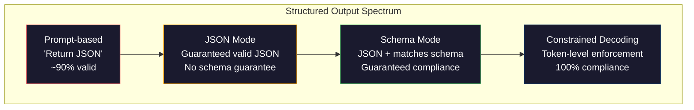
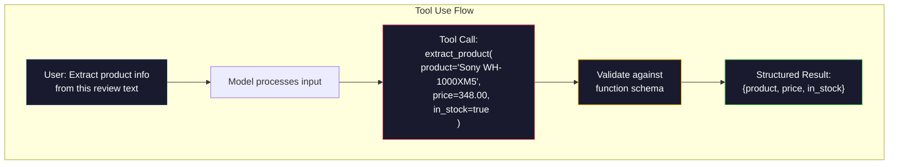

# 结构化输出：JSON、Schema 验证与受约束解码

> 大语言模型返回字符串，应用程序需要 JSON。这个落差导致的生产系统崩溃，比任何模型幻觉都多。结构化输出是自然语言与类型化数据之间的桥梁。做好它，大语言模型就会变成可靠的 API；做不好，你就只能在凌晨三点用正则表达式解析自由文本。

**Type:** 构建
**Languages:** Python
**Prerequisites:** 阶段 10 第 01～05 课（从零构建大语言模型）
**Time:** 约 90 分钟
**Related:** 阶段 5 · 20（结构化输出与受约束解码）介绍解码器层面的理论（FSM/CFG Logit 处理器、Outlines、XGrammar）。本课聚焦面向生产的 SDK 接口层（OpenAI `response_format`、Anthropic 工具使用、Instructor）——若想理解 API 之下发生了什么，请先阅读阶段 5 · 20。

## 学习目标

- 使用 OpenAI 与 Anthropic API 参数实现 JSON 模式和 Schema 约束输出
- 构建 Pydantic 验证层，拒绝格式错误的大语言模型输出，并带着错误反馈重试
- 解释受约束解码如何在词元层强制生成有效 JSON，而无须后处理
- 设计稳健的抽取提示，可靠地把非结构化文本转换为类型化数据结构

## 问题

你要求大语言模型：“从这段文本中提取产品名称、价格和库存状态。”它回答：

```
The product is the Sony WH-1000XM5 headphones, which cost $348.00 and are currently in stock.
```

这是完全正确的回答，对应用程序却毫无用处。库存系统需要的是 `{"product": "Sony WH-1000XM5", "price": 348.00, "in_stock": true}`。你需要一个具有指定键、指定类型与指定取值约束的 JSON 对象，而不是一句话。

朴素方案是在提示词中加上“用 JSON 回答”。它有 90% 的时间有效；另外 10% 的时间里，模型会把 JSON 包进 Markdown 代码围栏，添加“下面是 JSON：”之类的前言，或因为过早闭合括号而生成语法无效的 JSON。JSON 解析器随即崩溃，流水线中断。你加入 try/except 和重试循环，但重试有时又会产生不同数据。解析问题之上，又多了一致性问题。

这不是提示工程问题，而是解码问题。模型从左到右生成词元，每个位置都从包含 10 万多个选项的词表中选择最可能的下一个词元。在任意给定位置，这些选项中的大多数都会产生无效 JSON。如果模型刚输出 `{"price":`，下一个词元必须是数字、引号（表示字符串）、`null`、`true`、`false` 或负号。其他任何内容都会使 JSON 失效。没有约束时，模型可能选择一个在英语中完全合理、在语法上却会造成灾难的单词。

## 概念

### 结构化输出的层级

结构化输出控制分为四个层级，可靠性逐级提高。



**基于提示词**（“返回有效 JSON”）：没有强制机制。模型通常会遵守，但有时不会。可靠率约为 90%。失效形式包括 Markdown 围栏、前言文本、输出被截断，以及结构错误。

**JSON 模式**：API 保证输出是有效 JSON。OpenAI 通过 `response_format: { type: "json_object" }` 启用此模式。输出一定可以解析，却未必符合预期 Schema——可能有多余键、错误类型或缺失字段。

**Schema 模式**：API 接收 JSON Schema，并保证输出与之匹配。到 2026 年，所有主流提供商都原生支持：OpenAI 的 `response_format: { type: "json_schema", json_schema: {...} }`（也可使用 `tool_choice="required"`），Anthropic 带 `input_schema` 的工具使用，以及 Gemini 的 `response_schema` + `response_mime_type: "application/json"`。输出会拥有你指定的确切键、类型与约束。

**受约束解码**：生成过程中，在每个词元位置屏蔽所有会造成无效输出的词元。如果 Schema 要求一个数字，而模型准备输出字母，该词元的概率就会被设为零。模型只能生成仍有可能形成有效输出的词元。OpenAI 的结构化输出模式，以及 Outlines、Guidance 等库，底层实现的正是这种机制。

### JSON Schema：契约语言

JSON Schema 用来告诉模型（或验证层）输出必须具有什么形状。所有主流结构化输出系统都使用它。

```json
{
  "type": "object",
  "properties": {
    "product": { "type": "string" },
    "price": { "type": "number", "minimum": 0 },
    "in_stock": { "type": "boolean" },
    "categories": {
      "type": "array",
      "items": { "type": "string" }
    }
  },
  "required": ["product", "price", "in_stock"]
}
```

这份 Schema 表示：输出必须是对象，包含字符串 `product`、非负数字 `price`、布尔值 `in_stock`，以及可选的字符串数组 `categories`。任何不匹配的输出都会被拒绝。

Schema 能处理困难情况：嵌套对象、带类型元素的数组、枚举（把字符串限制为特定值）、模式匹配（对字符串使用正则表达式），以及组合器（用于多态输出的 oneOf、anyOf、allOf）。

### Pydantic 模式

在 Python 中，不必手写 JSON Schema。定义一个 Pydantic 模型，它会自动生成 Schema。

```python
from pydantic import BaseModel

class Product(BaseModel):
    product: str
    price: float
    in_stock: bool
    categories: list[str] = []
```

它会生成与上文相同的 JSON Schema。Instructor 库（以及 OpenAI SDK）可以直接接收 Pydantic 模型：传入模型类，获得经过验证的实例。如果大语言模型输出不匹配，Instructor 会自动重试。

### 函数调用/工具使用

这是处理同一问题的另一种接口。与其要求模型直接生成 JSON，不如定义带有类型化参数的“工具”（函数）。模型会输出一条带结构化参数的函数调用。OpenAI 称其为“函数调用”，Anthropic 称其为“工具使用”。最终结果相同：结构化数据。



当模型需要选择调用哪个函数，而不只是填写参数时，应优先采用工具使用。如果有 10 种不同的抽取 Schema，模型还必须根据输入选择正确的一种，工具使用可以同时完成 Schema 选择与结构化输出。

### 常见失效模式

即使强制 Schema，结构化输出仍会以微妙方式失败。

**值幻觉**：输出符合 Schema，却包含编造的数据。原文写的是 348 美元，模型却输出 `{"price": 299.99}`。Schema 验证无法发现这种错误——类型正确，值却错误。

**枚举混淆**：字段被限制为 `["in_stock", "out_of_stock", "preorder"]`，模型却输出 `"available"`——语义正确，但不在允许集合内。优秀的受约束解码可以阻止它，基于提示词的方法则不能。

**嵌套对象深度**：深度嵌套（4 层以上）的 Schema 更容易出错。每增加一层嵌套，模型就多一个可能丢失结构的位置。

**数组长度**：模型可能在数组中生成过多或过少元素。Schema 支持 `minItems` 与 `maxItems`，但并非所有提供商都会在解码层强制执行。

**省略可选字段**：模型可能省略语法上可选、对业务却很重要的字段。即使数据有时不存在，也应在 Schema 中把它们设为必填，迫使模型显式输出 `null`。

```figure
mx-schema-funnel
```

## 动手构建

### 第 1 步：JSON Schema 验证器

从零构建验证器，检查 Python 对象是否符合 JSON Schema。它在输出端运行，用来验证合规性。

```python
import json

def validate_schema(data, schema):
    errors = []
    _validate(data, schema, "", errors)
    return errors

def _validate(data, schema, path, errors):
    schema_type = schema.get("type")

    if schema_type == "object":
        if not isinstance(data, dict):
            errors.append(f"{path}: expected object, got {type(data).__name__}")
            return
        for key in schema.get("required", []):
            if key not in data:
                errors.append(f"{path}.{key}: required field missing")
        properties = schema.get("properties", {})
        for key, value in data.items():
            if key in properties:
                _validate(value, properties[key], f"{path}.{key}", errors)

    elif schema_type == "array":
        if not isinstance(data, list):
            errors.append(f"{path}: expected array, got {type(data).__name__}")
            return
        min_items = schema.get("minItems", 0)
        max_items = schema.get("maxItems", float("inf"))
        if len(data) < min_items:
            errors.append(f"{path}: array has {len(data)} items, minimum is {min_items}")
        if len(data) > max_items:
            errors.append(f"{path}: array has {len(data)} items, maximum is {max_items}")
        items_schema = schema.get("items", {})
        for i, item in enumerate(data):
            _validate(item, items_schema, f"{path}[{i}]", errors)

    elif schema_type == "string":
        if not isinstance(data, str):
            errors.append(f"{path}: expected string, got {type(data).__name__}")
            return
        enum_values = schema.get("enum")
        if enum_values and data not in enum_values:
            errors.append(f"{path}: '{data}' not in allowed values {enum_values}")

    elif schema_type == "number":
        if not isinstance(data, (int, float)):
            errors.append(f"{path}: expected number, got {type(data).__name__}")
            return
        minimum = schema.get("minimum")
        maximum = schema.get("maximum")
        if minimum is not None and data < minimum:
            errors.append(f"{path}: {data} is less than minimum {minimum}")
        if maximum is not None and data > maximum:
            errors.append(f"{path}: {data} is greater than maximum {maximum}")

    elif schema_type == "boolean":
        if not isinstance(data, bool):
            errors.append(f"{path}: expected boolean, got {type(data).__name__}")

    elif schema_type == "integer":
        if not isinstance(data, int) or isinstance(data, bool):
            errors.append(f"{path}: expected integer, got {type(data).__name__}")
```

### 第 2 步：从 Pydantic 风格模型生成 Schema

构建一个最小的“类到 Schema”转换器。定义 Python 类，再自动生成对应 JSON Schema。

```python
class SchemaField:
    def __init__(self, field_type, required=True, default=None, enum=None, minimum=None, maximum=None):
        self.field_type = field_type
        self.required = required
        self.default = default
        self.enum = enum
        self.minimum = minimum
        self.maximum = maximum

def python_type_to_schema(field):
    type_map = {
        str: "string",
        int: "integer",
        float: "number",
        bool: "boolean",
    }

    schema = {}

    if field.field_type in type_map:
        schema["type"] = type_map[field.field_type]
    elif field.field_type == list:
        schema["type"] = "array"
        schema["items"] = {"type": "string"}
    elif isinstance(field.field_type, dict):
        schema = field.field_type

    if field.enum:
        schema["enum"] = field.enum
    if field.minimum is not None:
        schema["minimum"] = field.minimum
    if field.maximum is not None:
        schema["maximum"] = field.maximum

    return schema

def model_to_schema(name, fields):
    properties = {}
    required = []

    for field_name, field in fields.items():
        properties[field_name] = python_type_to_schema(field)
        if field.required:
            required.append(field_name)

    return {
        "type": "object",
        "properties": properties,
        "required": required,
    }
```

### 第 3 步：受约束词元过滤器

模拟受约束解码。给定一段不完整的 JSON 字符串和一个 Schema，判断当前位置允许出现哪些类别的词元。

```python
def next_valid_tokens(partial_json, schema):
    stripped = partial_json.strip()

    if not stripped:
        return ["{"]

    try:
        json.loads(stripped)
        return ["<EOS>"]
    except json.JSONDecodeError:
        pass

    last_char = stripped[-1] if stripped else ""

    if last_char == "{":
        return ['"', "}"]
    elif last_char == '"':
        if stripped.endswith('":'):
            return ['"', "0-9", "true", "false", "null", "[", "{"]
        return ["a-z", '"']
    elif last_char == ":":
        return [" ", '"', "0-9", "true", "false", "null", "[", "{"]
    elif last_char == ",":
        return [" ", '"', "{", "["]
    elif last_char in "0123456789":
        return ["0-9", ".", ",", "}", "]"]
    elif last_char == "}":
        return [",", "}", "]", "<EOS>"]
    elif last_char == "]":
        return [",", "}", "<EOS>"]
    elif last_char == "[":
        return ['"', "0-9", "true", "false", "null", "{", "[", "]"]
    else:
        return ["any"]

def demonstrate_constrained_decoding():
    partial_states = [
        '',
        '{',
        '{"product"',
        '{"product":',
        '{"product": "Sony"',
        '{"product": "Sony",',
        '{"product": "Sony", "price":',
        '{"product": "Sony", "price": 348',
        '{"product": "Sony", "price": 348}',
    ]

    print(f"{'Partial JSON':<45} {'Valid Next Tokens'}")
    print("-" * 80)
    for state in partial_states:
        valid = next_valid_tokens(state, {})
        display = state if state else "(empty)"
        print(f"{display:<45} {valid}")
```

### 第 4 步：抽取流水线

把所有组件组合成抽取流水线：定义 Schema，模拟大语言模型生成结构化输出，验证结果，并处理重试。

```python
def simulate_llm_extraction(text, schema, attempt=0):
    if "headphones" in text.lower() or "sony" in text.lower():
        if attempt == 0:
            return '{"product": "Sony WH-1000XM5", "price": 348.00, "in_stock": true, "categories": ["audio", "headphones"]}'
        return '{"product": "Sony WH-1000XM5", "price": 348.00, "in_stock": true}'

    if "laptop" in text.lower():
        return '{"product": "MacBook Pro 16", "price": 2499.00, "in_stock": false, "categories": ["computers"]}'

    return '{"product": "Unknown", "price": 0, "in_stock": false}'

def extract_with_retry(text, schema, max_retries=3):
    for attempt in range(max_retries):
        raw = simulate_llm_extraction(text, schema, attempt)

        try:
            data = json.loads(raw)
        except json.JSONDecodeError as e:
            print(f"  Attempt {attempt + 1}: JSON parse error -- {e}")
            continue

        errors = validate_schema(data, schema)
        if not errors:
            return data

        print(f"  Attempt {attempt + 1}: Schema validation errors -- {errors}")

    return None

product_schema = {
    "type": "object",
    "properties": {
        "product": {"type": "string"},
        "price": {"type": "number", "minimum": 0},
        "in_stock": {"type": "boolean"},
        "categories": {"type": "array", "items": {"type": "string"}},
    },
    "required": ["product", "price", "in_stock"],
}
```

### 第 5 步：运行完整流水线

```python
def run_demo():
    print("=" * 60)
    print("  Structured Output Pipeline Demo")
    print("=" * 60)

    print("\n--- Schema Definition ---")
    product_fields = {
        "product": SchemaField(str),
        "price": SchemaField(float, minimum=0),
        "in_stock": SchemaField(bool),
        "categories": SchemaField(list, required=False),
    }
    generated_schema = model_to_schema("Product", product_fields)
    print(json.dumps(generated_schema, indent=2))

    print("\n--- Schema Validation ---")
    test_cases = [
        ({"product": "Test", "price": 10.0, "in_stock": True}, "Valid object"),
        ({"product": "Test", "price": -5.0, "in_stock": True}, "Negative price"),
        ({"product": "Test", "in_stock": True}, "Missing price"),
        ({"product": "Test", "price": "ten", "in_stock": True}, "String as price"),
        ("not an object", "String instead of object"),
    ]

    for data, label in test_cases:
        errors = validate_schema(data, product_schema)
        status = "PASS" if not errors else f"FAIL: {errors}"
        print(f"  {label}: {status}")

    print("\n--- Constrained Decoding Simulation ---")
    demonstrate_constrained_decoding()

    print("\n--- Extraction Pipeline ---")
    texts = [
        "The Sony WH-1000XM5 headphones are priced at $348 and currently available.",
        "The new MacBook Pro 16-inch laptop costs $2499 but is sold out.",
        "This is a random sentence with no product info.",
    ]

    for text in texts:
        print(f"\n  Input: {text[:60]}...")
        result = extract_with_retry(text, product_schema)
        if result:
            print(f"  Output: {json.dumps(result)}")
        else:
            print(f"  Output: FAILED after retries")
```

## 学以致用

### OpenAI 结构化输出

```python
# from openai import OpenAI
# from pydantic import BaseModel
#
# client = OpenAI()
#
# class Product(BaseModel):
#     product: str
#     price: float
#     in_stock: bool
#
# response = client.beta.chat.completions.parse(
#     model="gpt-5-mini",
#     messages=[
#         {"role": "system", "content": "Extract product information."},
#         {"role": "user", "content": "Sony WH-1000XM5, $348, in stock"},
#     ],
#     response_format=Product,
# )
#
# product = response.choices[0].message.parsed
# print(product.product, product.price, product.in_stock)
```

OpenAI 的结构化输出模式在内部使用受约束解码。模型生成的每个词元，都保证最终输出符合 Pydantic Schema。不需要重试，也不需要额外验证；约束已嵌入解码过程。

### Anthropic 工具使用

```python
# import anthropic
#
# client = anthropic.Anthropic()
#
# response = client.messages.create(
#     model="claude-opus-4-7",
#     max_tokens=1024,
#     tools=[{
#         "name": "extract_product",
#         "description": "Extract product information from text",
#         "input_schema": {
#             "type": "object",
#             "properties": {
#                 "product": {"type": "string"},
#                 "price": {"type": "number"},
#                 "in_stock": {"type": "boolean"},
#             },
#             "required": ["product", "price", "in_stock"],
#         },
#     }],
#     messages=[{"role": "user", "content": "Extract: Sony WH-1000XM5, $348, in stock"}],
# )
```

Anthropic 通过工具使用实现结构化输出。模型会发出一条工具调用，其中结构化参数与 input_schema 匹配。结果相同，API 表面不同。

### Instructor 库

```python
# pip install instructor
# import instructor
# from openai import OpenAI
# from pydantic import BaseModel
#
# client = instructor.from_openai(OpenAI())
#
# class Product(BaseModel):
#     product: str
#     price: float
#     in_stock: bool
#
# product = client.chat.completions.create(
#     model="gpt-5-mini",
#     response_model=Product,
#     messages=[{"role": "user", "content": "Sony WH-1000XM5, $348, in stock"}],
# )
```

Instructor 可以包装任意大语言模型客户端，并提供自动重试与验证。如果第一次尝试未通过验证，它会把错误作为上下文发回模型，要求修正输出。它适用于所有提供商，而不只限于 OpenAI。

## 交付成果

本课会生成 `outputs/prompt-structured-extractor.md`——一个可复用提示模板，能够根据给定 Schema 从任意文本中抽取结构化数据。提供一份 JSON Schema 和非结构化文本，它会返回通过验证的 JSON。

它还会生成 `outputs/skill-structured-outputs.md`——一个决策框架，根据提供商、可靠性要求与 Schema 复杂度选择正确的结构化输出策略。

## 练习

1. 扩展 Schema 验证器，使其支持 `oneOf`（数据必须恰好匹配多个 Schema 中的一个）。它可处理多态输出，例如某字段可以是形状不同的 `Product` 或 `Service` 对象。

2. 构建“Schema 差异”工具，比较两个 Schema，并识别破坏性变更（移除必填字段、改变类型）与非破坏性变更（增加可选字段、放宽约束）。这对生产环境中的抽取 Schema 版本管理至关重要。

3. 实现更真实的受约束解码模拟器。给定 JSON Schema 与包含 100 个词元（字母、数字、标点、关键字）的词表，逐步执行生成，并在每个位置屏蔽无效词元。测量每一步中有效词元占整个词表的比例。

4. 构建抽取评测套件。创建 50 条产品描述及人工标注的 JSON 输出，让抽取流水线处理全部样本，并测量精确匹配率、逐字段准确率与类型合规率。找出最难准确抽取的字段。

5. 为抽取流水线加入“置信度分数”。对每个提取字段估计模型置信度（根据词元概率，或通过运行 3 次抽取并测量一致性），把低置信度字段标记给人工审查。

## 关键术语

| 术语 | 人们通常怎么说 | 实际含义 |
|------|----------------|----------------------|
| JSON 模式 | “返回 JSON” | 保证输出在语法上是有效 JSON 的 API 参数，但不保证符合任何特定 Schema |
| 结构化输出 | “带类型的 JSON” | 与指定 JSON Schema 匹配、键和类型正确且满足约束的输出 |
| 受约束解码 | “引导式生成” | 在每个词元位置屏蔽会导致无效输出的词元——保证 100% 符合 Schema |
| JSON Schema | “JSON 模板” | 描述 JSON 数据结构、类型与约束的声明式语言（OpenAPI、JSON Forms 等都会使用） |
| Pydantic | “增强版 Python 数据类” | 定义带类型验证的数据模型的 Python 库；FastAPI 与 Instructor 用它生成 JSON Schema |
| 函数调用 | “工具使用” | 大语言模型输出结构化函数调用（名称 + 类型化参数），而非自由文本——OpenAI 与 Anthropic 均支持 |
| Instructor | “大语言模型的 Pydantic” | 包装大语言模型客户端、返回经过验证的 Pydantic 实例，并在验证失败后自动重试的 Python 库 |
| 词元屏蔽 | “过滤词表” | 在生成期间把特定词元的概率设为零，使模型无法生成它们 |
| Schema 合规性 | “符合形状” | 输出包含每个必填字段、类型正确、值符合约束，而且没有额外的不允许字段 |
| 重试循环 | “一直重试到成功” | 把验证错误发回模型并要求修复输出——Instructor 会自动执行，最多重试可配置次数 |

## 延伸阅读

- [OpenAI 结构化输出指南](https://platform.openai.com/docs/guides/structured-outputs)——OpenAI API 中基于 JSON Schema 的受约束解码官方文档
- [Willard 与 Louf，2023——“大型语言模型的高效引导生成”](https://arxiv.org/abs/2307.09702)——Outlines 论文，说明如何把 JSON Schema 编译成有限状态机，以施加词元级约束
- [Instructor 文档](https://python.useinstructor.com/)——通过 Pydantic 验证与重试，从任意大语言模型获得结构化输出的标准库
- [Anthropic 工具使用指南](https://docs.anthropic.com/en/docs/tool-use)——Claude 如何通过带 JSON Schema input_schema 的工具使用实现结构化输出
- [JSON Schema 规范](https://json-schema.org/)——所有主流结构化输出系统采用的 Schema 语言完整规范
- [Outlines 库](https://github.com/outlines-dev/outlines)——通过正则表达式和编译为有限状态机的 JSON Schema 实现受约束生成的开源工具
- [Dong 等，“XGrammar：灵活高效的大语言模型结构化生成引擎”（MLSys 2025）](https://arxiv.org/abs/2411.15100)——当前领先的语法引擎；使用下推自动机编译，以约 100 ns/词元的速度屏蔽词元
- [Beurer-Kellner 等，“提示即编程：面向大型语言模型的查询语言”（LMQL）](https://arxiv.org/abs/2212.06094)——LMQL 论文，将受约束解码表述为带类型和值约束的查询语言
- [Microsoft Guidance（框架文档）](https://github.com/guidance-ai/guidance)——模板驱动的受约束生成；是 Outlines 与 XGrammar 的供应商无关补充
