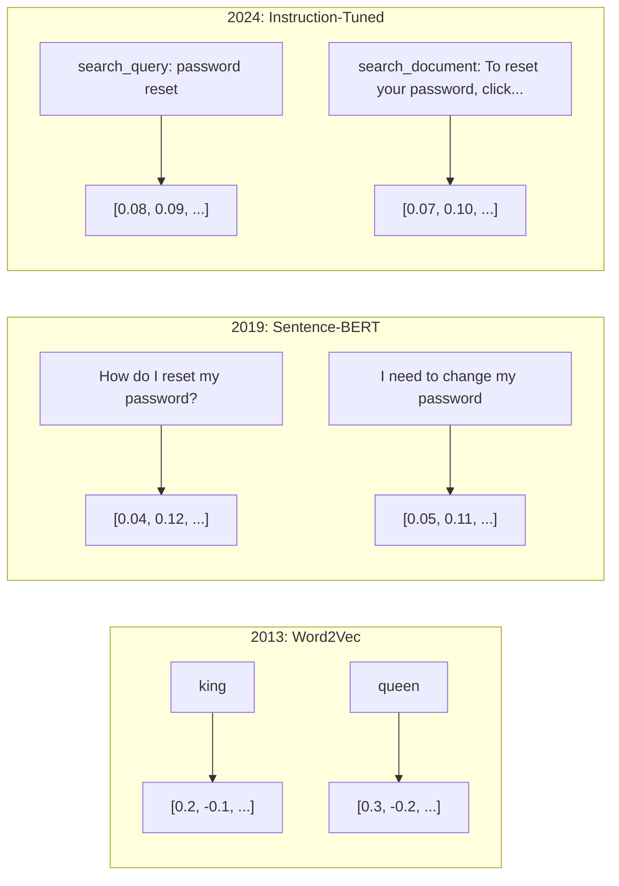
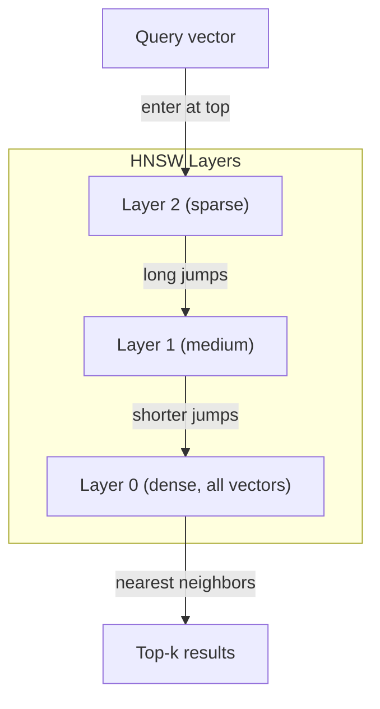

# 嵌入与向量表示

> 文本是离散的，数学是连续的。每当你要求大语言模型寻找“相似”文档、比较语义或进行超越关键词的搜索时，你都在依赖连接这两个世界的桥梁。这座桥梁就是嵌入。如果不理解嵌入，你就不算真正理解现代 AI，只是在使用它而已。

**Type:** 构建
**Languages:** Python
**Prerequisites:** 阶段 11 第 01 课（提示工程）
**Time:** 约 75 分钟
**Related:** 阶段 5 · 22（嵌入模型深度解析）涵盖稠密、多向量与稀疏嵌入、Matryoshka 截断，以及按不同维度选择模型。本课聚焦生产流水线（向量数据库、HNSW、相似度数学）。选择模型前，请先阅读阶段 5 · 22。

## 学习目标

- 使用 API 提供商和开源模型生成文本嵌入，并计算嵌入之间的余弦相似度
- 解释嵌入为何能解决关键词搜索无法处理的词汇不匹配问题
- 构建按语义而非精确关键词匹配来检索文档的语义搜索索引
- 使用检索基准（precision@k、recall）评估嵌入质量，并为任务选择合适的嵌入模型

## 问题

你有 10,000 条客服工单。一位客户写道：“我的付款没有成功。”你需要找到类似的历史工单。关键词搜索会找到包含“付款”和“没有成功”的工单，却会漏掉“交易失败”“扣款被拒”和“账单错误”。这些工单用完全不同的措辞描述了同一个问题。

这就是词汇不匹配问题。人类语言可以用几十种方式表达同一件事。关键词搜索把每个词都当作没有含义的独立符号，无法知道“被拒”和“没有成功”指的是同一个概念。

你需要一种文本表示，让相似度由含义而非拼写决定。你需要把“我的付款没有成功”和“交易被拒绝”放在某个数学空间中的相近位置，同时让“我的付款准时到账”远离它们，尽管后一句也包含“付款”一词。

这种表示就是嵌入。

## 概念

### 什么是嵌入？

嵌入是由浮点数组成的稠密向量，用来表示文本的含义。“稠密”很重要——每个维度都承载信息；这不同于词袋、TF-IDF 等稀疏表示，后者的大多数维度都为零。

“The cat sat on the mat”会变成类似 `[0.023, -0.041, 0.087, ..., 0.012]` 的形式——根据模型不同，它可能包含 768 到 3072 个数字。这些数字编码了含义。你不会直接查看它们，而是比较它们。

### Word2Vec 的突破

2013 年，Google 的 Tomas Mikolov 及其同事发表了 Word2Vec。核心洞见是：训练神经网络根据一个词的邻近词预测该词（或根据该词预测邻近词），其隐藏层权重会形成有意义的向量表示。

著名的结果是：

```
king - man + woman = queen
```

对词嵌入做向量运算，可以捕获语义关系。从“man”指向“woman”的方向，大致等同于从“king”指向“queen”的方向。正是在这一刻，整个领域意识到几何可以编码含义。

Word2Vec 生成 300 维向量。无论上下文如何，每个词都只有一个向量。“river bank”中的“bank”和“bank account”中的“bank”拥有相同的嵌入。这项局限推动了此后十年的研究。

### 从词到句子

词嵌入表示单个词元，而生产系统需要嵌入完整的句子、段落或文档。业界逐渐形成了四种方法：

**取平均值**：计算句子中所有词向量的均值。成本低、有信息损失，但对短文本的效果出乎意料地不错。它会完全丢失词序——“dog bites man”和“man bites dog”将得到相同的嵌入。

**CLS 词元**：Transformer 模型（BERT，2018）会输出一个代表整个输入的特殊 [CLS] 词元嵌入。它比取平均值更好，但 [CLS] 词元训练时服务于下一句预测，而不是相似度计算。

**对比学习**：显式训练模型，让相似样本对彼此靠近、不相似样本对彼此远离。Sentence-BERT（Reimers 与 Gurevych，2019）采用了这种方法，并成为现代嵌入模型的基础。给定“How do I reset my password?”和“I need to change my password”，模型会学到二者的向量应当几乎相同。

**指令微调嵌入**：这是最新的方法。E5、GTE 等模型接收任务前缀（如“search_query:”和“search_document:”），用来指明应生成哪一类嵌入。这样，一个模型就能服务于多种任务。



### 现代嵌入模型

市场已经收敛到少数几个生产级选项（截至 2026 年初的 MTEB 分数，MTEB v2）：

| 模型 | 提供商 | 维度 | MTEB | 上下文 | 每百万词元成本 |
|-------|----------|-----------|------|---------|------------------|
| Gemini Embedding 2 | Google | 3072 (Matryoshka) | 67.7 (retrieval) | 8192 | $0.15 |
| embed-v4 | Cohere | 1024 (Matryoshka) | 65.2 | 128K | $0.12 |
| voyage-4 | Voyage AI | 1024/2048 (Matryoshka) | 66.8 | 32K | $0.12 |
| text-embedding-3-large | OpenAI | 3072 (Matryoshka) | 64.6 | 8192 | $0.13 |
| text-embedding-3-small | OpenAI | 1536 (Matryoshka) | 62.3 | 8192 | $0.02 |
| BGE-M3 | BAAI | 1024 (dense+sparse+ColBERT) | 63.0 multilingual | 8192 | 开放权重 |
| Qwen3-Embedding | Alibaba | 4096 (Matryoshka) | 66.9 | 32K | 开放权重 |
| Nomic-embed-v2 | Nomic | 768 (Matryoshka) | 63.1 | 8192 | 开放权重 |

MTEB（Massive Text Embedding Benchmark）v2 覆盖检索、分类、聚类、重排序和摘要等 100 多项任务，分数越高越好。到 2026 年，开放权重模型（Qwen3-Embedding、BGE-M3）在多数评价维度上已经追平或超过闭源托管模型。Gemini Embedding 2 在纯检索任务上领先；Voyage/Cohere 则在金融、法律、代码等特定领域领先。做出选择前，一定要用自己的查询进行基准测试。

### 相似度度量

给定两个嵌入向量，有三种方式衡量它们的相似程度：

**余弦相似度**：两个向量夹角的余弦值。取值范围从 -1（方向相反）到 1（方向相同）。它忽略向量大小——如果一个 10 词句子和一篇 500 词文档指向同一方向，二者得分可以是 1.0。这是 90% 使用场景的默认选择。

```
cosine_sim(a, b) = dot(a, b) / (||a|| * ||b||)
```

**点积**：两个向量的原始内积。向量经过归一化（长度为 1）后，点积与余弦相似度完全相同，而且计算更快。OpenAI 的嵌入经过归一化，因此点积与余弦相似度会产生相同的排序。

```
dot(a, b) = sum(a_i * b_i)
```

**欧几里得（L2）距离**：向量空间中的直线距离。数值越小，表示越相似。它对大小差异敏感，适用于空间中的绝对位置具有意义、而不只是方向具有意义的情况。

```
L2(a, b) = sqrt(sum((a_i - b_i)^2))
```

如何选择：

| 度量 | 适用场景 | 不适用场景 |
|--------|----------|------------|
| 余弦相似度 | 比较长度不同的文本；大多数检索任务 | 向量大小本身承载信息 |
| 点积 | 嵌入已经归一化；追求最高速度 | 向量大小不一致 |
| 欧几里得距离 | 聚类；空间最近邻问题 | 比较长度差异极大的文档 |

### 向量数据库与 HNSW

暴力相似度搜索会将查询向量与每个已存储向量逐一比较。若有 100 万个 1536 维向量，每次查询需要执行 15 亿次乘加运算，速度太慢。

向量数据库使用近似最近邻（Approximate Nearest Neighbor，ANN）算法解决这个问题。其中占主导地位的算法是 HNSW（Hierarchical Navigable Small World，分层可导航小世界）：

1. 构建一个多层向量图
2. 顶层较稀疏——在相距较远的聚类之间建立长距离连接
3. 底层较稠密——在相邻向量之间建立细粒度连接
4. 搜索从顶层开始，以贪心方式逐层下降并不断细化
5. 用 O(log n) 而非 O(n) 的时间返回近似 top-k 结果

HNSW 以很小的准确率损失（召回率通常为 95%～99%）换取巨大的速度提升。在 1000 万个向量上，暴力搜索需要数秒，而 HNSW 只需数毫秒。



生产环境中的选择包括：

| 数据库 | 类型 | 最适合 | 最大规模 |
|----------|------|----------|-----------|
| Pinecone | 托管 SaaS | 零运维生产环境 | 数十亿 |
| Weaviate | 开源 | 自托管、混合搜索 | 1 亿以上 |
| Qdrant | 开源 | 高性能、过滤 | 1 亿以上 |
| ChromaDB | 嵌入式 | 原型开发、本地开发 | 100 万 |
| pgvector | Postgres 扩展 | 已在使用 Postgres | 1000 万 |
| FAISS | 库 | 进程内使用、研究 | 10 亿以上 |

### 分块策略

文档太长，无法作为单个向量进行有效嵌入。一份 50 页的 PDF 涵盖数十个主题——它的嵌入会变成所有内容的平均值，对任何具体主题都不够相似。你需要把文档切成块，并分别嵌入每一块。

**固定大小分块**：按每 N 个词元切分，相邻块重叠 M 个词元。简单且可预测，适合没有清晰结构的文档。以 512 个词元为一块并重叠 50 个词元时，第 1 块是词元 0～511，第 2 块是词元 462～973。

**按句子分块**：在句子边界处切分，不断组合句子，直到达到词元上限。每个块至少包含一个完整句子。它比固定大小分块更好，因为不会把一个完整想法从中截断。

**递归分块**：先尝试在最大粒度的边界（章节标题）处分割。如果结果仍然太大，则尝试段落边界，然后是句子边界，最后是字符限制。LangChain 的 `RecursiveCharacterTextSplitter` 采用这种方法，尤其适合混合格式的语料库。

**语义分块**：先嵌入每个句子，再把嵌入相似的连续句子组合起来。当嵌入相似度低于阈值时，开始一个新块。这种方法成本较高（需要逐句嵌入），但生成的块最连贯。

| 策略 | 复杂度 | 质量 | 最适合 |
|----------|-----------|---------|----------|
| 固定大小 | 低 | 尚可 | 非结构化文本、日志 |
| 按句子 | 低 | 良好 | 文章、电子邮件 |
| 递归 | 中 | 良好 | Markdown、HTML、混合文档 |
| 语义 | 高 | 最佳 | 对检索质量要求严格的场景 |

大多数系统的最佳平衡点是：每块 256～512 个词元，相邻块重叠 50 个词元。

### 双编码器与交叉编码器

双编码器分别嵌入查询和文档，再比较向量。它速度很快——只需嵌入一次查询，再与预先计算好的文档嵌入进行比较。检索阶段就使用这种模型。

交叉编码器把查询和一篇文档作为单个输入，并输出相关性分数。它速度较慢——每一对查询与文档都必须经过完整模型。但它准确得多，因为模型可以同时关注查询和文档中的词元。

生产环境中的常见模式是：双编码器先检索前 100 个候选项，再由交叉编码器将其重排序为前 10 项。这就是“先检索、后重排序”流水线。


重排序模型包括：Cohere Rerank 3.5（每 1000 次查询 2 美元）、BGE-reranker-v2（免费、开源）和 Jina Reranker v2（免费、开源）。

### Matryoshka 嵌入

传统嵌入只能整体使用。一个 1536 维向量需要 1536 个浮点数；如果不重新训练，就不能把它截断到 256 维。

Matryoshka Representation Learning（Kusupati 等，2022）解决了这个问题。训练模型时，会让前 N 个维度捕获最重要的信息，就像俄罗斯套娃一样。将 1536 维 Matryoshka 嵌入截断为 256 维会损失一些准确率，但仍能正常工作。

OpenAI 的 text-embedding-3-small 和 text-embedding-3-large 通过 `dimensions` 参数支持 Matryoshka 截断。请求 256 维而不是 1536 维，可将存储空间缩小 6 倍，而在 MTEB 基准上的准确率损失约为 3%～5%。

### 二值量化

一个 1536 维的 float32 嵌入需要 6,144 字节。乘以 1000 万篇文档，仅向量就需要 61 GB。

二值量化把每个浮点数转换为一个比特：正值变为 1，负值变为 0。存储空间从 6,144 字节降至 192 字节——缩小 32 倍。相似度通过汉明距离（不同位的数量）计算，CPU 一条指令就能完成这种运算。

对检索召回率的影响约为 5%～10%。常见模式是：先用二值量化在数百万向量中进行第一轮搜索，再使用全精度向量为前 1000 个结果重新打分。这样只需三十二分之一的内存，就能达到全精度准确率的 95% 以上。

```figure
cosine-similarity
```

## 动手构建

我们将从零构建一个语义搜索引擎。不使用向量数据库，也不调用外部嵌入 API，只使用纯 Python 和 numpy 完成数学运算。

### 第 1 步：文本分块

```python
def chunk_text(text, chunk_size=200, overlap=50):
    words = text.split()
    chunks = []
    start = 0
    while start < len(words):
        end = start + chunk_size
        chunk = " ".join(words[start:end])
        chunks.append(chunk)
        start += chunk_size - overlap
    return chunks


def chunk_by_sentences(text, max_chunk_tokens=200):
    sentences = text.replace("\n", " ").split(".")
    sentences = [s.strip() + "." for s in sentences if s.strip()]
    chunks = []
    current_chunk = []
    current_length = 0
    for sentence in sentences:
        sentence_length = len(sentence.split())
        if current_length + sentence_length > max_chunk_tokens and current_chunk:
            chunks.append(" ".join(current_chunk))
            current_chunk = []
            current_length = 0
        current_chunk.append(sentence)
        current_length += sentence_length
    if current_chunk:
        chunks.append(" ".join(current_chunk))
    return chunks
```

### 第 2 步：从零构建嵌入

我们使用带 L2 归一化的 TF-IDF 实现一种简单的稠密嵌入。它不是神经嵌入，但遵循相同的约定：输入文本，输出固定大小的向量；相似文本产生相似向量。

```python
import math
import numpy as np
from collections import Counter

class SimpleEmbedder:
    def __init__(self):
        self.vocab = []
        self.idf = []
        self.word_to_idx = {}

    def fit(self, documents):
        vocab_set = set()
        for doc in documents:
            vocab_set.update(doc.lower().split())
        self.vocab = sorted(vocab_set)
        self.word_to_idx = {w: i for i, w in enumerate(self.vocab)}
        n = len(documents)
        self.idf = np.zeros(len(self.vocab))
        for i, word in enumerate(self.vocab):
            doc_count = sum(1 for doc in documents if word in doc.lower().split())
            self.idf[i] = math.log((n + 1) / (doc_count + 1)) + 1

    def embed(self, text):
        words = text.lower().split()
        count = Counter(words)
        total = len(words) if words else 1
        vec = np.zeros(len(self.vocab))
        for word, freq in count.items():
            if word in self.word_to_idx:
                tf = freq / total
                vec[self.word_to_idx[word]] = tf * self.idf[self.word_to_idx[word]]
        norm = np.linalg.norm(vec)
        if norm > 0:
            vec = vec / norm
        return vec
```

### 第 3 步：相似度函数

```python
def cosine_similarity(a, b):
    dot = np.dot(a, b)
    norm_a = np.linalg.norm(a)
    norm_b = np.linalg.norm(b)
    if norm_a == 0 or norm_b == 0:
        return 0.0
    return float(dot / (norm_a * norm_b))


def dot_product(a, b):
    return float(np.dot(a, b))


def euclidean_distance(a, b):
    return float(np.linalg.norm(a - b))
```

### 第 4 步：使用暴力搜索的向量索引

```python
class VectorIndex:
    def __init__(self):
        self.vectors = []
        self.texts = []
        self.metadata = []

    def add(self, vector, text, meta=None):
        self.vectors.append(vector)
        self.texts.append(text)
        self.metadata.append(meta or {})

    def search(self, query_vector, top_k=5, metric="cosine"):
        scores = []
        for i, vec in enumerate(self.vectors):
            if metric == "cosine":
                score = cosine_similarity(query_vector, vec)
            elif metric == "dot":
                score = dot_product(query_vector, vec)
            elif metric == "euclidean":
                score = -euclidean_distance(query_vector, vec)
            else:
                raise ValueError(f"Unknown metric: {metric}")
            scores.append((i, score))
        scores.sort(key=lambda x: x[1], reverse=True)
        results = []
        for idx, score in scores[:top_k]:
            results.append({
                "text": self.texts[idx],
                "score": score,
                "metadata": self.metadata[idx],
                "index": idx
            })
        return results

    def size(self):
        return len(self.vectors)
```

### 第 5 步：语义搜索引擎

```python
class SemanticSearchEngine:
    def __init__(self, chunk_size=200, overlap=50):
        self.embedder = SimpleEmbedder()
        self.index = VectorIndex()
        self.chunk_size = chunk_size
        self.overlap = overlap

    def index_documents(self, documents, source_names=None):
        all_chunks = []
        all_sources = []
        for i, doc in enumerate(documents):
            chunks = chunk_text(doc, self.chunk_size, self.overlap)
            all_chunks.extend(chunks)
            name = source_names[i] if source_names else f"doc_{i}"
            all_sources.extend([name] * len(chunks))
        self.embedder.fit(all_chunks)
        for chunk, source in zip(all_chunks, all_sources):
            vec = self.embedder.embed(chunk)
            self.index.add(vec, chunk, {"source": source})
        return len(all_chunks)

    def search(self, query, top_k=5, metric="cosine"):
        query_vec = self.embedder.embed(query)
        return self.index.search(query_vec, top_k, metric)

    def search_with_scores(self, query, top_k=5):
        results = self.search(query, top_k)
        return [
            {
                "text": r["text"][:200],
                "source": r["metadata"].get("source", "unknown"),
                "score": round(r["score"], 4)
            }
            for r in results
        ]
```

### 第 6 步：比较相似度度量

```python
def compare_metrics(engine, query, top_k=3):
    results = {}
    for metric in ["cosine", "dot", "euclidean"]:
        hits = engine.search(query, top_k=top_k, metric=metric)
        results[metric] = [
            {"score": round(h["score"], 4), "preview": h["text"][:80]}
            for h in hits
        ]
    return results
```

## 投入使用

换成生产级嵌入 API 后，架构仍然完全相同，只有嵌入器需要更换：

```python
from openai import OpenAI

client = OpenAI()

def openai_embed(texts, model="text-embedding-3-small", dimensions=None):
    kwargs = {"model": model, "input": texts}
    if dimensions:
        kwargs["dimensions"] = dimensions
    response = client.embeddings.create(**kwargs)
    return [item.embedding for item in response.data]
```

使用 OpenAI 进行 Matryoshka 截断——模型相同，维度更少，存储成本更低：

```python
full = openai_embed(["semantic search query"], dimensions=1536)
compact = openai_embed(["semantic search query"], dimensions=256)
```

256 维向量的存储空间只有原来的六分之一。对于 1000 万篇文档，这意味着 10 GB 而不是 61 GB。在标准基准上，准确率损失约为 3%～5%。

使用 Cohere 进行重排序：

```python
import cohere

co = cohere.ClientV2()

results = co.rerank(
    model="rerank-v3.5",
    query="What is the refund policy?",
    documents=["Full refund within 30 days...", "No refunds after 90 days..."],
    top_n=3
)
```

不依赖 API、在本地生成嵌入：

```python
from sentence_transformers import SentenceTransformer

model = SentenceTransformer("BAAI/bge-small-en-v1.5")
embeddings = model.encode(["semantic search query", "another document"])
```

我们构建的 VectorIndex 类可以配合上述任意一种方式使用。替换嵌入函数，搜索逻辑保持不变。

## 交付成果

本课会产出：
- `outputs/prompt-embedding-advisor.md`——一个提示词，用于针对具体使用场景选择嵌入模型和策略
- `outputs/skill-embedding-patterns.md`——一项技能，用于指导 Agent 在生产环境中有效使用嵌入

## 练习

1. **度量比较**：对同一组示例文档，用余弦相似度、点积和欧几里得距离运行相同的 5 个查询，记录每种度量的前 3 个结果。哪些查询得到的排序不一致？为什么？

2. **分块大小实验**：分别使用 50、100、200 和 500 词的分块大小为示例文档建立索引。对每种大小运行 5 个查询，并记录 top-1 相似度分数。绘制分块大小与检索质量之间的关系，找出更大的块开始损害效果的临界点。

3. **Matryoshka 模拟**：构建一个生成 500 维向量的 SimpleEmbedder。分别截断到 50、100、200 和 500 维，测量每种截断下检索召回率的下降程度。这无需真正的训练技巧，就能模拟 Matryoshka 的行为。

4. **二值量化**：取出搜索引擎中的嵌入，将其转换为二进制（正值为 1，负值为 0），并实现汉明距离搜索。把前 10 个结果与全精度余弦相似度的结果进行比较，测量二者的重合比例。

5. **按句子分块**：用 `chunk_by_sentences` 替换固定大小分块。运行相同查询并比较检索分数。尊重句子边界是否改善了结果？

## 关键术语

| 术语 | 人们常说 | 实际含义 |
|------|----------------|----------------------|
| 嵌入 | “把文本变成数字” | 一种稠密向量，用几何上的接近程度编码语义相似性 |
| Word2Vec | “最早的经典嵌入” | 2013 年通过预测上下文词学习词向量的模型；证明了向量运算可以编码含义 |
| 余弦相似度 | “两个向量有多相似” | 向量夹角的余弦值；1 表示方向相同，0 表示正交，-1 表示方向相反 |
| HNSW | “快速向量搜索” | 分层可导航小世界图——一种多层结构，可实现 O(log n) 的近似最近邻搜索 |
| 双编码器 | “分别嵌入，快速比较” | 独立地把查询和文档编码为向量，支持预计算和快速检索 |
| 交叉编码器 | “慢但准确的重排序器” | 让查询与文档组成的样本对共同通过完整模型；准确率更高，但无法预计算 |
| Matryoshka 嵌入 | “可截断向量” | 训练时让前 N 个维度捕获最重要的信息，从而支持可变大小的存储 |
| 二值量化 | “1 比特嵌入” | 只保留符号位，将浮点向量转换为二进制，从而把存储空间缩小 32 倍，并使用汉明距离搜索 |
| 分块 | “把文档拆开再嵌入” | 把文档拆成 256～512 个词元的片段，以便每个片段都能独立嵌入和检索 |
| 向量数据库 | “嵌入的搜索引擎” | 为大规模存储向量和执行近似最近邻搜索而优化的数据存储 |
| 对比学习 | “通过比较来训练” | 让相似样本对的嵌入彼此靠近，让不相似样本对彼此远离的训练方法 |
| MTEB | “嵌入基准” | Massive Text Embedding Benchmark——覆盖 8 类任务的 56 个数据集，是比较嵌入模型的标准基准 |

## 延伸阅读

- Mikolov 等，“Efficient Estimation of Word Representations in Vector Space”（2013）——开启嵌入革命的 Word2Vec 论文，其中提出了著名的 king-queen 类比
- Reimers 与 Gurevych，“Sentence-BERT: Sentence Embeddings using Siamese BERT-Networks”（2019）——介绍如何训练用于句子级相似度的双编码器，是现代嵌入模型的基础
- Kusupati 等，“Matryoshka Representation Learning”（2022）——介绍可变维度嵌入技术，OpenAI 的 text-embedding-3 采用了该技术
- Malkov 与 Yashunin，“Efficient and Robust Approximate Nearest Neighbor using Hierarchical Navigable Small World Graphs”（2018）——HNSW 论文；该算法是大多数生产级向量搜索的基础
- OpenAI Embeddings Guide（platform.openai.com/docs/guides/embeddings）——text-embedding-3 模型的实用参考，包括 Matryoshka 降维
- MTEB Leaderboard（huggingface.co/spaces/mteb/leaderboard）——实时基准榜单，按任务和语言比较所有嵌入模型
- [Muennighoff 等，“MTEB: Massive Text Embedding Benchmark”（EACL 2023）](https://arxiv.org/abs/2210.07316)——定义了榜单所报告的 8 类任务（分类、聚类、样本对分类、重排序、检索、STS、摘要、双语文本挖掘）；在相信任何单一 MTEB 分数之前，应先阅读这篇论文。
- [Sentence Transformers 文档](https://www.sbert.net/)——双编码器与交叉编码器、池化策略，以及本课所实现的“摄取—切分—嵌入—存储”RAG 流水线的权威参考。
