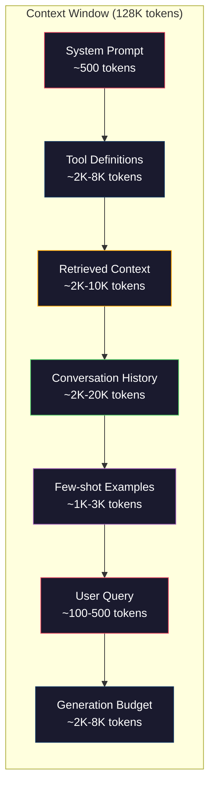
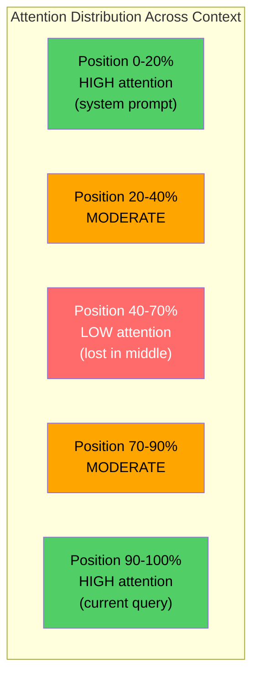
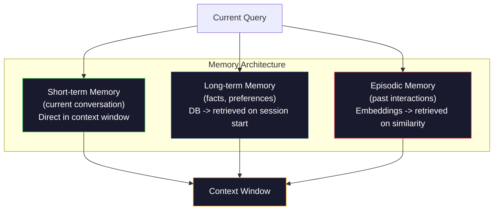

# 上下文工程：窗口、预算、记忆与检索

> 提示工程只是一个子集，上下文工程才是全局。提示词是你输入的一段字符串；上下文则是进入模型窗口的一切内容：系统指令、检索到的文档、工具定义、对话历史、少样本示例，以及提示词本身。2026 年最优秀的 AI 工程师都是上下文工程师。他们决定哪些内容应当进入、哪些应当排除，以及各部分应按什么顺序排列。

**Type:** 构建
**Languages:** Python
**Prerequisites:** 阶段 10（从零构建大语言模型），阶段 11 第 01～02 课
**Time:** 约 90 分钟
**Related:** 阶段 11 · 15（提示缓存）——缓存友好的布局是上下文工程的延伸。阶段 5 · 28（长上下文评估）介绍如何使用 NIAH/RULER 衡量“中间遗失”。

## 学习目标

- 计算上下文窗口各组成部分的词元预算（系统提示词、工具、历史记录、检索文档、生成预留空间）
- 实现对话历史的上下文窗口管理策略：截断、摘要与滑动窗口
- 确定上下文组成部分的优先级与排列顺序，让模型把注意力集中在最相关的信息上
- 构建上下文组装器，根据查询类型与可用窗口空间动态分配词元

## 问题

Claude Opus 4.7 的上下文窗口为 20 万词元（测试版为 100 万），GPT-5 为 40 万，Gemini 3 Pro 为 200 万，Llama 4 则宣称达到 1000 万。这些数字听起来非常庞大，直到你真正开始填充它们。

以下是一个编程助手的真实拆分：系统提示词 500 个词元；50 个工具的定义 8,000 个词元；检索到的文档 4,000 个词元；对话历史（10 轮）6,000 个词元；当前用户查询 200 个词元；生成预算（最大输出）4,000 个词元。总计 22,700 个词元，只占 128K 窗口的 18%。

然而，注意力并不会随上下文长度线性扩展。拥有 128K 词元上下文的模型需要承担二次方级别的注意力计算成本（普通 Transformer 为 O(n^2)，尽管多数生产模型采用了高效注意力变体）。更重要的是，检索准确率会下降。“大海捞针”（Needle in a Haystack）测试表明，模型很难找到位于长上下文中间的信息。Liu 等（2023）的研究显示，大语言模型检索长上下文开头和结尾信息时，准确率接近完美；但当信息位于中间（上下文 40%～70% 的位置）时，准确率会下降 10%～20%。这种“中间遗失”效应因模型而异，却影响当前所有架构。

实际教训是：拥有 20 万词元可用空间，并不意味着用满 20 万词元就有效。精心筛选的 1 万词元上下文，往往胜过直接倾倒进去的 10 万词元上下文。上下文工程是一门在上下文窗口内最大化信噪比的学科。

你放进窗口的每个词元，都会挤掉一个本可承载更相关信息的词元。每个无关的工具定义、每轮过时的对话、每段不能回答问题的检索文本，都会让模型在任务上的表现略微变差。

## 概念

### 上下文窗口是一种稀缺资源

把上下文窗口想成内存，而不是磁盘。它速度快、可直接访问，但容量有限。你无法放入所有内容，必须做出选择。



各组成部分会争夺空间。增加工具定义，就会减少对话历史的空间；增加检索上下文，就会减少少样本示例的空间。上下文工程是一门分配这份预算、使任务表现最大化的艺术。

### 中间遗失

这是上下文工程中最重要的实证发现。模型更关注上下文开头和结尾的信息。位于中间的信息得到的注意力分数较低，也更容易被忽略。

Liu 等（2023）对此进行了系统测试。他们把一篇相关文档放在 20 篇无关文档中的不同位置，并测量回答准确率。当相关文档排在第一或最后时，准确率为 85%～90%；当它处在中间（20 篇中的第 10 篇）时，准确率降至 60%～70%。

这会直接影响工程设计：

- 把最重要的信息放在最前面（系统提示词、关键指令）
- 把当前查询和最相关的上下文放在最后（利用近因偏差）
- 把上下文中部视为优先级最低的区域
- 如果必须把信息放在中间，请在末尾重复其关键点



### 上下文组成部分

**系统提示词**：设定角色、约束和行为规则。它位于最前面，并在各轮调用中保持不变。Claude Code 的系统提示词连同工具定义和行为指令约占 6,000 个词元。应尽量精炼，因为系统提示词中的每个词都会在每次 API 调用中重复出现。

**工具定义**：每个工具会增加 50～200 个词元（名称、描述、参数 Schema）。按每个工具 150 个词元计算，50 个工具在对话开始前就会占用 7,500 个词元。动态选择工具——只加入与当前查询相关的工具——可以将这项开销降低 60%～80%。

**检索上下文**：来自向量数据库的文档、搜索结果和文件内容。检索质量直接决定回答质量。糟糕的检索甚至不如不检索——它用噪声填满窗口，还会主动误导模型。

**对话历史**：之前的每条用户消息和助手回复。它随对话长度线性增长。一次 50 轮的对话，若每轮 200 个词元，历史记录就会占用 10,000 个词元；其中大部分通常与当前查询无关。

**少样本示例**：用于展示期望行为的输入/输出样本对。两三个精心选择的示例，往往比数千词元的指令更能提升输出质量，但它们也会占用空间。

**生成预算**：为模型回答预留的词元。如果把窗口完全填满，模型就没有空间作答。至少应为生成预留 2,000～4,000 个词元。

### 上下文压缩策略

**历史摘要**：定期总结对话，而不是逐字保留所有历史轮次。用 100 个词元写下“我们讨论了 X、决定了 Y，而用户希望 Z”，即可替代占用 2,000 个词元的 10 轮对话。当历史记录超过阈值（如 5,000 个词元）时执行摘要。

**相关性过滤**：根据当前查询为每篇检索文档打分，并丢弃低于阈值的文档。如果检索到 10 个块，却只有 3 个相关，就丢弃另外 7 个。保留 3 个高度相关的块，胜过保留 10 个质量一般的块。

**工具裁剪**：对用户查询意图进行分类，只加入与该意图相关的工具。代码问题不需要日历工具，日程安排问题不需要文件系统工具。这可以把工具定义从 8,000 个词元减少到 1,000 个。

**递归摘要**：对很长的文档分阶段总结。先总结每一节，再汇总各节摘要。一份 50 页文档可以压缩为 500 个词元的概要，同时保留关键内容。

### 记忆系统

上下文工程横跨三个时间尺度。

**短期记忆**：当前对话。直接存放在上下文窗口中，随每一轮对话增长，通过摘要和截断进行管理。

**长期记忆**：跨对话持续存在的事实与偏好，例如“用户偏好 TypeScript”“项目使用 PostgreSQL”。这些信息存储在数据库中，并在会话开始时检索。Claude Code 将此类信息存放在 CLAUDE.md 文件中，ChatGPT 则存放在其记忆功能中。

**情景记忆**：可能与当前任务相关的具体历史交互，例如“上周二，我们在认证模块中调试过类似问题”。这些信息以嵌入形式存储；当当前对话与过去某个事件相似时，再检索出来。



### 动态上下文组装

关键洞见是：不同查询需要不同上下文。静态系统提示词、静态工具和静态历史记录会造成浪费。最好的系统会为每次查询动态组装上下文。

1. 对查询意图进行分类
2. 选择相关工具（而非所有工具）
3. 检索相关文档（而非固定的一组文档）
4. 加入相关的历史轮次（而非全部历史）
5. 加入与任务类型匹配的少样本示例
6. 按重要性排列所有内容：关键内容在最前，重要内容在最后，可选内容置于中间

这正是优秀 AI 应用与卓越 AI 应用之间的差别。模型相同，上下文才是差异所在。

```figure
lost-in-the-middle
```

## 动手构建

### 第 1 步：词元计数器

无法测量，就无法做预算。构建一个简单的词元计数器（使用空白分词进行近似，因为准确数量取决于具体分词器）。

```python
import json
import numpy as np
from collections import OrderedDict

def count_tokens(text):
    if not text:
        return 0
    return int(len(text.split()) * 1.3)

def count_tokens_json(obj):
    return count_tokens(json.dumps(obj))
```

### 第 2 步：上下文预算管理器

这是核心抽象。预算管理器会跟踪各组成部分使用的词元数量，并强制执行限制。

```python
class ContextBudget:
    def __init__(self, max_tokens=128000, generation_reserve=4000):
        self.max_tokens = max_tokens
        self.generation_reserve = generation_reserve
        self.available = max_tokens - generation_reserve
        self.allocations = OrderedDict()

    def allocate(self, component, content, max_tokens=None):
        tokens = count_tokens(content)
        if max_tokens and tokens > max_tokens:
            words = content.split()
            target_words = int(max_tokens / 1.3)
            content = " ".join(words[:target_words])
            tokens = count_tokens(content)

        used = sum(self.allocations.values())
        if used + tokens > self.available:
            allowed = self.available - used
            if allowed <= 0:
                return None, 0
            words = content.split()
            target_words = int(allowed / 1.3)
            content = " ".join(words[:target_words])
            tokens = count_tokens(content)

        self.allocations[component] = tokens
        return content, tokens

    def remaining(self):
        used = sum(self.allocations.values())
        return self.available - used

    def utilization(self):
        used = sum(self.allocations.values())
        return used / self.max_tokens

    def report(self):
        total_used = sum(self.allocations.values())
        lines = []
        lines.append(f"Context Budget Report ({self.max_tokens:,} token window)")
        lines.append("-" * 50)
        for component, tokens in self.allocations.items():
            pct = tokens / self.max_tokens * 100
            bar = "#" * int(pct / 2)
            lines.append(f"  {component:<25} {tokens:>6} tokens ({pct:>5.1f}%) {bar}")
        lines.append("-" * 50)
        lines.append(f"  {'Used':<25} {total_used:>6} tokens ({total_used/self.max_tokens*100:.1f}%)")
        lines.append(f"  {'Generation reserve':<25} {self.generation_reserve:>6} tokens")
        lines.append(f"  {'Remaining':<25} {self.remaining():>6} tokens")
        return "\n".join(lines)
```

### 第 3 步：针对“中间遗失”重新排序

实现重新排序策略：最重要的项目放在最前和最后，最不重要的项目放在中间。

```python
def reorder_lost_in_middle(items, scores):
    paired = sorted(zip(scores, items), reverse=True)
    sorted_items = [item for _, item in paired]

    if len(sorted_items) <= 2:
        return sorted_items

    first_half = sorted_items[::2]
    second_half = sorted_items[1::2]
    second_half.reverse()

    return first_half + second_half

def score_relevance(query, documents):
    query_words = set(query.lower().split())
    scores = []
    for doc in documents:
        doc_words = set(doc.lower().split())
        if not query_words:
            scores.append(0.0)
            continue
        overlap = len(query_words & doc_words) / len(query_words)
        scores.append(round(overlap, 3))
    return scores
```

### 第 4 步：对话历史压缩器

总结较早的对话轮次，释放词元预算。

```python
class ConversationManager:
    def __init__(self, max_history_tokens=5000):
        self.turns = []
        self.summaries = []
        self.max_history_tokens = max_history_tokens

    def add_turn(self, role, content):
        self.turns.append({"role": role, "content": content})
        self._compress_if_needed()

    def _compress_if_needed(self):
        total = sum(count_tokens(t["content"]) for t in self.turns)
        if total <= self.max_history_tokens:
            return

        while total > self.max_history_tokens and len(self.turns) > 4:
            old_turns = self.turns[:2]
            summary = self._summarize_turns(old_turns)
            self.summaries.append(summary)
            self.turns = self.turns[2:]
            total = sum(count_tokens(t["content"]) for t in self.turns)

    def _summarize_turns(self, turns):
        parts = []
        for t in turns:
            content = t["content"]
            if len(content) > 100:
                content = content[:100] + "..."
            parts.append(f"{t['role']}: {content}")
        return "Previous: " + " | ".join(parts)

    def get_context(self):
        parts = []
        if self.summaries:
            parts.append("[Conversation Summary]")
            for s in self.summaries:
                parts.append(s)
        parts.append("[Recent Conversation]")
        for t in self.turns:
            parts.append(f"{t['role']}: {t['content']}")
        return "\n".join(parts)

    def token_count(self):
        return count_tokens(self.get_context())
```

### 第 5 步：动态工具选择器

只加入与当前查询相关的工具。先对意图进行分类，再据此筛选。

```python
TOOL_REGISTRY = {
    "read_file": {
        "description": "Read contents of a file",
        "tokens": 120,
        "categories": ["code", "files"],
    },
    "write_file": {
        "description": "Write content to a file",
        "tokens": 150,
        "categories": ["code", "files"],
    },
    "search_code": {
        "description": "Search for patterns in codebase",
        "tokens": 130,
        "categories": ["code"],
    },
    "run_command": {
        "description": "Execute a shell command",
        "tokens": 140,
        "categories": ["code", "system"],
    },
    "create_calendar_event": {
        "description": "Create a new calendar event",
        "tokens": 180,
        "categories": ["calendar"],
    },
    "list_emails": {
        "description": "List recent emails",
        "tokens": 160,
        "categories": ["email"],
    },
    "send_email": {
        "description": "Send an email message",
        "tokens": 200,
        "categories": ["email"],
    },
    "web_search": {
        "description": "Search the web for information",
        "tokens": 140,
        "categories": ["research"],
    },
    "query_database": {
        "description": "Run a SQL query on the database",
        "tokens": 170,
        "categories": ["code", "data"],
    },
    "generate_chart": {
        "description": "Generate a chart from data",
        "tokens": 190,
        "categories": ["data", "visualization"],
    },
}

def classify_intent(query):
    query_lower = query.lower()

    intent_keywords = {
        "code": ["code", "function", "bug", "error", "file", "implement", "refactor", "debug", "test"],
        "calendar": ["meeting", "schedule", "calendar", "appointment", "event"],
        "email": ["email", "mail", "send", "inbox", "message"],
        "research": ["search", "find", "what is", "how does", "explain", "look up"],
        "data": ["data", "query", "database", "chart", "graph", "analytics", "sql"],
    }

    scores = {}
    for intent, keywords in intent_keywords.items():
        score = sum(1 for kw in keywords if kw in query_lower)
        if score > 0:
            scores[intent] = score

    if not scores:
        return ["code"]

    max_score = max(scores.values())
    return [intent for intent, score in scores.items() if score >= max_score * 0.5]

def select_tools(query, token_budget=2000):
    intents = classify_intent(query)
    relevant = {}
    total_tokens = 0

    for name, tool in TOOL_REGISTRY.items():
        if any(cat in intents for cat in tool["categories"]):
            if total_tokens + tool["tokens"] <= token_budget:
                relevant[name] = tool
                total_tokens += tool["tokens"]

    return relevant, total_tokens
```

### 第 6 步：完整的上下文组装流水线

把所有部分连接起来。给定一个查询，动态组装最优上下文。

```python
class ContextEngine:
    def __init__(self, max_tokens=128000, generation_reserve=4000):
        self.budget = ContextBudget(max_tokens, generation_reserve)
        self.conversation = ConversationManager(max_history_tokens=5000)
        self.system_prompt = (
            "You are a helpful AI assistant. You have access to tools for "
            "code editing, file management, web search, and data analysis. "
            "Use the appropriate tools for each task. Be concise and accurate."
        )
        self.knowledge_base = [
            "Python 3.12 introduced type parameter syntax for generic classes using bracket notation.",
            "The project uses PostgreSQL 16 with pgvector for embedding storage.",
            "Authentication is handled by Supabase Auth with JWT tokens.",
            "The frontend is built with Next.js 15 using the App Router.",
            "API rate limits are set to 100 requests per minute per user.",
            "The deployment pipeline uses GitHub Actions with Docker multi-stage builds.",
            "Test coverage must be above 80% for all new modules.",
            "The codebase follows the repository pattern for data access.",
        ]

    def assemble(self, query):
        self.budget = ContextBudget(self.budget.max_tokens, self.budget.generation_reserve)

        system_content, _ = self.budget.allocate("system_prompt", self.system_prompt, max_tokens=1000)

        tools, tool_tokens = select_tools(query, token_budget=2000)
        tool_text = json.dumps(list(tools.keys()))
        tool_content, _ = self.budget.allocate("tools", tool_text, max_tokens=2000)

        relevance = score_relevance(query, self.knowledge_base)
        threshold = 0.1
        relevant_docs = [
            doc for doc, score in zip(self.knowledge_base, relevance)
            if score >= threshold
        ]

        if relevant_docs:
            doc_scores = [s for s in relevance if s >= threshold]
            reordered = reorder_lost_in_middle(relevant_docs, doc_scores)
            doc_text = "\n".join(reordered)
            doc_content, _ = self.budget.allocate("retrieved_context", doc_text, max_tokens=3000)

        history_text = self.conversation.get_context()
        if history_text.strip():
            history_content, _ = self.budget.allocate("conversation_history", history_text, max_tokens=5000)

        query_content, _ = self.budget.allocate("user_query", query, max_tokens=500)

        return self.budget

    def chat(self, query):
        self.conversation.add_turn("user", query)
        budget = self.assemble(query)
        response = f"[Response to: {query[:50]}...]"
        self.conversation.add_turn("assistant", response)
        return budget


def run_demo():
    print("=" * 60)
    print("  Context Engineering Pipeline Demo")
    print("=" * 60)

    engine = ContextEngine(max_tokens=128000, generation_reserve=4000)

    print("\n--- Query 1: Code task ---")
    budget = engine.chat("Fix the bug in the authentication module where JWT tokens expire too early")
    print(budget.report())

    print("\n--- Query 2: Research task ---")
    budget = engine.chat("What is the best approach for implementing vector search in PostgreSQL?")
    print(budget.report())

    print("\n--- Query 3: After conversation history builds up ---")
    for i in range(8):
        engine.conversation.add_turn("user", f"Follow-up question number {i+1} about the implementation details of the system")
        engine.conversation.add_turn("assistant", f"Here is the response to follow-up {i+1} with technical details about the architecture")

    budget = engine.chat("Now implement the changes we discussed")
    print(budget.report())

    print("\n--- Tool Selection Examples ---")
    test_queries = [
        "Fix the bug in auth.py",
        "Schedule a meeting with the team for Tuesday",
        "Show me the database query performance stats",
        "Search for best practices on error handling",
    ]

    for q in test_queries:
        tools, tokens = select_tools(q)
        intents = classify_intent(q)
        print(f"\n  Query: {q}")
        print(f"  Intents: {intents}")
        print(f"  Tools: {list(tools.keys())} ({tokens} tokens)")

    print("\n--- Lost-in-the-Middle Reordering ---")
    docs = ["Doc A (most relevant)", "Doc B (somewhat relevant)", "Doc C (least relevant)",
            "Doc D (relevant)", "Doc E (moderately relevant)"]
    scores = [0.95, 0.60, 0.20, 0.80, 0.50]
    reordered = reorder_lost_in_middle(docs, scores)
    print(f"  Original order: {docs}")
    print(f"  Scores:         {scores}")
    print(f"  Reordered:      {reordered}")
    print(f"  (Most relevant at start and end, least relevant in middle)")
```

## 投入使用

### 由运行环境管理上下文

Claude Code 采用分层方法管理上下文。系统提示词包含行为规则和工具定义（约 6K 词元）。打开文件时，其内容会被注入上下文；执行搜索时，搜索结果会被加入；较早的对话轮次会被摘要；CLAUDE.md 则提供跨会话持续存在的长期记忆。

关键的工程决策是：Claude Code 不会把整个代码库倾倒进上下文，而是按需检索相关文件。这就是上下文工程的实际应用。

### 动态加载上下文

Cursor 会把整个代码库索引为嵌入。当你输入查询时，它通过向量相似度检索最相关的文件和代码块。只有这些片段会进入上下文窗口。一个包含 50 万行代码的代码库，会被压缩为最相关的 5～10 个代码块。

这就是该模式：嵌入所有内容，按需检索，只加入真正重要的部分。

### 助手的长期记忆

ChatGPT 将用户偏好和事实保存为长期记忆。每次对话开始时，系统会检索相关记忆，并将其加入系统提示词。“用户偏好 Python”只占 5 个词元，却能省去跨多次对话反复说明所需的数百个词元。

### RAG 即上下文工程

检索增强生成（RAG）是形式化的上下文工程。它不把知识塞进模型权重（训练）或系统提示词（静态上下文），而是在查询时检索相关文档，并将其注入上下文窗口。整条 RAG 流水线——分块、嵌入、检索、重排序——只为解决一个问题：把正确的信息放入上下文窗口。

## 交付成果

本课会产出 `outputs/prompt-context-optimizer.md`——一个可复用的提示词，用于审计上下文组装策略并提出优化建议。向它提供系统提示词、工具数量、平均历史长度和检索策略，它就会找出浪费词元的地方并提出改进建议。

本课还会产出 `outputs/skill-context-engineering.md`——一套决策框架，用于根据任务类型、上下文窗口大小和延迟预算设计上下文组装流水线。

## 练习

1. 为 ContextBudget 类添加“词元浪费检测器”。它应标记占用超过总预算 30% 的组成部分，并针对不同类型提出压缩策略（总结历史、裁剪工具、重新排序文档）。

2. 为检索上下文实现语义去重。如果两篇检索文档的相似度超过 80%（按词语重叠率或嵌入的余弦相似度计算），只保留得分较高的一篇。测量由此释放了多少词元预算。

3. 构建“上下文重放”工具。给定一份对话记录，通过 ContextEngine 重放它，并可视化预算分配随轮次发生的变化。绘制各组成部分的词元用量随时间变化的图，找出开始压缩上下文的轮次。

4. 实现基于优先级的工具选择器。不要简单地加入或排除工具，而要为每个工具计算其与当前查询的相关性分数。按分数从高到低加入工具，直到耗尽工具预算。比较分别加入 5、10、20 和 50 个工具时的任务表现。

5. 构建多策略上下文压缩器。实现三种压缩策略（截断、摘要、提取关键句），并在一组 20 篇文档上进行基准测试。衡量压缩率与信息保留程度之间的取舍（压缩后的版本是否仍包含查询答案？）。

## 关键术语

| 术语 | 人们常说 | 实际含义 |
|------|----------------|----------------------|
| 上下文窗口 | “模型能读多少内容” | 模型一次前向传播所处理的最大词元数（输入 + 输出）——GPT-5 为 40 万，Claude Opus 4.7 为 20 万（测试版 100 万），Gemini 3 Pro 为 200 万 |
| 上下文工程 | “高级提示工程” | 决定哪些内容以何种顺序和优先级进入上下文窗口的学科——涵盖检索、压缩、工具选择与记忆管理 |
| 中间遗失 | “模型会忘记中间的内容” | 一项实证发现：大语言模型更关注上下文开头和结尾；信息位于中间时，准确率会下降 10%～20% |
| 词元预算 | “还剩多少词元” | 在各组成部分（系统提示词、工具、历史、检索、生成）之间明确分配上下文窗口容量，并为每部分设置限制 |
| 动态上下文 | “即时加载内容” | 根据意图分类、相关工具选择和检索结果，为每个查询采用不同方式组装上下文窗口 |
| 历史摘要 | “压缩对话” | 用简洁摘要替换逐字记录的旧对话轮次，在保留关键信息的同时降低词元成本 |
| 工具裁剪 | “只加入相关工具” | 对查询意图分类，只加入与之匹配的工具定义，从而将工具的词元成本降低 60%～80% |
| 长期记忆 | “跨会话记住信息” | 存储在数据库中并在会话开始时检索的事实与偏好——如 CLAUDE.md、ChatGPT Memory 及类似系统 |
| 情景记忆 | “记住过去的具体事件” | 以嵌入形式存储的历史交互；当当前查询与过去对话相似时进行检索 |
| 生成预算 | “给答案留空间” | 为模型输出预留的词元；如果上下文完全填满窗口，模型就无处生成回答 |

## 延伸阅读

- [Liu 等，2023——“Lost in the Middle: How Language Models Use Long Contexts”](https://arxiv.org/abs/2307.03172)——关于位置相关注意力的权威研究，表明模型难以利用长上下文中部的信息
- [Anthropic 的 Contextual Retrieval 博文](https://www.anthropic.com/news/contextual-retrieval)——介绍 Anthropic 如何进行上下文感知的分块检索，并将检索失败率降低 49%
- [Simon Willison 的“Context Engineering”](https://simonwillison.net/2025/Jun/27/context-engineering/)——为这一学科命名、并阐明其与提示工程差异的博文
- [LangChain 的 RAG 文档](https://python.langchain.com/docs/tutorials/rag/)——把检索增强生成作为一种上下文工程模式的实用实现
- [Greg Kamradt 的 Needle in a Haystack 测试](https://github.com/gkamradt/LLMTest_NeedleInAHaystack)——揭示所有主流模型都存在位置相关检索失败的基准
- [Pope 等，“Efficiently Scaling Transformer Inference”（2022）](https://arxiv.org/abs/2211.05102)——解释上下文长度为何会推高内存占用与延迟，以及 KV 缓存、MQA 和 GQA 如何改变预算计算。
- [Agrawal 等，“SARATHI: Efficient LLM Inference by Piggybacking Decodes with Chunked Prefills”（2023）](https://arxiv.org/abs/2308.16369)——介绍推理的两个阶段：长提示词使首词元时间（TTFT）昂贵，却对每输出词元时间（TPOT）影响较小；这是上下文打包取舍背后的事实依据。
- [Ainslie 等，“GQA: Training Generalized Multi-Query Transformer Models from Multi-Head Checkpoints”（EMNLP 2023）](https://arxiv.org/abs/2305.13245)——提出分组查询注意力；该技术在不损失质量的情况下，将生产解码器的 KV 内存降低了 8 倍。
