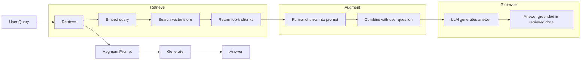
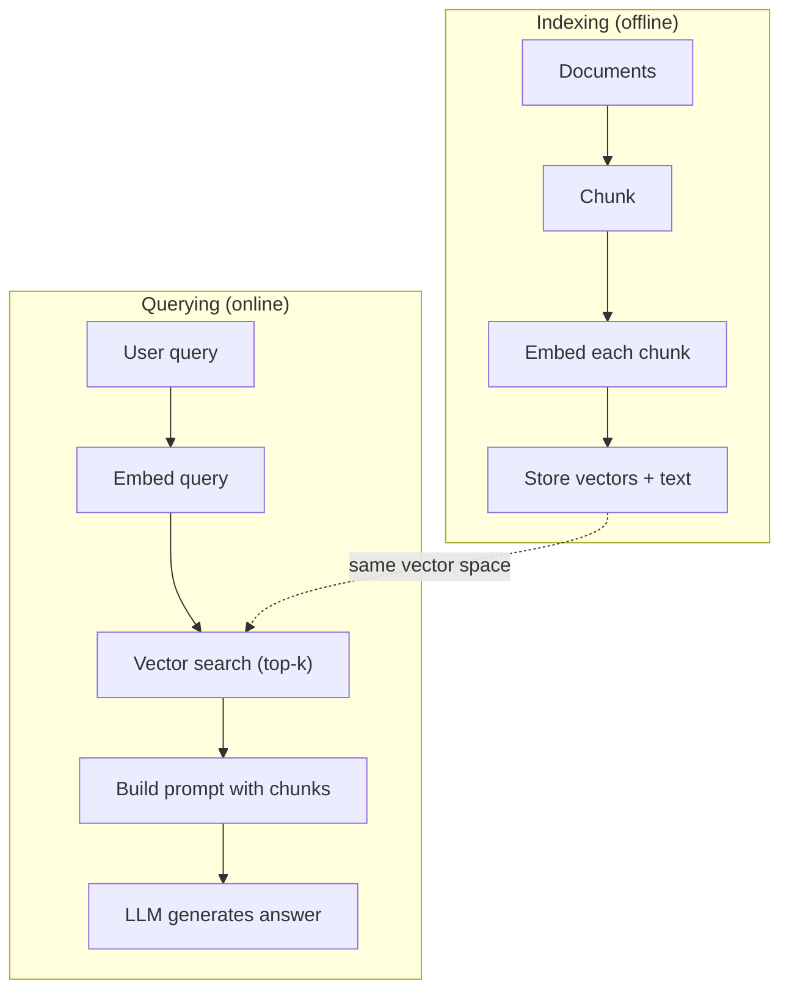

# RAG（检索增强生成）

> 你的大语言模型掌握训练截止日期之前的一切，却不了解公司的文档、代码库或上周的会议记录。RAG 通过检索相关文档并将它们放进提示词来解决这个问题。它是生产级 AI 中应用最广泛的模式。如果你只打算动手完成本课程中的一项内容，那就构建一条 RAG 流水线。

**Type:** 构建
**Languages:** Python
**Prerequisites:** 阶段 10（从零构建大语言模型），阶段 11 第 01～05 课
**Time:** 约 90 分钟
**Related:** 阶段 5 · 23（RAG 分块策略）介绍六种分块算法及各自最适合的场景。阶段 5 · 22（嵌入模型深度解析）介绍如何选择嵌入模型。阶段 11 · 07（高级 RAG）介绍混合搜索、重排序和查询转换。

## 学习目标

- 构建完整的 RAG 流水线：文档加载、分块、嵌入、向量存储、检索与生成
- 使用向量数据库（ChromaDB、FAISS 或 Pinecone）和正确的索引实现语义搜索
- 解释知识溯源型应用为何更适合使用 RAG 而不是微调（成本、时效性、来源归因）
- 使用检索指标（精确率、召回率）和生成指标（忠实度、相关性）评估 RAG 质量

## 问题

你为公司构建了一个聊天机器人。客户问：“企业版套餐的退款政策是什么？”大语言模型给出了典型 SaaS 退款政策的泛泛回答。但埋在 200 页内部 Wiki 中的真实政策规定：企业客户有 60 天退款期，并按比例退款。大语言模型从未见过这份文档，不可能知道训练数据里没有的内容。

微调是一种解决方案：拿现有大语言模型在内部文档上继续训练，再部署更新后的模型。这种方法可行，却有严重问题。微调的算力成本高达数千美元。文档一有变化，模型马上就会过时。你无法知道模型的答案取自哪个来源。如果公司下个月收购一条新的产品线，还要再微调一次。

RAG 是另一种解决方案。模型本身保持不变。问题到来时，在文档库中搜索相关段落，把它们粘贴到问题之前的提示词里，再让模型以这些段落为上下文作答。文档库几分钟内即可更新，你也能准确看到检索了哪些文档，而模型本身始终不变。RAG 因此成为生产环境中的主流模式：成本更低、内容更新、可审计性更强，而且适用于任何大语言模型。

## 概念

### RAG 模式

整个模式只需四个步骤：



查询 -> 检索 -> 增强提示词 -> 生成。每个 RAG 系统都遵循这个模式。生产级 RAG 系统之间的差异，体现在各步骤的细节上：如何分块、如何嵌入、如何搜索，以及如何构造提示词。

### RAG 为什么胜过微调

| 关注点 | 微调 | RAG |
|---------|------------|-----|
| 成本 | 每次训练 $1,000～$100,000 以上 | 每次查询 $0.01～$0.10（嵌入 + 大语言模型） |
| 时效性 | 重新训练前一直过时 | 重新索引文档后几分钟内更新 |
| 可审计性 | 无法追溯答案来源 | 可以展示实际检索到的段落 |
| 幻觉 | 仍会自由产生幻觉 | 以检索文档为依据 |
| 数据隐私 | 训练数据固化在权重中 | 文档留在你的向量存储中 |

微调会永久改变模型权重，RAG 只会临时改变模型上下文。对大多数应用而言，你需要的是临时上下文。

微调胜出的情况只有一种：你需要模型采用某种仅靠提示词无法实现的特定风格、语气或推理模式。若要检索事实知识，RAG 每次都会胜出。

### 嵌入模型

嵌入模型会把文本转换为稠密向量。含义相似的文本，会在这个高维空间中产生彼此接近的向量。“How do I reset my password?”和“I need to change my password”尽管只有少数词相同，产生的向量却几乎一致；“The cat sat on the mat”产生的向量则非常不同。

常见的嵌入模型（2026 年阵容——完整分析请参阅阶段 5 · 22）：

| 模型 | 维度 | 提供商 | 说明 |
|-------|-----------|----------|-------|
| text-embedding-3-small | 1536 (Matryoshka) | OpenAI | 适合多数使用场景，性价比最佳 |
| text-embedding-3-large | 3072 (Matryoshka) | OpenAI | 准确率更高，可截断为 256/512/1024 维 |
| Gemini Embedding 2 | 3072 (Matryoshka) | Google | MTEB 检索领先；8K 上下文 |
| voyage-4 | 1024/2048 (Matryoshka) | Voyage AI | 提供代码、金融、法律等领域变体 |
| Cohere embed-v4 | 1024 (Matryoshka) | Cohere | 多语言能力强，128K 上下文 |
| BGE-M3 | 1024 (dense + sparse + ColBERT) | BAAI (open-weight) | 一个模型提供三种表示 |
| Qwen3-Embedding | 4096 (Matryoshka) | Alibaba (open-weight) | 开放权重模型中的顶尖检索分数 |
| all-MiniLM-L6-v2 | 384 | Open-weight (Sentence Transformers) | 原型开发基线 |

本课会使用 TF-IDF 构建自己的简单嵌入。并不是因为生产系统使用 TF-IDF，而是因为它能让概念变得具体：输入文本，输出向量；相似文本产生相似向量。

### 向量相似度

给定两个向量，如何衡量相似度？有三种选择：

**余弦相似度**：两个向量夹角的余弦值。取值范围从 -1（方向相反）到 1（完全相同）。它忽略大小，只关心方向，是 RAG 的默认选择。

```
cosine_sim(a, b) = dot(a, b) / (||a|| * ||b||)
```

**点积**：原始内积。较大的向量会得到更高分。当大小本身承载信息时很有用（例如，更长的文档可能更相关）。

```
dot(a, b) = sum(a_i * b_i)
```

**L2（欧几里得）距离**：向量空间中的直线距离。距离越小，表示越相似。它对大小差异敏感。

```
L2(a, b) = sqrt(sum((a_i - b_i)^2))
```

余弦相似度是标准选择。由于它会按大小归一化，因此能够妥善处理长度不同的文档。人们说“向量搜索”时，几乎总是指余弦相似度。

### 分块策略

文档太长，不能有效地嵌入为单个向量。一份 50 页的 PDF 可能涵盖数十个主题，因此产生的嵌入会非常糟糕。你应当把文档拆成多个块，再分别嵌入每一块。

**固定大小分块**：每 N 个词元切分一次，简单且可预测。若块大小为 512 个词元、重叠为 50 个词元，则第 1 块是词元 0～511，第 2 块是词元 462～973，依此类推。重叠可以避免恰好在不合适的位置截断句子。

**语义分块**：在自然边界处分割，例如段落、章节或 Markdown 标题。每个块都是语义连贯的单元。它实现起来更复杂，但检索效果更好。

**递归分块**：先尝试在最大粒度的边界（章节标题）处分割。如果某节仍然太大，则按段落边界分割；如果段落仍然太大，则按句子边界分割。这就是 LangChain RecursiveCharacterTextSplitter 的方法，实践效果很好。

分块大小的重要性超出很多人的想象：

- 太小（64～128 个词元）：每个块缺少上下文。如果不知道“它”指什么，“它上季度增长了 15%”就毫无意义。
- 太大（2048 个以上词元）：每个块涵盖多个主题，稀释相关性。搜索收入数据时，返回的块可能只有 10% 谈收入，其余 90% 都在谈员工人数。
- 最佳平衡点（256～512 个词元）：上下文足够完整，可以独立理解，同时又足够聚焦，保持相关性。

大多数生产级 RAG 系统使用 256～512 个词元的块，并重叠 50 个词元。Anthropic 的 RAG 指南也推荐这一范围。

### 向量数据库

获得嵌入后，需要找地方存储并搜索它们。可选方案包括：

| 数据库 | 类型 | 最适合 |
|----------|------|----------|
| FAISS | 库（进程内） | 原型开发、中小型数据集 |
| Chroma | 轻量数据库 | 本地开发、小型部署 |
| Pinecone | 托管服务 | 无需承担运维开销的生产环境 |
| Weaviate | 开源数据库 | 自托管生产环境 |
| pgvector | Postgres 扩展 | 已在使用 Postgres |
| Qdrant | 开源数据库 | 高性能自托管 |

本课会构建一个简单的内存向量存储。它把向量保存在列表中，并执行暴力余弦相似度搜索，相当于使用平面索引的 FAISS。它大约可以扩展到 10 万个向量，之后速度就会变慢。生产系统使用 HNSW 等近似最近邻（ANN）算法，在数毫秒内搜索数百万个向量。

### 完整流水线



索引阶段对每篇文档执行一次（或在文档更新时执行）。查询阶段则在每次用户请求时执行。在生产环境中，索引可能需要数小时来处理数百万篇文档；查询必须在一秒内给出响应。

### 实际参数

大多数生产级 RAG 系统采用以下参数：

- **k = 5 到 10**：每次查询检索的块数
- **块大小 = 256 到 512 个词元**，并重叠 50 个词元
- **上下文预算**：每次查询使用 2,500～5,000 个词元的检索内容
- **提示词总量**：约 8,000～16,000 个词元（系统提示词 + 检索块 + 对话历史 + 用户查询）
- **嵌入维度**：根据模型不同，为 384～3072 维
- **索引吞吐量**：使用 API 嵌入时，每秒处理 100～1,000 篇文档
- **查询延迟**：检索 50～200 毫秒，生成 500～3000 毫秒

```figure
rag-chunking
```

## 动手构建

### 第 1 步：文档分块

```python
def chunk_text(text, chunk_size=200, overlap=50):
    words = text.split()
    chunks = []
    start = 0
    while start < len(words):
        end = start + chunk_size
        chunk = " ".join(words[start:end])
        chunks.append(chunk)
        start += chunk_size - overlap
    return chunks
```

### 第 2 步：TF-IDF 嵌入

我们来构建一个简单的嵌入函数。TF-IDF（词频—逆文档频率）并非神经嵌入，但它能够把文本转换为体现词语重要性的向量。一个词在文档中出现得越频繁，其 TF 越高；一个词在整个语料库中越少见，其 IDF 越高。二者相乘得到一个向量，其中重要且有区分度的词具有较高数值。

```python
import math
from collections import Counter

def build_vocabulary(documents):
    vocab = set()
    for doc in documents:
        vocab.update(doc.lower().split())
    return sorted(vocab)

def compute_tf(text, vocab):
    words = text.lower().split()
    count = Counter(words)
    total = len(words)
    return [count.get(word, 0) / total for word in vocab]

def compute_idf(documents, vocab):
    n = len(documents)
    idf = []
    for word in vocab:
        doc_count = sum(1 for doc in documents if word in doc.lower().split())
        idf.append(math.log((n + 1) / (doc_count + 1)) + 1)
    return idf

def tfidf_embed(text, vocab, idf):
    tf = compute_tf(text, vocab)
    return [t * i for t, i in zip(tf, idf)]
```

### 第 3 步：余弦相似度搜索

```python
def cosine_similarity(a, b):
    dot = sum(x * y for x, y in zip(a, b))
    norm_a = math.sqrt(sum(x * x for x in a))
    norm_b = math.sqrt(sum(x * x for x in b))
    if norm_a == 0 or norm_b == 0:
        return 0.0
    return dot / (norm_a * norm_b)

def search(query_embedding, stored_embeddings, top_k=5):
    scores = []
    for i, emb in enumerate(stored_embeddings):
        sim = cosine_similarity(query_embedding, emb)
        scores.append((i, sim))
    scores.sort(key=lambda x: x[1], reverse=True)
    return scores[:top_k]
```

### 第 4 步：构造提示词

RAG 中的“增强”就在这里发生。取出检索到的块，将其组织进提示词，再要求大语言模型基于给定上下文回答。

```python
def build_rag_prompt(query, retrieved_chunks):
    context = "\n\n---\n\n".join(
        f"[Source {i+1}]\n{chunk}"
        for i, chunk in enumerate(retrieved_chunks)
    )
    return f"""Answer the question based ONLY on the following context.
If the context doesn't contain enough information, say "I don't have enough information to answer that."

Context:
{context}

Question: {query}

Answer:"""
```

### 第 5 步：完整的 RAG 流水线

```python
class RAGPipeline:
    def __init__(self):
        self.chunks = []
        self.embeddings = []
        self.vocab = []
        self.idf = []

    def index(self, documents):
        all_chunks = []
        for doc in documents:
            all_chunks.extend(chunk_text(doc))
        self.chunks = all_chunks
        self.vocab = build_vocabulary(all_chunks)
        self.idf = compute_idf(all_chunks, self.vocab)
        self.embeddings = [
            tfidf_embed(chunk, self.vocab, self.idf)
            for chunk in all_chunks
        ]

    def query(self, question, top_k=5):
        query_emb = tfidf_embed(question, self.vocab, self.idf)
        results = search(query_emb, self.embeddings, top_k)
        retrieved = [(self.chunks[i], score) for i, score in results]
        prompt = build_rag_prompt(
            question, [chunk for chunk, _ in retrieved]
        )
        return prompt, retrieved
```

### 第 6 步：生成（模拟）

在生产环境中，你会在这里调用大语言模型 API。本课通过从检索上下文中提取最相关的句子来模拟生成。

```python
def simple_generate(prompt, retrieved_chunks):
    query_words = set(prompt.lower().split("question:")[-1].split())
    best_sentence = ""
    best_score = 0
    for chunk in retrieved_chunks:
        for sentence in chunk.split("."):
            sentence = sentence.strip()
            if not sentence:
                continue
            words = set(sentence.lower().split())
            overlap = len(query_words & words)
            if overlap > best_score:
                best_score = overlap
                best_sentence = sentence
    return best_sentence if best_sentence else "I don't have enough information."
```

## 投入使用

换成真正的嵌入模型和大语言模型后，代码几乎不变：

```python
from openai import OpenAI

client = OpenAI()

def embed(text):
    response = client.embeddings.create(
        model="text-embedding-3-small",
        input=text
    )
    return response.data[0].embedding

def generate(prompt):
    response = client.chat.completions.create(
        model="gpt-4o-mini",
        messages=[{"role": "user", "content": prompt}],
        temperature=0
    )
    return response.choices[0].message.content
```

也可以使用 Anthropic：

```python
import anthropic

client = anthropic.Anthropic()

def generate(prompt):
    response = client.messages.create(
        model="claude-sonnet-5",
        max_tokens=1024,
        messages=[{"role": "user", "content": prompt}]
    )
    return response.content[0].text
```

流水线保持不变：替换嵌入函数，再替换生成函数。无论使用哪个模型，检索逻辑、分块和提示词构造都完全相同。

大规模向量存储应当用真正的向量数据库替换暴力搜索：

```python
import chromadb

client = chromadb.Client()
collection = client.create_collection("my_docs")

collection.add(
    documents=chunks,
    ids=[f"chunk_{i}" for i in range(len(chunks))]
)

results = collection.query(
    query_texts=["What is the refund policy?"],
    n_results=5
)
```

Chroma 在内部完成嵌入（默认使用 all-MiniLM-L6-v2），并把向量存储在本地数据库中。模式相同，只是底层管道不同。

## 交付成果

本课会产出：
- `outputs/prompt-rag-architect.md`——用于为具体使用场景设计 RAG 系统的提示词
- `outputs/skill-rag-pipeline.md`——指导 Agent 构建和调试 RAG 流水线的技能

## 练习

1. 用简单的词袋方法（二元表示：词出现则为 1，否则为 0）替换 TF-IDF 嵌入。在示例文档上比较检索质量。TF-IDF 应当表现更好，因为它会为稀有词赋予更高权重。

2. 试验分块大小：在同一组文档上分别使用 50、100、200 和 500 词的块。对每种大小运行相同的 5 个查询，并统计其中有多少能在前 3 个结果中返回相关块。找出检索质量达到峰值的最佳平衡点。

3. 为每个块添加元数据（源文档名称、块的位置）。修改提示词模板，加入来源归因，让大语言模型引用其信息来源。

4. 实现一个简单评估：给定 10 组问答，让每个问题通过 RAG 流水线，并测量检索到的块中包含答案的比例。这就是 k 值下的检索召回率。

5. 构建可感知对话的 RAG 流水线：维护最近 3 次交互的历史，并将其与检索到的块一起放入提示词。先询问定价，再追问“What about enterprise?”之类的问题进行测试。

## 关键术语

| 术语 | 人们常说 | 实际含义 |
|------|----------------|----------------------|
| RAG | “能读取文档的 AI” | 检索相关文档，将其放入提示词，再生成以这些文档为依据的回答 |
| 嵌入 | “把文本转换为数字” | 文本的稠密向量表示；含义相似的文本会产生相似向量 |
| 向量数据库 | “AI 的搜索引擎” | 为存储向量并按相似度查找最近邻而优化的数据存储 |
| 分块 | “把文档拆成片段” | 将文档分成较小片段（通常为 256～512 个词元），让各片段可以独立嵌入和检索 |
| 余弦相似度 | “两个向量有多相似” | 向量夹角的余弦值；1 表示方向相同，0 表示正交，-1 表示方向相反 |
| Top-k 检索 | “获取 k 个最佳匹配” | 从向量存储中返回与查询最相似的 k 个块 |
| 上下文窗口 | “大语言模型能看到多少文本” | 大语言模型在一次请求中可处理的最大词元数；检索到的块必须能放入其中 |
| 增强生成 | “使用给定上下文作答” | 使用检索文档作为上下文生成回答，而不是只依赖训练得到的知识 |
| TF-IDF | “词语重要性评分” | 词频乘以逆文档频率；按照词在语料库中的区分度为其加权 |
| 索引 | “为搜索准备文档” | 对文档进行分块、嵌入和存储的离线过程，使文档可以在查询时被搜索 |

## 延伸阅读

- Lewis 等，“Retrieval-Augmented Generation for Knowledge-Intensive NLP Tasks”（2020）——Facebook AI Research 的原始 RAG 论文，正式提出“先检索、后生成”模式
- Anthropic 的 RAG 文档（docs.anthropic.com）——关于分块大小、提示词构造和评估的实用指南
- Pinecone Learning Center，“What is RAG?”——用清晰的可视化解释 RAG 流水线及生产环境注意事项
- Sentence-BERT：Reimers 与 Gurevych（2019）——all-MiniLM 嵌入模型背后的论文，介绍如何训练用于语义相似度的双编码器
- [Karpukhin 等，“Dense Passage Retrieval for Open-Domain Question Answering”（EMNLP 2020）](https://arxiv.org/abs/2004.04906)——DPR 论文；它证明了稠密双编码器检索在开放域问答上优于 BM25，并奠定了现代 RAG 检索器的模式。
- [LlamaIndex 高层概念](https://docs.llamaindex.ai/en/stable/getting_started/concepts.html)——构建 RAG 流水线时需要掌握的主要概念：数据加载器、节点解析器、索引、检索器和响应合成器。
- [LangChain RAG 教程](https://python.langchain.com/docs/tutorials/rag/)——另一种风格的编排器；从可运行链的视角呈现同一套“先检索、后生成”模式。
