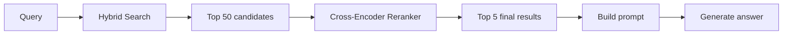
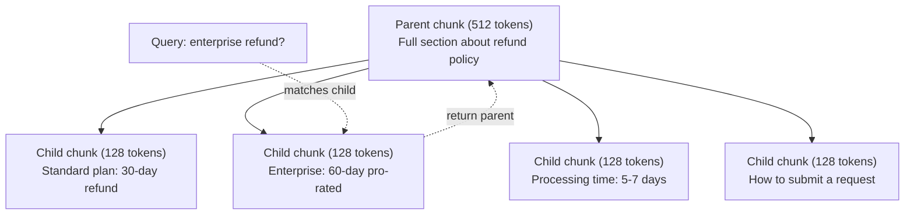
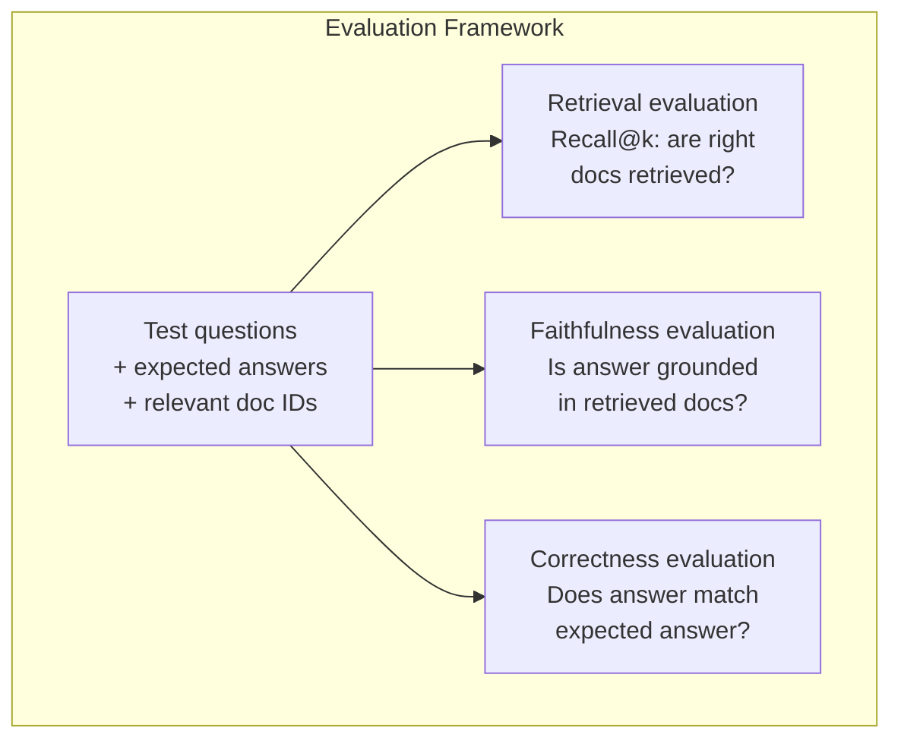

# 高级 RAG（分块、重排序与混合搜索）

> 基础 RAG 会检索相似度最高的 top-k 个块。它可以处理简单问题，却会在多跳推理、模糊查询和大型语料库面前失效。高级 RAG 是只能在 10 篇文档上运行的演示，与能在 1000 万篇文档上运行的系统之间的分水岭。

**Type:** 构建
**Languages:** Python
**Prerequisites:** 阶段 11 第 06 课（RAG）
**Time:** 约 90 分钟
**Related:** 阶段 5 · 23（RAG 分块策略）介绍全部六种分块算法——递归分块、语义分块、按句子分块、父文档分块、延迟分块和上下文检索，并给出 Vectara/Anthropic 基准。本课在此基础上继续构建：混合搜索、重排序与查询转换。

## 学习目标

- 实现能够保留文档结构和上下文的高级分块策略（语义、递归、父子分块）
- 构建混合搜索流水线，将 BM25 关键词匹配、语义向量搜索和交叉编码器重排序结合起来
- 应用查询转换技术（HyDE、多查询、回退提示），改善模糊或复杂问题的检索效果
- 诊断并修复常见 RAG 故障：检索到错误的块、上下文中没有答案、多跳推理中断

## 问题

你已经在第 06 课构建了一条基础 RAG 流水线。它能处理小型语料库中的直接问题。现在试试下面这些问题：

**模糊查询**：“上季度的收入是多少？”语义搜索返回了有关收入战略、收入预测，以及首席财务官对收入增长看法的文本块。它们在语义上都与“收入”一词相似，却没有一个包含实际数字。正确文本块写的是“2025 年第三季度收益为 4720 万美元”，使用的是“收益”而不是“收入”。嵌入模型认为“收入战略”比“第三季度收益为 4720 万美元”更接近查询。

**多跳问题**：“哪个团队的客户满意度分数提升最大？”这要求先找到每个团队的满意度分数，再进行比较并确定最大值。没有任何一个文本块包含完整答案，信息散落在各团队报告中。

**大型语料库问题**：你有 200 万个文本块，正确答案位于第 1,847,293 个块。top-5 检索返回的却是第 14、89,201、1,200,000、44 和 901,333 个块。它们在嵌入空间中很接近，但没有一个包含答案。在这种规模下，近似最近邻搜索引入的误差足以把相关结果挤出 top-k。

基础 RAG 之所以失败，是因为向量相似度并不等同于相关性。一个文本块可能在语义上与查询相似，却无法用于回答问题。高级 RAG 使用四种技术解决这一点：混合搜索（加入关键词匹配）、重排序（更细致地为候选项评分）、查询转换（搜索前先改进查询），以及更好的分块（以正确粒度检索）。

## 概念

### 混合搜索：语义 + 关键词

语义搜索（向量相似度）善于理解含义。“How do I cancel my subscription?”即使与“Steps to terminate your plan”没有共同词语，也能匹配成功；但它会漏掉精确匹配。如果嵌入模型把“E-4021”当作噪声，“Error code E-4021”就可能无法匹配包含“E-4021”的文本块。

关键词搜索（BM25）恰好相反。它擅长精确匹配，“E-4021”可以完美命中；但如果文档写的是“terminate your plan”，“cancel my subscription”就会返回零条结果。

混合搜索会同时运行二者，再合并结果。

**BM25**（Best Matching 25）是标准的关键词搜索算法，自 20 世纪 90 年代起就一直是搜索引擎的支柱。其公式如下：

```
BM25(q, d) = sum over terms t in q:
    IDF(t) * (tf(t,d) * (k1 + 1)) / (tf(t,d) + k1 * (1 - b + b * |d| / avgdl))
```

其中，tf(t,d) 是词项 t 在文档 d 中的词频，IDF(t) 是逆文档频率，|d| 是文档长度，avgdl 是平均文档长度，k1 控制词频饱和度（默认值 1.2），b 控制长度归一化（默认值 0.75）。

通俗地说：文档包含查询词项时，BM25 会给出更高分，稀有词项的贡献尤其大；但重复出现同一词项的收益会逐渐递减。一篇包含“revenue”50 次的文档，并不会比只包含一次的文档相关 50 倍。

### 倒数排名融合（RRF）

现在有两个排序列表：一个来自向量搜索，一个来自 BM25。如何合并它们？标准方法是倒数排名融合（Reciprocal Rank Fusion）。

```
RRF_score(d) = sum over rankings R:
    1 / (k + rank_R(d))
```

其中 k 是一个常数（通常为 60），用于防止排名第一的结果占据绝对优势。

一篇在向量搜索中排第 1、在 BM25 中排第 5 的文档，得分为：1/(60+1) + 1/(60+5) = 0.0164 + 0.0154 = 0.0318。

一篇在向量搜索中排第 3、在 BM25 中排第 2 的文档，得分为：1/(60+3) + 1/(60+2) = 0.0159 + 0.0161 = 0.0320。

RRF 会自然平衡两种信号。在两个列表中都排名靠前的文档得分最高；仅在一个列表中排名第一、而未出现在另一个列表中的文档只能得到中等分数。它使用名次而不是原始分数，因此不受两个系统分数分布差异的影响，具有很强的稳健性。

### 重排序

无论使用向量、关键词还是混合方式，检索都很快，但不够精确。它使用双编码器：分别嵌入查询和每篇文档，再进行比较。嵌入只计算一次并缓存下来，因此可以扩展到数百万篇文档。

重排序使用交叉编码器：把查询和一篇候选文档一起输入模型，输出相关性分数。模型可以同时看到两段文本，并捕捉它们之间细粒度的交互。即使双编码器没有发现联系，交叉编码器也能理解“What were Q3 earnings?”与包含“$47.2M in Q3”的文本块高度相关。

代价是：交叉编码器比双编码器慢 100～1000 倍，因为它要联合处理每一对查询与文档。你无法为 100 万篇文档预先计算交叉编码器分数。解决方案是：先用混合搜索检索更大的候选集（top-50），再通过交叉编码器重排序，得到最终 top-5。



常见的重排序模型（2026 年阵容）：
- Cohere Rerank 3.5：托管 API，支持多语言，在混合语料库上的召回率提升最佳
- Voyage rerank-2.5：托管 API，在托管方案中延迟最低
- Jina-Reranker-v2 Multilingual：开放权重，支持 100 多种语言
- bge-reranker-v2-m3：开放权重，强力基线
- cross-encoder/ms-marco-MiniLM-L-6-v2：开放权重，可在 CPU 上运行，适合原型开发
- ColBERTv2 / Jina-ColBERT-v2：后期交互式多向量重排序器——评分时复杂度为 O(tokens)，而非 O(docs)

### 查询转换

有时问题不在检索，而在查询本身。“关于那项新政策变更的内容是什么？”是一个糟糕的搜索查询，其中没有具体词项，嵌入也很模糊。任何检索系统都无法仅凭这样的查询找到正确文档。

**查询改写**：把用户查询改写成更好的搜索查询。大语言模型可以这样处理：

```
User: "What was that thing about the new policy change?"
Rewritten: "Recent policy changes and updates"
```

**HyDE（假设文档嵌入）**：不直接使用查询搜索，而是先生成一段假设答案，嵌入该答案，再搜索与其相似的真实文档。

```
Query: "What is the refund policy for enterprise?"
Hypothetical answer: "Enterprise customers are eligible for a full refund
within 60 days of purchase. Refunds are pro-rated based on the remaining
subscription period and processed within 5-7 business days."
```

嵌入这段假设答案，再搜索与其相似的真实文档。直觉是：在嵌入空间中，假设答案比原始问题更接近真实答案，因为问题和答案采用不同的语言结构。生成一段假设答案，就跨越了嵌入空间中“问题空间”和“答案空间”之间的鸿沟。

HyDE 会在检索前增加一次大语言模型调用，使延迟增加 500～2000 毫秒。当原始查询的检索质量不佳时，这笔开销值得付出。

### 父子分块

标准分块迫使你做出取舍：使用小块可实现精确检索，使用大块则能保留充足上下文。父子分块消除了这种取舍。

为检索建立小块（128 个词元）的索引。当某个小块被检索到时，把它的父块（512 个词元）放入提示词。小块可精确匹配查询，父块则为大语言模型生成优质回答提供足够上下文。



查询“enterprise refund?”会精确匹配子块 C2，但提示词接收完整的父块 P，其中还包含有关处理时间与提交申请流程的周边上下文。

### 元数据过滤

运行向量搜索之前，先按元数据过滤语料库，例如日期、来源、类别、作者和语言。这样可以缩小搜索空间，避免出现无关结果。

“上个月的安全策略发生了什么变化？”应当只搜索最近 30 天内安全类别的文档。如果没有元数据过滤，你会搜索整个语料库，可能检索到一篇两年前的安全文档，仅仅因为它在语义上相似。

生产级 RAG 系统会把元数据与每个文本块一起存储：源文档、创建日期、类别、作者、版本。向量数据库支持在相似度搜索前按元数据预先过滤；要在大规模数据上保障性能，这一点至关重要。

### 评估

你已经构建了一个 RAG 系统，怎样判断它是否有效？可以使用三项指标：

**检索相关性（Recall@k）**：对一组已知相关文档的测试问题，有多少相关文档出现在 top-k 结果中？如果某个问题的答案位于第 47 个文本块，那么它是否出现在 top-5 中？

**忠实度**：生成的回答是否以检索文档为依据？如果检索块写的是“60 天退款期”，模型却说“90 天退款期”，这就是忠实度失败。尽管上下文正确，模型还是产生了幻觉。

**答案正确性**：生成的回答是否与预期答案一致？这是端到端指标，结合了检索质量与生成质量。

一种简单的忠实度检查方法是：提取生成答案中的每项主张，验证其含义是否出现在检索块中。如果答案包含任何检索块都没有的事实，就很可能是幻觉。



```figure
agentic-rag-loop
```

## 动手构建

### 第 1 步：实现 BM25

```python
import math
from collections import Counter

class BM25:
    def __init__(self, k1=1.2, b=0.75):
        self.k1 = k1
        self.b = b
        self.docs = []
        self.doc_lengths = []
        self.avg_dl = 0
        self.doc_freqs = {}
        self.n_docs = 0

    def index(self, documents):
        self.docs = documents
        self.n_docs = len(documents)
        self.doc_lengths = []
        self.doc_freqs = {}

        for doc in documents:
            words = doc.lower().split()
            self.doc_lengths.append(len(words))
            unique_words = set(words)
            for word in unique_words:
                self.doc_freqs[word] = self.doc_freqs.get(word, 0) + 1

        self.avg_dl = sum(self.doc_lengths) / self.n_docs if self.n_docs else 1

    def score(self, query, doc_idx):
        query_words = query.lower().split()
        doc_words = self.docs[doc_idx].lower().split()
        doc_len = self.doc_lengths[doc_idx]
        word_counts = Counter(doc_words)
        score = 0.0

        for term in query_words:
            if term not in word_counts:
                continue
            tf = word_counts[term]
            df = self.doc_freqs.get(term, 0)
            idf = math.log((self.n_docs - df + 0.5) / (df + 0.5) + 1)
            numerator = tf * (self.k1 + 1)
            denominator = tf + self.k1 * (1 - self.b + self.b * doc_len / self.avg_dl)
            score += idf * numerator / denominator

        return score

    def search(self, query, top_k=10):
        scores = [(i, self.score(query, i)) for i in range(self.n_docs)]
        scores.sort(key=lambda x: x[1], reverse=True)
        return scores[:top_k]
```

### 第 2 步：倒数排名融合

```python
def reciprocal_rank_fusion(ranked_lists, k=60):
    scores = {}
    for ranked_list in ranked_lists:
        for rank, (doc_id, _) in enumerate(ranked_list):
            if doc_id not in scores:
                scores[doc_id] = 0.0
            scores[doc_id] += 1.0 / (k + rank + 1)
    fused = sorted(scores.items(), key=lambda x: x[1], reverse=True)
    return fused
```

### 第 3 步：混合搜索流水线

```python
def hybrid_search(query, chunks, vector_embeddings, vocab, idf, bm25_index, top_k=5, fusion_k=60):
    query_emb = tfidf_embed(query, vocab, idf)
    vector_results = search(query_emb, vector_embeddings, top_k=top_k * 3)
    bm25_results = bm25_index.search(query, top_k=top_k * 3)
    fused = reciprocal_rank_fusion([vector_results, bm25_results], k=fusion_k)
    return fused[:top_k]
```

### 第 4 步：简单重排序器

生产环境中应使用交叉编码器模型。这里，我们构建一个重排序器，根据词语重叠、词项重要性和短语匹配为查询—文档相关性打分。

```python
def rerank(query, candidates, chunks):
    query_words = set(query.lower().split())
    stop_words = {"the", "a", "an", "is", "are", "was", "were", "what", "how",
                  "why", "when", "where", "do", "does", "for", "of", "in", "to",
                  "and", "or", "on", "at", "by", "it", "its", "this", "that",
                  "with", "from", "be", "has", "have", "had", "not", "but"}
    query_terms = query_words - stop_words

    scored = []
    for doc_id, initial_score in candidates:
        chunk = chunks[doc_id].lower()
        chunk_words = set(chunk.split())

        term_overlap = len(query_terms & chunk_words)

        query_bigrams = set()
        q_list = [w for w in query.lower().split() if w not in stop_words]
        for i in range(len(q_list) - 1):
            query_bigrams.add(q_list[i] + " " + q_list[i + 1])
        bigram_matches = sum(1 for bg in query_bigrams if bg in chunk)

        position_boost = 0
        for term in query_terms:
            pos = chunk.find(term)
            if pos != -1 and pos < len(chunk) // 3:
                position_boost += 0.5

        rerank_score = (
            term_overlap * 1.0
            + bigram_matches * 2.0
            + position_boost
            + initial_score * 5.0
        )
        scored.append((doc_id, rerank_score))

    scored.sort(key=lambda x: x[1], reverse=True)
    return scored
```

### 第 5 步：HyDE（假设文档嵌入）

```python
def hyde_generate_hypothesis(query):
    templates = {
        "what": "The answer to '{query}' is as follows: Based on our documentation, {topic} involves specific policies and procedures that define how the process works.",
        "how": "To address '{query}': The process involves several steps. First, you need to initiate the request. Then, the system processes it according to the defined rules.",
        "default": "Regarding '{query}': Our records indicate specific details and policies related to this topic that provide a comprehensive answer."
    }
    query_lower = query.lower()
    if query_lower.startswith("what"):
        template = templates["what"]
    elif query_lower.startswith("how"):
        template = templates["how"]
    else:
        template = templates["default"]

    topic_words = [w for w in query.lower().split()
                   if w not in {"what", "is", "the", "how", "do", "does", "a", "an",
                                "for", "of", "to", "in", "on", "at", "by", "and", "or"}]
    topic = " ".join(topic_words) if topic_words else "this topic"

    return template.format(query=query, topic=topic)


def hyde_search(query, chunks, vector_embeddings, vocab, idf, top_k=5):
    hypothesis = hyde_generate_hypothesis(query)
    hypothesis_emb = tfidf_embed(hypothesis, vocab, idf)
    results = search(hypothesis_emb, vector_embeddings, top_k)
    return results, hypothesis
```

### 第 6 步：父子分块

```python
def create_parent_child_chunks(text, parent_size=200, child_size=50):
    words = text.split()
    parents = []
    children = []
    child_to_parent = {}

    parent_idx = 0
    start = 0
    while start < len(words):
        parent_end = min(start + parent_size, len(words))
        parent_text = " ".join(words[start:parent_end])
        parents.append(parent_text)

        child_start = start
        while child_start < parent_end:
            child_end = min(child_start + child_size, parent_end)
            child_text = " ".join(words[child_start:child_end])
            child_idx = len(children)
            children.append(child_text)
            child_to_parent[child_idx] = parent_idx
            child_start += child_size

        parent_idx += 1
        start += parent_size

    return parents, children, child_to_parent
```

### 第 7 步：忠实度评估

```python
def evaluate_faithfulness(answer, retrieved_chunks):
    answer_sentences = [s.strip() for s in answer.split(".") if len(s.strip()) > 10]
    if not answer_sentences:
        return 1.0, []

    grounded = 0
    ungrounded = []
    context = " ".join(retrieved_chunks).lower()

    for sentence in answer_sentences:
        words = set(sentence.lower().split())
        stop_words = {"the", "a", "an", "is", "are", "was", "were", "and", "or",
                      "to", "of", "in", "for", "on", "at", "by", "it", "this", "that"}
        content_words = words - stop_words
        if not content_words:
            grounded += 1
            continue

        matched = sum(1 for w in content_words if w in context)
        ratio = matched / len(content_words) if content_words else 0

        if ratio >= 0.5:
            grounded += 1
        else:
            ungrounded.append(sentence)

    score = grounded / len(answer_sentences) if answer_sentences else 1.0
    return score, ungrounded


def evaluate_retrieval_recall(queries_with_relevant, retrieval_fn, k=5):
    total_recall = 0.0
    results = []

    for query, relevant_indices in queries_with_relevant:
        retrieved = retrieval_fn(query, k)
        retrieved_indices = set(idx for idx, _ in retrieved)
        relevant_set = set(relevant_indices)
        hits = len(retrieved_indices & relevant_set)
        recall = hits / len(relevant_set) if relevant_set else 1.0
        total_recall += recall
        results.append({
            "query": query,
            "recall": recall,
            "hits": hits,
            "total_relevant": len(relevant_set)
        })

    avg_recall = total_recall / len(queries_with_relevant) if queries_with_relevant else 0
    return avg_recall, results
```

## 投入使用

使用真正的交叉编码器进行重排序：

```python
from sentence_transformers import CrossEncoder

reranker = CrossEncoder("cross-encoder/ms-marco-MiniLM-L-6-v2")

def rerank_with_cross_encoder(query, candidates, chunks, top_k=5):
    pairs = [(query, chunks[doc_id]) for doc_id, _ in candidates]
    scores = reranker.predict(pairs)
    scored = list(zip([doc_id for doc_id, _ in candidates], scores))
    scored.sort(key=lambda x: x[1], reverse=True)
    return scored[:top_k]
```

使用 Cohere 的托管重排序器：

```python
import cohere

co = cohere.Client()

def rerank_with_cohere(query, candidates, chunks, top_k=5):
    docs = [chunks[doc_id] for doc_id, _ in candidates]
    response = co.rerank(
        model="rerank-english-v3.0",
        query=query,
        documents=docs,
        top_n=top_k
    )
    return [(candidates[r.index][0], r.relevance_score) for r in response.results]
```

使用真正的大语言模型实现 HyDE：

```python
import anthropic

client = anthropic.Anthropic()

def hyde_with_llm(query):
    response = client.messages.create(
        model="claude-sonnet-5",
        max_tokens=256,
        messages=[{
            "role": "user",
            "content": f"Write a short paragraph that would be a good answer to this question. Do not say you don't know. Just write what the answer would look like.\n\nQuestion: {query}"
        }]
    )
    return response.content[0].text
```

使用 Weaviate 进行生产级混合搜索：

```python
import weaviate

client = weaviate.connect_to_local()

collection = client.collections.get("Documents")
response = collection.query.hybrid(
    query="enterprise refund policy",
    alpha=0.5,
    limit=10
)
```

alpha 参数控制两者的平衡：0.0 表示纯关键词搜索（BM25），1.0 表示纯向量搜索，0.5 表示权重相等。大多数生产系统使用 0.3～0.7 之间的 alpha。

## 交付成果

本课会产出：
- `outputs/prompt-advanced-rag-debugger.md`——用于诊断和修复 RAG 质量问题的提示词
- `outputs/skill-advanced-rag.md`——用于通过混合搜索与重排序构建生产级 RAG 的技能

## 练习

1. 在示例文档上比较 BM25、向量搜索与混合搜索。对 5 个测试查询，分别记录哪种方法能把最相关的文本块排在第 1 位。混合搜索应当至少赢得其中 3 个。

2. 实现元数据过滤器。为每篇文档添加“category”字段（security、billing、api、product）。运行向量搜索前，只保留相关类别的文本块。使用“What encryption is used?”进行测试，并验证它只会搜索 security 类别的文本块。

3. 使用第 06 课的简单生成函数构建完整的 HyDE 流水线。在全部 5 个测试查询上，比较直接查询搜索与 HyDE 搜索的检索质量（top-3 相关性）。HyDE 应当能改善模糊查询的结果。

4. 在示例文档上实现父子分块策略。设置 child_size=30、parent_size=100。用子块搜索，但在提示词中返回父块。把生成答案与 chunk_size=50 的标准分块结果进行比较。

5. 创建评估数据集：10 个问题及其已知答案块。分别测量以下方式的 Recall@3、Recall@5 和 Recall@10：（a）仅向量搜索；（b）仅 BM25；（c）混合搜索；（d）混合搜索 + 重排序。绘制结果，并找出重排序帮助最大的场景。

## 关键术语

| 术语 | 人们常说 | 实际含义 |
|------|----------------|----------------------|
| BM25 | “关键词搜索” | 按词频、逆文档频率和文档长度归一化为文档打分的概率排序算法 |
| 混合搜索 | “取两者之长” | 并行运行语义（向量）搜索和关键词（BM25）搜索，再通过排名融合来合并结果 |
| 倒数排名融合 | “合并排序列表” | 在全部列表中对每篇文档的 1/(k + rank) 求和，从而合并多个排序列表 |
| 重排序 | “第二轮评分” | 使用成本更高的交叉编码器模型，为初次检索得到的候选集重新打分 |
| 交叉编码器 | “查询—文档联合模型” | 把查询和文档作为单个输入并输出相关性分数的模型；比双编码器准确，但速度太慢，不适合搜索整个语料库 |
| 双编码器 | “独立嵌入模型” | 分别嵌入查询和文档的模型；由于嵌入可以预计算，速度很快，但准确率低于交叉编码器 |
| HyDE | “用虚构答案搜索” | 为查询生成一段假设答案，嵌入该答案，再搜索与其相似的真实文档 |
| 父子分块 | “小块搜索，大块上下文” | 为精确检索建立小块索引，但返回更大的父块，以提供足够上下文 |
| 元数据过滤 | “搜索前缩小范围” | 运行向量搜索前，按日期、来源、类别等属性过滤文档，以缩小搜索空间 |
| 忠实度 | “是否忠于依据” | 生成的回答是否得到检索文档支持，而不是依据模型训练数据产生幻觉 |

## 延伸阅读

- Robertson 与 Zaragoza，“The Probabilistic Relevance Framework: BM25 and Beyond”（2009）——BM25 的权威参考，解释其公式背后的概率基础
- Cormack 等，“Reciprocal Rank Fusion Outperforms Condorcet and Individual Rank Learning Methods”（2009）——RRF 原始论文，证明它优于更复杂的融合方法
- Gao 等，“Precise Zero-Shot Dense Retrieval without Relevance Labels”（2022）——HyDE 论文，证明假设文档嵌入无需任何训练数据即可改善检索
- Nogueira 与 Cho，“Passage Re-ranking with BERT”（2019）——证明在 BM25 结果上使用交叉编码器重排序，可以显著改善检索质量
- [Khattab 等，“DSPy: Compiling Declarative Language Model Calls into Self-Improving Pipelines”（2023）](https://arxiv.org/abs/2310.03714)——把提示词构造和权重选择视为检索流水线上的优化问题；若想从“提示大语言模型”转向“编程大语言模型”，请阅读此文。
- [Edge 等，“From Local to Global: A Graph RAG Approach to Query-Focused Summarization”（Microsoft Research 2024）](https://arxiv.org/abs/2404.16130)——GraphRAG 论文：通过实体—关系抽取和 Leiden 社区发现实现面向查询的摘要，并阐明全局检索与局部检索的区别。
- [Asai 等，“Self-RAG: Learning to Retrieve, Generate, and Critique through Self-Reflection”（ICLR 2024）](https://arxiv.org/abs/2310.11511)——使用反思词元实现可自我评估的 RAG；这是超越静态“检索—生成”的智能体化前沿。
- [LangChain 查询构造博文](https://blog.langchain.dev/query-construction/)——介绍如何在检索前把自然语言查询转换为结构化数据库查询（Text-to-SQL、Cypher）。
