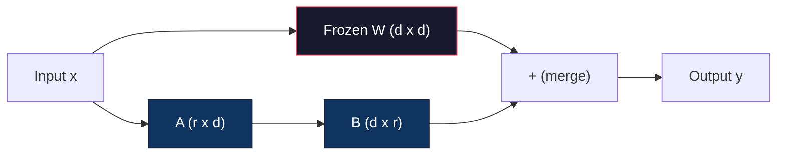
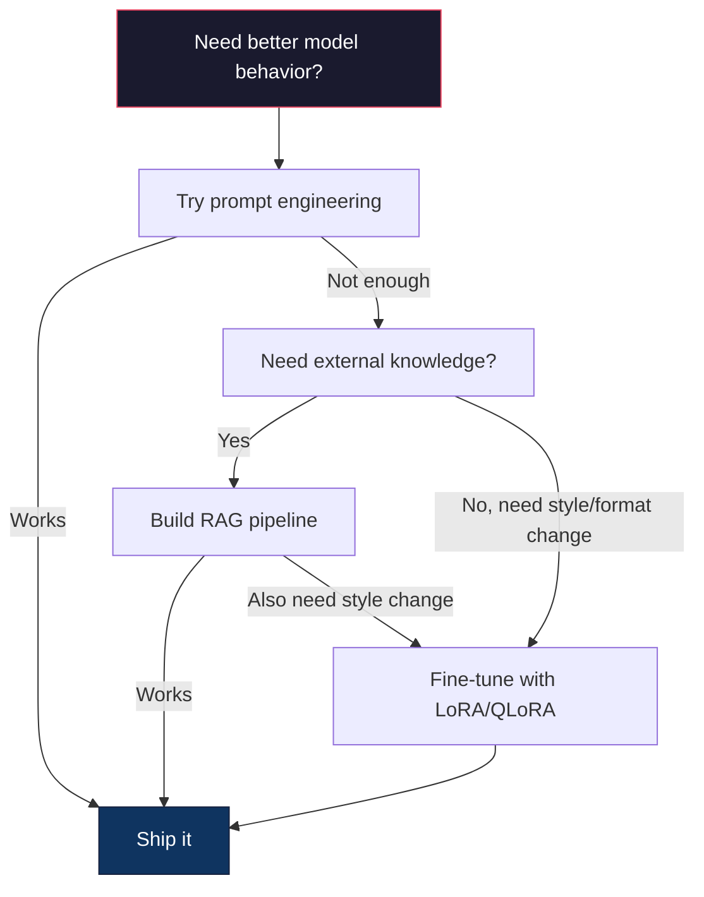

# 使用 LoRA 与 QLoRA 进行微调

> 对一个 7B 模型进行全量微调需要 56GB 显存，而你没有这么多显存，大多数公司也没有。LoRA 只训练不到 1% 的参数，就能让你在 6GB 显存中微调同一个模型。这并不是妥协——在大多数任务上，它能达到与全量微调相当的质量。整个开源微调生态都建立在这一技巧之上。

**Type:** 构建
**Languages:** Python
**Prerequisites:** 阶段 10 第 06 课（指令微调 / SFT）
**Time:** 约 75 分钟
**Related:** 阶段 10 从零讲解 SFT/DPO 循环。本课将它们接入 2026 年的 PEFT 工具链（PEFT、TRL、Unsloth、Axolotl、LLaMA-Factory）。

## 学习目标

- 通过向预训练模型的注意力层注入低秩适配器矩阵（A 和 B）来实现 LoRA
- 计算 LoRA 相比全量微调节省的参数量：对 d_model 维度使用秩 r 时，只训练 2*r*d 个参数，而不是 d^2 个参数
- 使用 QLoRA（4 位量化基座 + LoRA 适配器）微调模型，使其能放入消费级 GPU 显存
- 将 LoRA 权重合并回基础模型以便部署，并比较使用与不使用适配器时的推理速度

## 问题

你有一个基础模型 Llama 3 8B，希望它用公司的口吻回复客服工单。SFT 是正确方法，但它存在成本问题。

全量微调会更新模型中的每一个参数。Llama 3 8B 有 80 亿个参数。在 fp16 下，每个参数占 2 字节，仅加载权重就需要 16GB。训练时还需要梯度（16GB）、Adam 优化器状态（动量与方差共 32GB）和激活值，总计约需 56GB 显存才能训练一个 8B 模型。

一张 80GB 的 A100 也只是勉强装下。云服务商的两张 A100 每小时需要 3～4 美元。用 50,000 个样本训练 3 个 epoch 需要 6～10 小时，每次实验成本为 30～40 美元。为了调好超参数而运行 10 次实验，就会在部署任何东西之前花掉 400 美元。

把规模扩大到 Llama 3 70B 后，数字就荒谬了：仅权重就需要 140GB，必须使用集群，每次实验要花 100 美元以上。

还有一个更深层的问题。全量微调会修改模型的每个权重。如果用客服数据进行微调，模型的通用能力可能会退化，这叫灾难性遗忘。模型在你的任务上表现更好，却在其他所有方面变差。

你需要一种训练参数更少、占用内存更低，而且不会破坏模型既有知识的方法。

## 概念

### LoRA：低秩适配

Microsoft 的 Edward Hu 及其同事于 2021 年 6 月发表了 LoRA。论文的核心洞见是：微调期间的权重更新具有较低的内在秩。一个 4096x4096 的权重矩阵包含 1670 多万个参数，但无须更新所有参数；秩为 16 或 32 的矩阵就能捕获更新中的有效信息。

数学表示如下。标准线性层计算：

```
y = Wx
```

其中 W 是一个 d_out x d_in 矩阵。对于 4096x4096 的注意力投影，这意味着 16,777,216 个参数。

LoRA 冻结 W，并加入一个低秩分解：

```
y = Wx + BAx
```

其中 B 的形状为（d_out x r），A 的形状为（r x d_in）。秩 r 远小于 d，通常取 8、16 或 32。

对于 4096x4096 的层，当 r=16 时：
- 原始参数：4096 x 4096 = 16,777,216
- LoRA 参数：(4096 x 16) + (16 x 4096) = 65,536 + 65,536 = 131,072
- 比例：131,072 / 16,777,216 = 0.78%

你只训练 0.78% 的参数，就能获得全量微调 95%～100% 的质量。



A 使用随机高斯分布初始化，B 初始化为零。这意味着 LoRA 的初始贡献为零——模型从原始行为开始训练，再逐渐学会适配。

### 缩放因子 Alpha

LoRA 引入缩放因子 alpha，用来控制低秩更新对输出的影响程度：

```
y = Wx + (alpha / r) * BAx
```

当 alpha = r 时，缩放比例为 1 倍；当 alpha = 2r 时（常见默认值），缩放比例为 2 倍。这个超参数可以独立于基础学习率，控制 LoRA 路径的学习速率。

实用建议：
- alpha = 2 * rank 是社区常见约定（原始论文在多数实验中使用 alpha = rank）
- alpha = rank 表示 1 倍缩放，较为保守但稳定
- 更高的 alpha 意味着每一步更新更大，既可能加速收敛，也可能导致不稳定

### 在哪些层应用 LoRA

Transformer 包含许多线性层，无须为每一层都加入 LoRA。原始论文测试了不同组合：

| 目标层 | 可训练参数（7B） | 质量 |
|--------------|----------------------|---------|
| 仅 q_proj | 4.7M | 良好 |
| q_proj + v_proj | 9.4M | 更好 |
| q_proj + k_proj + v_proj + o_proj | 18.9M | 注意力层上的最佳效果 |
| 所有线性层（注意力 + MLP） | 37.7M | 收益有限，参数量翻倍 |

多数任务的最佳平衡点是 q_proj + v_proj。它们对应自注意力中的查询投影和值投影，决定模型关注什么，以及提取哪些信息。对代码生成等复杂任务，加入 MLP 层会有所帮助，但参数量会翻倍，而在较简单任务上的收益逐渐减小。

### 秩的选择

秩 r 控制适配的表达能力：

| 秩 | 可训练参数（每层） | 最适合 |
|------|---------------------------|----------|
| 4 | 32,768 | 简单分类、情感分析 |
| 8 | 65,536 | 单领域问答、摘要 |
| 16 | 131,072 | 多领域任务、指令遵循 |
| 32 | 262,144 | 复杂推理、代码生成 |
| 64 | 524,288 | 多数任务开始收益递减 |
| 128 | 1,048,576 | 很少有充分理由使用 |

Hu 等人的研究表明，r=4 已经能捕获简单任务中的大部分适配信息。实践中最常见的是 r=8 和 r=16。超过 r=64 后，质量很少继续提升，却会开始削弱 LoRA 的内存优势。

### QLoRA：4 位量化 + LoRA

University of Washington 的 Tim Dettmers 及其同事于 2023 年 5 月发表了 QLoRA。其思路是：把冻结的基础模型量化为 4 位精度，再在上面挂载 fp16 的 LoRA 适配器。

这会彻底改变内存需求：

| 方法 | 权重内存（7B） | 训练内存（7B） | 所需 GPU |
|--------|-------------------|---------------------|-------------|
| 全量微调（fp16） | 14GB | 约 56GB | 1 张 A100 80GB |
| LoRA（fp16 基座） | 14GB | 约 18GB | 1 张 A100 40GB |
| QLoRA（4 位基座） | 3.5GB | 约 6GB | 1 张 RTX 3090 24GB |

QLoRA 有三项技术贡献：

**NF4（Normal Float 4-bit）**：一种专为神经网络权重设计的新数据类型。神经网络权重大致服从正态分布。NF4 把 16 个量化级别放在标准正态分布的分位点上，对服从正态分布的数据而言，这在信息论意义上是最优的。它比均匀 4 位量化（INT4）或标准 Float4 损失的信息更少。

**双重量化**：量化常数本身也会占用内存。每 64 个权重构成的块都需要一个 fp32 缩放因子（4 字节），对于 7B 模型，这会额外占用 0.4GB。双重量化进一步将这些常数量化为 fp8，把开销降低到 0.1GB。单看不多，累积起来却很可观。

**分页优化器**：训练长序列时，优化器状态（Adam 的动量和方差）可能超出 GPU 显存。分页优化器使用 NVIDIA 统一内存，在 GPU 显存耗尽时自动把优化器状态换页到 CPU 内存，需要时再换回。它以牺牲一部分吞吐量为代价，防止发生 OOM 崩溃。

### 质量问题

减少参数或量化基础模型会损害质量吗？多篇论文给出的结果如下：

| 方法 | MMLU（5-shot） | MT-Bench | HumanEval |
|--------|--------------|----------|-----------|
| 全量微调（Llama 2 7B） | 48.3 | 6.72 | 14.6 |
| LoRA r=16 | 47.9 | 6.68 | 14.0 |
| QLoRA r=16 (NF4) | 47.5 | 6.61 | 13.4 |
| QLoRA r=64 (NF4) | 48.1 | 6.70 | 14.2 |

在多数基准上，r=16 的 LoRA 与全量微调的差距不到 1%。r=16 的 QLoRA 只会再损失零点几个百分点；r=64 的 QLoRA 在内存减少 90% 的同时，基本能达到全量微调的效果。

### 现实成本

在 50,000 个样本上微调 Llama 3 8B（3 个 epoch）：

| 方法 | GPU | 时间 | 成本 |
|--------|-----|------|------|
| 全量微调 | 2 张 A100 80GB | 8 小时 | 约 $32 |
| LoRA r=16 | 1 张 A100 40GB | 4 小时 | 约 $8 |
| QLoRA r=16 | 1 张 RTX 4090 24GB | 6 小时 | 约 $5 |
| QLoRA r=16（Unsloth） | 1 张 RTX 4090 24GB | 2.5 小时 | 约 $2 |
| QLoRA r=16 | 1 张 T4 16GB | 12 小时 | 约 $4 |

在单张消费级 GPU 上运行 QLoRA，成本还不及一顿午餐。这正是开源权重微调社区在 2023 年迅速壮大的原因，也是为什么到 2026 年，下列每个训练框架都默认支持 QLoRA。

### 2026 年的 PEFT 技术栈

| 框架 | 它是什么 | 何时选择 |
|-----------|-----------|-----------|
| **Hugging Face PEFT** | 权威的 LoRA/QLoRA/DoRA/IA3 库 | 希望直接控制细节，而且训练循环已经基于 `transformers.Trainer` |
| **TRL** | Hugging Face 的人类反馈强化训练器（SFT、DPO、GRPO、PPO、ORPO） | SFT 后需要 DPO/GRPO；构建在 PEFT 之上 |
| **Unsloth** | 使用 Triton 内核重写前向/反向传播 | 希望在不损失准确率的情况下提速 2～5 倍、显存减半；适用于 Llama/Mistral/Qwen 系列 |
| **Axolotl** | 封装 PEFT + TRL + DeepSpeed + Unsloth 的 YAML 配置工具 | 希望训练运行可复现、可纳入版本控制 |
| **LLaMA-Factory** | 构建在 PEFT + TRL 之上的 GUI/CLI/API | 希望零代码微调；支持 100 多个模型系列 |
| **torchtune** | 原生 PyTorch 训练方案，不依赖 `transformers` | 希望依赖最少，而且组织已经统一使用 PyTorch |

经验法则：研究用途或一次性实验 → PEFT；可重复的生产流水线 → 启用 Unsloth 内核的 Axolotl；用完即弃的原型 → LLaMA-Factory。

### 合并适配器

训练完成后，你会得到两部分：冻结的基础模型和一个很小的 LoRA 适配器（通常为 10～100MB）。你可以：

1. **保持分离**：加载基础模型，再在其上加载适配器。可以为不同任务切换不同适配器。这正是用一个基础模型服务多个微调变体的方法。

2. **永久合并**：计算 W' = W + (alpha/r) * BA，并把结果保存为一个新的完整模型。合并后的模型与原模型大小相同，没有推理开销，也无须管理适配器。

如果要服务多个任务（客服适配器、代码适配器、翻译适配器），就保持分离；如果只部署一个专用模型，就进行合并。

用于组合多个适配器的高级合并技术包括：

- **TIES-Merging**（Yadav 等，2023）：裁剪幅度较小的参数，解决符号冲突，再进行合并，从而减少适配器之间的干扰。
- **DARE**（Yu 等，2023）：合并前随机丢弃适配器参数，再对其余参数重新缩放。在组合多种能力方面效果出人意料地好。
- **任务算术**：直接对适配器权重做加减。把“代码”适配器和“数学”适配器相加，往往可以得到同时擅长两者的模型。

### 何时不应微调

微调是第三选项，而不是第一选项。

**第一步：提示工程。** 写出更好的系统提示词，加入少样本示例，使用思维链。成本为零，而且只需几分钟。如果提示就能让你达到 80% 的目标，很可能不需要微调。

**第二步：RAG。** 如果模型需要了解你的特定数据（文档、知识库、产品目录），检索比把知识固化进权重更便宜、更易维护。参阅第 06 课。

**第三步：微调。** 当你需要模型采用提示词无法实现的特定风格、格式或推理模式时，再使用微调。需要稳定输出结构化内容时，或需要把大型模型蒸馏为小型模型时，也应使用微调。如果延迟很重要，无法承担少样本提示额外占用的词元，同样可以选择微调。



```figure
lora-params
```

## 动手构建

我们将使用纯 PyTorch 从零实现 LoRA。不使用其他库，也没有魔法。你会构建 LoRA 层，将其注入模型，完成训练，再把权重合并回去。

### 第 1 步：LoRA 层

```python
import torch
import torch.nn as nn
import math

class LoRALayer(nn.Module):
    def __init__(self, in_features, out_features, rank=8, alpha=16):
        super().__init__()
        self.rank = rank
        self.alpha = alpha
        self.scaling = alpha / rank

        self.A = nn.Parameter(torch.randn(in_features, rank) * (1 / math.sqrt(rank)))
        self.B = nn.Parameter(torch.zeros(rank, out_features))

    def forward(self, x):
        return (x @ self.A @ self.B) * self.scaling
```

A 使用经过缩放的随机值初始化，B 初始化为零。乘积 BA 从零开始，因此模型一开始保持原始行为。

### 第 2 步：LoRA 包装的线性层

```python
class LinearWithLoRA(nn.Module):
    def __init__(self, linear, rank=8, alpha=16):
        super().__init__()
        self.linear = linear
        self.lora = LoRALayer(
            linear.in_features, linear.out_features, rank, alpha
        )

        for param in self.linear.parameters():
            param.requires_grad = False

    def forward(self, x):
        return self.linear(x) + self.lora(x)
```

原始线性层被冻结，只有 LoRA 参数（A 和 B）可以训练。

### 第 3 步：向模型注入 LoRA

```python
def inject_lora(model, target_modules, rank=8, alpha=16):
    for param in model.parameters():
        param.requires_grad = False

    lora_layers = {}
    for name, module in model.named_modules():
        if isinstance(module, nn.Linear):
            if any(t in name for t in target_modules):
                parent_name = ".".join(name.split(".")[:-1])
                child_name = name.split(".")[-1]
                parent = dict(model.named_modules())[parent_name]
                lora_linear = LinearWithLoRA(module, rank, alpha)
                setattr(parent, child_name, lora_linear)
                lora_layers[name] = lora_linear
    return lora_layers
```

首先冻结模型中的每个参数。然后遍历模型树，找到名称与目标名称匹配的线性层，再用 LoRA 包装版本替换它们。LoRA 的 A、B 矩阵是整个模型中仅有的可训练参数。

### 第 4 步：统计参数

```python
def count_parameters(model):
    total = sum(p.numel() for p in model.parameters())
    trainable = sum(p.numel() for p in model.parameters() if p.requires_grad)
    frozen = total - trainable
    return {
        "total": total,
        "trainable": trainable,
        "frozen": frozen,
        "trainable_pct": 100 * trainable / total if total > 0 else 0
    }
```

### 第 5 步：把权重合并回去

```python
def merge_lora_weights(model):
    for name, module in model.named_modules():
        if isinstance(module, LinearWithLoRA):
            with torch.no_grad():
                merged = (
                    module.lora.A @ module.lora.B
                ) * module.lora.scaling
                module.linear.weight.data += merged.T
            parent_name = ".".join(name.split(".")[:-1])
            child_name = name.split(".")[-1]
            if parent_name:
                parent = dict(model.named_modules())[parent_name]
            else:
                parent = model
            setattr(parent, child_name, module.linear)
```

合并后，LoRA 层不复存在。适配结果已经融入权重，模型大小与原模型相同，也不再有推理开销。

### 第 6 步：模拟 QLoRA 量化

```python
def quantize_to_nf4(tensor, block_size=64):
    blocks = tensor.reshape(-1, block_size)
    scales = blocks.abs().max(dim=1, keepdim=True).values / 7.0
    scales = torch.clamp(scales, min=1e-8)
    quantized = torch.round(blocks / scales).clamp(-8, 7).to(torch.int8)
    return quantized, scales

def dequantize_from_nf4(quantized, scales, original_shape):
    dequantized = quantized.float() * scales
    return dequantized.reshape(original_shape)
```

这里以每 64 个权重为一块，将权重映射到 16 个离散级别，从而模拟 4 位量化。生产级 QLoRA 使用 bitsandbytes 库在 GPU 上实现真正的 NF4。

### 第 7 步：训练循环

```python
def train_lora(model, data, epochs=5, lr=1e-3, batch_size=4):
    optimizer = torch.optim.AdamW(
        [p for p in model.parameters() if p.requires_grad], lr=lr
    )
    criterion = nn.MSELoss()

    losses = []
    for epoch in range(epochs):
        epoch_loss = 0.0
        n_batches = 0
        indices = torch.randperm(len(data["inputs"]))

        for i in range(0, len(indices), batch_size):
            batch_idx = indices[i:i + batch_size]
            x = data["inputs"][batch_idx]
            y = data["targets"][batch_idx]

            output = model(x)
            loss = criterion(output, y)

            optimizer.zero_grad()
            loss.backward()
            optimizer.step()

            epoch_loss += loss.item()
            n_batches += 1

        avg_loss = epoch_loss / n_batches
        losses.append(avg_loss)

    return losses
```

### 第 8 步：完整演示

```python
def demo():
    torch.manual_seed(42)
    d_model = 256
    n_classes = 10

    model = nn.Sequential(
        nn.Linear(d_model, 512),
        nn.ReLU(),
        nn.Linear(512, 512),
        nn.ReLU(),
        nn.Linear(512, n_classes),
    )

    n_samples = 500
    x = torch.randn(n_samples, d_model)
    y = torch.randint(0, n_classes, (n_samples,))
    y_onehot = torch.zeros(n_samples, n_classes).scatter_(1, y.unsqueeze(1), 1.0)

    data = {"inputs": x, "targets": y_onehot}

    params_before = count_parameters(model)

    lora_layers = inject_lora(
        model, target_modules=["0", "2"], rank=8, alpha=16
    )

    params_after = count_parameters(model)

    losses = train_lora(model, data, epochs=20, lr=1e-3)

    merge_lora_weights(model)
    params_merged = count_parameters(model)

    return {
        "params_before": params_before,
        "params_after": params_after,
        "params_merged": params_merged,
        "losses": losses,
    }
```

这个演示会创建一个小模型，向两个层注入 LoRA，完成训练，再合并权重。LoRA 训练期间，可训练参数量从全量降至约 1%；合并后，模型恢复为原始架构。

## 投入使用

使用 Hugging Face 生态后，在真实模型上应用 LoRA 只需约 20 行代码：

```python
from transformers import AutoModelForCausalLM, AutoTokenizer
from peft import LoraConfig, get_peft_model, TaskType

model = AutoModelForCausalLM.from_pretrained("meta-llama/Llama-3.1-8B")
tokenizer = AutoTokenizer.from_pretrained("meta-llama/Llama-3.1-8B")

lora_config = LoraConfig(
    task_type=TaskType.CAUSAL_LM,
    r=16,
    lora_alpha=32,
    lora_dropout=0.05,
    target_modules=["q_proj", "v_proj"],
)

model = get_peft_model(model, lora_config)
model.print_trainable_parameters()
```

要使用 QLoRA，加入 bitsandbytes 量化：

```python
from transformers import BitsAndBytesConfig

bnb_config = BitsAndBytesConfig(
    load_in_4bit=True,
    bnb_4bit_quant_type="nf4",
    bnb_4bit_compute_dtype=torch.bfloat16,
    bnb_4bit_use_double_quant=True,
)

model = AutoModelForCausalLM.from_pretrained(
    "meta-llama/Llama-3.1-8B",
    quantization_config=bnb_config,
    device_map="auto",
)

model = get_peft_model(model, lora_config)
```

就这些。训练循环和数据流水线都保持不变。基础模型现在以 4 位精度驻留，LoRA 适配器以 fp16 训练，整个系统可以放入 6GB 显存。

使用 Hugging Face Trainer 进行训练：

```python
from transformers import TrainingArguments, Trainer
from datasets import load_dataset

dataset = load_dataset("tatsu-lab/alpaca", split="train[:5000]")

training_args = TrainingArguments(
    output_dir="./lora-llama",
    num_train_epochs=3,
    per_device_train_batch_size=4,
    gradient_accumulation_steps=4,
    learning_rate=2e-4,
    fp16=True,
    logging_steps=10,
    save_strategy="epoch",
    optim="paged_adamw_8bit",
)

trainer = Trainer(
    model=model,
    args=training_args,
    train_dataset=dataset,
)

trainer.train()

model.save_pretrained("./lora-adapter")
```

保存的适配器大小为 10～100MB，基础模型保持不变。你可以在 Hugging Face Hub 上共享适配器，而无须重新分发整个模型。

## 交付成果

本课会产出：
- `outputs/prompt-lora-advisor.md`——帮助你为具体任务选择 LoRA 秩、目标模块与超参数的提示词
- `outputs/skill-fine-tuning-guide.md`——指导 Agent 判断何时以及如何进行微调的决策树技能

## 练习

1. **秩消融研究。** 分别使用秩 2、4、8、16、32 和 64 运行演示，绘制最终损失与秩的关系图。找出收益开始递减的位置，即秩翻倍后损失不再减半的位置。对于使用 256 维特征的简单分类任务，这个位置应当在 r=8～16 左右。

2. **目标模块比较。** 修改 inject_lora，分别只以“0”层、只以“2”层、只以“4”层和同时以这三层为目标。每个变体训练 20 个 epoch，比较收敛速度与最终损失。这对应真实场景中选择 q_proj、v_proj 或全部线性层的决策。

3. **量化误差分析。** 获取训练后模型的权重矩阵，比较执行 quantize_to_nf4 / dequantize_from_nf4 前后的结果。计算均方误差、最大绝对误差，以及原始权重与重建权重之间的相关性。试验 32、64、128 和 256 等 block_size 值。

4. **多适配器服务。** 在数据的不同子集（偶数索引与奇数索引）上训练两个 LoRA 适配器，分别保存它们。只加载一次基础模型，然后切换适配器，验证相同输入会产生不同输出。这就是生产系统利用一个基础模型服务多个微调模型的方式。

5. **合并与未合并推理。** 对相同的 100 个输入，比较调用 merge_lora_weights 前后 LoRA 模型的输出。验证输出完全相同（浮点容差为 1e-5）。再对两者的推理速度进行基准测试——合并版本只执行一次矩阵乘法而不是两次，速度应当略快。

## 关键术语

| 术语 | 人们常说 | 实际含义 |
|------|----------------|----------------------|
| LoRA | “高效微调” | 低秩适配：冻结基础权重，只训练两个小矩阵 A、B，用它们的乘积近似完整权重更新 |
| QLoRA | “在笔记本电脑上微调” | 量化 LoRA：以 4 位 NF4 加载基础模型，在其上以 fp16 训练 LoRA 适配器，使 7B 模型能在 6GB 显存中微调 |
| 秩（r） | “模型能学多少” | A、B 矩阵的内部维度；控制表达能力与参数量之间的取舍 |
| Alpha | “LoRA 学习率” | 应用于 LoRA 输出的缩放因子；alpha/r 控制适配结果对最终输出的贡献 |
| NF4 | “4 位量化” | Normal Float 4：一种 4 位数据类型，量化级别位于正态分布的分位点，最适合神经网络权重 |
| 适配器 | “训练得到的小部分” | 作为独立文件保存的 LoRA A、B 矩阵（10～100MB），可加载到基础模型的任何副本之上 |
| 目标模块 | “在哪些层使用 LoRA” | 注入 LoRA 适配器的特定线性层（q_proj、v_proj 等） |
| 合并 | “烘焙进模型” | 计算 W + (alpha/r) * BA 并替换原始权重，从而消除推理时的适配器开销 |
| 分页优化器 | “训练时别 OOM” | GPU 显存耗尽时，把优化器状态（Adam 动量、方差）卸载到 CPU |
| 灾难性遗忘 | “微调破坏了其他能力” | 更新所有权重导致模型丢失先前学到的能力 |

## 延伸阅读

- Hu 等，“LoRA: Low-Rank Adaptation of Large Language Models”（2021）——提出低秩分解方法的原始论文；在 GPT-3 175B 上测试时，秩最低仅为 4
- Dettmers 等，“QLoRA: Efficient Finetuning of Quantized Language Models”（2023）——提出 NF4、双重量化与分页优化器，让 65B 模型能在单张 48GB GPU 上完成微调
- PEFT 库文档（huggingface.co/docs/peft）——Hugging Face 生态中 LoRA、QLoRA 和其他参数高效方法的标准库
- Yadav 等，“TIES-Merging: Resolving Interference When Merging Models”（2023）——在不降低质量的情况下组合多个 LoRA 适配器的技术
- [Rafailov 等，“Direct Preference Optimization: Your Language Model is Secretly a Reward Model”（NeurIPS 2023）](https://arxiv.org/abs/2305.18290)——DPO 推导；在 SFT 之后进行的偏好微调阶段，无须奖励模型。
- [TRL 文档](https://huggingface.co/docs/trl/)——`SFTTrainer`、`DPOTrainer`、`KTOTrainer` 的官方参考，以及它与 PEFT/bitsandbytes/Unsloth 的集成界面。
- [Unsloth 文档](https://docs.unsloth.ai/)——融合内核可让微调吞吐量翻倍、内存减半；这是 TRL 之下的性能层。
- [Axolotl 文档](https://axolotl-ai-cloud.github.io/axolotl/)——使用 YAML 配置的多 GPU SFT/DPO/QLoRA 训练器；以配置即代码替代手写脚本。
