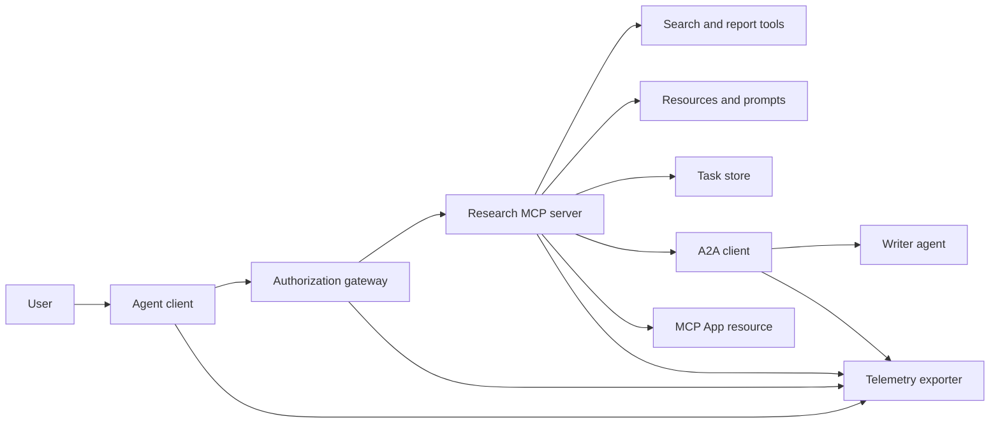
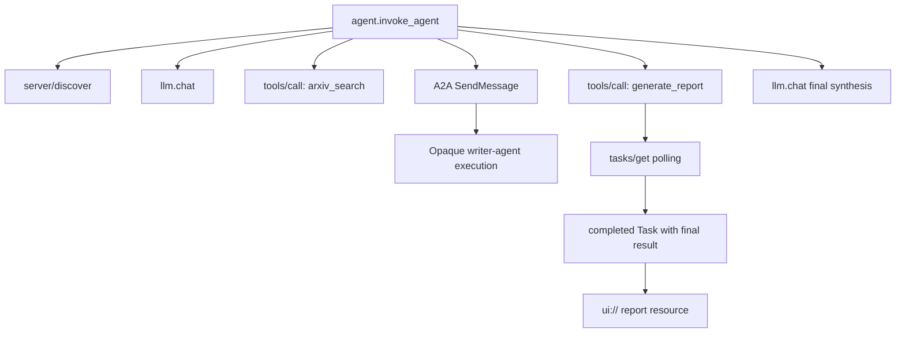
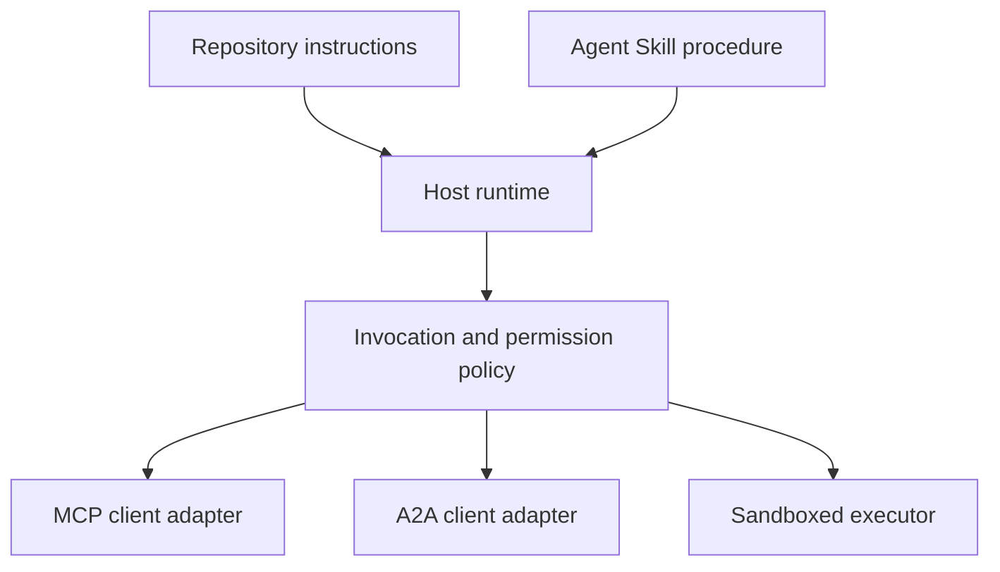

# 综合项目：无状态工具生态系统

> 生产级智能体系统是一组边界，而不是一堆功能。本综合项目会把易于阅读的进程内模拟，与真实部署仍然需要的协议客户端、授权服务器、沙箱和遥测导出器明确区分开来。

**Type:** 构建
**Languages:** Python (stdlib, in-process simulation)
**Prerequisites:** 第 13 阶段 · 第 01～22 课，使用 MCP 修订版 `2026-07-28`
**Time:** 约 120 分钟

## 学习目标

- 把工具调用、任务形态结果、委派工作、UI 资源、授权策略与追踪记录组合成一条流程。
- 在每个 MCP 请求中携带协议版本、客户端身份与能力，而不是依赖连接会话。
- 使用服务器前先执行发现，并通过官方 Tasks 扩展驱动长时间工作。
- 区分协议形态模拟与真正的 MCP、A2A、OAuth 或 OpenTelemetry 实现。
- 把每个模拟边界映射到必须替换它的生产组件。
- 让 `AGENTS.md`、Agent Skill、运行时适配器、工具与安全策略各司其职。
- 解释哪些主张可以通过本地输出验证，哪些需要实时集成测试。

## 问题

设计一个研究与报告系统。用户要求查找智能体协议相关论文。系统搜索论文目录、委派摘要工作、生成报告、返回 UI 资源，并记录系统中的完整执行路径。

这句话隐藏了多份彼此独立的契约：

- 面向模型的工具 Schema；
- 无状态请求信封与服务器发现契约；
- 网关针对参与者、权限范围与工具身份作出的决策；
- 长时间运行操作的契约；
- 委派协议；
- 宿主到应用的桥梁；
- 追踪上下文传播与导出；
- 可复用的操作规程。

`code/main.py` 使用普通 Python 函数与字典，让这些边界保持可见。它不会打开传输通道、联系 arXiv、执行 OAuth、调用 A2A 服务器、渲染 MCP App 或导出遥测。这样既便于检查控制流，也不会把模拟冒充为合规服务。

## 概念

### 目标架构



该架构是对公开协议模式的概念组合，并不声称反映任何产品的私有内部实现。

### 目标追踪



在真实实现中，每一跳都会传播追踪上下文。Span 名称与属性必须遵守所选插桩版本支持的 OpenTelemetry 语义约定。仅共享同一个追踪标识符，并不能证明父子关系正确、数据已导出或后端已摄取。

### 当前协议接口

应使用当前协议定义的方法名，而不是记忆中旧草案的名称：

| 边界 | 当前接口 | 综合项目模拟的内容 |
|---|---|---|
| MCP 发现 | 必需的 `server/discover` | 直接返回版本、能力与服务器身份的函数 |
| MCP 请求上下文 | 每个 `params._meta` 中的版本、能力与客户端身份 | 传入每次模拟调用的全新请求元数据 |
| MCP 工具调用 | `tools/call` | 直接分派 Python 函数 |
| MCP 任务轮询 | `io.modelcontextprotocol/tasks`，使用 `tasks/get` | 先返回工作句柄，再返回携带最终结果的已完成任务 |
| A2A 委派 | gRPC 与 JSON-RPC 中的 `SendMessage`；HTTP+JSON 中的 `POST /message:send` | 一个嵌套 Span，不执行远程调用，也不制造延迟 |
| MCP App 调用服务器工具 | `app.callServerTool({ name, arguments })` | 一段没有实时桥梁的 HTML 字符串 |
| OAuth 授权 | 授权服务器、受保护资源元数据、受众与权限范围验证 | 静态令牌查询与权限范围成员检查 |
| OpenTelemetry | SDK、传播器、导出器，以及收集器或后端 | 内存中的 Span 字典 |

协议名称只是第一层。生产测试必须通过真实线路验证序列化、身份认证失败、取消、超时、重试与版本兼容性。

### 无状态 MCP 改变集成边界

修订版 `2026-07-28` 移除了协议会话以及 `initialize` / `notifications/initialized` 握手，也移除了 `Mcp-Session-Id`。每个请求都携带以下带命名空间的 `_meta` 字段：

```json
{
  "io.modelcontextprotocol/protocolVersion": "2026-07-28",
  "io.modelcontextprotocol/clientCapabilities": {
    "extensions": {
      "io.modelcontextprotocol/tasks": {}
    }
  },
  "io.modelcontextprotocol/clientInfo": {
    "name": "capstone-client",
    "version": "1.0.0"
  }
}
```

服务器必须实现 `server/discover`。普通结果使用 `resultType: "complete"`，任务句柄使用 `resultType: "task"`。每个结果都应在 `_meta.io.modelcontextprotocol/serverInfo` 中标识服务器。

任务扩展提供 `tasks/get`、`tasks/update` 与 `tasks/cancel`。工具可以先返回 `resultType: "task"`；`tasks/get` 本身返回 `resultType: "complete"`，而已完成的 `Task` 会携带最终结果。旧的 `tasks/result` 与 `tasks/list` 方法不属于当前扩展。客户端必须在可能收到任务句柄的同一个请求中声明 `io.modelcontextprotocol/tasks`。如果没有声明，服务器会返回 `-32021`，并让 `requiredCapabilities` 采用缺失客户端能力对象的形态，其中包括 `extensions.io.modelcontextprotocol/tasks`。

### 安全姿态

预期的部署采用纵深防御：

- 在客户端类型需要时，使用带 PKCE 的 OAuth 授权；
- 为签发的访问令牌绑定资源与受众；
- 网关 RBAC 检查所请求的工具与权限范围；
- 上游凭证存储在模型可见上下文之外；
- 固定或审核过的工具描述清单；
- 针对不可信输入、敏感数据与有后果动作执行 Rule of Two 审查；
- 执行沙箱的文件系统、进程、网络、凭证与资源限制由 Skill 之外的系统强制执行。

演示只实现静态令牌、权限范围检查与描述哈希。它适合展示策略流，不足以验证安全性。

### Skill 是规程，不是传输

Agent Skill 可以告诉运行时如何执行研究工作流、应期待哪些工具契约、需要保存什么证据，以及何时停止。它无法让 MCP 服务器凭空存在，无法建立 A2A 兼容性、授予权限范围或创建沙箱。



当规程引用配套文件时，应交付完整的 Skill 目录。这个较早综合项目中的扁平产物只是课程蓝图，并不能证明宿主会保留可移植包。第 24～27 课会构建并测试完整的包生命周期。

### 课程产物元数据是本地适配器

课程目录与安装器会识别名为 `skill-*.md` 的扁平文件，但这是仓库约定，不是可移植 Agent Skills 包契约。它们的最小 frontmatter 解析器只读取顶层键。因此，本课把可移植身份字段与课程目录字段都放在同一层：

```yaml
---
name: ecosystem-blueprint
description: Produce a full Phase 13 ecosystem architecture for a product need.
version: "1.0.0"
phase: "13"
lesson: "23"
tags: [mcp, capstone, ecosystem, architecture, a2a, otel]
---
```

`name` 与 `description` 是可移植身份字段。`version`、`phase`、`lesson` 与 `tags` 是课程专用目录扩展。课程解析器要求 `tags` 使用内联列表，才能被 `--tag capstone` 匹配。

可移植目录 Skill 可以使用可选的 `metadata` 映射存放字符串扩展数据，但这不表示 `metadata` 可以与本仓库的目录 Schema 互换。如果这个扁平文件把 `version` 或 `tags` 嵌套在 `metadata` 下，最小解析器会跳过这些缩进键，目录会记录空版本，标签过滤也无法找到该产物。生产宿主应使用安全的 YAML 解析器，并验证自己公开说明的 Schema。

### 模拟与生产

| 层 | `code/main.py` | 生产替代方案 | 必需证据 |
|---|---|---|---|
| 发现 | `server_discover()` 加静态 `TOOLS` | `server/discover`，随后调用可感知缓存的 `tools/list` | 报文记录、确定顺序与 Schema 验证 |
| 身份认证 | 以令牌为键的字典 | OAuth 授权与资源服务器验证 | 签发者、受众、权限范围、过期与失败测试 |
| 授权 | 权限范围成员检查 | 绑定参与者、工具、目标与租户的网关策略 | 允许与拒绝审计案例 |
| 搜索 | 静态论文夹具 | 搜索 API 或 MCP 服务器 | 来源出处、排序与错误测试 |
| 任务 | 本地句柄加立即执行的 `tasks/get` | 持久的 `io.modelcontextprotocol/tasks` 存储，带 `tasks/get`、`tasks/update`、`tasks/cancel` 与 TTL | 状态转换、输入、取消与恢复测试 |
| 委派 | Sleep 加嵌套 Span | A2A 客户端与远程 Agent Card | 契约、超时、重试与不透明性测试 |
| App | HTML 字符串与 URI | MCP Apps 资源与 `App` 桥梁 | CSP、权限、工具调用与浏览器测试 |
| 遥测 | 内存列表 | OTel SDK 与导出器 | 收集器接收证明与追踪父子关系断言 |
| 沙箱 | 无 | 宿主强制执行的隔离执行器 | 逃逸、出口流量、机密与资源限制测试 |

这张表就是交接边界。本地运行全部通过，只能验证模拟。

### 阶段 13 地图

| 课程 | 贡献 |
|---|---|
| 01-05 | 工具接口、调用、Schema、结构化结果与确定性验证 |
| 06-14 | 无状态 MCP 请求信封、发现、传输、资源、提示词、扩展与 Apps |
| 15-18 | 投毒防御、OAuth、网关、注册表与生产身份认证 |
| 19 | A2A 消息与任务委派 |
| 20 | OpenTelemetry GenAI 追踪设计 |
| 21 | 模型提供商路由 |
| 22 | 可移植 Skill 契约与运行时边界 |

```figure
t3-capstone-chain
```

## 动手构建

运行进程内框架：

```bash
cd phases/13-tools-and-protocols/23-capstone-tool-ecosystem
python3 code/main.py
```

检查以下内容：

1. `server/discover` 公布修订版 `2026-07-28` 与 Tasks 扩展。
2. Alice 可以读取并生成报告，Bob 的写入权限调用则被拒绝。
3. 同一次编排器运行中的每个本地 Span 都共享同一个追踪标识符，并记录父 Span 标识符。
4. 报告最初以任务句柄形式返回。`tasks/get` 返回已完成任务，其最终结果包含文本与一个 `ui://` 引用。
5. 委派的 Writer 保持不透明，因为编排器只记录边界 Span。
6. 任何输出都不会声称已经发生网络连接、OAuth 交换、收集器导出、浏览器渲染或沙箱执行。

脚本会运行两次，因此会生成两个根追踪。审计条目仅存在于当前进程，下次运行时会重置。

## 投入使用

每次只把一层升级到生产实现：

1. 用真实的 `server_discover()` 替代物——即 `server/discover`，随后调用 `tools/list`——替换当前函数和静态工具列表。在每个请求中发送版本、身份与能力。
2. 用授权服务器与受保护资源验证替换静态令牌。
3. 实现 `io.modelcontextprotocol/tasks` 扩展，并测试 `tasks/get`、`tasks/update`、`tasks/cancel`、超时、TTL 与重启恢复。不要添加 `tasks/result` 或 `tasks/list`。
4. 用能够解析 Agent Card 并发送消息的 A2A 客户端替换委派替代实现。
5. 使用官方 SDK 构建 App，并通过 `app.callServerTool` 调用服务器工具。
6. 将 Span 导出到测试收集器，并在接收端断言父子关系。
7. 在第 26 课定义的沙箱契约内执行工具与脚本。
8. 把规程打包为完整目录软件包，并通过第 27 课的发布门禁。

每次升级都需要一项跨越新边界的集成测试。线路变成真实实现后，也不要删除较低层级的策略测试。

## 交付成果

本课会产出 `outputs/skill-ecosystem-blueprint.md`，这是一个旧式单文件课程产物。它要求生成一页架构，涵盖原语、安全、委派、遥测、打包以及最困难的运维风险。仓库真实的目录与安装器解析器会使用其顶层目录字段。

由于它不是目录软件包，因此无法携带参考资料、脚本、资产或评估夹具。在本课程之外发布可复用 Skill 时，应使用第 22、24～27 课介绍的包格式。

## 练习

1. 运行 `code/main.py`。把输出能够证明的事实，与仍需集成证据支持的生产主张区分开。
2. 添加第二个静态后端，并定义两个同名工具的冲突规则；随后用真实 `tools/list` 调用替换两个列表。
3. 用 A2A 测试服务器替换 Writer 替代实现。记录 Agent Card、消息请求、超时路径与返回产物。
4. 添加可跨进程重启保存的任务存储。证明客户端可以使用 `tasks/get` 恢复、遵守 `pollIntervalMs`，并在不使用 `tasks/result` 的情况下读取已完成任务的最终结果。
5. 构建最小 MCP App，并在带严格 CSP 与显式权限的浏览器中验证 `app.callServerTool`。
6. 通过 OTel SDK 把模拟 Span 导出到本地收集器，断言接收成功、追踪标识符、父子关系与错误状态。
7. 为仓库级维护规则编写 `AGENTS.md`，再为可复用研究规程编写独立 Skill 软件包。解释为什么二者都不会授予工具权限。

## 关键术语

| 术语 | 人们常说 | 实际含义 |
|---|---|---|
| 综合项目 | “把一切连接起来” | 明确区分模拟边界与实时边界的分阶段集成 |
| 协议形态模拟 | “它基本就是 MCP” | 形似协议、却没有实现线路契约的本地数据与调用 |
| Tasks 扩展 | “长工具调用” | 可选的 `io.modelcontextprotocol/tasks` 生命周期，具备持久身份、轮询、客户端输入、最终结果与取消语义 |
| 不透明边界 | “由另一个智能体处理” | 调用方只能看到已声明接口与产物，看不到私有推理或内部状态 |
| 运行时适配器 | “Skill 集成” | 将可移植规程映射到发现、调用、工具、策略与上下文的宿主代码 |
| 集成证据 | “已经通过” | 证明真实边界已被跨越的转录、产物或接收端观察 |

## 延伸阅读

- [MCP 2026-07-28 规范](https://modelcontextprotocol.io/specification/2026-07-28)——无状态请求、发现、工具、授权与传输行为。
- [MCP 2026-07-28 关键变更](https://modelcontextprotocol.io/specification/2026-07-28/changelog)——会话移除、逐请求元数据、MRTR、扩展与弃用项。
- [MCP Tasks 扩展](https://tasks.extensions.modelcontextprotocol.io/specification/draft/tasks)——`tasks/get`、`tasks/update`、`tasks/cancel`，以及终态任务携带的最终结果。
- [MCP Apps SDK](https://github.com/modelcontextprotocol/ext-apps/blob/main/docs/overview.md)——`App` 与 `app.callServerTool`。
- [A2A 协议](https://a2a-protocol.org/latest/)——Agent Card、消息传递、任务、产物与传输绑定。
- [OpenTelemetry GenAI 语义约定](https://opentelemetry.io/docs/specs/semconv/gen-ai/)——追踪与属性约定。
- [Agent Skills 规范](https://agentskills.io/specification)——规程层使用的可移植包契约。
