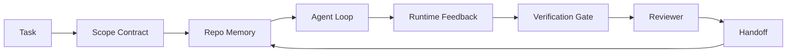

# Agent 工作台工程：为什么强模型依然会失败

> 仅有一个能力很强的模型还不够。可靠的 agent 需要一套工作台：指令、状态、范围、反馈、验证、审查和交接。把这些拿掉，即使是前沿模型，产出的工作也依然不适合直接交付。

**Type:** 学习 + 构建
**Languages:** Python（标准库）
**Prerequisites:** 第 14 阶段 · 01（Agent Loop），第 14 阶段 · 26（故障模式）
**Time:** 约 45 分钟

## 学习目标

- 区分模型能力与执行可靠性。
- 说出决定 agent 能否真正交付的七个工作台表面。
- 在一个小型 repo 任务上，对比仅靠提示词的运行和工作台引导的运行。
- 产出一份故障模式报告，把每个缺失表面映射到它造成的症状。

## 问题

你把一个前沿模型放进真实 repo，要求它给输入加上校验。它打开四个文件，写出看起来很合理的代码，宣布成功，然后停下。你去跑测试。两个失败。还有第三个文件被碰了，但它和输入校验根本无关。整个过程里，没有任何记录说明代理做了什么假设、第一步尝试了什么，或者还剩下什么没做。

模型并不是不懂 Python。它是不懂“工作”本身。它不知道什么才算完成，不知道自己被允许写哪些文件，不知道哪些测试才是权威信号，也不知道下一次会话该如何接着做。

这不是模型 bug，而是工作台 bug。agent 周围缺少了那些能把一次性生成变成可靠、可恢复工程流程的承重部件。

## 概念

工作台是任务执行时包裹在模型外层的操作环境。它有七个表面：

| 表面 | 承载内容 | 缺失时的失败形态 |
|---------|-----------------|----------------------|
| Instructions | 启动规则、禁止动作、完成定义 | agent 只能猜“什么算可以交付” |
| State | 当前任务、已改文件、阻塞点、下一步动作 | 每次会话都从零开始 |
| Scope | 允许文件、禁止文件、验收标准 | 改动泄漏到无关代码 |
| Feedback | 真实命令输出被捕获回循环 | 明明返回 400，agent 却宣布成功 |
| Verification | 测试、lint、冒烟运行、范围检查 | “看起来没问题”直接进主干 |
| Review | 另一个角色做第二遍检查 | builder 自己给自己批作业 |
| Handoff | 改了什么、为什么改、还剩什么 | 下一次会话又得从头发现一遍 |

工作台独立于模型本身。你可以更换模型而保留这些表面；你不能把这些表面拿掉，却还想保住可靠性。



这个循环闭合在状态文件上，而不是聊天历史上。聊天是易失的，repo 才是事实记录源。

### 工作台与提示工程的区别

提示词工程告诉模型这一轮你想让它做什么。工作台告诉模型如何跨多轮、跨多次会话把工作做完。大多数 agent 失败故事，本质上都是工作台失败，只是穿着提示词工程的外衣。

### 工作台与框架的区别

framework 提供的是运行时，例如 LangGraph、AutoGen、Agents SDK。工作台提供的是 agent 在这个运行时里工作的环境。两者都需要。这条 mini-track 关注的是后者。

### 从 primitives 推理，而不是从厂商 taxonomy 推理

现在关于 “harness engineering” 的文章非常多。Addy Osmani、OpenAI、Anthropic、LangChain、Martin Fowler、MongoDB、HumanLayer、Augment Code、Thoughtworks、walkinglabs 的 awesome list，以及一连串 Medium 和 Hacker News 文章都在讨论它。它们对 harness 的边界、范围和词汇表并不一致。其实没必要选边。七个表面只是 UX 层；在每个工作台下面，真正支撑它的是同一组分布式系统 primitives。

把 agent 这个标签先摘掉。一次 agent 运行，本质上是一段跨越时间、进程和机器边界的计算。要让它可靠，你仍然需要任何生产系统都需要的那些 primitives。

| Primitive | 它是什么 | 它为 agent 承载什么 |
|-----------|------------|------------------------------|
| Function | 有类型边界的 handler。能纯则纯，明确拥有输入与输出。 | tool call、规则检查、验证步骤、模型调用 |
| Worker | 长生命周期进程，拥有一个或多个 function 以及生命周期 | builder、reviewer、verifier、一个 MCP server |
| Trigger | 触发 function 的事件源 | agent loop tick、HTTP request、queue message、cron、file change、hook |
| Runtime | 决定什么在哪运行、用什么超时和资源限制的边界 | Claude Code 的进程、LangGraph 的 runtime、一个 worker container |
| HTTP / RPC | caller 与 worker 之间的连线 | tool-call protocol、MCP request、model API |
| Queue | trigger 与 worker 之间的持久缓冲层，提供 back-pressure、retry、idempotency | task board、feedback log、review inbox |
| Session persistence | 跨崩溃、重启、模型切换仍然存在的状态 | `agent_state.json`、checkpoints、KV stores、repo 本身 |
| Authorization policy | 谁能在什么 scope 下调用什么 function | allowed/forbidden files、approval boundaries、MCP capability lists |

现在把七个工作台表面映射回这些 primitives：

- **Instructions**：policy + function metadata。规则本质上就是 checks（functions）。像 `AGENTS.md` 这样的入口文件，就是 runtime 启动时附带的 policy。
- **State**：session persistence。运行时在每一步都会读取的一块持久状态。可以存在 file、KV 或 DB 里；关键是持久语义，而不是具体后端。
- **Scope**：每个任务级别的 authorization policy。allowed/forbidden globs 是 ACL。需要审批的边界构成一个权限格。
- **Feedback**：写进 queue 的调用日志。每一次 shell call 都应该是一条可持久、可重放的记录。
- **Verification**：一个 function。对输入来说是确定性的，在任务收口时被 trigger，默认 fail closed。
- **Review**：另一个独立 worker，对 builder 产物通常只有只读权限，对 review report 才有写权限。
- **Handoff**：由会话结束 trigger 发出的持久记录。下一次会话的启动 trigger 会再读回来。

agent loop 本身也是一个 worker：它消费事件（用户消息、工具结果、计时器 tick），调用 functions（模型，然后是模型选择的工具），写 records（state、feedback），再发出 triggers（verify、review、handoff）。这没有什么神秘成分，本质上就是一个作业处理器。

### 流行模式，翻回 primitives

现在流行的各类 harness pattern，最终都能还原为这八个 primitives。下面是翻译表。

| 厂商或社区里的模式名 | 它本质上是什么 |
|------------------------------|--------------------|
| Ralph Loop（Claude Code、Codex、agentic_harness 一书）——当智能体试图过早停止时，把原始意图重新注入新的上下文窗口 | 一个 trigger 把任务重新入队到干净上下文；session persistence 负责把目标延续下去 |
| Plan / Execute / Verify（PEV） | 三个 worker，各负责一个角色，通过 state 和 queue 串联阶段 |
| Harness-compute separation（OpenAI Agents SDK，2026 年 4 月）——把控制平面与执行平面拆开 | 只是把 control-plane / data-plane 的老概念重新表述了一遍；这个想法比 agent 标签早很多年 |
| Open Agent Passport（OAP，2026 年 3 月）——在执行前按声明式策略对每次工具调用进行签名与审计 | 一个 pre-action worker 执行 authorization policy，并把签名审计写入队列 |
| Guides and Sensors（Birgitta Böckeler / Thoughtworks）——前馈规则加反馈可观测性 | authorization policy + verification functions + observability traces |
| 五阶段渐进式压缩（Claude Code 逆向观察，2026 年 4 月） | 一个定期在 session persistence 上运行的状态管理 worker，用来把上下文压进预算 |
| Hooks / middleware（LangChain、Claude Code）——拦截模型调用与工具调用 | 包在 runtime 调用路径外层的 triggers + functions |
| 以 Markdown 形式提供、并按渐进披露加载的 Skills（Anthropic、Flue） | 一个 function registry，只在需要时把 function metadata 加载进上下文 |
| Sandbox agents（Codex、Sandcastle、Vercel Sandbox） | compute plane：具备隔离文件系统、网络和生命周期的 runtime |
| MCP servers | 通过稳定 RPC 暴露 functions 的 worker，capability list 就是 authorization |

表中每一项，本质上都是 agent 社区重新发现了一个本就存在于 distributed systems 里的 primitive，并给它起了一个新名字。做营销很有帮助，做工程时却不够精确。

### 这些“收据”真正说明了什么

“harness 比模型更承重”这件事，现在已经开始有数字支撑。值得知道，因为这也是对“只要等更聪明模型”最诚实的反驳。

- Terminal Bench 2.0：同一个模型，只改 harness，就让一个 coding agent 从前 30 名之外升到第 5 名（LangChain, *Anatomy of an Agent Harness*）。
- Vercel：删掉代理 80% 的工具后，成功率从 80% 提升到 100%（MongoDB）。
- Harvey：法律代理只靠 harness 优化，准确率就提升了两倍以上（MongoDB）。
- 企业 AI agent 项目里有 88% 最终没能进生产；失败主要聚集在 runtime，而不是 reasoning（preprints.org, *Harness Engineering for Language Agents*, March 2026）。
- 一项 2025 年针对三种流行开源框架的 benchmark 研究报告约 50% 的任务完成率；长上下文 WebAgent 在长上下文条件下会从 40-50% 掉到 10% 以下，主要原因是无限循环和目标丢失，这一点在 2026 年初的很多综述里都被反复提到。

真正的结论不是 “harness 永远胜过模型”。模型确实会慢慢吸收 harness 技巧。真正的结论是：在今天，承重工程更多还在模型外，而不在模型内；而承载这些重量的 primitives，正是所有生产系统一直都需要的那些基础件。

### 厂商文章停下来的地方

这一段没必要太客气。

- LangChain 的 *Anatomy of an Agent Harness* 罗列了 11 个组件：prompts、tools、hooks、sandboxes、orchestration、memory、skills、subagents，以及一个 runtime “dumb loop”。但它没有点出 queues、作为部署单元的 workers、trigger semantics、独立的 session persistence，或者 authorization policy。它把 harness 当作你要配置的对象，而不是你要部署的系统。
- Addy Osmani 的 *Agent Harness Engineering* 把 `Agent = Model + Harness` 这个 framing 和 ratchet pattern 讲清楚了，但没有继续说 harness 具体由什么构成。它更像一种立场，而不是一份 spec。
- Anthropic 和 OpenAI 在 surface 层面讲得最深入，但依旧主要停留在自家 runtime 里。2026 年 4 月 Agents SDK 提到的 “harness-compute separation”，是少数明确承认 control-plane / data-plane 分离的厂商表述。但这只是 primitive idea，并不是新东西。
- agentic_harness 这本书把 harness 当成一个配置对象来写（Jaymin West 的 *Agentic Engineering* 第 6 章），其中最强的一句是 “the harness is the primary security boundary in an agentic system.” 换回 primitives 的语言，它其实说的就是 authorization policy。
- Hacker News 的线程也在不断收敛到同一处。2026 年 4 月那条 *The agent harness belongs outside the sandbox* 认为 harness 应该更像一个“位于所有东西之外、按上下文和用户进行授权的 hypervisor”。这说的还是 authorization policy 作为独立平面存在。

这些文章并不是错。它们只是在用 UX 语言描述一个已经存在的系统。我们这里要写的是系统本身。当系统搭得对，七个 surface 会自然从 primitives 里长出来；当系统搭得不对，再怎么润色 `AGENTS.md` 也补不上缺失的 queue。

所以当你在别处听到 “harness engineering” 时，先把它翻回 primitives。prompts 和 rules 是 policy 与 functions。scaffolding 是 runtime。guardrails 是 authorization + verification。hooks 是 triggers。memory 是 session persistence。Ralph Loop 是 requeue。subagents 是 workers。sandboxes 是 compute planes。词汇会变，工程不会变。workbench 是面向 agent 的 UX；而那个能跨过下一次厂商重命名依然成立的 harness，本质上就是 functions、workers、triggers、runtimes、queues、persistence 和 policy 被正确接在一起。

```figure
wb-seven-surfaces
```

## 动手构建

`code/main.py` 会把一个小型 repo 任务跑两次。第一次只给 prompt，第二次则把七个 surface 都接上。模型相同，任务相同。脚本会统计第一次失败运行里缺了哪些 surface，并打印一份 failure-mode report。

这个 repo 任务故意做得很小：给一个单文件 FastAPI-style handler 加上输入校验，并写出一个能通过的测试。

运行：

```
python3 code/main.py
```

输出包括：两次运行的并排日志、一个汇总仅靠提示词运行问题的 `failure_modes.json`，以及工作台运行的一行 verdict。

这里的 agent 只是一个很小的 rule-based stub；重点是表面，不是模型。在这条 mini-track 的后续部分里，你会把每一个表面分别重建成真正可复用的产物。

## 如何使用

现实里其实已经有很多工作台表面，只是大家未必这么叫它们：

- **Claude Code, Codex, Cursor.** `AGENTS.md` 和 `CLAUDE.md` 构成指令配置层。Slash commands 用来限定作用范围，Hooks 用来做验证。
- **LangGraph, OpenAI Agents SDK.** Checkpoints 和 session stores 负责状态保存；Handoffs 则定义任务如何在不同 agent 之间交接。
- **CI on a real repo.** Tests、lint 和 type-check 是 verification。PR template 是 handoff。CODEOWNERS 是 review。

工作台工程的任务，就是把这些表面明确化、可复用化，而不是让每个团队都重新摸一遍。

## 交付成果

`outputs/skill-workbench-audit.md` 是一个可移植 skill，用来审计现有 repo 是否具备七个工作台表面，并报告哪些缺失、哪些部分到位、哪些状态健康。把它放到任何 agent setup 旁边，它都会告诉你最应该先修什么。

## 练习

1. 选一个你已经在跑 agent 的 repo，把七个表面从 0（缺失）到 2（健康）打分。你最弱的是哪一个？
2. 扩展 `main.py`，让 prompt-only 运行也产出一个假的“success”声明。然后验证 verification gate 是否能把它抓住。
3. 给你的产品添加第八个表面，并证明为什么它不能折叠进现有七个之一。
4. 换一个会 hallucinate 额外文件写入的 stub agent 再跑一遍脚本。最先拦住它的是哪个表面？
5. 把 Phase 14 · 26 的五类行业高频故障模式映射到这七个表面。每个表面本来是为吸收哪一种模式设计的？

## 关键术语

| 术语 | 常见说法 | 实际含义 |
|------|----------------|------------------------|
| Workbench | “整体 setup” | 围绕模型搭建的工程表面，让工作变得可靠 |
| Surface | “一份文档”或“一段脚本” | agent 每一轮都会读写的具名、机器可读输入 |
| System of record | “那份记录” | 聊天历史消失后，agent 仍然当真的那份文件 |
| 完成定义 | “验收标准” | agent 无法伪造的、以文件为依托的客观检查清单 |
| Workbench audit | “repo 就绪性检查” | 在工作开始前检查七个表面是否齐备的过程 |

## 延伸阅读

把这些材料当作数据点，不要把它们当绝对权威。每一篇都只是部分 taxonomy。在决定是否采纳前，先把概念翻回 primitives：function、worker、trigger、runtime、HTTP/RPC、queue、persistence、policy。

厂商表述：

- [Addy Osmani, Agent Harness Engineering](https://addyosmani.com/blog/agent-harness-engineering/) — `Agent = Model + Harness` 和 ratchet pattern；基础设施层面偏薄
- [LangChain, The Anatomy of an Agent Harness](https://blog.langchain.com/the-anatomy-of-an-agent-harness/) — 十一个组件：prompts、tools、hooks、orchestration、sandboxes、memory、skills、subagents、runtime；缺少 queues、deployment、authz
- [OpenAI, Harness engineering: leveraging Codex in an agent-first world](https://openai.com/index/harness-engineering/) — Codex 团队如何理解 runtime 周围的 surface
- [OpenAI, Unrolling the Codex agent loop](https://openai.com/index/unrolling-the-codex-agent-loop/) — 把 agent loop 还原成围绕 function call 的一个 `while`
- [Anthropic, Effective harnesses for long-running agents](https://www.anthropic.com/engineering/effective-harnesses-for-long-running-agents) — 从特定 runtime 视角讨论长时任务 surface
- [Anthropic, Harness design for long-running application development](https://www.anthropic.com/engineering/harness-design-long-running-apps) — 应用设计笔记
- [LangChain Deep Agents harness capabilities](https://docs.langchain.com/oss/python/deepagents/harness) — runtime 配置表面

包含可用细节的实践者文章：

- [Martin Fowler / Birgitta Böckeler, Harness engineering for coding agent users](https://martinfowler.com/articles/harness-engineering.html) — guides（feedforward）+ sensors（feedback）；控制论视角最清晰
- [HumanLayer, Skill Issue: Harness Engineering for Coding Agents](https://www.humanlayer.dev/blog/skill-issue-harness-engineering-for-coding-agents) — “it's not a model problem, it's a configuration problem”
- [MongoDB, The Agent Harness: Why the LLM Is the Smallest Part of Your Agent System](https://www.mongodb.com/company/blog/technical/agent-harness-why-llm-is-smallest-part-of-your-agent-system) — 几个关键数据点：Vercel 80% 到 100%，Harvey 2x accuracy，Terminal Bench 从 Top 30 外到 Top 5
- [Augment Code, Harness Engineering for AI Coding Agents](https://www.augmentcode.com/guides/harness-engineering-ai-coding-agents) — 以约束优先的方式讲解
- [Sequoia podcast, Harrison Chase on Context Engineering Long-Horizon Agents](https://sequoiacap.com/podcast/context-engineering-our-way-to-long-horizon-agents-langchains-harrison-chase/) — 更强调 runtime 问题而不是模型问题

书籍、论文与参考实现：

- [Jaymin West, Agentic Engineering — Chapter 6: Harnesses](https://www.jayminwest.com/agentic-engineering-book/6-harnesses) — 一本书长度的讨论，把 harness 视为主要安全边界
- [preprints.org, Harness Engineering for Language Agents (March 2026)](https://www.preprints.org/manuscript/202603.1756) — 把它建模为 control / agency / runtime 问题
- [walkinglabs/awesome-harness-engineering](https://github.com/walkinglabs/awesome-harness-engineering) — 围绕 context、evaluation、observability、orchestration 的阅读清单
- [ai-boost/awesome-harness-engineering](https://github.com/ai-boost/awesome-harness-engineering) — 另一份精选列表，覆盖 tools、evals、memory、MCP、permissions
- [andrewgarst/agentic_harness](https://github.com/andrewgarst/agentic_harness) — 偏生产化的参考实现，带 Redis-backed memory 和 eval suite
- [HKUDS/OpenHarness](https://github.com/HKUDS/OpenHarness) — 开源 agent harness，内置 personal agent

值得读的 Hacker News 讨论在于分歧，而不是共识：

- [HN：长时运行智能体的有效 harness](https://news.ycombinator.com/item?id=46081704)
- [HN：一个下午提升 15 个 LLM 的编程能力，唯一变化只有 harness](https://news.ycombinator.com/item?id=46988596)
- [HN: The agent harness belongs outside the sandbox](https://news.ycombinator.com/item?id=47990675) — 主张 authorization 应该作为独立平面存在

本课程内的交叉引用：

- Phase 14 · 23 — OpenTelemetry GenAI conventions：对应 sensors 文献指向的 observability layer
- Phase 14 · 26 — Failure modes catalog：七个表面正是用来吸收这些故障的
- Phase 14 · 27 — Prompt injection defenses：落在 authorization-policy primitive 上
- Phase 14 · 29 — Production runtimes（queue、event、cron）：本课里的 primitives 真正在部署层落地的位置
