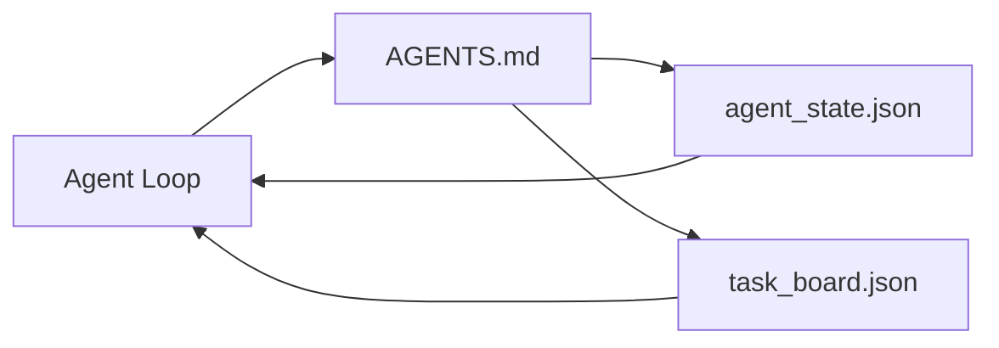

# 最小代理工作台

> 最小但真正有用的工作台只需要三个文件: 根指令路由器、状态文件和任务板。其余一切都是在这三者之上逐层叠加出来的。如果一个仓库连这三个文件都承载不了,再强的模型也救不了它。

**Type:** 构建
**Languages:** Python（标准库）
**Prerequisites:** 第 14 阶段 · 31（为什么强模型依然会失败）
**Time:** 约 45 分钟

## 学习目标

- 定义构成最小可行工作台的三个文件。
- 解释为什么一个简短的根路由器比冗长而一体化的 `AGENTS.md` 更有效。
- 构建一个代理每轮都能读取、每轮结束都能写回的状态文件。
- 构建一个不依赖聊天历史、也能跨多次会话持续工作的任务板。

## 问题

很多团队一提到工作台,第一反应就是写一个 3000 行的 `AGENTS.md`,然后就当事情结束了。模型把它读进去,忽略那些自己根本概括不动的部分,最后还是在原来那些地方照样失败。

你真正需要的是相反的东西。一个很小的根文件,只在相关时把代理引导到更深的规则文件; 一份持久状态,在行动前读取、在行动后写回; 以及一个任务板,明确告诉代理当前有哪些任务正在进行、哪些被阻塞、接下来该做什么。

就是三个文件。每个文件只做一件事。每个文件都足够机器可读,以后可以继续演化成真正的系统。

## 概念



### AGENTS.md 是路由器,不是操作手册

一个好的 `AGENTS.md` 应该很短。它只负责把代理指向:

- 状态文件,也就是“现在做到哪里了”。
- 任务板,也就是“还剩什么没做”。
- 更深的规则文件,例如 `docs/agent-rules.md`。
- 验证命令,也就是“怎样确认它真的可用”。

再长的内容都应该放到更深的文档里,只在需要时再加载。长篇手册通常会被忽视,短路由器反而更容易被遵守。

### agent_state.json 是记录系统

状态文件里保存的是: 当前活跃任务 ID、这轮碰过哪些文件、做过哪些假设、遇到了什么阻塞、下一步动作是什么。代理每一轮都读它。下一次会话直接读它,而不是回放整段聊天记录。

状态必须落在文件里,因为聊天历史并不可靠。会话会中断,上下文会被裁剪,对话会被压缩。文件不会。

### task_board.json 是任务队列

任务板里保存每一个任务,其状态是 `todo | in_progress | done | blocked`。当状态文件为空时,代理就从这个队列里拉取下一个任务; 而当你想判断代理有没有偏离轨道时,你也会先去看这个板。

板上的一个任务至少要有: 一个 id、一个 goal、一个 owner (`builder`、`reviewer` 或 `human`) 以及验收标准。任务板故意保持很小: 如果它已经长到一屏都看不下,那说明你遇到的是规划问题,不是看板问题。

### 三个文件只是下限,不是上限

后面的课程会在它们之上继续加范围契约、反馈运行器、验证闸门、审查清单和交接包。这里的三个文件,正是那些扩展能力默认依赖的地基。

```figure
wb-three-files
```

## 动手构建

`code/main.py` 会把这个最小工作台写入一个空仓库,并演示一次单轮代理执行:

1. 读取 `agent_state.json`。
2. 如果状态为空,就从 `task_board.json` 拉取下一个任务。
3. 只在允许范围内触碰一个文件。
4. 把更新后的状态写回去。

运行它:

```
python3 code/main.py
```

脚本会在自身旁边创建 `workdir/`,落下这三个文件,跑完一轮后打印 diff。重新再跑一次,你会看到第二轮是如何沿着第一轮留下的状态继续往前推进的。

## 如何使用

到了真实的生产代理产品里,这三个文件只是名字不同,形状其实没有变:

- **Claude Code:** 用 `AGENTS.md` 或 `CLAUDE.md` 充当路由器,用 `.claude/state.json` 一类的存储做状态,再通过 hooks 管理任务板。
- **Codex / Cursor:** 用工作区规则做路由器,用会话记忆保存状态,用聊天侧栏里的排队任务充当任务板。
- **Custom Python agent:** 直接就是你刚刚写下的那三份文件。

名称会变,结构不会变。

## 生产环境里的常见模式

最小工作台在真正的 monorepo 中也能存活,前提是再往上叠三种模式。它们彼此独立,按你的仓库实际需要选即可。

**嵌套 `AGENTS.md`,并采用 nearest-wins 优先级。** OpenAI 在主仓库里一共放了 88 个 `AGENTS.md`,不同子组件各有一份。Codex、Cursor、Claude Code 和 Copilot 都会从当前工作文件一路往仓库根目录走,把沿途遇到的每个 `AGENTS.md` 拼起来。子目录里的文件是在根文件之上补充规则。Codex 还额外支持 `AGENTS.override.md`,可以直接替换而不是扩展,但这是 Codex 专属机制,跨工具协作时应尽量避免。Augment Code 的测量结果很值得记住: 最好的 `AGENTS.md` 带来的质量提升,相当于把模型从 Haiku 升到 Opus; 最差的 AGENTS.md 反而比完全没有文档更糟。

**该拒绝的反模式,哪怕它们看起来像“覆盖更全”。** 冲突指令会悄悄把代理从交互式模式打回贪婪模式,ICLR 2026 的 AMBIG-SWE 报告里,解决率从 48.8% 掉到了 28%; 优先级不要编号排序,而要用平铺叠加的方式表达。无法验证的风格规则,例如“遵守 Google Python Style Guide”,如果没有配套执行命令,代理只会自己脑补什么叫合规; 每一条风格要求都应该绑定精确的 lint 命令。把风格要求写在命令前面,会把验证路径埋掉; 正确顺序应该是命令在前,风格在后。给人类看的冗长解释会浪费上下文预算,对代理来说,简洁本身就是特性。

**跨工具符号链接。** 用一个根文件作为唯一真相源,再通过符号链接把它暴露给不同工具,例如 `ln -s AGENTS.md CLAUDE.md`, `ln -s AGENTS.md .github/copilot-instructions.md`, `ln -s AGENTS.md .cursorrules`,就能让所有编码代理共享同一套指令来源。Nx 的 `nx ai-setup` 已经把这件事自动化了,可以从一份配置同时生成 Claude Code、Cursor、Copilot、Gemini、Codex 和 OpenCode 的入口。

## 交付成果

`outputs/skill-minimal-workbench.md` 可以为任何新仓库生成这套三文件工作台: 一个按项目特点定制的 `AGENTS.md` 路由器、一个字段齐全的 `agent_state.json`,以及一个用当前 backlog 初始化的 `task_board.json`。

## 练习

1. 给 `last_run` 增加一个时间戳字段,并把它写入 `agent_state.json`。如果文件已经超过 24 小时未更新,除非操作员明确确认,否则拒绝运行。
2. 给任务板增加一个 `priority` 字段,并修改拉取器,始终优先选择最高优先级的 `todo`。
3. 把 `task_board.json` 迁移到 JSON Lines,让每个任务独占一行,这样在版本控制里 diff 会更干净。
4. 写一个 `lint_workbench.py`,当 `AGENTS.md` 超过 80 行,或者它引用了不存在的文件时直接失败。
5. 判断这三个文件里哪一个最不能丢,并为你的结论辩护。

## 关键术语

| 术语 | 常见说法 | 实际含义 |
|------|----------|----------|
| 路由器 | `AGENTS.md` | 指向更深层文档和文件的简短根文件 |
| 状态文件 | “那些笔记” | 记录代理当前位置的机器可读状态,每轮都会写回 |
| 任务板 | “backlog” | 带有状态、负责人和验收标准的 JSON 工作队列 |
| 记录系统 | “source of truth” | 当聊天上下文消失后,工作台仍视为权威来源的文件 |

## 延伸阅读

- [agents.md — the open spec](https://agents.md/) — Cursor、Codex、Claude Code、Copilot、Gemini、OpenCode 都采用了这套规范
- [Augment Code, A good AGENTS.md is a model upgrade. A bad one is worse than no docs at all](https://www.augmentcode.com/blog/how-to-write-good-agents-dot-md-files) — 对质量提升的量化测量
- [Blake Crosley, AGENTS.md Patterns: What Actually Changes Agent Behavior](https://blakecrosley.com/blog/agents-md-patterns) — 哪些模式在经验上有效,哪些无效
- [Datadog Frontend, Steering AI Agents in Monorepos with AGENTS.md](https://dev.to/datadog-frontend-dev/steering-ai-agents-in-monorepos-with-agentsmd-13g0) — 在实践中如何处理嵌套优先级
- [Nx Blog, Teach Your AI Agent How to Work in a Monorepo](https://nx.dev/blog/nx-ai-agent-skills) — 如何从单一配置为六种工具生成统一入口
- [The Prompt Shelf, AGENTS.md Best Practices: Structure, Scope, and Real Examples](https://thepromptshelf.dev/blog/agents-md-best-practices/) — 经得起评审的章节顺序
- [Anthropic, Claude Code subagents](https://code.claude.com/docs/en/sub-agents)
- Phase 14 · 31 — 这个最小工作台主要吸收了哪些失败模式
- Phase 14 · 34 — 本课预告的持久状态 schema
