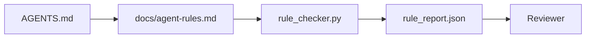

# 将代理指令写成可执行约束

> 写成散文的指令只是愿望,写成约束的指令才是测试。工作台会把每一条规则都变成一种东西: 代理在运行时可以检查它,审查者在事后也能验证它。

**Type:** 构建
**Languages:** Python（标准库）
**Prerequisites:** 第 14 阶段 · 32（最小工作台）
**Time:** 约 50 分钟

## 学习目标

- 把路由型说明和操作型规则分离开来。
- 将启动规则、禁止行为、完成定义、不确定性处理和审批边界表达成可机器检查的约束。
- 实现一个规则检查器,能对一次运行按规则集打分。
- 让规则集本身对 diff 友好,以便评审能清楚看到改了什么。

## 问题

典型的 `AGENTS.md` 常常写得像入职文档。它告诉代理“要小心”“测试要充分”“不确定就问”。三天后,代理交出一个没有测试的改动,还写进了禁止目录,而且从头到尾都没有提问,因为它从来不知道真正的边界在哪里。

当指令是“可操作的”时,它才有力量; 当指令只是“带期待的口号”时,它就很弱。解决方法是把规则写成工作台可以解释、审查者可以评分的形式。

## 概念

规则应该放在 `docs/agent-rules.md`,而不是塞进那个简短的根路由器里。每条规则都要有名字、类别和检查方式。



### 五类规则已经覆盖了大多数场景

| 类别 | 规则回答的问题 | 示例 |
|----------|---------------------------|---------|
| Startup | 工作开始前哪些条件必须成立? | “状态文件存在且仍然新鲜” |
| Forbidden | 哪些事绝不能发生? | “不要编辑 `scripts/release.sh`” |
| Definition of done | 任务完成要靠什么来证明? | “pytest 退出码为 0 且 acceptance line 通过” |
| Uncertainty | 代理不确定时该怎么做? | “创建 question note,而不是瞎猜” |
| Approval | 哪些操作必须经过人工批准? | “任何新增依赖、任何 prod 写入” |

一条规则如果塞不进这五类中的任意一类,通常说明它其实应该拆成两条规则。强行拆开。

### 规则必须机器可读

每条规则都应该带有 slug、category、一句描述,以及一个 `check` 字段,它对应 `rule_checker.py` 中的某个检查函数。增加一条规则,就意味着增加一个检查; 检查器会和工作台一起成长。

### 规则必须对 diff 友好

规则以 Markdown 形式存放在同一个文件里,每个标题对应一条规则。重命名在 diff 里一眼能看见。新规则插到所属类别的顶部。过时规则直接删掉,不要注释掉,因为工作台是当前真相源,不是团队上季度心理活动的聊天记录。

### 规则和框架级 guardrails 不是一回事

框架级 guardrails,例如 OpenAI Agents SDK guardrails 或 LangGraph interrupts,是在运行时强制执行的。此课里的规则集,则是人类可读、可审查的契约,这些 runtime guardrails 正是它的实现方式。两者都要有: runtime 在执行过程中拦违规,规则集负责证明 runtime 的行为本身是正确的。

### Progressive disclosure: 给代理一张地图,不是一整套百科全书

`AGENTS.md` 之所以越来越长,通常是因为每次事故发生后都会加一条规则,但几乎从来不会删掉旧规则。一年后,文件变成两千行,代理只读了第一屏,注意力预算就见底了,最后只按自己记住的那一小部分去行动。超长指令文件失败的原因,跟四十页入职手册失败的原因完全一样: 读者只会快速扫一遍,然后永远不再回到真正关键的那一页。

解决方案不是“单纯更短的文件”,而是“分层文件”。根路由器必须小到每次会话都能完整读一遍,内容只放指针。更深的细节放进专题文档,只有任务真的碰到那个主题时才加载。给代理一张地图,不要把整套百科全书一次性塞给它,让它走到自己需要的页面上去。

```
AGENTS.md                  # router, < 50 lines: what this repo is, where to look, the 5 hard rules
docs/
  agent-rules.md           # the full rule set (this lesson)
  architecture.md          # loaded when the task touches module boundaries
  testing.md               # loaded when the task writes or runs tests
  deploy.md                # loaded only for release work, gated behind an approval rule
feature_list.json          # the backlog (Phase 14 · 36)
```

| 层级 | 所在位置 | 读取时机 | 大小预算 |
|------|----------|-----------|-------------|
| Router | `AGENTS.md` | 每次会话、始终读取 | 控制在约 50 行以内 |
| Rules | `docs/agent-rules.md` | 每次会话启动时读取 | 每个类别约一屏 |
| Topic docs | `docs/<topic>.md` | 只有任务触及该主题时才读 | 需要多深都可以 |

要维持这种分层结构,有两个测试很关键。第一个是 reachability test: 从路由器出发,代理最多经过两跳就应该能触达任何规则,所以路由器必须按路径显式链接每份专题文档,而不是只用文字描述“那里有东西”。第二个是 freshness test: 路由器必须短到评审者每次 PR 都愿意重读一遍,这是防止它悄悄长回百科全书的唯一手段。一个失效的指针比一条缺失的规则更糟,所以路由器里坏掉的链接本身就应该算作 startup-check 违规。

```figure
wb-rule-checkoff
```

## 动手构建

`code/main.py` 会交付:

- 一个 `agent-rules.md` 解析器,把规则读进 dataclass。
- 一组 `rule_checker.py` 风格的检查函数,每个函数对应一个 `check` 引用。
- 一次故意违反两条规则的演示性代理运行,再用检查器把问题抓出来。

运行它:

```
python3 code/main.py
```

输出内容包括: 解析后的规则集、运行轨迹、每条规则的 pass/fail 结果,以及保存在脚本旁边的 `rule_report.json`。

## 生产环境里的常见模式

有三种模式决定了一套规则能撑一个季度,还是一周就开始腐烂。

**写规则时就标注 severity。** 每条规则都带上 `severity`: `block`、`warn` 或 `info`。检查器三种都会报告,但 runtime 只会因为 `block` 而真正拒绝执行。很多团队早期会把严重级别标得过高,等到 deadline 压力来了再偷偷放水; 在编写规则时就要求明确 severity,相当于把校准工作提前。再把它和验证闸门绑定起来,例如在 Phase 14 · 38 里,任何对 `block` 规则的 override 都必须写进 `overrides.jsonl` 审计日志。

**给规则设置过期时间,把“清理陈旧规则”变成硬约束。** 每条规则都带一个 `expires_at` 日期,默认是编写后 90 天。检查器在一条尚未过期的规则连续 60 天都没有命中过违规时发出警告; 下一次季度评审就必须决定: 要么为保留它提供理由,要么把它降级成 `info`,要么直接删掉。Cloudflare 2026 年 4 月在生产 AI Code Review 上公开的数据是 30 天内 131,246 次审查、覆盖 5,169 个仓库; 其中显式设置过期机制的规则集能稳定保持在每仓库 30 条以内,没有过期机制的则会膨胀到 80 多条,而且多数从来没触发过。

**Markdown 作为源文件,JSON 作为缓存。** `agent-rules.md` 是作者真正维护的源文件; `agent-rules.lock.json` 是检查器在热路径上读取的缓存。lock 文件由 pre-commit hook 自动重建。Markdown diff 可审查,JSON 解析不必塞进每一轮代理执行。这个模式和 `package.json` / `package-lock.json`, `Cargo.toml` / `Cargo.lock` 是同一种形状。

## 如何使用

在生产环境中:

- Claude Code、Codex、Cursor 会在会话启动时读取规则,并在拒绝某个动作时直接引用对应规则。检查器则会在 CI 中重新跑一遍,防止规则和实现静默漂移。
- OpenAI Agents SDK guardrails 会把同一组检查同时注册为输入和输出 guardrails。Markdown 是文档层,SDK 是 runtime 层。
- LangGraph interrupts 会在图中某个正在执行的节点违反规则时触发中断。中断处理器读取规则,向人类发问,然后继续执行。

这套规则能跨工具移植,原因很简单: 它本质上只是 Markdown 加上一组函数名。

## 交付成果

`outputs/skill-rule-set-builder.md` 会访谈项目负责人,把现有那些散文化的指令分拣进五大类,然后产出一个带版本的 `agent-rules.md` 和一份检查器 stub。

## 练习

1. 如果你的产品真的需要第六类规则,就加上去,并解释为什么它不能被压缩回现有五类之一。
2. 扩展检查器,让规则可以携带 severity (`block`、`warn`、`info`),并在报告里做聚合统计。
3. 把检查器接入 CI: 只要最新代理运行触发了 block 级规则失败,就让构建直接失败。
4. 给每条规则增加一个 “expiry” 字段。连续 90 天没有失败过的规则,自动进入待复审状态。
5. 找一个真实的 `AGENTS.md`,把它重写成五类规则。里面到底有多少行是可操作的? 又有多少行只是愿望式表达?

## 关键术语

| 术语 | 常见说法 | 实际含义 |
|------|----------|----------|
| Operational rule | “真正的指令” | 工作台可以在运行时检查的规则 |
| Aspirational rule | “小心一点” | 没有对应检查的规则; 要么删掉,要么升级成可执行规则 |
| Definition of done | “验收标准” | 用文件或命令客观证明任务已完成 |
| Block severity | “硬规则” | 一旦违规就必须中止运行,不能悄悄忽略 |
| Rule expiry | “陈旧规则清扫” | 一条规则在 N 天内无失败记录,就应该考虑退休 |

## 延伸阅读

- [OpenAI Agents SDK guardrails](https://openai.github.io/openai-agents-python/guardrails/)
- [LangGraph interrupts](https://langchain-ai.github.io/langgraph/how-tos/human_in_the_loop/breakpoints/)
- [Anthropic, Building Effective Agents](https://www.anthropic.com/research/building-effective-agents)
- [Rick Hightower, Agent RuleZ: A Deterministic Policy Engine](https://medium.com/@richardhightower/agent-rulez-a-deterministic-policy-engine-for-ai-coding-agents-9489e0561edf) — 生产环境里的 block/warn/info 严重级别实践
- [Cloudflare, Orchestrating AI Code Review at Scale](https://blog.cloudflare.com/ai-code-review/) — 13.1 万次审查背后的规则组合经验
- [microservices.io, GenAI development platform — part 1: guardrails](https://microservices.io/post/architecture/2026/03/09/genai-development-platform-part-1-development-guardrails.html) — 规则与 CI 之间如何做纵深防御
- [Type-Checked Compliance: Deterministic Guardrails (arXiv 2604.01483)](https://arxiv.org/pdf/2604.01483) — 把“规则即检查”推进到 Lean 4 的极限形态
- [logi-cmd/agent-guardrails](https://github.com/logi-cmd/agent-guardrails) — merge gate 实现,包括 scope、mutation testing 与 violation budget
- Phase 14 · 32 — 这套规则要落到哪个最小工作台里
- Phase 14 · 38 — 消费 rule_report 的验证闸门
- Phase 14 · 39 — 对规则遵守情况打分的 reviewer agent
