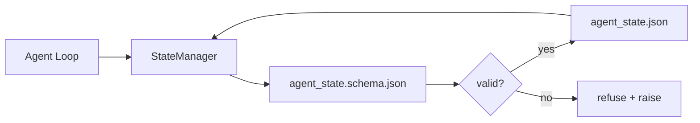

# 仓库记忆与持久状态

> 聊天历史是易失的,仓库才是持久的。工作台把代理状态存进带版本的文件里,这样下一次会话、下一个代理、下一位审查者看到的都是同一份真相源。

**Type:** 构建
**Languages:** Python（标准库 + 可选 `jsonschema`）
**Prerequisites:** 第 14 阶段 · 32（最小工作台）
**Time:** 约 60 分钟

## 学习目标

- 定义哪些信息应该进入 repo memory,哪些只该留在聊天历史里。
- 为 `agent_state.json` 和 `task_board.json` 编写 JSON Schema。
- 构建一个能够加载、验证、变更并以原子方式持久化状态的 state manager。
- 通过 schema 在坏写入污染工作台之前就把它拒之门外。

## 问题

代理结束了一次会话。聊天窗口关掉了。下一次会话再打开时,系统问它该从哪里继续。模型说“我先看看文件”,读了几份过时笔记,然后把本来已经完成的工作又做了一遍。更糟的是,它可能还会重写一个已经完工的文件,因为从来没人明确告诉过它“这个文件已经结束了”。

工作台的修复方式就是 repo memory: 把状态存进仓库里的 JSON 文件,用 schema 约束,用原子写入持久化,并让代码审查能清楚看见 diff。聊天只是瞬时信息流,repo 才是记录系统。

## 概念



### 哪些内容应该放进 repo memory

| 应当包含 | 不应包含 |
|---------|-----------------|
| 当前活跃任务 id | 原始聊天转录 |
| 本次会话碰过哪些文件 | token 级推理轨迹 |
| 代理做过哪些假设 | “用户看起来有点烦躁” |
| 仍然打开的 blocker | 采样得到的 completion 文本 |
| 下一步动作 | 某个厂商特定的 model id |

判断标准是“耐久性”: 三个月后在一次 CI 重跑里,这些信息是否仍然有价值? 如果答案是 yes,放进 repo; 如果答案是 no,那它更像 telemetry。

### 先有 schema,再谈状态

JSON Schema 就是契约。没有它,每个代理都会发明自己的字段,每个审查者都得重新学习一种状态形状,每个 CI 脚本都得特判历史版本。有了它,坏写入就会变成被拒绝的写入。

schema 至少要覆盖:

- 必填键。
- 允许的 `status` 值。
- 禁止值,例如数组不允许写成 `null`。
- 模式约束,例如任务 id 必须匹配 `T-\d{3,}`。
- 用于迁移的版本字段。

### 原子写入

状态写入必须能扛住部分失败: 先写到临时文件,再 fsync,最后重命名覆盖目标文件。状态文件是工作台的真相源; 半写成功的状态文件,比完全没有状态文件更糟。

### 迁移

一旦 schema 改了,就要把迁移脚本和 schema bump 一起发出去。状态文件需要带上 `schema_version` 字段; manager 如果发现文件版本自己不会迁,就应该直接拒绝加载。

```figure
wb-state-persist
```

## 动手构建

`code/main.py` 实现了:

- `agent_state.schema.json` 和 `task_board.schema.json`。
- 一个只依赖 stdlib 的验证器,支持 JSON Schema 的一个子集: required、type、enum、pattern、items。
- `StateManager.load`、`StateManager.update`、`StateManager.commit`,采用临时文件加重命名的原子写入方式。
- 一个演示流程: 修改状态、持久化、重新加载,并证明整个 round-trip 是正确的。

运行它:

```
python3 code/main.py
```

脚本会写出 `workdir/agent_state.json` 和 `workdir/task_board.json`,跨两轮状态变更运行,并在每一步打印通过验证后的状态。

## 生产环境里的常见模式

有四种模式,能把本课的最小实现扩展成多代理 monorepo 也扛得住的形态。

**atomic temp-and-rename 不是可选项。** Hive 项目 2026 年 3 月的一份 bug report 很典型: `state.json` 直接通过 `write_text()` 写入,异常还被 catch 后悄悄吞掉。结果是部分写入留下的损坏状态,会让后续会话在完全没有信号的情况下从错误状态恢复。标准修复永远是: 在目标文件同目录里 `tempfile.mkstemp`,写入,`fsync`,然后 `os.replace`。本课里的 `atomic_write` 做的就是这件事。

**所有非幂等工具调用都要带 idempotency key。** 如果代理在调用工具之后、但在把结果 checkpoint 下来之前崩溃,恢复流程就会重试这次工具调用。对读操作没问题,但对发邮件、插数据库、上传文件这类非幂等操作就很危险。标准模式是: 在执行前,把每次工具调用的 ID 记进 `pending_calls.jsonl`; 重试时先查这个 ID,如果已经存在,就跳过真正调用,直接使用缓存结果。Anthropic 和 LangChain 在 2026 年的实践指南里都明确提到过这一点; LangGraph 的 checkpointer 持久化 pending writes,本质上也是为了解决同类问题。

**把大体积产物和状态分开。** 不要把 CSV、长转录或者生成文件直接塞进 `agent_state.json`。把产物另存为独立文件,或者上传到 object storage,状态里只保存路径。这样 checkpoint 保持小而快,而大体积产物可以独立增长。

**用 event sourcing 做审计,用 snapshot 做恢复。** 每次状态变更都追加一条事件到 `state.events.jsonl`; 定期把完整状态快照到 `state.json`。恢复时先读 snapshot,再重放 snapshot 时间戳之后的事件。这样会多占一点磁盘,但能让你在排查长程任务时逐步复现代理决策过程,非常关键。这和 Postgres 的 WAL 机制是同一种结构。

**要么提供 schema migration,要么拒绝加载。** `schema_version` 这个整数就是契约。当 manager 读到一个自己不认识的版本时,就应该拒绝读取。把迁移脚本跟着 schema bump 一起发出; `tools/migrate_state.py` 应该能在每次启动时幂等运行。

## 如何使用

在生产环境中:

- **LangGraph checkpointers.** 思路完全一样,只是底层存储换成了 SQLite、Postgres 或自定义后端。本课教的 schema,正是当 checkpointer 挂掉时你还能够手工读懂状态所依赖的东西。
- **Letta memory blocks.** 这也是持久块加结构化 schema 的思路,只是作用域落在长生命周期 persona 上,见 Phase 14 · 08。
- **OpenAI Agents SDK session store.** 它支持可插拔后端,也有 schema-aware 的状态观念。本课的 state file 可以看作它的本地文件版后端。

## 交付成果

`outputs/skill-state-schema.md` 会生成一对项目专用 JSON Schema（state + board）、一个带原子写入能力的 Python `StateManager`,以及一个迁移脚手架,确保下一次 schema bump 不会把工作台直接打坏。

## 练习

1. 增加一个 `last_human_touch` 时间戳。如果代理写入发生在人类编辑后五秒内,就拒绝执行。
2. 把验证器扩展到支持 `oneOf`,让一个任务可以是 build task 或 review task,两者拥有不同的必填字段。
3. 增加 `schema_version` 字段,并实现从 v1 到 v2 的迁移,把 `blockers` 重命名为 `risks`。
4. 把存储后端从本地文件换成 SQLite,但保持 `StateManager` API 完全不变。
5. 让两个代理同时对同一个状态文件发起 50 ms 写入竞争。会出什么问题? atomic rename 又究竟帮你挡住了什么?

## 关键术语

| 术语 | 常见说法 | 实际含义 |
|------|----------|----------|
| Repo memory | “笔记文件” | 在仓库跟踪文件中、按 schema 存储的状态 |
| Schema-first | “先校验输入” | 先定义契约,再写 writer,拒绝状态漂移 |
| Atomic write | “不就是 rename 吗” | 先写临时文件、fsync、再重命名,让部分失败无法污染状态 |
| Migration | “schema bump” | 把 vN 状态转换成 v(N+1) 状态的脚本 |
| System of record | “source of truth” | 工作台最终认定为权威来源的那个工件 |

## 延伸阅读

- [JSON Schema specification](https://json-schema.org/specification.html)
- [LangGraph checkpointers](https://langchain-ai.github.io/langgraph/concepts/persistence/)
- [Letta memory blocks](https://docs.letta.com/concepts/memory)
- [Fast.io, AI Agent State Checkpointing: A Practical Guide](https://fast.io/resources/ai-agent-state-checkpointing/) — schema-first checkpointing 与 idempotency 的实践
- [Fast.io, AI Agent Workflow State Persistence: Best Practices 2026](https://fast.io/resources/ai-agent-workflow-state-persistence/) — 并发控制、TTL 和 event sourcing
- [Hive Issue #6263 — non-atomic state.json writes silently ignored](https://github.com/aden-hive/hive/issues/6263) — 真实项目里的失败模式
- [eunomia, Checkpoint/Restore Systems: Evolution, Techniques, Applications](https://eunomia.dev/blog/2025/05/11/checkpointrestore-systems-evolution-techniques-and-applications-in-ai-agents/) — 把操作系统历史上的 checkpoint/restore 原语迁移到代理系统
- [Indium, 7 State Persistence Strategies for Long-Running AI Agents in 2026](https://www.indium.tech/blog/7-state-persistence-strategies-ai-agents-2026/)
- [Microsoft Agent Framework, Compaction](https://learn.microsoft.com/en-us/agent-framework/agents/conversations/compaction) — 厂商侧的 checkpoint manager
- Phase 14 · 08 — memory blocks 与 sleep-time compute
- Phase 14 · 32 — 本课为之补上 schema 的三文件最小工作台
- Phase 14 · 40 — 读取同一套 schema 的 handoff packet
