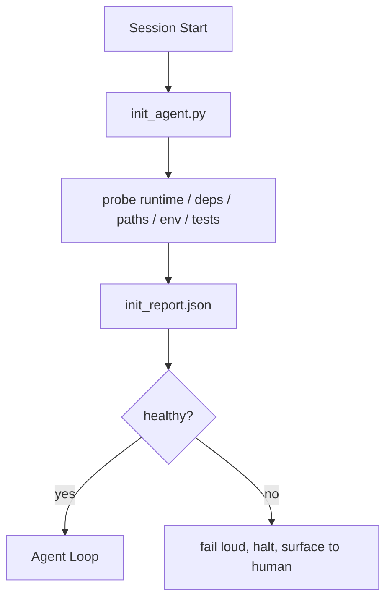

# 代理的初始化脚本

> 每一次冷启动会话都要交一笔“初始化税”。代理会反复读取同一批文件、重跑同样的探测、重新发现同样的路径。一个 init script 的作用,就是把这笔税只交一次,然后把答案写进状态里。

**Type:** 构建
**Languages:** Python（标准库）
**Prerequisites:** 第 14 阶段 · 32（最小工作台），第 14 阶段 · 34（仓库记忆）
**Time:** 约 45 分钟

## 学习目标

- 识别哪些准备工作代理不应该在每次会话里重复做。
- 构建一个确定性的 init script,探测 runtime、依赖和仓库健康状态。
- 持久化探测结果,让代理直接读取结果而不是每次重跑检查。
- 在初始化失败时做到响亮失败、快速失败,并且只留一个排查入口。

## 问题

打开一个新会话。代理先猜 Python 版本,再猜测试命令,然后为了找到入口点把 repo 根目录列了五遍,接着尝试导入一个根本没安装的包,最后又去问用户配置文件在哪。等它真正开始编辑代码时,上万 token 已经花在本来应该由一个脚本一次性搞定的准备工作上了。

解决办法就是: 在代理做任何正事之前先跑一份初始化脚本,让它写出 `init_report.json`,而代理启动时只需要读取这份报告。

## 概念



### 初始化脚本应该探测什么

| 探测项 | 重要原因 |
|-------|----------------|
| Runtime versions | Python 或 Node 版本不对,会引入“悄悄跑错版本”的 bug |
| Dependency availability | 少装一个包,越晚发现成本越高,现在抓住只要十分之一代价 |
| Test command | 代理必须知道如何验证; 如果连命令都不存在,工作台本身就是坏的 |
| Repo paths | 硬编码路径会漂移; 最好一次解析、固定下来 |
| Environment variables | 缺少 `OPENAI_API_KEY` 应该被视为明确失败面,不是运行时谜题 |
| State + board freshness | 上次崩掉后留下的陈旧状态是个陷阱 |
| Last-known-good commit | 会话结束做 handoff diff 时需要一个锚点 |

### 响亮失败、快速失败,并且只在一个地方失败

任何 probe 失败,都意味着应该停下来并把问题暴露给人类。不要指望“代理自己会想办法”。初始化脚本存在的意义,就是在工作台已经坏掉时明确拒绝启动。

### 幂等

连续运行两次。第二次除了时间戳更新之外,应该几乎是 no-op。正是这种幂等性,让你可以放心把脚本接到 CI、hooks,甚至某个 pre-task slash command 上。

### Init 和 startup rules 的关系

规则（Phase 14 · 33）负责描述“要行动之前必须满足什么”; init 则是负责建立并验证这些前置条件的脚本。只有规则没有 init,规则就会沦为“注意一点”; 只有 init 没有规则,初始化做得再漂亮也只是精致地失败。

```figure
wb-init-probes
```

## 动手构建

`code/main.py` 实现了 `init_agent.py`:

- 五个 probe: Python 版本、通过 `importlib.util.find_spec` 检查依赖是否可用、测试命令是否可解析、必需环境变量是否存在、状态文件是否新鲜。
- 每个 probe 都返回一个 `(name, status, detail)`。
- 脚本会写出 `init_report.json`,只要任意 block-severity 的 probe 失败,就以非零状态码退出。

运行它:

```
python3 code/main.py
```

脚本会打印 probe 表格,写出 `init_report.json`,并在 happy path 返回 0; 如果有失败 probe,则返回非零并列出失败项。

## 生产环境里的常见模式

有三种模式能区分“真正有用的 init script”和“纯仪式化步骤”。

**最后已知良好提交（last-known-good commit）锚定。** 把当前 commit 和一个 `LKG` 文件里记录的上次成功合并基线对比。如果 diff 超出预算,默认 50 个文件,就拒绝启动,要求人工确认新的基线。Cloudflare 的 AI Code Review 就用这个方式给 reviewer agents 定范围: 每次审查都锚定同一个 last-known-good,避免会话之间不断累积漂移。

**带 TTL 的锁文件。** 第一次成功探测后写出 `prereqs.lock`。后续运行在 N 小时内（默认 24h）可以直接信任这份锁,跳过昂贵的 probe。init script 会先读锁; 如果它还新鲜,并且依赖清单 hash 也一致,就直接短路返回。这和 Docker layer cache 的思路完全一样: 幂等探测 + 内容哈希 = 安全跳过。

**热路径里不允许网络、LLM 或意外惊喜。** init probes 应该是确定性的基础设施检查。一个需要调用 LLM 来判断错误类型的 probe,或者一个需要访问外部服务来确认 license 状态的 probe,都已经不是 probe,而是 workflow。如果某个 probe 在 dry run 下要跑超过三秒,就把它视作工作台异味: 要么移出 init,要么把结果缓存起来。

## 如何使用

在生产环境中:

- **Claude Code hooks.** `pre-task` hook 会先调用 init script; 一旦失败,代理根本不会启动。
- **GitHub Actions.** 可以加一个 `setup-agent` job 先跑 init script,真正的 agent job 再依赖它执行。
- **Docker entrypoint.** 代理容器先执行 init script,确认环境健康后再 exec 真正的 agent runtime; 若失败则直接把日志暴露出来。

init script 之所以可移植,正是因为它不依赖特定框架。Bash、Make、tasks file 都可以把它包起来。

## 交付成果

`outputs/skill-init-script.md` 会访谈项目方,把他们的准备工作分类成一组 probes,然后生成项目专属的 `init_agent.py` 和一个会在任何 agent step 之前先跑它的 CI workflow。

## 练习

1. 增加一个 probe,对比当前提交与 last-known-good 提交; 如果改动文件超过 50 个,就拒绝启动。
2. 让脚本写出 `prereqs.lock`,并在锁文件超过 7 天时拒绝启动。
3. 添加一个 `--fix` 开关,自动安装缺失的开发依赖,但在未经批准的情况下绝不修改运行时依赖。
4. 把 probes 从硬编码函数迁移到 YAML registry,并为这种设计取舍辩护。
5. 给每个 probe 增加时间预算。任何超过三秒的 probe,都应该被视为工作台异味。

## 关键术语

| 术语 | 常见说法 | 实际含义 |
|------|----------|----------|
| Probe | “检查” | 返回 `(name, status, detail)` 的确定性函数 |
| Init report | “启动输出” | 写在状态旁边、记录全部探测结果的 JSON |
| Idempotent | “可以安全重跑” | 连续两次运行除了时间戳外应得到相同结果 |
| Fail loud | “不要悄悄吞掉” | 停止执行并把问题暴露给人类,不做静默回退 |
| Setup tax | “启动成本” | 代理每次会话为重新发现显而易见的信息所花掉的 token |

## 延伸阅读

- [Anthropic, Effective harnesses for long-running agents](https://www.anthropic.com/engineering/effective-harnesses-for-long-running-agents)
- [GitHub Actions, composite actions for setup](https://docs.github.com/en/actions/sharing-automations/creating-actions/creating-a-composite-action)
- [microservices.io, GenAI dev platform: guardrails](https://microservices.io/post/architecture/2026/03/09/genai-development-platform-part-1-development-guardrails.html) — 把 pre-commit 与 CI 检查当成 init 的一部分
- [Augment Code, How to Build Your AGENTS.md (2026)](https://www.augmentcode.com/guides/how-to-build-agents-md) — 对初始化阶段的要求
- [Codex Blog, Codex CLI Context Compaction](https://codex.danielvaughan.com/2026/03/31/codex-cli-context-compaction-architecture/) — 将会话启动视为具备 compaction 意识的 init
- Phase 14 · 33 — 本脚本为哪套规则提供执行前提
- Phase 14 · 34 — 本脚本要播种的状态文件
- Phase 14 · 38 — 接收 init script 输出的验证闸门
- Phase 14 · 40 — 消费 init report 中 last-known-good 信息的 handoff
