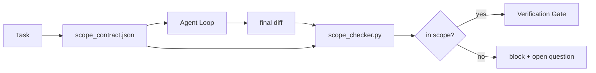

# 范围契约与任务边界

> 模型并不知道工作该在什么地方结束。范围契约是一个按任务存在的文件，明确写清工作从哪里开始、到哪里结束，以及一旦越界该如何回滚。它把“请保持在范围内”从一句愿望，变成一个可以检查的约束。

**Type:** 构建
**Languages:** Python（标准库）
**Prerequisites:** 第 14 阶段 · 32（最小工作台），第 14 阶段 · 33（作为可执行约束的规则）
**Time:** 约 50 分钟

## 学习目标

- 编写一份范围契约，让代理在任务开始时读取，让验证器在任务结束时读取。
- 指定允许修改的文件、禁止触碰的文件、验收标准、回滚方案和审批边界。
- 实现一个范围检查器，对照契约比对 diff 并标记违规项。
- 让范围蔓延变得可见、自动、可复审。

## 问题

代理很容易越做越多。任务原本只是“修复登录 bug”，最后 diff 却同时改了登录路由、邮件助手、数据库驱动、README 和发布脚本。回头看，每一次改动当下似乎都说得通；但合在一起，它已经不是评审时承诺的那次改动了。

范围蔓延是代理工作中最少被监控的失败模式之一，因为代理往往会真诚地叙述每一步。解决办法不是把提示词写得更严，而是在磁盘上落一份契约：事先承诺了什么，事后结果是否符合承诺，由检查来裁定。

## 概念



### 范围契约里应该写什么

| 字段 | 作用 |
|-------|---------|
| `task_id` | 把这次任务和看板中的任务条目关联起来 |
| `goal` | 用一句话写出评审者可以核验的目标 |
| `allowed_files` | 代理允许写入的 glob 模式 |
| `forbidden_files` | 即使是误操作也绝不能碰的 glob 模式 |
| `acceptance_criteria` | 用于证明任务完成的测试命令或断言语句 |
| `rollback_plan` | 如果必须中止，操作员可以执行的一段回滚方案 |
| `approvals_required` | 超出范围、必须显式获得人工签字的动作 |

一份没有 `forbidden_files` 的契约是不完整的。负空间本身就是契约的一半。

### 用 glob，而不是写死路径

真实仓库里的文件会移动。契约应当绑定到 glob，例如 `app/**/*.py`、`tests/test_signup*.py`，这样即使两次会话之间发生了重构，契约也不会立即失效。

### 回滚本身就是范围的一部分

把“如何回滚”写进契约，会强迫编写者提前思考哪里可能出错。一份无法回滚的契约，本身就不该获批。

### 范围检查本质上是 diff 检查

代理最终产出的是一个 diff。检查器读取这个 diff、允许的 glob、禁止的 glob，以及已经运行过哪些验收命令。每一条违规都会变成带标签的发现项，供验证闸门决定是否拒绝放行。

### 两个高度的范围：功能列表与任务契约

范围契约约束的是单个任务，而不是整个项目。代理完全可能在“修复登录”这件事上严格遵守契约，却在下一轮顺手决定项目还需要设置页、深色模式切换和一次路由器重写。因为契约从未回答“项目当前允许做什么”，只回答了“这个任务允许碰哪些文件”。

更高一层的约束需要单独的原语：在会话开始时读取一份 `feature_list.json`。它是机器可读、带顺序的项目待办列表。代理只能挑选一个 `status` 为 `todo` 的功能，把它的 `id` 写进当前激活的范围契约，并且在同一会话中禁止再开启第二个功能。这样，“一次只做一个功能”就不再是提示词里一句可以被合理化绕过的话，而是磁盘上的一个值，也是闸门可以强制执行的规则。

```json
{
  "project": "knowledge-base",
  "active": "import-pdf",
  "features": [
    { "id": "import-pdf",   "status": "in_progress", "goal": "import a PDF into the library",        "done_when": "pytest tests/test_import.py && a sample PDF appears in the library view" },
    { "id": "full-text-search", "status": "todo",     "goal": "search document text and rank hits",   "done_when": "query returns ranked results with snippets" },
    { "id": "cite-answers", "status": "todo",         "goal": "answers carry source citations",        "done_when": "every answer renders at least one clickable citation" }
  ]
}
```

| 字段 | 作用 |
|-------|---------|
| `active` | 当前会话唯一允许触碰的功能；为空表示先选一个并写回 |
| `features[].id` | 稳定的 slug，供范围契约中的 `task_id` 指向 |
| `features[].status` | `todo`、`in_progress`、`done`、`blocked`；同一时刻只能有一个 `in_progress` |
| `features[].goal` | 用一句话写出评审者可核验的目标 |
| `features[].done_when` | 把 `in_progress` 翻转为 `done` 的验收语句 |

这个列表要想真正起作用，需要两条规则。第一，不变量“最多只有一个 `in_progress`”本身就是启动检查的一部分（Phase 14 · 33）：如果文件里同时有两个，会话应直接拒绝启动，直到人工解决。第二，功能列表必须是文件而不是聊天消息，因为聊天会滚出上下文，而文件会在跨会话、跨代理时持续存在。交接流程（Phase 14 · 40）会把完成的功能状态写回 `done`，这样下一次会话打开的就是准确的看板，而不是再去猜剩余工作。

契约与功能列表按最小权限原则组合，和下面提到的合并语义一致：任务契约中的 `allowed_files` 必须完全落在当前激活功能允许触及的范围内，不能越界。

```figure
wb-scope-bounce
```

## 动手构建

`code/main.py` 实现了：

- `scope_contract.json` 的模式定义（JSON Schema 的一个子集，重点是 glob 数组）。
- 一个 diff 解析器，把“触碰过的文件列表 + 运行过的命令列表”整理成 `RunSummary`。
- 一个 `scope_check`，返回相对于契约的 `(violations, in_scope, off_scope)`。
- 两次演示运行：一次严格在范围内，一次发生蔓延。检查器会给出越界文件以及对应原因。

运行：

```
python3 code/main.py
```

输出包括：契约内容、两次运行、每次运行的判定结果，以及保存到磁盘的 `scope_report.json`。

## 生产环境中的常见模式

有实践者在调用代理前先用 YAML 写“specsmaxxing”式的范围契约，三周内在不更换模型的情况下，把 rabbit-hole rate 从 52% 降到了 21%。起作用的是契约，不是模型本身。下面三个模式能把这类收益稳定下来。

**违规预算，而不是二元失败。** `agent-guardrails`（一个通过 MCP 被 Claude Code、Cursor、Windsurf、Codex 等调用的开源合并闸门）为每个任务提供 `violationBudget`：预算内的轻微越界会被标成警告，只有超出预算才会真正拒绝合并。再配合 `violationSeverity: "error" | "warning"` 使用。有没有预算，决定了这个闸门会被团队长期保留，还是很快因为“太烦”而被关掉。

**按路径家族做严重级别不对称。** 对 `docs/**` 的越界写入通常只是 `warn`；对 `scripts/**`、`migrations/**`、`config/prod/**` 的越界写入则始终应是 `block`。这种不对称必须写在契约里，而不是写死在运行时，因为它是项目特定的，并且会随着任务变化。

**文件预算之外，还要有时间和网络预算。** `time_budget_minutes` 用来约束最长墙钟时间；一旦超时，运行时必须拒绝继续，除非重新获批。对 hostname 的 `network_egress` allowlist 则能阻止代理悄悄访问本不属于任务的一些外部 API。这些也属于范围维度；单靠文件 glob 远远不够。

**多契约合并语义（最小权限）。** 当两个范围契约同时生效时，例如一个项目级契约加一个任务级契约，合并规则应是：`allowed_files` 取**交集**（两边都允许才能写），`forbidden_files` 取**并集**（任一方禁止就不能碰），`time_budget_minutes` 取更严格的那个（最小值），`approvals_required` 则累积。`network_egress` 的语义是：`None` 表示不启用约束，`[]` 表示全部拒绝，`[...]` 表示 allowlist；合并时，`None` 服从另一侧，两边都是列表则取交集，而 deny-all 会继续保持 deny-all。把这套语义写进契约 schema，合并才能做到机械、透明、可审查。

## 投入使用

生产中的常见接法：

- **Claude Code slash commands。** 用 `/scope` 命令生成契约，并把它固定为会话上下文。子代理在执行前同样先读这份契约。
- **GitHub PR。** 把契约作为 PR 描述里的 JSON 文件，或者作为一个随代码提交的制品。CI 再对合并 diff 运行范围检查器。
- **LangGraph interrupts。** 一旦发生范围违规就触发 interrupt；处理器询问人工：是应该扩张契约，还是让代理退回去收敛范围。

契约应该跟着任务一起流转。任务结束后，契约会被归档到 `outputs/scope/closed/`。

## 交付成果

`outputs/skill-scope-contract.md` 会根据任务描述生成范围契约，并产出一个支持 glob 的检查器，在 CI 中对每一次代理 diff 执行检查。

## 练习

1. 增加 `network_egress` 字段，列出允许访问的外部主机；一旦运行中触碰其他主机，就直接拒绝。
2. 扩展检查器：对 `docs/**` 软失败，对 `scripts/**` 硬失败，并为这种不对称给出理由。
3. 让契约通过静态规则集（不使用 LLM）推导 `allowed_files`，依据是 `goal` 字段。第一个边界案例会如何失效？
4. 添加 `time_budget_minutes`，一旦墙钟超时就拒绝继续。
5. 对同一个 diff 同时应用两份契约。两者都生效时，正确的合并语义是什么？

## 关键术语

| 术语 | 常见说法 | 实际含义 |
|------|----------|----------|
| 范围契约 | “任务说明” | 按任务编写的 JSON，列出允许/禁止文件、验收标准和回滚方案 |
| 范围蔓延 | “它顺手还改了……” | 同一任务里改到了契约外的文件 |
| 回滚方案 | “我们可以回退” | 一段供操作员执行的停机/回滚 runbook |
| 审批边界 | “这要签字” | 契约中列出的、必须显式获得人工批准的动作 |
| Diff 检查 | “路径审计” | 把触碰到的文件与契约 glob 逐一比对 |

## 延伸阅读

- [LangGraph 人在环中断](https://langchain-ai.github.io/langgraph/concepts/human_in_the_loop/)
- [OpenAI Agents SDK 工具审批策略](https://platform.openai.com/docs/guides/agents-sdk)
- [logi-cmd/agent-guardrails — merge gates and scope validation](https://github.com/logi-cmd/agent-guardrails) —— 违规预算与严重级别分层
- [Dev|Journal, Preventing AI Agent Configuration Drift with Agent Contract Testing](https://earezki.com/ai-news/2026-05-05-i-built-a-tiny-ci-tool-to-keep-ai-agent-configs-from-drifting-in-my-repo/) —— 无外部依赖的 `--strict` 模式
- [Agentic Coding Is Not a Trap (production logs)](https://dev.to/jtorchia/agentic-coding-is-not-a-trap-i-answered-the-viral-hn-post-with-my-own-production-logs-33d9) —— specsmaxxing 的实际数据：52% → 21%
- [OpenCode permission globs](https://opencode.ai/docs/agents/) —— 细粒度权限范围控制
- [Knostic, AI Coding Agent Security: Threat Models and Protection Strategies](https://www.knostic.ai/blog/ai-coding-agent-security) —— 把范围控制视为最小权限的一部分
- [Augment Code, AI Spec Template](https://www.augmentcode.com/guides/ai-spec-template) —— 三层边界系统（must / ask / never）
- Phase 14 · 27 —— 与范围锁配套的提示注入防御
- Phase 14 · 33 —— 本课按任务具体化的那套规则
- Phase 14 · 38 —— 接收检查器输出的验证闸门
