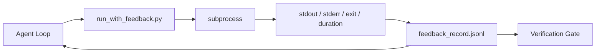

# 运行时反馈循环

> 看不到真实命令输出的代理只能靠猜。反馈运行器会把 stdout、stderr、退出码和耗时捕获成结构化记录，供下一轮读取。这样代理对着的是事实，而不是它对事实的预测。

**Type:** 构建
**Languages:** Python（标准库）
**Prerequisites:** 第 14 阶段 · 32（最小工作台），第 14 阶段 · 35（初始化脚本）
**Time:** 约 50 分钟

## 学习目标

- 区分“运行时反馈”与“可观测性遥测”。
- 构建一个包装 shell 命令并持久化结构化记录的反馈运行器。
- 用确定性截断处理大输出，让循环始终留在 token 预算内。
- 当反馈缺失时，拒绝让代理循环继续向前推进。

## 问题

代理说“现在开始跑测试”。下一条消息又说“所有测试都通过了”。而真实情况可能是：测试根本没跑；命令跑了但结果没读；或者结果读了，却在截断时把关键失败行静默丢掉了。

反馈运行器就是为了消掉这条缝。所有命令都必须通过运行器。每条记录都带着：命令本身、捕获到的 stdout 和 stderr、退出码、墙钟耗时，以及一条代理预期说明。代理在下一轮读取这份记录；验证闸门在任务结束时也读取同样的记录。

## 概念



### 一条反馈记录里应该有什么

| 字段 | 为什么重要 |
|-------|----------------|
| `command` | 精确的 argv，避免 shell 展开带来的歧义 |
| `stdout_tail` | 最后 N 行输出，按确定性规则截断 |
| `stderr_tail` | stderr 的最后 N 行，和 stdout 分开保存 |
| `exit_code` | 最明确的成功/失败信号 |
| `duration_ms` | 能暴露慢探测和失控进程 |
| `started_at` | 便于按时间顺序重放 |
| `agent_note` | 代理在读结果前写下的一句预期 |

### 截断必须是确定性的

50 MB 的日志会直接拖垮整个循环。所以运行器要对头尾做确定性截断，并插入 `...truncated N lines...` 这样的标记。不能抽样，因为代理最需要看的东西通常都在尾部：最终报错、最终汇总、最终退出信息。

### 反馈不是遥测

遥测（Phase 14 · 23，OTel GenAI 约定）服务的是横跨时间的人类运维者；反馈服务的是“这一次运行的下一轮”。两者字段可能重叠，但文件不同、保留策略也不同。

### 没有反馈，就拒绝推进

如果运行器在拿到退出码前就报错，记录里应该写 `exit_code: null` 和 `error: <reason>`。代理循环必须拒绝在 `null` 退出时宣称成功。没有退出码，就没有进展。

```figure
wb-feedback-loop
```

## 动手构建

`code/main.py` 实现了：

- `run_with_feedback(command, agent_note)`：对 `subprocess.run` 的包装，捕获 stdout、stderr、退出码和耗时，做确定性截断，并把记录追加到 `feedback_record.jsonl`。
- 一个小型加载器：把 JSONL 流式读成 Python 列表。
- 一个演示：运行三个命令（成功、失败、缓慢），并打印每个命令最后一条记录。

运行：

```
python3 code/main.py
```

输出是：三条追加到 `feedback_record.jsonl` 中的反馈记录，以及每个命令对应的最后一条记录。多跑几次，再去 tail 这个文件，就能看到反馈循环如何逐步积累。

## 生产环境中的常见模式

有三个模式能把这个运行器强化到可上线的程度。

**在写入时做脱敏，而不是在读取时。** 任何包含 stdout 或 stderr 的记录都可能泄露秘密。因此，运行器应在写入 JSONL 之前先做一轮脱敏：删掉匹配 `^Bearer `、`password=`、`api[_-]?key=`、`AKIA[0-9A-Z]{16}`（AWS）、`xox[baprs]-`（Slack）等模式的内容。读取时再脱敏是个陷阱，因为真正能被攻击者拿到的是磁盘上的文件。脱敏规则应按生产环境里真实观察到的 secret 格式，至少每季度复核一次。

**要有轮转策略，而不是永远写一个文件。** 把 `feedback_record.jsonl` 限制为每个文件最多 1 MB；溢出后轮转到 `.1`、`.2`，并丢弃 `.5`。代理循环平时只读取当前文件，这样运行时成本有上界；而 CI 的制品存储则可以保存整个轮转集。不做轮转的话，文件最终会成为每次加载时的瓶颈。

**为重试链增加父命令 id。** 每条记录都有 `command_id`；发生重试时，新记录再加上 `parent_command_id` 指向上一次尝试。审查者的“失败尝试”列表（Phase 14 · 40）和验证闸门的审计逻辑都可以沿着这条链向前追踪。没有这个链接，重试看起来会像几次彼此无关的成功，失败历史就被埋掉了。

## 投入使用

生产中的常见接法：

- **Claude Code Bash tool。** 这个工具本身已经会捕获 stdout、stderr、退出码和耗时；本课的运行器是对任何代理产品都通用的、与框架无关的等价物。
- **LangGraph nodes。** 把任何 shell 节点都包进运行器，这样记录就不会只存在于 graph state 里。
- **CI logs。** 把 JSONL 作为构建制品上传到 CI 存储，评审者无需重跑整个会话也能重放任意命令。

这个运行器很薄，但足够稳，因为它真正拥有的是记录格式本身，而不是某个具体框架。

## 交付成果

`outputs/skill-feedback-runner.md` 会生成一个项目定制版的 `run_with_feedback.py`：带上合适的截断预算、接入工作台的 JSONL 写入器，以及一个供代理每轮读取的加载器。

## 练习

1. 给每条记录增加 `cwd` 字段，让同一命令在不同目录下运行时可区分。
2. 添加 `redaction` 步骤，去掉匹配 `^Bearer ` 或 `password=` 的行，并用一个固定样例记录测试它。
3. 把 `feedback_record.jsonl` 的总大小限制在 1 MB，通过轮转到 `.1`、`.2` 等文件实现，并说明为何这样的轮转策略合理。
4. 添加 `parent_command_id`，让重试链可见：后一个命令到底消费了哪一次前序尝试的输出。
5. 把 JSONL 接到一个小型 TUI 上，并高亮最近一次非零退出。这个 TUI 至少要显示哪八类关键信息，才能在评审里真正有用？

## 关键术语

| 术语 | 人们常说 | 实际含义 |
|------|----------------|------------------------|
| 反馈记录 | “运行日志” | 包含命令、输出、退出码和耗时的结构化 JSONL 条目 |
| 尾部截断 | “把日志裁短” | 通过确定性的头尾保留，让记录落在 token 预算内 |
| Refuse-on-null | “缺数据就阻断” | 当 `exit_code` 为 null 时，循环禁止继续推进 |
| Agent note | “预期标签” | 代理在读取结果之前写下的一句预测 |
| 遥测分离 | “两份日志” | 反馈给下一轮，遥测给运维者 |

## 延伸阅读

- [OpenTelemetry GenAI semantic conventions](https://opentelemetry.io/docs/specs/semconv/gen-ai/)
- [Anthropic，长时运行智能体的有效 harness](https://www.anthropic.com/engineering/effective-harnesses-for-long-running-agents)
- [Guardrails AI x MLflow — deterministic safety, PII, quality validators](https://guardrailsai.com/blog/guardrails-mlflow) —— 把脱敏模式做成回归测试
- [Aport.io, Best AI Agent Guardrails 2026: Pre-Action Authorization Compared](https://aport.io/blog/best-ai-agent-guardrails-2026-pre-action-authorization-compared/) —— 工具调用前后捕获
- [Andrii Furmanets, AI Agents in 2026: Practical Architecture for Tools, Memory, Evals, Guardrails](https://andriifurmanets.com/blogs/ai-agents-2026-practical-architecture-tools-memory-evals-guardrails) —— 可观测性表面设计
- Phase 14 · 23 —— 遥测一侧的 OTel GenAI 约定
- Phase 14 · 24 —— 代理可观测平台（Langfuse、Phoenix、Opik）
- Phase 14 · 33 —— 要求“没有反馈就不能宣称完成”的规则
- Phase 14 · 38 —— 读取 JSONL 的验证闸门
