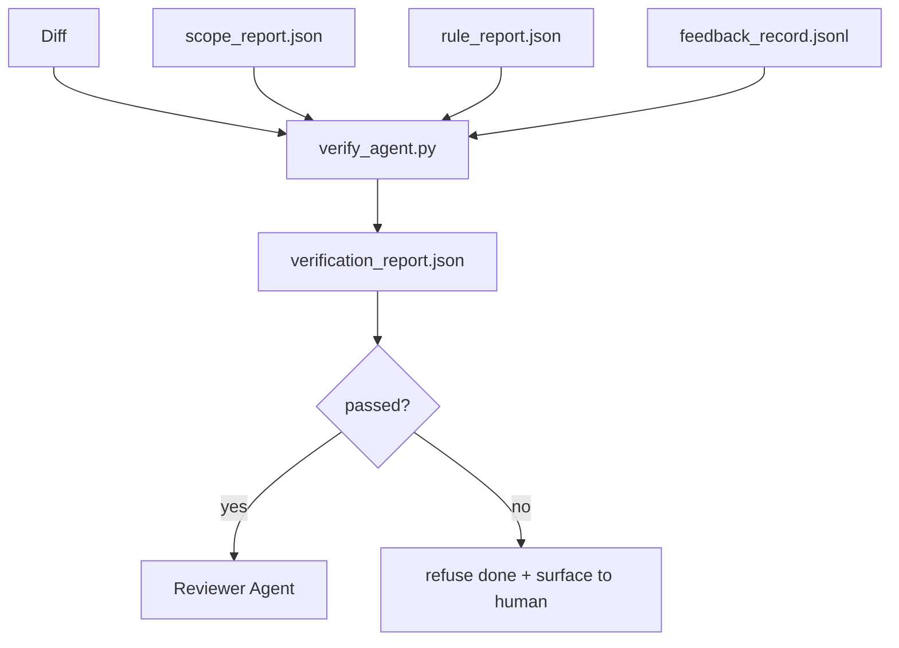

# 验证闸门

> 代理不能自己给自己的工作判定“已完成”。验证闸门会读取范围契约、反馈日志、规则报告和 diff，只回答一个问题：这个任务到底算不算完成？如果闸门说不算，那么无论聊天里说了什么，这个任务都没有完成。

**Type:** 构建
**Languages:** Python（标准库）
**Prerequisites:** 第 14 阶段 · 33（规则），第 14 阶段 · 36（范围），第 14 阶段 · 37（反馈）
**Time:** 约 55 分钟

## 学习目标

- 把验证闸门定义为一个作用于工作台制品上的确定性函数。
- 将规则报告、范围报告、反馈记录和 diff 合并为一个统一判定。
- 输出一份审查代理和 CI 都能读取的 `verification_report.json`。
- 对任何 block 级失败一律拒绝放行，不设例外。

## 问题

代理太容易宣称自己已经成功。最常见的三种形态是：

- “看起来不错。” 模型看了一眼自己的 diff，就认定没问题。
- “测试都通过了。” 说得很自信，但根本没有测试实际运行的记录。
- “已经满足验收标准。” 实际上只是把验收标准解释得足够宽松，宽松到“像是做完了”也算通过。

工作台里的修复方式，是设立一个单一验证闸门：读取代理已经产出的那些制品，再由它做决定。这个闸门是确定性的，在版本控制里，可接入 CI，也不会接受代理“讲道理”。

## 概念



### 闸门检查什么

| 检查项 | 来源制品 | 严重级别 |
|-------|-----------------|----------|
| 所有验收命令都实际运行过 | `feedback_record.jsonl` | block |
| 所有验收命令的退出码都是 0 | `feedback_record.jsonl` | block |
| 范围检查中没有禁止写入 | `scope_report.json` | block |
| 范围检查中没有越界写入 | `scope_report.json` | block 或 warn |
| 所有 block 级规则全部通过 | `rule_report.json` | block |
| 反馈中没有 `null` 退出码 | `feedback_record.jsonl` | block |
| 触碰文件与 `scope.allowed_files` 匹配 | 两者 | warn |

`warn` 只会给判定附加注释；`block` 则会直接阻止 `passed: true`。

### 要确定性，不要概率性

同一组输入制品，闸门每次都必须给出同一个判定。这里不该有 LLM 裁判。LLM 裁判属于审查侧（Phase 14 · 39），因为那边处理的是质量判断，不是完成状态。

### 一份报告，一个路径

闸门应在任务收尾时只输出一份 `verification_report.json`，路径固定为 `outputs/verification/<task_id>.json`。如果不同闸门各写各的路径，真相源就分叉了。

### 不允许例外放行

block 级发现不能由代理自行覆盖。它们只能由人工覆盖，而且覆盖必须留下 `override_reason` 和 `overridden_by` 用户 id。覆盖是一次有记录的签名变更，而不是代理的一次主观判断。

```figure
wb-gate-sequence
```

## 动手构建

`code/main.py` 实现了：

- 每一种输入制品的加载器，全部使用本地 stub，让课程本身保持自包含。
- 一个纯函数 `verify(task_id, artifacts) -> VerdictReport`。
- 一个打印器，用来展示逐项检查结果和最终的通过/失败。
- 三个任务场景演示：干净通过、发生范围蔓延、缺失验收证据。

运行：

```
python3 code/main.py
```

输出是三份判定报告，每份都保存在脚本旁边。

## 生产环境中的常见模式

有四种模式，能把闸门从“又一个 lint 任务”抬升为“真正决定是否放行的边界”。

**纵深防御，而不是单层闸门。** pre-commit hook → CI status check → pre-tool authz hook → pre-merge gate。每一层都采用确定性检查，因此上一层漏掉的失败会被下一层补住。microservices.io 在 2026 年 3 月的实践明确指出：pre-commit hook 是不可绕过的，因为它不像模型侧 skill 那样依赖代理是否愿意服从指令。验证闸门位于 CI / pre-merge 这一层。

**确定性检查负责定量，模型裁判只负责细微语义。** Anthropic 2026 的 Hybrid Norm 组合说得很直接：可验证奖励，例如单元测试、schema 检查、退出码，用来回答“代码是否真的解决了问题”；LLM rubric 用来回答“代码是否可读、安全、风格正确”。闸门处理前一类，审查代理（Phase 14 · 39）处理后一类。把这两类混在一起，只会让信号塌掉。

**覆盖日志要签名，不要靠 Slack 线程。** 每一次 override 都应该在 `outputs/verification/overrides.jsonl` 中写一行，包含：时间戳、finding code、原因、签字用户、当前 HEAD commit。运行时应拒绝任何没有签名的覆盖；而且整个审计轨迹应被 git 跟踪。这才是“覆盖策略”，而不是“覆盖表演”。

**把覆盖率下限当成一等检查。** `coverage_report.json` 可以提供一个 `coverage_floor` 检查，默认 80%。如果实测覆盖率低于该下限，或者相较于上一次合并的下限下降超过 1 个百分点，闸门就失败。没有这一条，代理很容易默默删掉会失败的测试，而验证报告依然保持绿色。

**`--strict` 模式把所有警告提升为阻断。** 对 release 分支、阻塞发布的 PR，或事故后的加严审查，可以启用 `--strict`，让所有警告都变成硬失败。这个标志应该按分支选择开启，而不是做成全局默认；否则日常开发流会被长期腐蚀。

## 投入使用

生产中的常见接法：

- **CI 步骤。** 一个 `verify_agent` 任务对代理产出的最终制品运行闸门。没有 `passed: true`，合并保护就拒绝放行。
- **交接前 hook。** 代理运行时在生成 handoff 文档前先调用闸门。没有绿色判定，就不允许交接。
- **人工排障。** 当代理声称任务完成，但人类怀疑有问题时，操作员直接读这份报告。

闸门是工作台流中的决定性边界，其他所有表面都在它上游。

## 交付成果

`outputs/skill-verification-gate.md` 会把闸门接入具体项目：哪些验收命令要喂给它、哪些规则属于 block 级、哪些越界写入可以容忍，以及覆盖审计日志如何存储。

## 练习

1. 增加一个 `coverage_floor` 检查：测试命令必须输出至少 80% 的覆盖率报告。思考这个下限值应由哪个制品承载。
2. 支持 `--strict` 模式，让所有 `warn` 都提升为 `block`。说明哪些场景下 strict mode 应该成为默认值。
3. 让闸门除了 JSON 之外再输出一份 Markdown 摘要。哪些字段该进摘要，哪些不该进？
4. 添加 `time_since_last_human_touch` 检查：任何在人类最后一次击键后 60 秒内被编辑的文件，都免于越界标记。
5. 把闸门跑在你自己产品里的真实代理 diff 上。有多少发现是真问题，有多少只是噪音？闸门还需要在哪些地方继续长出来？

## 关键术语

| 术语 | 人们常说 | 实际含义 |
|------|----------------|------------------------|
| 验证闸门 | “那个会拦住一切的检查” | 对工作台制品执行的确定性函数，输出 pass/fail 判定 |
| Block severity | “硬失败” | 会阻止 `passed: true` 的发现，必须人工签字覆盖 |
| Override log | “为什么它还能放行” | 带原因和用户 id 的签名记录，供审计复盘 |
| Acceptance command | “证明任务完成的证据” | 退出码为 0 才能定义 `done` 的 shell 命令 |
| One report path | “唯一真相源” | `outputs/verification/<task_id>.json`，供 CI 和人工共同消费 |

## 延伸阅读

- [Anthropic，面向长时运行应用开发的 harness 设计](https://www.anthropic.com/engineering/harness-design-long-running-apps)
- [OpenAI Agents SDK guardrails](https://openai.github.io/openai-agents-python/guardrails/)
- [microservices.io, GenAI dev platform: guardrails](https://microservices.io/post/architecture/2026/03/09/genai-development-platform-part-1-development-guardrails.html) —— 从 pre-commit 到 CI 的纵深防御
- [ICMD, The 2026 Playbook for Agentic AI Ops](https://icmd.app/article/the-2026-playbook-for-agentic-ai-ops-guardrails-costs-and-reliability-at-scale-1776661990431) —— 审批闸门阶梯（draft → approval → auto under thresholds）
- [Type-Checked Compliance: Deterministic Guardrails (arXiv 2604.01483)](https://arxiv.org/pdf/2604.01483) —— 用 Lean 4 展示确定性闸门的上界
- [logi-cmd/agent-guardrails — merge gate spec](https://github.com/logi-cmd/agent-guardrails) —— scope + mutation-testing gates
- [Guardrails AI x MLflow](https://guardrailsai.com/blog/guardrails-mlflow) —— 把确定性验证器做成 CI 评分器
- [Akira, Real-Time Guardrails for Agentic Systems](https://www.akira.ai/blog/real-time-guardrails-agentic-systems) —— 工具调用前后的闸门
- Phase 14 · 27 —— 闸门的对抗配套：提示注入防御
- Phase 14 · 36 —— 本闸门要执行的范围契约
- Phase 14 · 37 —— 本闸门要评分的反馈日志
- Phase 14 · 39 —— 由闸门交给它的审查代理
