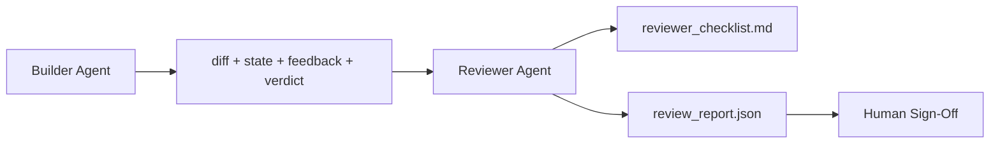

# 审查代理：把构建者和判定者分开

> 写代码的代理不能给自己的代码打分。审查者是第二个循环：它有不同的系统提示、不同的目标，并且对构建者产出的所有内容只有只读权限。构建者和审查者之间的这道间隙，正是大部分可靠性真正落脚的地方。

**Type:** 构建
**Languages:** Python（标准库）
**Prerequisites:** 第 14 阶段 · 38（验证闸门）
**Time:** 约 55 分钟

## 学习目标

- 说明为什么同一个代理无法可靠地审查自己的工作。
- 构建一个消费构建者制品并输出结构化审查报告的审查代理循环。
- 编写一个按具体维度打分而不是凭感觉判断的审查 rubric。
- 把审查者接入工作台，让人工审查从一份真实制品开始，而不是从空白页开始。

## 问题

你让代理去修复一个 bug。它改了四个文件，跑了测试，并报告任务完成。验证闸门（Phase 14 · 38）确认验收命令跑过，范围也守住了。闸门给出 `passed: true`。你合并了。两天后才发现：修复只解决了 bug 的错误那一半。

验收是必要条件，但不是充分条件。审查者负责问那些验收无法回答的问题：这次改动解决的是不是正确的问题？它有没有在没说明的情况下扩张范围？它有没有把本该质疑的假设直接吞下去？它有没有把工作台留在一个足够干净、足够明确、下一次会话能顺利接手的状态？

## 概念



### 审查 rubric

五个维度，每个维度打 0 到 2 分。

| 维度 | 问题 |
|-----------|----------|
| 问题匹配度 | 这次改动解决的是题目本身，而不是一个邻近但错误的问题吗？ |
| 范围纪律 | 修改是否被约束在契约内，还是契约被随意长大了？ |
| 假设透明度 | 所有隐藏假设是否都被写到了可复审的地方？ |
| 验证质量 | 验收命令真的证明了目标完成，还是只证明了一个更弱的版本？ |
| 交接准备度 | 下一次会话能否在当前状态上干净接手？ |

总分 10 分。低于 7 分是软失败；低于 5 分是硬失败。

### 审查者是独立角色，不一定是独立模型

你完全可以用和构建者相同的模型来运行审查者。关键不在于模型不同，而在于角色分离：不同的系统提示、不同的输入集合、没有写权限到 diff。姿态变了，信号才会变。

### 审查者不能修改 diff

审查者读取 diff、状态、反馈和判定结果；它只写报告，不修改代码。如果报告里写“这里需要修”，那么修复动作由下一轮构建者来完成，审查者下一次仍然只负责审查。角色一旦混在一起，这道关键间隙就没了。

### 审查 rubric 和验证闸门不是一回事

闸门（Phase 14 · 38）检查的是确定性事实：验收是否运行、规则是否通过、范围是否守住。审查者判断的是语义和质量：这是不是正确的工作、是否有足够文档、交接是否可用。两者缺一不可。

```figure
wb-builder-marker
```

## 动手构建

`code/main.py` 实现了：

- 一个 `ReviewerInputs` dataclass，用来打包审查者要读取的那些制品。
- 一个 rubric scorer：每个维度对应一个函数。为了课程自包含，这些函数都是确定性的 stub；真实系统里通常会调用 LLM。
- 一个 `review_report.json` 写入器，输出五个维度的得分、总分，以及最终 verdict（`pass`、`soft_fail`、`hard_fail`）。
- 两个演示案例：一个是干净改动，另一个是“测试没错，但解决的是错误问题”的改动。

运行：

```
python3 code/main.py
```

输出是两份写入磁盘的审查报告，以及一个打印在终端里的维度得分表。

## 生产环境中的常见模式

数据已经很直接。Cloudflare 在 2026 年 4 月的 AI 代码审查系统里，30 天内对 5,169 个仓库中的 48,095 个合并请求运行了 131,246 次审查。审查中位耗时 3 分 39 秒。最多会并行启用七类专职审查者：安全、性能、代码质量、文档、发布管理、合规、Engineering Codex；最上层再由一个 Review Coordinator 去重、合并并判断严重级别。顶级模型只留给协调者使用，专职审查者运行在更便宜的层级上。

这套方法能扩到规模化，靠的是四个模式。

**用专家池，而不是一个“万能大审查者”。** 在个人项目里，一个带五维 rubric 的审查者可能已经够用。但一旦代码库里同时存在安全关键、性能关键、文档关键等表面，就应当拆成多个专家，每个专家只拿更短、更聚焦的提示。协调者负责去重和汇总；专家本身不跑完整 rubric。模型分层自然也随之出现：便宜的专家，昂贵的协调者。

**把偏差缓解当成设计要求，而不是后期优化。** Adnan Masood 在 2026 年 4 月总结了四种稳定偏差：位置偏差（GPT-4 在 (A,B) 和 (B,A) 的排序上约有 40% 不一致）、冗长度偏差（更长的输出大约会多拿 15% 分数）、自偏好（法官偏爱同模型家族的输出）、权威偏差（提到知名作者会被高估）。对应缓解方法是：双向排序都测，只有一致胜出才计分；采用显式奖励简洁的 1-4 分量表；跨模型家族轮换裁判；评分前剥离作者名。

**要有校准集，不要靠感觉。** 准备 10 到 20 个历史任务收尾样本，它们有已知正确 verdict。每次修改审查提示词后，都让审查者跑一遍这组样本。如果和历史判定的一致率低于 80%，说明 rubric 还没准备好，不能直接上线。所有团队最终都会重新发现这件事，不如一开始就做。

**让审查者和闸门做混合分工。** 验证闸门（Phase 14 · 38）负责确定性检查：验收是否运行、测试是否通过、范围是否守住。审查者负责语义检查：这是不是正确的工作、假设是否被记录、交接是否可用。Anthropic 2026 的建议非常明确：不要让审查者重复闸门已经证明的事情。

## 投入使用

生产中的常见接法：

- **Claude Code subagents。** 构建者收尾后启动一个 reviewer subagent，在 PR 上贴出 rubric 打分和发现项。
- **OpenAI Agents SDK handoffs。** 构建者在任务完成时 hand off 给 Reviewer；Reviewer 再决定是带着发现项退回构建者，还是升级给人工。
- **双模型配对。** 构建者跑在更快更便宜的模型上；审查者跑在更强、上下文更小但更聚焦判断的模型上。

当人类无法亲自完成每一次审查时，审查者就是工作台长出来的第二双眼睛。

## 交付成果

`outputs/skill-reviewer-agent.md` 会生成一个项目专用的审查 rubric、一个接到构建者制品上的审查代理 stub，以及和验证闸门的集成，让人工审查从一份已有报告开始，而不是从空白页开始。

## 练习

1. 为你的产品领域增加第六个维度，并说明为什么它不能被现有五个维度吸收掉。
2. 用两种不同的系统提示（简洁版、冗长版）运行审查者。哪一种更可能生成真正会被人读完的报告？
3. 增加 `confidence` 字段；如果最低分维度的置信度低于 0.6，就拒绝输出 verdict。
4. 建立一个校准集：10 个历史任务收尾案例，已知正确 verdict。让审查者跑一遍，找出它和历史记录不一致的地方。
5. 添加“请求更多证据”的能力：审查者可以在打分前要求构建者补跑某个特定测试。为了避免循环，这个机制的退避策略应该是什么？

## 关键术语

| 术语 | 人们常说 | 实际含义 |
|------|----------------|------------------------|
| 审查 rubric | “检查清单” | 五个维度、每维 0-2 分，并明确写出对应问题 |
| 软失败 | “需要修改” | 总分低于 7，构建者应带着发现项继续修正 |
| 硬失败 | “直接拒绝” | 总分低于 5，或任一维度得 0；应停止并上报人工 |
| 角色分离 | “换一个提示词” | 同样的模型也能扮演两种角色，关键在输入和姿态不同 |
| 置信度下限 | “别输出低信号报告” | 当 rubric 不确定时，拒绝给出结论性 verdict |

## 延伸阅读

- [OpenAI Agents SDK handoffs](https://openai.github.io/openai-agents-python/handoffs/)
- [Anthropic Claude Code subagents](https://code.claude.com/docs/en/sub-agents)
- [Cloudflare, Orchestrating AI Code Review at Scale](https://blog.cloudflare.com/ai-code-review/) —— 7 位专家 + 1 位协调者的架构，30 天 131k 次运行
- [Agent-as-a-Judge: Evaluating Agents with Agents (OpenReview / ICLR)](https://openreview.net/forum?id=DeVm3YUnpj) —— DevAI benchmark，366 个分层解决要求
- [Adnan Masood, Rubric-Based Evaluations and LLM-as-a-Judge: Methodologies, Biases, Empirical Validation](https://medium.com/@adnanmasood/rubric-based-evals-llm-as-a-judge-methodologies-and-empirical-validation-in-domain-context-71936b989e80) —— 四类偏差及其缓解手段
- [MLflow, LLM-as-a-Judge Evaluation](https://mlflow.org/llm-as-a-judge) —— 构建者/评估者分离的生产工具
- [LangChain, How to Calibrate LLM-as-a-Judge with Human Corrections](https://www.langchain.com/articles/llm-as-a-judge) —— 校准集工作流
- [Evidently AI, LLM-as-a-judge: a complete guide](https://www.evidentlyai.com/llm-guide/llm-as-a-judge)
- [Arize, LLM as a Judge — Primer and Pre-Built Evaluators](https://arize.com/llm-as-a-judge/)
- Phase 14 · 05 —— Self-Refine 与 CRITIC，单代理自审的基线
- Phase 14 · 30 —— Eval-driven agent development，校准集生成器
- Phase 14 · 38 —— 审查者要读取的验证闸门
- Phase 14 · 40 —— 审查报告要喂给的交接包
