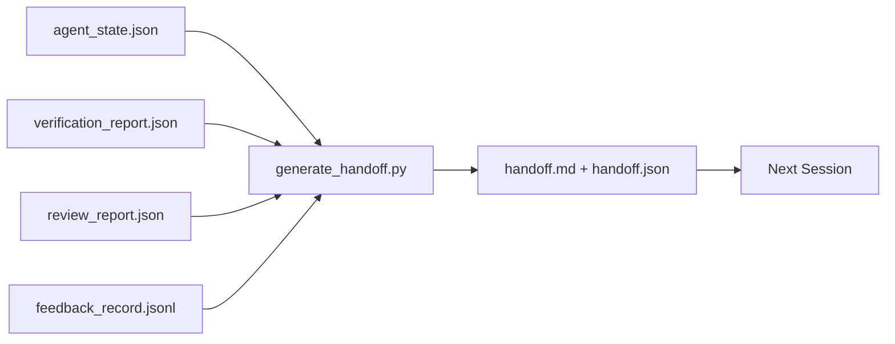

# 多会话交接

> 会话会结束，工作不会。交接包这个产物，决定了“代理忙了一小时”能否真正变成“下一次会话在第一分钟就能继续推进”。它必须被刻意设计，而不是临时补写。

**Type:** 构建
**Languages:** Python（标准库）
**Prerequisites:** 第 14 阶段 · 34（仓库记忆），第 14 阶段 · 38（验证），第 14 阶段 · 39（审查者）
**Time:** 约 50 分钟

## 学习目标

- 识别每个交接包都必须包含的七个字段。
- 不靠手写总结，而是从工作台产物自动生成交接内容。
- 将冗长的反馈日志压缩成适合交接阅读的摘要。
- 让下一次会话的第一步变得明确且可重复。

## 问题

会话结束了。代理说：“很好，我们已经有进展了。” 下一次会话开始。新的代理问：“上次做到哪了？” 上一个代理的回答已经消失。新代理重新搜索、重复执行同样的命令、再次向人类确认同样的问题，花了三十分钟，只为恢复上一轮最后三十秒的上下文。

一次糟糕的交接，代价会在任务的整个生命周期里反复支付。解决办法是在会话结束时自动生成一个交接包：改了什么，为什么改，试过什么，哪里失败了，还剩什么，以及下一次第一步该做什么。

## 概念



### 每个交接都携带的七个字段

| Field | 它回答的问题 |
|-------|---------------------|
| `summary` | 这一轮到底完成了什么，用一段话说清楚 |
| `changed_files` | 改动了哪些文件，一眼能看明白 |
| `commands_run` | 实际执行过哪些命令 |
| `failed_attempts` | 试过什么，为什么没成功 |
| `open_risks` | 下一个会话可能踩到哪些风险，以及严重程度 |
| `next_action` | 下一次会话开场后要做的第一个具体动作 |
| `verdict_pointer` | 指向 verification 和 review 报告的路径 |

这里真正承重的是 `next_action`。如果一个交接除了 `next_action` 什么都有，它就只是状态汇报，不是交接。

### 交接是生成出来的，不是手写出来的

手写交接意味着在忙乱的一天最容易被跳过。正确做法是让生成器读取工作台产物并产出交接包。代理真正要做的，不是额外写一篇总结，而是把工作台维护到一个可被总结的状态。

### 两种形态：给人读，也给机器读

`handoff.md` 给人看。`handoff.json` 给下一个代理加载。二者来自同一组源产物。如果两者不一致，以 JSON 为准。

### 反馈日志裁剪

完整的 `feedback_record.jsonl` 可能有几百条。交接包里只保留最后 K 条，以及所有非零退出码的记录。下一个会话若需要完整上下文，可以再读取全量日志；但交接包本身必须保持小而快读。

### 离开时要留下干净状态

交接描述的是工作内容，干净状态保证的是工作可恢复。这两者不是一回事。如果下一次会话打开时，面对的是半应用的 diff、忘记清掉的临时文件、漂移出去的分支，以及还没运行就报错的测试，那么即便 `handoff.md` 写得再漂亮也毫无意义。下一位代理会先花十分钟替上一位收尾，而不是继续构建，这种成本会在任务生命周期中不断累积。

所以，会话的结束点不是“功能看起来已经好了”，而是“工作台处于一个既能被生成器总结、又能被下一次会话信任的状态”。清理必须被视为单独阶段，并且发生在交接之前。它不是一种“最好养成的习惯”，而是一项必须检查的前置条件，因为习惯恰恰是在忙的时候最容易被省掉的东西。

| Check | 干净状态意味着 | 为什么脏状态会阻塞 |
|-------|-------------|----------------------|
| Working tree | 所有改动都已提交，或带注释地明确 stash | 半应用的 diff 在下一位代理眼里会像是“有意保留的工作” |
| Temp artifacts | 没有残留 `*.tmp`、草稿目录、调试输出或注释掉的大段代码 | 杂散文件会污染 diff，也会污染下一位代理的心智模型 |
| Tests | 测试是绿的；如果是红的，失败原因必须写入 `open_risks` | 沉默的红测是一个陷阱，下一次会话很容易直接踩进去 |
| Feature board | `feature_list.json` 的状态与现实一致（Phase 14 · 36） | 陈旧面板会把下一次会话引到已经完成的工作上 |
| Branch | 位于预期分支，没有 detached HEAD，也没有孤儿分支 | 分支错了，下一次会话的第一个提交就会落到错误位置 |

清理阶段会输出一个记录阻塞项的 `clean_state.json`；只有当其中为空列表时，交接生成器才允许写出交接包。建立在脏工作树上的交接，不是交接，只是把一团混乱往后转发。两种产物是成对出现的：清理证明工作台可以安全离开，交接证明下一次会话知道该从哪里开始。

```figure
wb-handoff-packet
```

## 动手构建

`code/main.py` 实现了：

- 一个加载器，把 state、verdict、review 和 feedback 汇总成一个 `WorkbenchSnapshot`。
- 一个 `generate_handoff(snapshot) -> (markdown, payload)` 函数。
- 一个过滤器，挑出最后 K 条反馈记录以及所有非零退出。
- 一次演示运行，把 `handoff.md` 和 `handoff.json` 写到脚本旁边。

运行它：

```
python3 code/main.py
```

输出：终端打印交接正文，同时在磁盘上生成这两个文件。

## 真实项目中的生产模式

Codex CLI、Claude Code 和 OpenCode 都有各自不同的上下文压缩机制；结构化交接包是压在这三种机制之上的稳定层。

**压缩策略各不相同，但交接包 schema 不应该变。** Codex CLI 的 POST /v1/responses/compact 是服务端的 opaque AES blob，用作 OpenAI 模型的快路径；退路则是本地生成一个 “handoff summary”，以 `_summary` user-role message 追加进对话。Claude Code 会在上下文达到 95% 时运行五阶段渐进式压缩。OpenCode 则基于时间戳隐藏历史消息，再补一个五标题的 LLM 摘要。机制三种，需求一个：把在压缩中幸存下来的关键状态序列化成便携产物。交接包就是这个产物。

**新会话交接不是上下文压缩。** 压缩是在延长一个会话；交接是在干净地结束一个会话，并让下一个会话顺利启动。Hermes Issue #20372（2026 年 4 月）的 framing 是对的：当原地压缩开始明显损伤质量时，代理应该写出一个紧凑交接，结束当前会话，然后在全新上下文里恢复工作。交接包让这次切换变得便宜。错误做法是一直压缩到质量坍塌；正确做法是提前给一次干净交接留预算。

**每个分支、每个主题，只允许一个活跃交接。** 多代理协作里，最常见的问题不是模型输出差，而是交接过期。交接里必须包含 `branch`、`last_known_good_commit`，以及 `status`，其取值为 `active | superseded | archived`。过期交接要归档，只有当前 active 的交接能驱动下一个会话。这就是“交接作为笔记”和“交接作为状态”之间的区别。

**在上下文用到 50-75% 时就收尾，而不是撞墙再收。** 手写交接实践（CLAUDE.md + HANDOVER.md）表明，最佳效果出现在会话在 50-75% 上下文预算时就结束，而不是等到 95%。这样交接生成器运行时，源状态还没有被压缩伪影污染。上下文完整时写交接很便宜；模型已经开始丢位时，写交接会非常昂贵。

## 如何使用

生产中的常见用法：

- **会话结束钩子。** 当用户关闭聊天时，运行时自动触发生成器。交接包写入 `outputs/handoff/<session_id>/`。
- **PR 模板。** 生成器输出的 markdown 可以直接拿来当 PR body，审阅者不必再额外打开五个文件拼上下文。
- **跨代理交接。** 用一个产品（Claude Code）开始工作，再换另一个产品（Codex）继续。交接包就是两者之间的通用语。

交接包体积小、结构稳定，而且生成成本低。这种节省会随着每次会话不断复利。

## 交付成果

`outputs/skill-handoff-generator.md` 会产出一个面向具体项目的交接生成器：它知道项目产物路径、包含一个会话结束钩子，并定义了供下一个代理启动时读取的 `handoff.json` schema。

## 练习

1. 增加一个 `assumptions_to_validate` 字段，收集所有“构建者记录过、但 reviewer 打分没有高于 1”的假设。
2. 让失败运行与成功运行使用不同的反馈摘要裁剪策略。解释这种不对称为什么合理。
3. 增加一个“questions for the human”列表。什么样的问题应该进交接包，什么样的问题只值得发一条聊天消息？
4. 让生成器具备幂等性：连续运行两次，必须生成完全相同的交接包。为此哪些东西必须保持稳定？
5. 增加一个“next session prereqs”小节，精确列出下一次会话在行动前必须加载的产物。

## 关键术语

| 术语 | 常见说法 | 实际含义 |
|------|----------------|------------------------|
| Handoff packet | “会话总结” | 自动生成的交接产物，包含七个字段，同时提供 markdown 和 JSON 版本 |
| Next action | “第一步做什么” | 能启动下一次会话的那个唯一具体动作 |
| Feedback trim | “日志摘要” | 最后 K 条记录，加上所有非零退出记录 |
| Status report | “我们做了什么” | 缺少 `next_action` 的文档；有用，但不算交接 |
| Verdict pointer | “回执” | 指向 verification 和 review 报告的路径，用来保证可追溯性 |

## 延伸阅读

- [Anthropic，长时运行智能体的有效 harness](https://www.anthropic.com/engineering/effective-harnesses-for-long-running-agents)
- [OpenAI Agents SDK handoffs](https://openai.github.io/openai-agents-python/handoffs/)
- [Codex Blog, Codex CLI Context Compaction: Architecture, Configuration, Managing Long Sessions](https://codex.danielvaughan.com/2026/03/31/codex-cli-context-compaction-architecture/) — 介绍 POST /v1/responses/compact 与本地回退机制
- [Justin3go, Shedding Heavy Memories: Context Compaction in Codex, Claude Code, OpenCode](https://justin3go.com/en/posts/2026/04/09-context-compaction-in-codex-claude-code-and-opencode) — 对比三种工具的上下文压缩机制
- [JD Hodges, Claude Handoff Prompt: How to Keep Context Across Sessions (2026)](https://www.jdhodges.com/blog/ai-session-handoffs-keep-context-across-conversations/) — 讨论 CLAUDE.md 与 HANDOVER.md 的 50-75% 上下文预算做法
- [Mervin Praison, Managing Handoffs in Multi-Agent Coding Sessions: Fresh Context Without Losing Continuity](https://mer.vin/2026/04/managing-handoffs-in-multi-agent-coding-sessions-fresh-context-without-losing-continuity/) — 用分布式系统视角解释交接
- [Hermes Issue #20372 —— 当压缩开始变得有风险时自动切换到新会话交接](https://github.com/NousResearch/hermes-agent/issues/20372)
- [Hermes Issue #499 — Context Compaction Quality Overhaul](https://github.com/NousResearch/hermes-agent/issues/499) — Codex CLI 中面向交接的提示设计
- [Microsoft Agent Framework，压缩](https://learn.microsoft.com/en-us/agent-framework/agents/conversations/compaction)
- [OpenCode，上下文管理与压缩](https://deepwiki.com/sst/opencode/2.4-context-management-and-compaction)
- [LangChain，面向智能体的上下文工程](https://www.langchain.com/blog/context-engineering-for-agents)
- 阶段 14 · 34——生成器读取的状态文件
- 阶段 14 · 38——交接包所指向的验证结论
- 阶段 14 · 39——打包进交接包的审查报告
