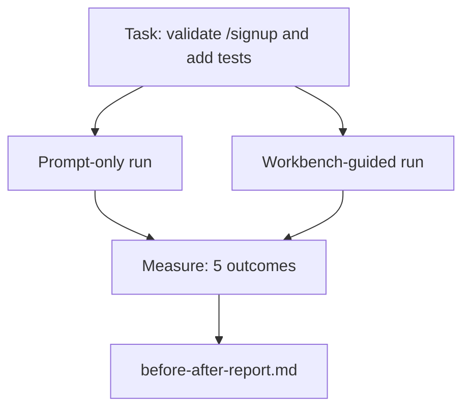

# 真实仓库上的工作台

> 前面十一课讲了很多工作台表面，但如果这些东西一碰真实代码库就失效，那它们就没有价值。本课在一个小型示例应用上，把同一个任务跑两遍：一次只靠 prompt，一次按工作台流程执行。让数据自己说话。

**Type:** 构建
**Languages:** Python（标准库）
**Prerequisites:** 第 14 阶段 · 32 到 14 · 40
**Time:** 约 60 分钟

## 学习目标

- 在一个小型应用上，把七个工作台表面真正串起来。
- 将同一任务分别以 prompt-only 和 workbench-guided 两种方式执行，并比较五项结果。
- 读懂前后对照报告，判断究竟是哪几个表面带来了最大杠杆。
- 在面对“我的模型已经够强了”这种质疑时，为工作台给出有证据的回应。

## 问题

在玩具任务上的演示说服不了任何人。工作台真正成立的时刻，是它在一个足够像真实项目的仓库上完成了足够像真实工作的任务，并且最终表现出更少失败、更少回滚，以及一个能让下一次会话直接接手的交接包。

这节课就提供这样一个“足够真实”的样本仓库，并让同一个任务走过两条不同流水线。产物是一份可以直接拿给怀疑者看的前后对照报告。

## 概念



### 示例应用

`sample_app/` 下放着一个最小但足够真实的 FastAPI 风格处理器：

- `app.py` 里有 `/signup`，但还没有输入校验。
- `test_app.py` 里只有一个 happy-path 测试。
- `README.md` 和 `scripts/release.sh` 被故意放进仓库里，作为“禁止修改区域”的诱饵。

### 任务

> 为 `/signup` 添加输入校验：拒绝长度小于 8 个字符的密码，并返回 422 与带类型信息的错误 envelope。再补一条测试，证明这个新行为存在。

### 两条流水线

Prompt-only：

1. 读 README。
2. 读 `app.py`。
3. 修改文件。
4. 声称完成。

Workbench-guided：

1. 运行初始化脚本（Lesson 35）。
2. 读取 scope contract（Lesson 36）。
3. 读取 state（Lesson 34）。
4. 只修改允许修改的文件。
5. 通过 feedback runner 执行 acceptance command（Lesson 37）。
6. 运行 verification gate（Lesson 38）。
7. 运行 reviewer（Lesson 39）。
8. 生成 handoff（Lesson 40）。

### 衡量的五项结果

| Outcome | 为什么重要 |
|---------|----------------|
| `tests_actually_run` | 很多“测试已通过”的说法其实无法核实 |
| `acceptance_met` | 证明目标达成的那条测试，必须真的是被执行过的测试 |
| `files_outside_scope` | scope creep 是最常见、也最安静的失败方式 |
| `handoff_quality` | 下一次会话会为它付出代价，或从中获益 |
| `reviewer_total` | 在硬性 gate 之上的补充性质量判断 |

```figure
wb-ab-runs
```

## 动手构建

`code/main.py` 会在同一份示例应用夹具上编排这两条流水线。两条流水线都被脚本化了，循环里没有 LLM，因此测量结果是可重复的。脚本会把比较结果写入 `before-after-report.md` 和 `comparison.json`。

运行它：

```
python3 code/main.py
```

输出：终端里会打印每条流水线的结果表；脚本旁边会生成 markdown 报告；同时还会生成一份供进一步制图或分析使用的 JSON。

## 真实项目中的生产模式

怀疑者真正想问的是：“工作台到底能帮多少？” 2026 年的数据给出的回答，远比解释本身有说服力。

**Terminal Bench 上，同一个模型从 Top-30 外跳到 Top-5。** LangChain 在 2026 年 4 月发布的 *The Anatomy of an Agent Harness* 中展示过：一个编码代理仅仅更换 harness，就从 Terminal Bench 2.0 的前 30 名之外跃升到第 5 名。模型没换，变的是外围表面，结果差了 25 个名次。

**Vercel 靠“删掉工具”把成功率从 80% 拉到 100%。** 他们报告说，移除 80% 的 agent tools 之后，成功率反而从 80% 提高到 100%。工具表面越少，scope 越清晰，可失败的路径就越少。很多时候，减少表面比增加能力更有效。

**Harvey 只靠 harness 优化就把准确率翻倍。** 法律代理的准确率提升超过一倍，而模型本身并没有变化。变化的完全是工作流与运行时设计。

**88% 的企业级 AI agent 项目没法落到生产。** preprints.org 在 2026 年 3 月的 *Harness Engineering for Language Agents* 指出，这些失败的根因往往不在“模型不会推理”，而在运行时：状态陈旧、重试脆弱、上下文失控、中间错误无法恢复。

**长上下文会明显坍塌。** WebAgent 的基线在常规条件下有 40-50% 成功率，但在长上下文场景里会跌到 10% 以下，主要原因就是无限循环和目标丢失。Ralph Loop 和 handoff packet 正是为吸收这类失败而设计的。

**当然也存在“假阴性”场景。** 单步事实任务、单行 lint、formatter、以及模型已经几乎逐字记住的内容，prompt-only 的确可能更快。基准必须诚实列出这些场景，否则工作台就会被误解成一种机械性的过度设计。

结论不是“harness 永远赢”。随着时间推移，模型确实会逐步吸收一部分 harness 技巧。真正的结论是：在今天，工程负担仍然主要落在这七个表面上，而数据证明了这一点。

## 如何使用

这节课是一份你可以反复引用的案例文件，尤其适用于这些场景：

- 有人质疑，为什么每个 PR 都要带上一个 `agent-rules.md` 和 scope contract。
- 某个团队想说“这个冲刺先把 verification gate 去掉吧”。
- 你在评估一个新 agent 产品，想要一个可迁移、可复现实验，用来判断它到底有没有节省时间。

数字比解释传播得更远。

## 交付成果

`outputs/skill-workbench-benchmark.md` 是一个可移植评测 harness。它可以在任意项目的示例应用上，把任意 agent 产品同时跑过两条流水线，并输出这五项对照结果。

## 练习

1. 增加第六项指标：time-to-first-meaningful-edit。怎样定义与测量它才足够干净？
2. 在你自己的代码库里找一个“第二天真实会遇到”的任务来跑这个对照实验。工作台的优势在哪些地方开始变弱？
3. 增加一个“false negative”通道：列出那些 prompt-only 的确更快、工作台确实引入了额外成本的任务。然后论证为什么即便如此，工作台仍然值得保留。
4. 把脚本里的“代理”替换成真实的 LLM 调用。哪几项结果会开始变得更嘈杂？
5. 写一页面向非工程师的摘要。哪些内容应该保留，哪些内容必须删掉？

## 关键术语

| 术语 | 常见说法 | 实际含义 |
|------|----------------|------------------------|
| 样本应用（Sample app） | “玩具仓库” | 体量很小，但足够真实，能把七个界面都跑一遍的样本应用 |
| 流水线（Pipeline） | “工作流” | 智能体在任务中依次执行的界面读写流程 |
| 前后对照报告（Before/after report） | “收据” | 真正交给质疑者查看的对照产物 |
| 假阴性（False negative） | “工作台过度设计” | 提示词直出反而更快的任务；如实列出这类任务更有说服力 |
| 工作台基准（Workbench benchmark） | “可靠性评分” | 可移植的测试工具，用来在你的代码库中运行同样的对照实验 |

## 延伸阅读

- [LangChain, The Anatomy of an Agent Harness](https://blog.langchain.com/the-anatomy-of-an-agent-harness/) — Terminal Bench 从 30 名开外升至前 5 的实测记录
- [MongoDB, The Agent Harness: Why the LLM Is the Smallest Part of Your Agent System](https://www.mongodb.com/company/blog/technical/agent-harness-why-llm-is-smallest-part-of-your-agent-system) — Vercel + Harvey numbers
- [preprints.org, Harness Engineering for Language Agents](https://www.preprints.org/manuscript/202603.1756) — 88% 的企业失败率及其运行时根因
- [HN: Improving 15 LLMs at Coding in One Afternoon. Only the Harness Changed](https://news.ycombinator.com/item?id=46988596) — 在 15 个模型上的复现实验
- [Cloudflare, Orchestrating AI Code Review at Scale](https://blog.cloudflare.com/ai-code-review/) — 生产环境 30 天完成 13.1 万次审查运行
- [Anthropic，构建高效智能体](https://www.anthropic.com/research/building-effective-agents)
- 阶段 14 · 32 至 14 · 40——本课端到端练习的各个工作面
- 阶段 14 · 19——本课所补充的宏观基准：SWE-bench、GAIA、AgentBench
- 阶段 14 · 30——同一套工作台可接入的评估驱动代理开发
