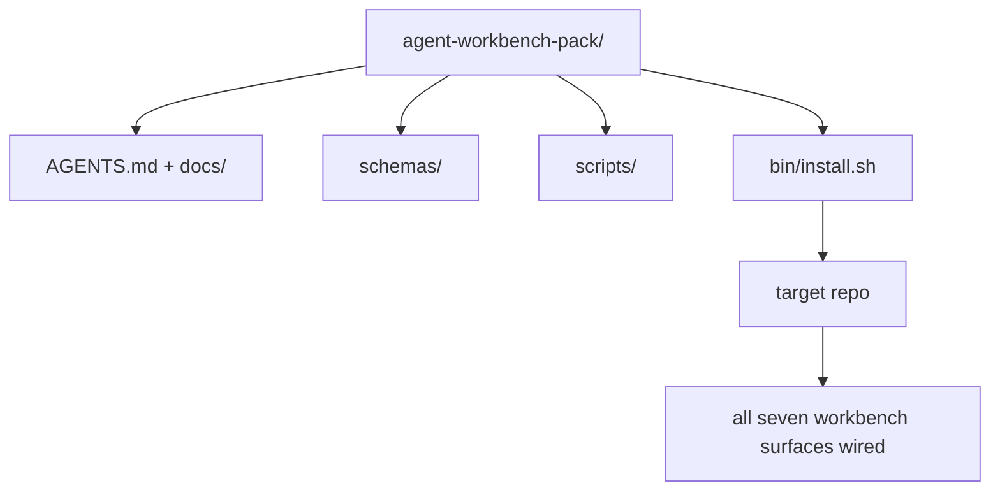

# Capstone：交付一个可复用的代理工作台包

> 这个小专题最终要产出的，是一个可以直接放进任何仓库里的包。十一课的工作台表面，被压缩成一个目录，`cp -r` 进去，第二天早上代理就能在新仓库里稳定开工。这个 capstone 才是整条课程真正交换价值的产物。

**Type:** 构建
**Languages:** Python（标准库）
**Prerequisites:** 第 14 阶段 · 31 到 14 · 41
**Time:** 约 75 分钟

## 学习目标

- 把七个工作台表面打包成一个可直接落地的目录。
- 固定其中的 schema、脚本和模板，让新仓库拿到的是一份已知可用的基线。
- 增加一个单命令安装脚本，并保证重复执行仍然安全。
- 明确哪些东西必须放进包里、哪些东西必须留在包外，并能逐项说明理由。

## 问题

如果一个工作台散落在 Google Doc、聊天记录和三份半记得住的脚本里，那么它就注定每个季度都要被重建一次。真正的解决办法是做成一个带版本的包：可以是一个仓库，也可以是一个目录，但里面必须包含这些表面、对应 schema、执行脚本，以及一个一键安装器。

做完这节课，你应该已经把 `outputs/agent-workbench-pack/` 真正落到磁盘上，并且拥有一个 `bin/install.sh`，可以把它安装到任意目标仓库。

## 概念



### 包的目录布局

```
outputs/agent-workbench-pack/
├── AGENTS.md
├── docs/
│   ├── agent-rules.md
│   ├── reliability-policy.md
│   ├── handoff-protocol.md
│   └── reviewer-rubric.md
├── schemas/
│   ├── agent_state.schema.json
│   ├── task_board.schema.json
│   └── scope_contract.schema.json
├── scripts/
│   ├── init_agent.py
│   ├── run_with_feedback.py
│   ├── verify_agent.py
│   └── generate_handoff.py
├── bin/
│   └── install.sh
└── README.md
```

### 哪些放进去，哪些不放进去

放进去：

- 各个表面的 schema。它们定义了契约。
- 上面那四个脚本。它们构成运行时。
- 那四份文档。它们规定规则与 rubric。

不放进去：

- 项目特定任务。任务属于目标仓库自己的 board，不属于包本身。
- 供应商 SDK 调用。这个包应该保持框架无关。
- 团队 onboarding 说明。包应该贴着团队现有 onboarding 存在，而不是取代它。

### 安装器

一个简短的 `bin/install.sh`（或者 `bin/install.py`）应当做到：

1. 如果目标位置已经存在同名包，且没有传 `--force`，就拒绝覆盖安装。
2. 把包复制到目标仓库。
3. 如果目标仓库存在 `.github/workflows/`，则顺手把 CI 线接起来。
4. 打印下一步动作：填 board、设置 acceptance commands、运行 init script。

### 版本化

包里必须带一个 `VERSION` 文件。schema 变更或需要迁移的脚本变更，提升 major；不要求迁移的脚本升级，提升 minor；纯文档变更，提升 patch。目标仓库的 `agent_state.json` 则记录自己最初是按哪个 pack version 初始化出来的。

```figure
wb-pack-install
```

## 动手构建

`code/main.py` 会在课程目录旁边组装出 `outputs/agent-workbench-pack/`。它会把本小专题前面课程里已经做好的 schema、脚本和文档种进去，形成完整工作台包。

运行它：

```
python3 code/main.py
```

脚本会复制并固定这些表面，生成 README，打印包结构，然后以零退出。重复运行必须保持幂等。

## 真实项目中的生产模式

一个包只有在能跨 fork、跨升级、跨不友好上游环境继续存活时，才真正有价值。四个模式决定了它能不能长期工作。

**`VERSION` 是契约，不是营销文案。** major 版本升级意味着状态迁移；minor 升级意味着要重新跑 checker；patch 升级则只是文档变化。安装器每次安装都向目标仓库写入 `.workbench-version`；如果 `lint_pack.py` 发现目标仓库锁定的版本与包当前 `VERSION` 不一致，就应该拒绝继续发布。这和 `npm`、`Cargo`、`pyproject.toml` 应对十年演化的方法没有本质区别。代理系统并不会改写这些规则。

**跨工具分发必须坚持单一真相源。** Nx 提供一个 `nx ai-setup`，从同一份配置生成 `AGENTS.md`、`CLAUDE.md`、`.cursor/rules/`、`.github/copilot-instructions.md`，甚至 MCP server。这个包也应该这样做：安装器负责发出这些符号链接，比如 `ln -s AGENTS.md CLAUDE.md`，让每个编码代理都读取同一份源文件。为了适配某个单独工具而把包 fork 成不同版本，是一种失败模式。

**`uninstall.sh` 必须对“非平凡状态”说不。** 卸载包时，不应该删除用户自己的 `agent_state.json`、`task_board.json` 或 `outputs/`。卸载器移除的是 schema、脚本、文档和 `AGENTS.md`（除非传 `--keep-agents-md`），并且如果状态文件有任何未提交的实质性变更，就应拒绝继续。状态归用户所有，包不能假装自己有权清空它们。

**把包当成一个可发布 skill。采用 SkillKit 风格分发。** 这个包可以作为一个 SkillKit skill 发布：`skillkit install agent-workbench-pack` 就能把它铺到 32 种 AI agent 上。包仓库是唯一真相源，SkillKit 只是分发通道。这样供应商锁定会显著减弱，而七个表面保持不变。

## 如何使用

这个包通常有三种落地方式：

- **作为一个目录直接丢进仓库。** `cp -r outputs/agent-workbench-pack /path/to/repo`
- **作为一个公开模板仓库。** 团队 fork 后再定制，用 `VERSION` 管控漂移。
- **作为一个 SkillKit skill。** 接到你的 agent 产品上，用一条命令就完成铺设。

包是配方；每次安装，都是一次具体出餐。

## 交付成果

`outputs/skill-workbench-pack.md` 可以生成一个更贴合具体项目的 pack：规则会按团队历史收紧，scope glob 会按仓库结构调优，rubric 维度也会多出一条领域相关的检查项。

## 练习

1. 选出一个“可选的第五份文档”，决定它是否值得晋升为规范包的一部分，并解释原因。
2. 用 Python 重写安装器，支持 `--dry-run`。比较它与 bash 版本在易用性上的差异。
3. 增加一个 `bin/uninstall.sh`，安全移除工作台包；如果状态文件存在非平凡历史，则拒绝执行。什么才算“非平凡”？要写清楚。
4. 增加一个 `lint_pack.py`，当包内容与 `VERSION` 所描述的状态不一致时直接失败，并把它接进包仓库自己的 CI。
5. 写一份从“手工拼装工作台”迁移到这个包的 runbook。怎样安排迁移顺序，才能把停机和混乱降到最低？

## 关键术语

| 术语 | 常见说法 | 实际含义 |
|------|----------------|------------------------|
| Workbench pack | “启动套件” | 一个带版本的目录，携带全部七个工作台表面 |
| Installer | “安装脚本” | `bin/install.sh`，负责幂等地把这个包铺到目标仓库 |
| Pack version | “VERSION” | schema 或脚本变更走 major，纯文档变更走 patch |
| Drop-in pack | “拷进去就能用” | 第一天就能工作，不要求每个仓库先做大量定制 |
| Forkable template | “GitHub 模板” | 一个可以通过 GitHub “Use this template” 直接复制出去的公共模板仓库 |

## 延伸阅读

- 阶段 14 · 31 至 14 · 41——这个工具包打包的全部工作面
- [SkillKit](https://github.com/rohitg00/skillkit)——在 32 种 AI 代理中安装此技能
- [Nx Blog, Teach Your AI Agent How to Work in a Monorepo](https://nx.dev/blog/nx-ai-agent-skills)——跨六种工具的单一来源生成器
- [agents.md — the open spec](https://agents.md/)——工具包路由器必须实现的规范
- [HKUDS/OpenHarness](https://github.com/HKUDS/OpenHarness)——与该工具包等价的参考实现
- [andrewgarst/agentic_harness](https://github.com/andrewgarst/agentic_harness)——由 Redis 支持、附带评估套件的参考实现
- [Augment Code, A good AGENTS.md is a model upgrade](https://www.augmentcode.com/blog/how-to-write-good-agents-dot-md-files)——工具包文档的质量基准
- [Anthropic, Effective harnesses for long-running agents](https://www.anthropic.com/engineering/effective-harnesses-for-long-running-agents)
- [Anthropic, Harness design for long-running application development](https://www.anthropic.com/engineering/harness-design-long-running-apps)
- 阶段 14 · 30——使用该工具包验证闸门的评估驱动代理开发
- 阶段 14 · 41——该工具包所改进的前后对比基准
