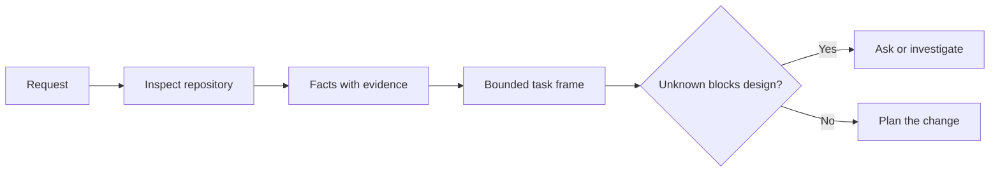

# 先界定任务，再让代理编写代码

> 编码代理可以迅速实现一个明确的任务，也可以迅速实现一个模糊的任务。速度相同，代价却不同。

**Type:** 学习 + 构建
**Languages:** Python（标准库）
**Prerequisites:** 第 14 阶段第 31、36 课
**Time:** 约 60 分钟

## 学习目标

- 在开始编辑前，将请求转化为边界清晰的任务框架。
- 区分仓库事实、假设和待解决问题。
- 定义允许路径、禁止路径和验收证据。
- 判断前期探查何时已经充分，可以开始工作。

## 代价高昂的失败

“增加重复邮箱保护”听起来很具体，其实不然。唯一性应该由 API、领域服务还是数据库保证？比较是否区分大小写？哪一种错误结构已经成为公开契约？是否允许执行迁移？哪项测试能够证明这一行为？

能力强的代理会用看似合理的选择填补这些空白。危险恰恰在这里：实现可能整洁、测试也可能通过，却仍然与系统不兼容。

因此，编码代理工作的第一个单元不是一次编辑，而是一个有仓库证据支撑的任务框架。

## 任务框架

一个实用的框架包含六个字段：

| 字段 | 问题 |
|---|---|
| 目标 | 必须改变哪项可观察行为？ |
| 仓库事实 | 你在代码、测试、配置或历史记录中验证了什么？ |
| 允许路径 | 改动可以落在哪里？ |
| 禁止路径 | 哪些地方必须保持不变？ |
| 验收证据 | 哪些命令或观察结果能够证明目标已经达成？ |
| 未知项 | 哪些决定仍然需要证据或人工判断？ |

事实必须有凭据。“API 对重复项使用 409”还不能算事实，除非你能指向现有测试或处理器。文件路径和行号已经足够；当行为本身很重要时，命令结果则更有说服力。



## 前期探查是在寻找约束

不要通读整个仓库，而应搜索那些会约束改动的表面：

1. 当前行为及其调用方。
2. 最接近的现有测试。
3. 公开契约或序列化后的数据结构。
4. 管理目标路径的项目指令。
5. 构建和验证命令。
6. 能揭示本地惯例的类似已完成改动。

当每个计划中的决定都有证据支撑、已被明确授权给代理决定，或被列为未知项时，就应停止探查。超过这个节点继续阅读，往往只是在逃避行动。

## 未知项不是失败

未知项是受控的缺口；假设则是对这个缺口不受控的回答。

对每个未知项进行分类：

- **可查明：** 仓库或运行中的系统能够给出答案。
- **可决策：** 任务契约授权代理自行选择。
- **需人工决定：** 这个选择会改变产品行为、成本、风险或公开兼容性。
- **可推迟：** 这个选择不属于当前切片，应放入非目标。

代理应继续处理可查明以及获授权自行决策的未知项。遇到需人工决定的未知项时，则应在该选择被埋进代码之前暂停。

## 先定义验收，再开始实现

先写下如何证明，再编写补丁。证明可以是：

- 一条聚焦的单元测试或集成测试命令；
- 一段指定视口和预期状态的浏览器操作流程；
- 一次网络请求及其精确的响应契约；
- 一项带阈值的性能测量；
- 一项确认没有无关文件发生变化的范围检查。

“测试通过”不是证明计划。你需要明确指出权威测试，以及它所支持的论断。

## 动手构建

本实验会创建一个 `TaskFrame`，验证其边界和证据，并写出 `outputs/task-frame.md`。

在本课目录中运行：

```bash
python3 code/main.py
python3 -m unittest discover code/tests -v
```

用四种方式破坏示例：删除目标、删除事实凭据、让允许路径和禁止路径重叠，以及删除验收命令。验证器应该因为四个不同的原因拒绝这些框架。

## 在真实仓库中使用

在要求代理编辑之前：

1. 将目标写成一种行为，而不是一项文件改动。
2. 用精确证据记录两到三个事实。
3. 指明尽可能小的允许路径集合。
4. 明确写出不可触碰的范围。
5. 写下能够结束任务的命令或观察结果。
6. 列出那些你尚未获得足够依据来决定的事项。

任务框架应该能放进一个屏幕。如果放不下，这个任务可能包含多个可以独立验证的改动。

## 练习

1. 为你某个仓库中的真实 bug 编写任务框架，但不要提出解决方案。
2. 找出框架中一项实际上只是“假设”的论断，用证据替换它。
3. 添加一个需人工决定的未知项，其答案会改变公开契约。
4. 将一个宽泛的允许路径拆成最小的安全集合。
5. 在验收证据中加入一项范围凭据。

## 延伸阅读

- [Nuseibeh 与 Easterbrook，《Requirements Engineering: A Roadmap》](https://www.cs.toronto.edu/~sme/papers/2000/ICSE2000.pdf)：介绍如何让实现锚定于现实目标和持续演化的约束。
- [Yang 等，《SWE-agent: Agent-Computer Interfaces Enable Automated Software Engineering》](https://arxiv.org/abs/2405.15793)：论证编码代理周围的交互界面会改变其效能。

## 你将带走什么

保留 `outputs/task-frame.md`。它是下一课的输入；届时，这个框架将转化为一份有证据支撑的执行计划。
