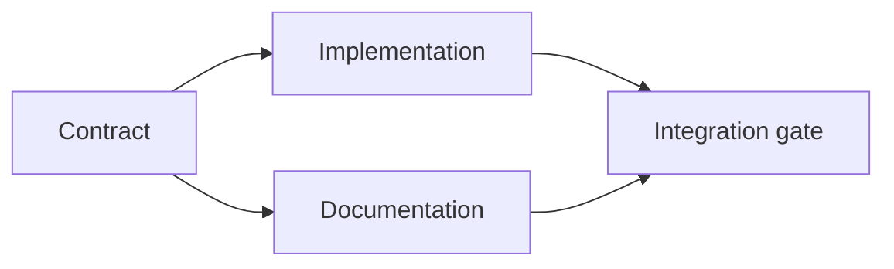

# 构建有证据支撑的执行计划

> 计划不是一份更好看的待办清单，而是一张依赖图：每项改动都有理由，每个终止节点都有证明。

**Type:** 学习 + 构建
**Languages:** Python（标准库）
**Prerequisites:** 第 14 阶段第 43 课
**Time:** 约 65 分钟

## 学习目标

- 将任务框架转化为带有证据和完成证明的工作项。
- 用依赖关系表达执行顺序，而不是靠文字叙述顺序。
- 在开始编辑前发现缺失事实、未知依赖和循环依赖。
- 区分可以并行执行的步骤和必须等待的步骤。

## 代理的计划为何失败

薄弱的计划只是用将来时复述请求：

1. 更新 API。
2. 添加测试。
3. 更新文档。

这份清单没有说明发现了什么、为什么选中这些文件、哪项契约应先变化，也没有指出哪些工作可以并行。代理即使逐项照做，仍然可能造成返工。

一份扎实的计划会为每个工作项做出五项承诺：

| 承诺 | 目的 |
|---|---|
| 标识符 | 为依赖关系和交接提供稳定引用 |
| 改动 | 最小的行为或契约变更 |
| 证据 | 证明这项改动合理的仓库事实 |
| 依赖 | 开始前必须已经成立的工作 |
| 完成证明 | 能够结束该工作项的精确检查 |

## 先规划契约，再规划其实现

当多个表面依赖同一种行为时，应先定义行为。契约确定后，测试、实现、文档和集成便可以共用同一份契约，而不是各自发明一个版本。



这张图揭示了安全的并发关系：契约确定后，实现和文档可以同时进行；集成则需要等待两者都完成。

## 证据会改变计划

仓库证据不是装饰，它应该有能力改变工作安排：

- 现有辅助函数让原计划中的新抽象变得多余。
- 一项兼容性测试迫使计划加入迁移步骤。
- 一项部署约束要求把 schema 变更移到另一个任务。
- 一种公开响应类型改变了实现与文档的先后顺序。

如果一项证据不可能改变计划，它很可能并不是支撑该决策的证据。

## 为中断而设计

编码代理的会话可能意外结束。可恢复的计划应把工作项划分得足够小，让另一个会话能够判断：

- 哪个工作项已经完成；
- 哪项证明已经运行；
- 哪些产物发生了变化；
- 哪些依赖现已解除阻塞；
- 下一个安全的工作项是什么。

不要只用聊天里的勾选框记录状态。把计划存放在工作旁边。

## 计划验证

如果出现以下情况，应在执行前拒绝计划：

- 标识符重复；
- 工作项没有证据；
- 工作项没有完成证明；
- 某项依赖指向不存在的工作项；
- 依赖图中存在环；
- 在相关不确定性解决之前，就安排了第一个不可逆操作。

前五项可以机械检查。最后一项需要判断，应当显式标注出来。

## 动手构建

`code/main.py` 会对工作项建模、验证其凭据、通过拓扑排序计算执行批次，并写出 `outputs/evidence-plan.json`。

运行：

```bash
python3 code/main.py
python3 -m unittest discover code/tests -v
```

示例会产生三个执行批次。首先定义契约；随后实现与文档同时进行；最后运行集成闸门。

## 与编码代理配合使用

要求代理先给出计划，再修改文件。审查计划时重点关注三件事：

1. 每项路径和行为声明都有仓库凭据。
2. 每个工作项都有一项清晰的完成证明。
3. 依赖图会推迟昂贵或不可逆的工作，直到它所依赖的不确定性已经解决。

批准的是计划，而不是一句含糊的“小心处理”承诺。

## 练习

1. 添加一项需要人工明确批准的迁移工作。
2. 构造一个循环依赖，并解释其背后隐藏的产品分歧。
3. 拆分一个包含两条证明命令的工作项。
4. 添加一项可在第二批执行、且不触碰现有任一分支的工作。
5. 将计划渲染为 Markdown，同时继续以 JSON 作为事实来源。

## 延伸阅读

- [Nuseibeh 与 Easterbrook，《Requirements Engineering: A Roadmap》](https://www.cs.toronto.edu/~sme/papers/2000/ICSE2000.pdf)：介绍目标、规格、共识与演化之间的迭代关系。
- [Barry Boehm，《A Spiral Model of Software Development and Enhancement》](https://dl.acm.org/doi/10.1145/12944.12948)：介绍如何围绕风险消解安排开发工作，而不是遵循固定的线性顺序。

## 你将带走什么

保留 `outputs/evidence-plan.json`。它会成为下一课的委派契约。
