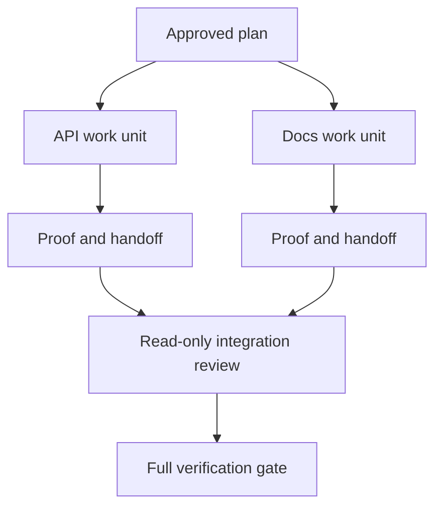

# 用隔离和合并契约委派代理工作

> 只有当工作彼此独立时，并行代理才能节省墙钟时间。否则，它们只会把一个清晰的任务变成协调难题，并让失败来得更快。

**Type:** 学习 + 构建
**Languages:** Python（标准库）
**Prerequisites:** 第 14 阶段第 39、44 课
**Time:** 约 70 分钟

## 学习目标

- 根据真正的独立性判断是否值得委派。
- 为每个工作者分配独占的文件所有权和明确的完成证明。
- 根据依赖关系计算执行批次。
- 设计一份能安全合并代理工作的合并契约。

## 并行性检验

不要只因为有更多代理可用就委派工作。至少满足以下一项时才应委派：

- 两项调查可以独立回答不同的未知问题；
- 两项实现分别拥有互不重叠的文件和契约；
- 审查者可以在不修改产物的前提下检查已完成的成果；
- 本地工作继续进行的同时，可以运行一项缓慢的外部检查。

如果多个代理需要使用相同文件、依赖同一个尚未解决的决定，或共享同一个可变环境，就应让工作串行执行。

## 工作单元就是契约

每个委派单元都需要包含：

| 字段 | 含义 |
|---|---|
| 目标 | 一项可观察的结果 |
| 所有者 | 一名对结果负责的工作者 |
| 路径 | 独占的写入所有权 |
| 依赖 | 开始前必须完成的工作单元 |
| 完成证明 | 返回给集成者的精确证据 |
| 交接 | 改动的文件、做出的决定和剩余风险 |

“处理后端”不是一个工作单元。“在 `app/accounts.py` 中实现重复检查，并用聚焦的账户测试加以证明”才是。

## 隔离分为三层

1. **文件系统隔离：** 独立的 worktree 或沙箱可以防止意外共享编辑。
2. **所有权隔离：** 契约可以防止两个工作者有意修改同一路径。
3. **状态隔离：** 独立的日志和输出可以防止一个工作者覆盖另一个工作者的证据。

文件系统隔离无法代替所有权隔离。两个干净的 worktree 仍然可能产出彼此冲突的设计。合并契约必须在工作开始前解决共享接口问题。



## 集成者不应重做工作

集成者应该：

1. 确认每份交接与其获派范围一致；
2. 阅读证明输出，而不只看工作者的总结；
3. 按依赖顺序组合改动；
4. 运行完整的跨单元闸门；
5. 拒绝隐蔽的范围扩张；
6. 将冲突记录为新的决策，而不是悄悄修改。

如果集成时必须重写工作者的大部分成果，说明最初的任务分解就有问题。

## 人类与代理的角色

委派不会取代人类判断。会改变公开行为、风险、权限或不可逆成本的选择，仍然由人类负责。代理可以负责边界明确的调查、实现、验证和审查。

这就是校准后的自主性：在证据充分且易于回滚的地方赋予系统自由，在后果严重的地方设置检查点。

## 动手构建

本实验会检查路径重叠、验证依赖、计算安全的执行批次，并写出 `outputs/delegation-plan.json`。

运行：

```bash
python3 code/main.py
python3 -m unittest discover code/tests -v
```

把文档单元改为拥有 `app/`。由于这个父路径与 API 单元重叠，计划应该阻止执行。

## 练习

1. 将一项真实改动拆成两个独立工作单元和一个集成者。
2. 找出一种看似独立、实则不然的并行拆分，并指出它们共享的决策。
3. 添加一个只读研究工作者，其输出是一张事实表。
4. 添加一道合并闸门，将最终的文件改动集合与所有工作单元契约进行核对。
5. 为依赖失效的工作者定义一条取消规则。

## 延伸阅读

- [Reid Smith，《The Contract Net Protocol》](https://doi.org/10.1109/TC.1980.1675516)：介绍分布式任务分配与结果报告的早期形式化方法。
- [Eric Horvitz，《Principles of Mixed-Initiative User Interfaces》](https://dl.acm.org/doi/10.1145/302979.303030)：介绍如何决定自动化何时应当采取行动、何时应把控制权交还给人。

## 你将带走什么

保留 `outputs/delegation-plan.json`。它记录了为什么这种拆分是安全的、每条路径由谁拥有，以及集成必须收到哪些证明。
