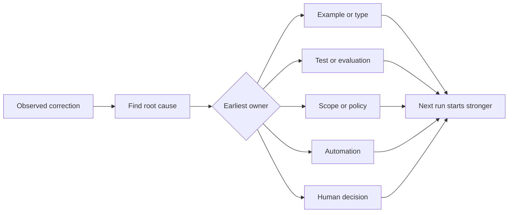

# 把每次代理纠正都转化为系统改进

> 只存在于聊天中的纠正只能修复一次运行。将纠正固化为测试、边界、示例或工具，才能让此后的每次运行都得到改善。

**Type:** 学习 + 构建
**Languages:** Python（标准库）
**Prerequisites:** 第 14 阶段第 37 至 41 课
**Time:** 约 65 分钟

## 学习目标

- 将对代理的纠正转化为持久控制措施。
- 把每项控制措施放到能够防止问题复发的最前层。
- 用稳定指纹合并重复的经验。
- 淘汰那些已经不再防范真实风险的控制措施。

## 纠正就是证据

当你告诉代理“不要编辑那个文件”时，你已经发现范围边界无法被执行。当你说“这个输出结构不对”时，你已经发现缺少示例或测试。当环境配置再次失败时，你已经发现环境知识应该进入自动化。

应把纠正视为对工作系统的一次观察，而不是提示词编写失败。

## 提升到最早生效的一层

按以下顺序选择控制措施：

| 反复出现的失败 | 持久化落点 |
|---|---|
| 错误结果或回归 | 测试或评估 |
| 越界或不安全的操作 | 范围或权限策略 |
| 反复出现的环境配置或命令错误 | 自动化或工具 |
| 反复出现的输出格式错误 | 规范示例加验证器 |
| 含糊的本地约定 | 带场景检查的指令 |
| 产品分歧 | 人工决策记录 |

越靠前的控制措施成本越低。用类型让无效状态无法表示，比事后捕获问题的审查评论更强；聚焦测试也比一段要求代理记住规则的文字更强。



## 棘轮记录

记录以下内容：

- 表现出的症状；
- 根本原因；
- 后果；
- 复发次数；
- 选定的控制措施；
- 控制措施的验证方法；
- 所有者；
- 复审或淘汰日期。

不要把每项一次性偏好都永久固化。只有当复发频率或后果足以证明长期复杂性值得引入时，才提升这项纠正。

## 区分根因与症状

“代理编辑了 README”是一种症状。可能的原因包括：

- 任务允许修改仓库根目录；
- 文档被默认视为可以安全修改；
- 计划把实现和文档捆绑在一起；
- 两名工作者的所有权范围发生了重叠。

每一种原因都对应不同的控制措施。仅仅复述症状的规则，遇到下一种略有不同的情况就会失效。

## 控制措施也会失效

旧的控制措施可能互相冲突、挤占上下文，还可能固化一个已不存在的系统。每条提升后的规则都需要淘汰检查。出现以下情况时，应删除或重写它：

- 底层架构已经变化；
- 更强的可执行控制已经取代它；
- 在一个有意义的观察周期内，故障没有再次出现；
- 控制措施带来的阻力大于它所防范的风险。

目标不是写出最长的指令文件，而是构建一个能够保留来之不易判断的最小系统。

## 动手构建

本实验会对纠正进行分类，将其提升为控制措施，使用指纹合并重复项，并写出 `outputs/feedback-ratchet.json`。

运行：

```bash
python3 code/main.py
python3 -m unittest discover code/tests -v
```

添加两条措辞不同但根因相同的纠正。改进规范化方法，直到它们能合并为同一项控制措施，同时又不会误合并无关的失败。

## 练习

1. 从最近一次编码会话中选取五条纠正，并按其真正的负责层分类。
2. 用一项可执行测试替换一条文字规则。
3. 加入后果权重，让后果严重的问题在首次发生时就能立即提升为持久控制。
4. 为实验输出添加所有者和淘汰日期。
5. 审查一条现有的代理指令；只有在证明已有更强控制之后，才能删除它。

## 延伸阅读

- [Basili、Caldiera 与 Rombach，《The Goal Question Metric Approach》](https://www.cs.toronto.edu/~sme/CSC444F/handouts/GQM-paper.pdf)：介绍如何将目标转化为问题和可操作的度量。
- [Shinn 等，《Reflexion》](https://arxiv.org/abs/2303.11366)：介绍如何在不改变模型权重的情况下，利用反馈轨迹改善后续决策。
- [Madaan 等，《Self-Refine》](https://arxiv.org/abs/2303.17651)：介绍任务循环中的迭代反馈与修订。

## 你将带走什么

保留 `outputs/feedback-ratchet.json`。它是“代理辅助工程”学习路径的持久终点，也是未来工作台改动的输入。
