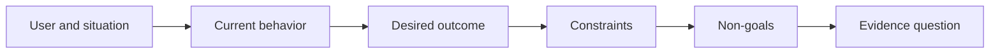

# 先定义目标成果，再选择交付物

> 实现速度越快，选错问题所付出的代价就越大。先塑造清楚目标成果，才能让速度指向正确方向。

**Type:** 学习 + 构建
**Languages:** Python（标准库）
**Prerequisites:** 无
**Time:** 约 60 分钟

## 学习目标

- 在不点名具体方案的前提下写出目标成果框架。
- 识别用户、情境、当前行为和期望发生的变化。
- 明确写出约束与非目标。
- 在方案泄漏固化为范围之前识别它。

## 交付物不等于目标成果

“构建一个事件响应助手”说的是一种交付物。它没有说明谁需要它、什么会因此变得更好，也没有说明哪些安全条件必须保持不变。

目标成果框架会这样表述：

> 当生产环境告警到达时，值班工程师能在两分钟内识别发生故障的服务，并确定一个安全的下一步操作；同时，诊断过程始终保持只读且可审计。

这个目标可以通过软件、运行手册、数据修复或更小的界面改动来实现。它让团队始终围绕结果工作，而不是被某个人最先想到的制品形式绑住。

## 六部分框架

| 部分 | 要回答的问题 |
|---|---|
| 用户 | 谁在直接经历这个问题？ |
| 情境 | 问题会在何时、何地发生？ |
| 当前行为 | 现在实际会发生什么，包括临时变通方法？ |
| 期望成果 | 哪个可观察的状态应该得到改善？ |
| 约束 | 哪些安全、政策、成本或兼容性边界已经固定？ |
| 非目标 | 哪些看似诱人、但相邻的工作明确不在范围内？ |



## 识别方案泄漏

如果目标陈述包含尚未得到证据支持的产品形态、界面、模型选择、框架或架构，它就泄漏了方案。

- “用户每周收到一份 AI 摘要”泄漏了摘要这种形式以及每周一次的节奏。
- “用户在批准前理解账户变更”陈述的是结果。
- “部署一个向量数据库”泄漏了基础设施选择。
- “审核期间能够取得相关政策证据”陈述的是一种能力。

当兼容性确实锁定了某项技术时，约束可以点名该技术，但要同时记录它为什么已经固定。

## 约束保护目标成果

约束不是实现细节，而是真实世界目标的一部分：

- 诊断期间不得写入生产环境；
- 必须在事件响应的时间预算内给出结果；
- 现有审计事件继续作为权威记录；
- 不增加新的运行时依赖；
- 无障碍行为保持不变。

如果一个构建结果通过违反约束来达到目标成果，那么它实际上并没有达到该成果。

## 非目标划定边界

非目标可以防止一个原本有用的小切片不断膨胀成平台。好的非目标必须足够具体，能够据此拒绝工作：

- 不做自动修复；
- 不新建告警路由系统；
- 不取代事件指挥官；
- 当前切片不做历史分析。

## 动手构建

本实验会验证一个 `OutcomeFrame`，并写出 `outputs/outcome-frame.json`。

```bash
python3 code/main.py
python3 -m unittest discover code/tests -v
```

将期望成果替换为 “use the incident assistant”。验证器应当指出，提议的交付物已经泄漏进目标成果。

## 练习

1. 把待办列表中的一项功能请求改写成目标成果框架。
2. 增加一条会改变可选方案集合的约束。
3. 增加两个非目标，让第一个切片保持足够小。
4. 找出最早能够否证该期望成果的观察结果。
5. 写出三种能够满足同一个目标成果的不同交付物。

## 延伸阅读

- [Nuseibeh and Easterbrook, Requirements Engineering: A Roadmap](https://www.cs.toronto.edu/~sme/papers/2000/ICSE2000.pdf)，理解为何应把真实世界的目标作为软件工作的锚点。
- [Dardenne, van Lamsweerde, and Fickas, Goal-Directed Requirements Acquisition](https://doi.org/10.1016/0167-6423(93)90021-G)，了解如何把高层目标逐步细化为约束与可操作的需求。

## 保留的成果

保留 `outputs/outcome-frame.json`。下一课会用人们实际执行的工作流来检验这个框架。
