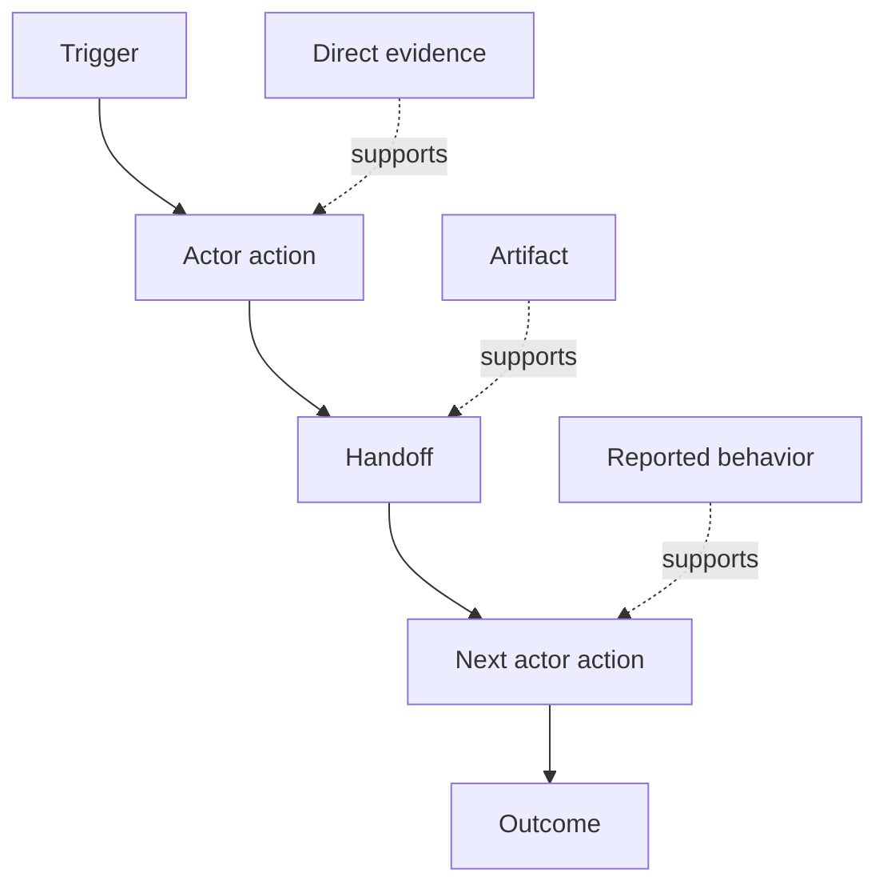

# 发现人们实际执行的工作流

> 需求并不会整齐地待在会议里等人收集。它们散落在行动、临时变通、记录和分歧之中。

**Type:** 学习 + 构建
**Languages:** Python（标准库）
**Prerequisites:** 第 14 阶段第 47 课
**Time:** 约 70 分钟

## 学习目标

- 把当前工作流建模为一组有证据支持的有序行动。
- 区分直接观察到的行为与转述或推断出来的行为。
- 找出摩擦、交接、决策权限和隐藏状态。
- 让不确定的主张保持可见，而不是悄悄把它们变成需求。

## 从当前系统开始

不要一开始就问人们想要什么功能。首先应当重建现在实际发生的过程。

针对每一个步骤，记录：

| 字段 | 示例 |
|---|---|
| 执行者 | 值班工程师 |
| 触发条件 | 生产环境告警到达 |
| 行动 | 打开告警，然后搜索仪表盘 |
| 输入 | 告警载荷和部署记录 |
| 输出 | 候选服务及其负责人 |
| 摩擦 | 在三个工具之间切换上下文 |
| 决策权限 | 事件指挥官批准写操作 |
| 证据 | 屏幕录像、事件日志、运行手册 |

工作流的范围比屏幕上看见的内容更大。它还包括等待、复制粘贴、旁路沟通、审批、错误恢复，以及那些人们已经习以为常、甚至不再察觉的步骤。

## 证据有强弱之分

可以使用一套简单的证据阶梯：

1. **直接行为：** 观察、追踪记录、录像或系统事件。
2. **制品：** 工单、运行手册、日志、表单或已完成的输出。
3. **自述行为：** 某个人描述自己实际是如何操作的。
4. **推断：** 团队根据已有信息判断可能发生了什么。

这四类信息都有价值，但只有前两类能够直接证明当前行为。其余信息必须明确标注，避免团队的置信度在不知不觉中被放大。



## 寻找四类信息

- **摩擦：** 重复劳动、延迟、重复录入或恢复操作。
- **隐藏状态：** 只存在于人的记忆、聊天记录或私人笔记中的事实。
- **决策权限：** 被允许实施重大变更的人或系统。
- **例外：** 正常工作流不再正常运作的情况。

AI 功能经常在交接点和例外场景中失败，因为团队塑造的往往只有理想路径。

## 不要用平均值抹掉分歧

两位用户可能出于合理原因执行不同的工作流。在理解差异属于以下哪一种情况之前，应当保留这些变体：

- 角色不同；
- 风险等级不同；
- 旧流程与现行流程并存；
- 专业经验不同；
- 确实存在政策分歧。

把不同变体平均后得到的工作流，可能与任何一个人的真实做法都不相符。

## 动手构建

本实验会为每个工作流步骤保存证据，验证步骤顺序和置信度，计算直接证据占比，并写出 `outputs/workflow-evidence.json`。

```bash
python3 code/main.py
python3 -m unittest discover code/tests -v
```

增加一条“部署记录缺失”的例外路径。保持主流程原有顺序不变，并记录分支从何处开始。

## 练习

1. 在不访谈任何人的情况下，根据一份日志重建一个工作流。
2. 访谈一位用户，并标出其中每一条仍然缺少直接证据的主张。
3. 增加一处决策权限边界和一个故障恢复步骤。
4. 为两个工作流变体分别建模，不要把它们合并。
5. 找出一个只移除可见步骤、却没有触及隐藏工作的拟议功能。

## 延伸阅读

- [Nuseibeh and Easterbrook, Requirements Engineering: A Roadmap](https://www.cs.toronto.edu/~sme/papers/2000/ICSE2000.pdf)，尤其关注其中把需求获取视为解释、建模和验证过程，而不是简单收集信息的论述。
- [Gotel and Finkelstein, An Analysis of the Requirements Traceability Problem](https://doi.org/10.1109/ICRE.1994.292398)，了解保留需求与其来源之间关系为何如此困难。

## 保留的成果

保留 `outputs/workflow-evidence.json`。下一课会把观察到的摩擦与不确定性转化为假设地图。
