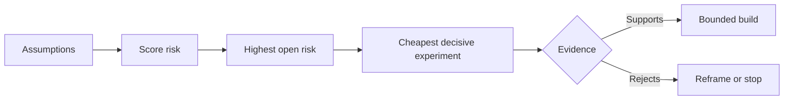

# 绘制假设地图，优先消解风险最高的假设

> 路线图把不确定性藏在功能之中。假设地图则揭示：在这些功能值得存在之前，哪些条件必须为真。

**Type:** 学习 + 构建
**Languages:** Python（标准库）
**Prerequisites:** 第 14 阶段第 48 课
**Time:** 约 65 分钟

## 学习目标

- 把拟议工作转化为明确的假设。
- 分别评估影响、不确定性和不可逆性。
- 根据风险而不是热情选择下一个实验。
- 用证据和决策替换已经验证的假设。

## 每一次构建都包含押注

一个事件响应工具可能依赖以下所有条件都成立：

- 告警上下文包含足以识别服务的信息；
- 工程师会信任并非由自己推导出来的建议；
- 期望的响应时间在实际运维中确实重要；
- 可以在不授予不安全权限的前提下访问所需数据；
- 这个工作流发生得足够频繁，值得持续维护。

这些不是实现任务，而是决定构建结果能否有价值、可使用、可实现且安全的前提条件。

## 假设类别

| 类别 | 要回答的问题 |
|---|---|
| 价值 | 这个目标成果是否重要到值得投入？ |
| 可用性 | 用户能否理解它并据此行动？ |
| 可行性 | 系统能否利用现有数据并在既定约束下产出结果？ |
| 持续性 | 组织能否持续承担成本、维持明确的责任归属并支撑运营？ |
| 安全性 | 它发生故障时能否避免不可接受的后果？ |

要把假设写成可以被证伪的陈述。“这个功能有用”无法检验；“十位值班工程师中有八位能借助只读结果更快识别出正确服务”则可以。

## 风险不是单一数字

本实验从三个维度进行一到五分的评分：

- **影响：** 假设为假时造成的损害。
- **不确定性：** 当前证据的薄弱程度。
- **不可逆性：** 作出投入之后才开始学习所付出的代价。

示例评分先将影响与不确定性相乘，再加上不可逆性。这个公式并非放之四海而皆准；它的作用是迫使团队解释，为什么某个未知问题必须先于另一个问题得到消解。



## 设计实验，而不是确认仪式

一个有用的测试需要具备：

- 一个有可能为假的主张；
- 一个目标群体或足够真实的样本；
- 一个可观察的结果；
- 一个在结果出现之前就确定好的阈值；
- 针对通过、失败和证据模糊三种情况分别预先确定的下一步决策。

应当避免那些只能证明团队有能力把想法做出来、却无法检验核心假设的测试。

## 可逆性会改变先后顺序

后果严重且不可逆的选择需要更早取得证据。只读回放可以先于生产集成；临时适配器可以先于数据迁移；由人批准的建议可以先于自动执行。

构建的形态应当服从不确定性的形态。

## 动手构建

本实验会对假设排序，区分已验证和仍待验证的主张，选出风险最高的开放假设，并写出 `outputs/assumption-map.json`。

```bash
python3 code/main.py
python3 -m unittest discover code/tests -v
```

更改风险最高假设所对应的证据，观察下一个实验会如何随之改变。

## 练习

1. 为一个你想构建的功能写出五条假设。
2. 增加一条功能清单遗漏的安全假设。
3. 定义一个会促使你停止构建的阈值。
4. 用一个成本更低但足以作出决断的测试，替换一个大型实验。
5. 比较风险排序与路线图优先级，并解释两者为何不一致。

## 延伸阅读

- [Barry Boehm, A Spiral Model of Software Development and Enhancement](https://dl.acm.org/doi/10.1145/12944.12948)，了解一种以风险驱动的开发循环：在作出更深投入之前先消解不确定性。
- [Dardenne, van Lamsweerde, and Fickas, Goal-Directed Requirements Acquisition](https://doi.org/10.1016/0167-6423(93)90021-G)，了解如何在细化目标的同时揭示障碍与约束。

## 保留的成果

保留 `outputs/assumption-map.json`。下一课会用它选出能够产生决定性证据的最小切片。
