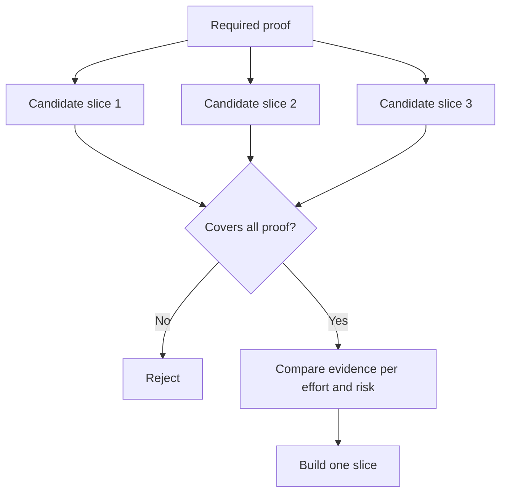

# 选择能够改变决策的最小切片

> 只有当“小”能够证明某件重要的事时，它才有价值。一个无法改变下一步决策的微型构建结果，不过是尚未完成而已。

**Type:** 学习 + 构建
**Languages:** Python（标准库）
**Prerequisites:** 第 14 阶段第 49 课
**Time:** 约 65 分钟

## 学习目标

- 根据一个切片能够验证哪些假设来定义它。
- 权衡目标成果价值、不确定性降低程度、投入和后果。
- 优先选择可逆的证据，而不是过早承诺投入生产环境。
- 拒绝那些省略工作流中高风险部分的切片。

## 纵向切片意味着端到端取得证据

一个有用的切片会跨越能够观察到目标成果所必需的最小真实工作流。它可以缩小用户范围、数据范围、持续时间和能力范围，但不能通过删掉正要检验的那项不确定性来变“小”。

例如：

- 对十起真实事件进行只读回放，可以检验服务识别能力和操作人员的信任。
- 在合成数据上制作精美仪表盘，或许能检验可理解性，却无法检验数据可行性。
- 生产环境中的自动修复器会同时检验所有内容，但其后果不可接受。

## 先定义必需的证明

选出风险最高且仍待验证的假设，把它们转化为一组必需证明。候选切片只有覆盖整组证明，才有资格进入比较。

随后从以下维度比较合格切片：

| 维度 | 偏好方向 |
|---|---|
| 目标成果价值 | 越高越好 |
| 不确定性降低程度 | 越高越好 |
| 投入 | 越低越好 |
| 后果 | 越低越好 |
| 可逆性 | 越高越好 |

本实验使用的评分有意保持简单。资格门槛比算术计算更重要。



## 常见的伪最小方案

- **UI-only 最小方案：** 删掉了数据与运维方面的不确定性。
- **只做基础设施的最小方案：** 只证明技术上做得到，却没有证明用户价值。
- **只做理想路径的最小方案：** 省略了产生大部分风险的例外情况。
- **只做演示的最小方案：** 能产出有说服力的制品，却没有可重复的测量。
- **先做平台的最小方案：** 在尚无任何一个工作流证明值得投入之前，就构建可复用的通用机制。

## 增加停止规则

在开始实现之前，先写清楚切片失败后会怎样：

- 放弃该目标成果；
- 改变目标用户或使用情境；
- 测试另一种机制；
- 收集更好的证据；
- 进一步收窄决策权限。

如果无论得到什么结果，下一步都是“继续构建”，那么这个切片就不是实验。

## 动手构建

本实验会根据必需证明筛选候选方案，为合格切片评分，并写出 `outputs/slice-decision.json`。

```bash
python3 code/main.py
python3 -m unittest discover code/tests -v
```

增加一个成本更低、但只证明一项必需假设的候选方案。即使它的数值评分很高，也应当继续被判定为不合格。

## 练习

1. 针对同一个目标成果，设计三个后果等级不同的切片。
2. 在为它们评分之前，先陈述必需证明集合。
3. 移除一项能力，同时保留足以作出决断的证据。
4. 为试点失败的情况增加一条停止规则。
5. 找出一个应当等到切片完成之后再构建的可复用平台组件。

## 延伸阅读

- [Barry Boehm, A Spiral Model of Software Development and Enhancement](https://dl.acm.org/doi/10.1145/12944.12948)，了解如何让每一轮开发循环与它必须消解的风险相匹配。
- [Lenarduzzi and Taibi, MVP Explained: A Systematic Mapping Study on the Definitions of Minimal Viable Product](https://arxiv.org/abs/1609.07592)，了解软件产品实践中对“minimum”和“viable”的定义为何存在歧义。

## 保留的成果

保留 `outputs/slice-decision.json`。它记录了为什么这个切片是能够改变决策的最小切片。
