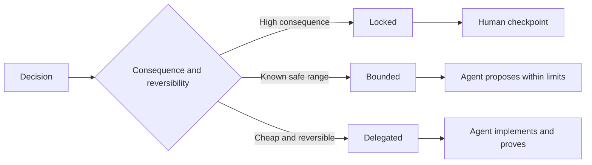

# 编写保留判断空间的规格说明

> 一份有用的规格说明会锁定不变量和验证证据，同时为可逆的实现选择保留余地。它规定的是决策边界，而不是一份事无巨细的剧本。

**Type:** 学习 + 构建
**Languages:** Python（标准库）
**Prerequisites:** 第 14 阶段第 50 课
**Time:** 约 75 分钟

## 学习目标

- 区分预期结果、不变量、示例、非目标和验证证据。
- 将决策标记为锁定、受限或委派。
- 在选择代价低且可逆时，为智能体保留判断空间。
- 在决策会造成重大后果或改变对外行为时，要求人工检查。

## 两个糟糕的极端

规格说明不足的任务会迫使智能体猜测系统应该如何工作。规格说明过度的任务则会要求它照抄一套可能本来就是错误的设计。

两者之间真正有用的做法，是建立一份可执行契约：

| 构成部分 | 用途 |
|---|---|
| 预期结果 | 可以观察到的结果 |
| 不变量 | 在任何情况下都必须始终成立的条件 |
| 示例 | 能够揭示真实意图的具体案例 |
| 非目标 | 有意排除的相邻行为 |
| 决策策略 | 哪些选择应当锁定、限制范围或委派给智能体 |
| 验证证据 | 宣告完成之前必须提供的证据 |

## 三种决策模式

- **锁定（Locked）：** 智能体不得自行选择。适用于对外兼容性、决策权、安全、不可逆成本或产品承诺等事项。
- **受限（Bounded）：** 智能体可以在明确的限制内选择。适用于搜索预算、重试次数、允许使用的依赖，或已知的接口类型范围。
- **委派（Delegated）：** 智能体拥有选择权，并且必须解释自己的选择。适用于局部结构、命名、可逆重构和实现细节。



## 用示例规定行为

示例比形容词更能浓缩和传达意图。“有帮助”“健壮”和“生产可用”都不是可以直接执行的要求。一小组覆盖正常情况、边界情况、失败情况和禁止情况的示例，能同时为构建者和验证者提供具体依据。

示例不能取代不变量。一个通过的案例无法证明一条普遍适用的安全规则。

## 验证证据必须与主张匹配

- 单元测试可以证明局部函数契约。
- wire test（线级测试）可以证明序列化和传输行为。
- 浏览器流程测试可以证明一条界面操作路径。
- 回放数据集可以证明系统在一组有代表性的案例上的行为。
- 审计日志可以证明授权边界得到遵守。

不要用较低层级的证据来证明较高层级的主张。

## 有意保留未知项

规格说明可以写道：“实现可以选择任何只读数据源，只要它能在时间预算内返回结果。”这并不是含糊不清，而是在明确边界和验证要求的前提下，有意将决策委派给实现者。

当证据发生变化时，规格说明也应随之演进。应保留锁定和受限选择背后的理由，让后续团队可以修改这些选择，而不必像考古一样追查它们的来龙去脉。

## 动手构建

本实验会验证契约的每一个构成部分、检查决策模式，并写出 `outputs/executable-specification.json`。

```bash
python3 code/main.py
python3 -m unittest discover code/tests -v
```

将“生产环境写入”决策从 locked 改为 delegated。解释为什么 schema 会接受这个值，而产品风险却不允许这样设置。

## 练习

1. 将一张待办事项工单转换为规格说明的六个构成部分。
2. 用一个不变量和两个示例，替换三条实现指令。
3. 标记每一项决策，并说明每个锁定或受限选择的理由。
4. 为每一个不变量补充一份验证凭据。
5. 删除一条既没有证据支持、也没有风险依据的约束。

## 延伸阅读

- [Nuseibeh and Easterbrook, Requirements Engineering: A Roadmap](https://www.cs.toronto.edu/~sme/papers/2000/ICSE2000.pdf)：了解目标、精确规格说明、验证、共识与演进之间的关系。
- [Zave and Jackson, Four Dark Corners of Requirements Engineering](https://doi.org/10.1145/267895.267896)：了解如何区分环境假设、需求和规格说明。
- [Gotel and Finkelstein, An Analysis of the Requirements Traceability Problem](https://doi.org/10.1109/ICRE.1994.292398)：了解如何保留一项需求存在的原因及其来源。

## 你将保留的成果

保留 `outputs/executable-specification.json`。它将成为编码智能体与人工审查者共同遵循的契约。
