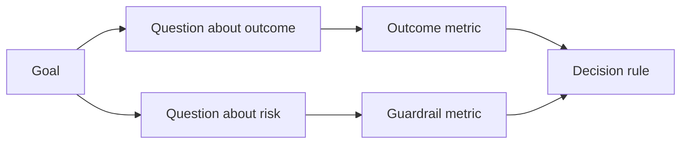

# 在结果出现之前设计成功指标

> 衡量应当为决策提供答案，而不是装点仪表盘。先明确目标，由目标推导问题，再选择能够回答这些问题的最精简指标集。

**Type:** 学习 + 构建
**Languages:** Python（标准库）
**Prerequisites:** 第 14 阶段第 47 课和第 51 课
**Time:** 约 70 分钟

## 学习目标

- 从结果目标推导出问题和指标。
- 在观察结果之前，定义阈值、窗口、数据来源和指标方向。
- 为结果指标配套护栏指标与制衡指标。
- 让评估证据与构建成果需要支持的决策相匹配。

## 目标、问题、指标

从一个目标开始：

> 在不增加不安全操作的前提下，缩短识别受影响服务所需的时间。

由此推导问题：

- 多快能够识别出正确的服务？
- 被识别出的服务有多大概率是正确的？
- 诊断过程是否始终保持只读？
- 该工作流是否会提高告警被主动忽略或关闭的比例，或增加操作人员的工作负担？

然后选择能将这些问题转化为可操作衡量方式的指标。



## 指标需要一份契约

每项指标都需要明确以下字段：

| 字段 | 示例 |
|---|---|
| 名称 | `median_identification_seconds` |
| 方向 | 至多 |
| 阈值 | 120 |
| 窗口 | 十次故障回放 |
| 数据来源 | 回放事件日志 |
| 评估总体 | 参与试点的值班工程师 |
| 类型 | 结果指标或护栏指标 |

没有数据来源和窗口，数值就无法复现；没有阈值，指标就无法驱动决策。

## 结果指标、护栏指标与制衡指标

- **结果指标：** 期望达到的状态是否有所改善？
- **护栏指标：** 必须遵守的固定约束是否仍然成立？
- **制衡指标：** 局部改进是否把成本或伤害转移到了其他地方？

对于故障处置工作流，仅仅追求速度并不够。还要衡量正确性、生产环境写入、操作人员工作负担以及遗漏告警，避免得到一个虽然快、却不安全的结果。

## 离线证据与在线证据

离线回放有助于保证可重复性并覆盖边界情况；范围受控的试点则有助于观察真实行为、信任程度和工作流影响。两者不能互相替代。

应选择成本最低、但足以回答当前决策问题的证据。不要仅仅因为实现已经就绪，就贸然将其用于真实用户。

## 衡量之前先定义决策

在看到结果之前，先写明通过、失败和结论不明确时分别走哪条路径。否则，团队很可能为了让当前实现过关而事后调整阈值。

例如：

- 通过：正确服务识别率至少为 0.9，且中位用时至多为 120 秒；
- 失败：发生任何生产环境写入，或正确率低于 0.75；
- 结论不明确：改善幅度较小且方差较大，需要扩大回放集。

## 动手构建

本实验会验证测量方案，使用包含边界值的比较规则评估阈值，记录缺失值，并写入 `outputs/measurement-report.json`。

```bash
python3 code/main.py
python3 -m unittest discover code/tests -v
```

移除护栏指标，然后观察：即使结果指标仍然存在，为什么该方案依然会变得无效。

## 练习

1. 从一个结果目标推导出三个问题。
2. 添加一项制衡指标，用于发现成本是否被转移给了另一个角色。
3. 为每项指标定义数据来源、评估总体和窗口。
4. 在生成数值之前，写明通过、失败和结论不明确的判定规则。
5. 找出一项容易采集、却无法改变决策的指标，并将其移除。

## 延伸阅读

- [Basili, Software Modeling and Measurement: The Goal/Question/Metric Paradigm](https://drum.lib.umd.edu/items/8119803a-362b-42ec-b6ce-2311713e7236)：了解如何从明确目标推导可操作的衡量方式。
- [Basili, Caldiera, and Rombach, The Goal Question Metric Approach](https://www.cs.toronto.edu/~sme/CSC444F/handouts/GQM-paper.pdf)：了解如何将该方法用作反馈与改进系统。

## 最终产出

保留 `outputs/measurement-report.json`。它定义了原型、试点或生产阶段的证据门槛。
