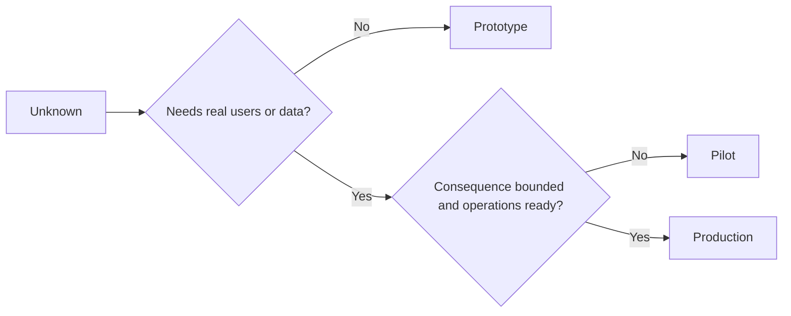

# 有意识地选择原型阶段、试点阶段或生产阶段

> 这三者代表不同的学习环境，而不是不同的打磨程度。应选择能够以最少不必要后果回答当前未知问题的阶段。

**Type:** 学习 + 构建
**Languages:** Python（标准库）
**Prerequisites:** 第 14 阶段第 50 至 52 课
**Time:** 约 70 分钟

## 学习目标

- 根据未知问题、受众、数据、后果和准备程度选择构建阶段。
- 定义各阶段专属的控制措施与退出标准。
- 防止原型阶段的系统在不知不觉中演变成生产系统。
- 在证据和运维能力足以支撑实际行动权限之前，推迟授予此类权限。

## 三个不同的问题

| 阶段 | 核心问题 |
|---|---|
| 原型阶段 | 这个机制究竟能否产生所需证据？ |
| 试点阶段 | 面对范围受限的真实受众和真实条件时，它能否安全运行？ |
| 生产阶段 | 我们能否按照承诺的可靠性和风险水平，持续对它负责？ |

原型阶段的实现即使在技术上已经完整，也仍然可以被丢弃。试点阶段可以使用生产数据，但受众范围和行动权限仍须受到限制。当组织开始承担持续责任时，系统才真正进入生产阶段。

## 原型阶段

当待解决的未知问题不需要真实用户或真实数据时，应使用原型阶段。原型应当保持以下特征：

- 可以丢弃；
- 与其他系统隔离；
- 行为范围狭窄；
- 明确说明要回答的学习问题；
- 不作虚假的运维保障承诺。

在机制证明自己值得进入下一阶段之前，不要过早优化架构。

## 试点阶段

当待解决的未知问题需要真实行为、贴近现实的数据或真实工作流，但潜在后果或准备程度尚不足以支持广泛发布时，应使用试点阶段。

试点阶段需要具备：

- 明确指定的受众；
- 明确的人类负责人；
- 有限的持续时间和行动权限；
- 审计与回滚能力；
- 结果指标和护栏指标的阈值；
- 用于决定扩大范围、修订方案或停止试点的退出标准。

## 生产阶段

进入生产阶段所需的不只是完成部署，还包括：

- 服务等级目标；
- 值班与事件处置责任归属；
- 安全与隐私审查；
- 成本与容量控制；
- 回滚与恢复能力；
- 持续监控；
- 退役路径。



## 阶段漂移

如果原型阶段的代码获得了用户、数据或行动权限，却没有同步建立责任归属，它就会变得危险。应在配置、访问控制、遥测和文档中明确标识原型阶段与试点阶段的边界。仅显示一条警告横幅并不足够。

系统自身应当能够清楚呈现它当前所处的阶段。

## 动手构建

本实验会根据决策上下文选择合适的阶段，返回该阶段所需的控制措施，并写入 `outputs/stage-decisions.json`。

```bash
python3 code/main.py
python3 -m unittest discover code/tests -v
```

将试点阶段示例改为潜在后果较轻且运维已准备就绪的情形。解释还需要哪些额外证据，才足以支持进入生产阶段。

## 练习

1. 按照学习阶段而非部署状态，为当前三个项目分类。
2. 编写试点阶段的退出标准，其中必须包含停止试点这一决策。
3. 添加一项技术控制，防止原型阶段的系统访问生产数据。
4. 找出使一项构建真正进入生产阶段的第一项运维责任。
5. 为范围受限的试点设计一份回滚回执。

## 延伸阅读

- [Barry Boehm, A Spiral Model of Software Development and Enhancement](https://dl.acm.org/doi/10.1145/12944.12948)：了解如何让每次迭代所作的投入承诺与已经消除的不确定风险相匹配。
- [Fagerholm et al., Building Blocks for Continuous Experimentation](https://doi.org/10.1145/2601248.2601276)：了解持续开展实验所需的组织条件与技术条件。

## 最终保留的成果

保留 `outputs/stage-decisions.json`。它记录了每个阶段为何合理，以及进入下一阶段之前必须具备哪些控制措施。
