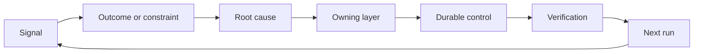

# 构建带责任归属与退役机制的反馈棘轮

> 交付会结束一轮构建循环，同时开启学习循环。证据必须真正改变系统，否则就只会沦为无人负责的遥测数据。

**Type:** 学习 + 构建
**Languages:** Python（标准库）
**Prerequisites:** 第 14 阶段第 46 课和第 53 课
**Time:** 约 75 分钟

## 学习目标

- 将事故、评估、用户行为和纠正转化为有明确责任归属的行动。
- 将每条信号分别路由到上下文、评估、策略、运行时或待办事项。
- 根据后果严重程度和复发频率确定优先级。
- 为每项控制措施设定退役条件。

## 反馈是一种基础设施

团队可以收集追踪记录、评估结果、支持工单和事故日志，却没有从中学到任何东西。缺失的是将反馈固化为改进的机制：需要建立一条明确路径，把观察结果转化为持久变更，并为变更指定责任人、提供验证证据。这条把证据转化为可验证、可复审的持久改进路径，就是反馈棘轮。

这个循环包括：

1. 观察一条具体信号；
2. 将它关联到某个结果、约束或假设；
3. 找出最早应对该根本原因负责的系统层；
4. 创建一项范围明确的变更；
5. 验证同类问题再次发生的可能性已经降低；
6. 复审这项控制措施是否仍应保留。

## 路由到责任归属层

| 信号 | 去向 |
|---|---|
| 误报、回归或错误结果 | 评估或测试 |
| 上下文缺失、重复工作或事实过时 | 上下文来源或检索路径 |
| 不安全操作或权限缺口 | 策略或权限边界 |
| 超时、重试风暴或依赖不可用 | 运行时控制措施 |
| 新的产品需求或尚未解决的权衡 | 经过塑形的待办事项 |

应在最早能够生效的层修复根因。如果测试或权限机制能够让某类失败变得不可能发生，就不要只是在提示词里再添加一段说明。



## 责任归属是控制措施的一部分

每项反馈棘轮行动都需要：

- 一名明确的责任人；
- 根据后果和复发情况确定的优先级；
- 需要修改的产物；
- 能够证明变更有效的验证方式；
- 复审窗口或到期窗口；
- 退役条件。

无人负责的改进，只是一条排版更好看的观察记录。

## 让过时的控制措施退役

反馈系统会不断积累策略，而这些策略可能变得相互矛盾且维护成本高昂。出现以下情况时，应复审控制措施：

- 架构或工作流发生变化；
- 更底层的不变量取代了更高层的指令；
- 在选定的观察周期内，控制措施所防范的故障一直没有出现；
- 控制措施阻碍正当工作的次数，超过了它防止损害的次数。

退役同样需要证据。不要仅仅因为一项控制措施看起来陈旧就将其删除。

## 连接构建反馈与编码代理反馈

同一套反馈棘轮可以服务于两条路径：

- 产品证据会改变结果框架、假设、工作切片或度量计划。
- 对编码代理的纠正会改变测试、上下文、范围、自动化或交接方式。
- 事故既可能改变产品边界，也可能改变代理工作台。

因此，对构建工作进行塑形并不是一个在编码开始前就会结束的阶段。每当一项变更被接受，这一过程都会继续。

## 动手构建

本实验会对信号进行分类，创建有明确责任归属的棘轮行动，确定其优先级，并写入 `outputs/feedback-backlog.json`。

```bash
python3 code/main.py
python3 -m unittest discover code/tests -v
```

添加一条运行时超时信号，确认它会被路由到运行时，而不是通用待办列表。

## 练习

1. 将一起事故和一条用户投诉分别转化为棘轮行动。
2. 指出能够阻止每个问题再次发生的最早有效层。
3. 在实验输出中加入用于验证的命令或观察结果。
4. 为一条策略规则定义退役条件。
5. 将一项已接受的纠正追溯并纳入下一项任务的框架。

## 延伸阅读

- [Basili、Caldiera 与 Rombach，《The Goal Question Metric Approach》](https://www.cs.toronto.edu/~sme/CSC444F/handouts/GQM-paper.pdf)：介绍如何通过面向目标的度量推动组织学习。
- [Fagerholm 等，《Building Blocks for Continuous Experimentation》](https://doi.org/10.1145/2601248.2601276)：介绍连接证据与持续产品开发的技术和组织循环。
- [Nuseibeh 与 Easterbrook，《Requirements Engineering: A Roadmap》](https://www.cs.toronto.edu/~sme/papers/2000/ICSE2000.pdf)：介绍如何将需求视为在整个系统生命周期中持续演进的内容。

## 你将带走什么

保留 `outputs/feedback-backlog.json`。它是“产品判断与交付”路径的收尾产物，也是下一轮结果框架的输入。
