# 通信协议

> 无法使用同一种语言沟通的智能体算不上团队，它们只是在虚空中彼此呼喊的陌生人。

**Type:** 构建
**Languages:** TypeScript
**Prerequisites:** 第 14 阶段（智能体工程）、第 16.01 课（为何需要多智能体）
**Time:** 约 120 分钟

## 学习目标

- 实现 MCP 工具发现与调用，让智能体能够使用外部服务器公开的工具。
- 构建 A2A Agent Card 和任务端点，让一个智能体能够通过 HTTP 将工作委派给另一个智能体。
- 比较 MCP（工具访问）、A2A（智能体间通信）、ACP（企业审计）与 ANP（去中心化信任），并解释每种协议分别解决什么问题。
- 在单一系统中连接多种协议，让智能体通过 MCP 发现工具，并通过 A2A 委派任务。

## 问题

你把系统拆成多个智能体：研究员、编码员、审查员。它们都擅长各自的工作，但现在必须真正相互沟通。

第一次尝试往往很直接：传递字符串。研究员返回一大段文本，编码员尽力解析。这种方式起初可用，直到编码员误解研究摘要，或两个智能体相互等待形成死锁，又或者需要让不同团队构建的智能体协作。此时，“直接传字符串”会骤然失效。

这就是通信协议问题。如果智能体交换信息时没有共享合约，多智能体系统就会非常脆弱、无法审计，也无法扩展到少数几个由你亲自编写的智能体之外。

AI 生态系统用四种协议应对这一问题的不同侧面：

- **MCP** 用于工具访问
- **A2A** 用于智能体间协作
- **ACP** 用于企业级可审计性
- **ANP** 用于去中心化身份与信任

本课将深入这些协议。你会阅读每份规范中的真实线协议格式，构建可运行的实现，并将四种协议连接成一个统一系统。

## 核心概念

### 协议版图

可以把这四种协议看作不同层次，每层回答一个不同问题：

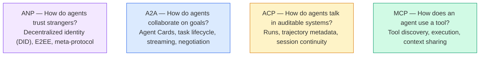

它们并不是竞争对手，而是在不同层级解决不同问题。

### MCP 回顾

阶段 13 已经深入介绍了 MCP。简单回顾：MCP 标准化了 LLM 连接外部工具与数据源的方式。它是一种**客户端—服务器**协议，智能体（客户端）发现并调用服务器公开的工具。

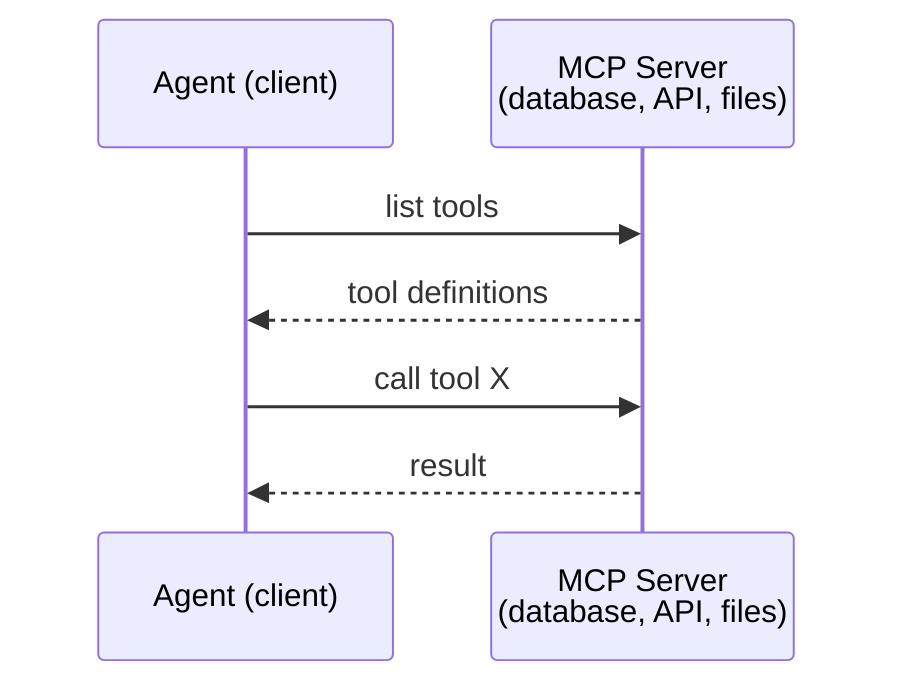

MCP 处理的是**智能体到工具**的通信，并不能帮助智能体彼此交流。

### A2A（Agent2Agent Protocol）

**创建者：** Google（现归 Linux Foundation 管理，命名空间为 `lf.a2a.v1`）
**规范版本：** 1.0.0
**问题：** 自主智能体如何相互协作、协商和委派任务？

A2A 是用于**对等智能体协作**的协议。MCP 将智能体连接到工具，而 A2A 将智能体连接到其他智能体。每个智能体都会在 well-known URL 发布一张 **Agent Card**，其他智能体通过它进行发现、协商和任务委派。

#### A2A 如何工作

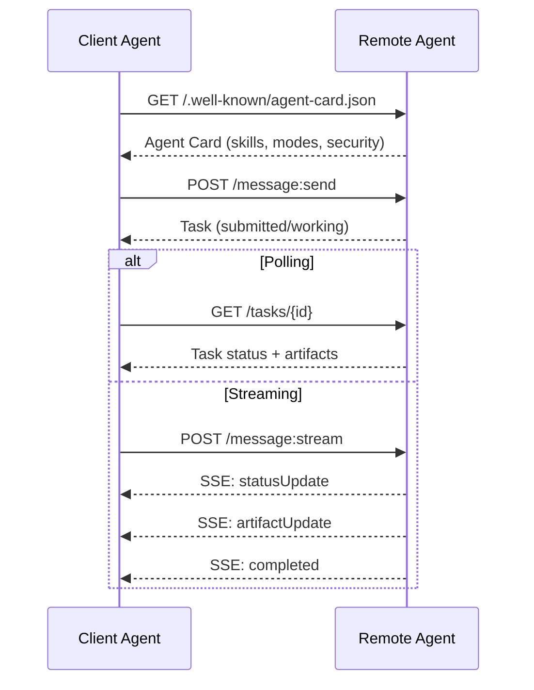

#### 真实的 Agent Card

下面是现实中的 A2A Agent Card，它由 `GET /.well-known/agent-card.json` 提供：

```json
{
  "name": "Research Agent",
  "description": "Searches documentation and summarizes findings",
  "version": "1.0.0",
  "supportedInterfaces": [
    {
      "url": "https://research-agent.example.com/a2a/v1",
      "protocolBinding": "JSONRPC",
      "protocolVersion": "1.0"
    },
    {
      "url": "https://research-agent.example.com/a2a/rest",
      "protocolBinding": "HTTP+JSON",
      "protocolVersion": "1.0"
    }
  ],
  "provider": {
    "organization": "Your Company",
    "url": "https://example.com"
  },
  "capabilities": {
    "streaming": true,
    "pushNotifications": false
  },
  "defaultInputModes": ["text/plain", "application/json"],
  "defaultOutputModes": ["text/plain", "application/json"],
  "skills": [
    {
      "id": "web-research",
      "name": "Web Research",
      "description": "Searches the web and synthesizes findings",
      "tags": ["research", "search", "summarization"],
      "examples": ["Research the latest changes in React 19"]
    },
    {
      "id": "doc-analysis",
      "name": "Documentation Analysis",
      "description": "Reads and analyzes technical documentation",
      "tags": ["docs", "analysis"],
      "inputModes": ["text/plain", "application/pdf"],
      "outputModes": ["application/json"]
    }
  ],
  "securitySchemes": {
    "bearer": {
      "httpAuthSecurityScheme": {
        "scheme": "Bearer",
        "bearerFormat": "JWT"
      }
    }
  },
  "security": [{ "bearer": [] }]
}
```

需要注意的要点：
- **Skills** 表明智能体能够做什么。每项 Skill 都有 ID、标签以及支持的输入／输出 MIME 类型，客户端智能体据此判断远程智能体能否处理请求。
- **supportedInterfaces** 列出多种协议绑定。单个智能体可以同时支持 JSON-RPC、REST 与 gRPC。
- **Security** 内置于 Card 中。客户端在发出第一个请求之前就知道需要哪种认证。

#### 任务生命周期

Task 是 A2A 中的核心工作单元，会在一组明确定义的状态之间转换：

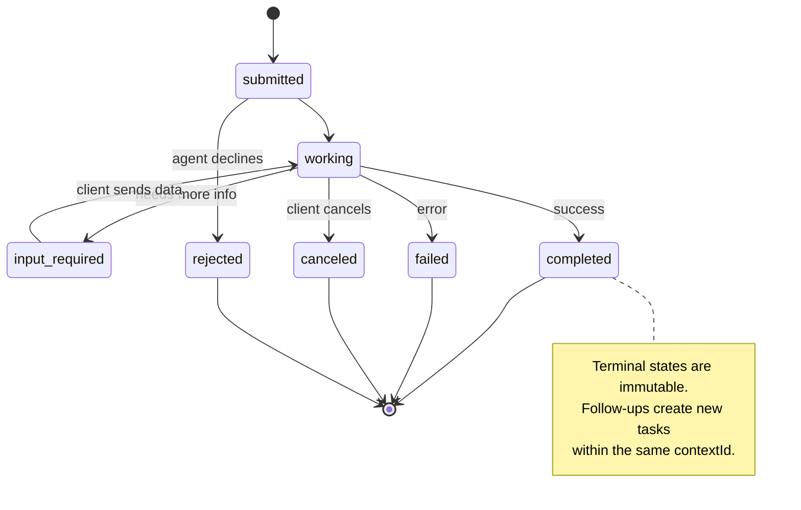

全部 8 种状态如下（规范还定义了作为哨兵值的 `UNSPECIFIED`，此处省略）：

| 状态 | 是否终态？ | 含义 |
|---|---|---|
| `TASK_STATE_SUBMITTED` | 否 | 已确认，但尚未开始处理 |
| `TASK_STATE_WORKING` | 否 | 正在处理 |
| `TASK_STATE_INPUT_REQUIRED` | 否 | 智能体需要客户端补充信息 |
| `TASK_STATE_AUTH_REQUIRED` | 否 | 需要进行身份认证 |
| `TASK_STATE_COMPLETED` | 是 | 已成功完成 |
| `TASK_STATE_FAILED` | 是 | 因错误而结束 |
| `TASK_STATE_CANCELED` | 是 | 完成前被取消 |
| `TASK_STATE_REJECTED` | 是 | 智能体拒绝该任务 |

任务一旦进入终态便不可变，不能再追加消息。后续交互应在同一个 `contextId` 下创建新任务。

#### 线协议格式

真实的消息交换如下：

**客户端发送任务：**
```json
{
  "jsonrpc": "2.0",
  "id": 1,
  "method": "SendMessage",
  "params": {
    "message": {
      "messageId": "msg-001",
      "role": "ROLE_USER",
      "parts": [{ "text": "Research React 19 compiler features" }]
    },
    "configuration": {
      "acceptedOutputModes": ["text/plain", "application/json"],
      "historyLength": 10
    }
  }
}
```

**智能体用 Task 响应：**
```json
{
  "jsonrpc": "2.0",
  "id": 1,
  "result": {
    "task": {
      "id": "task-abc-123",
      "contextId": "ctx-xyz-789",
      "status": {
        "state": "TASK_STATE_COMPLETED",
        "timestamp": "2026-03-27T10:30:00Z"
      },
      "artifacts": [
        {
          "artifactId": "art-001",
          "name": "research-results",
          "parts": [{
            "data": {
              "findings": [
                "React 19 compiler auto-memoizes components",
                "No more manual useMemo/useCallback needed",
                "Compiler runs at build time, not runtime"
              ]
            },
            "mediaType": "application/json"
          }]
        }
      ]
    }
  }
}
```

**通过 SSE 流式传输：**
```text
POST /message:stream HTTP/1.1
Content-Type: application/json
A2A-Version: 1.0

data: {"task":{"id":"task-123","status":{"state":"TASK_STATE_WORKING"}}}

data: {"statusUpdate":{"taskId":"task-123","status":{"state":"TASK_STATE_WORKING","message":{"role":"ROLE_AGENT","parts":[{"text":"Searching documentation..."}]}}}}

data: {"artifactUpdate":{"taskId":"task-123","artifact":{"artifactId":"art-1","parts":[{"text":"partial findings..."}]},"append":true,"lastChunk":false}}

data: {"statusUpdate":{"taskId":"task-123","status":{"state":"TASK_STATE_COMPLETED"}}}
```

### ACP（Agent Communication Protocol）

**创建者：** IBM / BeeAI
**规范版本：** 0.2.0（OpenAPI 3.1.1）
**状态：** 正在 Linux Foundation 旗下并入 A2A
**问题：** 智能体如何在具备完整可审计性、会话连续性与轨迹追踪的系统中通信？

ACP 是**企业协议**。与许多摘要中的说法不同，ACP **并不**使用 JSON-LD；它是一个通过 OpenAPI 定义、直截了当的 REST / JSON API。其特别之处在于 **TrajectoryMetadata**：每条智能体响应都能携带详细日志，记录生成该响应时经历的推理步骤和工具调用。

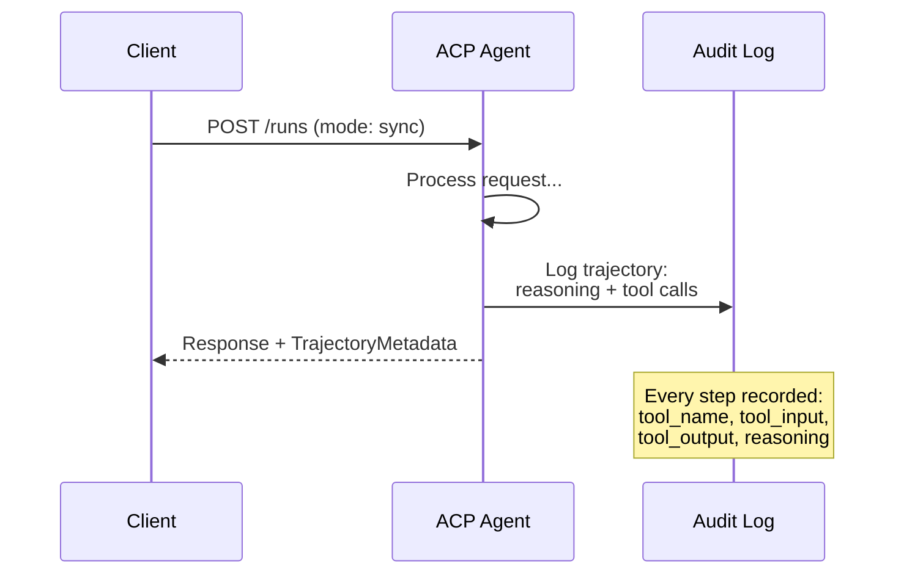

#### ACP 中的智能体发现

ACP 定义了四种发现方式：

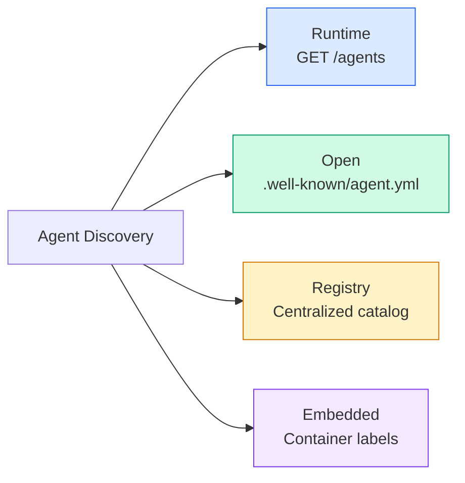

**AgentManifest** 比 A2A Agent Card 更简单：

```json
{
  "name": "summarizer",
  "description": "Summarizes documents with source citations",
  "input_content_types": ["text/plain", "application/pdf"],
  "output_content_types": ["text/plain", "application/json"],
  "metadata": {
    "tags": ["summarization", "RAG"],
    "framework": "BeeAI",
    "capabilities": [
      {
        "name": "Document Summarization",
        "description": "Condenses long documents into key points"
      }
    ],
    "recommended_models": ["llama3.3:70b-instruct-fp16"],
    "license": "Apache-2.0",
    "programming_language": "Python"
  }
}
```

#### Run 生命周期

ACP 使用“Run”而不是“Task”。Run 表示一次智能体执行，有三种模式：

| 模式 | 行为 |
|---|---|
| `sync` | 阻塞。响应包含完整结果。 |
| `async` | 立即返回 202；通过 `GET /runs/{id}` 轮询状态。 |
| `stream` | SSE 流；智能体工作时持续发出事件。 |

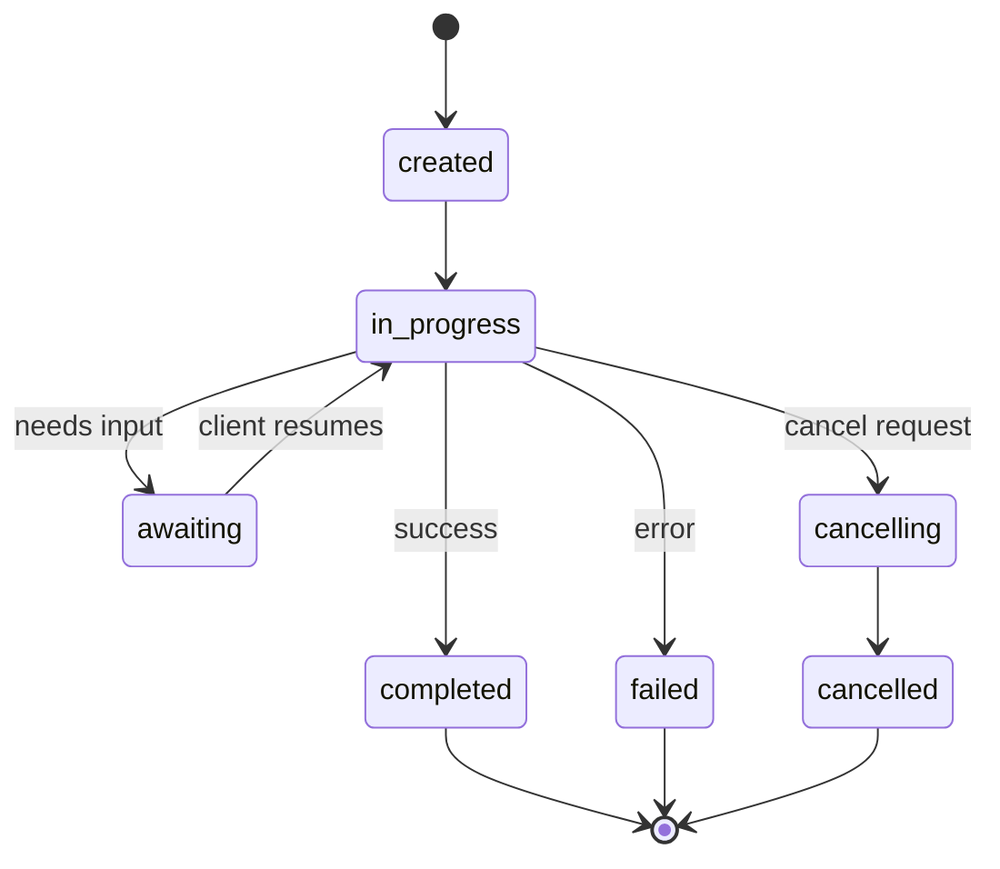

#### TrajectoryMetadata（审计轨迹）

这是 ACP 最具差异化的能力。每个消息 Part 都可以包含元数据，准确展示智能体做了什么：

```json
{
  "role": "agent/researcher",
  "parts": [
    {
      "content_type": "text/plain",
      "content": "The weather in San Francisco is 72F and sunny.",
      "metadata": {
        "kind": "trajectory",
        "message": "I need to check the weather for this location",
        "tool_name": "weather_api",
        "tool_input": { "location": "San Francisco, CA" },
        "tool_output": { "temperature": 72, "condition": "sunny" }
      }
    }
  ]
}
```

对于受监管行业而言，这极具价值。每个答案都带有一条可证明的推理链：调用了哪些工具、使用了什么输入、收到了什么输出，不再是黑箱。

ACP 还支持用于标注来源的 **CitationMetadata**：

```json
{
  "kind": "citation",
  "start_index": 0,
  "end_index": 47,
  "url": "https://weather.gov/sf",
  "title": "NWS San Francisco Forecast"
}
```

### ANP（Agent Network Protocol）

**创建者：** 开源社区（由 GaoWei Chang 发起）
**仓库：** [github.com/agent-network-protocol/AgentNetworkProtocol](https://github.com/agent-network-protocol/AgentNetworkProtocol)
**问题：** 来自不同组织的智能体如何在没有中心化权威机构的情况下相互信任？

ANP 是**去中心化身份协议**。它使用 W3C Decentralized Identifiers（DID）和端到端加密建立信任。A2A 通过已知端点发现智能体，而 ANP 则允许智能体以密码学方式证明自己的身份。

ANP 分为三层：

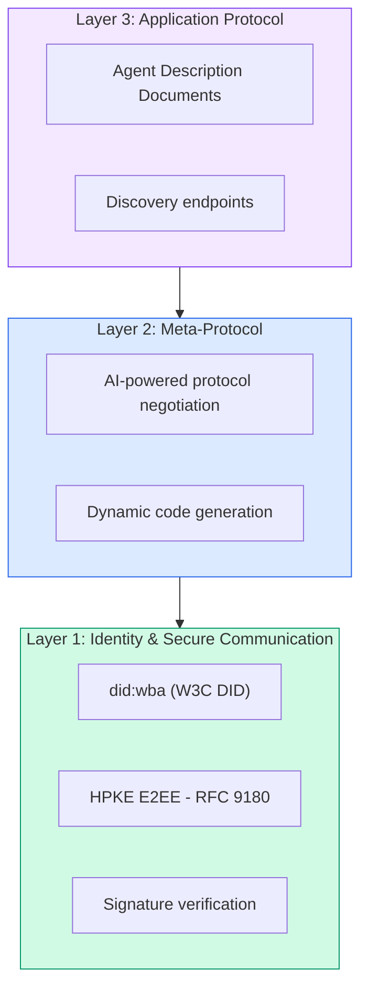

#### DID 文档（真实结构）

ANP 使用一种名为 `did:wba`（Web-Based Agent）的自定义 DID 方法。DID `did:wba:example.com:user:alice` 会解析到 `https://example.com/user/alice/did.json`：

```json
{
  "@context": [
    "https://www.w3.org/ns/did/v1",
    "https://w3id.org/security/suites/jws-2020/v1",
    "https://w3id.org/security/suites/secp256k1-2019/v1"
  ],
  "id": "did:wba:example.com:user:alice",
  "verificationMethod": [
    {
      "id": "did:wba:example.com:user:alice#key-1",
      "type": "EcdsaSecp256k1VerificationKey2019",
      "controller": "did:wba:example.com:user:alice",
      "publicKeyJwk": {
        "crv": "secp256k1",
        "x": "NtngWpJUr-rlNNbs0u-Aa8e16OwSJu6UiFf0Rdo1oJ4",
        "y": "qN1jKupJlFsPFc1UkWinqljv4YE0mq_Ickwnjgasvmo",
        "kty": "EC"
      }
    },
    {
      "id": "did:wba:example.com:user:alice#key-x25519-1",
      "type": "X25519KeyAgreementKey2019",
      "controller": "did:wba:example.com:user:alice",
      "publicKeyMultibase": "z9hFgmPVfmBZwRvFEyniQDBkz9LmV7gDEqytWyGZLmDXE"
    }
  ],
  "authentication": [
    "did:wba:example.com:user:alice#key-1"
  ],
  "keyAgreement": [
    "did:wba:example.com:user:alice#key-x25519-1"
  ],
  "humanAuthorization": [
    "did:wba:example.com:user:alice#key-1"
  ],
  "service": [
    {
      "id": "did:wba:example.com:user:alice#agent-description",
      "type": "AgentDescription",
      "serviceEndpoint": "https://example.com/agents/alice/ad.json"
    }
  ]
}
```

需要注意的要点：
- **密钥分离**会被强制执行。签名密钥（secp256k1）与加密密钥（X25519）彼此独立。
- **`humanAuthorization`** 是 ANP 独有的机制。这些密钥在使用前需要明确的人类批准（生物识别、密码、HSM）。资金转账等高风险操作会走这条路径。
- **`keyAgreement`** 密钥用于 HPKE 端到端加密（RFC 9180）。
- **service** 部分链接到 Agent Description 文档。

#### ANP 如何建立信任

ANP **不**采用信任网或背书图。信任是双边的，并在每次交互中验证：

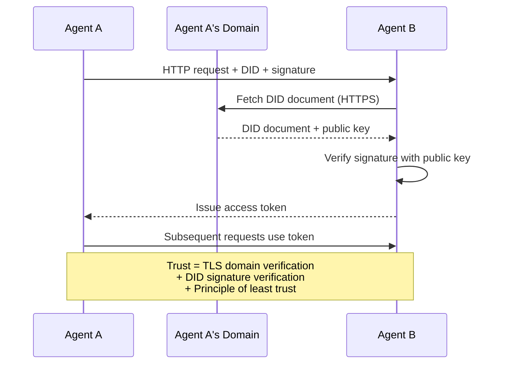

信任来自三个来源：
1. **域级 TLS** 验证 DID 文档所在的主机
2. **DID 密码学签名** 验证智能体身份
3. **最小信任原则** 只授予最低必要权限

这里没有基于流言传播的信任机制，也没有 PageRank 评分。你会通过其 DID 直接验证每个智能体。

#### 元协议协商

这是 ANP 最具创新性的功能。两个来自不同生态系统的智能体相遇时，无须预先约定数据格式，可以用自然语言协商：

```json
{
  "action": "protocolNegotiation",
  "sequenceId": 0,
  "candidateProtocols": "I can communicate using:\n1. JSON-RPC with hotel booking schema\n2. REST with OpenAPI 3.1 spec\n3. Natural language over HTTP",
  "modificationSummary": "Initial proposal",
  "status": "negotiating"
}
```

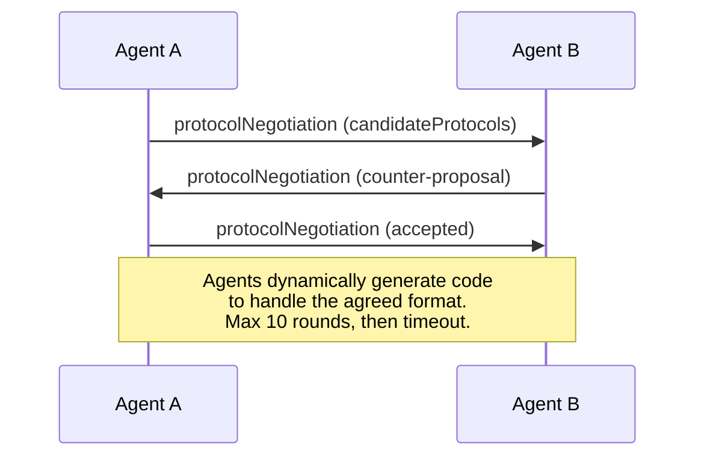

智能体来回协商（最多 10 轮），直到就格式达成一致，然后动态生成代码来处理该格式。状态值包括 `negotiating`、`rejected`、`accepted`、`timeout`。

这意味着两个此前从未相遇的智能体，无须任何人预先定义共享 schema，也能自行确定通信方式。

### 对比（已修正）

| | MCP | A2A | ACP | ANP |
|---|---|---|---|---|
| **创建者** | Anthropic | Google / Linux Foundation | IBM / BeeAI | 社区 |
| **规范格式** | JSON-RPC | JSON-RPC / REST / gRPC | OpenAPI 3.1（REST） | JSON-RPC |
| **主要用途** | 智能体到工具 | 智能体到智能体 | 智能体到智能体 | 智能体到智能体 |
| **发现** | 工具列表 | `/.well-known/agent-card.json` | `GET /agents`、`/.well-known/agent.yml` | `/.well-known/agent-descriptions`、DID 服务端点 |
| **身份** | 隐式（本地） | 安全方案（OAuth、mTLS） | 服务器级 | 带 E2EE 的 W3C DID（`did:wba`） |
| **审计轨迹** | 不适用 | 基础（任务历史） | TrajectoryMetadata（工具调用、推理） | 未正式规定 |
| **状态机** | 不适用 | 9 种任务状态 | 7 种 Run 状态 | 不适用 |
| **流式传输** | 不适用 | SSE | SSE | 与传输无关 |
| **独特能力** | 工具 schema | Agent Card + Skill | 轨迹审计记录 | 元协议协商 |
| **最适合** | 工具与数据 | 动态协作 | 受监管行业 | 跨组织信任 |
| **状态** | 稳定 | 稳定（v1.0） | 正在并入 A2A | 积极开发中 |

### 如何协同使用

这些协议并不互斥。现实的企业系统会同时使用多种协议：

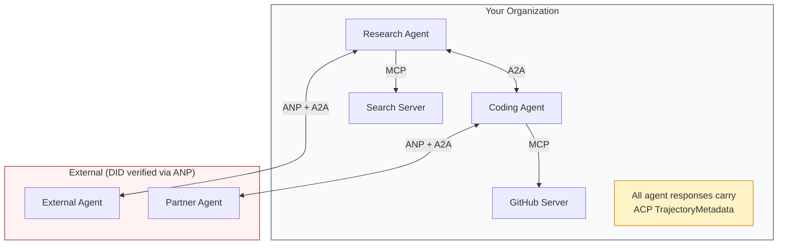

- **MCP** 将每个智能体连接到其工具
- **A2A** 处理智能体之间（内部与外部）的协作
- **ACP** 为响应包装轨迹元数据，以支持审计
- **ANP** 为你无法控制的智能体提供身份验证

```figure
swarm-message-bus
```

## 动手构建

### 第 1 步：核心消息类型

每个多智能体系统都从消息格式开始。我们定义与真实协议所用结构相映射的类型：

```typescript
import crypto from "node:crypto";

type MessageRole = "user" | "agent";

type MessagePart =
  | { kind: "text"; text: string }
  | { kind: "data"; data: unknown; mediaType: string }
  | { kind: "file"; name: string; url: string; mediaType: string };

type TrajectoryEntry = {
  reasoning: string;
  toolName?: string;
  toolInput?: unknown;
  toolOutput?: unknown;
  timestamp: number;
};

type AgentMessage = {
  id: string;
  role: MessageRole;
  parts: MessagePart[];
  trajectory?: TrajectoryEntry[];
  replyTo?: string;
  timestamp: number;
};

function createMessage(
  role: MessageRole,
  parts: MessagePart[],
  replyTo?: string
): AgentMessage {
  return {
    id: crypto.randomUUID(),
    role,
    parts,
    replyTo,
    timestamp: Date.now(),
  };
}

function textMessage(role: MessageRole, text: string): AgentMessage {
  return createMessage(role, [{ kind: "text", text }]);
}
```

请注意：`MessagePart` 与真实 A2A 和 ACP 规范一样支持多模态内容（文本、结构化数据、文件）。`TrajectoryEntry` 捕获推理链，对应 ACP 的 TrajectoryMetadata。

### 第 2 步：A2A Agent Card 与注册表

构建符合真实 A2A 规范的智能体发现机制：

```typescript
type Skill = {
  id: string;
  name: string;
  description: string;
  tags: string[];
  inputModes: string[];
  outputModes: string[];
};

type AgentCard = {
  name: string;
  description: string;
  version: string;
  url: string;
  capabilities: {
    streaming: boolean;
    pushNotifications: boolean;
  };
  defaultInputModes: string[];
  defaultOutputModes: string[];
  skills: Skill[];
};

class AgentRegistry {
  private cards: Map<string, AgentCard> = new Map();

  register(card: AgentCard) {
    this.cards.set(card.name, card);
  }

  discoverBySkillTag(tag: string): AgentCard[] {
    return [...this.cards.values()].filter((card) =>
      card.skills.some((skill) => skill.tags.includes(tag))
    );
  }

  discoverByInputMode(mimeType: string): AgentCard[] {
    return [...this.cards.values()].filter(
      (card) =>
        card.defaultInputModes.includes(mimeType) ||
        card.skills.some((skill) => skill.inputModes.includes(mimeType))
    );
  }

  resolve(name: string): AgentCard | undefined {
    return this.cards.get(name);
  }

  listAll(): AgentCard[] {
    return [...this.cards.values()];
  }
}
```

这比简单的“名称到能力”映射丰富得多。可以像真实 A2A 规范一样，按 Skill 标签、输入 MIME 类型或名称发现智能体。

### 第 3 步：A2A Task 生命周期

构建完整的任务状态机：

```typescript
type TaskState =
  | "submitted"
  | "working"
  | "input-required"
  | "auth-required"
  | "completed"
  | "failed"
  | "canceled"
  | "rejected";

const TERMINAL_STATES: TaskState[] = [
  "completed",
  "failed",
  "canceled",
  "rejected",
];

type TaskStatus = {
  state: TaskState;
  message?: AgentMessage;
  timestamp: number;
};

type Artifact = {
  id: string;
  name: string;
  parts: MessagePart[];
};

type Task = {
  id: string;
  contextId: string;
  status: TaskStatus;
  artifacts: Artifact[];
  history: AgentMessage[];
};

type TaskEvent =
  | { kind: "statusUpdate"; taskId: string; status: TaskStatus }
  | {
      kind: "artifactUpdate";
      taskId: string;
      artifact: Artifact;
      append: boolean;
      lastChunk: boolean;
    };

type TaskHandler = (
  task: Task,
  message: AgentMessage
) => AsyncGenerator<TaskEvent>;

class TaskManager {
  private tasks: Map<string, Task> = new Map();
  private handlers: Map<string, TaskHandler> = new Map();
  private listeners: Map<string, ((event: TaskEvent) => void)[]> = new Map();

  registerHandler(agentName: string, handler: TaskHandler) {
    this.handlers.set(agentName, handler);
  }

  subscribe(taskId: string, listener: (event: TaskEvent) => void) {
    const existing = this.listeners.get(taskId) ?? [];
    existing.push(listener);
    this.listeners.set(taskId, existing);
  }

  async sendMessage(
    agentName: string,
    message: AgentMessage,
    contextId?: string
  ): Promise<Task> {
    const handler = this.handlers.get(agentName);
    if (!handler) {
      const task = this.createTask(contextId);
      task.status = {
        state: "rejected",
        timestamp: Date.now(),
        message: textMessage("agent", `No handler for ${agentName}`),
      };
      return task;
    }

    const task = this.createTask(contextId);
    task.history.push(message);
    task.status = { state: "submitted", timestamp: Date.now() };

    this.processTask(task, handler, message).catch((err) => {
      task.status = {
        state: "failed",
        timestamp: Date.now(),
        message: textMessage("agent", String(err)),
      };
    });
    return task;
  }

  getTask(taskId: string): Task | undefined {
    return this.tasks.get(taskId);
  }

  cancelTask(taskId: string): boolean {
    const task = this.tasks.get(taskId);
    if (!task || TERMINAL_STATES.includes(task.status.state)) return false;
    task.status = { state: "canceled", timestamp: Date.now() };
    this.emit(taskId, {
      kind: "statusUpdate",
      taskId,
      status: task.status,
    });
    return true;
  }

  private createTask(contextId?: string): Task {
    const task: Task = {
      id: crypto.randomUUID(),
      contextId: contextId ?? crypto.randomUUID(),
      status: { state: "submitted", timestamp: Date.now() },
      artifacts: [],
      history: [],
    };
    this.tasks.set(task.id, task);
    return task;
  }

  private async processTask(
    task: Task,
    handler: TaskHandler,
    message: AgentMessage
  ) {
    task.status = { state: "working", timestamp: Date.now() };
    this.emit(task.id, {
      kind: "statusUpdate",
      taskId: task.id,
      status: task.status,
    });

    try {
      for await (const event of handler(task, message)) {
        if (TERMINAL_STATES.includes(task.status.state)) break;

        if (event.kind === "statusUpdate") {
          task.status = event.status;
        }
        if (event.kind === "artifactUpdate") {
          const existing = task.artifacts.find(
            (a) => a.id === event.artifact.id
          );
          if (existing && event.append) {
            existing.parts.push(...event.artifact.parts);
          } else {
            task.artifacts.push(event.artifact);
          }
        }
        this.emit(task.id, event);
      }
    } catch (err) {
      task.status = {
        state: "failed",
        timestamp: Date.now(),
        message: textMessage("agent", String(err)),
      };
      this.emit(task.id, {
        kind: "statusUpdate",
        taskId: task.id,
        status: task.status,
      });
    }
  }

  private emit(taskId: string, event: TaskEvent) {
    for (const listener of this.listeners.get(taskId) ?? []) {
      listener(event);
    }
  }
}
```

这实现了真实的 A2A Task 生命周期：submitted、working、input-required 与终态。Handler 是异步生成器，它会 yield 与 SSE 流式模型匹配的事件（状态更新和 Artifact 分块）。

### 第 4 步：ACP 风格审计轨迹

为通信包装轨迹追踪：

```typescript
type AuditEntry = {
  runId: string;
  agentName: string;
  input: AgentMessage[];
  output: AgentMessage[];
  trajectory: TrajectoryEntry[];
  status: "created" | "in-progress" | "completed" | "failed" | "awaiting";
  startedAt: number;
  completedAt?: number;
  sessionId?: string;
};

class AuditableRunner {
  private log: AuditEntry[] = [];
  private handlers: Map<
    string,
    (input: AgentMessage[]) => Promise<{
      output: AgentMessage[];
      trajectory: TrajectoryEntry[];
    }>
  > = new Map();

  registerAgent(
    name: string,
    handler: (input: AgentMessage[]) => Promise<{
      output: AgentMessage[];
      trajectory: TrajectoryEntry[];
    }>
  ) {
    this.handlers.set(name, handler);
  }

  async run(
    agentName: string,
    input: AgentMessage[],
    sessionId?: string
  ): Promise<AuditEntry> {
    const entry: AuditEntry = {
      runId: crypto.randomUUID(),
      agentName,
      input: structuredClone(input),
      output: [],
      trajectory: [],
      status: "created",
      startedAt: Date.now(),
      sessionId,
    };
    this.log.push(entry);

    const handler = this.handlers.get(agentName);
    if (!handler) {
      entry.status = "failed";
      return entry;
    }

    entry.status = "in-progress";
    try {
      const result = await handler(input);
      entry.output = structuredClone(result.output);
      entry.trajectory = structuredClone(result.trajectory);
      entry.status = "completed";
      entry.completedAt = Date.now();
    } catch (err) {
      entry.status = "failed";
      entry.trajectory.push({
        reasoning: `Error: ${String(err)}`,
        timestamp: Date.now(),
      });
      entry.completedAt = Date.now();
    }
    return entry;
  }

  getFullAuditLog(): AuditEntry[] {
    return structuredClone(this.log);
  }

  getAuditLogForAgent(agentName: string): AuditEntry[] {
    return structuredClone(
      this.log.filter((e) => e.agentName === agentName)
    );
  }

  getAuditLogForSession(sessionId: string): AuditEntry[] {
    return structuredClone(
      this.log.filter((e) => e.sessionId === sessionId)
    );
  }

  getTrajectoryForRun(runId: string): TrajectoryEntry[] {
    const entry = this.log.find((e) => e.runId === runId);
    return entry ? structuredClone(entry.trajectory) : [];
  }
}
```

每次智能体执行都会产生完整的审计条目：输入了什么、输出了什么，以及两者之间全部工具调用和推理步骤的轨迹。你可以按智能体、会话或单次 Run 查询。

### 第 5 步：ANP 风格身份验证

构建基于 DID 的身份与验证机制：

```typescript
type VerificationMethod = {
  id: string;
  type: string;
  controller: string;
  publicKeyDer: string;
};

type DIDDocument = {
  id: string;
  verificationMethod: VerificationMethod[];
  authentication: string[];
  keyAgreement: string[];
  humanAuthorization: string[];
  service: { id: string; type: string; serviceEndpoint: string }[];
};

type AgentIdentity = {
  did: string;
  document: DIDDocument;
  privateKey: crypto.KeyObject;
  publicKey: crypto.KeyObject;
};

class IdentityRegistry {
  private documents: Map<string, DIDDocument> = new Map();

  publish(doc: DIDDocument) {
    this.documents.set(doc.id, doc);
  }

  resolve(did: string): DIDDocument | undefined {
    return this.documents.get(did);
  }

  verify(did: string, signature: string, payload: string): boolean {
    const doc = this.documents.get(did);
    if (!doc) return false;

    const authKeyIds = doc.authentication;
    const authKeys = doc.verificationMethod.filter((vm) =>
      authKeyIds.includes(vm.id)
    );

    for (const key of authKeys) {
      const publicKey = crypto.createPublicKey({
        key: Buffer.from(key.publicKeyDer, "base64"),
        format: "der",
        type: "spki",
      });
      const isValid = crypto.verify(
        null,
        Buffer.from(payload),
        publicKey,
        Buffer.from(signature, "hex")
      );
      if (isValid) return true;
    }
    return false;
  }

  requiresHumanAuth(did: string, operationKeyId: string): boolean {
    const doc = this.documents.get(did);
    if (!doc) return false;
    return doc.humanAuthorization.includes(operationKeyId);
  }
}

function createIdentity(domain: string, agentName: string): AgentIdentity {
  const did = `did:wba:${domain}:agent:${agentName}`;
  const { publicKey, privateKey } = crypto.generateKeyPairSync("ed25519");

  const publicKeyDer = publicKey
    .export({ format: "der", type: "spki" })
    .toString("base64");

  const keyId = `${did}#key-1`;
  const encKeyId = `${did}#key-x25519-1`;

  const document: DIDDocument = {
    id: did,
    verificationMethod: [
      {
        id: keyId,
        type: "Ed25519VerificationKey2020",
        controller: did,
        publicKeyDer,
      },
      {
        id: encKeyId,
        type: "X25519KeyAgreementKey2019",
        controller: did,
        publicKeyDer,
      },
    ],
    authentication: [keyId],
    keyAgreement: [encKeyId],
    humanAuthorization: [],
    service: [
      {
        id: `${did}#agent-description`,
        type: "AgentDescription",
        serviceEndpoint: `https://${domain}/agents/${agentName}/ad.json`,
      },
    ],
  };

  return { did, document, privateKey, publicKey };
}

function signPayload(identity: AgentIdentity, payload: string): string {
  return crypto
    .sign(null, Buffer.from(payload), identity.privateKey)
    .toString("hex");
}
```

这对应真实的 ANP 身份模型：智能体拥有 DID 文档，其中身份认证、密钥协商和人工授权密钥彼此独立。`IdentityRegistry` 模拟 DID 解析（生产环境会通过 HTTP 从智能体域获取文档）。

### 第 6 步：协议网关

将全部四种协议连接成一个统一系统：

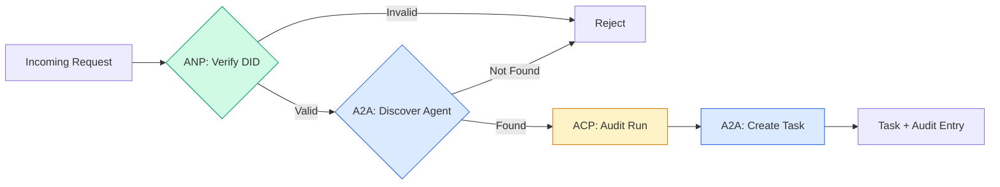

```typescript
class ProtocolGateway {
  private registry: AgentRegistry;
  private taskManager: TaskManager;
  private auditRunner: AuditableRunner;
  private identityRegistry: IdentityRegistry;

  constructor(
    registry: AgentRegistry,
    taskManager: TaskManager,
    auditRunner: AuditableRunner,
    identityRegistry: IdentityRegistry
  ) {
    this.registry = registry;
    this.taskManager = taskManager;
    this.auditRunner = auditRunner;
    this.identityRegistry = identityRegistry;
  }

  async delegateTask(
    fromDid: string,
    signature: string,
    targetAgent: string,
    message: AgentMessage,
    sessionId?: string
  ): Promise<{ task: Task; audit: AuditEntry } | { error: string }> {
    if (!this.identityRegistry.verify(fromDid, signature, message.id)) {
      return { error: "Identity verification failed" };
    }

    const card = this.registry.resolve(targetAgent);
    if (!card) {
      return { error: `Agent ${targetAgent} not found in registry` };
    }

    const audit = await this.auditRunner.run(
      targetAgent,
      [message],
      sessionId
    );
    const task = await this.taskManager.sendMessage(targetAgent, message);

    return { task, audit };
  }

  discoverAndDelegate(
    fromDid: string,
    signature: string,
    skillTag: string,
    message: AgentMessage
  ): Promise<{ task: Task; audit: AuditEntry } | { error: string }> {
    const candidates = this.registry.discoverBySkillTag(skillTag);
    if (candidates.length === 0) {
      return Promise.resolve({
        error: `No agents found with skill tag: ${skillTag}`,
      });
    }
    return this.delegateTask(
      fromDid,
      signature,
      candidates[0].name,
      message
    );
  }
}
```

网关在一次调用中完成四件事：
1. **ANP**：通过 DID 签名验证调用方身份
2. **A2A**：发现目标智能体并检查能力
3. **ACP**：把执行包装在带轨迹的审计记录中
4. **A2A**：创建具备完整生命周期追踪的 Task

### 第 7 步：组装整个系统

```typescript
async function protocolDemo() {
  const registry = new AgentRegistry();
  registry.register({
    name: "researcher",
    description: "Searches and summarizes findings",
    version: "1.0.0",
    url: "https://researcher.local/a2a/v1",
    capabilities: { streaming: true, pushNotifications: false },
    defaultInputModes: ["text/plain"],
    defaultOutputModes: ["text/plain", "application/json"],
    skills: [
      {
        id: "web-research",
        name: "Web Research",
        description: "Searches the web",
        tags: ["research", "search", "summarization"],
        inputModes: ["text/plain"],
        outputModes: ["application/json"],
      },
    ],
  });
  registry.register({
    name: "coder",
    description: "Writes code from specs",
    version: "1.0.0",
    url: "https://coder.local/a2a/v1",
    capabilities: { streaming: false, pushNotifications: false },
    defaultInputModes: ["text/plain", "application/json"],
    defaultOutputModes: ["text/plain"],
    skills: [
      {
        id: "code-gen",
        name: "Code Generation",
        description: "Generates code",
        tags: ["coding", "generation"],
        inputModes: ["text/plain", "application/json"],
        outputModes: ["text/plain"],
      },
    ],
  });

  const taskManager = new TaskManager();
  const auditRunner = new AuditableRunner();

  const researchTrajectory: TrajectoryEntry[] = [];

  taskManager.registerHandler(
    "researcher",
    async function* (task, message) {
      yield {
        kind: "statusUpdate" as const,
        taskId: task.id,
        status: { state: "working" as const, timestamp: Date.now() },
      };

      researchTrajectory.push({
        reasoning: "Searching for React 19 documentation",
        toolName: "web_search",
        toolInput: { query: "React 19 compiler features" },
        toolOutput: {
          results: ["react.dev/blog/react-19", "github.com/react/react"],
        },
        timestamp: Date.now(),
      });

      researchTrajectory.push({
        reasoning: "Extracting key findings from search results",
        toolName: "doc_analysis",
        toolInput: { url: "react.dev/blog/react-19" },
        toolOutput: {
          summary:
            "React 19 compiler auto-memoizes, no manual useMemo needed",
        },
        timestamp: Date.now(),
      });

      yield {
        kind: "artifactUpdate" as const,
        taskId: task.id,
        artifact: {
          id: crypto.randomUUID(),
          name: "research-results",
          parts: [
            {
              kind: "data" as const,
              data: {
                findings: [
                  "React 19 compiler auto-memoizes components",
                  "No more manual useMemo/useCallback needed",
                  "Compiler runs at build time, not runtime",
                ],
                sources: ["react.dev/blog/react-19"],
              },
              mediaType: "application/json",
            },
          ],
        },
        append: false,
        lastChunk: true,
      };

      yield {
        kind: "statusUpdate" as const,
        taskId: task.id,
        status: { state: "completed" as const, timestamp: Date.now() },
      };
    }
  );

  auditRunner.registerAgent("researcher", async () => ({
    output: [
      textMessage("agent", "React 19 compiler auto-memoizes components"),
    ],
    trajectory: researchTrajectory,
  }));

  const identityRegistry = new IdentityRegistry();

  const coderIdentity = createIdentity("coder.local", "coder");
  const researcherIdentity = createIdentity("researcher.local", "researcher");

  identityRegistry.publish(coderIdentity.document);
  identityRegistry.publish(researcherIdentity.document);

  const gateway = new ProtocolGateway(
    registry,
    taskManager,
    auditRunner,
    identityRegistry
  );

  console.log("=== Protocol Demo ===\n");

  console.log("1. Agent Discovery (A2A)");
  const researchAgents = registry.discoverBySkillTag("research");
  console.log(
    `   Found ${researchAgents.length} agent(s):`,
    researchAgents.map((a) => a.name)
  );

  console.log("\n2. Identity Verification (ANP)");
  const message = textMessage("user", "Research React 19 compiler features");
  const signature = signPayload(coderIdentity, message.id);
  const verified = identityRegistry.verify(
    coderIdentity.did,
    signature,
    message.id
  );
  console.log(`   Coder DID: ${coderIdentity.did}`);
  console.log(`   Signature verified: ${verified}`);

  console.log("\n3. Task Delegation (A2A + ACP + ANP)");
  const result = await gateway.delegateTask(
    coderIdentity.did,
    signature,
    "researcher",
    message,
    "session-001"
  );

  if ("error" in result) {
    console.log(`   Error: ${result.error}`);
    return;
  }

  console.log(`   Task ID: ${result.task.id}`);
  console.log(`   Task state: ${result.task.status.state}`);
  console.log(`   Artifacts: ${result.task.artifacts.length}`);

  console.log("\n4. Audit Trail (ACP)");
  console.log(`   Run ID: ${result.audit.runId}`);
  console.log(`   Status: ${result.audit.status}`);
  console.log(`   Trajectory steps: ${result.audit.trajectory.length}`);
  for (const step of result.audit.trajectory) {
    console.log(`     - ${step.reasoning}`);
    if (step.toolName) {
      console.log(`       Tool: ${step.toolName}`);
    }
  }

  console.log("\n5. Full Audit Log");
  const fullLog = auditRunner.getFullAuditLog();
  console.log(`   Total runs: ${fullLog.length}`);
  for (const entry of fullLog) {
    const duration = entry.completedAt
      ? `${entry.completedAt - entry.startedAt}ms`
      : "in-progress";
    console.log(`   ${entry.agentName}: ${entry.status} (${duration})`);
  }
}

protocolDemo().catch((err) => {
  console.error("Protocol demo failed:", err);
  process.exitCode = 1;
});
```

## 常见故障

协议只解决顺利路径。以下是生产环境中会出问题的地方：

**Schema 漂移。** Agent A 发布的 Agent Card 声明输出为 `application/json`，但 JSON schema 在版本之间发生变化。Agent B 仍按旧格式解析，得到无意义的数据。解决方法是为 Skill 和输出 schema 设置版本。A2A 规范正因如此才在 Agent Card 上支持 `version`。

**违反状态机。** 智能体 Handler yield 一个 `completed` 事件后，又尝试 yield 更多 Artifact。Task 已不可变，代码只能静默丢弃更新或抛出异常。解决方法是在 yield 前检查终态。上面的 `TaskManager` 通过终态后的 `break` 强制执行这条规则。

**信任解析失败。** Agent A 尝试验证 Agent B 的 DID，但 Agent B 的域已宕机，无法获取 DID 文档。此时是故障开放（接受未验证智能体），还是故障关闭（全部拒绝）？ANP 按最小信任原则建议故障关闭。

**轨迹膨胀。** ACP 轨迹日志能力强大，但代价昂贵。复杂智能体每次 Run 调用 200 个工具，会产生巨大的审计条目。解决方法是使用可配置的详细程度记录轨迹：合规场景记录工具名称和输入／输出；非监管工作负载则省略推理步骤。

**发现惊群。** 50 个智能体启动时同时查询 `GET /agents`。解决方法是使用带 TTL 的 Agent Card 缓存，错开发现间隔，或使用推送式注册而非轮询。

## 实际使用

### 真实实现

**A2A** 最为成熟。Google 的[官方规范](https://github.com/google/A2A)已开源并归 Linux Foundation 管理，同时提供 Python 和 TypeScript SDK。如果智能体需要动态发现与协作，应从这里开始。

**ACP** 正在并入 A2A。IBM 的 [BeeAI 项目](https://github.com/i-am-bee/acp)创建了 ACP，作为 REST 优先的替代方案；轨迹元数据概念正在被 A2A 生态吸收。即使使用 A2A 作为传输，也可以采用 ACP 模式（轨迹日志、Run 生命周期）。

**ANP** 的实验性最强。[社区仓库](https://github.com/agent-network-protocol/AgentNetworkProtocol)提供 Python SDK（AgentConnect）。元协议协商确实是新颖概念，值得关注它在跨组织智能体部署中的进展。

**MCP** 已在阶段 13 介绍。如果希望智能体使用工具，MCP 就是标准。

### 选择正确的协议

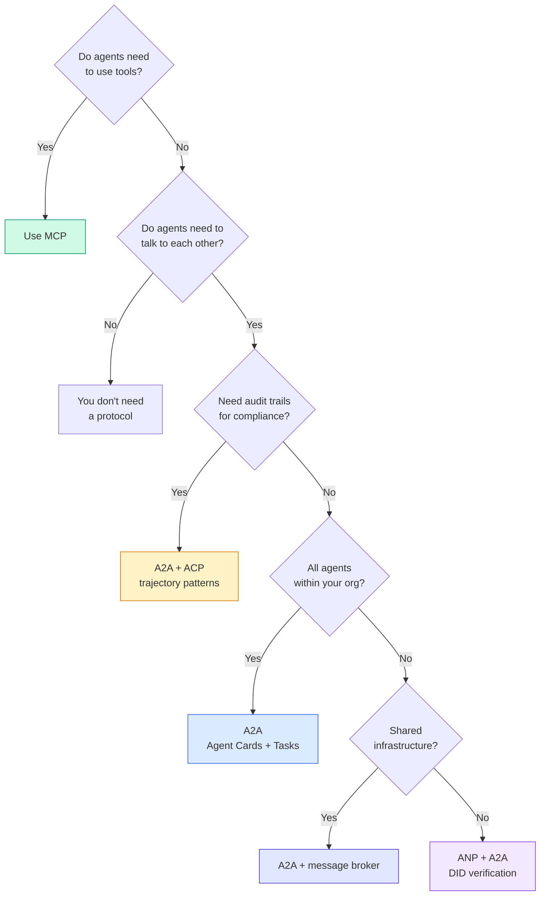

## 交付成果

本课产出：
- `code/main.ts`——四种协议模式的完整实现
- `outputs/prompt-protocol-selector.md`——帮助你为系统选择协议的提示

## 练习

1. **多跳任务委派。** 扩展 `TaskManager`，让智能体 Handler 能把子任务委派给其他智能体。研究员收到一项任务后，把“搜索”和“总结”子任务委派给两个专门智能体，等待二者完成，再把结果合并进自己的 Artifact。

2. **流式审计轨迹。** 修改 `AuditableRunner` 以支持流模式。不要等待完整结果，而要随着轨迹条目的加入，实时 yield `AuditEntry` 更新。使用异步生成器生成审计快照。

3. **DID 轮换。** 为 `IdentityRegistry` 增加密钥轮换。智能体应能发布带新密钥的新 DID 文档，同时保留 `previousDid` 引用。验证方在宽限期内应同时接受当前密钥与前一密钥的签名。

4. **协议协商。** 实现 ANP 的元协议概念。两个智能体交换带有候选格式的 `protocolNegotiation` 消息（例如“我支持 JSON-RPC”与“我更偏好 REST”）。最多 3 轮后，双方要么达成格式共识，要么超时。协商出的格式决定使用 `TaskManager` 还是 `AuditableRunner`。

5. **限速发现。** 添加一个 `RateLimitedRegistry` 包装器，使用可配置 TTL 缓存 Agent Card 查询，并限制每个智能体每秒发起的发现查询数。模拟 100 个智能体启动时相互发现造成的惊群，并测量前后差异。

## 关键术语

| 术语 | 常见说法 | 实际含义 |
|------|----------------|----------------------|
| MCP | “AI 工具协议” | 让智能体发现和使用工具的客户端—服务器协议。用于智能体到工具，而非智能体到智能体。 |
| A2A | “Google 的智能体协议” | Linux Foundation 旗下的对等智能体协作协议。通过 Agent Card 发现，具有 9 状态 Task 生命周期，并以 SSE 流式传输；支持 JSON-RPC、REST 和 gRPC 绑定。 |
| ACP | “企业智能体消息协议” | IBM / BeeAI 为智能体 Run 设计的 REST API，带 TrajectoryMetadata；每个响应都包含完整推理链与工具调用。正在并入 A2A。 |
| ANP | “去中心化智能体身份” | 社区协议，使用 `did:wba`（DID）提供密码学身份、HPKE 提供 E2EE，并用 AI 驱动的元协议协商连接从未见过彼此的智能体。 |
| Agent Card | “智能体的名片” | 位于 `/.well-known/agent-card.json` 的 JSON 文档，描述 Skill、支持的 MIME 类型、安全方案和协议绑定。 |
| DID | “去中心化 ID” | W3C 可验证密码学身份标准，托管在智能体自己的域上。ANP 使用 `did:wba` 方法。 |
| TrajectoryMetadata | “审计回执” | ACP 用于把推理步骤、工具调用及其输入／输出附加到每条智能体响应的机制。 |
| 元协议 | “智能体协商如何通信” | ANP 让智能体使用自然语言动态商定数据格式，再生成处理这些格式的代码。 |
| Task | “工作单元” | A2A 的有状态对象，从提交到完成全程追踪工作；进入终态后不可变。 |

## 延伸阅读

- [Google A2A 规范](https://github.com/google/A2A)——官方规范与 SDK（v1.0.0，Linux Foundation）
- [IBM / BeeAI ACP 规范](https://github.com/i-am-bee/acp)——智能体 Run 与轨迹元数据的 OpenAPI 3.1 规范
- [Agent Network Protocol](https://github.com/agent-network-protocol/AgentNetworkProtocol)——基于 DID 的身份、E2EE 与元协议协商
- [Model Context Protocol 文档](https://modelcontextprotocol.io/)——Anthropic 的 MCP 规范（阶段 13 已介绍）
- [W3C Decentralized Identifiers](https://www.w3.org/TR/did-core/)——ANP 所基于的身份标准
- [RFC 9180（HPKE）](https://www.rfc-editor.org/rfc/rfc9180)——ANP 用于 E2EE 的加密方案
- [FIPA Agent Communication Language](http://www.fipa.org/specs/fipa00061/SC00061G.html)——现代智能体协议的学术前身
